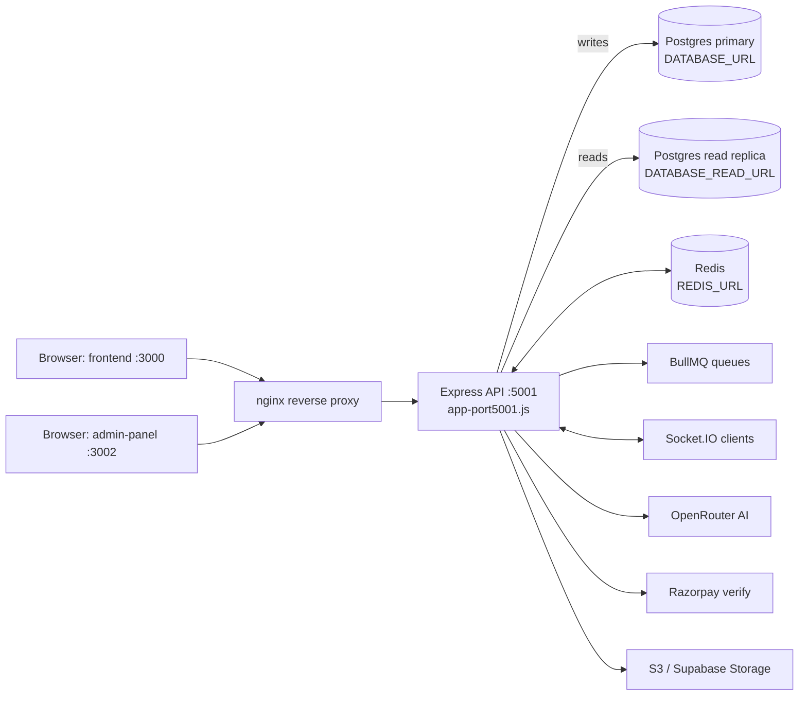
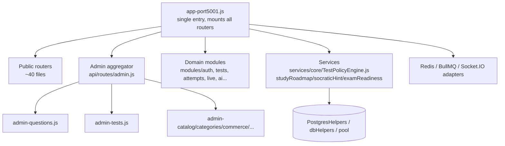

# Trstprep V2.1 — Architecture

> **As-of:** 2026-09-06. Verified against live source (spot-checked `file:line` refs below).
> Counts regen: `node scripts/run-database-audit.js`, `dir /b apps\backend\src\api\routes\*.js`,
> `dir /b apps\backend\src\infrastructure\database\migrations\*.sql`, `/graphify --update`.
> **Knowledge graph (2026-09-06): 10862 nodes / 20266 edges / 1744 files / ~5.9M words**
> (see `graphify-out/GRAPH_REPORT.md`; query with `/graphify query "<q>"`).
> No secrets in this file — env var _names_ only, never values.

---

## 1. Stack & package managers

| Layer                      | Tech                                                                                                                                                                                                    |
| -------------------------- | ------------------------------------------------------------------------------------------------------------------------------------------------------------------------------------------------------- |
| Frontend                   | React 18 + Vite 6.4.2 + Tailwind 3.x + TanStack Query + React Router v6 + Axios 1.18 (`apps/frontend`, port **3000**)                                                                                   |
| Admin panel                | React 18 + Vite 6.4.2 + Tailwind 3.x + TanStack Query (`apps/admin-panel`, port **3002**)                                                                                                               |
| Backend                    | Node.js 20 (`.nvmrc`) + Express, single entry `apps/backend/src/app-port5001.js` (port **5001**)                                                                                                        |
| Database                   | PostgreSQL via Supabase — RLS, pgvector `vector(1536)` + ivfflat/HNSW indexes; read/write split (`DATABASE_URL` writes, `DATABASE_READ_URL` reads, falls back to primary)                               |
| Cache / realtime / queue   | Redis (`REDIS_URL`, `lazyConnect`, graceful degradation) + Socket.IO 4.x + BullMQ 5.x (`MessageBroker`: Redis Pub/Sub + BullMQ; queues: analytics, leaderboard, notifications, recommendations, outbox) |
| Storage / email / payments | S3 / Supabase Storage / local disk via `storageProvider` (path-traversal guard); Nodemailer 9.x / SendGrid / SES (spool + retry); Razorpay (order → server-side `orders.fetch` verification)            |
| AI                         | OpenRouter multi-provider (`OPENROUTER_*`) + per-user rate limiter (`AI_RATE_LIMIT_*`: free ~50/h, pro ~500/h)                                                                                          |
| Monorepo tooling           | **pnpm 11.25 workspaces + Turborepo ^2.10.12**; Python AI/doc tooling via **uv** (`.venv`). Do NOT use npm — all install/run commands are `pnpm`.                                                       |
| Charts (both SPAs)         | `chart.js` + `recharts` + `socket.io-client` are installed and used (`apps/frontend/package.json`)                                                                                                      |

---

## 2. Repo layout

```text
apps/
  frontend/        User SPA — port 3000 (vite.config.js: port 3000; NOT 5173)
  admin-panel/     Admin SPA — port 3002; admin UI lives at src/features/admin/
  backend/         Express API — port 5001, entry src/app-port5001.js
packages/
  shared-config/   Shared constants/utils (apiClient, logger, errors, coming-soon-config…)
  shared-hooks/    Shared React hooks (useAuth, useProPass)
scripts/           Canonical dev/ops scripts (run-database-audit.js, dev-sequential.mjs,
                   wait-for-backend.mjs). NOTE: dev-tools/ does NOT exist — use scripts/.
deploy/            docker-compose + nginx (primary deployment path)
graphify-out/      Knowledge graph (do NOT deploy)
```

Admin UI path (correct): `apps/admin-panel/src/features/admin/` (~60+ components, incl.
`LiveProctoringConsole`, `SubjectHierarchyManager`, `ServerLogsManager`).
`apps/frontend/src/features/admin/` does **NOT** exist — do not reference it.

---

## 3. Runtime topology



**Deployment: Docker + nginx is primary** (`deploy/`). Vercel configs are vestigial
(leftovers, not the deploy path) — do not follow any old "Vercel-primary" notes.
Historical Railway/Vercel-primary deployment guides were removed from this doc;
see `deploy/` for the live path.

Frontend dev proxy: `apps/frontend/vite.config.js` forwards `/api` + Socket.IO to the
backend URL with proxy-error suppression — frontend `dev` script waits on the backend
first (`node ../../scripts/wait-for-backend.mjs && vite`).

---

## 4. Backend structure



- **Route files:** 80+ in `apps/backend/src/api/routes/` (spot-check:
  `dir /b apps\backend\src\api\routes\*.js`). Admin is **split routers**
  (`admin-questions.js`, `admin-tests.js`, `admin-test-series.js`, …) aggregated by
  `admin.js` — there is no monolith admin route file.
- **Migrations:** `000`–`137` on disk (126 `.sql` files; re-verified 2026-09-09 —
  includes `136_audit_remediation_followup` + `137_rename_subject_topics_index`)
  (`apps/backend/src/infrastructure/database/migrations/`), next is `138_*`.
  Files `004`–`017` are absent as standalone files; the baseline is reconstructed via
  `003_baseline_harmonization.sql` + `098_reconstructed_baseline.sql` +
  `108_ensure_complete_baseline.sql` + `121_ensure_test_category_series_junction.sql`.
  Numbering exceptions are intentional: no bare `056_*`/`057_*` files (canonical slots
  are `056a_*`, `056b_*`, `057b_*`) and `042_placeholder_retired.sql` is a no-op for a
  retired slot. Index waves `131`/`133` use plain (non-`CONCURRENTLY`)
  `CREATE INDEX IF NOT EXISTS` — transaction-safe but briefly lock writes (the
  "CONCURRENTLY" wording in `131`'s header comment describes intent, not the executed DDL).
  Always run `scripts/run-database-audit.js` before any migration/DDL; never assume a
  table/index exists.
- **Tables:** ~154 in live DB (regen: database audit script). Key junctions:
  `test_category_series` (migration 008/121), `nodes` + `user_node_skill` (106),
  `practice_ai_cache`, certificates/achievements consolidation (094/101).
- **God nodes (high-fanout — trace before editing):** `dbHelpers` (~131 edges),
  `pool`, `protect()`, `admin()`, `useAuth()`, `PostgresHelpers`, `apiClient`,
  `getRedisClient()`. See `graphify-out/GRAPH_REPORT.md`.

---

## 5. Auth & admin middleware chain

```mermaid
flowchart LR
  Req[Request] --> NF[normalizeFields] --> RO[restrictAdminOrigin] --> AK[validateAdminApiKey]
  --> P[protect JWT] --> AD[admin incl. superAdmin] --> CS[validateCsrfToken]
  --> LP[loadAdminPermissions] --> RP[requireAdminPermission] --> AU[auditMiddleware] --> H[Handler]
```



- Canonical order in `apps/backend/src/api/routes/admin.js:65-80`:
  `normalizeFields → restrictAdminOrigin → validateAdminApiKey → protect → admin →
validateCsrfToken → loadAdminPermissions → requireAdminPermission → auditMiddleware`.
  Do not bypass or reorder.
- Roles include **`superAdmin`** (above `admin`); RBAC permission matrix enforced by
  `loadAdminPermissions`/`requireAdminPermission`.
- Public-but-personalized endpoints use `optionalAuth`
  (`apps/backend/src/middleware/auth.middleware.js`): leaderboards
  (`api/routes/leaderboards-public.js:10`), series/test detail, question comments.
- Shipped across the stack: CSRF tokens, refresh-token rotation, email flows,
  Razorpay verification, Socket.IO auth, Redis sessions, BullMQ queues, 2FA
  (migration `064`), `audit_trail` writes on mutating admin actions.

---

## 6. Fixed linkage issues (were P0s, now resolved 2026-09-06)

| #   | Issue                                              | Fix (`file:line`)                                                                                             |
| --- | -------------------------------------------------- | ------------------------------------------------------------------------------------------------------------- |
| 1   | Live-tests alias mounted mock instead of real flow | FIXED — `api/routes/live-tests-public.js:162-163` mounts `liveMockRoutes` deliberately as the live alias      |
| 2   | Leaderboards unreachable publicly                  | FIXED — `api/routes/leaderboards-public.js:10` uses `optionalAuth` (public read, personalized when logged in) |
| 3   | `testCategories` orphan-reassign unprotected       | FIXED — `api/routes/testCategories.js:140` has `protect, admin`                                               |
| 4   | Avatar 404s                                        | FIXED — avatar fallback path shipped                                                                          |
| 5   | Vercel build failure on prop-types                 | FIXED — prop-types dependency fix shipped                                                                     |

---

## 7. Known duplication (do not "fix" blindly)

- **`adminNavConfig` exists in multiple copies** — `packages/shared-config` (intended
  single source) plus live copies at `apps/frontend/src/shared/config/adminNavConfig.js`
  and `apps/admin-panel/src/shared/config/adminNavConfig.js`. Treat the duplication as
  **known tech debt**: consolidate toward `packages/shared-config` in a dedicated
  migration PR; do not hand-edit one copy and assume the others follow.

---

## 8. Waves 17–20 — intelligence, proctoring, ranking (SHIPPED)

| Wave  | What shipped                                                                   | Where                                                                                                                                                                                                                                               |
| ----- | ------------------------------------------------------------------------------ | --------------------------------------------------------------------------------------------------------------------------------------------------------------------------------------------------------------------------------------------------- |
| 17–18 | Intelligence services: study roadmap, Socratic hints, exam readiness (+ tests) | `apps/backend/src/services/core/studyRoadmapService.js`, `socraticHintService.js`, `examReadinessService.js`; exposed via `api/routes/intelligence.js`; tests `src/__tests__/studyRoadmap.test.js`, `socraticHint.test.js`, `examReadiness.test.js` |
| 19    | Proctoring pipeline (live console + events)                                    | Admin `LiveProctoringConsole` + backend live/proctor routes                                                                                                                                                                                         |
| 20    | Ranking/leaderboard recompute via queue                                        | BullMQ leaderboard queue + `leaderboards-public.js` (optionalAuth)                                                                                                                                                                                  |

Shipped AI surface (all else is vision — see `docs/AI_PROMPTS.md` + `docs/vision/`):
`POST /api/ai/mentor` + `/api/ai/explanation` (`app-port5001.js:1015-1016`) and
`/api/ai/logs`, plus the intelligence helpers above. Rate-limited by `aiRateLimiter`.

---

## 9. Test lifecycle & policy (contract pointer)

The normative contract is `docs/test-quiz-lifecycle.md` (10 attempt states incl.
`ABANDONED`; `TEST_STATES` are lowercase wire values). Enforcement:
`apps/backend/src/constants/lifecycle.constants.js:6-107`,
`apps/backend/src/services/core/TestPolicyEngine.js`, and
`attemptLifecycle` / `testPolicyEngine` / `mockTestEngineSimulation` tests.

---

## 10. Node Engine status (one line; detail in AI_PROMPTS)

V1 implemented (`nodes` table, migration `106`); V2 partial (`user_node_skill` only,
no `ai_meta`); V3–V6 vision only. Detail: `docs/AI_PROMPTS.md`, `docs/vision/NODE_ENGINE_V4-V6.md`.

---

## 11. Environment variable names (names ONLY — values never belong in docs)

`DATABASE_URL`, `DATABASE_READ_URL`, `REDIS_URL`, `OPENROUTER_*`, `AI_RATE_LIMIT_*`,
`VITE_*` (frontend build-time), plus JWT/cookie/CSRF, Razorpay, email (SMTP/SendGrid/SES),
storage (S3/Supabase), admin origin/API-key. See backend `.env.example` for the
authoritative list. **Never commit or paste real values, hostnames, keys, or PII.**

---

## 12. Further reading (link, don't paste)

- `docs/DEVELOPMENT.md` — setup, scripts, admin component map
- `docs/test-quiz-lifecycle.md` — lifecycle contract
- `docs/AI_PROMPTS.md` + `docs/vision/NODE_ENGINE_V4-V6.md` — AI shipped vs vision
- `docs/FINAL_SITE_READINESS_REPORT.md` — living readiness scorecard
- `docs/SITE_READINESS_REPORT.md` — HISTORICAL first pass (frozen 2026-08-23)
- `docs/DATABASE_SCHEMA_AUDIT.md`, `docs/UNIFIED_TRSTPREP_AUDIT.md`, `docs/REMEDIATION_PLAN.md`, `docs/SECURITY_POSTURE.md`, `docs/audit/`, `docs/legacy-migrations/` — audits & history
- `graphify-out/GRAPH_REPORT.md` — god nodes, hyperedges, suggested questions
