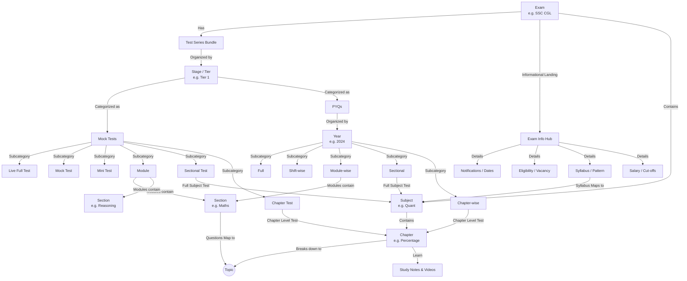

# Trstprep Advanced Content Hierarchy & Interlinking (V2.0)

To compete with top-tier test prep platforms, Trstprep's architecture moves beyond a simple "Exam → Test Series" linear funnel into a **Topic-Centric Knowledge Graph** powered by analytics and adaptive recommendations.

## 1. The Core Advanced Hierarchy (The Topic Graph)

Instead of study materials isolated only to Test Series, everything routes through **Subjects and Topics**.

---

## 2. Advanced Page & Route Architecture

### Level 1: Discovery & Exam Hubs
* **Global Hub:** `/exams` (Search and discover all exams)
### Level 2: The Exam Hub (The Pitch & Information Center)
* **Exam Hub:** `/exam/:examId` (e.g., `/exam/ssc-cgl`)
  * This is the master informative landing page for the exam, serving both SEO and user guidance before they enter the preparation loop.
  * **Core Exam Info Sub-Modules:**
    * **Overview:** General introduction and organizing body.
    * **Notifications & Updates:** Latest official news, admit card releases, and result announcements.
    * **Important Dates:** Application start/end, exam dates, interview dates.
    * **Eligibility:** Age limits, educational qualifications, physical standards (if any).
    * **Vacancies:** Year-wise, category-wise, and post-wise breakdown.
    * **Exam Pattern:** Stage-wise (Tier 1 vs Tier 2), marking scheme, negative marking, and duration.
    * **Syllabus:** Deep, topic-wise breakdown mapped directly to the active Chapters in the platform.
    * **Cut-offs:** Previous years' category-wise cut-off trends.
    * **Salary & Job Profile:** Pay scales (e.g., Level 7: ₹44,900-1,42,400), perks, and career growth.
  * **SEO Sub-pages:** `/exam/:examId/study-plan`, `/exam/:examId/analysis`, `/exam/:examId/preparation-strategy`

### Level 2: The Core Preparation Engine & Dashboard
* **Main Dashboard:** `/dashboard`
  * *Features:* "Continue Learning", "Daily Quiz", "Recommended for You" (based on recent test performance), and "Weak Topics".
* **Topic-Centric Learning:** `/topic/:topicId` (e.g., `/topic/percentage`)
  * A master page for a single topic showing *all* related Videos, Notes, PYQs, and Quizzes for that specific concept.

### Level 3: Previous Year Questions (PYQs)
* **Dedicated PYQ System:** `/pyq`
  * Discover by Exam & Year: `/pyq/ssc/cgl/2024`
  * **Granular PYQ Subcategories:**
    * *Full Paper:* The complete exam paper as originally presented.
    * *Shift-wise:* Broken down by morning/evening shifts if applicable.
    * *Module-wise:* Specific modules (e.g. Maths + Reasoning module).
    * *Sectional:* Organized by full subject (e.g. all 2024 Tier 1 Quant questions).
    * *Chapter-wise:* The deepest level (e.g. only Percentage PYQs from 2024).

### Level 4: Execution (Assessment)
* **Test Series:** `/test-series/:seriesId`
* **Test Interface:** `/test/:testId`
* **Daily Engagement:** `/daily-quiz`, `/current-affairs`, `/practice` 
  * Drives Daily Active Users (DAU) outside of premium mock tests.
* **Competition:** `/live-tests`, `/leaderboard`

### Level 5: Analytics & The Learning Loop
* **Performance Dashboard:** `/analysis`
  * *Features:* Accuracy, Time Management, Percentile, Rank, Improvement Trend.
* **The Weak Area Engine (Automated Diagnosis):**
  * After submitting a test `/test-result/:testId`, the system identifies weak topics (e.g., "Geometry").
  * **The Loop:** It immediately prompts the user to visit `/topic/geometry` to watch the concept video and take a targeted Topic Quiz.

### Level 6: Retention & Revision utilities
* **Bookmarks & Revision:** `/bookmarks`
  * Users can flag difficult questions during tests and review them here.
* **Content Tagging:** 
  * Under the hood, every question in the database must be tagged with `[exam, stage, subject, topic, difficulty, year]`. This drives the entire adaptive engine.

---

## 3. Monetization & Access Control

* **Free Layer:** Daily Quizzes, Current Affairs, Topic Study Notes, limited PYQs.
* **Premium Layer (Pro Pass):** Full Mock Tests, advanced Analytics/Diagnosis, complete Test Series bundles, and personalized Recommendation Engines.

*Last Updated: March 10, 2026 | Update date is (19:18)*
