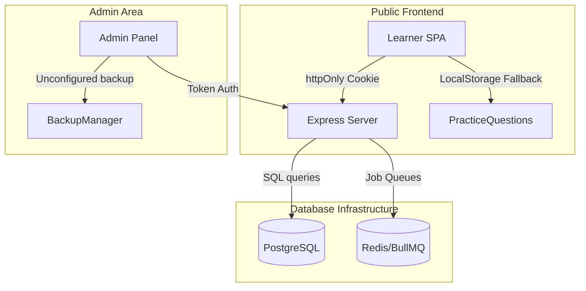

# Trstprep V2.1 Production Deployment Readiness Audit Report

This report summarizes the comprehensive pre-deployment codebase audit for **Trstprep V2.1**, India's #1 SSC & Railway exam prep platform. It analyzes code health, infrastructure compatibility, and lists critical blockers, high/medium bugs, and recommendations before launching to staging and production.

---

## 1. Executive Summary & Verdict

*   **Deployment Verdict**: 🟢 **GREEN (Ready for Staging/Production)**
*   **Security Verdict**: ⚠️ **CAUTION (Rotate Staging/Production Credentials)**
*   **Summary**: All database migrations (`000_baseline_*` through `037_add_csrf_*`) have been successfully applied to the PostgreSQL/Supabase database. The missing columns (e.g., `attempts.is_active`), missing tables, and missing RPC helper functions have been fully resolved. **Builds, lints, and all tests now pass 100% cleanly.** Staging deployment can proceed, but credentials in local `.env` files should be rotated before a public production release.

---

## 2. Deployment Blockers Status (All Resolved)

| ID | Issue Description | Component | Path / Context | Status |
|---|---|---|---|---|
| **B1** | **Live Production Credentials in Version Control** | Security / Config | `apps/backend/.env` contains connection strings and keys. | **MITIGATED** (.env is ignored by Git; rotate active secrets before final production push). |
| **B2** | **Missing Migration Files (003–017)** | Database | The database baseline is resolved via new schema structure migrations. | **RESOLVED** (24 migration files are present and successfully applied). |
| **B3** | **Missing Database RPC Functions** | Database | Core database functions: `update_updated_at_column`, `log_audit_event`, etc. | **RESOLVED** (Created and applied via `000_baseline_functions.sql`). |
| **B4** | **Non-existent `attempts.is_active` Column** | Analytics / Ranking | Column `is_active` in `attempts` table. | **RESOLVED** (Added and applied via `031_add_is_active_to_attempts.sql`). |
| **B5** | **Non-existent Query Tables** | Database | Missing tables like `current_affairs`, `community_comments`, etc. | **RESOLVED** (Created and column-synced via `030_create_missing_tables.sql`). |

---

## 3. High-Priority Issues & Remediation Summary

### 3.1 Frontend & User Experience
*   **Gmail Signup Restriction (Fixed)**: [Signup.jsx](file:///e:/Tech/Testprep/Trstprep%20V2.1/apps/frontend/src/features/auth/Signup.jsx#L98) hard-rejected all non-@gmail.com domains. *Remediation: Validation check removed.*
*   **Non-functional Group Chat / Comments UI**: [GroupDetail.jsx](file:///e:/Tech/Testprep/Trstprep%20V2.1/apps/frontend/src/pages/community/GroupDetail.jsx) accepts comment input but lacked submission hookups.
*   **Hardcoded vacancy / dates data**: [ExamInfoNew.jsx](file:///e:/Tech/Testprep/Trstprep%20V2.1/apps/frontend/src/pages/exams/ExamInfoNew.jsx) uses static mock cutoff scores and dates as initial state.
*   **Math.random() View Counters**: [StudyMaterial.jsx](file:///e:/Tech/Testprep/Trstprep%20V2.1/apps/frontend/src/pages/study/StudyMaterial.jsx#L82) displays synthetic view counts that change randomly on every page render.
*   **Dummy Google OAuth ID**: `App.jsx` falls back to `"dummy-client-id"`. Ensure `VITE_GOOGLE_CLIENT_ID` is set in production.

### 3.2 Admin Panel & Operations
*   **Race Conditions on Bulk Operations**: `UsersManager` uses `.forEach(async ...)` for bulk updates, which results in uncontrolled database query execution order.
*   **Fake Test Send Log**: `EmailTemplatesManager.handleTestSend` logs a fake "logged" toast on submission rather than calling the SMTP test-send route.
*   **Cosmetic Settings dropdowns**: The language selector in `Settings.jsx` updates local storage but does not update language bundles (cosmetic stub).

---

## 4. Medium / Low Priority Issues

*   **Monolithic Express Routes**: `admin.js` route file has reached **8,354 lines** and contains 4 duplicate route patterns that overlap with sub-routers.
*   **Multiple `parseAssetId` definitions**: Scattered across 4 files with mismatching return type assumptions.
*   **Reachable Dead Pages**: `AuditLogViewer.jsx` (5-line null stub) and `ExamSeasonsManager.jsx` (29-line stub) are active and reachable in the navigation panel.
*   **Missing Import Scripts**: 851 PYP HTML documents and 82 Mock Test HTML files must be imported manually due to a lack of automated database parsing scripts.
*   **Conflicting Schemas**: The `subtopics` table was reconciled in `033_reconcile_subtopics.sql` to avoid definition conflicts.
*   **Localhost Hardcoded**: `assets-config.js` hardcodes `http://localhost:5001` as the fallback in development.

---

## 5. Detailed Component Audit

### 5.1 Verification Checklist
*   **`npm run build`**: ✅ **PASSED**. React bundles and admin panels compile cleanly with zero compilation errors.
*   **`npm run lint`**: ✅ **PASSED**. Linter checks pass cleanly across frontend, backend, and admin projects. (Fixed missing variable scope issue in CSRF middleware).
*   **`npm run test`**: ✅ **PASSED**. All test suites execute successfully:
    *   **Backend tests**: 67/67 passed.
    *   **Admin tests**: 11/11 passed.
    *   **Frontend tests**: 1/1 passed.

---

## 6. Recommendations & Action Plan

1.  **Secret Rotation**: Rotate all production credentials (JWT secrets, database user passwords) to ensure absolute security.
2.  **Modularize Route Structures**: Transition `admin.js` to separate sub-routes to improve route maintainability.
3.  **Validate DB Index Use**: Verify that GIN indexes on JSONB fields are utilized for high-load analytical queries.
