# Trstprep Repository Audit And Flow Chart

Audit date: 2026-05-24  
Workspace: `E:\Tech\Testprep\Trstprep V2.1`

## Executive Summary

This repository is a JavaScript monorepo for Trstprep — India's #1 SSC & Railway exam prep platform — with three active app surfaces, two local shared packages, and a Turbo monorepo orchestrator.

- **apps/frontend** — public learner app (React 18 + Vite): home, exams, test series, live tests, practice, study materials, dashboard, community, blogging, auth.
- **apps/admin-panel** — protected admin panel (React 18 + Vite): CRUD management for tests, questions, study materials, exams, users, subscriptions, notifications, analytics.
- **apps/backend** — Express API (port 5001) with PostgreSQL, Redis/BullMQ, WebSocket/Socket.IO, JWT auth, CSRF, monitoring, file uploads, and background workers.
- **packages/shared-config** — shared configuration modules across apps.
- **packages/shared-hooks** — reusable React hooks (useFormManager, useWebSocket, useGenericCRUD, useProPass, useExamCategories, etc.).

Graphify output already exists at `graphify-out/`. Current detection sees **643 supported files**, **~1.45M words**, and skips 2 sensitive token-store files. The generated graph snapshot has **3,006 graph nodes**, **4,785 edges**, and **265 communities**. Interactive graph: `graphify-out/graph.html`.

Recheck note: root `package.json` currently declares only `apps/*` as npm workspaces. `packages/shared-config` and `packages/shared-hooks` are consumed through `file:../../packages/...` dependencies from the app packages, not through the root workspace list.

## Repository Shape

```text
trstprep-monorepo/
├── apps/
│   ├── frontend/          # React 18 + Vite (learner-facing, port 3000)
│   ├── admin-panel/       # React 18 + Vite (admin-only, port 3002)
│   └── backend/           # Express API (port 5001) + workers
├── packages/
│   ├── shared-config/     # Config constants shared across apps
│   └── shared-hooks/      # Reusable React hooks
├── docs/                  # Architecture, API, DB, security docs
├── dev-tools/             # Scripts, backups, utilities
├── scripts/               # Repo-level scripts
├── graphify-out/          # Generated knowledge graph + report
├── turbo.json             # Turborepo task orchestration
└── package.json           # npm workspaces root (2.0.0)
```

### NPM Workspace Layout

| Workspace  | Path                   | package name         | Port |
|------------|------------------------|----------------------|------|
| Backend    | `apps/backend`         | trstprep-backend     | 5001 |
| Frontend   | `apps/frontend`        | trstprep-frontend    | 3000 |
| Admin      | `apps/admin-panel`     | trstprep-admin       | 3002 |

Shared package note: `packages/shared-config` and `packages/shared-hooks` are local file dependencies used by the frontend/admin packages. They are not included in the root `workspaces` array.

### Root Turbo Tasks

| Script            | Description              |
|-------------------|--------------------------|
| `npm run dev`     | All workspace dev servers (parallel) |
| `npm run build`   | All workspace production builds |
| `npm run test`    | Run tests across workspace |
| `npm run lint`    | Lint across workspace |
| `npm run dev:frontend` | Frontend only dev server |
| `npm run dev:admin`    | Admin only dev server |
| `npm run dev:backend`  | Backend only dev server |
| `npm run docs`    | Generate documentation |

---

## Architecture Flow Charts

### 1. High-Level Architecture

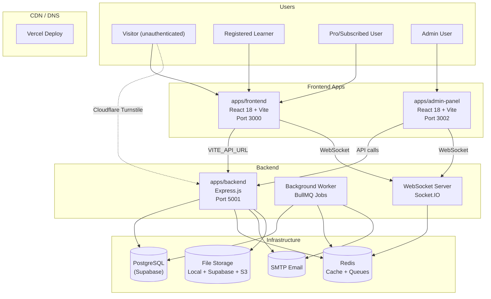

### 2. Authentication & Authorization Flow

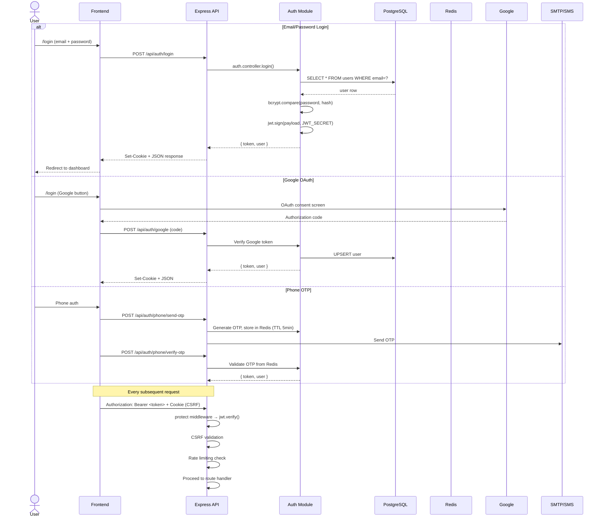

### 3. Request Processing Pipeline

```mermaid
flowchart LR
  subgraph "Inbound"
    Client["Client Browser"]
  end

  subgraph "Express Middleware Stack (in order)"
    H["helmet<br/>(security headers)"]
    C["cors<br/>(origin check)"]
    R["rateLimit<br/>(express-rate-limit)"]
    CP["cookieParser"]
    M["morgan<br/>(request logging)"]
    MN["monitoringMiddleware<br/>(req timing)"]
    PR["publicIdResponseMiddleware"]
  end

  subgraph "Route Layer"
    OR["optionalAuth<br/>(public)"]
    PRM["protect<br/>(authenticated)"]
    ADM["admin<br/>(role check)"]
    CSRF["validateCsrfToken<br/>(mutations)"]
    VL["input@validation<br/>(Joi schemas)"]
  end

  subgraph "Controllers & Services"
    CTRL["Route Handler / Controller"]
    SRV["Business Logic / Service Layer"]
    DB["dbHelpers / pg pool"]
  end

  Client --> H
  H --> C
  C --> R
  R --> CP
  CP --> M
  M --> MN
  MN --> PR

  PR -->|"Public"| OR
  PR -->|"Authenticated"| PRM
  PRM --> ADM
  ADM --> CSRF
  CSRF --> VL

  OR --> CTRL
  VL --> CTRL
  CTRL --> SRV
  SRV --> DB
  DB -->|"Response"| Client
```

### 4. Frontend App Routing & Page Structure

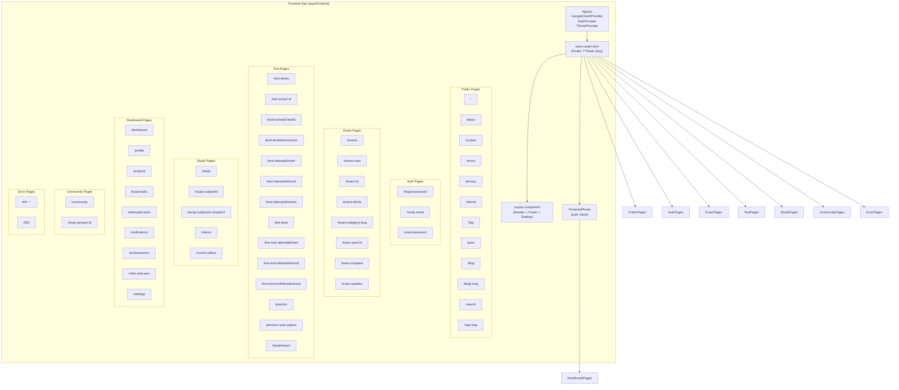

### 5. Admin Panel Routing & Module Structure

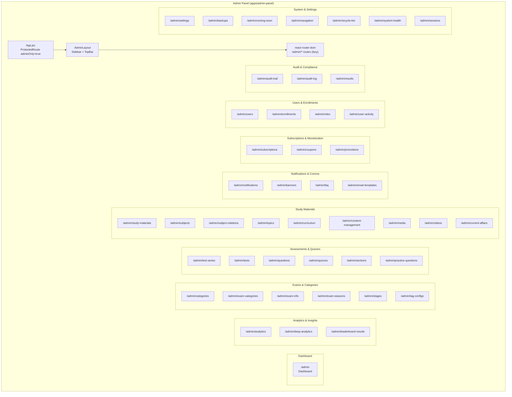

### 6. Test Attempt Lifecycle (Learner Flow)

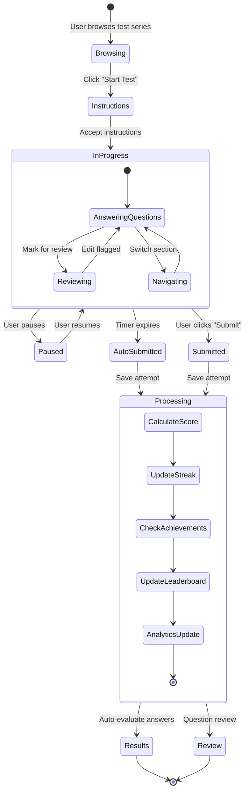

### 7. Test Engine Architecture (Backend)

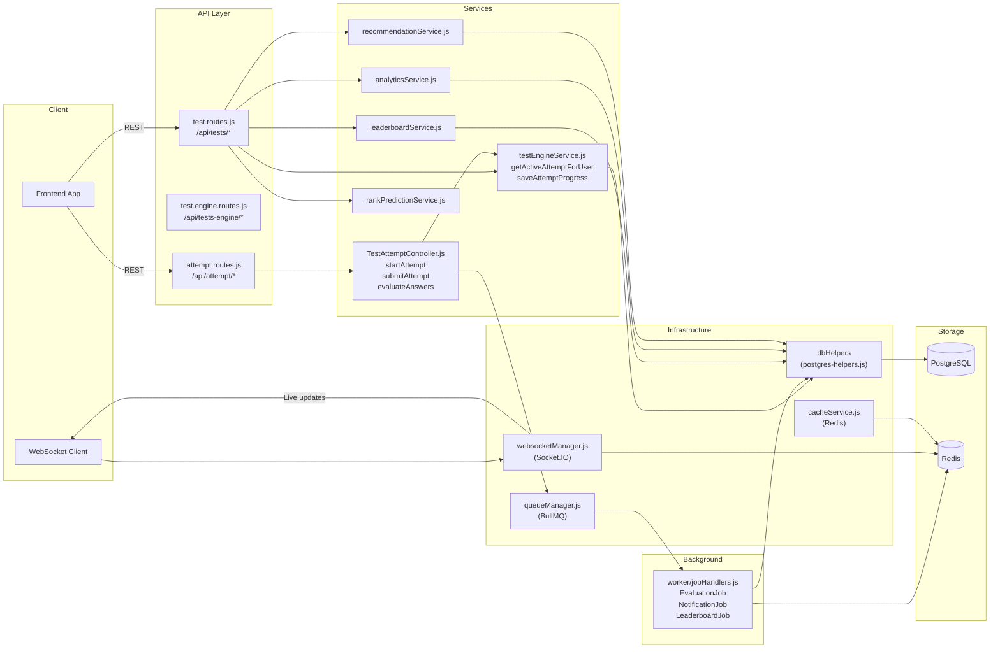

### 8. Database Entity Relationships (Core Domain)

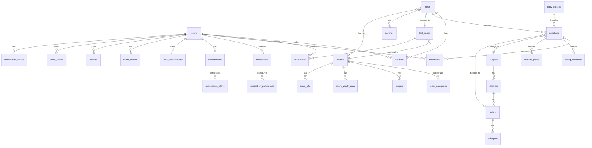

### 9. Live Test + WebSocket Flow

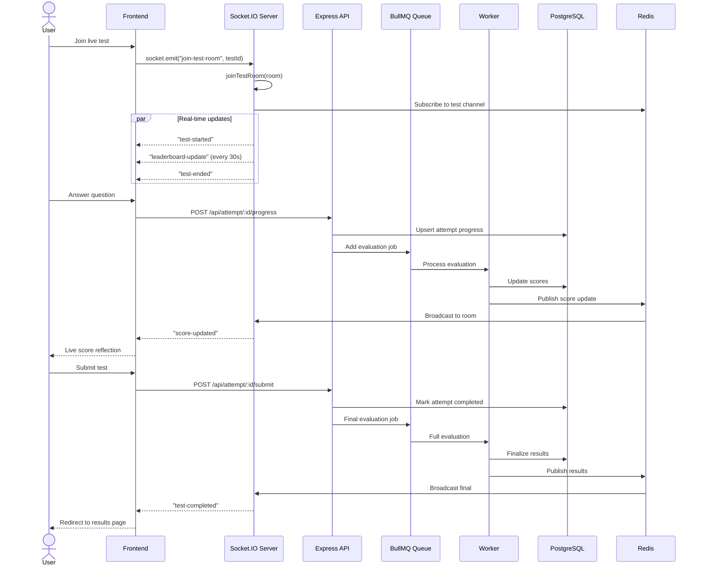

### 10. Payment & Subscription Flow

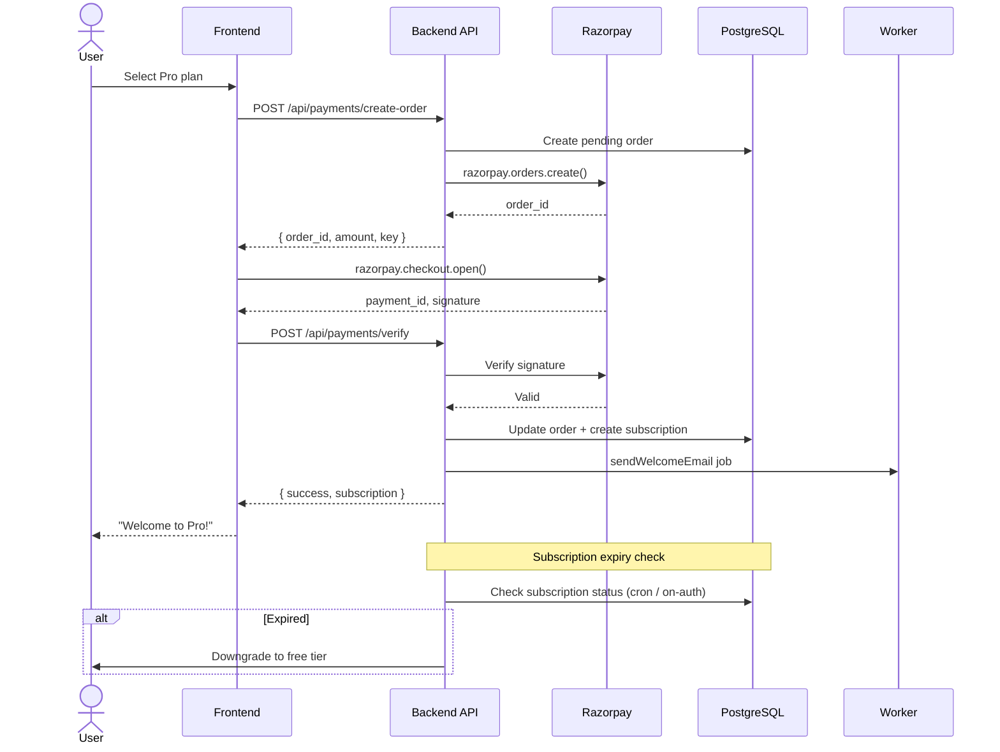

### 11. Data Flow Map (Frontend ← → Backend ← → Database)

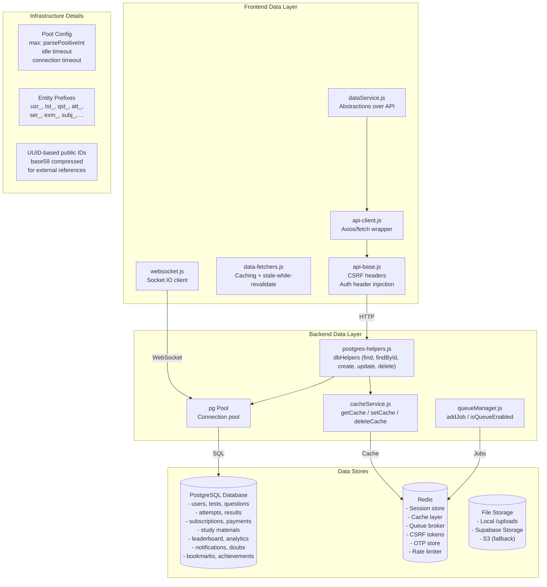

### 12. Background Job Processing

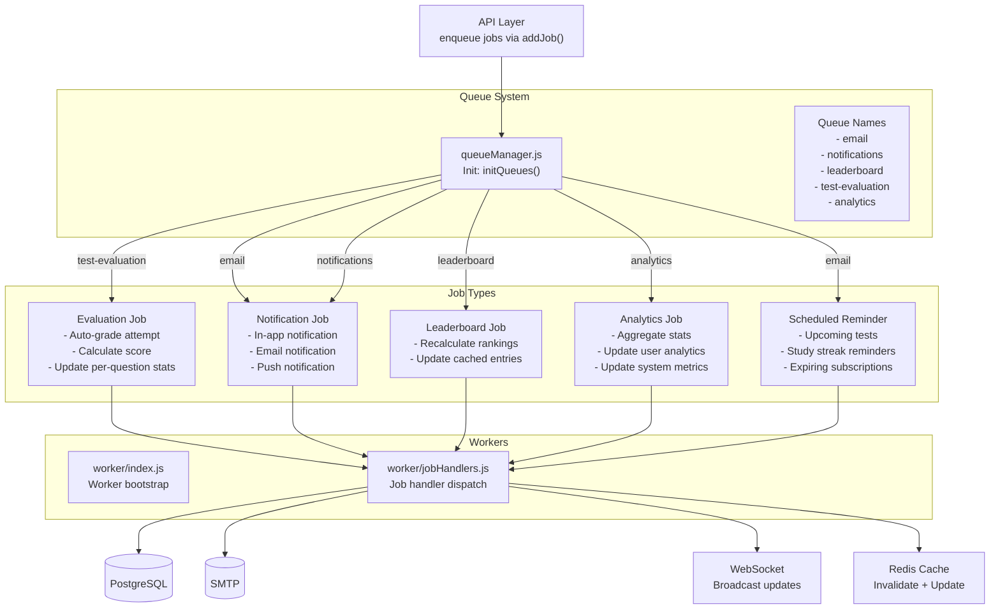

### 13. Middleware Stack Detail

```mermaid
flowchart LR
  subgraph "Security"
    helmet["helmet<br/>HTTP security headers"]
    cors["cors<br/>origin: allowedOrigins<br/>credentials: true"]
    rate["rateLimit<br/>100 req/15min (general)<br/>20 req/15min (auth)"]
    csrf["csrf.middleware.js<br/>validateCsrfToken<br/>Double-submit cookie pattern"]
  end

  subgraph "Auth"
    auth["auth.middleware.js<br/>protect → jwt.verify()<br/>admin → role check<br/>optionalAuth"]
    lockout["lockout.middleware.js<br/>Account lockout after N failures"]
  end

  subgraph "Request Enrichment"
    cookies["cookieParser"]
    logging["morgan<br/>combined format"]
    monitor["monitoring.js<br/>monitoringMiddleware<br/>metricsHandler<br/>errorTrackingMiddleware"]
    norm["normalize-fields.js<br/>camelCase ↔ snake_case"]
    pub_id["public-id-response.middleware.js<br/>Transform ID fields"]
  end

  subgraph "Validation"
    joi["validation/*<br/>Joi schemas<br/>per-route validators"]
  end

  subgraph "Error"
    err["error.middleware.js<br/>errorHandler<br/>notFoundHandler"]
    audit["audit.middleware.js<br/>auditMiddleware<br/>Audit resource access"]
  end

  subgraph "Persistence"
    cache["cacheControl.js<br/>Cache-Control headers"]
  end

  Request --> helmet
  helmet --> cors
  cors --> rate
  rate --> cookies
  cookies --> logging
  logging --> monitor
  monitor --> norm
  norm --> pub_id
  pub_id --> auth
  auth --> lockout
  lockout --> csrf
  csrf --> joi
  joi --> cache
  cache --> Route(Express Route Handler)
  Route --> err
```

---

## Audit Findings

### 1. API Client Fragmentation (High Risk)

**Evidence:** Frontend has 3 active API client entrypoints (`dataService.js`, `api.js`, `api-client.js`), admin has 2 (`dataService.js`, `api.js`). Direct `fetch()` calls exist in several hooks/pages. Auth header injection, CSRF handling, and error wrapping differ between them.

**Impact:** Protected flows (test attempts, enrollments, payments, admin mutations) could silently use a client without CSRF protection or with expired token handling missing.

**Recommendation:** Consolidate to one canonical client per app. Add a lint rule banning new `fetch()` and `axios.create()` calls outside the chosen client.

### 2. Backend Route Ownership Split (High Risk)

**Evidence:** `app-port5001.js` has 45 `/api` middleware mounts and 19 inline `/api` route handlers in the same file. Inline routes cover: search, videos, subscription plans, leaderboards, test series, live tests, current affairs, PYPs, stats, testimonials, and practice questions.

**Impact:** Frontend changes can hit older inline endpoints instead of refactored module endpoints. New developers may add to the inline block instead of creating route modules.

**Recommendation:** Extract inline routes into domain modules. Start with read-only public domains (videos, stats, testimonials, PYPs). Each extraction should include route tests.

### 3. Admin Nav vs Route Map Gap (Medium Risk)

**Evidence:** `adminNavConfig.js` defines 10 visible sidebar groups with 38 `/admin/...` nav paths. `App.jsx` currently declares 50 route paths. Several routes (subjects, subject-relations, topics, curriculum, media, videos, results, coming-soon) are hidden/direct with no nav entry.

**Impact:** Cleanup could delete route-only admin pages or leave dead nav entries. Developers may not discover hidden admin surfaces.

**Recommendation:** Add a route metadata registry: `{ path, navGroup, visibility: "nav"|"hidden"|"detail"|"legacy", label }`. Generate the nav config from it.

### 4. Build/Cache Artifacts in Working Tree (Medium Risk)

**Evidence:** `graphify-out/` (full generated graph), `apps/admin-panel/dist/`, `.graphify_*` temp files at root, `apps/backend/uploads/` (runtime uploads).

**Impact:** Noisy audits, accidental commits of generated files, wasted CI bandwidth.

**Recommendation:** Review `.gitignore`. Keep `graphify-out/graph.json` and `graphify-out/graph.html` (useful artifacts). Ignore `.graphify_*` root files, cache subdirectories, `dist/`, `uploads/`.

### 5. Runtime Metadata Drift (Low Risk)

**Evidence:** Root `package.json` and backend `package.json` now both require Node `>=20.0.0`, so the previous engine mismatch is resolved. However, backend package metadata still describes the API as "Express and Local JSON Database" while the active runtime imports `infrastructure/database/postgres-helpers.js`, uses `pg`, and logs PostgreSQL/Supabase status.

**Impact:** New developers may follow stale metadata and look for a local JSON database path instead of the PostgreSQL helper and migration path.

**Recommendation:** Update backend package description and README setup notes to name PostgreSQL as the active store. Keep the aligned Node `>=20.0.0` requirement.

### 6. Shared Code Duplication (Medium Risk)

**Evidence:** `packages/shared-hooks/` now exports the common hooks and admin `shared/hooks/index.js` re-exports from that package. However, frontend/admin still keep local `shared/hooks/`, `shared/config/`, and `shared/lib/` files, and app config wrappers still duplicate some package exports.

**Impact:** Some shared behavior now has a package source of truth, but direct imports from local app paths can still drift or bypass the shared package.

**Recommendation:** Audit `apps/*/shared/hooks/`, `apps/*/shared/config/`, `apps/*/shared/lib/`. Move pure shared logic into `packages/*`. Keep app-specific UI/side-effects local.

### 7. Database Migration Gaps (Medium Risk)

**Evidence:** Only 9 numbered migrations in `src/database/migrations/`. No migration 001-009 found (likely ran before this repo). Migrations mixed: domain fixes (010, 011), soft-delete (012), current affairs (013), cascade deletes (014), chapter redistribution (015). Tables JSON references non-canonical table names.

**Impact:** Cannot reproduce DB schema from scratch. New environments need manual dump import.

**Recommendation:** Create a migration baseline script. Ensure all subsequent schema changes go through numbered migration files. Standardize `tables.json` format.

### 8. Test Coverage Gaps (Low Risk)

**Evidence:** Backend has Jest tests in `src/__tests__/`. Frontend and admin both now have Vitest scripts, and each has an `tests/App.test.jsx`; admin also has focused tests under `src/test/`.

**Impact:** Test infrastructure exists, but coverage is still concentrated in smoke/unit tests. API changes upstream can still break frontend/admin workflows without end-to-end coverage.

**Recommendation:** Keep the existing Jest/Vitest setup and add smoke tests for critical flows: login, test attempt, question CRUD, enrollment, payment verification, and admin mutations.

---

## Graphify God Nodes (Top Connected Abstractions)

From the knowledge graph at `graphify-out/graph.json`:

| Node | Edges | Role |
|------|-------|------|
| `react-router-dom` | 91 | Cross-app routing hub (linking all communities via route definitions) |
| `dbHelpers` | 58 | Central database access (bridge between all data communities) |
| `useAuth()` | 50 | Authentication state provider (connects protected routes, API calls, user state) |
| `PostgresHelpers` | 44 | Core DB abstraction (CRUD, entity prefix, public ID generation) |
| `useKeyboardShortcuts()` | 43 | Admin UI utility (test/question management shortcuts) |
| `useUndoToast()` | 43 | Admin UI undo/redo operations |
| `apiClient` | 43 | HTTP client (connects frontend to all backend endpoints) |
| `protect()` | 40 | JWT auth middleware (gateway to all protected API routes) |
| `pool` | 33 | PostgreSQL connection pool instance |
| `FormInput()` | 31 | Reusable form component (used across all admin CRUD forms) |

## Key Cross-Community Bridges

1. **`dbHelpers`** connects Community 24 (core DB utilities) to ~40+ other communities — it is the most critical cross-cutting concern.
2. **`react-router-dom`** connects Community 13 (shell/routing) to ~23 frontend page communities.
3. **`useAuth()`** bridges auth (Community 4) to all protected page communities.

## Surprising Connections (From Graphify)

- `testConnection()` → `sleep()` (INFERRED): connection retry logic in postgres-helpers links to a test file.
- `AI Question Generator` ↔ `AI Integration Architecture` (INFERRED): docs/features references admin's AI setup doc.
- `Trstprep` → `Node Engine Architecture` (EXTRACTED): README explicitly links to architecture doc.

## Suggested Questions (From Graphify)

- Why does `dbHelpers` connect 40+ communities? (Follow the database abstraction dependency)
- What connects `__filename`, `__dirname`, `env` to the rest of the system? (816 weakly-connected nodes)
- Should Community 0 (cohesion 0.01) be split into smaller modules?

## Cleanup Priority

1. **Protect working tree** — commit or stash active changes before any cleanup
2. **Standardize API client** — one canonical client + lint rule
3. **Create admin route registry** — nav/hidden/detail/legacy tagging
4. **Extract inline backend routes** — move to domain modules, add tests
5. **Normalize `.gitignore`** — ignore transient artifacts, keep useful graph outputs
6. **Consolidate shared code** — audit and move pure logic to `packages/*`
7. **Create migration baseline** — ensure reproducible DB setup
8. **Expand test coverage** — keep existing Jest/Vitest setup and add workflow smoke tests

## Verification Checklist

After any cleanup or refactoring:

```powershell
npm run build
npm run test
npm run lint
```

Runtime smoke checks:
- Frontend: `/`, `/test-series`, `/study`, `/exams`, `/dashboard`, `/login`
- Admin: `/admin`, `/admin/tests`, `/admin/questions`, `/admin/study-materials`, `/admin/users`
- Backend health: `GET http://localhost:5001/api/health`
- Critical flow: Login → start test → answer → submit → view result/review
- Admin mutation: Create/update a question → verify in frontend test
