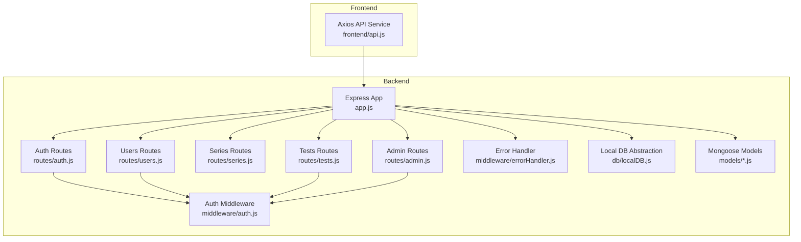
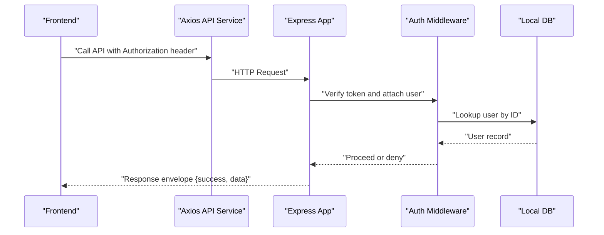
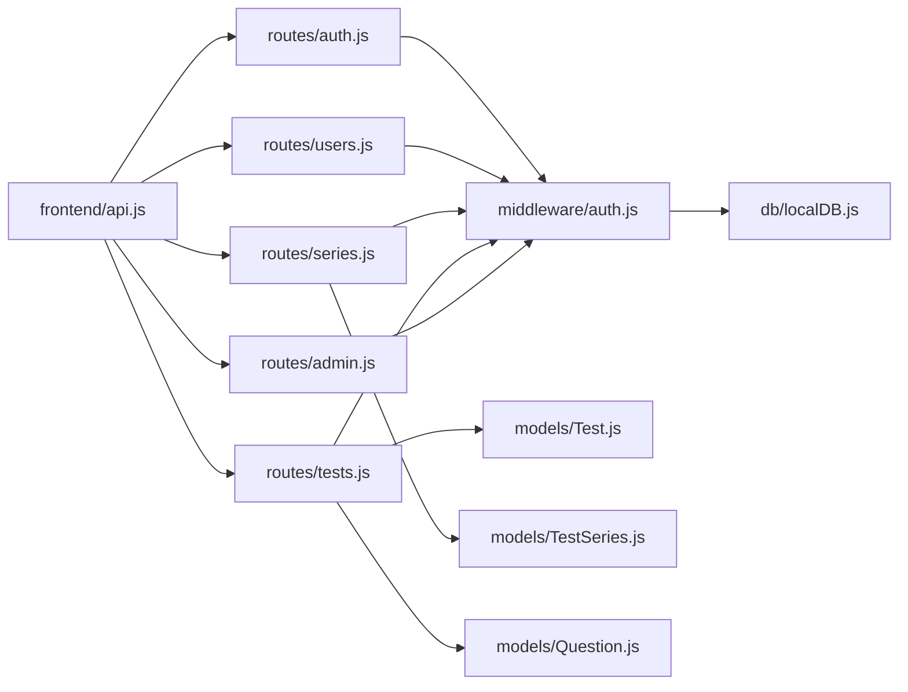

# API Documentation

<cite>
**Referenced Files in This Document**
- [Backend/src/app.js](file://Backend/src/app.js)
- [Backend/src/routes/auth.js](file://Backend/src/routes/auth.js)
- [Backend/src/routes/series.js](file://Backend/src/routes/series.js)
- [Backend/src/routes/tests.js](file://Backend/src/routes/tests.js)
- [Backend/src/routes/users.js](file://Backend/src/routes/users.js)
- [Backend/src/routes/admin.js](file://Backend/src/routes/admin.js)
- [Backend/src/middleware/auth.js](file://Backend/src/middleware/auth.js)
- [Backend/src/middleware/errorHandler.js](file://Backend/src/middleware/errorHandler.js)
- [Backend/src/models/User.js](file://Backend/src/models/User.js)
- [Backend/src/models/TestSeries.js](file://Backend/src/models/TestSeries.js)
- [Backend/src/models/Test.js](file://Backend/src/models/Test.js)
- [Backend/src/models/Question.js](file://Backend/src/models/Question.js)
- [Backend/src/db/localDB.js](file://Backend/src/db/localDB.js)
- [Backend/.env.example](file://Backend/.env.example)
- [Backend/package.json](file://Backend/package.json)
- [Frontend/src/services/api.js](file://Frontend/src/services/api.js)
</cite>

## Table of Contents
1. [Introduction](#introduction)
2. [Project Structure](#project-structure)
3. [Core Components](#core-components)
4. [Architecture Overview](#architecture-overview)
5. [Detailed Component Analysis](#detailed-component-analysis)
6. [Dependency Analysis](#dependency-analysis)
7. [Performance Considerations](#performance-considerations)
8. [Troubleshooting Guide](#troubleshooting-guide)
9. [Conclusion](#conclusion)
10. [Appendices](#appendices)

## Introduction
This document provides comprehensive API documentation for Trstprep V2’s RESTful backend. It covers all API groups: Authentication (/api/auth/*), Test Series Management (/api/series/*), Test Administration (/api/tests/*), User Management (/api/users/*), and Admin Functions (/api/admin/*). For each endpoint, you will find HTTP methods, URL patterns, request/response schemas, authentication requirements, error handling, parameter descriptions, validation rules, and client-side integration examples using the frontend API service. It also documents JWT token usage, role-based access control, security considerations, rate limiting information, and API versioning approach.

## Project Structure
The backend is an Express server with modular route handlers grouped by domain. Middleware handles authentication, authorization, and error responses. Data access is performed via a local JSON database abstraction (lowdb) that simulates MongoDB operations. The frontend integrates with the backend using an Axios service that injects Authorization headers and centralizes error handling.

**Diagram sources**
- [Backend/src/app.js](file://Backend/src/app.js#L1-L94)
- [Backend/src/routes/auth.js](file://Backend/src/routes/auth.js#L1-L174)
- [Backend/src/routes/users.js](file://Backend/src/routes/users.js#L1-L150)
- [Backend/src/routes/series.js](file://Backend/src/routes/series.js#L1-L162)
- [Backend/src/routes/tests.js](file://Backend/src/routes/tests.js#L1-L265)
- [Backend/src/routes/admin.js](file://Backend/src/routes/admin.js#L1-L385)
- [Backend/src/middleware/auth.js](file://Backend/src/middleware/auth.js#L1-L92)
- [Backend/src/middleware/errorHandler.js](file://Backend/src/middleware/errorHandler.js#L1-L52)
- [Backend/src/db/localDB.js](file://Backend/src/db/localDB.js#L1-L219)
- [Backend/src/models/User.js](file://Backend/src/models/User.js#L1-L81)
- [Backend/src/models/TestSeries.js](file://Backend/src/models/TestSeries.js#L1-L71)
- [Backend/src/models/Test.js](file://Backend/src/models/Test.js#L1-L77)
- [Backend/src/models/Question.js](file://Backend/src/models/Question.js#L1-L54)
- [Frontend/src/services/api.js](file://Frontend/src/services/api.js#L1-L92)

**Section sources**
- [Backend/src/app.js](file://Backend/src/app.js#L1-L94)
- [Frontend/src/services/api.js](file://Frontend/src/services/api.js#L1-L92)

## Core Components
- Express server with Helmet, CORS, Morgan, and JSON parsing configured.
- Modular routes under /api/{auth, users, series, tests, study, admin}.
- Authentication middleware supporting bearer tokens, optional auth, admin-only, and pro pass checks.
- Centralized error handling for 404, validation, cast errors, and JWT errors.
- Local JSON database abstraction enabling lowdb operations with MongoDB-like helpers.
- Mongoose models for User, TestSeries, Test, and Question with validation rules and indexes.

**Section sources**
- [Backend/src/app.js](file://Backend/src/app.js#L24-L67)
- [Backend/src/middleware/auth.js](file://Backend/src/middleware/auth.js#L1-L92)
- [Backend/src/middleware/errorHandler.js](file://Backend/src/middleware/errorHandler.js#L1-L52)
- [Backend/src/db/localDB.js](file://Backend/src/db/localDB.js#L79-L219)
- [Backend/src/models/User.js](file://Backend/src/models/User.js#L1-L81)
- [Backend/src/models/TestSeries.js](file://Backend/src/models/TestSeries.js#L1-L71)
- [Backend/src/models/Test.js](file://Backend/src/models/Test.js#L1-L77)
- [Backend/src/models/Question.js](file://Backend/src/models/Question.js#L1-L54)

## Architecture Overview
The backend exposes REST endpoints grouped by functional domains. Requests are authenticated via JWT; protected routes enforce roles (admin) and entitlements (pro pass). Responses follow a consistent envelope with success flags and data payloads. Errors are normalized centrally. The frontend consumes the API through an Axios service that automatically attaches Authorization headers and redirects on 401.

**Diagram sources**
- [Frontend/src/services/api.js](file://Frontend/src/services/api.js#L12-L44)
- [Backend/src/middleware/auth.js](file://Backend/src/middleware/auth.js#L5-L44)
- [Backend/src/db/localDB.js](file://Backend/src/db/localDB.js#L110-L129)
- [Backend/src/app.js](file://Backend/src/app.js#L56-L66)

## Detailed Component Analysis

### Authentication API (/api/auth/*)
- Base path: /api/auth
- Authentication: Public for registration/login; private for profile endpoints.

Endpoints:
- POST /api/auth/register
  - Purpose: Register a new user.
  - Auth: None.
  - Request body:
    - name: string, required, trimmed, max length 50
    - email: string, required, unique, lowercase, valid format
    - password: string, required, min length 8
    - mobile: string, optional
  - Response:
    - success: boolean
    - data.user: { id, name, email, role, isProUser }
    - data.token: string (JWT)
  - Errors: 400 (duplicate email), 500 (server error).
  - Notes: Passwords are hashed before storage.

- POST /api/auth/login
  - Purpose: Authenticate user and issue JWT.
  - Auth: None.
  - Request body:
    - email: string, required
    - password: string, required
  - Response:
    - success: boolean
    - data.user: { id, name, email, role, isProUser, proPassExpiry }
    - data.token: string (JWT)
  - Errors: 401 (invalid credentials), 500 (server error).

- GET /api/auth/me
  - Purpose: Fetch currently authenticated user profile.
  - Auth: Required (Bearer).
  - Response:
    - success: boolean
    - data: { id, name, email, mobile, role, isProUser, proPassExpiry, enrolledSeries, createdAt }
  - Errors: 404 (user not found), 401 (no/invalid token), 500 (server error).

- POST /api/auth/logout
  - Purpose: Signal logout (client removes token).
  - Auth: Required (Bearer).
  - Response:
    - success: boolean
    - message: string

Security and Validation:
- JWT secret and expiry are configured via environment variables.
- Password hashing uses bcrypt.
- Email uniqueness enforced at model level.
- Token attached via Authorization: Bearer header.

Example request (login):
- POST /api/auth/login
- Headers: Content-Type: application/json
- Body: { email, password }

Example response:
- 200 OK
- Body: { success: true, data: { user, token } }

**Section sources**
- [Backend/src/routes/auth.js](file://Backend/src/routes/auth.js#L16-L171)
- [Backend/src/middleware/auth.js](file://Backend/src/middleware/auth.js#L5-L44)
- [Backend/src/models/User.js](file://Backend/src/models/User.js#L11-L24)
- [Backend/.env.example](file://Backend/.env.example#L10-L13)

### Test Series Management API (/api/series/*)
- Base path: /api/series
- Authentication: Public for listing/searching; optional for detail views.

Endpoints:
- GET /api/series
  - Purpose: List active test series with filtering and sorting.
  - Auth: Public.
  - Query parameters:
    - category: string, filters by category (when not 'all')
    - search: string, case-insensitive regex on title
    - sort: string, one of popular, rating, tests, newest; default popular
  - Response:
    - success: boolean
    - count: number
    - data: array of series items
  - Errors: 500 (server error).

- GET /api/series/:slug
  - Purpose: Retrieve a single series by slug; indicates enrollment for logged-in users.
  - Auth: Optional (Bearer).
  - Path parameters:
    - slug: string, required
  - Response:
    - success: boolean
    - data: series item plus isEnrolled flag
  - Errors: 404 (not found), 500 (server error).

- GET /api/series/:slug/tests
  - Purpose: List tests in a series with optional category/subcategory/type filters.
  - Auth: Optional (Bearer).
  - Path parameters:
    - slug: string, required
  - Query parameters:
    - category: string, filter (when not 'all')
    - subCategory: string, filter (when not 'all')
    - type: string, filter (when not 'all')
  - Response:
    - success: boolean
    - count: number
    - data: array of tests
  - Errors: 500 (server error).

- GET /api/series/category/:category
  - Purpose: List series by category, sorted by popularity.
  - Auth: Public.
  - Path parameters:
    - category: string, required
  - Response:
    - success: boolean
    - count: number
    - data: array of series
  - Errors: 500 (server error).

Validation and Models:
- Series schema enforces category enum and rating bounds.
- Indexes on category and isActive improve query performance.

**Section sources**
- [Backend/src/routes/series.js](file://Backend/src/routes/series.js#L8-L159)
- [Backend/src/models/TestSeries.js](file://Backend/src/models/TestSeries.js#L16-L20)
- [Backend/src/models/TestSeries.js](file://Backend/src/models/TestSeries.js#L48-L50)

### Test Administration API (/api/tests/*)
- Base path: /api/tests
- Authentication: Public for discovery; private for attempting and scoring.

Endpoints:
- GET /api/tests/tag/:tag
  - Purpose: Filter tests by tag (live-tests, pyps, quizzes, practice) or generic tags.
  - Auth: Public.
  - Path parameters:
    - tag: string, required
  - Response:
    - success: boolean
    - count: number
    - data: array of tests with series populated
  - Errors: 500 (server error).

- GET /api/tests/:testId
  - Purpose: Retrieve test details; indicates access eligibility.
  - Auth: Optional (Bearer).
  - Path parameters:
    - testId: string, required
  - Response:
    - success: boolean
    - data: test item plus hasAccess flag
  - Errors: 404 (not found), 500 (server error).

- GET /api/tests/:testId/questions
  - Purpose: Fetch questions for test-taking (private).
  - Auth: Required (Bearer).
  - Path parameters:
    - testId: string, required
  - Response:
    - success: boolean
    - count: number
    - data: array of questions (answers/explanations excluded)
  - Errors: 403 (pro pass required), 404 (not found), 500 (server error).

- POST /api/tests/:testId/start
  - Purpose: Start a test attempt; validates access.
  - Auth: Required (Bearer).
  - Path parameters:
    - testId: string, required
  - Response:
    - success: boolean
    - data: { attemptId, testId, startTime, duration, questions }
  - Errors: 403 (pro pass required), 404 (not found), 500 (server error).

- PUT /api/tests/:testId/submit
  - Purpose: Submit answers and compute score/accuracy/rank placeholders.
  - Auth: Required (Bearer).
  - Path parameters:
    - testId: string, required
  - Request body:
    - answers: array of { questionId, selectedOption }
    - timeSpent: number
    - attemptId: string
  - Response:
    - success: boolean
    - data: { attemptId, testId, score, totalMarks, correct, wrong, unattempted, accuracy, timeSpent, rank }
  - Errors: 404 (not found), 500 (server error).

- GET /api/tests/:testId/result/:attemptId
  - Purpose: Retrieve test result (placeholder).
  - Auth: Required (Bearer).
  - Path parameters:
    - testId: string, required
    - attemptId: string, required
  - Response:
    - success: boolean
    - data: { attemptId, testId, score, totalMarks, correct, wrong, unattempted, accuracy, timeSpent, rank }
  - Errors: 500 (server error).

Validation and Access Control:
- Free tests are accessible; Pro tests require pro pass entitlement.
- Questions exclude correct answers and explanations in public attempts.

**Section sources**
- [Backend/src/routes/tests.js](file://Backend/src/routes/tests.js#L8-L262)
- [Backend/src/middleware/auth.js](file://Backend/src/middleware/auth.js#L80-L90)
- [Backend/src/models/Test.js](file://Backend/src/models/Test.js#L28-L32)

### User Management API (/api/users/*)
- Base path: /api/users
- Authentication: All endpoints require Bearer token.

Endpoints:
- GET /api/users/profile
  - Purpose: Retrieve user profile with enrolled series populated.
  - Auth: Required (Bearer).
  - Response:
    - success: boolean
    - data: user object with enrolledSeries populated
  - Errors: 500 (server error).

- PUT /api/users/profile
  - Purpose: Update profile (name, mobile, avatar).
  - Auth: Required (Bearer).
  - Request body:
    - name: string, optional
    - mobile: string, optional
    - avatar: string, optional
  - Response:
    - success: boolean
    - data: updated user
  - Errors: 500 (server error).

- POST /api/users/enroll/:seriesId
  - Purpose: Enroll in a test series.
  - Auth: Required (Bearer).
  - Path parameters:
    - seriesId: string, required
  - Response:
    - success: boolean
    - message: string
    - data: updated enrolledSeries
  - Errors: 404 (series not found), 400 (already enrolled), 500 (server error).

- GET /api/users/enrolled-series
  - Purpose: List enrolled series for the user.
  - Auth: Required (Bearer).
  - Response:
    - success: boolean
    - data: array of enrolled series
  - Errors: 500 (server error).

- GET /api/users/analytics
  - Purpose: Retrieve user performance analytics (placeholder).
  - Auth: Required (Bearer).
  - Response:
    - success: boolean
    - data: analytics object
  - Errors: 500 (server error).

**Section sources**
- [Backend/src/routes/users.js](file://Backend/src/routes/users.js#L8-L147)

### Admin Functions API (/api/admin/*)
- Base path: /api/admin
- Authentication: Requires Bearer token and admin role.

Endpoints:
- GET /api/admin/stats
  - Purpose: Retrieve counts for users, series, tests, questions, study materials, exams, media.
  - Auth: Required (admin).
  - Response:
    - success: boolean
    - data: stats object
  - Errors: 500 (server error).

- Test Series Management
  - GET /api/admin/test-series
  - POST /api/admin/test-series
  - PUT /api/admin/test-series/:id
  - DELETE /api/admin/test-series/:id

- Tests Management
  - GET /api/admin/tests
  - POST /api/admin/tests
  - PUT /api/admin/tests/:id
  - DELETE /api/admin/tests/:id

- Questions Management
  - GET /api/admin/questions
  - POST /api/admin/questions
  - POST /api/admin/questions/bulk
  - PUT /api/admin/questions/:id
  - DELETE /api/admin/questions/:id

- Study Materials Management
  - GET /api/admin/study-materials
  - POST /api/admin/study-materials
  - PUT /api/admin/study-materials/:id
  - DELETE /api/admin/study-materials/:id

- User Management
  - GET /api/admin/users
  - PUT /api/admin/users/:id/pro-pass

- File Upload
  - POST /api/admin/upload
  - Notes: Supports images, PDFs, videos; saves metadata to media collection.

- App Settings
  - GET /api/admin/settings
  - PUT /api/admin/settings

- Test Categories Management (Hierarchical)
  - GET /api/admin/test-categories
  - POST /api/admin/test-categories
  - PUT /api/admin/test-categories/:id
  - DELETE /api/admin/test-categories/:id
  - GET /api/admin/test-categories/:id/path

Notes:
- All admin endpoints are protected by both auth and admin middleware.
- Recursive deletion supported for hierarchical categories.

**Section sources**
- [Backend/src/routes/admin.js](file://Backend/src/routes/admin.js#L8-L382)
- [Backend/src/middleware/auth.js](file://Backend/src/middleware/auth.js#L68-L78)

## Dependency Analysis
- Route-to-middleware coupling:
  - Auth routes depend on auth middleware for token verification and admin enforcement for admin routes.
- Model-to-route coupling:
  - Series, Test, and Question models are used by series and tests routes for population and filtering.
- Frontend-to-backend coupling:
  - Axios service encapsulates base URL, interceptors, and named API modules for auth, series, tests, users, and study.

**Diagram sources**
- [Backend/src/routes/auth.js](file://Backend/src/routes/auth.js#L1-L174)
- [Backend/src/routes/users.js](file://Backend/src/routes/users.js#L1-L150)
- [Backend/src/routes/series.js](file://Backend/src/routes/series.js#L1-L162)
- [Backend/src/routes/tests.js](file://Backend/src/routes/tests.js#L1-L265)
- [Backend/src/routes/admin.js](file://Backend/src/routes/admin.js#L1-L385)
- [Backend/src/middleware/auth.js](file://Backend/src/middleware/auth.js#L1-L92)
- [Backend/src/db/localDB.js](file://Backend/src/db/localDB.js#L1-L219)
- [Backend/src/models/Test.js](file://Backend/src/models/Test.js#L1-L77)
- [Backend/src/models/TestSeries.js](file://Backend/src/models/TestSeries.js#L1-L71)
- [Backend/src/models/Question.js](file://Backend/src/models/Question.js#L1-L54)
- [Frontend/src/services/api.js](file://Frontend/src/services/api.js#L1-L92)

**Section sources**
- [Backend/src/app.js](file://Backend/src/app.js#L14-L22)
- [Backend/src/middleware/auth.js](file://Backend/src/middleware/auth.js#L1-L92)
- [Backend/src/db/localDB.js](file://Backend/src/db/localDB.js#L79-L219)
- [Frontend/src/services/api.js](file://Frontend/src/services/api.js#L1-L92)

## Performance Considerations
- Database layer:
  - Local JSON database is suitable for development and small scale but is not optimized for high concurrency or large datasets. Consider migrating to MongoDB for production scalability.
- Query indexes:
  - Series and Test schemas define indexes on category and isActive to speed up filtering.
- Payload minimization:
  - Question retrieval excludes correct answers and explanations to reduce payload size during attempts.
- Recommendations:
  - Add pagination for list endpoints.
  - Introduce caching for frequently accessed series and tests listings.
  - Consider rate limiting middleware for sensitive endpoints (login/register).

[No sources needed since this section provides general guidance]

## Troubleshooting Guide
Common issues and resolutions:
- 401 Unauthorized:
  - Cause: Missing or invalid Bearer token.
  - Resolution: Ensure Authorization header is present and valid; frontend auto-removes token on 401 and redirects to login.
- 403 Forbidden:
  - Cause: Insufficient permissions (non-admin accessing admin endpoints) or missing pro pass for Pro tests.
  - Resolution: Verify user role and pro pass status; ensure correct endpoint access.
- 404 Not Found:
  - Cause: Resource does not exist or invalid ObjectId.
  - Resolution: Validate IDs and slugs; check existence before calling endpoints.
- Validation errors:
  - Cause: Missing required fields or invalid formats.
  - Resolution: Review request payloads against documented schemas.
- Network errors:
  - Cause: No internet or server unreachable.
  - Resolution: Retry after verifying connectivity and server health.

**Section sources**
- [Backend/src/middleware/errorHandler.js](file://Backend/src/middleware/errorHandler.js#L11-L51)
- [Frontend/src/services/api.js](file://Frontend/src/services/api.js#L26-L44)

## Conclusion
Trstprep V2’s API provides a clear, modular structure for authentication, series management, test administration, user management, and admin operations. JWT-based authentication, role-based access control, and centralized error handling ensure predictable behavior. The frontend integrates seamlessly via an Axios service that manages tokens and error flows. For production, consider migrating to MongoDB, adding rate limiting, pagination, and caching to improve performance and reliability.

[No sources needed since this section summarizes without analyzing specific files]

## Appendices

### API Versioning Approach
- Current implementation uses /api/* base path without explicit version suffix.
- Backward compatibility considerations:
  - Maintain stable endpoint signatures for existing clients.
  - Introduce deprecation notices before changing or removing endpoints.
  - Plan for /api/v1, /api/v2 transitions when evolving schemas.

**Section sources**
- [Backend/src/app.js](file://Backend/src/app.js#L56-L62)

### Rate Limiting Information
- No explicit rate limiting middleware is implemented in the current codebase.
- Recommendation:
  - Add a rate-limiting middleware (e.g., for login/register) to mitigate brute-force attacks.
  - Apply per-endpoint limits where appropriate (e.g., higher limits for public reads, stricter for writes).

**Section sources**
- [Backend/src/app.js](file://Backend/src/app.js#L27-L44)

### Client-Side Integration Examples
- Frontend Axios service:
  - Base URL is configurable via environment variable.
  - Automatically attaches Authorization header if token exists.
  - Handles 401 by clearing tokens and redirecting to login.
- Example usage patterns:
  - Authentication: authAPI.login(), authAPI.register(), authAPI.getMe().
  - Series: seriesAPI.getAll(), seriesAPI.getById(slug), seriesAPI.getTests(slug).
  - Tests: testsAPI.getByTag(tag), testsAPI.getQuestions(testId), testsAPI.startAttempt(testId), testsAPI.submitAttempt(testId, payload).
  - User: userAPI.getProfile(), userAPI.updateProfile(data), userAPI.enrollSeries(seriesId), userAPI.getEnrolledSeries(), userAPI.getAnalytics().

**Section sources**
- [Frontend/src/services/api.js](file://Frontend/src/services/api.js#L4-L44)
- [Frontend/src/services/api.js](file://Frontend/src/services/api.js#L46-L91)

### JWT Token Usage and Security Considerations
- Token generation:
  - Issued on successful registration/login with configurable expiry.
- Token verification:
  - Middleware extracts Bearer token, verifies signature, and loads user.
- Role-based access control:
  - Admin-only endpoints enforce admin role.
  - Pro pass enforcement protects Pro tests.
- Security hardening:
  - Use HTTPS in production.
  - Rotate JWT secret regularly.
  - Store tokens securely (avoid localStorage for sensitive sessions).
  - Implement refresh tokens if needed.

**Section sources**
- [Backend/src/routes/auth.js](file://Backend/src/routes/auth.js#L9-L14)
- [Backend/src/middleware/auth.js](file://Backend/src/middleware/auth.js#L5-L44)
- [Backend/src/middleware/auth.js](file://Backend/src/middleware/auth.js#L68-L90)
- [Backend/.env.example](file://Backend/.env.example#L10-L13)

### Data Models Overview

```mermaid
erDiagram
USER {
string id PK
string name
string email UK
string password
string mobile
string avatar
boolean isAdmin
boolean hasProPass
date proPassExpiry
array enrolledSeries
json attemptedTests
datetime createdAt
datetime updatedAt
}
TESTSERIES {
string id PK
string slug UK
string title
enum category
string description
string image
string icon
number totalTests
number freeTests
string activeUsers
number rating
array tags
array testTypes
boolean isActive
datetime createdAt
datetime updatedAt
}
TEST {
string id PK
string seriesId FK
string slug
string title
enum category
string subCategory
enum type
number questions
number duration
number marks
number negativeMarking
array tags
boolean isLive
date liveSchedule
boolean isActive
datetime createdAt
datetime updatedAt
}
QUESTION {
string id PK
string testId FK
number questionNumber
json text
json options
number correctOption
string section
string explanation
enum difficulty
string image
datetime createdAt
datetime updatedAt
}
USER ||--o{ TESTSERIES : "enrolledSeries"
TESTSERIES ||--o{ TEST : "contains"
TEST ||--o{ QUESTION : "has"
```

**Diagram sources**
- [Backend/src/models/User.js](file://Backend/src/models/User.js#L4-L55)
- [Backend/src/models/TestSeries.js](file://Backend/src/models/TestSeries.js#L3-L63)
- [Backend/src/models/Test.js](file://Backend/src/models/Test.js#L3-L68)
- [Backend/src/models/Question.js](file://Backend/src/models/Question.js#L3-L47)

*Last Updated: March 10, 2026 | Update date is (20:16)*
