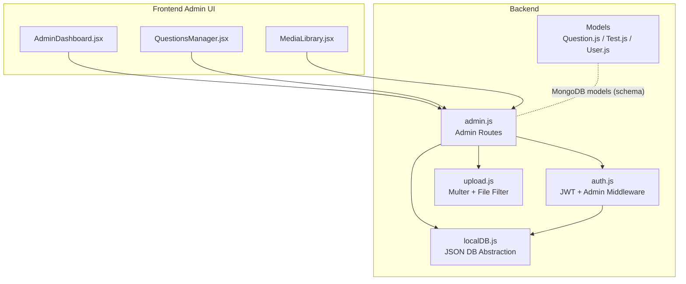
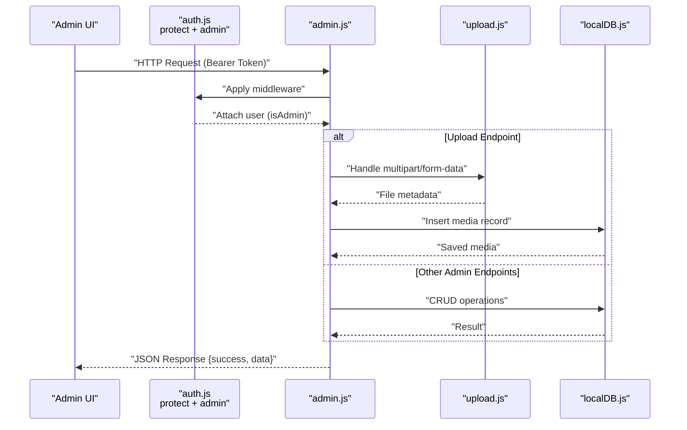
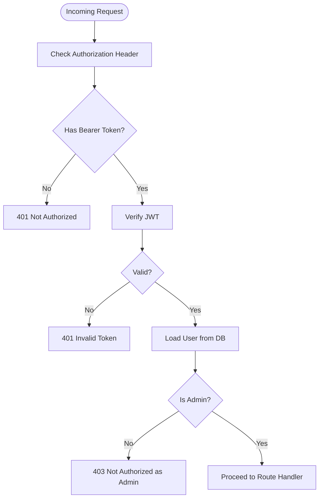
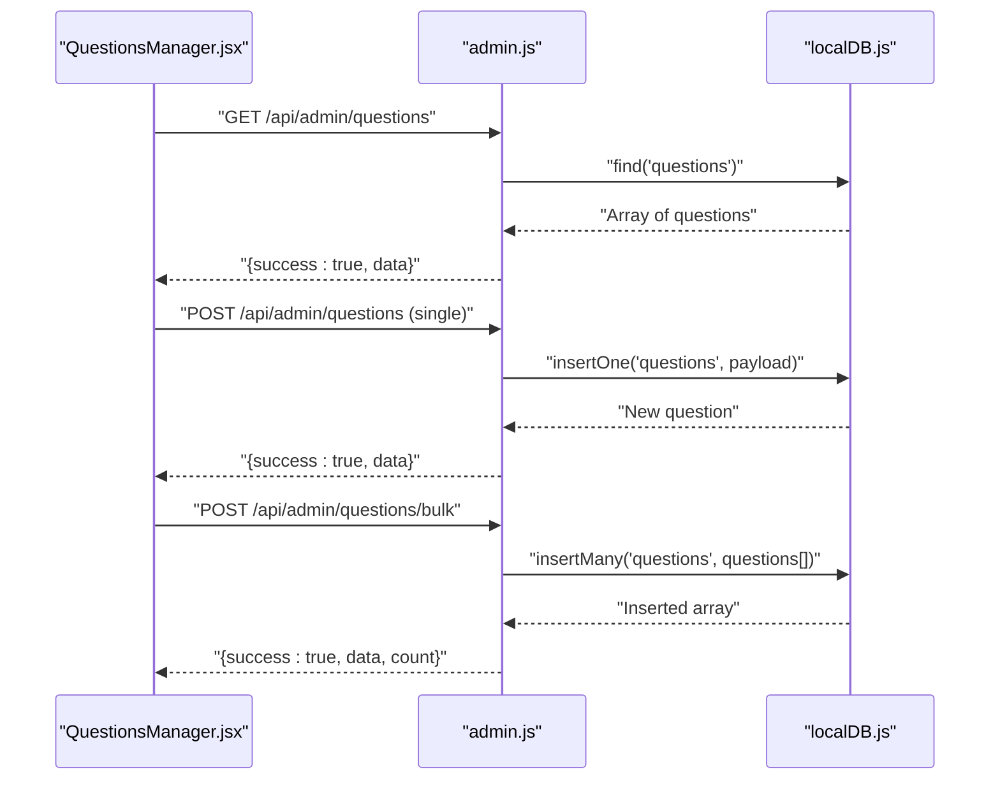
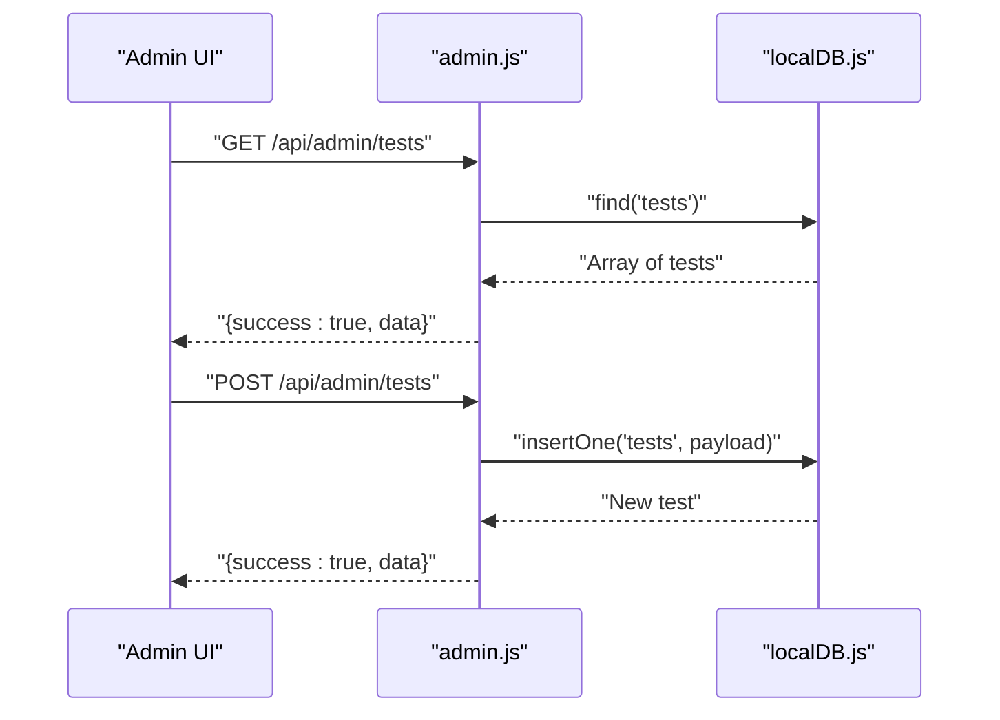
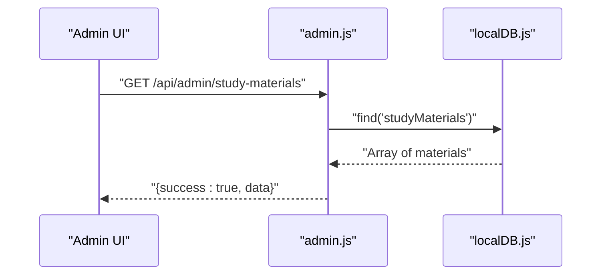
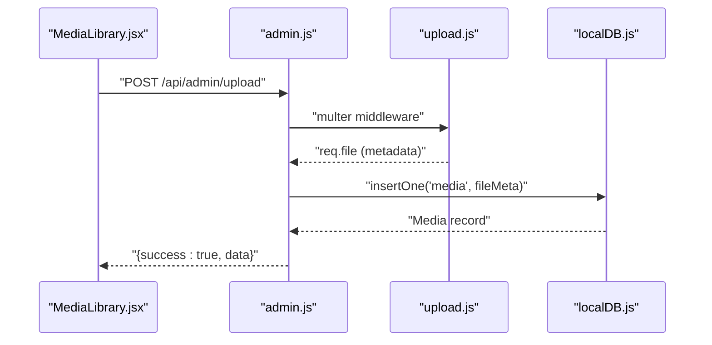
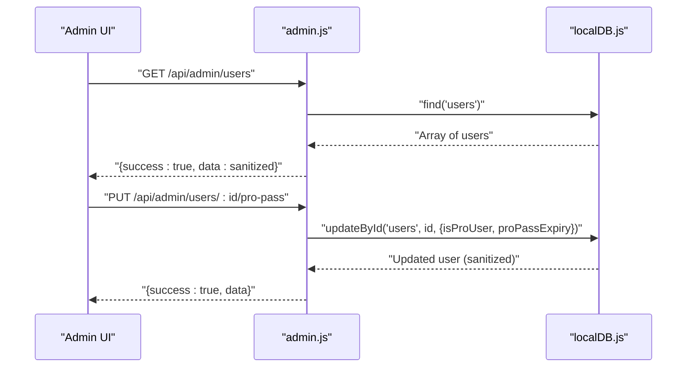
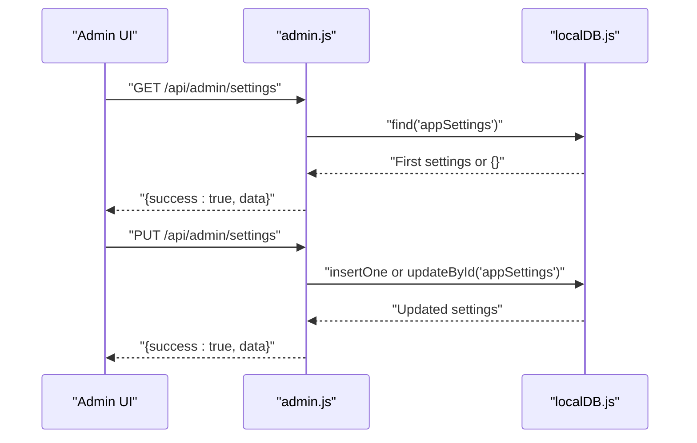
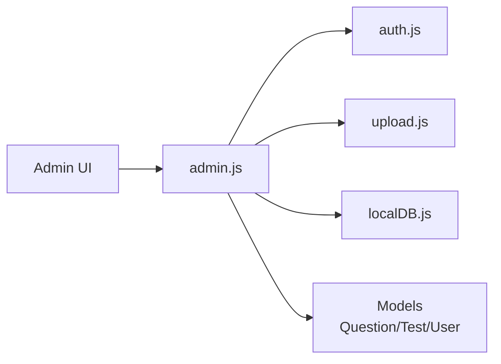

# Admin API

<cite>
**Referenced Files in This Document**
- [admin.js](file://Backend/src/routes/admin.js)
- [auth.js](file://Backend/src/middleware/auth.js)
- [upload.js](file://Backend/src/middleware/upload.js)
- [localDB.js](file://Backend/src/db/localDB.js)
- [errorHandler.js](file://Backend/src/middleware/errorHandler.js)
- [Question.js](file://Backend/src/models/Question.js)
- [Test.js](file://Backend/src/models/Test.js)
- [User.js](file://Backend/src/models/User.js)
- [AdminDashboard.jsx](file://Frontend/src/pages/admin/AdminDashboard.jsx)
- [QuestionsManager.jsx](file://Frontend/src/pages/admin/QuestionsManager.jsx)
- [MediaLibrary.jsx](file://Frontend/src/pages/admin/MediaLibrary.jsx)
- [ADMIN_ACCESS_GUIDE.md](file://Documentation/ADMIN_ACCESS_GUIDE.md)
- [ADMIN_FEATURES_COMPLETE.md](file://Documentation/ADMIN_FEATURES_COMPLETE.md)
- [seedData.js](file://Backend/src/seed/seedData.js)
- [package.json](file://Backend/package.json)
</cite>

## Table of Contents
1. [Introduction](#introduction)
2. [Project Structure](#project-structure)
3. [Core Components](#core-components)
4. [Architecture Overview](#architecture-overview)
5. [Detailed Component Analysis](#detailed-component-analysis)
6. [Dependency Analysis](#dependency-analysis)
7. [Performance Considerations](#performance-considerations)
8. [Troubleshooting Guide](#troubleshooting-guide)
9. [Conclusion](#conclusion)
10. [Appendices](#appendices)

## Introduction
This document provides comprehensive API documentation for Admin-only endpoints. It covers administrative workflows for content management (questions, tests, study materials), media library operations, user administration, and system configuration. It also details role-based access control, data validation, audit logging considerations, and operational procedures such as content approval workflows, user suspension, bulk content uploads, and system health monitoring. Security considerations for administrative access, backup operations, and disaster recovery procedures are addressed.

## Project Structure
The Admin API is implemented as Express routes protected by middleware that enforces JWT-based authentication and admin-only authorization. Data persistence uses a local JSON database abstraction layer, while file uploads are handled by a dedicated middleware supporting videos, PDFs, and images.

**Diagram sources**
- [admin.js](file://Backend/src/routes/admin.js#L1-L557)
- [auth.js](file://Backend/src/middleware/auth.js#L1-L92)
- [upload.js](file://Backend/src/middleware/upload.js#L1-L91)
- [localDB.js](file://Backend/src/db/localDB.js#L1-L222)
- [Question.js](file://Backend/src/models/Question.js#L1-L54)
- [Test.js](file://Backend/src/models/Test.js#L1-L77)
- [User.js](file://Backend/src/models/User.js#L1-L81)
- [AdminDashboard.jsx](file://Frontend/src/pages/admin/AdminDashboard.jsx#L1-L182)
- [QuestionsManager.jsx](file://Frontend/src/pages/admin/QuestionsManager.jsx#L1-L421)
- [MediaLibrary.jsx](file://Frontend/src/pages/admin/MediaLibrary.jsx#L1-L154)

**Section sources**
- [admin.js](file://Backend/src/routes/admin.js#L1-L557)
- [auth.js](file://Backend/src/middleware/auth.js#L1-L92)
- [upload.js](file://Backend/src/middleware/upload.js#L1-L91)
- [localDB.js](file://Backend/src/db/localDB.js#L1-L222)
- [Question.js](file://Backend/src/models/Question.js#L1-L54)
- [Test.js](file://Backend/src/models/Test.js#L1-L77)
- [User.js](file://Backend/src/models/User.js#L1-L81)
- [AdminDashboard.jsx](file://Frontend/src/pages/admin/AdminDashboard.jsx#L1-L182)
- [QuestionsManager.jsx](file://Frontend/src/pages/admin/QuestionsManager.jsx#L1-L421)
- [MediaLibrary.jsx](file://Frontend/src/pages/admin/MediaLibrary.jsx#L1-L154)

## Core Components
- Admin route protection: All admin endpoints are protected by two middleware layers:
  - Authentication: Validates JWT and attaches user context.
  - Authorization: Ensures the user has admin privileges.
- File upload: Single-file upload endpoint with type filtering and size limits, writing files to disk and recording metadata in the media collection.
- Data access: A local JSON database abstraction layer provides CRUD operations across multiple collections (users, tests, questions, media, settings, etc.).
- Models: Mongoose models define schemas for questions, tests, and users, including validation rules and indexes.

Key implementation references:
- Route protection and admin enforcement: [admin.js](file://Backend/src/routes/admin.js#L8-L10)
- Authentication middleware: [auth.js](file://Backend/src/middleware/auth.js#L5-L44)
- Admin-only middleware: [auth.js](file://Backend/src/middleware/auth.js#L68-L78)
- Upload middleware and file filtering: [upload.js](file://Backend/src/middleware/upload.js#L31-L83)
- Local database helpers: [localDB.js](file://Backend/src/db/localDB.js#L82-L219)
- Question model: [Question.js](file://Backend/src/models/Question.js#L3-L51)
- Test model: [Test.js](file://Backend/src/models/Test.js#L3-L74)
- User model: [User.js](file://Backend/src/models/User.js#L4-L55)

**Section sources**
- [admin.js](file://Backend/src/routes/admin.js#L8-L10)
- [auth.js](file://Backend/src/middleware/auth.js#L5-L44)
- [auth.js](file://Backend/src/middleware/auth.js#L68-L78)
- [upload.js](file://Backend/src/middleware/upload.js#L31-L83)
- [localDB.js](file://Backend/src/db/localDB.js#L82-L219)
- [Question.js](file://Backend/src/models/Question.js#L3-L51)
- [Test.js](file://Backend/src/models/Test.js#L3-L74)
- [User.js](file://Backend/src/models/User.js#L4-L55)

## Architecture Overview
The Admin API follows a layered architecture:
- Presentation: Admin UI components call admin endpoints.
- Application: Express routes implement admin workflows.
- Domain: Mongoose models define domain constraints.
- Infrastructure: Local JSON database abstraction and file system storage.

**Diagram sources**
- [admin.js](file://Backend/src/routes/admin.js#L1-L557)
- [auth.js](file://Backend/src/middleware/auth.js#L5-L44)
- [upload.js](file://Backend/src/middleware/upload.js#L31-L83)
- [localDB.js](file://Backend/src/db/localDB.js#L82-L219)

**Section sources**
- [admin.js](file://Backend/src/routes/admin.js#L1-L557)
- [auth.js](file://Backend/src/middleware/auth.js#L1-L92)
- [upload.js](file://Backend/src/middleware/upload.js#L1-L91)
- [localDB.js](file://Backend/src/db/localDB.js#L1-L222)

## Detailed Component Analysis

### Role-Based Access Control (RBAC)
- Authentication: Validates JWT from Authorization header and attaches user context.
- Authorization: Enforces admin-only access for all admin routes.
- Optional auth: Separate middleware for optional user attachment.

**Diagram sources**
- [auth.js](file://Backend/src/middleware/auth.js#L5-L44)
- [auth.js](file://Backend/src/middleware/auth.js#L68-L78)

**Section sources**
- [auth.js](file://Backend/src/middleware/auth.js#L5-L44)
- [auth.js](file://Backend/src/middleware/auth.js#L68-L78)

### Content Management Operations

#### Questions CRUD and Bulk Upload
- List questions: GET /api/admin/questions
- Create question: POST /api/admin/questions
- Update question: PUT /api/admin/questions/:id
- Delete question: DELETE /api/admin/questions/:id
- Bulk upload: POST /api/admin/questions/bulk (expects array of question objects)

**Diagram sources**
- [QuestionsManager.jsx](file://Frontend/src/pages/admin/QuestionsManager.jsx#L27-L57)
- [admin.js](file://Backend/src/routes/admin.js#L118-L168)
- [localDB.js](file://Backend/src/db/localDB.js#L135-L149)

**Section sources**
- [admin.js](file://Backend/src/routes/admin.js#L118-L168)
- [QuestionsManager.jsx](file://Frontend/src/pages/admin/QuestionsManager.jsx#L27-L57)
- [localDB.js](file://Backend/src/db/localDB.js#L135-L149)

#### Tests CRUD
- List tests: GET /api/admin/tests
- Create test: POST /api/admin/tests
- Update test: PUT /api/admin/tests/:id
- Delete test: DELETE /api/admin/tests/:id

**Diagram sources**
- [admin.js](file://Backend/src/routes/admin.js#L75-L115)
- [localDB.js](file://Backend/src/db/localDB.js#L119-L133)

**Section sources**
- [admin.js](file://Backend/src/routes/admin.js#L75-L115)
- [localDB.js](file://Backend/src/db/localDB.js#L119-L133)

#### Study Materials CRUD
- List materials: GET /api/admin/study-materials
- Create material: POST /api/admin/study-materials
- Update material: PUT /api/admin/study-materials/:id
- Delete material: DELETE /api/admin/study-materials/:id

**Diagram sources**
- [admin.js](file://Backend/src/routes/admin.js#L171-L211)
- [localDB.js](file://Backend/src/db/localDB.js#L82-L103)

**Section sources**
- [admin.js](file://Backend/src/routes/admin.js#L171-L211)
- [localDB.js](file://Backend/src/db/localDB.js#L82-L103)

### Media Library Operations
- Upload file: POST /api/admin/upload (multipart/form-data)
  - Accepts: images, PDFs, videos
  - Stores files under /uploads/{videos,pdfs,images}/
  - Records media metadata in the media collection
- File type detection and URL generation are handled by the upload middleware.

**Diagram sources**
- [MediaLibrary.jsx](file://Frontend/src/pages/admin/MediaLibrary.jsx#L9-L49)
- [admin.js](file://Backend/src/routes/admin.js#L243-L272)
- [upload.js](file://Backend/src/middleware/upload.js#L31-L83)
- [localDB.js](file://Backend/src/db/localDB.js#L119-L133)

**Section sources**
- [admin.js](file://Backend/src/routes/admin.js#L243-L272)
- [upload.js](file://Backend/src/middleware/upload.js#L31-L83)
- [MediaLibrary.jsx](file://Frontend/src/pages/admin/MediaLibrary.jsx#L9-L49)
- [localDB.js](file://Backend/src/db/localDB.js#L119-L133)

### User Administration
- List users: GET /api/admin/users
  - Returns sanitized user list excluding passwords
- Update user Pro Pass: PUT /api/admin/users/:id/pro-pass
  - Updates isProUser and proPassExpiry fields

**Diagram sources**
- [admin.js](file://Backend/src/routes/admin.js#L214-L240)
- [localDB.js](file://Backend/src/db/localDB.js#L170-L185)

**Section sources**
- [admin.js](file://Backend/src/routes/admin.js#L214-L240)
- [localDB.js](file://Backend/src/db/localDB.js#L170-L185)

### System Configuration
- Get settings: GET /api/admin/settings
- Update settings: PUT /api/admin/settings
  - Creates if none exists, otherwise updates existing record

**Diagram sources**
- [admin.js](file://Backend/src/routes/admin.js#L275-L299)
- [localDB.js](file://Backend/src/db/localDB.js#L82-L103)
- [localDB.js](file://Backend/src/db/localDB.js#L170-L185)

**Section sources**
- [admin.js](file://Backend/src/routes/admin.js#L275-L299)
- [localDB.js](file://Backend/src/db/localDB.js#L82-L103)
- [localDB.js](file://Backend/src/db/localDB.js#L170-L185)

### Additional Admin Workflows
- Dashboard stats: GET /api/admin/stats
  - Aggregates counts across users, testSeries, tests, questions, studyMaterials, exams, media
- Test categories (hierarchical): GET/POST/PUT/DELETE /api/admin/test-categories and path resolution
- Exam categories: GET/POST/PUT/DELETE /api/admin/exam-categories
- Exam info: GET/POST/PUT/DELETE /api/admin/exam-info
- Navigation menu: GET/POST/PUT/DELETE /api/admin/navigation
- Tag configs: GET/POST/PUT/DELETE /api/admin/tag-configs

These endpoints support advanced content organization and site configuration.

**Section sources**
- [admin.js](file://Backend/src/routes/admin.js#L13-L29)
- [admin.js](file://Backend/src/routes/admin.js#L302-L382)
- [admin.js](file://Backend/src/routes/admin.js#L384-L425)
- [admin.js](file://Backend/src/routes/admin.js#L428-L468)
- [admin.js](file://Backend/src/routes/admin.js#L471-L511)
- [admin.js](file://Backend/src/routes/admin.js#L514-L554)

## Dependency Analysis
- Express routes depend on:
  - Authentication middleware for token verification and admin checks
  - Upload middleware for file handling
  - Local database abstraction for data operations
- Models define domain constraints enforced by the application layer and database constraints.
- Frontend admin components call admin endpoints and rely on proper RBAC and error handling.

**Diagram sources**
- [admin.js](file://Backend/src/routes/admin.js#L1-L557)
- [auth.js](file://Backend/src/middleware/auth.js#L1-L92)
- [upload.js](file://Backend/src/middleware/upload.js#L1-L91)
- [localDB.js](file://Backend/src/db/localDB.js#L1-L222)
- [Question.js](file://Backend/src/models/Question.js#L1-L54)
- [Test.js](file://Backend/src/models/Test.js#L1-L77)
- [User.js](file://Backend/src/models/User.js#L1-L81)

**Section sources**
- [admin.js](file://Backend/src/routes/admin.js#L1-L557)
- [auth.js](file://Backend/src/middleware/auth.js#L1-L92)
- [upload.js](file://Backend/src/middleware/upload.js#L1-L91)
- [localDB.js](file://Backend/src/db/localDB.js#L1-L222)
- [Question.js](file://Backend/src/models/Question.js#L1-L54)
- [Test.js](file://Backend/src/models/Test.js#L1-L77)
- [User.js](file://Backend/src/models/User.js#L1-L81)

## Performance Considerations
- Local JSON database: Suitable for development and small-scale deployments. For production, consider migrating to a scalable database engine.
- File uploads: Multer limits file size to 500 MB; ensure adequate disk space and consider streaming uploads for very large files.
- Bulk operations: Use bulk endpoints judiciously; large inserts can impact performance and memory usage.
- Caching: Consider caching frequently accessed admin dashboards and static assets.

[No sources needed since this section provides general guidance]

## Troubleshooting Guide
Common issues and resolutions:
- 401 Unauthorized: Ensure a valid Bearer token is included in the Authorization header.
- 403 Forbidden: Confirm the user has admin privileges.
- Upload failures: Verify file type and size limits; check server logs for Multer errors.
- Database initialization: Ensure the local database is initialized and contains expected collections.

Operational references:
- Error handling middleware: [errorHandler.js](file://Backend/src/middleware/errorHandler.js#L11-L51)
- Admin access guide and troubleshooting steps: [ADMIN_ACCESS_GUIDE.md](file://Documentation/ADMIN_ACCESS_GUIDE.md#L54-L76)

**Section sources**
- [errorHandler.js](file://Backend/src/middleware/errorHandler.js#L11-L51)
- [ADMIN_ACCESS_GUIDE.md](file://Documentation/ADMIN_ACCESS_GUIDE.md#L54-L76)

## Conclusion
The Admin API provides a comprehensive set of endpoints for managing content, users, media, and system configuration. It enforces strict RBAC using JWT and admin middleware, supports file uploads with type filtering, and offers bulk operations for efficient content management. Administrators can monitor platform health via dashboard statistics and maintain system settings centrally. For production environments, consider enhancing security, scalability, and observability.

[No sources needed since this section summarizes without analyzing specific files]

## Appendices

### Administrative Workflows

#### Content Approval Workflow
- Create/update questions/tests/study materials via respective endpoints.
- Use bulk upload for high-volume ingestion.
- Monitor progress via dashboard stats.

References:
- [admin.js](file://Backend/src/routes/admin.js#L118-L168)
- [admin.js](file://Backend/src/routes/admin.js#L75-L115)
- [admin.js](file://Backend/src/routes/admin.js#L171-L211)
- [QuestionsManager.jsx](file://Frontend/src/pages/admin/QuestionsManager.jsx#L127-L159)
- [AdminDashboard.jsx](file://Frontend/src/pages/admin/AdminDashboard.jsx#L16-L33)

**Section sources**
- [admin.js](file://Backend/src/routes/admin.js#L118-L168)
- [admin.js](file://Backend/src/routes/admin.js#L75-L115)
- [admin.js](file://Backend/src/routes/admin.js#L171-L211)
- [QuestionsManager.jsx](file://Frontend/src/pages/admin/QuestionsManager.jsx#L127-L159)
- [AdminDashboard.jsx](file://Frontend/src/pages/admin/AdminDashboard.jsx#L16-L33)

#### User Suspension Procedure
- Retrieve user list to identify target user.
- Update Pro Pass status using the Pro Pass endpoint to restrict access if needed.
- For account suspension, consider marking user inactive at the application level and updating policies accordingly.

References:
- [admin.js](file://Backend/src/routes/admin.js#L214-L240)
- [User.js](file://Backend/src/models/User.js#L33-L43)

**Section sources**
- [admin.js](file://Backend/src/routes/admin.js#L214-L240)
- [User.js](file://Backend/src/models/User.js#L33-L43)

#### Bulk Content Upload
- Use the bulk upload endpoint for questions.
- Follow CSV format guidelines provided by the UI component.
- Monitor upload progress and confirm successful ingestion.

References:
- [admin.js](file://Backend/src/routes/admin.js#L136-L144)
- [QuestionsManager.jsx](file://Frontend/src/pages/admin/QuestionsManager.jsx#L127-L159)

**Section sources**
- [admin.js](file://Backend/src/routes/admin.js#L136-L144)
- [QuestionsManager.jsx](file://Frontend/src/pages/admin/QuestionsManager.jsx#L127-L159)

#### System Health Monitoring
- Fetch dashboard stats to monitor platform metrics.
- Use health endpoints and logs to diagnose issues.

References:
- [AdminDashboard.jsx](file://Frontend/src/pages/admin/AdminDashboard.jsx#L16-L33)
- [ADMIN_ACCESS_GUIDE.md](file://Documentation/ADMIN_ACCESS_GUIDE.md#L18-L76)

**Section sources**
- [AdminDashboard.jsx](file://Frontend/src/pages/admin/AdminDashboard.jsx#L16-L33)
- [ADMIN_ACCESS_GUIDE.md](file://Documentation/ADMIN_ACCESS_GUIDE.md#L18-L76)

### Security Considerations
- Admin access: Enforce RBAC using JWT and admin middleware.
- Token lifecycle: Implement token refresh and expiration policies.
- File uploads: Restrict file types and enforce size limits.
- Audit logging: Record sensitive admin actions for compliance and incident response.

References:
- [auth.js](file://Backend/src/middleware/auth.js#L5-L44)
- [auth.js](file://Backend/src/middleware/auth.js#L68-L78)
- [upload.js](file://Backend/src/middleware/upload.js#L56-L83)

**Section sources**
- [auth.js](file://Backend/src/middleware/auth.js#L5-L44)
- [auth.js](file://Backend/src/middleware/auth.js#L68-L78)
- [upload.js](file://Backend/src/middleware/upload.js#L56-L83)

### Backup and Disaster Recovery
- Local database: Back up the JSON database file regularly.
- Media files: Back up uploaded files stored under the uploads directory.
- Configuration: Maintain backups of app settings and navigation configurations.

References:
- [localDB.js](file://Backend/src/db/localDB.js#L48-L73)
- [upload.js](file://Backend/src/middleware/upload.js#L11-L25)
- [seedData.js](file://Backend/src/seed/seedData.js#L4-L21)

**Section sources**
- [localDB.js](file://Backend/src/db/localDB.js#L48-L73)
- [upload.js](file://Backend/src/middleware/upload.js#L11-L25)
- [seedData.js](file://Backend/src/seed/seedData.js#L4-L21)

### Data Validation and Constraints
- Questions: Required fields include testId, question number, text, options, correctOption, section, difficulty, and image.
- Tests: Required fields include seriesId, slug, title, category, type, questions, duration, marks, and isActive.
- Users: Email uniqueness, password constraints, and Pro Pass validity checks.

References:
- [Question.js](file://Backend/src/models/Question.js#L3-L51)
- [Test.js](file://Backend/src/models/Test.js#L3-L74)
- [User.js](file://Backend/src/models/User.js#L4-L55)

**Section sources**
- [Question.js](file://Backend/src/models/Question.js#L3-L51)
- [Test.js](file://Backend/src/models/Test.js#L3-L74)
- [User.js](file://Backend/src/models/User.js#L4-L55)

### Example Endpoints Summary
- Dashboard stats: GET /api/admin/stats
- Questions: GET/POST/PUT/DELETE /api/admin/questions, POST /api/admin/questions/bulk
- Tests: GET/POST/PUT/DELETE /api/admin/tests
- Study materials: GET/POST/PUT/DELETE /api/admin/study-materials
- Users: GET /api/admin/users, PUT /api/admin/users/:id/pro-pass
- Upload: POST /api/admin/upload
- Settings: GET/PUT /api/admin/settings
- Additional: Test categories, exam categories, exam info, navigation, tag configs

**Section sources**
- [admin.js](file://Backend/src/routes/admin.js#L13-L29)
- [admin.js](file://Backend/src/routes/admin.js#L118-L168)
- [admin.js](file://Backend/src/routes/admin.js#L75-L115)
- [admin.js](file://Backend/src/routes/admin.js#L171-L211)
- [admin.js](file://Backend/src/routes/admin.js#L214-L240)
- [admin.js](file://Backend/src/routes/admin.js#L243-L272)
- [admin.js](file://Backend/src/routes/admin.js#L275-L299)
- [admin.js](file://Backend/src/routes/admin.js#L302-L382)
- [admin.js](file://Backend/src/routes/admin.js#L384-L425)
- [admin.js](file://Backend/src/routes/admin.js#L428-L468)
- [admin.js](file://Backend/src/routes/admin.js#L471-L511)
- [admin.js](file://Backend/src/routes/admin.js#L514-L554)

*Last Updated: March 10, 2026 | Update date is (20:16)*
