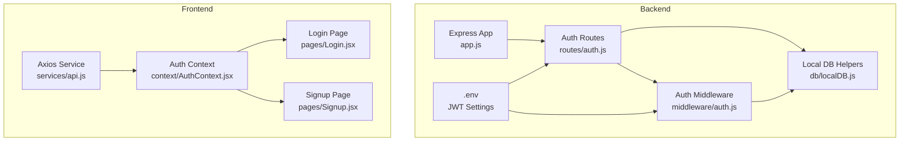
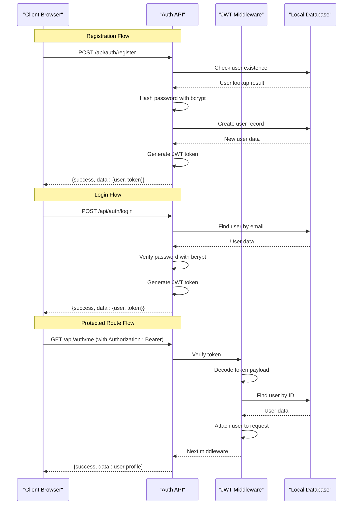
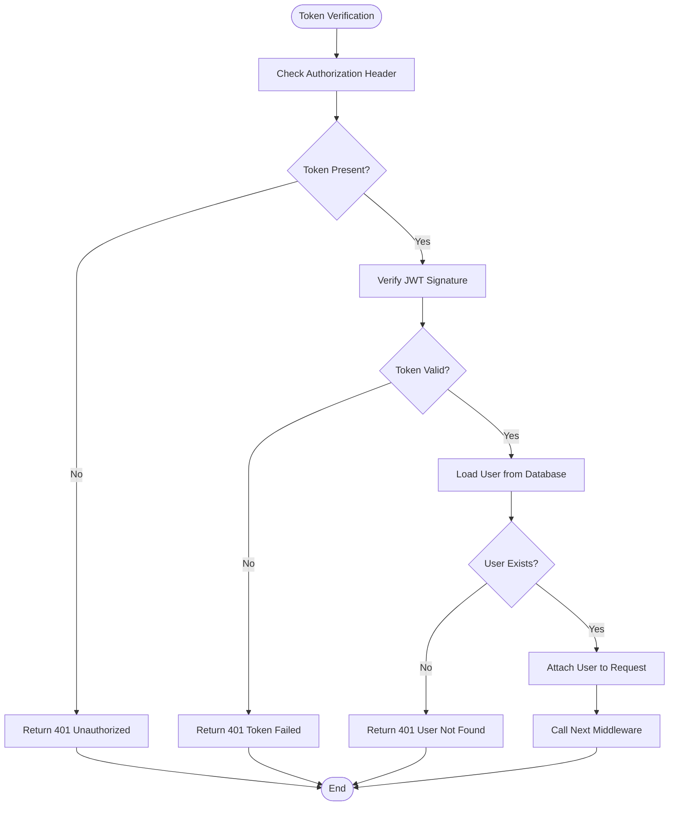
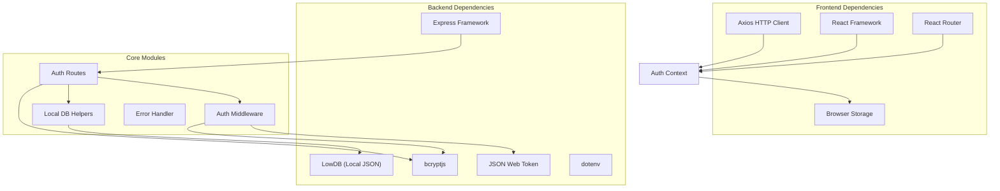

# Authentication API

<cite>
**Referenced Files in This Document**
- [Backend/src/routes/auth.js](file://Backend/src/routes/auth.js)
- [Backend/src/middleware/auth.js](file://Backend/src/middleware/auth.js)
- [Backend/src/db/localDB.js](file://Backend/src/db/localDB.js)
- [Backend/src/app.js](file://Backend/src/app.js)
- [Backend/.env](file://Backend/.env)
- [Backend/src/middleware/errorHandler.js](file://Backend/src/middleware/errorHandler.js)
- [Frontend/src/services/api.js](file://Frontend/src/services/api.js)
- [Frontend/src/context/AuthContext.jsx](file://Frontend/src/context/AuthContext.jsx)
- [Frontend/src/pages/Login.jsx](file://Frontend/src/pages/Login.jsx)
- [Frontend/src/pages/Signup.jsx](file://Frontend/src/pages/Signup.jsx)
</cite>

## Table of Contents
1. [Introduction](#introduction)
2. [Project Structure](#project-structure)
3. [Core Components](#core-components)
4. [Architecture Overview](#architecture-overview)
5. [Detailed Component Analysis](#detailed-component-analysis)
6. [Dependency Analysis](#dependency-analysis)
7. [Performance Considerations](#performance-considerations)
8. [Troubleshooting Guide](#troubleshooting-guide)
9. [Conclusion](#conclusion)

## Introduction
This document provides comprehensive API documentation for the Authentication endpoints in the Trstprep V2 application. It covers the complete authentication flow including user registration, login, profile retrieval, and logout. The documentation details HTTP methods, URL patterns, request body schemas with validation rules, response formats, error codes, JWT token generation and expiration settings, token-based authentication middleware, and security considerations including password hashing with bcrypt, email validation, and session management. Additionally, it includes client-side integration examples, error handling strategies, and best practices for token storage and renewal.

## Project Structure
The authentication system spans both the backend Express server and the frontend React application:

- Backend (Express + Local JSON Database):
  - Authentication routes under `/api/auth`
  - JWT middleware for route protection
  - Local database helpers for user operations
  - Environment configuration for JWT settings

- Frontend (React + Vite):
  - API service layer using Axios interceptors
  - Authentication context managing user sessions
  - Login and Signup pages with form validation
  - Protected route handling



**Diagram sources**
- [Backend/src/app.js](file://Backend/src/app.js#L56-L62)
- [Backend/src/routes/auth.js](file://Backend/src/routes/auth.js#L1-L174)
- [Backend/src/middleware/auth.js](file://Backend/src/middleware/auth.js#L1-L92)
- [Backend/src/db/localDB.js](file://Backend/src/db/localDB.js#L1-L221)
- [Backend/.env](file://Backend/.env#L1-L17)
- [Frontend/src/services/api.js](file://Frontend/src/services/api.js#L1-L92)
- [Frontend/src/context/AuthContext.jsx](file://Frontend/src/context/AuthContext.jsx#L1-L203)
- [Frontend/src/pages/Login.jsx](file://Frontend/src/pages/Login.jsx#L1-L212)
- [Frontend/src/pages/Signup.jsx](file://Frontend/src/pages/Signup.jsx#L1-L296)

**Section sources**
- [Backend/src/app.js](file://Backend/src/app.js#L1-L94)
- [Backend/src/routes/auth.js](file://Backend/src/routes/auth.js#L1-L174)
- [Frontend/src/services/api.js](file://Frontend/src/services/api.js#L1-L92)

## Core Components
The authentication system consists of four primary endpoints that handle user lifecycle management:

### Authentication Endpoints
- **POST /api/auth/register**: Creates new user accounts with validated credentials
- **POST /api/auth/login**: Authenticates existing users and generates JWT tokens
- **GET /api/auth/me**: Retrieves current authenticated user profile
- **POST /api/auth/logout**: Handles client-side token removal for logout

### JWT Token Management
The system implements stateless token-based authentication using JSON Web Tokens with configurable expiration settings. Tokens are signed using a secret key and include user identification claims.

### Session Management
The frontend maintains user sessions using localStorage with configurable expiration periods (1 day vs 30 days for "remember me" option).

**Section sources**
- [Backend/src/routes/auth.js](file://Backend/src/routes/auth.js#L16-L171)
- [Backend/src/middleware/auth.js](file://Backend/src/middleware/auth.js#L4-L44)
- [Backend/.env](file://Backend/.env#L10-L13)
- [Frontend/src/context/AuthContext.jsx](file://Frontend/src/context/AuthContext.jsx#L43-L98)

## Architecture Overview
The authentication architecture follows a client-server model with JWT-based stateless authentication:



**Diagram sources**
- [Backend/src/routes/auth.js](file://Backend/src/routes/auth.js#L19-L71)
- [Backend/src/routes/auth.js](file://Backend/src/routes/auth.js#L76-L124)
- [Backend/src/routes/auth.js](file://Backend/src/routes/auth.js#L129-L161)
- [Backend/src/middleware/auth.js](file://Backend/src/middleware/auth.js#L5-L44)
- [Backend/src/db/localDB.js](file://Backend/src/db/localDB.js#L82-L132)

## Detailed Component Analysis

### JWT Token Generation and Middleware
The authentication system uses JSON Web Tokens for stateless authentication. The token generation process includes:

#### Token Generation
- Secret key configured via environment variable
- Default expiration of 7 days
- Token payload contains user ID claim
- Secure signing algorithm with HMAC SHA256

#### Token Verification Middleware
- Extracts Bearer token from Authorization header
- Verifies token signature against secret key
- Validates token expiration
- Loads user data from database using token payload
- Attaches user object to request for downstream handlers



**Diagram sources**
- [Backend/src/middleware/auth.js](file://Backend/src/middleware/auth.js#L5-L44)
- [Backend/src/routes/auth.js](file://Backend/src/routes/auth.js#L10-L14)

**Section sources**
- [Backend/src/middleware/auth.js](file://Backend/src/middleware/auth.js#L1-L92)
- [Backend/src/routes/auth.js](file://Backend/src/routes/auth.js#L9-L14)
- [Backend/.env](file://Backend/.env#L10-L13)

### Registration Endpoint
The registration endpoint handles new user account creation with comprehensive validation and security measures.

#### Endpoint Specification
- **Method**: POST
- **URL**: `/api/auth/register`
- **Access**: Public
- **Purpose**: Create new user accounts

#### Request Body Schema
| Field | Type | Required | Validation Rules |
|-------|------|----------|-------------------|
| name | string | Yes | Required, max 50 characters |
| email | string | Yes | Required, valid email format |
| password | string | Yes | Required, min 8 characters |
| mobile | string | No | Optional, trimmed |

#### Response Format
Successful registration returns:
```json
{
  "success": true,
  "data": {
    "user": {
      "id": "string",
      "name": "string",
      "email": "string",
      "role": "string",
      "isProUser": boolean
    },
    "token": "string"
  }
}
```

#### Error Handling
- **400**: User already exists with this email
- **500**: Internal server error during processing

#### Security Measures
- Duplicate email prevention
- Password hashing with bcrypt (cost factor 10)
- Automatic role assignment (default: user)
- Creation timestamp tracking

**Section sources**
- [Backend/src/routes/auth.js](file://Backend/src/routes/auth.js#L16-L71)

### Login Endpoint
The login endpoint authenticates existing users and issues JWT tokens for session management.

#### Endpoint Specification
- **Method**: POST
- **URL**: `/api/auth/login`
- **Access**: Public
- **Purpose**: Authenticate user credentials

#### Request Body Schema
| Field | Type | Required | Validation Rules |
|-------|------|----------|-------------------|
| email | string | Yes | Required, valid email format |
| password | string | Yes | Required, min 8 characters |

#### Response Format
Successful login returns:
```json
{
  "success": true,
  "data": {
    "user": {
      "id": "string",
      "name": "string",
      "email": "string",
      "role": "string",
      "isProUser": boolean,
      "proPassExpiry": "date|null"
    },
    "token": "string"
  }
}
```

#### Error Handling
- **401**: Invalid email or password
- **500**: Internal server error during processing

#### Security Measures
- Password verification using bcrypt comparison
- Immediate token generation upon successful authentication
- No password field returned in response

**Section sources**
- [Backend/src/routes/auth.js](file://Backend/src/routes/auth.js#L73-L124)

### Profile Retrieval Endpoint
The profile retrieval endpoint provides authenticated users with their complete profile information.

#### Endpoint Specification
- **Method**: GET
- **URL**: `/api/auth/me`
- **Access**: Private (requires valid JWT)
- **Purpose**: Retrieve current authenticated user profile

#### Authentication Requirements
- Authorization header with Bearer token
- Valid JWT token verification
- Active user account in database

#### Response Format
Profile retrieval returns:
```json
{
  "success": true,
  "data": {
    "id": "string",
    "name": "string",
    "email": "string",
    "mobile": "string",
    "role": "string",
    "isProUser": boolean,
    "proPassExpiry": "date|null",
    "enrolledSeries": [],
    "createdAt": "timestamp"
  }
}
```

#### Error Handling
- **401**: Not authorized (missing/invalid token)
- **404**: User not found
- **500**: Internal server error

#### Security Measures
- Token-based authentication enforcement
- User data filtering (password excluded)
- Admin role detection and attachment

**Section sources**
- [Backend/src/routes/auth.js](file://Backend/src/routes/auth.js#L126-L161)
- [Backend/src/middleware/auth.js](file://Backend/src/middleware/auth.js#L4-L44)

### Logout Endpoint
The logout endpoint handles client-side token removal and session cleanup.

#### Endpoint Specification
- **Method**: POST
- **URL**: `/api/auth/logout`
- **Access**: Private (requires valid JWT)
- **Purpose**: Client-side token removal

#### Response Format
Logout returns:
```json
{
  "success": true,
  "message": "Logged out successfully"
}
```

#### Implementation Notes
- Server-side logout is handled client-side
- Token removal occurs in frontend localStorage
- No server-side session invalidation

**Section sources**
- [Backend/src/routes/auth.js](file://Backend/src/routes/auth.js#L163-L171)

### Frontend Integration
The frontend implements comprehensive authentication handling with robust error management and user experience features.

#### Authentication Context
The AuthContext manages:
- User authentication state
- Session persistence with localStorage
- Token storage and retrieval
- Error handling and display
- User session validation with expiration checks

#### API Service Layer
The Axios service provides:
- Automatic token injection in Authorization headers
- Global error handling for 401 Unauthorized responses
- Network error detection and logging
- Centralized endpoint definitions

#### Client-Side Token Storage
- Primary token storage: `localStorage.getItem('token')`
- Session storage: `localStorage.getItem('trstprep_session')`
- Session expiration: 1 day (default) or 30 days (remember me)
- Automatic cleanup on authentication failures

#### Form Validation and Error Handling
- Real-time form validation in Login and Signup pages
- Comprehensive error messaging
- Loading states during authentication requests
- Demo user support for local development

**Section sources**
- [Frontend/src/context/AuthContext.jsx](file://Frontend/src/context/AuthContext.jsx#L1-L203)
- [Frontend/src/services/api.js](file://Frontend/src/services/api.js#L1-L92)
- [Frontend/src/pages/Login.jsx](file://Frontend/src/pages/Login.jsx#L1-L212)
- [Frontend/src/pages/Signup.jsx](file://Frontend/src/pages/Signup.jsx#L1-L296)

## Dependency Analysis
The authentication system exhibits clear separation of concerns with well-defined dependencies:



**Diagram sources**
- [Backend/src/app.js](file://Backend/src/app.js#L1-L94)
- [Backend/src/routes/auth.js](file://Backend/src/routes/auth.js#L1-L7)
- [Backend/src/middleware/auth.js](file://Backend/src/middleware/auth.js#L1-L3)
- [Backend/src/db/localDB.js](file://Backend/src/db/localDB.js#L1-L7)
- [Frontend/src/services/api.js](file://Frontend/src/services/api.js#L1-L10)
- [Frontend/src/context/AuthContext.jsx](file://Frontend/src/context/AuthContext.jsx#L1-L4)

### Security Considerations
The authentication system implements multiple layers of security:

#### Password Security
- bcrypt hashing with cost factor 10
- Salt generation for each password
- No plaintext password storage
- Password verification using bcrypt compare

#### Token Security
- JWT secret key configuration via environment variables
- Configurable token expiration (default 7 days)
- Token signature verification
- No sensitive user data in token payload

#### Input Validation
- Email format validation using regex patterns
- Password length requirements (minimum 8 characters)
- Name length limits (maximum 50 characters)
- Mobile number validation (optional field)

#### Session Management
- Client-side session storage with expiration
- Automatic session cleanup on logout
- Token removal on authentication failures
- Support for "remember me" functionality

**Section sources**
- [Backend/src/routes/auth.js](file://Backend/src/routes/auth.js#L32-L33)
- [Backend/src/routes/auth.js](file://Backend/src/routes/auth.js#L92-L93)
- [Backend/src/middleware/auth.js](file://Backend/src/middleware/auth.js#L21-L22)
- [Backend/.env](file://Backend/.env#L10-L13)
- [Frontend/src/context/AuthContext.jsx](file://Frontend/src/context/AuthContext.jsx#L66-L87)

## Performance Considerations
The authentication system is designed for optimal performance with several considerations:

### Database Operations
- Efficient user lookup by email using local database indexing
- Minimal database queries per authentication operation
- Batch operations for user creation and updates

### Token Operations
- Fast bcrypt hashing and verification
- Lightweight JWT signature verification
- Minimal memory footprint for token processing

### Frontend Performance
- Local storage operations for session management
- Efficient Axios interceptor usage
- Optimized React component rendering

### Scalability Notes
- Current implementation uses local JSON database
- Migration path to MongoDB/Mongoose available
- Stateless JWT design supports horizontal scaling

## Troubleshooting Guide

### Common Authentication Issues

#### Login Failures
- **Invalid Credentials**: Check email/password combination
- **Account Not Found**: Verify user exists in database
- **Password Mismatch**: Ensure bcrypt password verification succeeds

#### Token Issues
- **Token Expired**: Generate new token or implement refresh mechanism
- **Invalid Token**: Verify JWT secret key matches backend configuration
- **Token Not Provided**: Ensure Authorization header includes Bearer token

#### Database Connectivity
- **Connection Errors**: Verify local database initialization
- **User Not Found**: Check user exists in database collection
- **Duplicate Users**: Validate email uniqueness constraint

#### Frontend Integration
- **Session Persistence**: Verify localStorage availability
- **Token Storage**: Check token is properly stored after login
- **Authorization Headers**: Ensure Bearer token is included in requests

### Error Response Patterns
The system returns standardized error responses:

```json
{
  "success": false,
  "message": "Error message describing the issue"
}
```

Common HTTP status codes:
- **200**: Successful operations
- **400**: Bad request/validation errors
- **401**: Authentication failures
- **404**: Resource not found
- **500**: Internal server errors

### Debugging Tips
- Enable development logging for detailed error information
- Check JWT secret key configuration
- Verify database connectivity and user data
- Monitor frontend localStorage operations
- Test token expiration and renewal scenarios

**Section sources**
- [Backend/src/middleware/errorHandler.js](file://Backend/src/middleware/errorHandler.js#L1-L52)
- [Backend/src/middleware/auth.js](file://Backend/src/middleware/auth.js#L38-L43)
- [Backend/src/db/localDB.js](file://Backend/src/db/localDB.js#L68-L71)

## Conclusion
The Trstprep V2 authentication system provides a robust, secure, and scalable foundation for user management. The implementation combines JWT-based stateless authentication with comprehensive security measures including bcrypt password hashing, input validation, and proper error handling. The frontend integration offers excellent user experience with automatic token management, session persistence, and comprehensive error handling.

Key strengths of the implementation include:
- Stateless JWT authentication design
- Strong password security with bcrypt
- Comprehensive input validation
- Robust error handling and logging
- Clean separation of frontend and backend concerns
- Extensible architecture supporting future enhancements

The system is production-ready with clear migration paths for scaling to enterprise-level requirements while maintaining simplicity for development and testing environments.

*Last Updated: March 10, 2026 | Update date is (20:16)*
