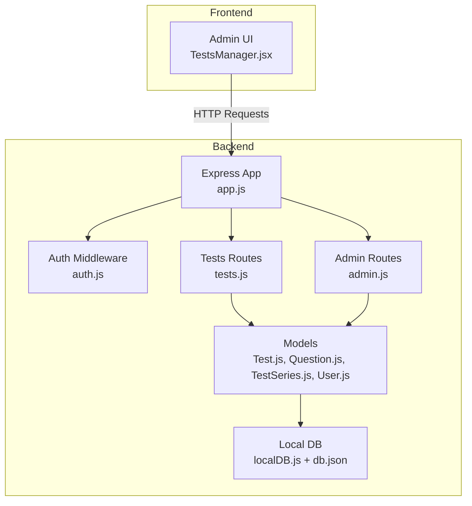
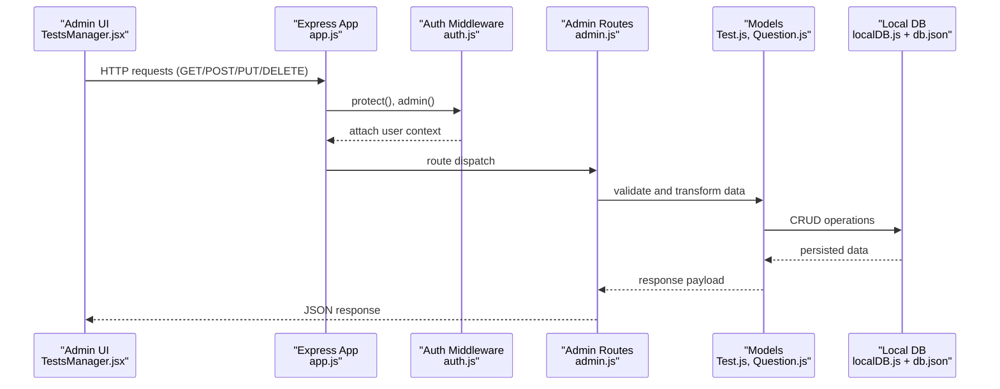
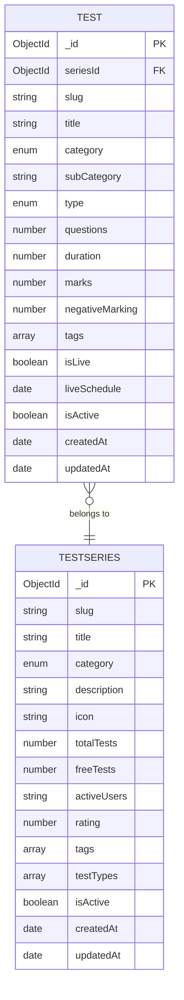
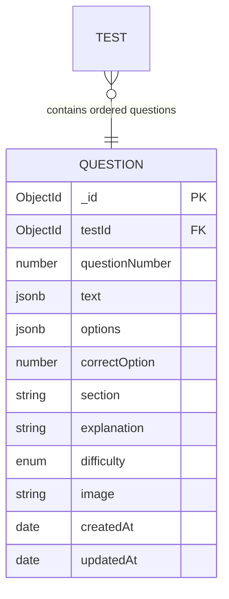
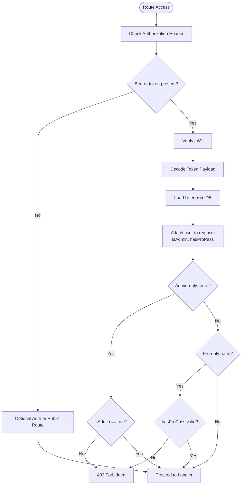
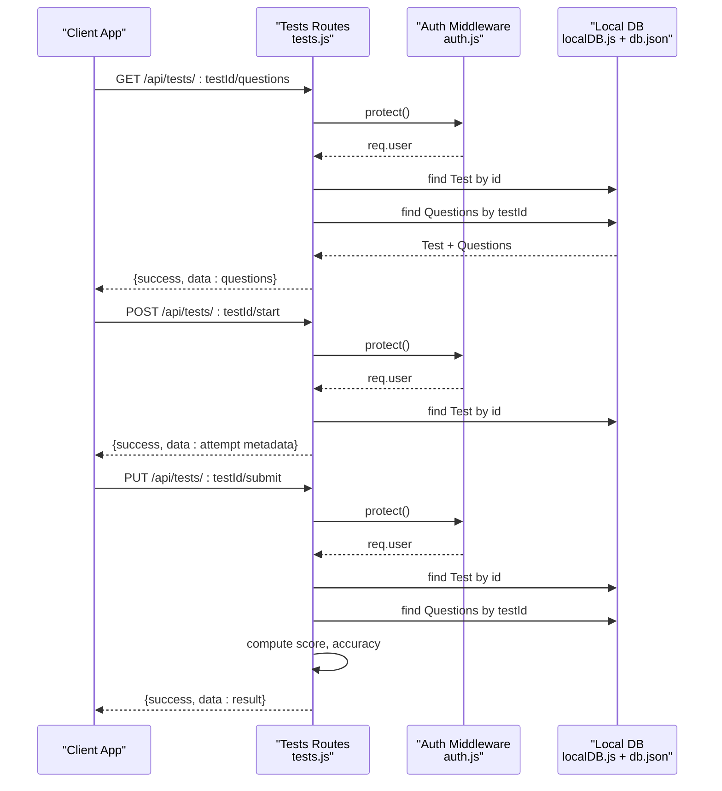
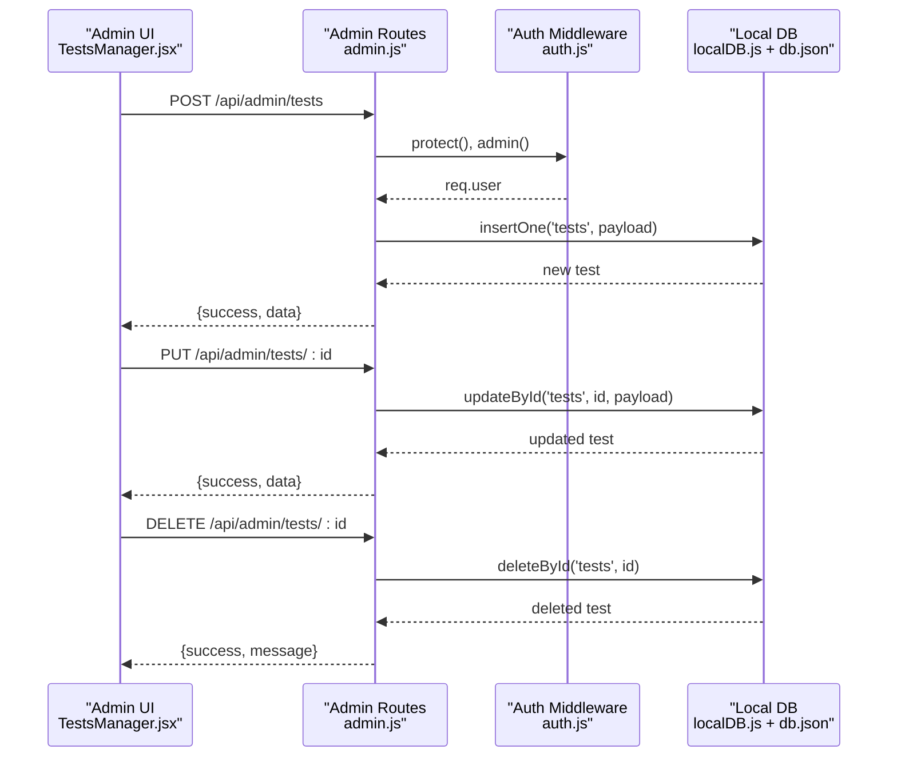
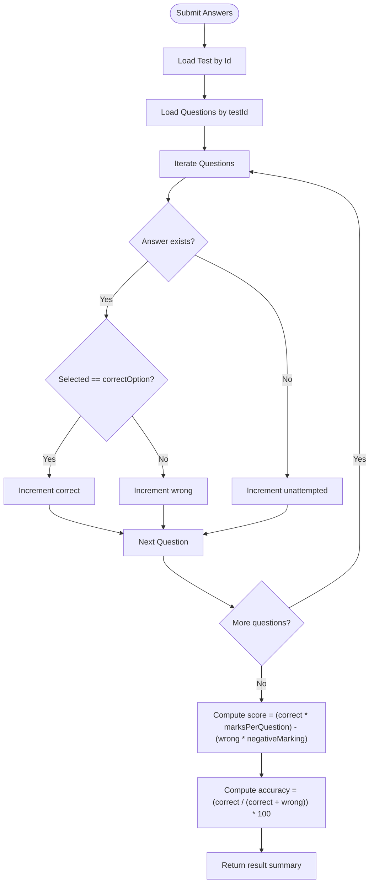
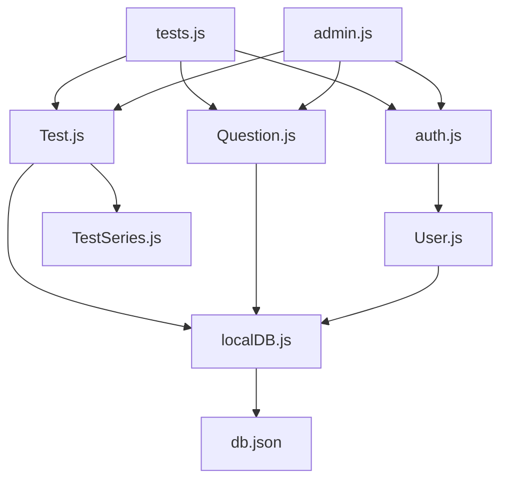

# Test Administration API

<cite>
**Referenced Files in This Document**
- [tests.js](file://Backend/src/routes/tests.js)
- [auth.js](file://Backend/src/middleware/auth.js)
- [Test.js](file://Backend/src/models/Test.js)
- [Question.js](file://Backend/src/models/Question.js)
- [TestSeries.js](file://Backend/src/models/TestSeries.js)
- [User.js](file://Backend/src/models/User.js)
- [localDB.js](file://Backend/src/db/localDB.js)
- [app.js](file://Backend/src/app.js)
- [admin.js](file://Backend/src/routes/admin.js)
- [db.json](file://Backend/data/db.json)
- [TestsManager.jsx](file://Frontend/src/pages/admin/TestsManager.jsx)
</cite>

## Table of Contents
1. [Introduction](#introduction)
2. [Project Structure](#project-structure)
3. [Core Components](#core-components)
4. [Architecture Overview](#architecture-overview)
5. [Detailed Component Analysis](#detailed-component-analysis)
6. [Dependency Analysis](#dependency-analysis)
7. [Performance Considerations](#performance-considerations)
8. [Troubleshooting Guide](#troubleshooting-guide)
9. [Conclusion](#conclusion)
10. [Appendices](#appendices)

## Introduction
This document provides comprehensive API documentation for Test Administration endpoints. It covers test lifecycle management, question CRUD operations, test attempts, and result retrieval. It also details the Test and Question models, authentication and authorization requirements, scheduling and timer integration, and result calculation algorithms. Examples demonstrate test configuration, question management, attempt submission workflows, and result analytics generation.

## Project Structure
The backend uses Express.js with a local JSON database (lowdb) and JWT-based authentication. Routes are organized by domain: public tests, admin management, and shared middleware. Models define schemas for Test, Question, TestSeries, and User. The frontend includes an admin panel for managing tests and questions.

**Diagram sources**
- [app.js](file://Backend/src/app.js#L1-L94)
- [auth.js](file://Backend/src/middleware/auth.js#L1-L92)
- [tests.js](file://Backend/src/routes/tests.js#L1-L265)
- [admin.js](file://Backend/src/routes/admin.js#L1-L557)
- [Test.js](file://Backend/src/models/Test.js#L1-L77)
- [Question.js](file://Backend/src/models/Question.js#L1-L54)
- [TestSeries.js](file://Backend/src/models/TestSeries.js#L1-L71)
- [User.js](file://Backend/src/models/User.js#L1-L81)
- [localDB.js](file://Backend/src/db/localDB.js#L1-L222)
- [db.json](file://Backend/data/db.json#L1-L728)
- [TestsManager.jsx](file://Frontend/src/pages/admin/TestsManager.jsx#L1-L527)

**Section sources**
- [app.js](file://Backend/src/app.js#L1-L94)
- [tests.js](file://Backend/src/routes/tests.js#L1-L265)
- [admin.js](file://Backend/src/routes/admin.js#L1-L557)

## Core Components
- Test model: Defines test metadata, timing, scoring, and availability flags.
- Question model: Supports multi-language content, difficulty levels, and answer validation.
- Authentication middleware: Enforces JWT-based protection, optional auth, admin-only access, and Pro Pass checks.
- Local database helpers: Provide CRUD operations against a JSON file for development and testing.

Key responsibilities:
- Test administration endpoints manage test creation, updates, deletions, and question CRUD via admin routes.
- Public test endpoints enable test discovery, question retrieval, attempt initiation, submission, and result retrieval.
- User model supports role-based access and Pro Pass validation.

**Section sources**
- [Test.js](file://Backend/src/models/Test.js#L1-L77)
- [Question.js](file://Backend/src/models/Question.js#L1-L54)
- [User.js](file://Backend/src/models/User.js#L1-L81)
- [auth.js](file://Backend/src/middleware/auth.js#L1-L92)
- [localDB.js](file://Backend/src/db/localDB.js#L1-L222)

## Architecture Overview
The system integrates frontend admin panels with backend routes and a local JSON database. Authentication middleware secures routes, and models enforce data integrity.

**Diagram sources**
- [TestsManager.jsx](file://Frontend/src/pages/admin/TestsManager.jsx#L1-L527)
- [app.js](file://Backend/src/app.js#L1-L94)
- [auth.js](file://Backend/src/middleware/auth.js#L1-L92)
- [admin.js](file://Backend/src/routes/admin.js#L1-L557)
- [Test.js](file://Backend/src/models/Test.js#L1-L77)
- [Question.js](file://Backend/src/models/Question.js#L1-L54)
- [localDB.js](file://Backend/src/db/localDB.js#L1-L222)
- [db.json](file://Backend/data/db.json#L1-L728)

## Detailed Component Analysis

### Test Model Schema
The Test model defines test metadata, configuration, and status controls. It includes relationships to TestSeries and indexing for efficient queries.

Key attributes and constraints:
- Required fields: title, category, questions, duration, marks.
- Defaults: type defaults to "Pro", negativeMarking defaults to 0.25.
- Indexes: compound unique index on seriesId + slug, category, type for fast filtering.
- Status: isLive toggles scheduled availability; liveSchedule stores the start time.

**Diagram sources**
- [Test.js](file://Backend/src/models/Test.js#L1-L77)
- [TestSeries.js](file://Backend/src/models/TestSeries.js#L1-L71)

**Section sources**
- [Test.js](file://Backend/src/models/Test.js#L1-L77)
- [TestSeries.js](file://Backend/src/models/TestSeries.js#L1-L71)

### Question Model Schema
The Question model supports multi-language content, difficulty levels, and answer validation. It maintains ordering per test and enforces constraints.

Key attributes and constraints:
- Multi-language support: text and options are stored per language (e.g., English and Hindi).
- Answer validation: correctOption is 0-indexed and constrained to 0-3.
- Ordering: questionNumber ensures sequential presentation.
- Indexes: compound unique index on testId + questionNumber.

**Diagram sources**
- [Question.js](file://Backend/src/models/Question.js#L1-L54)
- [Test.js](file://Backend/src/models/Test.js#L1-L77)

**Section sources**
- [Question.js](file://Backend/src/models/Question.js#L1-L54)

### Authentication and Authorization
Authentication middleware enforces:
- protect(): Requires a valid JWT bearer token and attaches user context with isAdmin flag.
- optionalAuth(): Attempts to decode token but continues without user if absent or invalid.
- admin(): Restricts routes to users with isAdmin=true.
- proPass(): Validates Pro Pass eligibility based on user flags and expiry.

**Diagram sources**
- [auth.js](file://Backend/src/middleware/auth.js#L1-L92)
- [User.js](file://Backend/src/models/User.js#L1-L81)

**Section sources**
- [auth.js](file://Backend/src/middleware/auth.js#L1-L92)
- [User.js](file://Backend/src/models/User.js#L1-L81)

### Test Administration Endpoints
These endpoints are exposed under /api/tests and are primarily used by the admin UI for managing tests and questions.

- GET /api/tests/:testId/questions
  - Purpose: Retrieve test questions for attempting a test.
  - Authentication: Private (protect).
  - Access Control: Pro-only tests require a valid Pro Pass.
  - Response: Returns questions excluding correct answers and explanations.

- POST /api/tests/:testId/start
  - Purpose: Initiate a test attempt.
  - Authentication: Private (protect).
  - Access Control: Pro-only tests require a valid Pro Pass.
  - Response: Returns attempt metadata including attemptId, testId, startTime, duration, and question count.

- PUT /api/tests/:testId/submit
  - Purpose: Submit test answers and calculate results.
  - Authentication: Private (protect).
  - Input: answers array, timeSpent, attemptId.
  - Calculation: Computes correct, wrong, unattempted counts; score using per-question marks and negative marking; accuracy percentage.
  - Response: Returns result summary including score, totalMarks, correct, wrong, unattempted, accuracy, timeSpent, and rank placeholder.

- GET /api/tests/:testId/result/:attemptId
  - Purpose: Retrieve a previously submitted test result.
  - Authentication: Private (protect).
  - Response: Returns result data (placeholder in current implementation).

**Diagram sources**
- [tests.js](file://Backend/src/routes/tests.js#L86-L262)
- [auth.js](file://Backend/src/middleware/auth.js#L1-L92)
- [localDB.js](file://Backend/src/db/localDB.js#L1-L222)
- [db.json](file://Backend/data/db.json#L1-L728)

**Section sources**
- [tests.js](file://Backend/src/routes/tests.js#L86-L262)

### Test Creation, Modification, and Deletion Endpoints
Admin endpoints manage tests and questions. These are consumed by the admin UI.

- GET /api/admin/tests
  - Purpose: List all tests.
  - Authentication: Admin-only.

- POST /api/admin/tests
  - Purpose: Create a new test.
  - Authentication: Admin-only.

- PUT /api/admin/tests/:id
  - Purpose: Update an existing test.
  - Authentication: Admin-only.

- DELETE /api/admin/tests/:id
  - Purpose: Delete a test.
  - Authentication: Admin-only.

- GET /api/admin/questions
  - Purpose: List all questions.
  - Authentication: Admin-only.

- POST /api/admin/questions
  - Purpose: Create a new question.
  - Authentication: Admin-only.

- POST /api/admin/questions/bulk
  - Purpose: Bulk upload questions.
  - Authentication: Admin-only.

- PUT /api/admin/questions/:id
  - Purpose: Update a question.
  - Authentication: Admin-only.

- DELETE /api/admin/questions/:id
  - Purpose: Delete a question.
  - Authentication: Admin-only.

**Diagram sources**
- [admin.js](file://Backend/src/routes/admin.js#L74-L115)
- [auth.js](file://Backend/src/middleware/auth.js#L1-L92)
- [localDB.js](file://Backend/src/db/localDB.js#L1-L222)
- [db.json](file://Backend/data/db.json#L1-L728)
- [TestsManager.jsx](file://Frontend/src/pages/admin/TestsManager.jsx#L1-L527)

**Section sources**
- [admin.js](file://Backend/src/routes/admin.js#L74-L115)
- [TestsManager.jsx](file://Frontend/src/pages/admin/TestsManager.jsx#L1-L527)

### Question Management Within Tests
- GET /api/tests/:testId/questions
  - Returns ordered questions for a test, excluding correct answers and explanations.
- Admin CRUD endpoints enable full question lifecycle management.

**Section sources**
- [tests.js](file://Backend/src/routes/tests.js#L86-L123)
- [admin.js](file://Backend/src/routes/admin.js#L117-L168)

### Test Attempt Submission Workflow
Submission endpoint computes results based on test configuration and user answers.

**Diagram sources**
- [tests.js](file://Backend/src/routes/tests.js#L168-L231)

**Section sources**
- [tests.js](file://Backend/src/routes/tests.js#L168-L231)

### Result Retrieval
- GET /api/tests/:testId/result/:attemptId
  - Returns result data for a given attempt. Current implementation returns a placeholder result.

**Section sources**
- [tests.js](file://Backend/src/routes/tests.js#L233-L262)

### Test Scheduling and Timer Integration
- isLive flag and liveSchedule enable scheduled test availability.
- Timer integration is handled client-side during attempts; server returns test duration and question count for client-side countdown.

**Section sources**
- [Test.js](file://Backend/src/models/Test.js#L55-L61)
- [tests.js](file://Backend/src/routes/tests.js#L125-L166)

### Result Analytics Generation
- The submission endpoint calculates:
  - correct, wrong, unattempted counts
  - score using per-question marks and negative marking
  - accuracy percentage
  - timeSpent from client input
  - rank placeholder

**Section sources**
- [tests.js](file://Backend/src/routes/tests.js#L186-L220)

## Dependency Analysis
The following diagram shows key dependencies among components involved in test administration.

**Diagram sources**
- [tests.js](file://Backend/src/routes/tests.js#L1-L265)
- [admin.js](file://Backend/src/routes/admin.js#L1-L557)
- [auth.js](file://Backend/src/middleware/auth.js#L1-L92)
- [User.js](file://Backend/src/models/User.js#L1-L81)
- [Test.js](file://Backend/src/models/Test.js#L1-L77)
- [Question.js](file://Backend/src/models/Question.js#L1-L54)
- [TestSeries.js](file://Backend/src/models/TestSeries.js#L1-L71)
- [localDB.js](file://Backend/src/db/localDB.js#L1-L222)
- [db.json](file://Backend/data/db.json#L1-L728)

**Section sources**
- [tests.js](file://Backend/src/routes/tests.js#L1-L265)
- [admin.js](file://Backend/src/routes/admin.js#L1-L557)
- [auth.js](file://Backend/src/middleware/auth.js#L1-L92)
- [localDB.js](file://Backend/src/db/localDB.js#L1-L222)

## Performance Considerations
- Indexing: Compound indexes on Test (seriesId + slug), category, type and on Question (testId + questionNumber) improve query performance.
- Selective field projection: Excluding sensitive fields (e.g., correctOption, explanation) reduces payload sizes.
- Client-side timers: Keep server lightweight by delegating countdown to clients.
- Bulk operations: Use bulk upload for questions to minimize round trips.

## Troubleshooting Guide
Common issues and resolutions:
- 401 Unauthorized: Ensure a valid Bearer token is included in the Authorization header.
- 403 Forbidden: Verify admin role for admin-only routes and Pro Pass for Pro-only tests.
- 404 Not Found: Confirm entity IDs exist in the database.
- Validation errors: Check required fields and constraints in Test and Question schemas.

**Section sources**
- [auth.js](file://Backend/src/middleware/auth.js#L1-L92)
- [Test.js](file://Backend/src/models/Test.js#L1-L77)
- [Question.js](file://Backend/src/models/Question.js#L1-L54)

## Conclusion
The Test Administration API provides a robust foundation for managing tests and questions, enforcing authentication and authorization, and enabling test attempts with accurate result computation. The modular design with clear separation of concerns supports scalability and maintainability. Future enhancements could include persistent attempt storage, advanced analytics, and migration to a production-grade database.

## Appendices

### API Reference Summary
- Test administration (admin):
  - GET /api/admin/tests
  - POST /api/admin/tests
  - PUT /api/admin/tests/:id
  - DELETE /api/admin/tests/:id
  - GET /api/admin/questions
  - POST /api/admin/questions
  - POST /api/admin/questions/bulk
  - PUT /api/admin/questions/:id
  - DELETE /api/admin/questions/:id
- Test public endpoints:
  - GET /api/tests/:testId/questions
  - POST /api/tests/:testId/start
  - PUT /api/tests/:testId/submit
  - GET /api/tests/:testId/result/:attemptId

**Section sources**
- [admin.js](file://Backend/src/routes/admin.js#L74-L168)
- [tests.js](file://Backend/src/routes/tests.js#L86-L262)

*Last Updated: March 10, 2026 | Update date is (20:16)*
