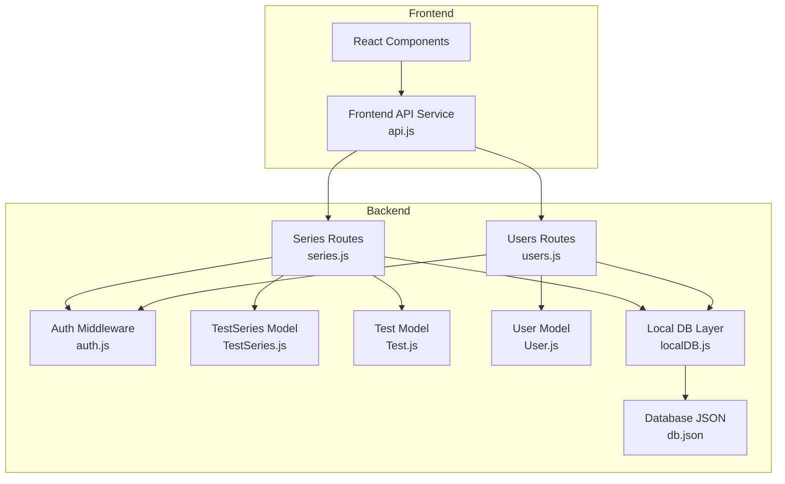
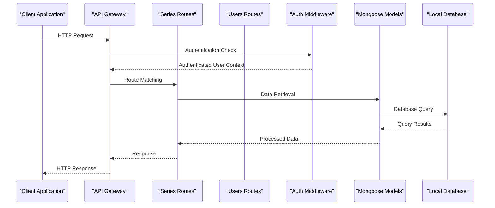
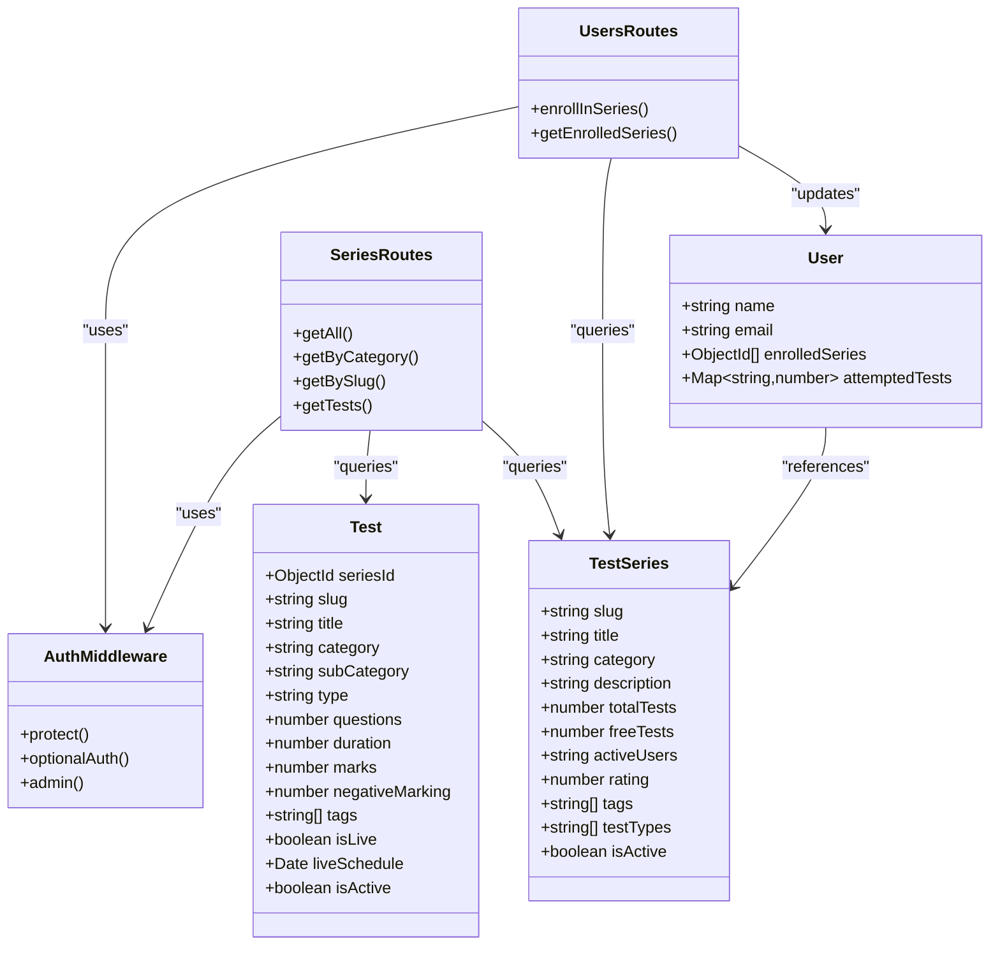

# Test Series API

<cite>
**Referenced Files in This Document**
- [series.js](file://Backend/src/routes/series.js)
- [users.js](file://Backend/src/routes/users.js)
- [TestSeries.js](file://Backend/src/models/TestSeries.js)
- [Test.js](file://Backend/src/models/Test.js)
- [User.js](file://Backend/src/models/User.js)
- [auth.js](file://Backend/src/middleware/auth.js)
- [localDB.js](file://Backend/src/db/localDB.js)
- [db.json](file://Backend/data/db.json)
- [api.js](file://Frontend/src/services/api.js)
</cite>

## Table of Contents
1. [Introduction](#introduction)
2. [Project Structure](#project-structure)
3. [Core Components](#core-components)
4. [Architecture Overview](#architecture-overview)
5. [Detailed Component Analysis](#detailed-component-analysis)
6. [Dependency Analysis](#dependency-analysis)
7. [Performance Considerations](#performance-considerations)
8. [Troubleshooting Guide](#troubleshooting-guide)
9. [Conclusion](#conclusion)

## Introduction
This document provides comprehensive API documentation for the Test Series management system. It covers endpoints for retrieving all test series, filtering by category, fetching individual series details, and enrollment management. The documentation includes request parameters, query string filters, request/response schemas, pagination support, authentication requirements, role-based access control, error handling, and practical examples.

## Project Structure
The Test Series API is implemented in the backend server with Express.js routing, Mongoose models, and a local JSON database layer. The frontend client communicates with these APIs through a dedicated service module.



**Diagram sources**
- [series.js](file://Backend/src/routes/series.js#L1-L162)
- [users.js](file://Backend/src/routes/users.js#L1-L150)
- [auth.js](file://Backend/src/middleware/auth.js#L1-L92)
- [TestSeries.js](file://Backend/src/models/TestSeries.js#L1-L71)
- [Test.js](file://Backend/src/models/Test.js#L1-L77)
- [User.js](file://Backend/src/models/User.js#L1-L81)
- [localDB.js](file://Backend/src/db/localDB.js#L1-L222)
- [db.json](file://Backend/data/db.json#L1-L728)

**Section sources**
- [series.js](file://Backend/src/routes/series.js#L1-L162)
- [users.js](file://Backend/src/routes/users.js#L1-L150)
- [auth.js](file://Backend/src/middleware/auth.js#L1-L92)

## Core Components
The Test Series API consists of four primary endpoints:

### TestSeries Data Model
The TestSeries model defines the structure for test series records with the following key fields:
- **slug**: Unique URL-friendly identifier
- **title**: Display name of the test series
- **category**: Exam category (SSC, Railway, Banking, Defence, State, Other)
- **description**: Detailed description text
- **image**: Thumbnail/image URL
- **icon**: Emoji icon representation
- **totalTests**: Total number of tests in the series
- **freeTests**: Number of free tests available
- **activeUsers**: String representation of active user count
- **rating**: Average rating (0-5 scale)
- **tags**: Array of descriptive tags
- **testTypes**: Available test types
- **isActive**: Activation/deactivation flag

### Test Data Model
The Test model defines individual test items within series:
- **seriesId**: Reference to parent TestSeries
- **slug**: Unique test identifier
- **title**: Test name
- **category**: Test category (Mock Tests, PYPs, Live Tests, Practice)
- **subCategory**: Specific category subdivision
- **type**: Access type (Free/Pro)
- **questions**: Number of questions
- **duration**: Test duration in minutes
- **marks**: Maximum marks
- **negativeMarking**: Negative marking value
- **tags**: Test-specific tags
- **isLive**: Live test indicator
- **liveSchedule**: Live test scheduling
- **isActive**: Test activation status

### User Enrollment Model
The User model includes enrollment tracking:
- **enrolledSeries**: Array of TestSeries ObjectIds
- **attemptedTests**: Map of seriesId to attempt counts

**Section sources**
- [TestSeries.js](file://Backend/src/models/TestSeries.js#L3-L63)
- [Test.js](file://Backend/src/models/Test.js#L3-L68)
- [User.js](file://Backend/src/models/User.js#L44-L52)

## Architecture Overview
The API follows a layered architecture with clear separation of concerns:



**Diagram sources**
- [series.js](file://Backend/src/routes/series.js#L11-L53)
- [users.js](file://Backend/src/routes/users.js#L56-L95)
- [auth.js](file://Backend/src/middleware/auth.js#L5-L44)
- [localDB.js](file://Backend/src/db/localDB.js#L83-L117)

## Detailed Component Analysis

### Endpoint: GET /api/series
Retrieves all active test series with filtering and sorting capabilities.

**Request Parameters:**
- Query Parameters:
  - `category`: Filter by category (all categories if omitted)
  - `search`: Text search across titles
  - `sort`: Sorting option (popular, rating, tests, newest)

**Response Schema:**
```javascript
{
  success: boolean,
  count: number,
  data: TestSeries[]
}
```

**Sorting Options:**
- `popular`: Sort by activeUsers (default)
- `rating`: Sort by rating descending
- `tests`: Sort by totalTests descending
- `newest`: Sort by createdAt descending

**Pagination Support:**
- No built-in pagination implemented
- Returns all matching records

**Example Requests:**
- `/api/series?category=SSC&sort=rating`
- `/api/series?search=mock&sort=newest`

**Section sources**
- [series.js](file://Backend/src/routes/series.js#L8-L53)

### Endpoint: GET /api/series/category/:category
Fetches test series filtered by category.

**Request Parameters:**
- Path Parameter: `category` (SSC, Railway, Banking, Defence, State, Other)
- Query Parameters: None

**Response Schema:**
```javascript
{
  success: boolean,
  count: number,
  data: TestSeries[]
}
```

**Sorting:** Results sorted by activeUsers (descending)

**Example Request:**
- `/api/series/category/SSC`

**Section sources**
- [series.js](file://Backend/src/routes/series.js#L138-L159)

### Endpoint: GET /api/series/:slug
Retrieves individual test series details by slug.

**Request Parameters:**
- Path Parameter: `slug` (URL-friendly series identifier)
- Query Parameters: None

**Response Schema:**
```javascript
{
  success: boolean,
  data: {
    ...TestSeries,
    isEnrolled: boolean
  }
}
```

**Authentication:** Optional authentication (public endpoint)

**Behavior:**
- Returns 404 if series not found or inactive
- Adds `isEnrolled` field based on user's enrollment status
- Works for both authenticated and unauthenticated requests

**Example Request:**
- `/api/series/ssc-cgl-2025`

**Section sources**
- [series.js](file://Backend/src/routes/series.js#L55-L93)

### Endpoint: GET /api/series/:slug/tests
Retrieves tests within a specific series.

**Request Parameters:**
- Path Parameter: `slug` (series identifier)
- Query Parameters:
  - `category`: Filter by test category
  - `subCategory`: Filter by sub-category
  - `type`: Filter by access type (Free/Pro)

**Response Schema:**
```javascript
{
  success: boolean,
  count: number,
  data: Test[]
}
```

**Sorting:** Results sorted by createdAt (descending)

**Example Request:**
- `/api/series/ssc-cgl-2025/tests?category=Mock Tests&type=Free`

**Section sources**
- [series.js](file://Backend/src/routes/series.js#L95-L136)

### Endpoint: POST /api/users/enroll/:seriesId
Enrolls a user in a test series.

**Request Parameters:**
- Path Parameter: `seriesId` (TestSeries ObjectId)
- Query Parameters: None

**Authentication:** Required (Private endpoint)

**Response Schema:**
```javascript
{
  success: boolean,
  message: string,
  data: ObjectId[] // Updated enrolledSeries array
}
```

**Error Handling:**
- 404: Test series not found
- 400: Already enrolled in this series
- 401: Unauthorized (missing/invalid token)
- 500: Internal server error

**Example Request:**
- `POST /api/users/enroll/1769959453536ppink2kh0`

**Section sources**
- [users.js](file://Backend/src/routes/users.js#L53-L95)

### Endpoint: GET /api/users/enrolled-series
Retrieves a user's enrolled series.

**Request Parameters:**
- Path Parameter: None
- Query Parameters: None

**Authentication:** Required (Private endpoint)

**Response Schema:**
```javascript
{
  success: boolean,
  data: TestSeries[] // Populated series details
}
```

**Section sources**
- [users.js](file://Backend/src/routes/users.js#L97-L115)

## Dependency Analysis



**Diagram sources**
- [TestSeries.js](file://Backend/src/models/TestSeries.js#L3-L63)
- [Test.js](file://Backend/src/models/Test.js#L3-L68)
- [User.js](file://Backend/src/models/User.js#L4-L55)
- [series.js](file://Backend/src/routes/series.js#L1-L162)
- [users.js](file://Backend/src/routes/users.js#L1-L150)
- [auth.js](file://Backend/src/middleware/auth.js#L1-L92)

**Section sources**
- [TestSeries.js](file://Backend/src/models/TestSeries.js#L1-L71)
- [Test.js](file://Backend/src/models/Test.js#L1-L77)
- [User.js](file://Backend/src/models/User.js#L1-L81)

## Performance Considerations
The current implementation uses a local JSON database layer with in-memory filtering. Key performance characteristics:

### Database Indexes
- TestSeries: category, isActive (declared in schema)
- Test: seriesId, category, type (declared in schema)

### Query Patterns
- Filtering by category: O(n) linear scan through collection
- Text search: Regex-based matching across titles
- Population queries: Additional database round-trips for populated fields

### Optimization Recommendations
1. **Add Database Indexes**: Implement proper MongoDB/Mongoose indexes for frequent query patterns
2. **Pagination Implementation**: Add limit/skip parameters for large datasets
3. **Caching Layer**: Implement Redis caching for frequently accessed series data
4. **Query Optimization**: Replace regex searches with text indexes for better performance
5. **Population Strategies**: Use lean queries and selective field projection

## Troubleshooting Guide

### Authentication Issues
**Problem**: 401 Unauthorized responses
**Causes**:
- Missing Authorization header
- Invalid/expired JWT token
- Token verification failure

**Solutions**:
- Ensure Bearer token format: `Authorization: Bearer <token>`
- Verify token expiration and validity
- Check JWT_SECRET environment variable

### Authorization Issues
**Problem**: 403 Forbidden responses
**Causes**:
- Non-admin user attempting admin-only operation
- Missing admin role in user record

**Solutions**:
- Verify user role is set to 'admin'
- Check admin middleware implementation

### Data Access Issues
**Problem**: 404 Not Found responses
**Causes**:
- Invalid series slug/id
- Series marked as inactive
- Non-existent test series

**Solutions**:
- Verify slug/id format matches database records
- Check isActive flag in TestSeries
- Validate series existence in database

### Enrollment Conflicts
**Problem**: 400 Bad Request during enrollment
**Causes**:
- User already enrolled in the series
- Invalid seriesId format

**Solutions**:
- Check existing enrollment before attempting enrollment
- Validate ObjectId format for seriesId

### Error Response Format
All endpoints follow a consistent error response format:
```javascript
{
  success: false,
  message: string
}
```

**Section sources**
- [auth.js](file://Backend/src/middleware/auth.js#L14-L43)
- [users.js](file://Backend/src/routes/users.js#L62-L75)
- [series.js](file://Backend/src/routes/series.js#L65-L70)

## Conclusion
The Test Series API provides a comprehensive set of endpoints for managing and accessing test series data. The implementation demonstrates clear separation of concerns with proper authentication, flexible filtering capabilities, and consistent response formats. While the current local database implementation serves development needs, production deployment would benefit from MongoDB integration with proper indexing, pagination, and caching strategies.

Key strengths of the current implementation include:
- Clear endpoint organization and consistent response patterns
- Flexible filtering and sorting options
- Proper authentication and authorization handling
- Comprehensive data models covering series, tests, and user enrollment
- Well-structured middleware for authentication

Areas for improvement in production environments:
- Database migration to MongoDB with proper indexing
- Implementation of pagination for large datasets
- Addition of caching mechanisms
- Enhanced error handling and validation
- Rate limiting and security improvements

*Last Updated: March 10, 2026 | Update date is (20:16)*
