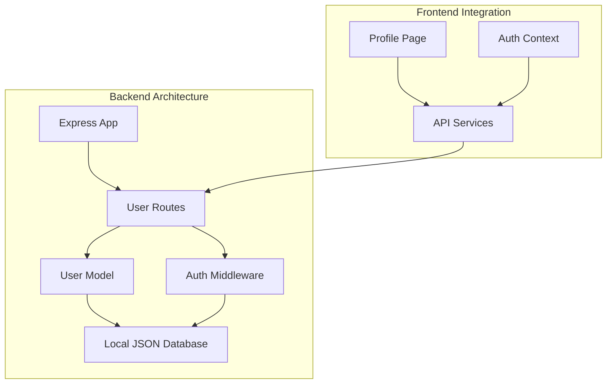
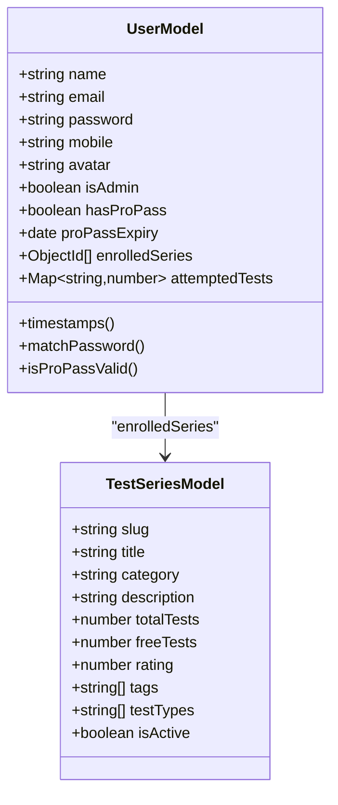
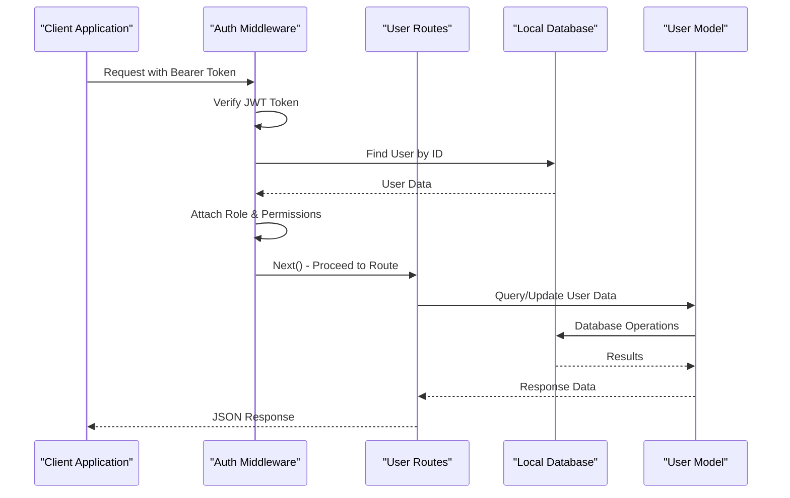
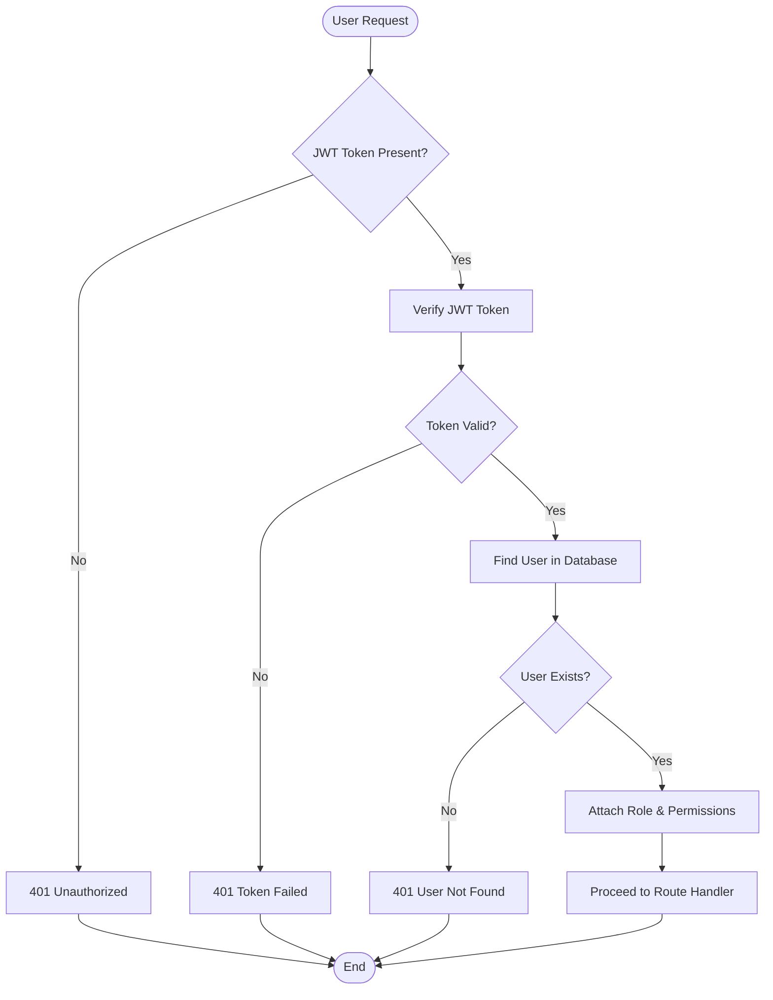
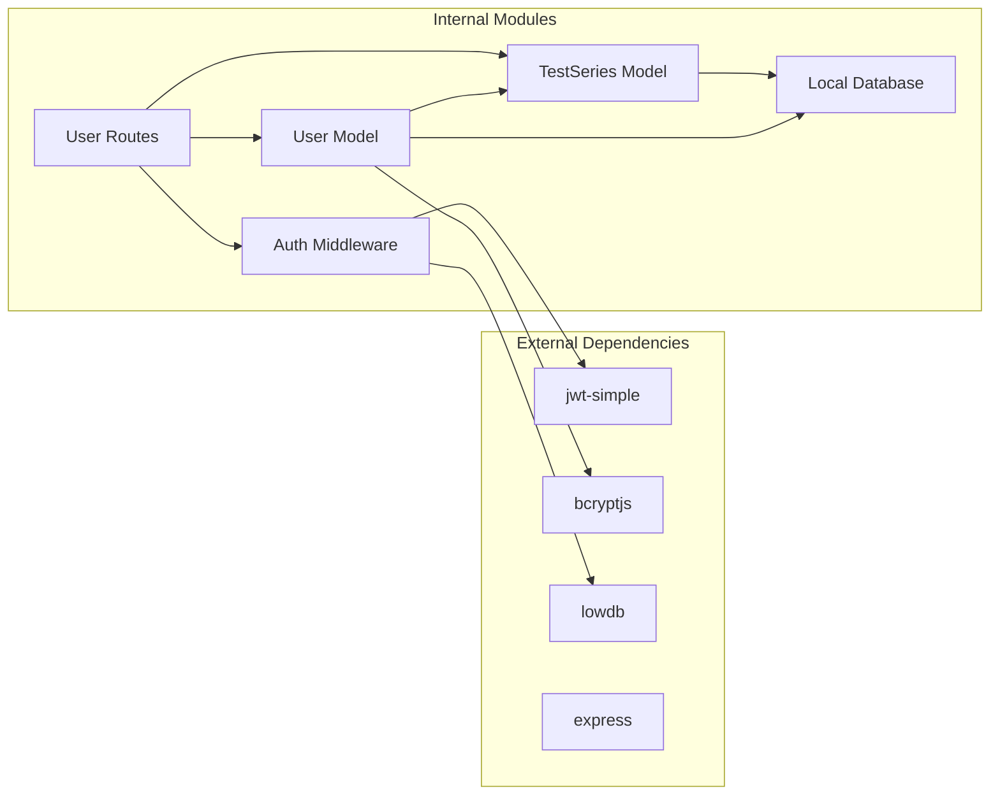
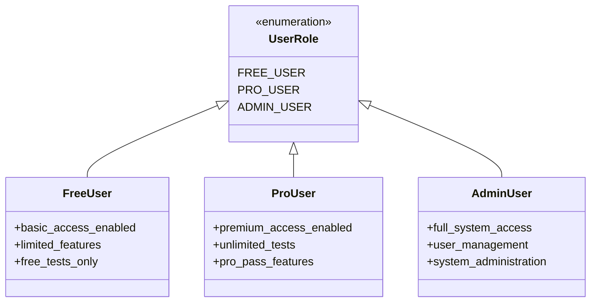

# User Management API

<cite>
**Referenced Files in This Document**
- [User.js](file://Backend/src/models/User.js)
- [users.js](file://Backend/src/routes/users.js)
- [auth.js](file://Backend/src/middleware/auth.js)
- [db.json](file://Backend/data/db.json)
- [localDB.js](file://Backend/src/db/localDB.js)
- [TestSeries.js](file://Backend/src/models/TestSeries.js)
- [app.js](file://Backend/src/app.js)
- [auth.js](file://Backend/src/routes/auth.js)
- [api.js](file://Frontend/src/services/api.js)
- [Profile.jsx](file://Frontend/src/pages/Profile.jsx)
</cite>

## Table of Contents
1. [Introduction](#introduction)
2. [Project Structure](#project-structure)
3. [Core Components](#core-components)
4. [Architecture Overview](#architecture-overview)
5. [Detailed Component Analysis](#detailed-component-analysis)
6. [Dependency Analysis](#dependency-analysis)
7. [Performance Considerations](#performance-considerations)
8. [Troubleshooting Guide](#troubleshooting-guide)
9. [Conclusion](#conclusion)

## Introduction
This document provides comprehensive API documentation for the User Management system in the Trstprep application. It covers user profile operations, enrollment management, progress tracking, and subscription management endpoints. The documentation includes the User model schema, authentication requirements, data validation rules, role-based access control, and practical examples for common operations.

## Project Structure
The User Management API is built using Express.js with a local JSON database (LowDB) and JWT-based authentication. The system follows a modular architecture with separate models, routes, middleware, and database helpers.

**Diagram sources**
- [app.js](file://Backend/src/app.js#L56-L62)
- [users.js](file://Backend/src/routes/users.js#L1-L150)
- [auth.js](file://Backend/src/middleware/auth.js#L1-L92)

**Section sources**
- [app.js](file://Backend/src/app.js#L1-L94)
- [localDB.js](file://Backend/src/db/localDB.js#L1-L222)

## Core Components

### User Model Schema
The User model defines the structure for user accounts with comprehensive fields for personal information, role-based permissions, and subscription management.

**Diagram sources**
- [User.js](file://Backend/src/models/User.js#L4-L55)
- [TestSeries.js](file://Backend/src/models/TestSeries.js#L3-L63)

### Authentication and Authorization
The system uses JWT tokens for authentication with role-based access control:

- **Private Access**: All user endpoints require authentication
- **Admin Access**: Special administrative endpoints require admin role
- **Pro Pass Access**: Premium features require valid Pro Pass status

**Section sources**
- [auth.js](file://Backend/src/middleware/auth.js#L4-L44)
- [auth.js](file://Backend/src/middleware/auth.js#L68-L92)

## Architecture Overview

**Diagram sources**
- [auth.js](file://Backend/src/middleware/auth.js#L5-L44)
- [users.js](file://Backend/src/routes/users.js#L11-L26)

## Detailed Component Analysis

### User Profile Operations

#### GET /api/users/profile
Retrieves the authenticated user's profile information along with their enrolled test series.

**Endpoint**: `GET /api/users/profile`
**Authentication**: Required (Bearer Token)
**Response**: User profile with populated enrolled series

**Section sources**
- [users.js](file://Backend/src/routes/users.js#L8-L26)

#### PUT /api/users/profile
Updates user profile information including name, mobile, and avatar.

**Endpoint**: `PUT /api/users/profile`
**Authentication**: Required (Bearer Token)
**Request Body**: `{ name, mobile, avatar }`
**Validation**: 
- Name: Required, max 50 characters
- Mobile: Optional, trimmed
- Avatar: Optional, default empty string

**Section sources**
- [users.js](file://Backend/src/routes/users.js#L28-L51)
- [User.js](file://Backend/src/models/User.js#L5-L32)

### Enrollment Management

#### POST /api/users/enroll/:seriesId
Enrolls a user in a specific test series.

**Endpoint**: `POST /api/users/enroll/:seriesId`
**Authentication**: Required (Bearer Token)
**Parameters**: `seriesId` (URL parameter)
**Business Logic**:
1. Validates test series existence
2. Checks for duplicate enrollment
3. Adds series to user's enrolledSeries array
4. Populates enrolled series with full details

**Section sources**
- [users.js](file://Backend/src/routes/users.js#L53-L95)

#### GET /api/users/enrolled-series
Retrieves all test series that a user is currently enrolled in.

**Endpoint**: `GET /api/users/enrolled-series`
**Authentication**: Required (Bearer Token)
**Response**: Array of enrolled test series with full details

**Section sources**
- [users.js](file://Backend/src/routes/users.js#L97-L115)

### Progress Tracking

#### GET /api/users/analytics
Provides user performance analytics and statistics.

**Endpoint**: `GET /api/users/analytics`
**Authentication**: Required (Bearer Token)
**Response Fields**:
- `testsAttempted`: Total number of tests attempted
- `avgAccuracy`: Average accuracy percentage
- `avgScore`: Average score across attempts
- `rank`: All India ranking position
- `subjectWise`: Subject-wise performance breakdown
- `recentTests`: Recent test history

**Section sources**
- [users.js](file://Backend/src/routes/users.js#L117-L147)

### Subscription Management

#### Subscription Status Fields
The User model includes comprehensive subscription management fields:

| Field | Type | Description | Default |
|-------|------|-------------|---------|
| `hasProPass` | Boolean | Pro Pass subscription status | false |
| `proPassExpiry` | Date | Pro Pass expiration date | null |
| `isAdmin` | Boolean | Administrative privileges | false |

**Section sources**
- [User.js](file://Backend/src/models/User.js#L33-L43)

### Authentication Flow

**Diagram sources**
- [auth.js](file://Backend/src/middleware/auth.js#L5-L44)

**Section sources**
- [auth.js](file://Backend/src/middleware/auth.js#L1-L92)

## Dependency Analysis

**Diagram sources**
- [auth.js](file://Backend/src/middleware/auth.js#L1-L3)
- [User.js](file://Backend/src/models/User.js#L1-L2)
- [users.js](file://Backend/src/routes/users.js#L1-L4)

### Role-Based Access Control

The system implements three distinct user roles with different permission levels:

**Diagram sources**
- [db.json](file://Backend/data/db.json#L2-L35)
- [auth.js](file://Backend/src/middleware/auth.js#L68-L92)

**Section sources**
- [db.json](file://Backend/data/db.json#L2-L35)
- [auth.js](file://Backend/src/middleware/auth.js#L68-L92)

## Performance Considerations

### Database Design
- **Local JSON Storage**: Uses LowDB for development with automatic initialization
- **Population Queries**: User profiles automatically populate enrolled series
- **Indexing Strategy**: TestSeries model includes category and isActive indexes

### Caching and Optimization
- **Password Hashing**: Bcrypt cost factor of 10 for secure but reasonable hashing
- **Selective Field Loading**: Password field excluded from user responses by default
- **Efficient Queries**: Population of enrolled series occurs only when needed

## Troubleshooting Guide

### Common Authentication Issues

**Issue**: "Not authorized, no token provided"
**Solution**: Include Authorization header with Bearer token format

**Issue**: "Not authorized, token failed"
**Solution**: Verify JWT_SECRET environment variable and token validity

**Issue**: "Not authorized, user not found"
**Solution**: Check database connectivity and user record integrity

### Enrollment Problems

**Issue**: "Already enrolled in this series"
**Solution**: Check user's current enrollment status before attempting re-enrollment

**Issue**: "Test series not found"
**Solution**: Verify seriesId parameter and test series availability

### Data Validation Errors

**Issue**: "Name cannot exceed 50 characters"
**Solution**: Ensure name field length <= 50 characters

**Issue**: "Password must be at least 8 characters"
**Solution**: Verify password meets minimum length requirement

**Section sources**
- [auth.js](file://Backend/src/middleware/auth.js#L14-L43)
- [users.js](file://Backend/src/routes/users.js#L60-L75)
- [User.js](file://Backend/src/models/User.js#L7-L23)

## Conclusion

The User Management API provides a comprehensive foundation for user account management, test series enrollment, progress tracking, and subscription handling. The system's modular architecture, combined with robust authentication and validation, creates a scalable foundation for educational platform features. The clear separation between free, pro, and admin user roles enables flexible monetization strategies while maintaining system security and performance.

Key strengths of the implementation include:
- Clean separation of concerns with dedicated models and routes
- Comprehensive validation at both model and route levels
- Flexible role-based access control
- Efficient database operations with proper indexing
- Extensible architecture ready for production deployment

Future enhancements could include:
- Migration to MongoDB for production scalability
- Enhanced analytics and progress tracking
- Real-time enrollment notifications
- Advanced subscription management features

*Last Updated: March 10, 2026 | Update date is (20:16)*
