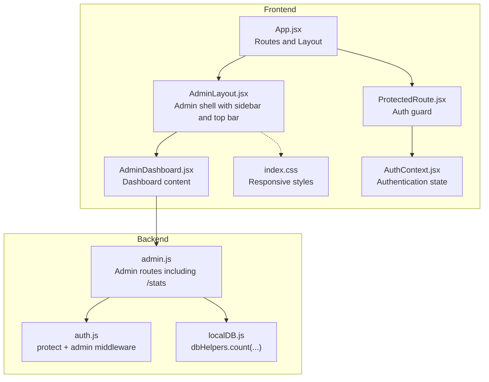
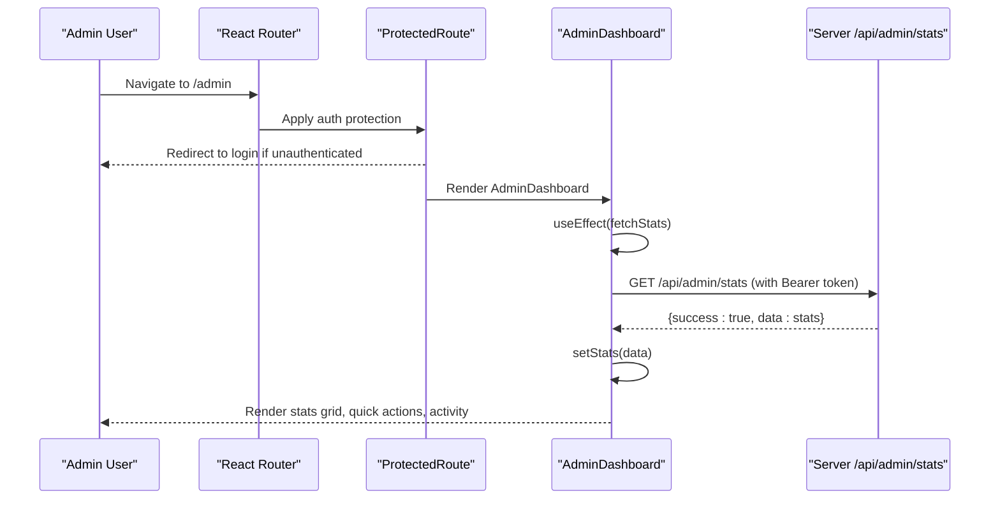
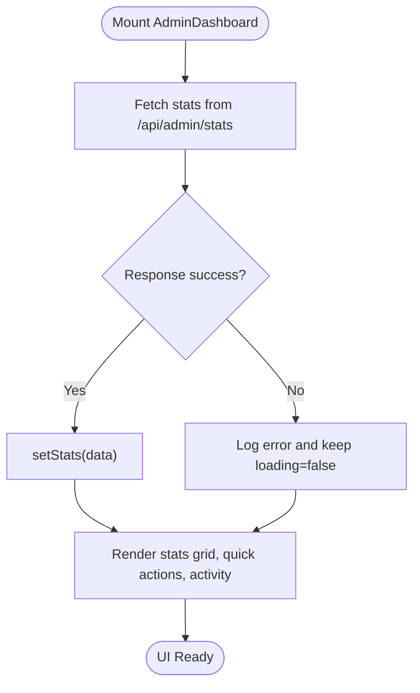
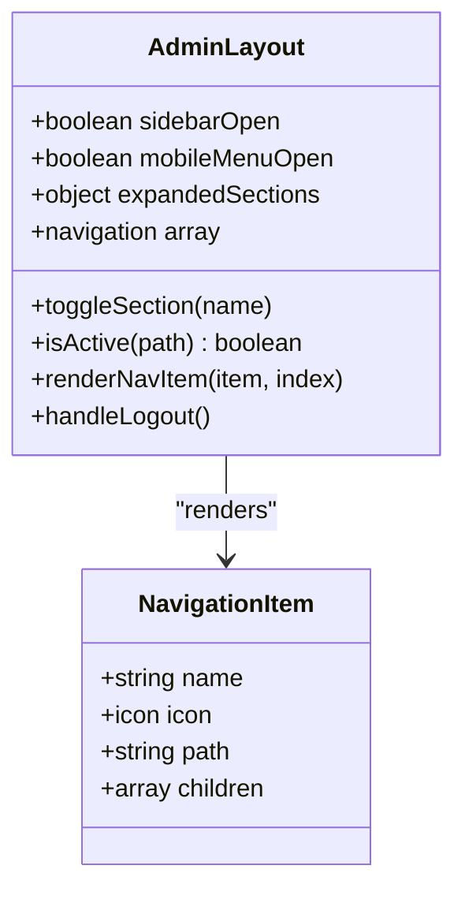
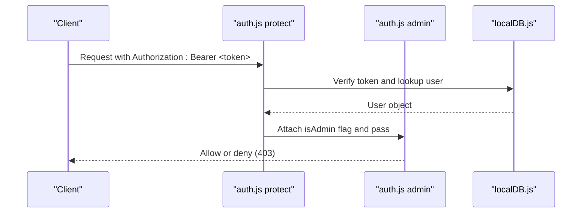
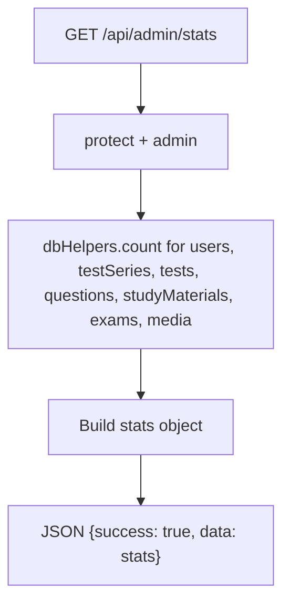
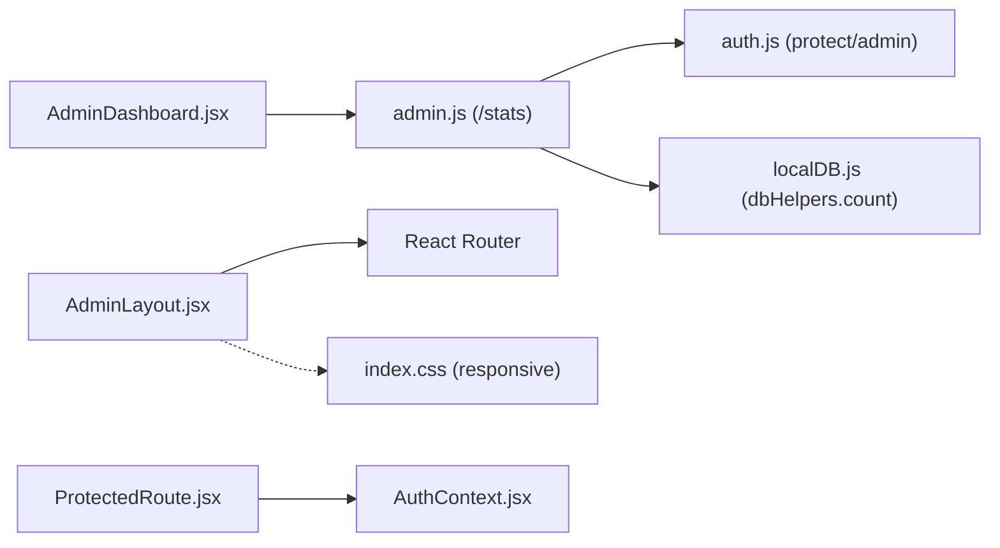

# Admin Dashboard Overview

<cite>
**Referenced Files in This Document**
- [AdminDashboard.jsx](file://Frontend/src/pages/admin/AdminDashboard.jsx)
- [AdminLayout.jsx](file://Frontend/src/components/admin/AdminLayout.jsx)
- [App.jsx](file://Frontend/src/App.jsx)
- [ProtectedRoute.jsx](file://Frontend/src/components/auth/ProtectedRoute.jsx)
- [AuthContext.jsx](file://Frontend/src/context/AuthContext.jsx)
- [admin.js](file://Backend/src/routes/admin.js)
- [auth.js](file://Backend/src/middleware/auth.js)
- [localDB.js](file://Backend/src/db/localDB.js)
- [index.css](file://Frontend/src/styles/index.css)
</cite>

## Table of Contents
1. [Introduction](#introduction)
2. [Project Structure](#project-structure)
3. [Core Components](#core-components)
4. [Architecture Overview](#architecture-overview)
5. [Detailed Component Analysis](#detailed-component-analysis)
6. [Dependency Analysis](#dependency-analysis)
7. [Performance Considerations](#performance-considerations)
8. [Troubleshooting Guide](#troubleshooting-guide)
9. [Conclusion](#conclusion)

## Introduction
This document describes the Trstprep V2 admin dashboard interface, focusing on the dashboard layout, statistics cards, quick actions panel, recent activity feed, navigation patterns, and the admin workflow. It explains how the frontend integrates with backend statistics APIs, how responsive design is implemented, and the user experience considerations for the admin interface.

## Project Structure
The admin dashboard is part of a React-based frontend application with a dedicated admin layout and routing. The backend exposes an admin statistics endpoint protected by authentication and authorization middleware. Styling leverages Tailwind CSS with responsive breakpoints.

**Diagram sources**
- [App.jsx](file://Frontend/src/App.jsx#L119-L134)
- [AdminLayout.jsx](file://Frontend/src/components/admin/AdminLayout.jsx#L127-L305)
- [AdminDashboard.jsx](file://Frontend/src/pages/admin/AdminDashboard.jsx#L8-L33)
- [admin.js](file://Backend/src/routes/admin.js#L12-L29)
- [auth.js](file://Backend/src/middleware/auth.js#L4-L78)
- [localDB.js](file://Backend/src/db/localDB.js#L214-L217)
- [index.css](file://Frontend/src/styles/index.css#L1-L10)

**Section sources**
- [App.jsx](file://Frontend/src/App.jsx#L119-L134)
- [AdminLayout.jsx](file://Frontend/src/components/admin/AdminLayout.jsx#L127-L305)
- [AdminDashboard.jsx](file://Frontend/src/pages/admin/AdminDashboard.jsx#L8-L33)
- [admin.js](file://Backend/src/routes/admin.js#L12-L29)
- [auth.js](file://Backend/src/middleware/auth.js#L4-L78)
- [localDB.js](file://Backend/src/db/localDB.js#L214-L217)
- [index.css](file://Frontend/src/styles/index.css#L1-L10)

## Core Components
- AdminDashboard: Fetches and displays platform statistics, quick actions, and recent activity.
- AdminLayout: Provides the admin shell with collapsible sidebar, top bar, and mobile bottom navigation.
- ProtectedRoute and AuthContext: Enforce authentication and manage session state.
- Backend admin routes: Serve statistics via a protected endpoint using middleware.

Key responsibilities:
- Dashboard: Renders six statistic cards (users, test series, tests, questions, study materials, media), a quick actions grid, and a recent activity feed.
- Layout: Manages navigation hierarchy, active states, and responsive behavior across desktop and mobile.
- Backend: Aggregates counts from the local database and returns them as a single stats payload.

**Section sources**
- [AdminDashboard.jsx](file://Frontend/src/pages/admin/AdminDashboard.jsx#L35-L181)
- [AdminLayout.jsx](file://Frontend/src/components/admin/AdminLayout.jsx#L31-L67)
- [ProtectedRoute.jsx](file://Frontend/src/components/auth/ProtectedRoute.jsx#L4-L26)
- [AuthContext.jsx](file://Frontend/src/context/AuthContext.jsx#L13-L98)
- [admin.js](file://Backend/src/routes/admin.js#L12-L29)
- [localDB.js](file://Backend/src/db/localDB.js#L214-L217)

## Architecture Overview
The admin dashboard follows a client-server pattern:
- Frontend: React SPA with React Router and Tailwind CSS.
- Backend: Express server with JWT-based authentication and admin-only authorization.
- Data: Local JSON database abstraction with helpers for counting documents.

**Diagram sources**
- [AdminDashboard.jsx](file://Frontend/src/pages/admin/AdminDashboard.jsx#L12-L33)
- [admin.js](file://Backend/src/routes/admin.js#L12-L29)
- [auth.js](file://Backend/src/middleware/auth.js#L4-L44)

## Detailed Component Analysis

### AdminDashboard Component
Responsibilities:
- Fetches statistics from the backend on mount.
- Renders six statistic cards with icons, colors, and links to respective managers.
- Displays quick actions for common admin tasks.
- Shows a recent activity feed with sample entries.

Implementation highlights:
- Uses Lucide icons for visual cues.
- Grid layout adapts to screen size (1 column on small screens, up to 3 on large).
- Quick actions arranged in a responsive 2x3 grid on tablets and larger.
- Recent activity shows two sample items with timestamps.

**Diagram sources**
- [AdminDashboard.jsx](file://Frontend/src/pages/admin/AdminDashboard.jsx#L12-L33)
- [admin.js](file://Backend/src/routes/admin.js#L12-L29)

**Section sources**
- [AdminDashboard.jsx](file://Frontend/src/pages/admin/AdminDashboard.jsx#L8-L181)
- [admin.js](file://Backend/src/routes/admin.js#L12-L29)
- [localDB.js](file://Backend/src/db/localDB.js#L214-L217)

### AdminLayout Component
Responsibilities:
- Provides the admin shell with:
  - Collapsible sidebar (desktop) and slide-in mobile sidebar.
  - Top bar with site navigation and user profile area.
  - Bottom navigation bar optimized for mobile.
- Manages active navigation highlighting and nested sections.

Responsive behavior:
- Desktop: Fixed sidebar with expand/collapse toggle.
- Mobile: Slide-in drawer with overlay; bottom navigation appears at the bottom.
- Active state computed per route with support for nested paths.

**Diagram sources**
- [AdminLayout.jsx](file://Frontend/src/components/admin/AdminLayout.jsx#L8-L67)

**Section sources**
- [AdminLayout.jsx](file://Frontend/src/components/admin/AdminLayout.jsx#L127-L305)

### Authentication and Authorization
- ProtectedRoute ensures only authenticated users can access admin routes.
- AuthContext manages login, session persistence, and user state.
- Backend middleware:
  - protect: verifies JWT and attaches user object.
  - admin: restricts routes to admin users.
  - Returns 401/403 on failure.

**Diagram sources**
- [auth.js](file://Backend/src/middleware/auth.js#L4-L78)
- [localDB.js](file://Backend/src/db/localDB.js#L25-L36)

**Section sources**
- [ProtectedRoute.jsx](file://Frontend/src/components/auth/ProtectedRoute.jsx#L4-L26)
- [AuthContext.jsx](file://Frontend/src/context/AuthContext.jsx#L43-L98)
- [auth.js](file://Backend/src/middleware/auth.js#L4-L78)

### Backend Statistics Endpoint
- Route: GET /api/admin/stats
- Middleware: protect + admin
- Logic: Counts documents across collections and returns a single stats object.

**Diagram sources**
- [admin.js](file://Backend/src/routes/admin.js#L12-L29)
- [localDB.js](file://Backend/src/db/localDB.js#L214-L217)

**Section sources**
- [admin.js](file://Backend/src/routes/admin.js#L12-L29)
- [localDB.js](file://Backend/src/db/localDB.js#L214-L217)

## Dependency Analysis
- AdminDashboard depends on:
  - Backend /api/admin/stats for data.
  - React Router for navigation.
  - Lucide icons for visual elements.
- AdminLayout depends on:
  - React Router for navigation and outlet rendering.
  - Tailwind classes for responsive design.
- ProtectedRoute and AuthContext coordinate authentication state and redirects.
- Backend admin routes depend on auth middleware and localDB helpers.

**Diagram sources**
- [AdminDashboard.jsx](file://Frontend/src/pages/admin/AdminDashboard.jsx#L12-L33)
- [AdminLayout.jsx](file://Frontend/src/components/admin/AdminLayout.jsx#L127-L305)
- [ProtectedRoute.jsx](file://Frontend/src/components/auth/ProtectedRoute.jsx#L4-L26)
- [AuthContext.jsx](file://Frontend/src/context/AuthContext.jsx#L13-L98)
- [admin.js](file://Backend/src/routes/admin.js#L12-L29)
- [auth.js](file://Backend/src/middleware/auth.js#L4-L78)
- [localDB.js](file://Backend/src/db/localDB.js#L214-L217)
- [index.css](file://Frontend/src/styles/index.css#L1-L10)

**Section sources**
- [AdminDashboard.jsx](file://Frontend/src/pages/admin/AdminDashboard.jsx#L8-L33)
- [AdminLayout.jsx](file://Frontend/src/components/admin/AdminLayout.jsx#L127-L305)
- [ProtectedRoute.jsx](file://Frontend/src/components/auth/ProtectedRoute.jsx#L4-L26)
- [AuthContext.jsx](file://Frontend/src/context/AuthContext.jsx#L13-L98)
- [admin.js](file://Backend/src/routes/admin.js#L12-L29)
- [auth.js](file://Backend/src/middleware/auth.js#L4-L78)
- [localDB.js](file://Backend/src/db/localDB.js#L214-L217)
- [index.css](file://Frontend/src/styles/index.css#L1-L10)

## Performance Considerations
- Initial load: The dashboard fetches statistics once on mount. Consider caching the stats in state or context to avoid repeated requests during navigation within the admin area.
- Network reliability: The frontend does not currently implement retry logic or offline fallback for the stats endpoint. Adding exponential backoff and a skeleton loader could improve resilience.
- Rendering: The quick actions grid uses six items; keep the number reasonable to prevent layout thrashing on small screens.
- Backend: The stats endpoint performs multiple count operations. For large datasets, consider indexing or pre-aggregation strategies.

## Troubleshooting Guide
Common issues and resolutions:
- Unauthorized access to admin routes:
  - Ensure a valid Bearer token is present in Authorization header.
  - Confirm the user role is admin on the backend.
- Stats not loading:
  - Verify the backend endpoint responds with success and data.
  - Check browser network tab for 401/403 responses.
- Navigation not highlighting:
  - Confirm isActive logic matches the intended paths.
  - Ensure nested sections are toggled properly.
- Mobile sidebar not closing:
  - Check event listeners for route changes and window resize.
- Session expiration:
  - ProtectedRoute redirects to login when session is missing or expired.

**Section sources**
- [ProtectedRoute.jsx](file://Frontend/src/components/auth/ProtectedRoute.jsx#L4-L26)
- [AuthContext.jsx](file://Frontend/src/context/AuthContext.jsx#L19-L40)
- [auth.js](file://Backend/src/middleware/auth.js#L4-L44)
- [AdminLayout.jsx](file://Frontend/src/components/admin/AdminLayout.jsx#L15-L29)

## Conclusion
The Trstprep V2 admin dashboard provides a concise overview of platform metrics, quick access to administrative tasks, and a streamlined navigation experience across devices. Its architecture cleanly separates frontend presentation and routing from backend authentication and data aggregation. Enhancing caching, error handling, and responsive behavior will further improve the admin workflow and user experience.

*Last Updated: March 10, 2026 | Update date is (20:16)*
