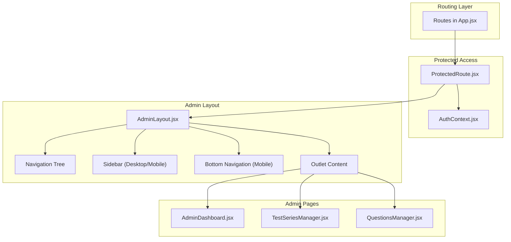
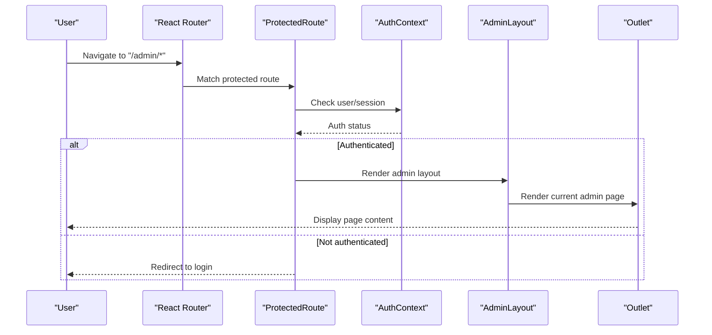
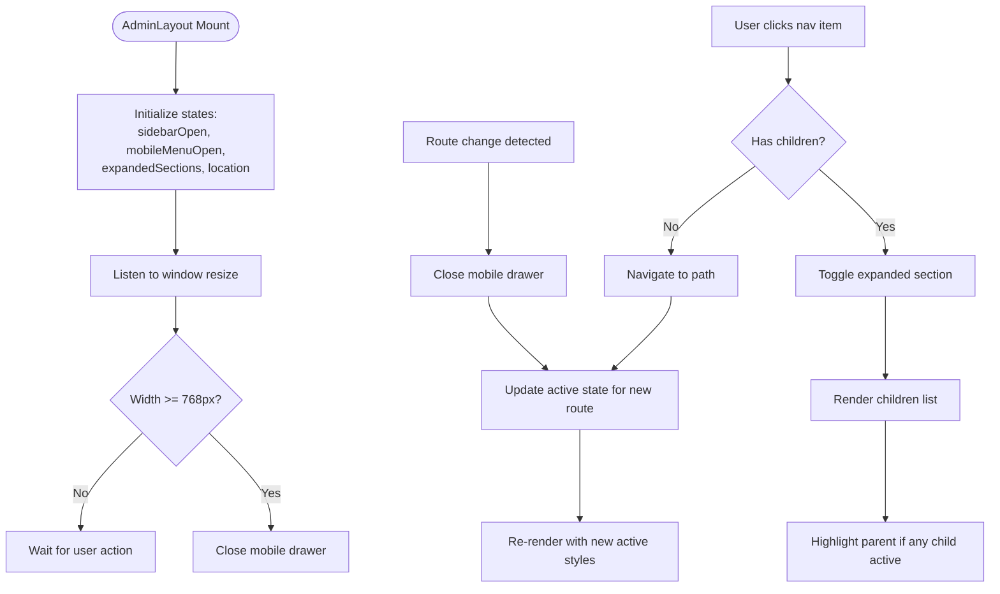
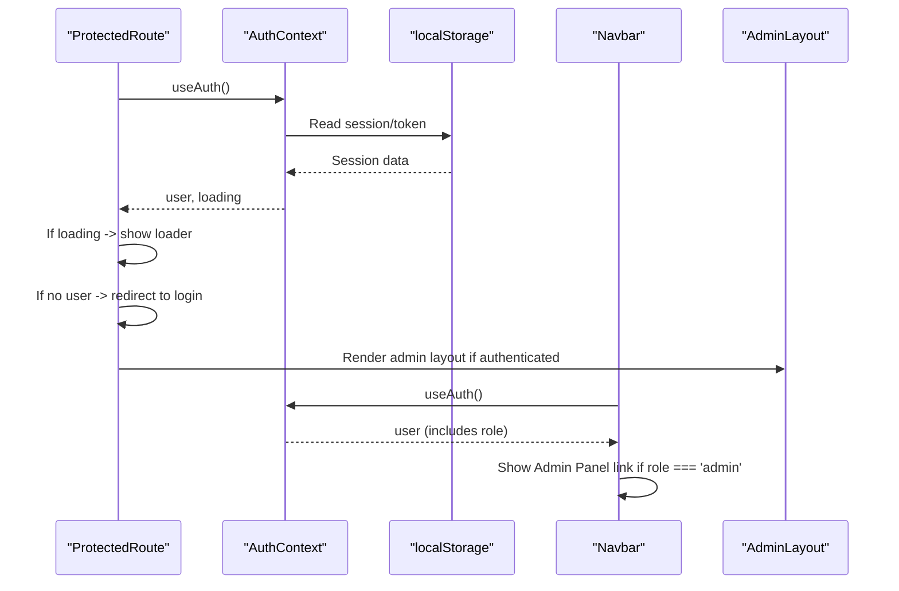
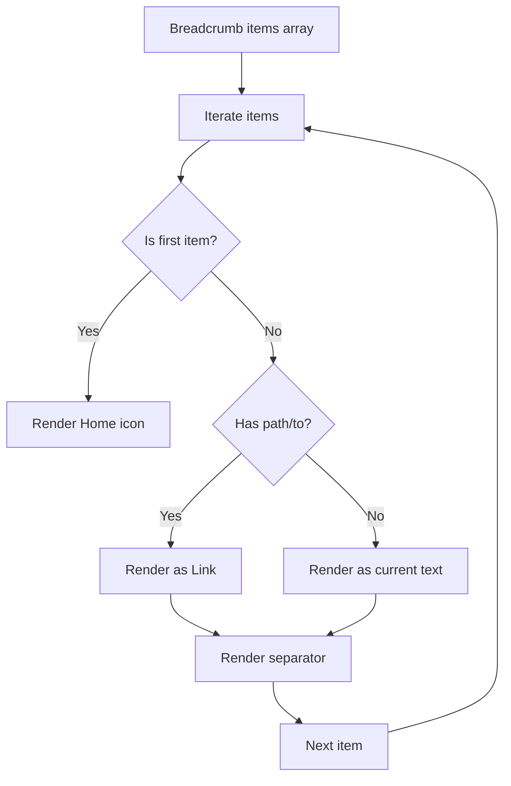
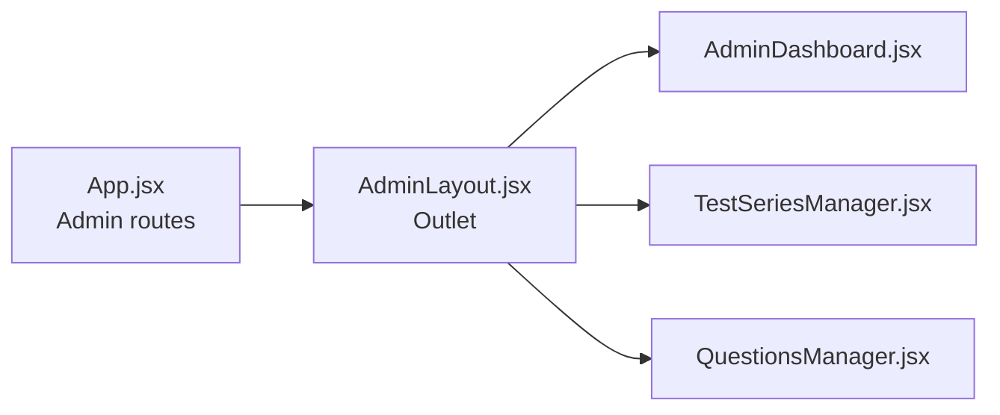
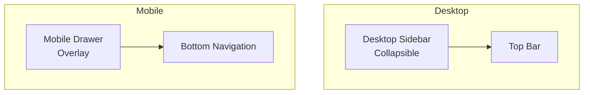
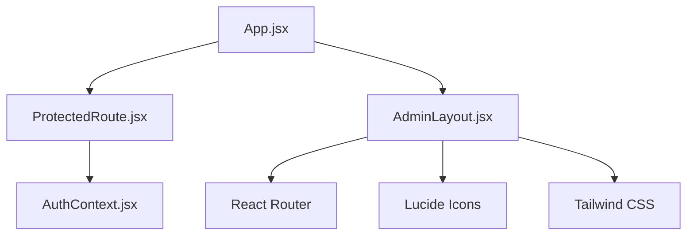

# Admin Navigation & Layout

<cite>
**Referenced Files in This Document**
- [AdminLayout.jsx](file://Frontend/src/components/admin/AdminLayout.jsx)
- [App.jsx](file://Frontend/src/App.jsx)
- [ProtectedRoute.jsx](file://Frontend/src/components/auth/ProtectedRoute.jsx)
- [AuthContext.jsx](file://Frontend/src/context/AuthContext.jsx)
- [Breadcrumb.jsx](file://Frontend/src/components/common/Breadcrumb.jsx)
- [AdminDashboard.jsx](file://Frontend/src/pages/admin/AdminDashboard.jsx)
- [TestSeriesManager.jsx](file://Frontend/src/pages/admin/TestSeriesManager.jsx)
- [QuestionsManager.jsx](file://Frontend/src/pages/admin/QuestionsManager.jsx)
- [index.css](file://Frontend/src/styles/index.css)
</cite>

## Table of Contents
1. [Introduction](#introduction)
2. [Project Structure](#project-structure)
3. [Core Components](#core-components)
4. [Architecture Overview](#architecture-overview)
5. [Detailed Component Analysis](#detailed-component-analysis)
6. [Dependency Analysis](#dependency-analysis)
7. [Performance Considerations](#performance-considerations)
8. [Troubleshooting Guide](#troubleshooting-guide)
9. [Conclusion](#conclusion)

## Introduction
This document explains Trstprep V2’s admin interface navigation and layout system. It covers the admin sidebar structure, menu organization, responsive design, mobile-friendly navigation, keyboard accessibility, integration with route-based page rendering, active navigation highlighting, breadcrumb system, navigation state management, and how the admin layout maintains consistent branding and user experience across administrative functions.

## Project Structure
The admin layout is implemented as a dedicated layout component integrated into the routing system. Pages under the admin domain are protected and rendered inside the admin layout, which provides a unified navigation experience.

**Diagram sources**
- [App.jsx](file://Frontend/src/App.jsx#L119-L134)
- [ProtectedRoute.jsx](file://Frontend/src/components/auth/ProtectedRoute.jsx#L4-L26)
- [AuthContext.jsx](file://Frontend/src/context/AuthContext.jsx#L13-L191)
- [AdminLayout.jsx](file://Frontend/src/components/admin/AdminLayout.jsx#L8-L305)

**Section sources**
- [App.jsx](file://Frontend/src/App.jsx#L119-L134)

## Core Components
- AdminLayout: Provides the admin sidebar, top bar, mobile drawer, bottom navigation, and renders the current admin page.
- ProtectedRoute: Guards admin routes and handles authentication checks.
- AuthContext: Manages user session, login/logout, and role-based access.
- Breadcrumb: Renders navigational breadcrumbs for admin pages.
- Admin pages: Dashboard and managers for content and users.

Key responsibilities:
- Navigation: Hierarchical sidebar with collapsible sections and nested links.
- Responsive behavior: Desktop sidebar with collapsible width, mobile drawer, and bottom navigation.
- State management: Tracks active section expansion, mobile menu state, and active link highlighting.
- Integration: Works with React Router to render admin pages inside the layout.

**Section sources**
- [AdminLayout.jsx](file://Frontend/src/components/admin/AdminLayout.jsx#L8-L305)
- [ProtectedRoute.jsx](file://Frontend/src/components/auth/ProtectedRoute.jsx#L4-L26)
- [AuthContext.jsx](file://Frontend/src/context/AuthContext.jsx#L13-L191)
- [Breadcrumb.jsx](file://Frontend/src/components/common/Breadcrumb.jsx#L4-L36)

## Architecture Overview
The admin architecture follows a protected layout pattern. Authentication is enforced globally, and the admin layout wraps all admin routes. The layout manages navigation state and renders the active page via React Router’s Outlet.

**Diagram sources**
- [App.jsx](file://Frontend/src/App.jsx#L119-L134)
- [ProtectedRoute.jsx](file://Frontend/src/components/auth/ProtectedRoute.jsx#L4-L26)
- [AuthContext.jsx](file://Frontend/src/context/AuthContext.jsx#L13-L191)
- [AdminLayout.jsx](file://Frontend/src/components/admin/AdminLayout.jsx#L238-L240)

## Detailed Component Analysis

### AdminLayout: Navigation, Responsive Behavior, and State Management
- Navigation tree: Defines top-level items and nested children for hierarchical menus. Uses Lucide icons and dynamic path matching for active states.
- Active highlighting: Highlights parent items when any child is active; applies distinct styles for active vs inactive states.
- Collapsible sidebar: Desktop sidebar supports collapsing to icon-only mode; mobile uses a slide-in drawer.
- Mobile-first UX: Overlay click closes the drawer; bottom navigation appears on mobile with dedicated admin entry.
- State management: Tracks sidebar open/collapsed state, mobile drawer open/close, expanded sections, and active route.
- Logout flow: Clears tokens and navigates to login.

**Diagram sources**
- [AdminLayout.jsx](file://Frontend/src/components/admin/AdminLayout.jsx#L9-L305)

**Section sources**
- [AdminLayout.jsx](file://Frontend/src/components/admin/AdminLayout.jsx#L31-L67)
- [AdminLayout.jsx](file://Frontend/src/components/admin/AdminLayout.jsx#L55-L67)
- [AdminLayout.jsx](file://Frontend/src/components/admin/AdminLayout.jsx#L127-L305)

### ProtectedRoute and AuthContext: Authentication and Role-Based Access
- ProtectedRoute enforces authentication for admin routes and shows a loading state while checking credentials.
- AuthContext manages user sessions, login/logout, and exposes role information used by the navbar to show admin panel access.

**Diagram sources**
- [ProtectedRoute.jsx](file://Frontend/src/components/auth/ProtectedRoute.jsx#L4-L26)
- [AuthContext.jsx](file://Frontend/src/context/AuthContext.jsx#L13-L191)
- [Navbar.jsx](file://Frontend/src/components/layout/Navbar.jsx#L119-L128)

**Section sources**
- [ProtectedRoute.jsx](file://Frontend/src/components/auth/ProtectedRoute.jsx#L4-L26)
- [AuthContext.jsx](file://Frontend/src/context/AuthContext.jsx#L13-L191)

### Breadcrumb: Navigation Path Representation
- Accepts an array of breadcrumb items with labels and paths.
- Renders home icon for the first item and chevrons between items.
- Makes non-current items clickable, enabling quick navigation.

**Diagram sources**
- [Breadcrumb.jsx](file://Frontend/src/components/common/Breadcrumb.jsx#L4-L36)

**Section sources**
- [Breadcrumb.jsx](file://Frontend/src/components/common/Breadcrumb.jsx#L4-L36)

### Route-Based Rendering and Page Integration
- Admin routes are nested under the admin layout and protected.
- The layout’s Outlet renders the matched admin page component.
- Example pages include dashboard and managers for content and users.

**Diagram sources**
- [App.jsx](file://Frontend/src/App.jsx#L119-L134)
- [AdminLayout.jsx](file://Frontend/src/components/admin/AdminLayout.jsx#L238-L240)

**Section sources**
- [App.jsx](file://Frontend/src/App.jsx#L119-L134)
- [AdminDashboard.jsx](file://Frontend/src/pages/admin/AdminDashboard.jsx#L8-L181)
- [TestSeriesManager.jsx](file://Frontend/src/pages/admin/TestSeriesManager.jsx#L4-L423)
- [QuestionsManager.jsx](file://Frontend/src/pages/admin/QuestionsManager.jsx#L4-L420)

### Responsive Design and Mobile Navigation
- Desktop: Collapsible sidebar with expand/collapse toggle; persistent top bar with view site and user info.
- Mobile: Slide-in drawer with overlay; bottom navigation bar with shortcuts to key admin areas.
- Safe area support: Bottom navigation accounts for device safe insets.

**Diagram sources**
- [AdminLayout.jsx](file://Frontend/src/components/admin/AdminLayout.jsx#L137-L202)
- [AdminLayout.jsx](file://Frontend/src/components/admin/AdminLayout.jsx#L243-L302)
- [index.css](file://Frontend/src/styles/index.css#L1040-L1080)

**Section sources**
- [AdminLayout.jsx](file://Frontend/src/components/admin/AdminLayout.jsx#L137-L202)
- [AdminLayout.jsx](file://Frontend/src/components/admin/AdminLayout.jsx#L243-L302)
- [index.css](file://Frontend/src/styles/index.css#L1040-L1080)

### Keyboard Accessibility and Focus Management
- Focus rings: Inputs and interactive elements receive visible focus indicators for keyboard navigation.
- Dropdowns: Click-outside handlers manage visibility; ensure tab order is logical and focus moves predictably.

Recommendations:
- Add explicit keyboard handlers for toggling drawers and expanding sections.
- Ensure focus trapping within modals and drawers when opened.
- Provide skip links for rapid navigation to main content.

**Section sources**
- [index.css](file://Frontend/src/styles/index.css#L1337-L1341)

## Dependency Analysis
The admin layout depends on:
- React Router for navigation and outlet rendering.
- ProtectedRoute and AuthContext for authentication gating.
- Lucide icons for visual cues.
- Tailwind CSS for responsive styling and utilities.

**Diagram sources**
- [AdminLayout.jsx](file://Frontend/src/components/admin/AdminLayout.jsx#L1-L8)
- [App.jsx](file://Frontend/src/App.jsx#L1-L6)
- [ProtectedRoute.jsx](file://Frontend/src/components/auth/ProtectedRoute.jsx#L1-L2)
- [AuthContext.jsx](file://Frontend/src/context/AuthContext.jsx#L1-L4)

**Section sources**
- [AdminLayout.jsx](file://Frontend/src/components/admin/AdminLayout.jsx#L1-L8)
- [App.jsx](file://Frontend/src/App.jsx#L1-L6)
- [ProtectedRoute.jsx](file://Frontend/src/components/auth/ProtectedRoute.jsx#L1-L2)
- [AuthContext.jsx](file://Frontend/src/context/AuthContext.jsx#L1-L4)

## Performance Considerations
- Efficient re-renders: Use memoization for navigation items and computed active states.
- Lazy loading: Consider lazy-loading heavy admin pages to reduce initial bundle size.
- CSS transitions: Keep animations lightweight; avoid excessive transforms on large lists.
- State normalization: Store minimal state in memory; derive derived values (e.g., active sections) from current location.

## Troubleshooting Guide
Common issues and resolutions:
- Admin pages not rendering inside layout:
  - Verify admin routes are nested under the admin layout and wrapped by ProtectedRoute.
  - Confirm Outlet is present in AdminLayout.
- Active navigation not highlighting:
  - Ensure isActive logic matches the intended path prefixes.
  - Check that expandedSections state keys match section names.
- Mobile drawer not closing:
  - Confirm overlay click handler and route-change effects are applied.
  - Validate resize listener cleanup.
- Authentication bypass:
  - Ensure ProtectedRoute is used for all admin routes.
  - Verify AuthContext persists and validates sessions.

**Section sources**
- [App.jsx](file://Frontend/src/App.jsx#L119-L134)
- [AdminLayout.jsx](file://Frontend/src/components/admin/AdminLayout.jsx#L15-L29)
- [ProtectedRoute.jsx](file://Frontend/src/components/auth/ProtectedRoute.jsx#L4-L26)
- [AuthContext.jsx](file://Frontend/src/context/AuthContext.jsx#L13-L191)

## Conclusion
The admin navigation and layout system provides a robust, responsive, and accessible foundation for Trstprep V2’s administrative interface. The admin layout centralizes navigation, integrates tightly with routing and authentication, and ensures consistent branding and user experience across all admin functions. By leveraging collapsible navigation, mobile-first design, and clear active-state indicators, the system supports efficient content management workflows on both desktop and mobile devices.

*Last Updated: March 10, 2026 | Update date is (20:16)*
