# Admin Panel

<cite>
**Referenced Files in This Document**
- [Backend/src/routes/admin.js](file://Backend/src/routes/admin.js)
- [Backend/src/middleware/auth.js](file://Backend/src/middleware/auth.js)
- [Backend/src/db/localDB.js](file://Backend/src/db/localDB.js)
- [Backend/data/db.json](file://Backend/data/db.json)
- [Backend/src/models/User.js](file://Backend/src/models/User.js)
- [Frontend/src/components/admin/AdminLayout.jsx](file://Frontend/src/components/admin/AdminLayout.jsx)
- [Frontend/src/pages/admin/AdminDashboard.jsx](file://Frontend/src/pages/admin/AdminDashboard.jsx)
- [Frontend/src/pages/admin/QuestionsManager.jsx](file://Frontend/src/pages/admin/QuestionsManager.jsx)
- [Frontend/src/pages/admin/TestSeriesManager.jsx](file://Frontend/src/pages/admin/TestSeriesManager.jsx)
- [Frontend/src/pages/admin/StudyMaterialsManager.jsx](file://Frontend/src/pages/admin/StudyMaterialsManager.jsx)
- [Frontend/src/pages/admin/UsersManager.jsx](file://Frontend/src/pages/admin/UsersManager.jsx)
- [Frontend/src/pages/admin/MediaLibrary.jsx](file://Frontend/src/pages/admin/MediaLibrary.jsx)
- [Frontend/src/pages/admin/AdminSettings.jsx](file://Frontend/src/pages/admin/AdminSettings.jsx)
- [Frontend/src/pages/admin/CategoriesManager.jsx](file://Frontend/src/pages/admin/CategoriesManager.jsx)
- [Frontend/src/services/api.js](file://Frontend/src/services/api.js)
</cite>

## Table of Contents
1. [Introduction](#introduction)
2. [Project Structure](#project-structure)
3. [Core Components](#core-components)
4. [Architecture Overview](#architecture-overview)
5. [Detailed Component Analysis](#detailed-component-analysis)
6. [Dependency Analysis](#dependency-analysis)
7. [Performance Considerations](#performance-considerations)
8. [Troubleshooting Guide](#troubleshooting-guide)
9. [Conclusion](#conclusion)

## Introduction
This document describes the administrative interface and management capabilities of Trstprep V2. It covers the admin dashboard overview, content management systems for questions, test series, and study materials, user administration and permission management, media library functionality, and system settings. It explains the admin workflow from login to content creation/editing/deletion, the soft delete system implementation, and content approval processes. It also details administrative interface components, bulk operations, reporting capabilities, and user analytics, along with security considerations for admin access, audit logging, and content moderation features. Finally, it outlines the relationship between admin functions and the broader platform architecture.

## Project Structure
The admin panel is implemented as a React SPA with a Node.js/Express backend. The frontend provides dedicated admin pages organized under a shared AdminLayout with sidebar navigation. The backend exposes protected admin routes secured by JWT middleware and a local JSON database abstraction.

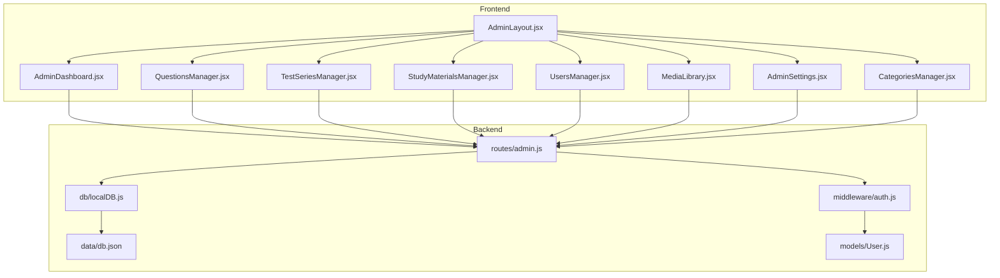

**Diagram sources**
- [Frontend/src/components/admin/AdminLayout.jsx](file://Frontend/src/components/admin/AdminLayout.jsx#L1-L306)
- [Frontend/src/pages/admin/AdminDashboard.jsx](file://Frontend/src/pages/admin/AdminDashboard.jsx#L1-L182)
- [Frontend/src/pages/admin/QuestionsManager.jsx](file://Frontend/src/pages/admin/QuestionsManager.jsx#L1-L421)
- [Frontend/src/pages/admin/TestSeriesManager.jsx](file://Frontend/src/pages/admin/TestSeriesManager.jsx#L1-L424)
- [Frontend/src/pages/admin/StudyMaterialsManager.jsx](file://Frontend/src/pages/admin/StudyMaterialsManager.jsx#L1-L539)
- [Frontend/src/pages/admin/UsersManager.jsx](file://Frontend/src/pages/admin/UsersManager.jsx#L1-L188)
- [Frontend/src/pages/admin/MediaLibrary.jsx](file://Frontend/src/pages/admin/MediaLibrary.jsx#L1-L154)
- [Frontend/src/pages/admin/AdminSettings.jsx](file://Frontend/src/pages/admin/AdminSettings.jsx#L1-L213)
- [Frontend/src/pages/admin/CategoriesManager.jsx](file://Frontend/src/pages/admin/CategoriesManager.jsx#L1-L432)
- [Backend/src/routes/admin.js](file://Backend/src/routes/admin.js#L1-L385)
- [Backend/src/middleware/auth.js](file://Backend/src/middleware/auth.js#L1-L92)
- [Backend/src/db/localDB.js](file://Backend/src/db/localDB.js#L1-L219)
- [Backend/data/db.json](file://Backend/data/db.json#L1-L728)
- [Backend/src/models/User.js](file://Backend/src/models/User.js#L1-L81)

**Section sources**
- [Backend/src/routes/admin.js](file://Backend/src/routes/admin.js#L1-L385)
- [Backend/src/middleware/auth.js](file://Backend/src/middleware/auth.js#L1-L92)
- [Backend/src/db/localDB.js](file://Backend/src/db/localDB.js#L1-L219)
- [Backend/data/db.json](file://Backend/data/db.json#L1-L728)
- [Backend/src/models/User.js](file://Backend/src/models/User.js#L1-L81)
- [Frontend/src/components/admin/AdminLayout.jsx](file://Frontend/src/components/admin/AdminLayout.jsx#L1-L306)
- [Frontend/src/pages/admin/AdminDashboard.jsx](file://Frontend/src/pages/admin/AdminDashboard.jsx#L1-L182)
- [Frontend/src/pages/admin/QuestionsManager.jsx](file://Frontend/src/pages/admin/QuestionsManager.jsx#L1-L421)
- [Frontend/src/pages/admin/TestSeriesManager.jsx](file://Frontend/src/pages/admin/TestSeriesManager.jsx#L1-L424)
- [Frontend/src/pages/admin/StudyMaterialsManager.jsx](file://Frontend/src/pages/admin/StudyMaterialsManager.jsx#L1-L539)
- [Frontend/src/pages/admin/UsersManager.jsx](file://Frontend/src/pages/admin/UsersManager.jsx#L1-L188)
- [Frontend/src/pages/admin/MediaLibrary.jsx](file://Frontend/src/pages/admin/MediaLibrary.jsx#L1-L154)
- [Frontend/src/pages/admin/AdminSettings.jsx](file://Frontend/src/pages/admin/AdminSettings.jsx#L1-L213)
- [Frontend/src/pages/admin/CategoriesManager.jsx](file://Frontend/src/pages/admin/CategoriesManager.jsx#L1-L432)
- [Frontend/src/services/api.js](file://Frontend/src/services/api.js#L1-L92)

## Core Components
- AdminLayout: Provides responsive navigation, collapsible sidebar, and mobile bottom bar. Enforces admin-only access via route protection.
- AdminDashboard: Fetches and displays platform statistics, quick actions, and recent activity.
- Content Managers:
  - QuestionsManager: CRUD for questions, bulk upload, and tagging.
  - TestSeriesManager: CRUD for test series with slugs, pricing, and activation.
  - StudyMaterialsManager: CRUD for study materials with soft delete, reordering, and activation toggles.
  - CategoriesManager: Hierarchical category management with tree UI and recursive deletion.
- UsersManager: Lists users, grants/revokes Pro Pass, and filters/searches.
- MediaLibrary: File upload with progress and type-specific guidance.
- AdminSettings: Site-wide configuration including contact info and social links.

**Section sources**
- [Frontend/src/components/admin/AdminLayout.jsx](file://Frontend/src/components/admin/AdminLayout.jsx#L1-L306)
- [Frontend/src/pages/admin/AdminDashboard.jsx](file://Frontend/src/pages/admin/AdminDashboard.jsx#L1-L182)
- [Frontend/src/pages/admin/QuestionsManager.jsx](file://Frontend/src/pages/admin/QuestionsManager.jsx#L1-L421)
- [Frontend/src/pages/admin/TestSeriesManager.jsx](file://Frontend/src/pages/admin/TestSeriesManager.jsx#L1-L424)
- [Frontend/src/pages/admin/StudyMaterialsManager.jsx](file://Frontend/src/pages/admin/StudyMaterialsManager.jsx#L1-L539)
- [Frontend/src/pages/admin/CategoriesManager.jsx](file://Frontend/src/pages/admin/CategoriesManager.jsx#L1-L432)
- [Frontend/src/pages/admin/UsersManager.jsx](file://Frontend/src/pages/admin/UsersManager.jsx#L1-L188)
- [Frontend/src/pages/admin/MediaLibrary.jsx](file://Frontend/src/pages/admin/MediaLibrary.jsx#L1-L154)
- [Frontend/src/pages/admin/AdminSettings.jsx](file://Frontend/src/pages/admin/AdminSettings.jsx#L1-L213)

## Architecture Overview
The admin architecture follows a layered pattern:
- Presentation Layer: React admin pages and layout.
- Routing Layer: Express routes under /api/admin guarded by JWT middleware.
- Business Logic: Route handlers orchestrate database operations via localDB helpers.
- Data Layer: Local JSON database with default collections for all domain entities.

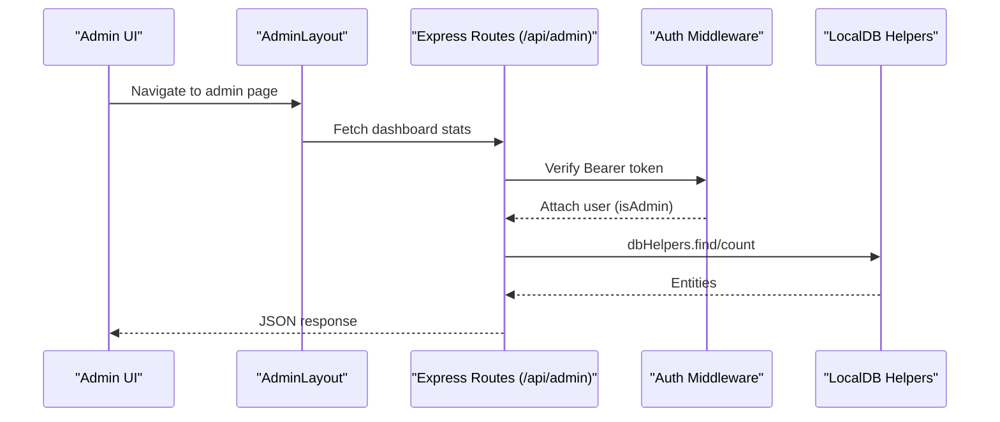

**Diagram sources**
- [Backend/src/routes/admin.js](file://Backend/src/routes/admin.js#L13-L29)
- [Backend/src/middleware/auth.js](file://Backend/src/middleware/auth.js#L5-L44)
- [Backend/src/db/localDB.js](file://Backend/src/db/localDB.js#L80-L100)

**Section sources**
- [Backend/src/routes/admin.js](file://Backend/src/routes/admin.js#L1-L385)
- [Backend/src/middleware/auth.js](file://Backend/src/middleware/auth.js#L1-L92)
- [Backend/src/db/localDB.js](file://Backend/src/db/localDB.js#L1-L219)

## Detailed Component Analysis

### Admin Authentication and Authorization
- Token verification: The protect middleware extracts a Bearer token from the Authorization header, verifies it, and attaches the user object to the request. The admin middleware checks the isAdmin flag.
- Optional auth: The optionalAuth middleware allows requests without failing if no valid token is present.
- Pro Pass enforcement: The proPass middleware restricts access to premium resources for users with a valid Pro Pass.

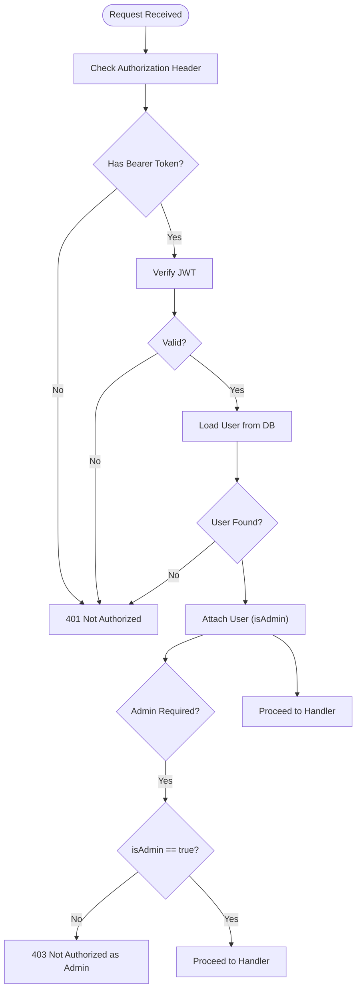

**Diagram sources**
- [Backend/src/middleware/auth.js](file://Backend/src/middleware/auth.js#L5-L78)

**Section sources**
- [Backend/src/middleware/auth.js](file://Backend/src/middleware/auth.js#L1-L92)
- [Backend/src/models/User.js](file://Backend/src/models/User.js#L33-L43)

### Admin Dashboard
- Fetches stats from GET /api/admin/stats using the protect middleware.
- Displays cards for users, test series, tests, questions, study materials, and media.
- Provides quick action links to content creation pages.

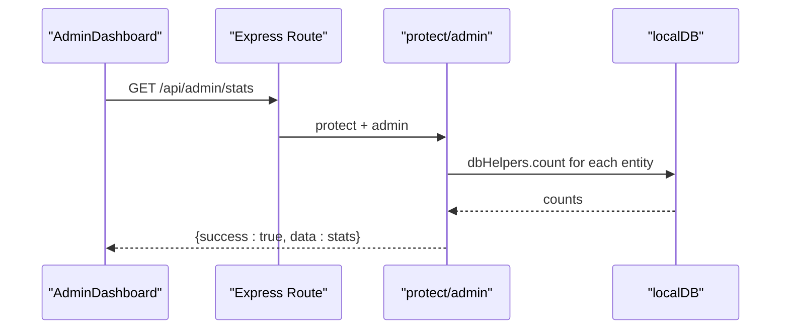

**Diagram sources**
- [Frontend/src/pages/admin/AdminDashboard.jsx](file://Frontend/src/pages/admin/AdminDashboard.jsx#L16-L33)
- [Backend/src/routes/admin.js](file://Backend/src/routes/admin.js#L13-L29)
- [Backend/src/middleware/auth.js](file://Backend/src/middleware/auth.js#L5-L78)
- [Backend/src/db/localDB.js](file://Backend/src/db/localDB.js#L212-L215)

**Section sources**
- [Frontend/src/pages/admin/AdminDashboard.jsx](file://Frontend/src/pages/admin/AdminDashboard.jsx#L1-L182)
- [Backend/src/routes/admin.js](file://Backend/src/routes/admin.js#L13-L29)

### Questions Management
- CRUD endpoints: GET/POST/PUT/DELETE /api/admin/questions with bulk upload POST /api/admin/questions/bulk.
- Frontend supports:
  - Single-question form with test selection, options, correct answer, explanation, marks, negative marks, and tags.
  - Bulk CSV upload with a predefined column order.
  - Edit and delete with confirmation prompts.

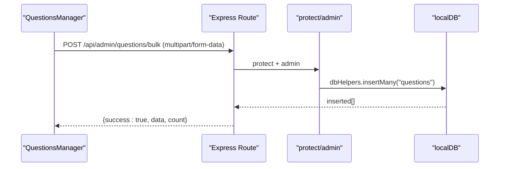

**Diagram sources**
- [Frontend/src/pages/admin/QuestionsManager.jsx](file://Frontend/src/pages/admin/QuestionsManager.jsx#L127-L159)
- [Backend/src/routes/admin.js](file://Backend/src/routes/admin.js#L136-L144)
- [Backend/src/middleware/auth.js](file://Backend/src/middleware/auth.js#L5-L78)
- [Backend/src/db/localDB.js](file://Backend/src/db/localDB.js#L132-L146)

**Section sources**
- [Frontend/src/pages/admin/QuestionsManager.jsx](file://Frontend/src/pages/admin/QuestionsManager.jsx#L1-L421)
- [Backend/src/routes/admin.js](file://Backend/src/routes/admin.js#L118-L168)

### Test Series Management
- CRUD endpoints: GET/POST/PUT/DELETE /api/admin/test-series.
- Frontend supports:
  - Title, slug, category, subcategory, difficulty, description, pricing, totals, tags, and activation.
  - Automatic slug generation from title.
  - Edit and delete with confirmation.

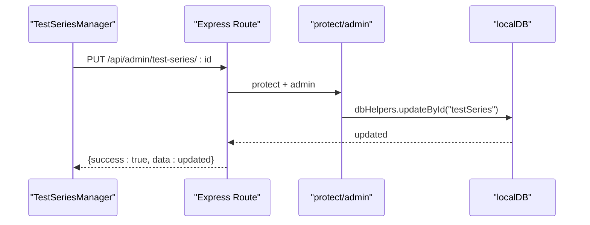

**Diagram sources**
- [Frontend/src/pages/admin/TestSeriesManager.jsx](file://Frontend/src/pages/admin/TestSeriesManager.jsx#L44-L79)
- [Backend/src/routes/admin.js](file://Backend/src/routes/admin.js#L40-L72)
- [Backend/src/middleware/auth.js](file://Backend/src/middleware/auth.js#L5-L78)
- [Backend/src/db/localDB.js](file://Backend/src/db/localDB.js#L167-L182)

**Section sources**
- [Frontend/src/pages/admin/TestSeriesManager.jsx](file://Frontend/src/pages/admin/TestSeriesManager.jsx#L1-L424)
- [Backend/src/routes/admin.js](file://Backend/src/routes/admin.js#L31-L72)

### Study Materials Management
- CRUD endpoints: GET/POST/PUT/DELETE /api/admin/study-materials.
- Soft delete implementation:
  - DELETE /api/admin/study-materials/:id moves an item to trash (optimistic UI update).
  - DELETE /api/admin/study-materials/:id?permanent=true performs permanent deletion.
  - PUT /api/admin/study-materials/:id toggles isActive.
  - PUT /api/admin/study-materials/:id/restore restores from trash.
  - Toggle trash view with query param deleted=true.
- Frontend supports:
  - Activation toggles, reordering controls, and trash management.
  - Optimistic updates with revert on failure.

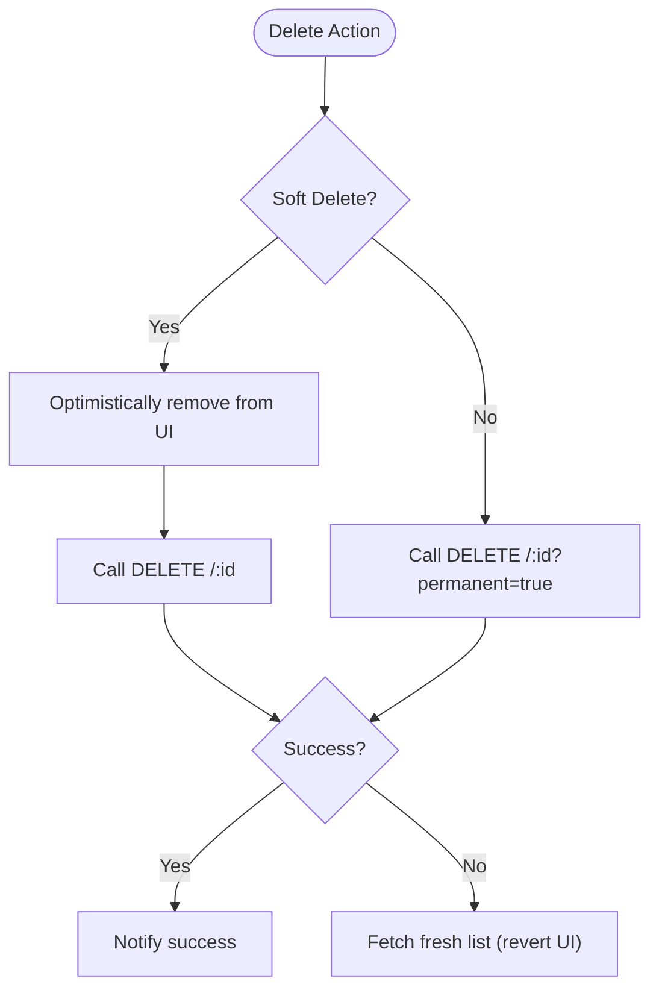

**Diagram sources**
- [Frontend/src/pages/admin/StudyMaterialsManager.jsx](file://Frontend/src/pages/admin/StudyMaterialsManager.jsx#L111-L147)
- [Backend/src/routes/admin.js](file://Backend/src/routes/admin.js#L199-L211)
- [Backend/src/middleware/auth.js](file://Backend/src/middleware/auth.js#L5-L78)
- [Backend/src/db/localDB.js](file://Backend/src/db/localDB.js#L199-L210)

**Section sources**
- [Frontend/src/pages/admin/StudyMaterialsManager.jsx](file://Frontend/src/pages/admin/StudyMaterialsManager.jsx#L1-L539)
- [Backend/src/routes/admin.js](file://Backend/src/routes/admin.js#L170-L211)

### Categories Management (Hierarchical)
- CRUD endpoints: GET/POST/PUT/DELETE /api/admin/test-categories with path retrieval GET /api/admin/test-categories/:id/path.
- Recursive deletion removes all descendants.
- Frontend builds a tree from flat data and supports expanding/collapsing nodes, adding child categories, and breadcrumbs.

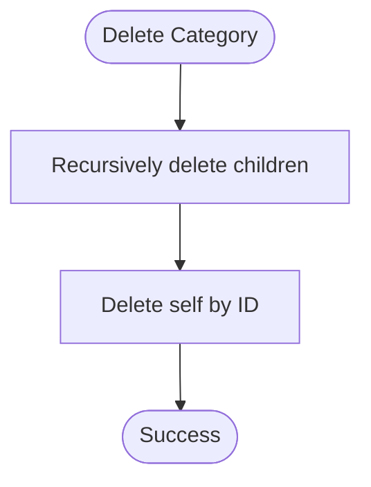

**Diagram sources**
- [Backend/src/routes/admin.js](file://Backend/src/routes/admin.js#L341-L364)
- [Backend/src/db/localDB.js](file://Backend/src/db/localDB.js#L199-L210)

**Section sources**
- [Frontend/src/pages/admin/CategoriesManager.jsx](file://Frontend/src/pages/admin/CategoriesManager.jsx#L1-L432)
- [Backend/src/routes/admin.js](file://Backend/src/routes/admin.js#L301-L382)

### Users Management and Permissions
- Endpoint: GET /api/admin/users returns sanitized user list (passwords excluded).
- Pro Pass management: PUT /api/admin/users/:id/pro-pass toggles isProUser and sets proPassExpiry.
- Frontend: Searchable table with role badges and Pro Pass status display.

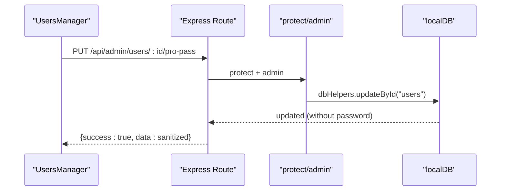

**Diagram sources**
- [Frontend/src/pages/admin/UsersManager.jsx](file://Frontend/src/pages/admin/UsersManager.jsx#L30-L58)
- [Backend/src/routes/admin.js](file://Backend/src/routes/admin.js#L225-L240)
- [Backend/src/middleware/auth.js](file://Backend/src/middleware/auth.js#L5-L78)
- [Backend/src/db/localDB.js](file://Backend/src/db/localDB.js#L167-L182)

**Section sources**
- [Frontend/src/pages/admin/UsersManager.jsx](file://Frontend/src/pages/admin/UsersManager.jsx#L1-L188)
- [Backend/src/routes/admin.js](file://Backend/src/routes/admin.js#L213-L240)

### Media Library
- Endpoint: POST /api/admin/upload handles single file uploads and records metadata in the media collection.
- Frontend: Drag-and-drop upload area with progress indication and supported file type hints.

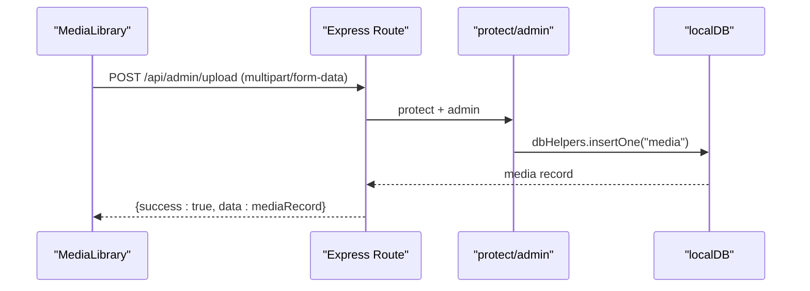

**Diagram sources**
- [Frontend/src/pages/admin/MediaLibrary.jsx](file://Frontend/src/pages/admin/MediaLibrary.jsx#L9-L49)
- [Backend/src/routes/admin.js](file://Backend/src/routes/admin.js#L242-L272)
- [Backend/src/middleware/auth.js](file://Backend/src/middleware/auth.js#L5-L78)
- [Backend/src/db/localDB.js](file://Backend/src/db/localDB.js#L116-L130)

**Section sources**
- [Frontend/src/pages/admin/MediaLibrary.jsx](file://Frontend/src/pages/admin/MediaLibrary.jsx#L1-L154)
- [Backend/src/routes/admin.js](file://Backend/src/routes/admin.js#L242-L272)

### Application Settings
- Endpoints: GET /api/admin/settings and PUT /api/admin/settings.
- Frontend: Form for site name, tagline, contact info, and social links; saves via PUT.

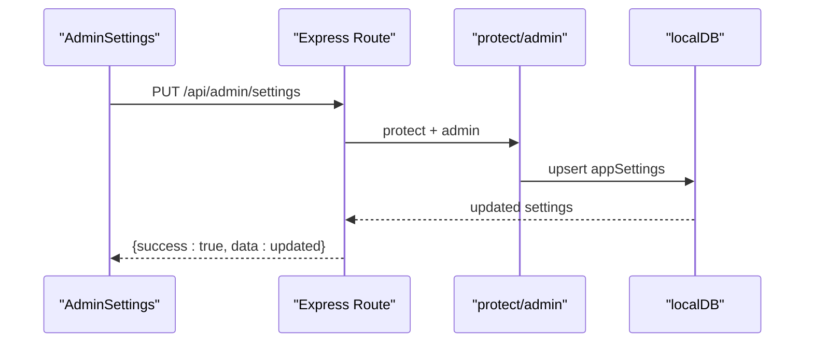

**Diagram sources**
- [Frontend/src/pages/admin/AdminSettings.jsx](file://Frontend/src/pages/admin/AdminSettings.jsx#L41-L66)
- [Backend/src/routes/admin.js](file://Backend/src/routes/admin.js#L274-L299)
- [Backend/src/middleware/auth.js](file://Backend/src/middleware/auth.js#L5-L78)
- [Backend/src/db/localDB.js](file://Backend/src/db/localDB.js#L148-L182)

**Section sources**
- [Frontend/src/pages/admin/AdminSettings.jsx](file://Frontend/src/pages/admin/AdminSettings.jsx#L1-L213)
- [Backend/src/routes/admin.js](file://Backend/src/routes/admin.js#L274-L299)

### Admin Workflow: From Login to Content Operations
- Login: Admin authenticates and receives a JWT stored in localStorage.
- Navigation: AdminLayout enforces admin-only access and provides navigation to all admin pages.
- Content Operations: Each manager page calls appropriate backend endpoints with Authorization headers.
- Deletion: StudyMaterialsManager demonstrates optimistic UI updates and rollback on failure.

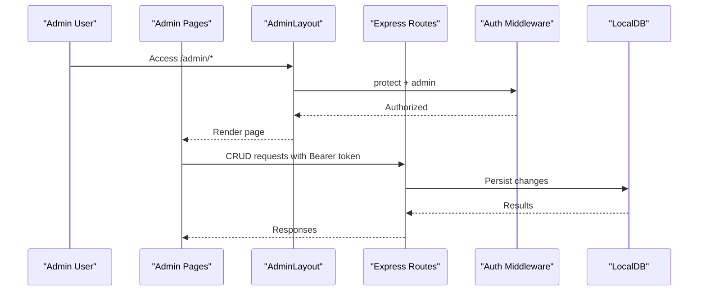

**Diagram sources**
- [Frontend/src/components/admin/AdminLayout.jsx](file://Frontend/src/components/admin/AdminLayout.jsx#L49-L53)
- [Backend/src/middleware/auth.js](file://Backend/src/middleware/auth.js#L5-L78)
- [Backend/src/routes/admin.js](file://Backend/src/routes/admin.js#L1-L10)
- [Backend/src/db/localDB.js](file://Backend/src/db/localDB.js#L1-L219)

**Section sources**
- [Frontend/src/components/admin/AdminLayout.jsx](file://Frontend/src/components/admin/AdminLayout.jsx#L1-L306)
- [Backend/src/middleware/auth.js](file://Backend/src/middleware/auth.js#L1-L92)
- [Backend/src/routes/admin.js](file://Backend/src/routes/admin.js#L1-L10)
- [Backend/src/db/localDB.js](file://Backend/src/db/localDB.js#L1-L219)

## Dependency Analysis
- AdminLayout depends on react-router for navigation and Lucide icons for UI.
- Admin pages depend on localStorage for tokens and fetch for HTTP communication.
- Backend routes depend on auth middleware and localDB helpers.
- localDB encapsulates CRUD operations and ensures default collections exist.
- db.json serves as the persistent store for all entities.

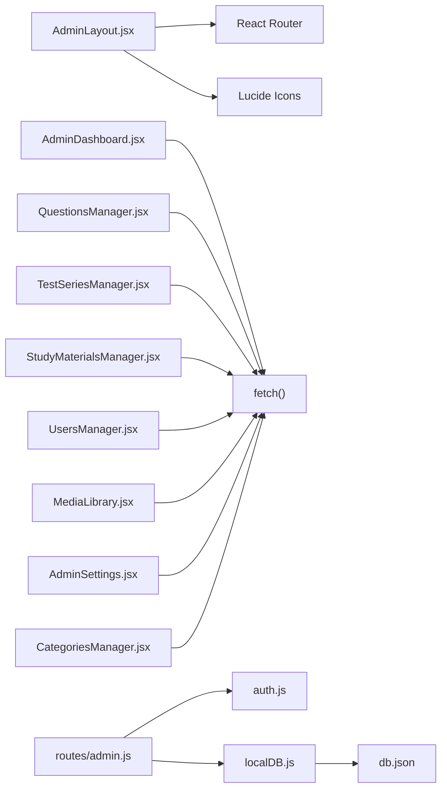

**Diagram sources**
- [Frontend/src/components/admin/AdminLayout.jsx](file://Frontend/src/components/admin/AdminLayout.jsx#L1-L306)
- [Frontend/src/pages/admin/AdminDashboard.jsx](file://Frontend/src/pages/admin/AdminDashboard.jsx#L1-L182)
- [Frontend/src/pages/admin/QuestionsManager.jsx](file://Frontend/src/pages/admin/QuestionsManager.jsx#L1-L421)
- [Frontend/src/pages/admin/TestSeriesManager.jsx](file://Frontend/src/pages/admin/TestSeriesManager.jsx#L1-L424)
- [Frontend/src/pages/admin/StudyMaterialsManager.jsx](file://Frontend/src/pages/admin/StudyMaterialsManager.jsx#L1-L539)
- [Frontend/src/pages/admin/UsersManager.jsx](file://Frontend/src/pages/admin/UsersManager.jsx#L1-L188)
- [Frontend/src/pages/admin/MediaLibrary.jsx](file://Frontend/src/pages/admin/MediaLibrary.jsx#L1-L154)
- [Frontend/src/pages/admin/AdminSettings.jsx](file://Frontend/src/pages/admin/AdminSettings.jsx#L1-L213)
- [Frontend/src/pages/admin/CategoriesManager.jsx](file://Frontend/src/pages/admin/CategoriesManager.jsx#L1-L432)
- [Backend/src/routes/admin.js](file://Backend/src/routes/admin.js#L1-L385)
- [Backend/src/middleware/auth.js](file://Backend/src/middleware/auth.js#L1-L92)
- [Backend/src/db/localDB.js](file://Backend/src/db/localDB.js#L1-L219)
- [Backend/data/db.json](file://Backend/data/db.json#L1-L728)

**Section sources**
- [Backend/src/routes/admin.js](file://Backend/src/routes/admin.js#L1-L385)
- [Backend/src/middleware/auth.js](file://Backend/src/middleware/auth.js#L1-L92)
- [Backend/src/db/localDB.js](file://Backend/src/db/localDB.js#L1-L219)
- [Backend/data/db.json](file://Backend/data/db.json#L1-L728)
- [Frontend/src/components/admin/AdminLayout.jsx](file://Frontend/src/components/admin/AdminLayout.jsx#L1-L306)
- [Frontend/src/pages/admin/AdminDashboard.jsx](file://Frontend/src/pages/admin/AdminDashboard.jsx#L1-L182)
- [Frontend/src/pages/admin/QuestionsManager.jsx](file://Frontend/src/pages/admin/QuestionsManager.jsx#L1-L421)
- [Frontend/src/pages/admin/TestSeriesManager.jsx](file://Frontend/src/pages/admin/TestSeriesManager.jsx#L1-L424)
- [Frontend/src/pages/admin/StudyMaterialsManager.jsx](file://Frontend/src/pages/admin/StudyMaterialsManager.jsx#L1-L539)
- [Frontend/src/pages/admin/UsersManager.jsx](file://Frontend/src/pages/admin/UsersManager.jsx#L1-L188)
- [Frontend/src/pages/admin/MediaLibrary.jsx](file://Frontend/src/pages/admin/MediaLibrary.jsx#L1-L154)
- [Frontend/src/pages/admin/AdminSettings.jsx](file://Frontend/src/pages/admin/AdminSettings.jsx#L1-L213)
- [Frontend/src/pages/admin/CategoriesManager.jsx](file://Frontend/src/pages/admin/CategoriesManager.jsx#L1-L432)

## Performance Considerations
- Local JSON database: Suitable for development and small-scale usage. For production, consider migrating to a proper database engine to improve concurrency, indexing, and scalability.
- Bulk operations: Bulk question upload inserts many documents atomically but still writes to disk after each insertion; batching and transaction-like semantics should be considered for large datasets.
- UI responsiveness: Optimistic updates in StudyMaterialsManager reduce perceived latency but require robust error handling and fallback to refresh data on failure.
- Network timeouts: Frontend axios instance has a 10-second timeout; adjust as needed for large file uploads.

[No sources needed since this section provides general guidance]

## Troubleshooting Guide
- Authentication failures:
  - Missing or invalid Bearer token leads to 401 responses; ensure the token is present in localStorage and attached to requests.
  - Invalid/expired tokens trigger automatic logout; re-authenticate.
- Authorization failures:
  - Non-admin users receive 403 when accessing admin routes.
- Network errors:
  - Axios interceptor handles 401 by clearing tokens and redirecting to login; check network connectivity and CORS.
- Soft delete issues:
  - If a soft delete fails, StudyMaterialsManager reverts the UI; retry or refresh the page to sync with server state.
- Database initialization:
  - localDB initializes default collections if missing; verify db.json exists and is writable.

**Section sources**
- [Backend/src/middleware/auth.js](file://Backend/src/middleware/auth.js#L14-L43)
- [Frontend/src/services/api.js](file://Frontend/src/services/api.js#L26-L44)
- [Frontend/src/pages/admin/StudyMaterialsManager.jsx](file://Frontend/src/pages/admin/StudyMaterialsManager.jsx#L111-L147)
- [Backend/src/db/localDB.js](file://Backend/src/db/localDB.js#L45-L70)

## Conclusion
Trstprep V2’s admin panel provides a comprehensive set of tools for managing content, users, media, and platform settings. It leverages JWT-based authentication, a clean separation of concerns across frontend and backend, and pragmatic local storage for persistence. While suitable for development and small deployments, production readiness would benefit from a scalable database, enhanced audit logging, and stricter content moderation workflows.

*Last Updated: March 10, 2026 | Update date is (20:16)*
