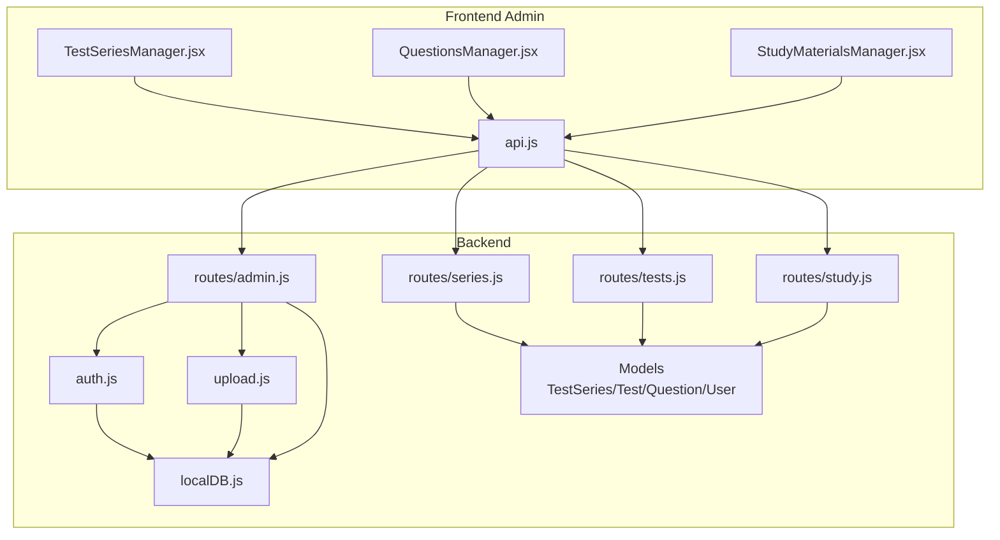
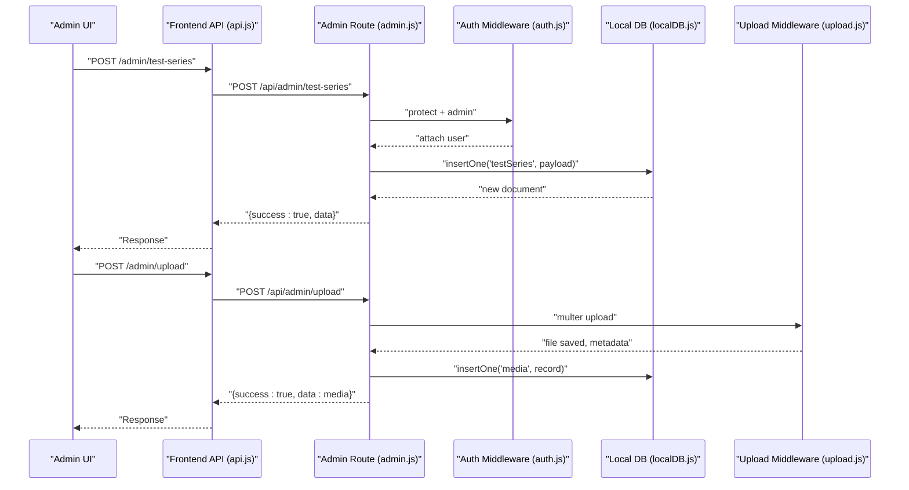
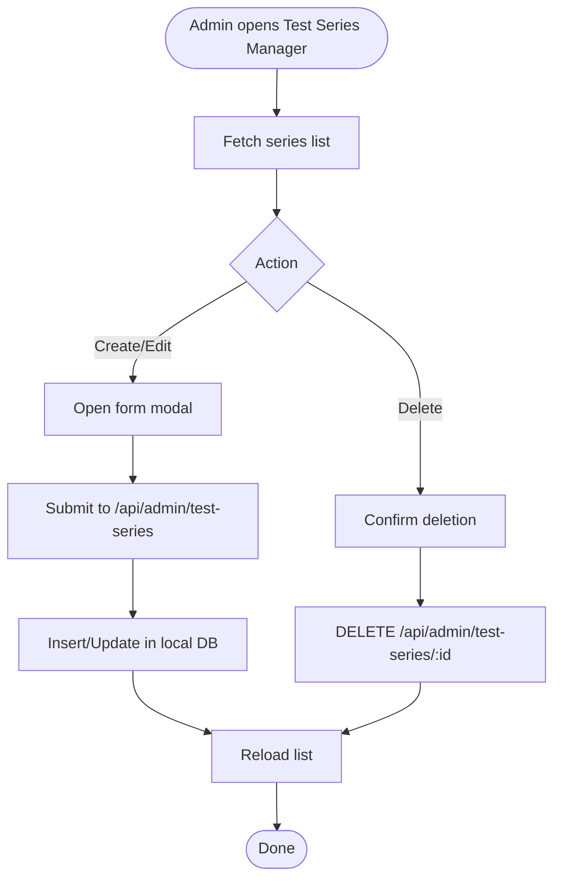
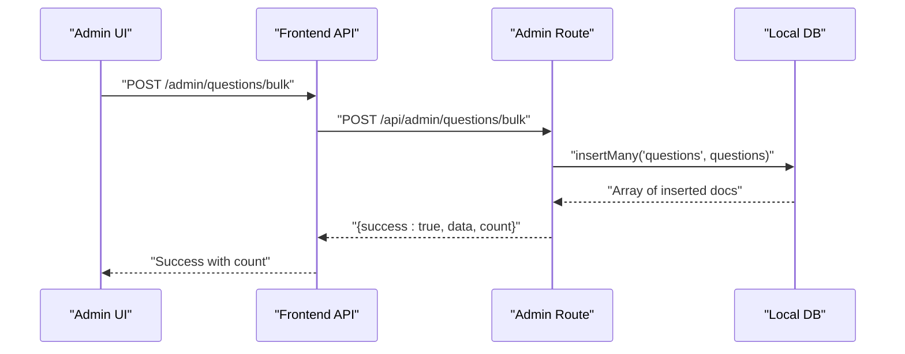
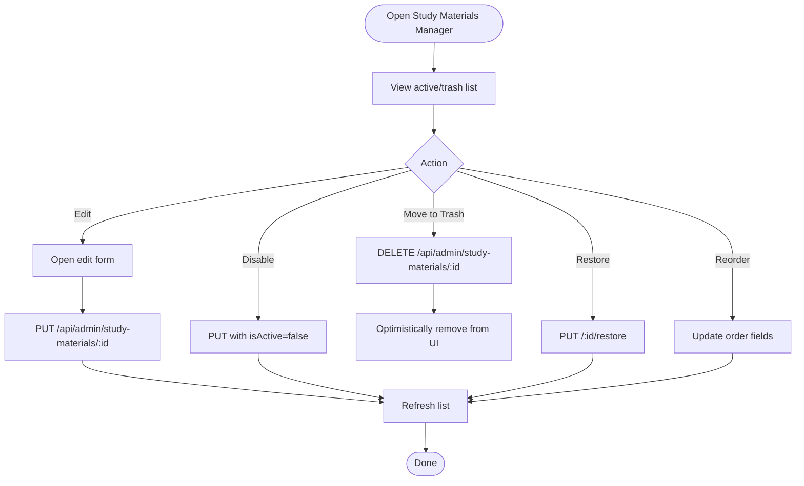
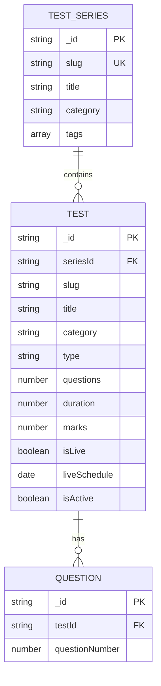
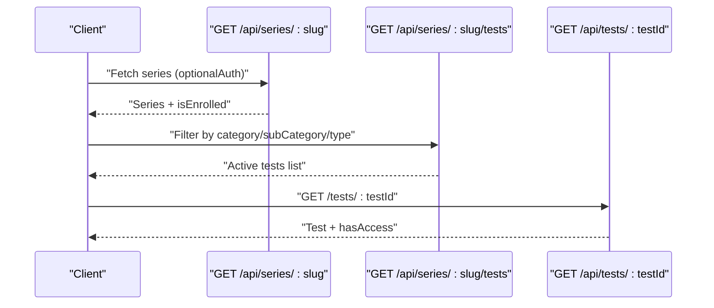
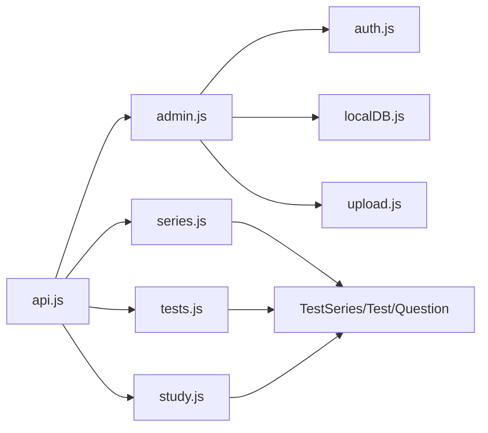

# Content Management

<cite>
**Referenced Files in This Document**
- [TestSeries.js](file://Backend/src/models/TestSeries.js)
- [Test.js](file://Backend/src/models/Test.js)
- [Question.js](file://Backend/src/models/Question.js)
- [User.js](file://Backend/src/models/User.js)
- [admin.js](file://Backend/src/routes/admin.js)
- [series.js](file://Backend/src/routes/series.js)
- [tests.js](file://Backend/src/routes/tests.js)
- [study.js](file://Backend/src/routes/study.js)
- [localDB.js](file://Backend/src/db/localDB.js)
- [auth.js](file://Backend/src/middleware/auth.js)
- [upload.js](file://Backend/src/middleware/upload.js)
- [TestSeriesManager.jsx](file://Frontend/src/pages/admin/TestSeriesManager.jsx)
- [QuestionsManager.jsx](file://Frontend/src/pages/admin/QuestionsManager.jsx)
- [StudyMaterialsManager.jsx](file://Frontend/src/pages/admin/StudyMaterialsManager.jsx)
- [api.js](file://Frontend/src/services/api.js)
</cite>

## Table of Contents
1. [Introduction](#introduction)
2. [Project Structure](#project-structure)
3. [Core Components](#core-components)
4. [Architecture Overview](#architecture-overview)
5. [Detailed Component Analysis](#detailed-component-analysis)
6. [Dependency Analysis](#dependency-analysis)
7. [Performance Considerations](#performance-considerations)
8. [Troubleshooting Guide](#troubleshooting-guide)
9. [Conclusion](#conclusion)

## Introduction
This document explains Trstprep V2’s content management systems with a focus on test series, question, and study materials management. It covers CRUD operations, bulk upload capabilities, category organization, soft delete mechanics, approval and publishing controls, quality assurance processes, administrative interfaces, validation rules, multi-language support, and content relationship management. The backend uses a local JSON database abstraction layered over Express routes, while the frontend provides admin dashboards for managing content.

## Project Structure
The system is split into a backend (Express server with local JSON DB) and a frontend (React admin panels). Routes expose public and admin APIs for content retrieval and management. Middleware handles authentication, authorization, and file uploads.



**Diagram sources**
- [TestSeriesManager.jsx](file://Frontend/src/pages/admin/TestSeriesManager.jsx#L1-L424)
- [QuestionsManager.jsx](file://Frontend/src/pages/admin/QuestionsManager.jsx#L1-L421)
- [StudyMaterialsManager.jsx](file://Frontend/src/pages/admin/StudyMaterialsManager.jsx#L1-L539)
- [api.js](file://Frontend/src/services/api.js#L1-L92)
- [admin.js](file://Backend/src/routes/admin.js#L1-L557)
- [series.js](file://Backend/src/routes/series.js#L1-L162)
- [tests.js](file://Backend/src/routes/tests.js#L1-L265)
- [study.js](file://Backend/src/routes/study.js#L1-L137)
- [localDB.js](file://Backend/src/db/localDB.js#L1-L222)
- [auth.js](file://Backend/src/middleware/auth.js#L1-L92)
- [upload.js](file://Backend/src/middleware/upload.js#L1-L91)

**Section sources**
- [admin.js](file://Backend/src/routes/admin.js#L1-L557)
- [localDB.js](file://Backend/src/db/localDB.js#L1-L222)
- [auth.js](file://Backend/src/middleware/auth.js#L1-L92)
- [upload.js](file://Backend/src/middleware/upload.js#L1-L91)
- [TestSeriesManager.jsx](file://Frontend/src/pages/admin/TestSeriesManager.jsx#L1-L424)
- [QuestionsManager.jsx](file://Frontend/src/pages/admin/QuestionsManager.jsx#L1-L421)
- [StudyMaterialsManager.jsx](file://Frontend/src/pages/admin/StudyMaterialsManager.jsx#L1-L539)
- [api.js](file://Frontend/src/services/api.js#L1-L92)

## Core Components
- Test Series: Educational bundles with category, tags, ratings, and activity metrics.
- Tests: Individual assessments linked to a series, with categories, types, durations, and marks.
- Questions: Items per test with multi-language support, options, correct answers, difficulty, and explanations.
- Study Materials: Subject-based resources with counts and ordering.
- Admin APIs: CRUD endpoints for all content types, bulk uploads, category management, and media handling.
- Frontend Managers: React admin pages for creating, editing, organizing, and soft-deleting content.

**Section sources**
- [TestSeries.js](file://Backend/src/models/TestSeries.js#L1-L71)
- [Test.js](file://Backend/src/models/Test.js#L1-L77)
- [Question.js](file://Backend/src/models/Question.js#L1-L54)
- [admin.js](file://Backend/src/routes/admin.js#L31-L211)
- [TestSeriesManager.jsx](file://Frontend/src/pages/admin/TestSeriesManager.jsx#L1-L424)
- [QuestionsManager.jsx](file://Frontend/src/pages/admin/QuestionsManager.jsx#L1-L421)
- [StudyMaterialsManager.jsx](file://Frontend/src/pages/admin/StudyMaterialsManager.jsx#L1-L539)

## Architecture Overview
The admin interface communicates with backend routes secured by JWT-based middleware. The local JSON database abstraction supports CRUD operations and bulk inserts. File uploads are handled with type filtering and storage organization.



**Diagram sources**
- [api.js](file://Frontend/src/services/api.js#L1-L92)
- [admin.js](file://Backend/src/routes/admin.js#L1-L557)
- [auth.js](file://Backend/src/middleware/auth.js#L1-L92)
- [localDB.js](file://Backend/src/db/localDB.js#L1-L222)
- [upload.js](file://Backend/src/middleware/upload.js#L1-L91)

## Detailed Component Analysis

### Test Series Management
- Purpose: Manage educational series with categories, tags, pricing, and activity indicators.
- CRUD:
  - List: GET /api/admin/test-series
  - Create: POST /api/admin/test-series
  - Update: PUT /api/admin/test-series/:id
  - Delete: DELETE /api/admin/test-series/:id
- Model highlights: slug uniqueness, category enum, tags array, rating bounds, counters, and activity metrics.
- Admin UI: Form-driven creation/editing with auto-generated slugs and bulk actions.



**Diagram sources**
- [TestSeriesManager.jsx](file://Frontend/src/pages/admin/TestSeriesManager.jsx#L23-L127)
- [admin.js](file://Backend/src/routes/admin.js#L31-L72)
- [TestSeries.js](file://Backend/src/models/TestSeries.js#L1-L71)

**Section sources**
- [TestSeries.js](file://Backend/src/models/TestSeries.js#L1-L71)
- [admin.js](file://Backend/src/routes/admin.js#L31-L72)
- [TestSeriesManager.jsx](file://Frontend/src/pages/admin/TestSeriesManager.jsx#L1-L424)

### Question Management
- Purpose: Create and manage questions per test with multi-language text and options.
- CRUD:
  - List: GET /api/admin/questions
  - Create: POST /api/admin/questions
  - Update: PUT /api/admin/questions/:id
  - Delete: DELETE /api/admin/questions/:id
- Bulk Upload:
  - POST /api/admin/questions/bulk with array of question records.
- Model highlights: compound unique index on testId + questionNumber, multi-language fields, difficulty levels, and correct option bounds.
- Admin UI: Single-question editor and CSV bulk upload with format guidance.



**Diagram sources**
- [QuestionsManager.jsx](file://Frontend/src/pages/admin/QuestionsManager.jsx#L127-L159)
- [admin.js](file://Backend/src/routes/admin.js#L136-L144)
- [Question.js](file://Backend/src/models/Question.js#L1-L54)

**Section sources**
- [Question.js](file://Backend/src/models/Question.js#L1-L54)
- [admin.js](file://Backend/src/routes/admin.js#L117-L168)
- [QuestionsManager.jsx](file://Frontend/src/pages/admin/QuestionsManager.jsx#L1-L421)

### Study Materials Management
- Purpose: Manage subjects and study resources with counts, ordering, and activation.
- CRUD:
  - List: GET /api/admin/study-materials
  - Create: POST /api/admin/study-materials
  - Update: PUT /api/admin/study-materials/:id
  - Delete: DELETE /api/admin/study-materials/:id (soft delete)
- Soft Delete and Restore:
  - Move to trash via DELETE with optimistic UI update.
  - Restore via PUT /:id/restore.
- Ordering:
  - Up/down reordering updates each item’s order field.
- Admin UI: Toggle active/inactive, trash bin, and reorder controls.



**Diagram sources**
- [StudyMaterialsManager.jsx](file://Frontend/src/pages/admin/StudyMaterialsManager.jsx#L89-L205)
- [admin.js](file://Backend/src/routes/admin.js#L170-L211)
- [localDB.js](file://Backend/src/db/localDB.js#L120-L185)

**Section sources**
- [admin.js](file://Backend/src/routes/admin.js#L170-L211)
- [StudyMaterialsManager.jsx](file://Frontend/src/pages/admin/StudyMaterialsManager.jsx#L1-L539)
- [localDB.js](file://Backend/src/db/localDB.js#L1-L222)

### Content Relationships and Organization
- Test Series → Tests: One-to-many via seriesId reference.
- Tests → Questions: One-to-many via testId reference with unique numbering per test.
- Categories:
  - Test categories: Hierarchical flat list with parentId/level.
  - Exam categories: Top-level categories (e.g., SSC, Railway, Banking).
- Tags: Arrays on series and tests for discovery and filtering.



**Diagram sources**
- [TestSeries.js](file://Backend/src/models/TestSeries.js#L1-L71)
- [Test.js](file://Backend/src/models/Test.js#L1-L77)
- [Question.js](file://Backend/src/models/Question.js#L1-L54)

**Section sources**
- [TestSeries.js](file://Backend/src/models/TestSeries.js#L1-L71)
- [Test.js](file://Backend/src/models/Test.js#L1-L77)
- [Question.js](file://Backend/src/models/Question.js#L1-L54)
- [admin.js](file://Backend/src/routes/admin.js#L301-L382)

### Multi-Language Support Implementation
- Questions support English and Hindi text and options via nested fields.
- Admin forms capture both languages for content creation and editing.
- Frontend displays appropriate language content based on user preferences or defaults.

```mermaid
classDiagram
class Question {
+text : {en : string, hi : string}
+options : {en : string[], hi? : string[]}
+explanation : string
}
```

**Diagram sources**
- [Question.js](file://Backend/src/models/Question.js#L14-L21)
- [QuestionsManager.jsx](file://Frontend/src/pages/admin/QuestionsManager.jsx#L1-L421)

**Section sources**
- [Question.js](file://Backend/src/models/Question.js#L14-L21)
- [QuestionsManager.jsx](file://Frontend/src/pages/admin/QuestionsManager.jsx#L1-L421)

### Publishing Controls and Access
- Test visibility: isActive flag controls public listing.
- Test access: Free vs Pro gating; Pro Pass validation enforced for protected content.
- Series enrollment: Optional enrollment check for series details.
- Frontend routes:
  - Series listing and filtering by category/search/sort.
  - Test details and question retrieval with access checks.



**Diagram sources**
- [series.js](file://Backend/src/routes/series.js#L55-L93)
- [series.js](file://Backend/src/routes/series.js#L95-L136)
- [tests.js](file://Backend/src/routes/tests.js#L50-L84)
- [tests.js](file://Backend/src/routes/tests.js#L125-L166)

**Section sources**
- [series.js](file://Backend/src/routes/series.js#L1-L162)
- [tests.js](file://Backend/src/routes/tests.js#L1-L265)

### Quality Assurance Processes
- Validation rules embedded in models:
  - Required fields, enums, numeric bounds, unique constraints.
  - Unique composite indices for slug+seriesId and testId+questionNumber.
- Frontend sanitization:
  - Arrays converted to proper arrays and trimming performed.
  - Numeric conversions with min/max constraints.
- File upload safeguards:
  - Allowed MIME types, size limits, and unique filenames.
- Audit-friendly fields:
  - createdAt/updatedAt populated by DB helpers.

**Section sources**
- [TestSeries.js](file://Backend/src/models/TestSeries.js#L1-L71)
- [Test.js](file://Backend/src/models/Test.js#L1-L77)
- [Question.js](file://Backend/src/models/Question.js#L1-L54)
- [localDB.js](file://Backend/src/db/localDB.js#L120-L185)
- [upload.js](file://Backend/src/middleware/upload.js#L55-L83)

### Administrative Interfaces
- Test Series Manager: Create/update series, toggle active state, view counts.
- Questions Manager: Create/update questions, bulk upload via CSV, link to tests.
- Study Materials Manager: Create/update materials, soft delete, restore, reorder, enable/disable.

**Section sources**
- [TestSeriesManager.jsx](file://Frontend/src/pages/admin/TestSeriesManager.jsx#L1-L424)
- [QuestionsManager.jsx](file://Frontend/src/pages/admin/QuestionsManager.jsx#L1-L421)
- [StudyMaterialsManager.jsx](file://Frontend/src/pages/admin/StudyMaterialsManager.jsx#L1-L539)

## Dependency Analysis
- Routes depend on:
  - Authentication middleware for admin-only endpoints.
  - Local DB helpers for persistence.
  - Upload middleware for media handling.
- Models define domain constraints and indexes.
- Frontend services encapsulate API calls and interceptors for auth and error handling.



**Diagram sources**
- [admin.js](file://Backend/src/routes/admin.js#L1-L557)
- [auth.js](file://Backend/src/middleware/auth.js#L1-L92)
- [localDB.js](file://Backend/src/db/localDB.js#L1-L222)
- [upload.js](file://Backend/src/middleware/upload.js#L1-L91)
- [series.js](file://Backend/src/routes/series.js#L1-L162)
- [tests.js](file://Backend/src/routes/tests.js#L1-L265)
- [study.js](file://Backend/src/routes/study.js#L1-L137)
- [api.js](file://Frontend/src/services/api.js#L1-L92)

**Section sources**
- [admin.js](file://Backend/src/routes/admin.js#L1-L557)
- [auth.js](file://Backend/src/middleware/auth.js#L1-L92)
- [localDB.js](file://Backend/src/db/localDB.js#L1-L222)
- [upload.js](file://Backend/src/middleware/upload.js#L1-L91)
- [series.js](file://Backend/src/routes/series.js#L1-L162)
- [tests.js](file://Backend/src/routes/tests.js#L1-L265)
- [study.js](file://Backend/src/routes/study.js#L1-L137)
- [api.js](file://Frontend/src/services/api.js#L1-L92)

## Performance Considerations
- Indexes: Category and isActive fields indexed on series and tests for fast filtering.
- Queries: Filtering by category, type, and search terms; sorting options for series.
- Bulk operations: insertMany for questions reduces round trips during bulk upload.
- Recommendations:
  - Normalize frequently filtered fields and consider adding compound indexes for common query patterns.
  - Paginate large lists in admin UIs to reduce payload sizes.
  - Cache static category and exam data on the client.

[No sources needed since this section provides general guidance]

## Troubleshooting Guide
- Authentication failures:
  - Missing or invalid Bearer token leads to 401 responses.
  - Unauthorized access attempts return 403 for admin routes.
- Authorization failures:
  - Non-admin users blocked from admin endpoints.
- Upload errors:
  - Unsupported file types or exceeding size limits.
  - Ensure upload directories exist and are writable.
- Data validation:
  - Unique constraint violations (e.g., slug uniqueness, composite unique index on testId+questionNumber).
  - Min/max bounds on numeric fields trigger validation errors.
- Soft delete anomalies:
  - Confirm optimistic UI updates align with server responses; revert on failure.

**Section sources**
- [auth.js](file://Backend/src/middleware/auth.js#L5-L92)
- [upload.js](file://Backend/src/middleware/upload.js#L55-L83)
- [localDB.js](file://Backend/src/db/localDB.js#L120-L185)
- [TestSeries.js](file://Backend/src/models/TestSeries.js#L65-L67)
- [Test.js](file://Backend/src/models/Test.js#L70-L73)
- [Question.js](file://Backend/src/models/Question.js#L49-L50)

## Conclusion
Trstprep V2’s content management system combines robust model validations, flexible admin interfaces, and a pragmatic local JSON database abstraction. Test series, tests, and questions are tightly integrated with category and tag systems, while study materials benefit from soft delete and reordering capabilities. The admin APIs enforce security and provide bulk operations, and the frontend managers streamline content creation and organization. Extending the system with explicit approval workflows and richer QA checks would further strengthen editorial control.

*Last Updated: March 10, 2026 | Update date is (20:16)*
