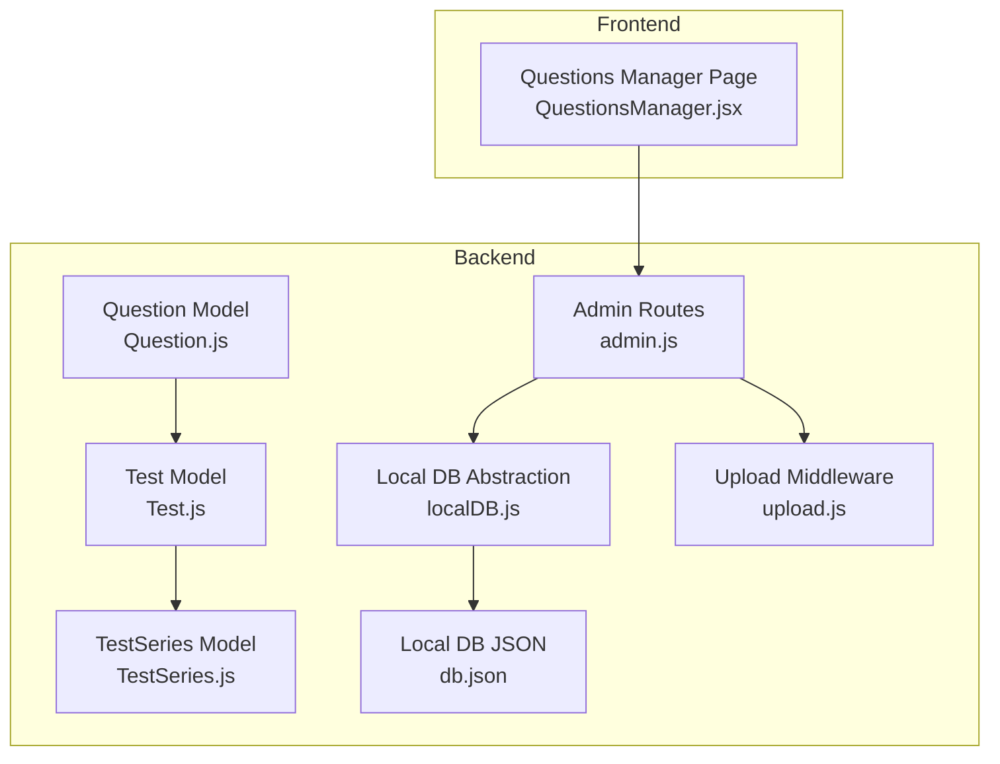
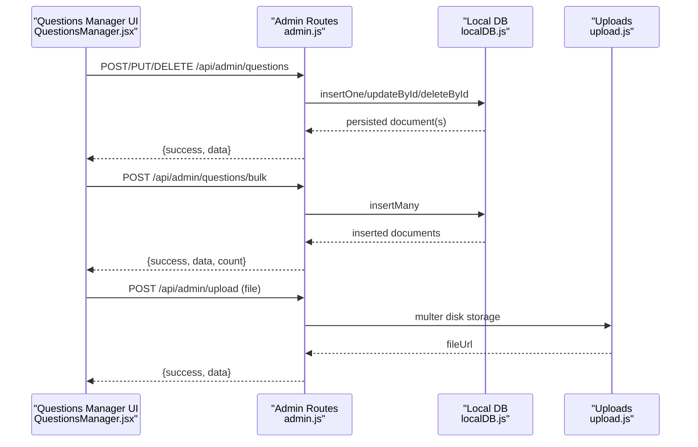
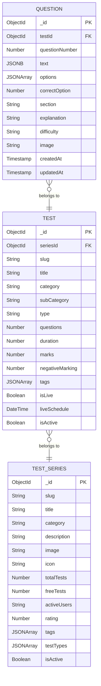
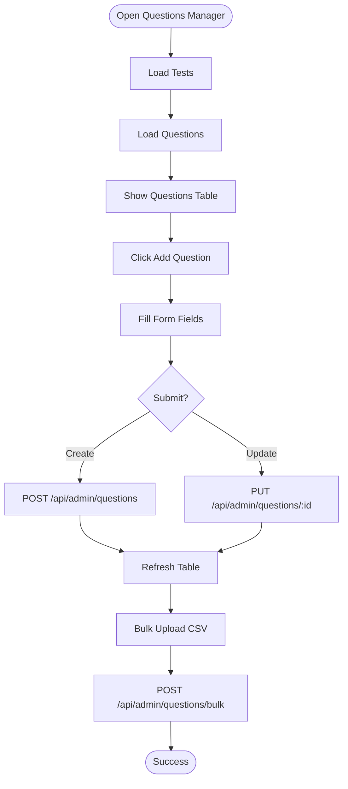
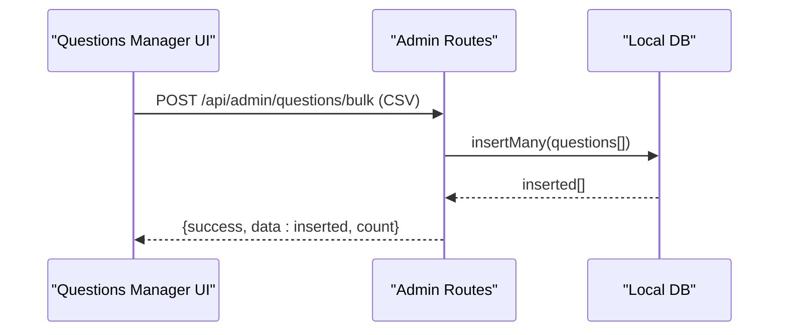
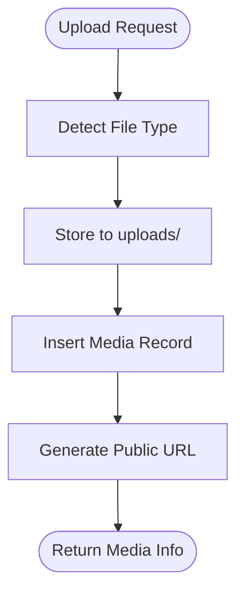
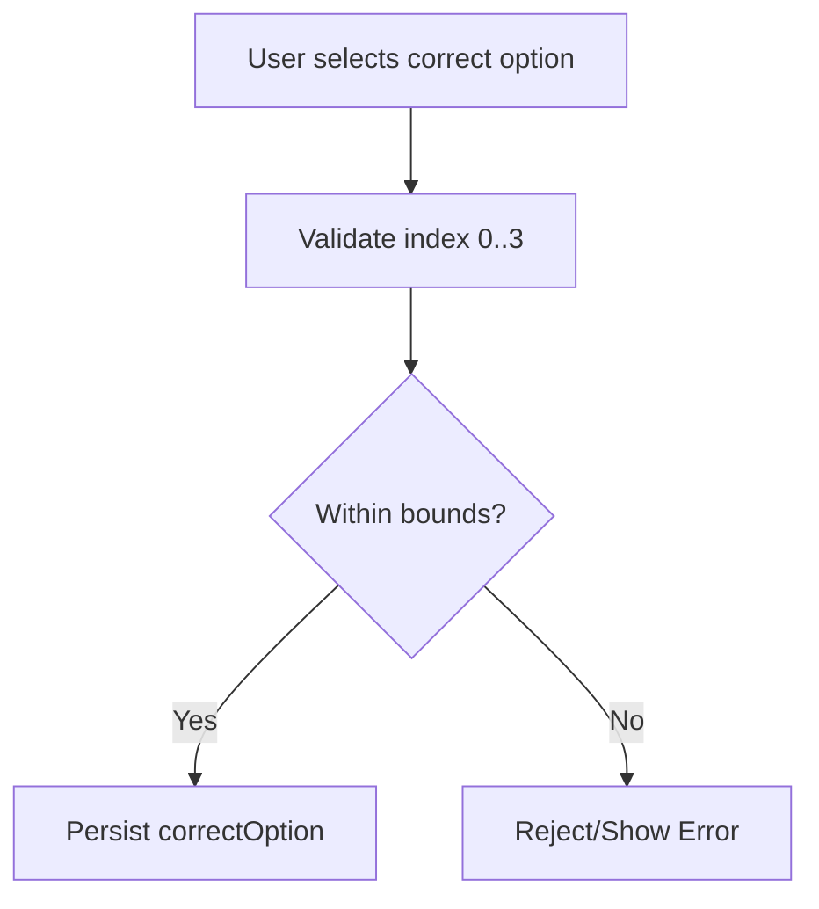
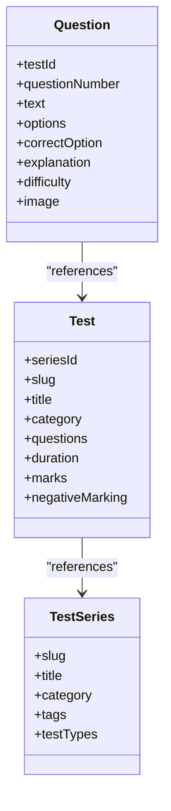
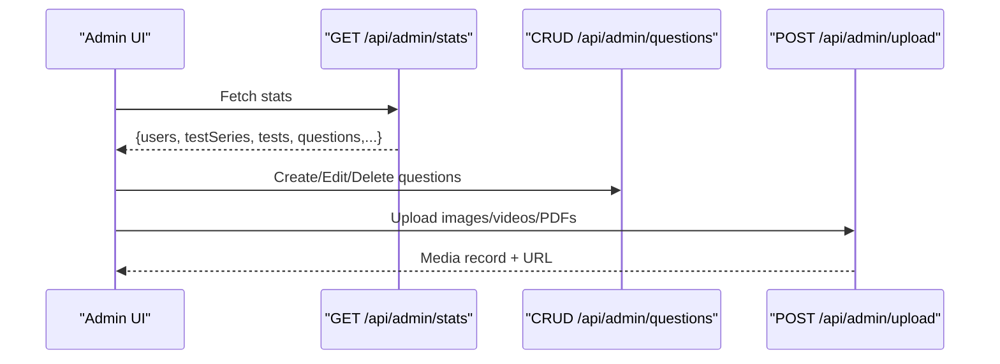
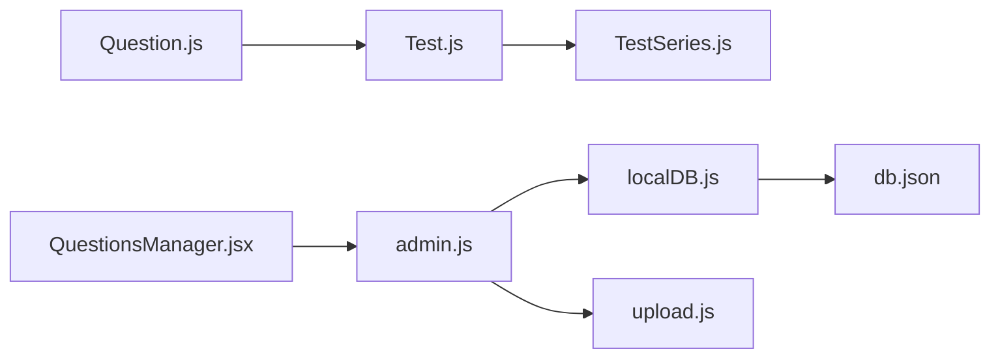

# Question Management

<cite>
**Referenced Files in This Document**
- [Question.js](file://Backend/src/models/Question.js)
- [Test.js](file://Backend/src/models/Test.js)
- [TestSeries.js](file://Backend/src/models/TestSeries.js)
- [admin.js](file://Backend/src/routes/admin.js)
- [localDB.js](file://Backend/src/db/localDB.js)
- [upload.js](file://Backend/src/middleware/upload.js)
- [QuestionsManager.jsx](file://Frontend/src/pages/admin/QuestionsManager.jsx)
- [db.json](file://Backend/data/db.json)
- [QUESTIONS_MANAGER_GUIDE.md](file://Documentation/QUESTIONS_MANAGER_GUIDE.md)
- [DATABASE.md](file://Documentation/DATABASE.md)
</cite>

## Table of Contents
1. [Introduction](#introduction)
2. [Project Structure](#project-structure)
3. [Core Components](#core-components)
4. [Architecture Overview](#architecture-overview)
5. [Detailed Component Analysis](#detailed-component-analysis)
6. [Dependency Analysis](#dependency-analysis)
7. [Performance Considerations](#performance-considerations)
8. [Troubleshooting Guide](#troubleshooting-guide)
9. [Conclusion](#conclusion)
10. [Appendices](#appendices)

## Introduction
This document explains the Question Management system for creating, editing, organizing, and validating questions within test series. It covers:
- Multi-language question support
- Question types and answer validation
- Difficulty classification
- Question editor interface and bulk import/export
- Administrative tools for review and organization
- Backend validation rules and database schema

## Project Structure
The Question Management system spans backend models, routes, and a frontend admin page. The backend uses a local JSON database abstraction for development, with clear separation of concerns:
- Models define question, test, and test series schemas
- Routes expose admin APIs for CRUD and bulk operations
- Frontend admin page provides a form and table for managing questions
- Upload middleware supports media files for embedding

**Diagram sources**
- [Question.js](file://Backend/src/models/Question.js#L1-L54)
- [Test.js](file://Backend/src/models/Test.js#L1-L77)
- [TestSeries.js](file://Backend/src/models/TestSeries.js#L1-L71)
- [admin.js](file://Backend/src/routes/admin.js#L1-L557)
- [localDB.js](file://Backend/src/db/localDB.js#L1-L222)
- [upload.js](file://Backend/src/middleware/upload.js#L1-L91)
- [db.json](file://Backend/data/db.json#L1-L1029)
- [QuestionsManager.jsx](file://Frontend/src/pages/admin/QuestionsManager.jsx#L1-L421)

**Section sources**
- [Question.js](file://Backend/src/models/Question.js#L1-L54)
- [Test.js](file://Backend/src/models/Test.js#L1-L77)
- [TestSeries.js](file://Backend/src/models/TestSeries.js#L1-L71)
- [admin.js](file://Backend/src/routes/admin.js#L117-L168)
- [localDB.js](file://Backend/src/db/localDB.js#L82-L219)
- [upload.js](file://Backend/src/middleware/upload.js#L1-L91)
- [QuestionsManager.jsx](file://Frontend/src/pages/admin/QuestionsManager.jsx#L1-L421)
- [db.json](file://Backend/data/db.json#L388-L443)

## Core Components
- Question model defines fields for multi-language text, options, correct answer, section, explanation, difficulty, and optional image. It includes a compound unique index on testId and questionNumber.
- Test model links questions to a test series and holds metadata like duration, total questions, marks, and tags.
- TestSeries model organizes tests by category and tags.
- Admin routes expose endpoints for listing, creating, updating, deleting questions, and bulk upload.
- Local DB abstraction provides find, insert, update, delete, and count helpers for the local JSON database.
- Upload middleware handles file uploads and generates URLs for media.
- Questions Manager page provides a form for creating/editing questions and a table for listing them, plus CSV bulk upload.

**Section sources**
- [Question.js](file://Backend/src/models/Question.js#L3-L50)
- [Test.js](file://Backend/src/models/Test.js#L3-L78)
- [TestSeries.js](file://Backend/src/models/TestSeries.js#L3-L71)
- [admin.js](file://Backend/src/routes/admin.js#L117-L168)
- [localDB.js](file://Backend/src/db/localDB.js#L82-L219)
- [upload.js](file://Backend/src/middleware/upload.js#L30-L91)
- [QuestionsManager.jsx](file://Frontend/src/pages/admin/QuestionsManager.jsx#L11-L25)

## Architecture Overview
The Question Management flow connects the admin UI to backend routes and the local database. The UI sends requests to create/update/delete questions and bulk upload CSV. The routes validate inputs, persist data, and return structured responses.

**Diagram sources**
- [QuestionsManager.jsx](file://Frontend/src/pages/admin/QuestionsManager.jsx#L59-L95)
- [admin.js](file://Backend/src/routes/admin.js#L127-L168)
- [localDB.js](file://Backend/src/db/localDB.js#L119-L149)
- [upload.js](file://Backend/src/middleware/upload.js#L30-L91)

## Detailed Component Analysis

### Question Model and Validation
The Question model defines the canonical schema for storing questions:
- References a Test via testId
- Enforces questionNumber uniqueness per test
- Supports multi-language text and options
- Validates correctOption as a 0-indexed number within bounds
- Includes difficulty classification and optional image URL

**Diagram sources**
- [Question.js](file://Backend/src/models/Question.js#L3-L50)
- [Test.js](file://Backend/src/models/Test.js#L3-L78)
- [TestSeries.js](file://Backend/src/models/TestSeries.js#L3-L71)

**Section sources**
- [Question.js](file://Backend/src/models/Question.js#L3-L50)
- [Test.js](file://Backend/src/models/Test.js#L3-L78)
- [TestSeries.js](file://Backend/src/models/TestSeries.js#L3-L71)

### Question Editor Interface
The admin UI provides:
- A modal form to create or edit questions
- Required fields: test selection, question text, four options, correct answer radio
- Optional fields: explanation, marks, negative marks, tags
- Bulk upload via CSV with a predefined column order
- Table listing questions with quick actions to edit or delete

**Diagram sources**
- [QuestionsManager.jsx](file://Frontend/src/pages/admin/QuestionsManager.jsx#L22-L57)
- [QuestionsManager.jsx](file://Frontend/src/pages/admin/QuestionsManager.jsx#L59-L95)
- [QuestionsManager.jsx](file://Frontend/src/pages/admin/QuestionsManager.jsx#L127-L159)

**Section sources**
- [QuestionsManager.jsx](file://Frontend/src/pages/admin/QuestionsManager.jsx#L11-L25)
- [QuestionsManager.jsx](file://Frontend/src/pages/admin/QuestionsManager.jsx#L22-L57)
- [QuestionsManager.jsx](file://Frontend/src/pages/admin/QuestionsManager.jsx#L59-L95)
- [QuestionsManager.jsx](file://Frontend/src/pages/admin/QuestionsManager.jsx#L127-L159)
- [QUESTIONS_MANAGER_GUIDE.md](file://Documentation/QUESTIONS_MANAGER_GUIDE.md#L38-L98)

### Bulk Import/Export and CSV Format
- Bulk upload endpoint accepts a CSV payload and inserts multiple questions atomically
- CSV format includes: testId, question, option1, option2, option3, option4, correctAnswer, explanation, marks, negativeMarks, tags
- The UI provides a downloadable template and validation feedback

**Diagram sources**
- [admin.js](file://Backend/src/routes/admin.js#L136-L144)
- [localDB.js](file://Backend/src/db/localDB.js#L135-L149)
- [QuestionsManager.jsx](file://Frontend/src/pages/admin/QuestionsManager.jsx#L127-L159)
- [QUESTIONS_MANAGER_GUIDE.md](file://Documentation/QUESTIONS_MANAGER_GUIDE.md#L135-L157)

**Section sources**
- [admin.js](file://Backend/src/routes/admin.js#L136-L144)
- [QuestionsManager.jsx](file://Frontend/src/pages/admin/QuestionsManager.jsx#L127-L159)
- [QUESTIONS_MANAGER_GUIDE.md](file://Documentation/QUESTIONS_MANAGER_GUIDE.md#L67-L98)

### Image/Video Embedding and Media Library
- Upload middleware supports images, PDFs, and videos with size limits and allowed MIME types
- Uploaded files are stored under uploads/images, uploads/videos, uploads/pdfs
- The media record is persisted to the media collection with metadata and a generated URL
- The question model includes an optional image field for linking media

**Diagram sources**
- [upload.js](file://Backend/src/middleware/upload.js#L30-L91)
- [admin.js](file://Backend/src/routes/admin.js#L242-L272)
- [Question.js](file://Backend/src/models/Question.js#L41-L44)

**Section sources**
- [upload.js](file://Backend/src/middleware/upload.js#L30-L91)
- [admin.js](file://Backend/src/routes/admin.js#L242-L272)
- [Question.js](file://Backend/src/models/Question.js#L41-L44)

### Answer Validation and Question Types
- Single correct answer is supported via correctOption (0-indexed)
- Options are arrays of strings; the correct option is validated against min/max bounds
- Multi-correct question types are not implemented in the current schema

**Diagram sources**
- [Question.js](file://Backend/src/models/Question.js#L22-L27)

**Section sources**
- [Question.js](file://Backend/src/models/Question.js#L22-L27)

### Relationship Between Questions and Test Series
- Questions belong to a Test (via testId)
- Tests belong to a TestSeries (via seriesId)
- This hierarchy ensures questions are organized within a series and test

**Diagram sources**
- [Question.js](file://Backend/src/models/Question.js#L4-L7)
- [Test.js](file://Backend/src/models/Test.js#L4-L7)
- [TestSeries.js](file://Backend/src/models/TestSeries.js#L4-L10)

**Section sources**
- [Question.js](file://Backend/src/models/Question.js#L4-L7)
- [Test.js](file://Backend/src/models/Test.js#L4-L7)
- [TestSeries.js](file://Backend/src/models/TestSeries.js#L4-L10)

### Administrative Tools and Workflows
- Admin dashboard statistics endpoint aggregates counts across entities
- Admin routes provide CRUD for questions, tests, test series, and other entities
- Media upload endpoint integrates with the media library
- Quality assurance workflows:
  - Bulk upload with CSV validation
  - Unique constraint on testId + questionNumber prevents duplicates
  - Difficulty classification enables filtering and reporting

**Diagram sources**
- [admin.js](file://Backend/src/routes/admin.js#L13-L29)
- [admin.js](file://Backend/src/routes/admin.js#L117-L168)
- [admin.js](file://Backend/src/routes/admin.js#L242-L272)

**Section sources**
- [admin.js](file://Backend/src/routes/admin.js#L13-L29)
- [admin.js](file://Backend/src/routes/admin.js#L117-L168)
- [admin.js](file://Backend/src/routes/admin.js#L242-L272)

## Dependency Analysis
- The Question model depends on the Test model via testId
- The Test model depends on the TestSeries model via seriesId
- Admin routes depend on localDB helpers for persistence
- Upload middleware depends on multer and filesystem paths
- The frontend depends on admin routes for data operations

**Diagram sources**
- [Question.js](file://Backend/src/models/Question.js#L4-L7)
- [Test.js](file://Backend/src/models/Test.js#L4-L7)
- [TestSeries.js](file://Backend/src/models/TestSeries.js#L4-L10)
- [admin.js](file://Backend/src/routes/admin.js#L1-L10)
- [localDB.js](file://Backend/src/db/localDB.js#L1-L222)
- [upload.js](file://Backend/src/middleware/upload.js#L1-L91)
- [QuestionsManager.jsx](file://Frontend/src/pages/admin/QuestionsManager.jsx#L1-L421)
- [db.json](file://Backend/data/db.json#L1-L1029)

**Section sources**
- [Question.js](file://Backend/src/models/Question.js#L4-L7)
- [Test.js](file://Backend/src/models/Test.js#L4-L7)
- [TestSeries.js](file://Backend/src/models/TestSeries.js#L4-L10)
- [admin.js](file://Backend/src/routes/admin.js#L1-L10)
- [localDB.js](file://Backend/src/db/localDB.js#L1-L222)
- [upload.js](file://Backend/src/middleware/upload.js#L1-L91)
- [QuestionsManager.jsx](file://Frontend/src/pages/admin/QuestionsManager.jsx#L1-L421)
- [db.json](file://Backend/data/db.json#L1-L1029)

## Performance Considerations
- Local JSON database is suitable for development and small datasets; consider migrating to MongoDB for production scalability
- Compound unique index on testId + questionNumber optimizes lookup and prevents duplicates
- Bulk insert operations reduce round-trips during CSV uploads
- File upload size limits prevent excessive memory usage

[No sources needed since this section provides general guidance]

## Troubleshooting Guide
Common issues and resolutions:
- Duplicate questionNumber within a test: ensure unique numbering per test
- Incorrect correctOption index: must be 0–3 inclusive
- CSV upload errors: verify column order and quoted fields
- Media upload failures: confirm allowed MIME types and file size limits
- Local database not initialized: ensure initDB is called and db.json exists

**Section sources**
- [Question.js](file://Backend/src/models/Question.js#L9-L13)
- [Question.js](file://Backend/src/models/Question.js#L22-L27)
- [admin.js](file://Backend/src/routes/admin.js#L136-L144)
- [upload.js](file://Backend/src/middleware/upload.js#L56-L83)
- [DATABASE.md](file://Documentation/DATABASE.md#L48-L70)

## Conclusion
The Question Management system provides a robust foundation for creating, organizing, and validating questions within test series. It supports multi-language content, single correct answers, difficulty classification, and media embedding. The admin interface streamlines individual and bulk question creation, while backend validation and indexing ensure data integrity. As the platform scales, migrating to MongoDB and adding multi-correct question support would further enhance capabilities.

[No sources needed since this section summarizes without analyzing specific files]

## Appendices

### Database Schema Summary
- questions: testId, questionNumber, text (multi-language), options (multi-language), correctOption, section, explanation, difficulty, image
- tests: seriesId, slug, title, category, subCategory, type, questions, duration, marks, negativeMarking, tags, isLive, liveSchedule, isActive
- testSeries: slug, title, category, description, image, icon, totalTests, freeTests, activeUsers, rating, tags, testTypes, isActive

**Section sources**
- [Question.js](file://Backend/src/models/Question.js#L3-L50)
- [Test.js](file://Backend/src/models/Test.js#L3-L78)
- [TestSeries.js](file://Backend/src/models/TestSeries.js#L3-L71)
- [db.json](file://Backend/data/db.json#L388-L443)

*Last Updated: March 10, 2026 | Update date is (20:16)*
