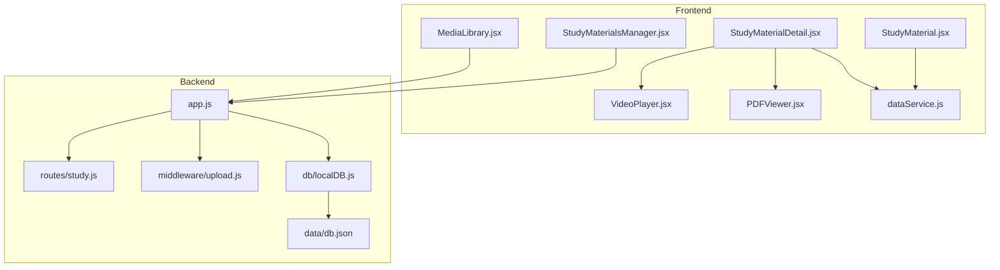
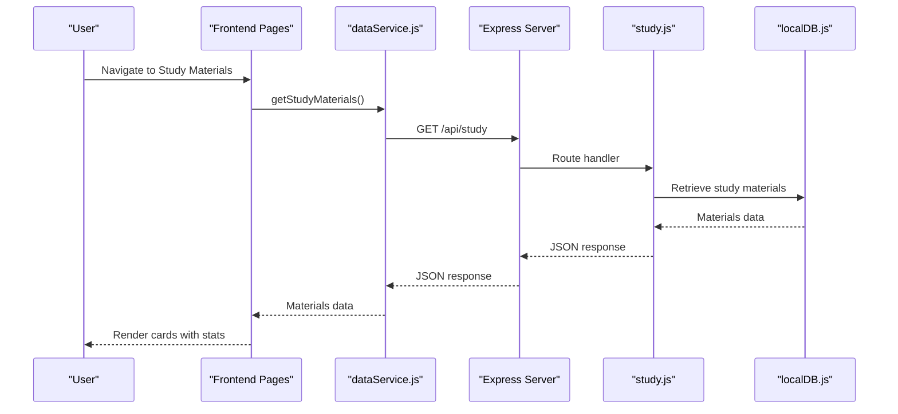
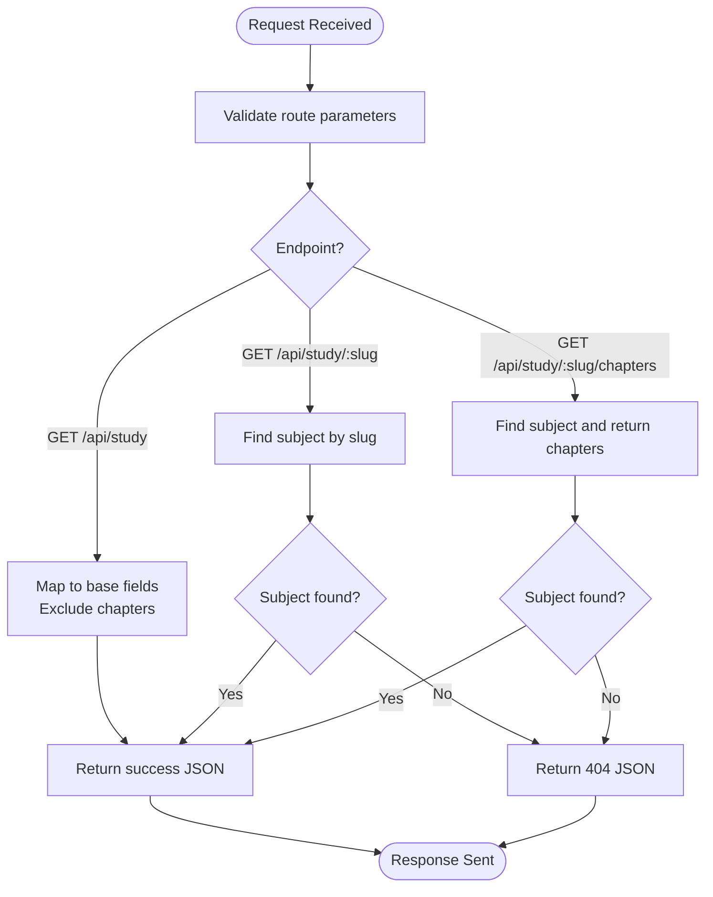
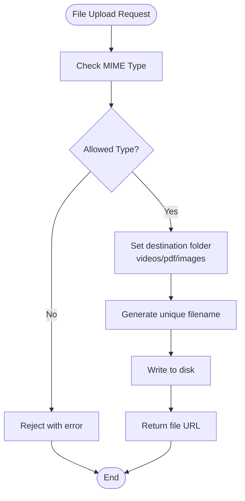
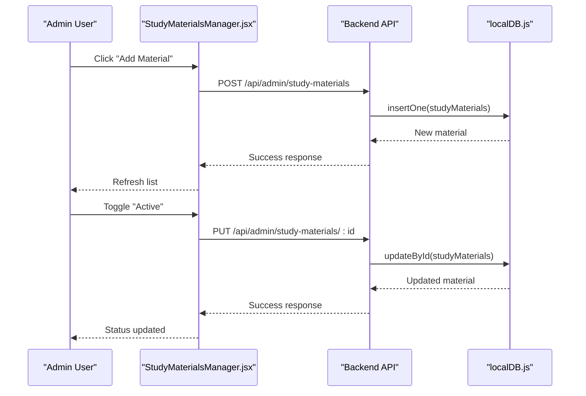
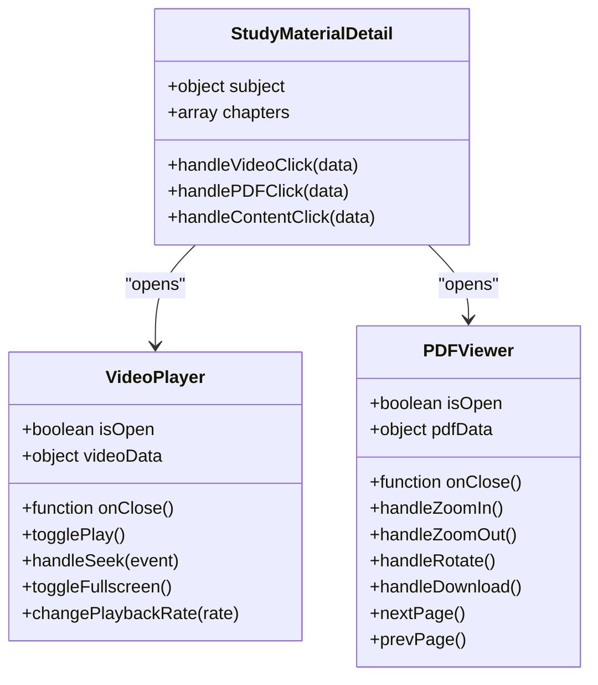
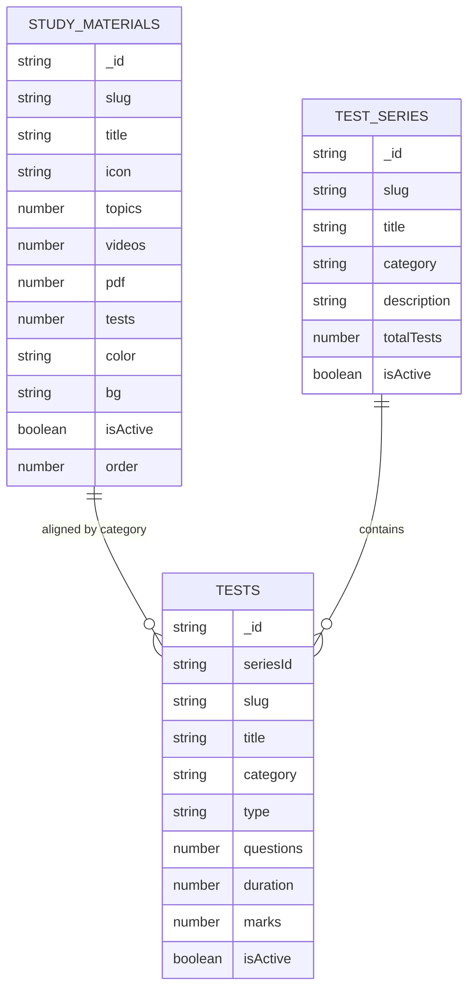
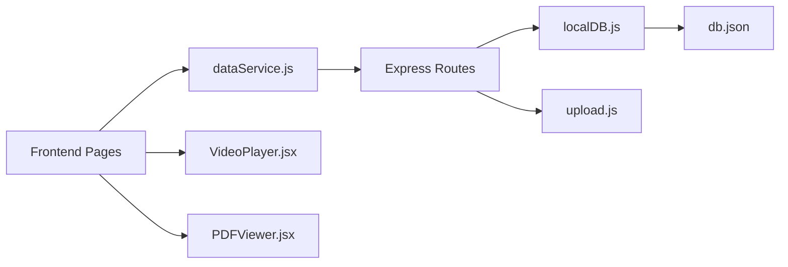

# Study Materials Management

<cite>
**Referenced Files in This Document**
- [study.js](file://Backend/src/routes/study.js)
- [upload.js](file://Backend/src/middleware/upload.js)
- [StudyMaterialsManager.jsx](file://Frontend/src/pages/admin/StudyMaterialsManager.jsx)
- [StudyMaterial.jsx](file://Frontend/src/pages/StudyMaterial.jsx)
- [StudyMaterialDetail.jsx](file://Frontend/src/pages/StudyMaterialDetail.jsx)
- [MediaLibrary.jsx](file://Frontend/src/pages/admin/MediaLibrary.jsx)
- [VideoPlayer.jsx](file://Frontend/src/components/common/VideoPlayer.jsx)
- [PDFViewer.jsx](file://Frontend/src/components/common/PDFViewer.jsx)
- [dataService.js](file://Frontend/src/services/dataService.js)
- [app.js](file://Backend/src/app.js)
- [localDB.js](file://Backend/src/db/localDB.js)
- [db.json](file://Backend/data/db.json)
- [TestSeries.js](file://Backend/src/models/TestSeries.js)
- [Test.js](file://Backend/src/models/Test.js)
- [Question.js](file://Backend/src/models/Question.js)
</cite>

## Table of Contents
1. [Introduction](#introduction)
2. [Project Structure](#project-structure)
3. [Core Components](#core-components)
4. [Architecture Overview](#architecture-overview)
5. [Detailed Component Analysis](#detailed-component-analysis)
6. [Dependency Analysis](#dependency-analysis)
7. [Performance Considerations](#performance-considerations)
8. [Troubleshooting Guide](#troubleshooting-guide)
9. [Conclusion](#conclusion)

## Introduction
This document provides comprehensive documentation for the Study Materials Management system, covering video content, PDF resources, chapter organization, and content delivery mechanisms. It explains the media upload system, file type restrictions, storage integration, and content categorization. The study material creation workflow, chapter-based organization, tagging system, and multi-language support are detailed alongside the content approval process, publishing controls, and integration with test series. Administrative capabilities for managing study resources, bulk content import, and the relationship between study materials and test preparation modules are also covered.

## Project Structure
The system consists of a Node.js/Express backend with a local JSON database and a React frontend. The backend exposes REST APIs for study materials, media management, and administrative functions. The frontend provides user-facing pages for browsing study materials and admin interfaces for managing content.

**Diagram sources**
- [StudyMaterial.jsx](file://Frontend/src/pages/StudyMaterial.jsx#L1-L171)
- [StudyMaterialDetail.jsx](file://Frontend/src/pages/StudyMaterialDetail.jsx#L1-L339)
- [StudyMaterialsManager.jsx](file://Frontend/src/pages/admin/StudyMaterialsManager.jsx#L1-L539)
- [MediaLibrary.jsx](file://Frontend/src/pages/admin/MediaLibrary.jsx#L1-L154)
- [VideoPlayer.jsx](file://Frontend/src/components/common/VideoPlayer.jsx#L1-L322)
- [PDFViewer.jsx](file://Frontend/src/components/common/PDFViewer.jsx#L1-L182)
- [dataService.js](file://Frontend/src/services/dataService.js#L1-L172)
- [app.js](file://Backend/src/app.js#L1-L94)
- [study.js](file://Backend/src/routes/study.js#L1-L137)
- [upload.js](file://Backend/src/middleware/upload.js#L1-L91)
- [localDB.js](file://Backend/src/db/localDB.js#L1-L222)
- [db.json](file://Backend/data/db.json#L1-L1029)

**Section sources**
- [app.js](file://Backend/src/app.js#L1-L94)
- [localDB.js](file://Backend/src/db/localDB.js#L1-L222)
- [db.json](file://Backend/data/db.json#L1-L1029)

## Core Components
- Study Materials API: Provides endpoints to list subjects, fetch individual subjects, and retrieve chapters.
- Media Upload System: Handles secure file uploads with type filtering, size limits, and organized storage.
- Admin Management: Enables CRUD operations for study materials, activation/deactivation, ordering, and soft deletion.
- Content Delivery: Renders study materials with icons, stats, and integrates with video and PDF viewers.
- Test Series Integration: Links study materials to test preparation modules via shared categories and tags.

**Section sources**
- [study.js](file://Backend/src/routes/study.js#L65-L134)
- [upload.js](file://Backend/src/middleware/upload.js#L55-L83)
- [StudyMaterialsManager.jsx](file://Frontend/src/pages/admin/StudyMaterialsManager.jsx#L29-L172)
- [StudyMaterial.jsx](file://Frontend/src/pages/StudyMaterial.jsx#L12-L57)
- [StudyMaterialDetail.jsx](file://Frontend/src/pages/StudyMaterialDetail.jsx#L38-L43)

## Architecture Overview
The system follows a layered architecture:
- Presentation Layer: React components for user and admin interfaces.
- Service Layer: Frontend data service for centralized API communication.
- Application Layer: Express routes for study materials and media operations.
- Persistence Layer: Local JSON database with helper functions for CRUD operations.

**Diagram sources**
- [StudyMaterial.jsx](file://Frontend/src/pages/StudyMaterial.jsx#L12-L19)
- [dataService.js](file://Frontend/src/services/dataService.js#L66-L71)
- [study.js](file://Backend/src/routes/study.js#L65-L81)
- [localDB.js](file://Backend/src/db/localDB.js#L84-L103)

## Detailed Component Analysis

### Study Materials API
The study materials API provides three primary endpoints:
- GET /api/study: Returns all subjects with chapter counts excluded.
- GET /api/study/:slug: Returns a specific subject by slug.
- GET /api/study/:slug/chapters: Returns chapters for a subject.

Processing logic includes:
- Data retrieval from the in-memory array for demonstration.
- Proper error handling with 404 for missing subjects.
- Structured JSON responses with success flags.

**Diagram sources**
- [study.js](file://Backend/src/routes/study.js#L65-L134)

**Section sources**
- [study.js](file://Backend/src/routes/study.js#L65-L134)

### Media Upload System
The upload middleware configures:
- Destination routing based on MIME type (videos, PDFs, images).
- Unique filename generation using timestamp and random suffix.
- File type filtering for allowed MIME types.
- Size limit enforcement (500 MB).
- Static file serving for uploaded content.

**Diagram sources**
- [upload.js](file://Backend/src/middleware/upload.js#L31-L83)

**Section sources**
- [upload.js](file://Backend/src/middleware/upload.js#L10-L91)
- [app.js](file://Backend/src/app.js#L38-L39)

### Study Materials Admin Interface
The admin interface supports:
- Listing materials with display order, resource counts, and status.
- Creating, updating, and deleting materials.
- Enabling/disabling materials and soft deletion with restore capability.
- Reordering materials via up/down buttons.
- Filtering between active and trashed items.

**Diagram sources**
- [StudyMaterialsManager.jsx](file://Frontend/src/pages/admin/StudyMaterialsManager.jsx#L50-L87)
- [StudyMaterialsManager.jsx](file://Frontend/src/pages/admin/StudyMaterialsManager.jsx#L89-L109)
- [localDB.js](file://Backend/src/db/localDB.js#L119-L133)
- [localDB.js](file://Backend/src/db/localDB.js#L170-L185)

**Section sources**
- [StudyMaterialsManager.jsx](file://Frontend/src/pages/admin/StudyMaterialsManager.jsx#L1-L539)
- [db.json](file://Backend/data/db.json#L446-L514)

### Content Delivery and Viewer Components
The frontend provides integrated viewers:
- VideoPlayer: Full-featured HTML5 video player with playback controls, fullscreen, and speed settings.
- PDFViewer: Embedded PDF viewer with zoom, rotation, page navigation, and download.

**Diagram sources**
- [VideoPlayer.jsx](file://Frontend/src/components/common/VideoPlayer.jsx#L1-L322)
- [PDFViewer.jsx](file://Frontend/src/components/common/PDFViewer.jsx#L1-L182)
- [StudyMaterialDetail.jsx](file://Frontend/src/pages/StudyMaterialDetail.jsx#L45-L84)

**Section sources**
- [StudyMaterialDetail.jsx](file://Frontend/src/pages/StudyMaterialDetail.jsx#L1-L339)
- [VideoPlayer.jsx](file://Frontend/src/components/common/VideoPlayer.jsx#L1-L322)
- [PDFViewer.jsx](file://Frontend/src/components/common/PDFViewer.jsx#L1-L182)

### Test Series Integration
Study materials integrate with test preparation through:
- Shared categories (e.g., SSC, Railway) aligning content with exam-specific test series.
- Tagging system supporting cross-referencing between materials and tests.
- Test models with categories, types, and difficulty levels.

**Diagram sources**
- [db.json](file://Backend/data/db.json#L446-L514)
- [db.json](file://Backend/data/db.json#L37-L98)
- [db.json](file://Backend/data/db.json#L100-L386)
- [TestSeries.js](file://Backend/src/models/TestSeries.js#L1-L71)
- [Test.js](file://Backend/src/models/Test.js#L1-L77)

**Section sources**
- [db.json](file://Backend/data/db.json#L37-L98)
- [db.json](file://Backend/data/db.json#L100-L386)
- [TestSeries.js](file://Backend/src/models/TestSeries.js#L1-L71)
- [Test.js](file://Backend/src/models/Test.js#L1-L77)

## Dependency Analysis
The system exhibits clear separation of concerns:
- Frontend depends on dataService for API communication.
- Backend routes depend on localDB helpers for persistence.
- Media upload middleware is reusable across admin endpoints.
- Test models define relationships with study materials via categories and tags.

**Diagram sources**
- [dataService.js](file://Frontend/src/services/dataService.js#L1-L172)
- [app.js](file://Backend/src/app.js#L56-L66)
- [localDB.js](file://Backend/src/db/localDB.js#L1-L222)
- [db.json](file://Backend/data/db.json#L1-L1029)
- [upload.js](file://Backend/src/middleware/upload.js#L1-L91)

**Section sources**
- [dataService.js](file://Frontend/src/services/dataService.js#L1-L172)
- [app.js](file://Backend/src/app.js#L56-L66)
- [localDB.js](file://Backend/src/db/localDB.js#L1-L222)

## Performance Considerations
- Caching: The data service caches study materials for 5 seconds to reduce API calls.
- Static Serving: Uploaded files are served statically to minimize server load.
- Pagination: Consider implementing pagination for large datasets in future enhancements.
- CDN: For production, serve media files via CDN to improve global delivery.

[No sources needed since this section provides general guidance]

## Troubleshooting Guide
Common issues and resolutions:
- Upload failures: Verify MIME type compliance and file size under 500 MB.
- 404 on study material: Ensure slug matches existing records.
- CORS errors: Confirm frontend URL matches backend CORS configuration.
- Database initialization: Ensure local JSON database is properly initialized.

**Section sources**
- [upload.js](file://Backend/src/middleware/upload.js#L55-L83)
- [study.js](file://Backend/src/routes/study.js#L86-L106)
- [app.js](file://Backend/src/app.js#L28-L32)
- [localDB.js](file://Backend/src/db/localDB.js#L48-L73)

## Conclusion
The Study Materials Management system provides a robust foundation for organizing educational content across subjects, chapters, and multimedia formats. Its modular design enables easy administration, scalable content delivery, and seamless integration with test preparation modules. Future enhancements could include cloud storage integration, advanced tagging, and bulk import capabilities.

*Last Updated: March 10, 2026 | Update date is (20:16)*
