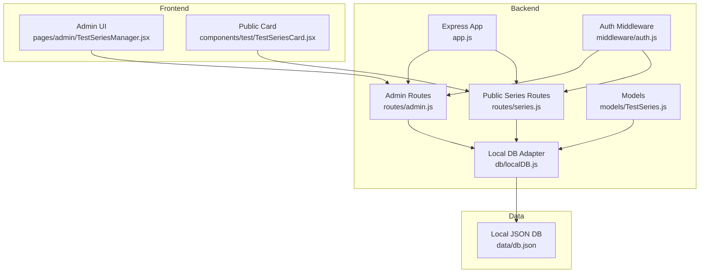
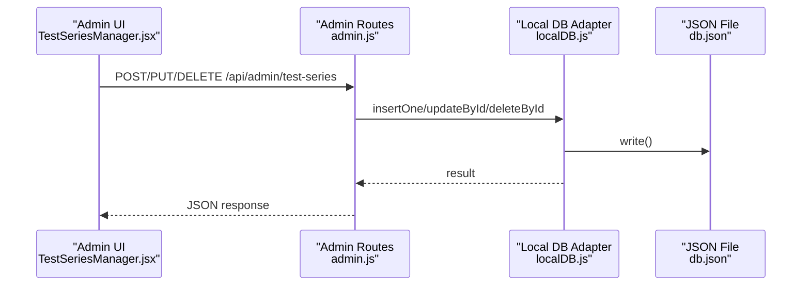
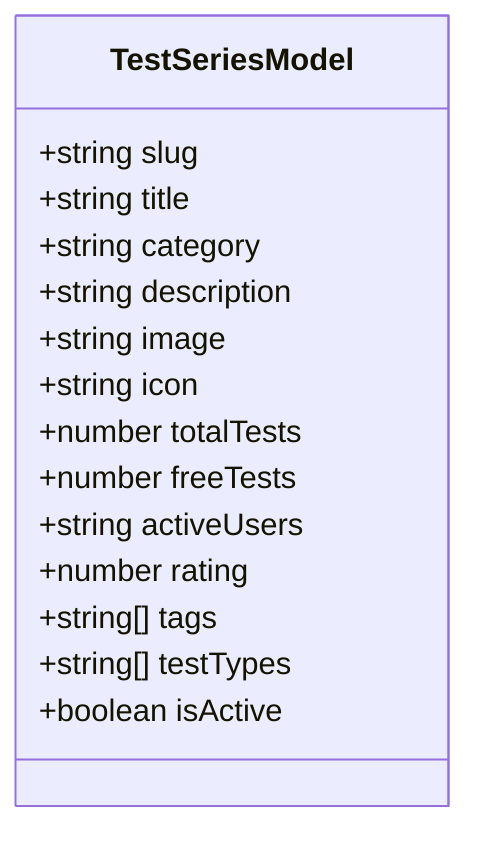
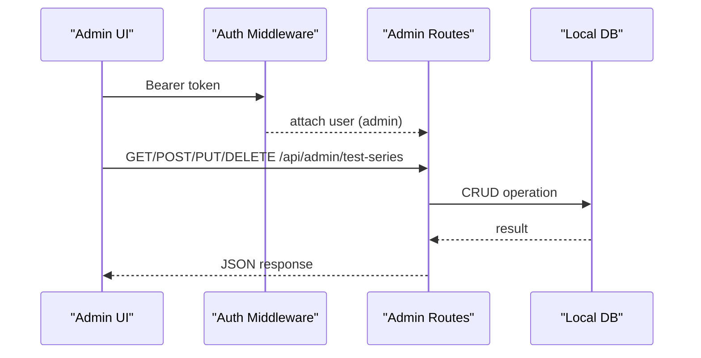
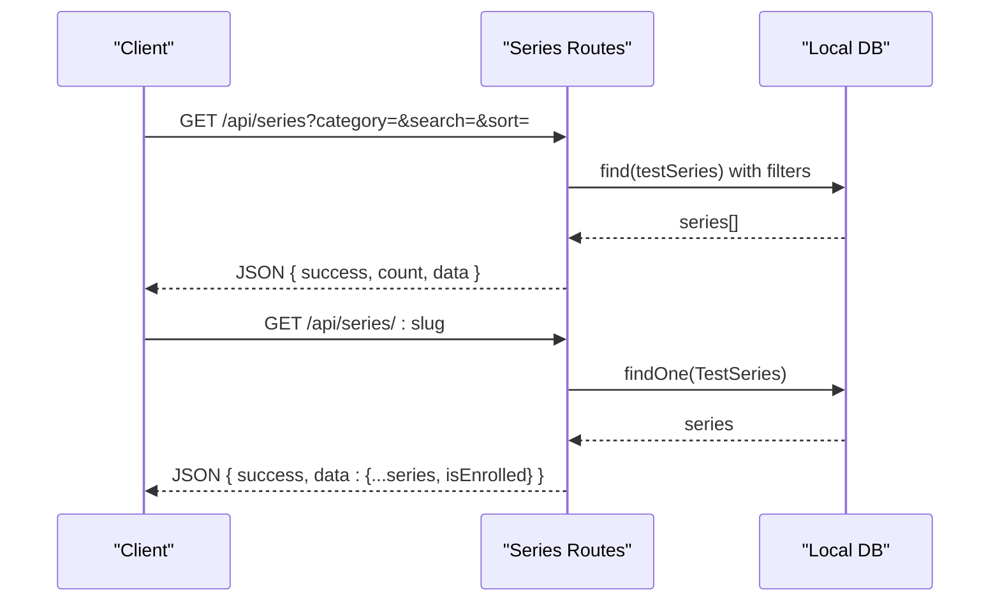
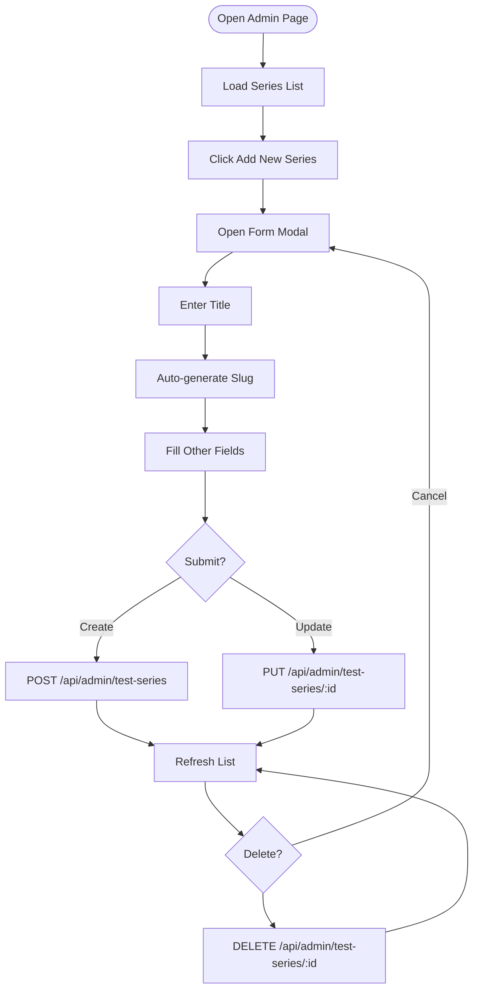
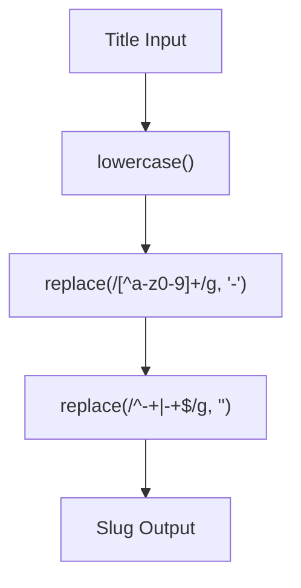
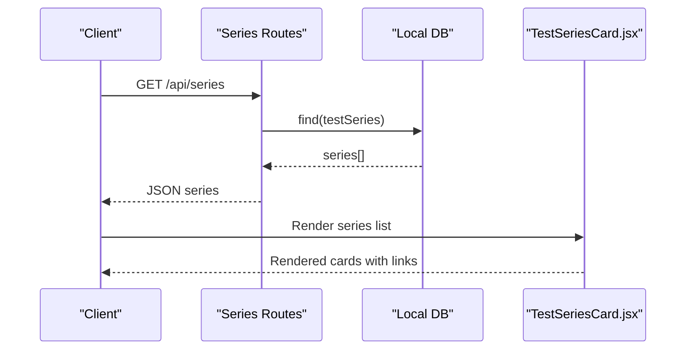
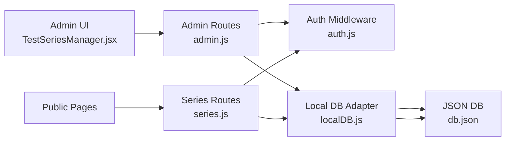

# Test Series Management

<cite>
**Referenced Files in This Document**
- [TestSeries.js](file://Backend/src/models/TestSeries.js)
- [series.js](file://Backend/src/routes/series.js)
- [admin.js](file://Backend/src/routes/admin.js)
- [localDB.js](file://Backend/src/db/localDB.js)
- [auth.js](file://Backend/src/middleware/auth.js)
- [app.js](file://Backend/src/app.js)
- [TestSeriesManager.jsx](file://Frontend/src/pages/admin/TestSeriesManager.jsx)
- [TestSeriesCard.jsx](file://Frontend/src/components/test/TestSeriesCard.jsx)
- [SLUG_GUIDE.md](file://Documentation/SLUG_GUIDE.md)
- [db.json](file://Backend/data/db.json)
</cite>

## Table of Contents
1. [Introduction](#introduction)
2. [Project Structure](#project-structure)
3. [Core Components](#core-components)
4. [Architecture Overview](#architecture-overview)
5. [Detailed Component Analysis](#detailed-component-analysis)
6. [Dependency Analysis](#dependency-analysis)
7. [Performance Considerations](#performance-considerations)
8. [Troubleshooting Guide](#troubleshooting-guide)
9. [Conclusion](#conclusion)

## Introduction
This document explains the Test Series Management system in Trstprep V2. It covers the complete CRUD lifecycle for test series, including creation, editing, deletion, and activation/deactivation. It documents the administrative interface workflow, form fields, slug generation algorithm, category-based filtering, and the backend API endpoints. It also outlines the frontend integration for displaying test series and provides guidance on bulk operations and soft-delete considerations.

## Project Structure
The system spans a Node.js/Express backend with a local JSON database and a React frontend. Administrative operations are protected and exposed via dedicated admin routes. Public consumers (students) access series and tests through public routes.

**Diagram sources**
- [app.js](file://Backend/src/app.js#L56-L67)
- [admin.js](file://Backend/src/routes/admin.js#L1-L11)
- [series.js](file://Backend/src/routes/series.js#L1-L162)
- [auth.js](file://Backend/src/middleware/auth.js#L1-L92)
- [localDB.js](file://Backend/src/db/localDB.js#L1-L222)
- [TestSeries.js](file://Backend/src/models/TestSeries.js#L1-L71)
- [TestSeriesManager.jsx](file://Frontend/src/pages/admin/TestSeriesManager.jsx#L1-L424)
- [TestSeriesCard.jsx](file://Frontend/src/components/test/TestSeriesCard.jsx#L1-L109)
- [db.json](file://Backend/data/db.json#L1-L1029)

**Section sources**
- [app.js](file://Backend/src/app.js#L56-L67)
- [admin.js](file://Backend/src/routes/admin.js#L1-L11)
- [series.js](file://Backend/src/routes/series.js#L1-L162)
- [auth.js](file://Backend/src/middleware/auth.js#L1-L92)
- [localDB.js](file://Backend/src/db/localDB.js#L1-L222)
- [TestSeries.js](file://Backend/src/models/TestSeries.js#L1-L71)
- [TestSeriesManager.jsx](file://Frontend/src/pages/admin/TestSeriesManager.jsx#L1-L424)
- [TestSeriesCard.jsx](file://Frontend/src/components/test/TestSeriesCard.jsx#L1-L109)
- [db.json](file://Backend/data/db.json#L1-L1029)

## Core Components
- Backend models define the schema for test series and tests, including indexes and enums.
- Admin routes expose CRUD endpoints for test series under an admin-protected pipeline.
- Public series routes support listing, filtering, and retrieving series and tests.
- Local database adapter provides CRUD helpers for JSON-backed persistence.
- Frontend admin page manages test series via forms and displays a table.
- Frontend card component renders series entries on public pages.

Key responsibilities:
- Model layer: enforce schema, defaults, enums, and indexes.
- Admin routes: protect with auth and admin middleware; delegate to local DB helpers.
- Public routes: filter by active state, support category and search filters, and sort series.
- Frontend admin: build forms, auto-generate slugs, submit to admin endpoints.
- Frontend public: render cards and link to series detail pages.

**Section sources**
- [TestSeries.js](file://Backend/src/models/TestSeries.js#L1-L71)
- [admin.js](file://Backend/src/routes/admin.js#L31-L72)
- [series.js](file://Backend/src/routes/series.js#L8-L162)
- [localDB.js](file://Backend/src/db/localDB.js#L82-L222)
- [TestSeriesManager.jsx](file://Frontend/src/pages/admin/TestSeriesManager.jsx#L1-L424)
- [TestSeriesCard.jsx](file://Frontend/src/components/test/TestSeriesCard.jsx#L1-L109)

## Architecture Overview
The system follows a layered architecture:
- Presentation: React admin UI and public pages.
- Application: Express routes and middleware.
- Domain: Mongoose-like model definitions (schema enforcement).
- Persistence: Local JSON database via lowdb adapter.

**Diagram sources**
- [TestSeriesManager.jsx](file://Frontend/src/pages/admin/TestSeriesManager.jsx#L44-L79)
- [admin.js](file://Backend/src/routes/admin.js#L41-L72)
- [localDB.js](file://Backend/src/db/localDB.js#L119-L213)
- [db.json](file://Backend/data/db.json#L1-L1029)

## Detailed Component Analysis

### Backend Data Model: TestSeries
The model defines fields for slug, title, category, description, image/icon, counts, ratings, tags, test types, and activation flag. Indexes are created for category and isActive to optimize queries.

**Diagram sources**
- [TestSeries.js](file://Backend/src/models/TestSeries.js#L3-L67)

**Section sources**
- [TestSeries.js](file://Backend/src/models/TestSeries.js#L1-L71)

### Admin CRUD Endpoints
Protected under admin middleware, the endpoints support:
- List all series
- Create a series
- Update a series by ID
- Delete a series by ID

**Diagram sources**
- [admin.js](file://Backend/src/routes/admin.js#L8-L10)
- [auth.js](file://Backend/src/middleware/auth.js#L69-L78)
- [admin.js](file://Backend/src/routes/admin.js#L32-L72)
- [localDB.js](file://Backend/src/db/localDB.js#L82-L222)

**Section sources**
- [admin.js](file://Backend/src/routes/admin.js#L31-L72)
- [auth.js](file://Backend/src/middleware/auth.js#L69-L78)
- [localDB.js](file://Backend/src/db/localDB.js#L82-L222)

### Public Series and Tests Endpoints
Public routes enable:
- Listing series with category and search filters, and sorting by popularity/rating/tests/newest.
- Retrieving a single series by slug with enrollment status for authenticated users.
- Fetching tests within a series filtered by category, subcategory, and type.

**Diagram sources**
- [series.js](file://Backend/src/routes/series.js#L8-L93)
- [localDB.js](file://Backend/src/db/localDB.js#L82-L117)

**Section sources**
- [series.js](file://Backend/src/routes/series.js#L8-L162)

### Frontend Admin Workflow
The admin page provides:
- A form with fields for title, slug, category, subcategory, difficulty, description, total tests, price, tags, pro-only, and active status.
- Auto-generation of slug from title with a live preview.
- Submitting to admin endpoints for create or update.
- Deleting series with confirmation.
- Listing all series in a responsive table.

**Diagram sources**
- [TestSeriesManager.jsx](file://Frontend/src/pages/admin/TestSeriesManager.jsx#L23-L127)
- [admin.js](file://Backend/src/routes/admin.js#L41-L72)

**Section sources**
- [TestSeriesManager.jsx](file://Frontend/src/pages/admin/TestSeriesManager.jsx#L1-L424)
- [SLUG_GUIDE.md](file://Documentation/SLUG_GUIDE.md#L1-L119)

### Slug Generation Algorithm
The frontend auto-generates slugs from titles using a deterministic pattern:
- Convert to lowercase.
- Replace non-alphanumeric sequences with a hyphen.
- Trim leading/trailing hyphens.
- Allow manual override in the form.

**Diagram sources**
- [TestSeriesManager.jsx](file://Frontend/src/pages/admin/TestSeriesManager.jsx#L174-L184)
- [SLUG_GUIDE.md](file://Documentation/SLUG_GUIDE.md#L21-L27)

**Section sources**
- [TestSeriesManager.jsx](file://Frontend/src/pages/admin/TestSeriesManager.jsx#L174-L184)
- [SLUG_GUIDE.md](file://Documentation/SLUG_GUIDE.md#L1-L119)

### Category-Based Filtering and Sorting
Public series listing supports:
- Category filter (excluding “all”).
- Text search on title.
- Sorting by popularity (activeUsers), rating, total tests, or newest.

**Section sources**
- [series.js](file://Backend/src/routes/series.js#L13-L38)

### Soft Delete Mechanism
The local database adapter does not implement soft deletes. Deletion removes documents permanently. If soft delete is desired, add an isActive flag to the model and filter by it in queries.

**Section sources**
- [localDB.js](file://Backend/src/db/localDB.js#L202-L213)
- [TestSeries.js](file://Backend/src/models/TestSeries.js#L57-L60)

### Bulk Operations
Bulk operations are supported for questions via a dedicated endpoint. For test series, bulk creation would require adding a similar endpoint in the admin routes and implementing batch inserts in the local DB adapter.

**Section sources**
- [admin.js](file://Backend/src/routes/admin.js#L136-L144)
- [localDB.js](file://Backend/src/db/localDB.js#L135-L149)

### Frontend Integration: Public Display
The public card component renders series entries with category, stats, test types, and CTA buttons. It links to series detail pages using the series identifier.

**Diagram sources**
- [series.js](file://Backend/src/routes/series.js#L11-L53)
- [localDB.js](file://Backend/src/db/localDB.js#L82-L103)
- [TestSeriesCard.jsx](file://Frontend/src/components/test/TestSeriesCard.jsx#L21-L105)

**Section sources**
- [TestSeriesCard.jsx](file://Frontend/src/components/test/TestSeriesCard.jsx#L1-L109)

## Dependency Analysis
- Admin routes depend on auth middleware for protection and local DB helpers for persistence.
- Public series routes depend on local DB helpers and optional auth for enrollment checks.
- Models define schema and indexes; they are consumed by routes indirectly via the local DB adapter.
- Frontend admin depends on admin routes; frontend public depends on public series routes.

**Diagram sources**
- [TestSeriesManager.jsx](file://Frontend/src/pages/admin/TestSeriesManager.jsx#L1-L424)
- [admin.js](file://Backend/src/routes/admin.js#L1-L11)
- [series.js](file://Backend/src/routes/series.js#L1-L162)
- [auth.js](file://Backend/src/middleware/auth.js#L1-L92)
- [localDB.js](file://Backend/src/db/localDB.js#L1-L222)
- [db.json](file://Backend/data/db.json#L1-L1029)

**Section sources**
- [admin.js](file://Backend/src/routes/admin.js#L1-L11)
- [series.js](file://Backend/src/routes/series.js#L1-L162)
- [auth.js](file://Backend/src/middleware/auth.js#L1-L92)
- [localDB.js](file://Backend/src/db/localDB.js#L1-L222)
- [db.json](file://Backend/data/db.json#L1-L1029)

## Performance Considerations
- Indexes: Category and isActive indexing improve filtering and retrieval performance.
- Sorting: Sorting by activeUsers, rating, totalTests, or createdAt is supported; consider adding compound indexes for frequent query patterns.
- Pagination: For large datasets, implement pagination in routes to limit response sizes.
- Caching: Consider caching frequently accessed series listings with appropriate invalidation.

[No sources needed since this section provides general guidance]

## Troubleshooting Guide
Common issues and resolutions:
- Authentication failures: Ensure a valid Bearer token is included in admin requests.
- Admin access denied: Confirm the user role is admin.
- Series not found: Verify the series ID and that the record exists in the local database.
- Slug conflicts: Ensure unique slugs; the frontend auto-generates slugs but allows overrides.
- Local DB not initialized: Confirm the database initialization logs and that the JSON file exists.

**Section sources**
- [auth.js](file://Backend/src/middleware/auth.js#L5-L44)
- [admin.js](file://Backend/src/routes/admin.js#L62-L72)
- [localDB.js](file://Backend/src/db/localDB.js#L48-L73)
- [app.js](file://Backend/src/app.js#L69-L78)

## Conclusion
The Test Series Management system integrates a protected admin interface with robust public endpoints, a flexible schema supporting categories and tags, and a straightforward slug generation workflow. While the current implementation uses a local JSON database without soft deletes, the architecture supports migration to a relational or document database and extension for bulk operations and advanced filtering.

*Last Updated: March 10, 2026 | Update date is (20:16)*
