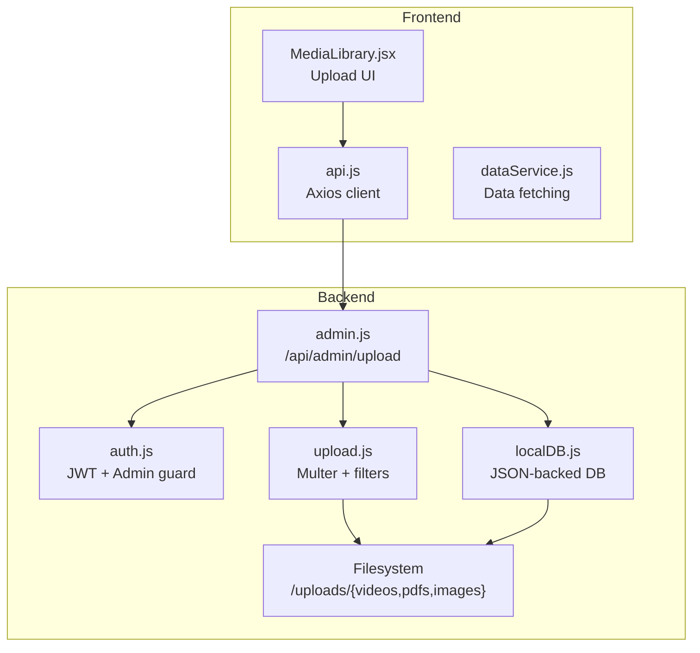
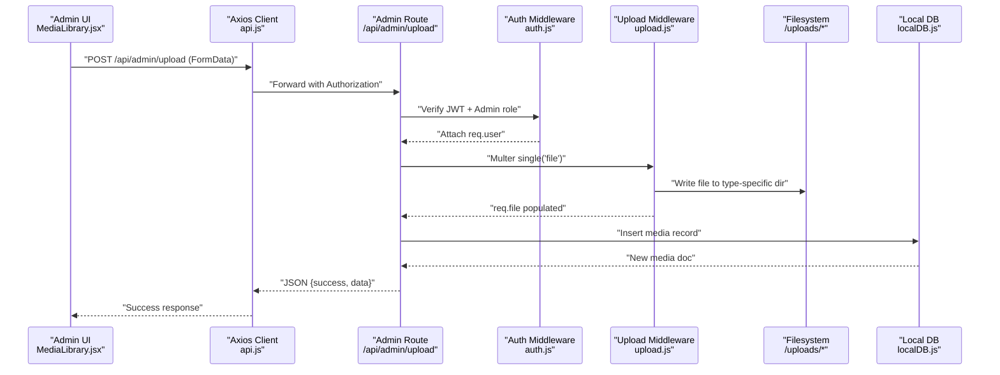
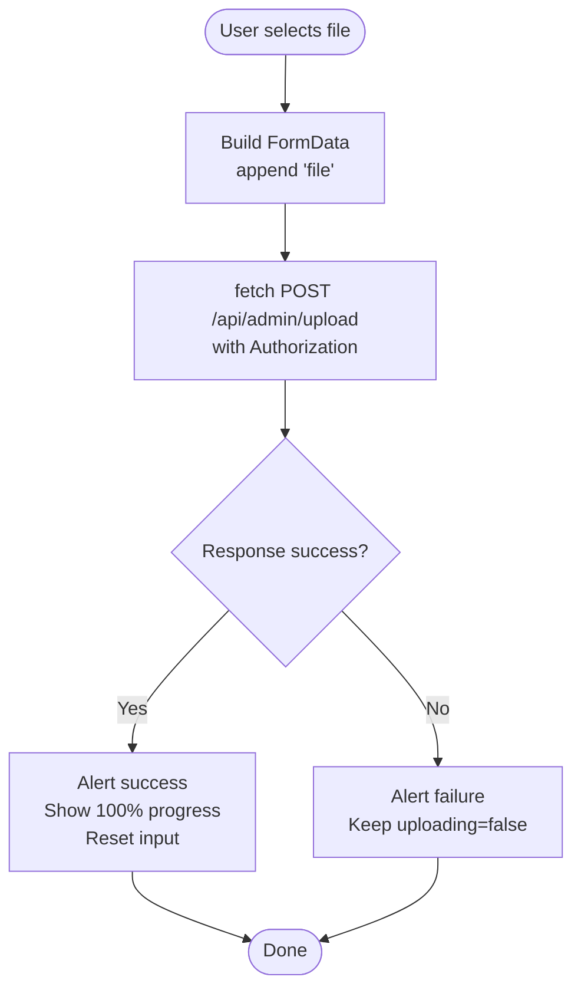
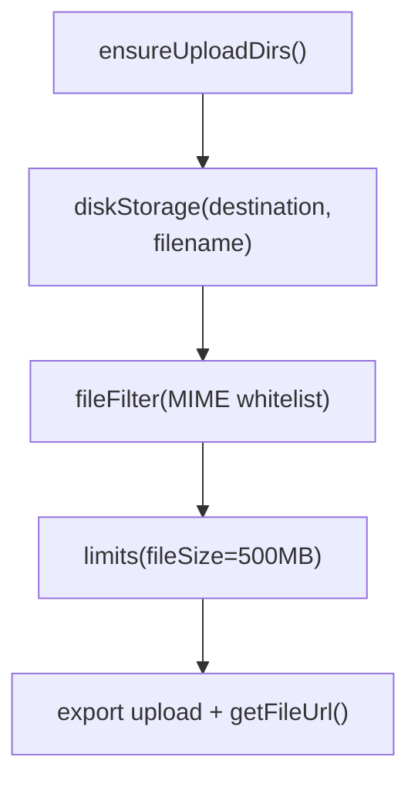
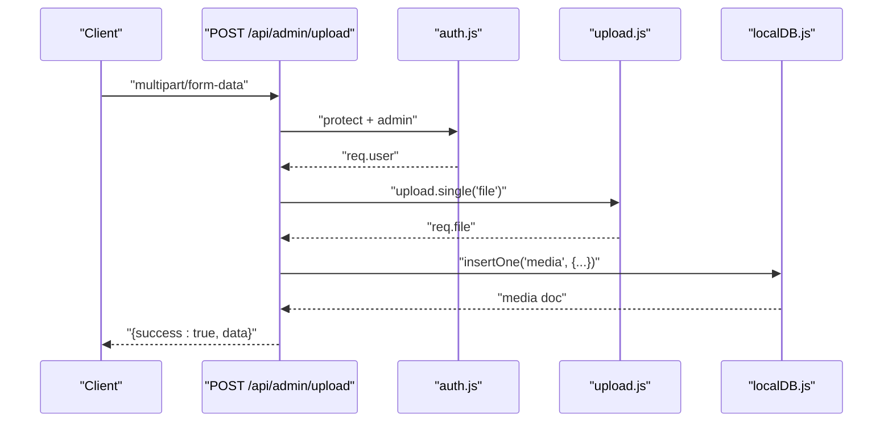
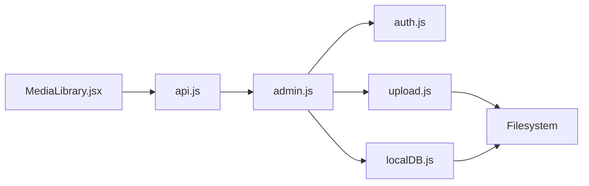

# Media Library

<cite>
**Referenced Files in This Document**
- [MediaLibrary.jsx](file://Frontend/src/pages/admin/MediaLibrary.jsx)
- [upload.js](file://Backend/src/middleware/upload.js)
- [admin.js](file://Backend/src/routes/admin.js)
- [db.json](file://Backend/data/db.json)
- [localDB.js](file://Backend/src/db/localDB.js)
- [auth.js](file://Backend/src/middleware/auth.js)
- [errorHandler.js](file://Backend/src/middleware/errorHandler.js)
- [api.js](file://Frontend/src/services/api.js)
- [dataService.js](file://Frontend/src/services/dataService.js)
</cite>

## Table of Contents
1. [Introduction](#introduction)
2. [Project Structure](#project-structure)
3. [Core Components](#core-components)
4. [Architecture Overview](#architecture-overview)
5. [Detailed Component Analysis](#detailed-component-analysis)
6. [Dependency Analysis](#dependency-analysis)
7. [Performance Considerations](#performance-considerations)
8. [Troubleshooting Guide](#troubleshooting-guide)
9. [Conclusion](#conclusion)

## Introduction
This document describes the Media Library management system in Trstprep V2. It covers the file upload interface, supported file formats (images, videos, PDFs), media organization, validation and size limits, security controls, and integration with content creation workflows. It also explains how uploaded media is stored, categorized, and associated with study materials and questions.

## Project Structure
The Media Library spans the frontend and backend:
- Frontend: Provides the upload UI and handles progress feedback.
- Backend: Validates and stores files, organizes them by type, persists metadata, and exposes admin APIs.

**Diagram sources**
- [MediaLibrary.jsx](file://Frontend/src/pages/admin/MediaLibrary.jsx#L1-L154)
- [api.js](file://Frontend/src/services/api.js#L1-L92)
- [dataService.js](file://Frontend/src/services/dataService.js#L1-L172)
- [auth.js](file://Backend/src/middleware/auth.js#L1-L92)
- [upload.js](file://Backend/src/middleware/upload.js#L1-L91)
- [admin.js](file://Backend/src/routes/admin.js#L242-L272)
- [localDB.js](file://Backend/src/db/localDB.js#L1-L222)

**Section sources**
- [MediaLibrary.jsx](file://Frontend/src/pages/admin/MediaLibrary.jsx#L1-L154)
- [upload.js](file://Backend/src/middleware/upload.js#L1-L91)
- [admin.js](file://Backend/src/routes/admin.js#L242-L272)
- [localDB.js](file://Backend/src/db/localDB.js#L1-L222)

## Core Components
- Media upload UI: Accepts files, enforces accepted types, and shows progress.
- Upload middleware: Creates upload directories, validates MIME types, enforces size limits, and generates unique filenames.
- Admin upload endpoint: Saves media metadata to the database and returns the stored record.
- Authentication and authorization: Ensures only admins can upload via bearer tokens.
- Database persistence: Stores media records with filename, original name, MIME type, size, URL path, and type classification.

Key capabilities:
- Supported formats: Images (JPG, PNG, GIF, WebP), PDFs, Videos (MP4, WebM, MKV)
- Size limit: 500 MB
- Organization: Files stored under /uploads/{videos,pdfs,images}
- Metadata: filename, originalName, mimeType, size, url, fileType, uploadedBy

**Section sources**
- [MediaLibrary.jsx](file://Frontend/src/pages/admin/MediaLibrary.jsx#L60-L101)
- [upload.js](file://Backend/src/middleware/upload.js#L55-L83)
- [admin.js](file://Backend/src/routes/admin.js#L242-L272)
- [localDB.js](file://Backend/src/db/localDB.js#L119-L133)
- [db.json](file://Backend/data/db.json#L545-L557)

## Architecture Overview
End-to-end upload flow from UI to storage and persistence.

**Diagram sources**
- [MediaLibrary.jsx](file://Frontend/src/pages/admin/MediaLibrary.jsx#L9-L49)
- [api.js](file://Frontend/src/services/api.js#L12-L24)
- [admin.js](file://Backend/src/routes/admin.js#L242-L272)
- [auth.js](file://Backend/src/middleware/auth.js#L5-L44)
- [upload.js](file://Backend/src/middleware/upload.js#L77-L83)
- [localDB.js](file://Backend/src/db/localDB.js#L119-L133)

## Detailed Component Analysis

### Upload UI (MediaLibrary.jsx)
Responsibilities:
- Accepts files with accept="video/*,application/pdf,image/*"
- Builds FormData and sends to /api/admin/upload
- Reads Authorization token from localStorage and attaches Bearer header
- Shows progress bar during upload
- Displays success/failure alerts and resets form on completion

Supported formats and limits shown in UI:
- Videos: MP4, WebM, MKV
- PDFs
- Images: JPG, PNG, GIF, WebP
- Max size: 500 MB

**Diagram sources**
- [MediaLibrary.jsx](file://Frontend/src/pages/admin/MediaLibrary.jsx#L9-L49)

**Section sources**
- [MediaLibrary.jsx](file://Frontend/src/pages/admin/MediaLibrary.jsx#L60-L101)

### Upload Middleware (upload.js)
Responsibilities:
- Ensures upload directories exist (/uploads, /uploads/videos, /uploads/pdfs, /uploads/images)
- Determines destination by MIME type
- Generates unique filenames combining original basename and a timestamp + random suffix
- Filters allowed MIME types
- Enforces 500 MB file size limit
- Provides helper to build public URLs

**Diagram sources**
- [upload.js](file://Backend/src/middleware/upload.js#L10-L89)

**Section sources**
- [upload.js](file://Backend/src/middleware/upload.js#L10-L89)

### Admin Upload Endpoint (admin.js)
Responsibilities:
- Protected by auth middleware (JWT + admin role)
- Uses upload.single('file') to capture the file
- Determines fileType from MIME type
- Constructs public URL via getFileUrl()
- Inserts a media record into the media collection with fields: filename, originalName, mimeType, size, url, fileType, uploadedBy
- Returns success with the persisted media record

**Diagram sources**
- [admin.js](file://Backend/src/routes/admin.js#L242-L272)
- [auth.js](file://Backend/src/middleware/auth.js#L5-L44)
- [upload.js](file://Backend/src/middleware/upload.js#L77-L89)
- [localDB.js](file://Backend/src/db/localDB.js#L119-L133)

**Section sources**
- [admin.js](file://Backend/src/routes/admin.js#L242-L272)

### Database Model and Persistence (localDB.js + db.json)
- The media collection stores each uploaded file’s metadata.
- The insertOne helper adds createdAt/updatedAt timestamps and a generated _id.
- The media record includes: filename, originalName, mimeType, size, url, fileType, uploadedBy.

Example media record structure:
- filename: unique filename
- originalName: original file name
- mimeType: detected MIME type
- size: bytes
- url: path under /uploads
- fileType: videos | pdfs | images
- uploadedBy: admin user id

**Section sources**
- [localDB.js](file://Backend/src/db/localDB.js#L119-L133)
- [db.json](file://Backend/data/db.json#L545-L557)

### Security and Validation
- Authentication: All admin routes are protected by JWT verification and admin role checks.
- Authorization: Admin middleware ensures only admin users can access admin endpoints.
- File validation: MIME whitelist restricts uploads to allowed types.
- Size limits: Multer fileSize limit of 500 MB.
- Error handling: Centralized error handler maps various errors to appropriate HTTP statuses.

**Section sources**
- [auth.js](file://Backend/src/middleware/auth.js#L5-L44)
- [upload.js](file://Backend/src/middleware/upload.js#L55-L83)
- [errorHandler.js](file://Backend/src/middleware/errorHandler.js#L1-L52)

### Media Organization and Storage
- Destination folders:
  - /uploads/videos for video/* MIME types
  - /uploads/pdfs for application/pdf
  - /uploads/images for image/* MIME types
- Unique filenames: Original basename plus timestamp and random suffix to avoid collisions.

**Section sources**
- [upload.js](file://Backend/src/middleware/upload.js#L30-L53)

### Integration with Content Creation Workflows
- Study materials: The study materials model includes fields for videos, PDFs, and tests counts. While the media library stores raw files, study material pages can reference media via the media collection and integrate with videos and PDFs lists.
- Questions: The question model includes an image field for storing a URL or path to an image associated with a question.

Note: The media library itself does not expose a dedicated media browser or bulk operations in the provided code. Associations with content are handled by higher-level models and pages.

**Section sources**
- [db.json](file://Backend/data/db.json#L398-L467)
- [Question.js](file://Backend/src/models/Question.js#L41-L44)

## Dependency Analysis
High-level dependencies:
- Frontend depends on api.js for HTTP requests and dataService.js for cached data retrieval.
- Backend routes depend on auth.js for protection and upload.js for file handling.
- Upload middleware depends on filesystem and Multer.
- Database helpers persist media records.

**Diagram sources**
- [MediaLibrary.jsx](file://Frontend/src/pages/admin/MediaLibrary.jsx#L1-L154)
- [api.js](file://Frontend/src/services/api.js#L1-L92)
- [admin.js](file://Backend/src/routes/admin.js#L242-L272)
- [auth.js](file://Backend/src/middleware/auth.js#L1-L92)
- [upload.js](file://Backend/src/middleware/upload.js#L1-L91)
- [localDB.js](file://Backend/src/db/localDB.js#L1-L222)

**Section sources**
- [MediaLibrary.jsx](file://Frontend/src/pages/admin/MediaLibrary.jsx#L1-L154)
- [api.js](file://Frontend/src/services/api.js#L1-L92)
- [admin.js](file://Backend/src/routes/admin.js#L242-L272)
- [auth.js](file://Backend/src/middleware/auth.js#L1-L92)
- [upload.js](file://Backend/src/middleware/upload.js#L1-L91)
- [localDB.js](file://Backend/src/db/localDB.js#L1-L222)

## Performance Considerations
- File size limit: 500 MB prevents excessive memory usage and disk pressure.
- Unique filenames: Reduce conflicts and simplify deduplication.
- No built-in compression: Consider adding compression/transcoding for videos and images if storage or bandwidth becomes a concern.
- Caching: Frontend caches fetched data for short durations to reduce repeated loads.

## Troubleshooting Guide
Common issues and resolutions:
- 401 Unauthorized: Ensure a valid admin token is present in Authorization header.
- 403 Forbidden: Confirm the user has admin role.
- Unsupported file type: Verify MIME type is in the allowed whitelist.
- File too large: Ensure file size is under 500 MB.
- Upload fails silently: Check browser console for network errors and server logs.

Operational checks:
- Verify upload directories exist under Backend/src/uploads and subfolders.
- Confirm the media record appears in the media collection after successful upload.

**Section sources**
- [auth.js](file://Backend/src/middleware/auth.js#L14-L44)
- [upload.js](file://Backend/src/middleware/upload.js#L55-L83)
- [errorHandler.js](file://Backend/src/middleware/errorHandler.js#L11-L51)
- [db.json](file://Backend/data/db.json#L545-L557)

## Conclusion
The Media Library provides a secure, validated, and organized way to upload and manage media assets. It supports images, PDFs, and videos with strict MIME filtering and size limits, stores files in type-specific directories, and persists metadata for later use in content creation workflows. While the current implementation focuses on single-file uploads, the underlying architecture can be extended to support bulk operations and media browsing in future iterations.

*Last Updated: March 10, 2026 | Update date is (20:16)*
