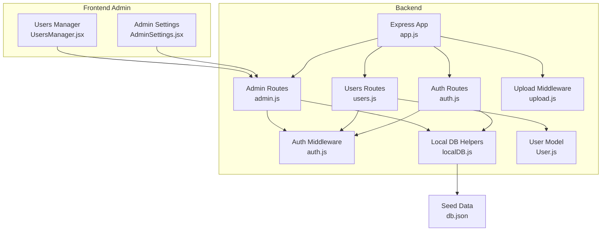
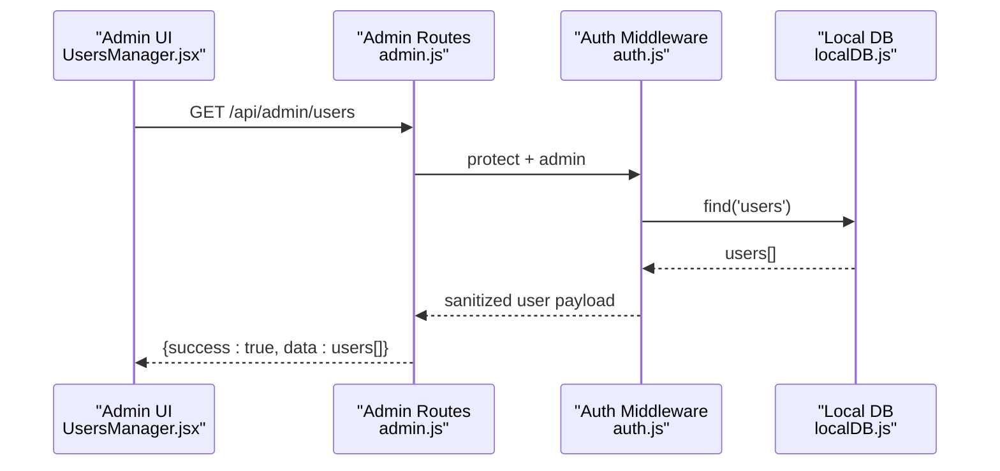
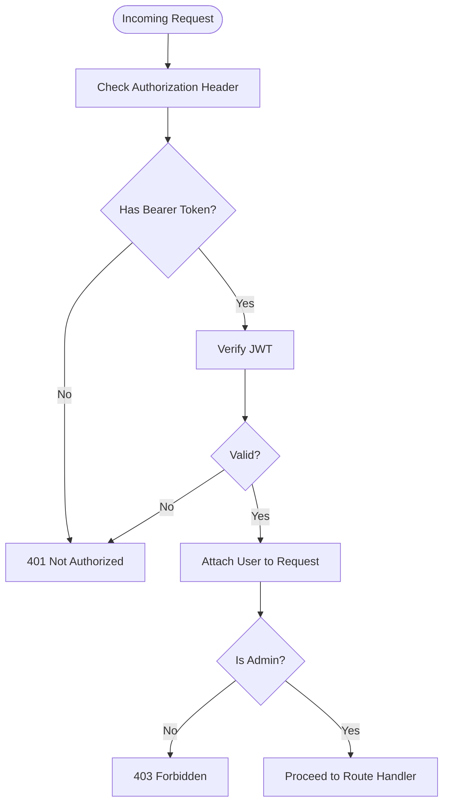
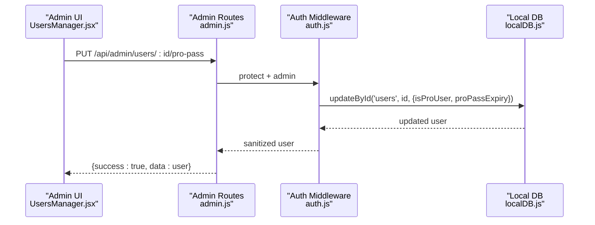
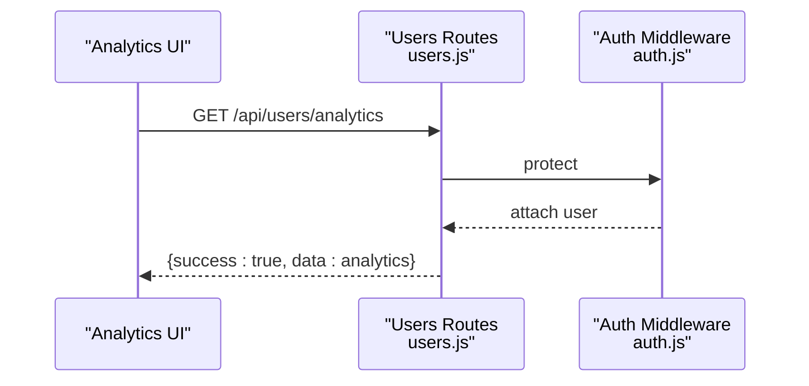
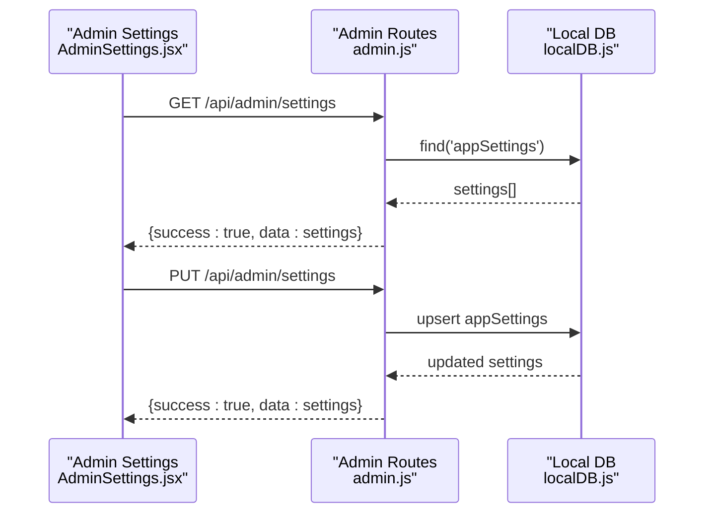
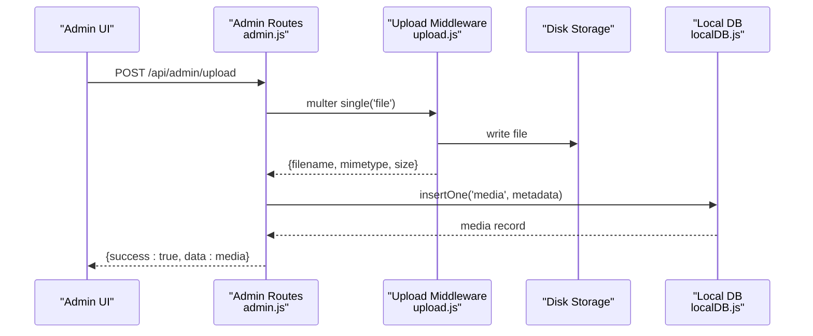
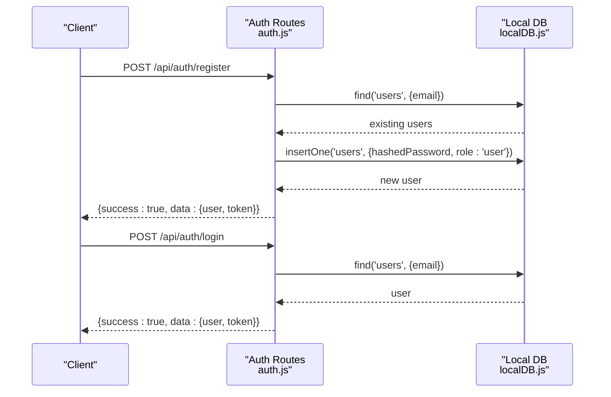
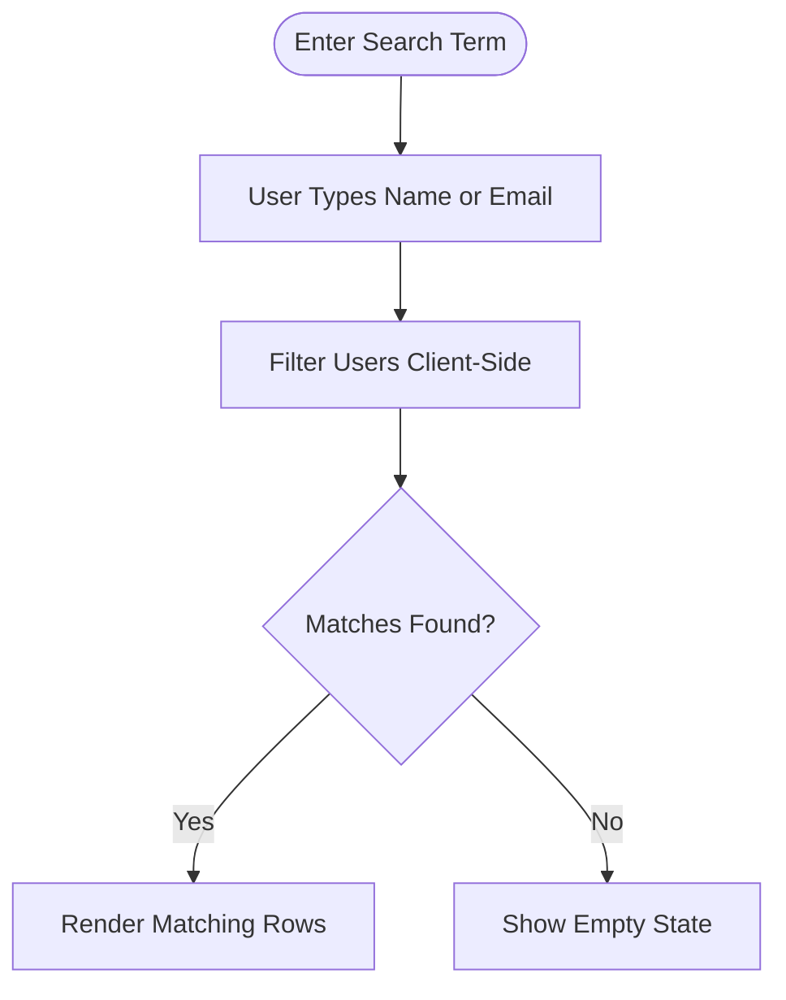
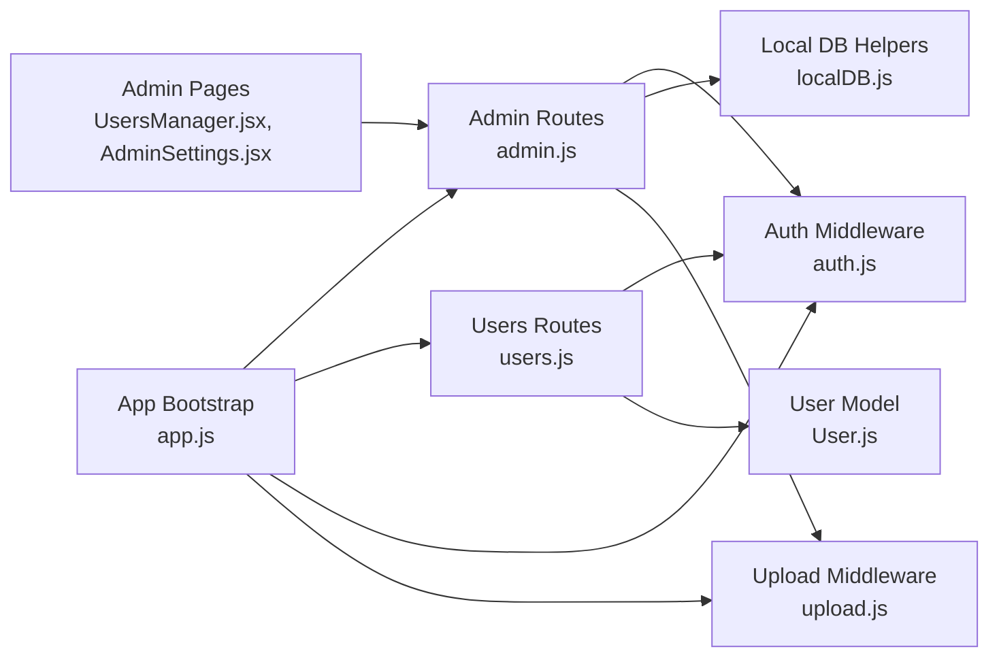

# User Administration

<cite>
**Referenced Files in This Document**
- [User model](file://Backend/src/models/User.js)
- [Users routes](file://Backend/src/routes/users.js)
- [Admin routes](file://Backend/src/routes/admin.js)
- [Auth routes](file://Backend/src/routes/auth.js)
- [Auth middleware](file://Backend/src/middleware/auth.js)
- [Local DB helpers](file://Backend/src/db/localDB.js)
- [App bootstrap](file://Backend/src/app.js)
- [Users manager (frontend)](file://Frontend/src/pages/admin/UsersManager.jsx)
- [Admin settings (frontend)](file://Frontend/src/pages/admin/AdminSettings.jsx)
- [DB seed data](file://Backend/data/db.json)
- [Upload middleware](file://Backend/src/middleware/upload.js)
</cite>

## Table of Contents
1. [Introduction](#introduction)
2. [Project Structure](#project-structure)
3. [Core Components](#core-components)
4. [Architecture Overview](#architecture-overview)
5. [Detailed Component Analysis](#detailed-component-analysis)
6. [Dependency Analysis](#dependency-analysis)
7. [Performance Considerations](#performance-considerations)
8. [Troubleshooting Guide](#troubleshooting-guide)
9. [Conclusion](#conclusion)

## Introduction
This document explains Trstprep V2’s user administration and management capabilities. It covers user lifecycle operations (creation, editing, suspension, deletion), role-based access control, permissions, analytics, search and filtering, bulk operations, activity monitoring, admin settings, and user onboarding and verification. The backend uses a local JSON database abstraction, while the frontend provides admin UIs for managing users and platform settings.

## Project Structure
The user administration spans backend routes and models, middleware for authentication and permissions, and frontend admin pages. The backend initializes a local database and exposes REST endpoints under /api/admin and /api/users. The frontend admin pages consume these endpoints to manage users and settings.

**Diagram sources**
- [App bootstrap](file://Backend/src/app.js#L56-L67)
- [Auth middleware](file://Backend/src/middleware/auth.js#L4-L44)
- [Local DB helpers](file://Backend/src/db/localDB.js#L82-L219)
- [User model](file://Backend/src/models/User.js#L4-L79)
- [Users routes](file://Backend/src/routes/users.js#L8-L147)
- [Admin routes](file://Backend/src/routes/admin.js#L12-L556)
- [Auth routes](file://Backend/src/routes/auth.js#L16-L171)
- [Upload middleware](file://Backend/src/middleware/upload.js#L31-L83)
- [Users manager (frontend)](file://Frontend/src/pages/admin/UsersManager.jsx#L13-L28)
- [Admin settings (frontend)](file://Frontend/src/pages/admin/AdminSettings.jsx#L24-L39)
- [DB seed data](file://Backend/data/db.json#L1-L728)

**Section sources**
- [App bootstrap](file://Backend/src/app.js#L56-L67)
- [Local DB helpers](file://Backend/src/db/localDB.js#L82-L219)
- [Users manager (frontend)](file://Frontend/src/pages/admin/UsersManager.jsx#L13-L28)
- [Admin settings (frontend)](file://Frontend/src/pages/admin/AdminSettings.jsx#L24-L39)

## Core Components
- User model defines fields, validation, hashing, and helper methods for password matching and Pro Pass validity.
- Authentication middleware enforces JWT-based protection and admin-only access.
- Admin routes expose user listing and Pro Pass toggling; they also provide settings management and media upload.
- Users routes handle profile retrieval/editing and analytics.
- Frontend admin pages render user listings, search/filter, and settings forms.

Key capabilities:
- User listing and search by name/email
- Pro Pass grant/revoke with expiry management
- Application settings management
- File/media upload for platform assets
- Analytics endpoint (placeholder for future implementation)

**Section sources**
- [User model](file://Backend/src/models/User.js#L4-L79)
- [Auth middleware](file://Backend/src/middleware/auth.js#L4-L44)
- [Admin routes](file://Backend/src/routes/admin.js#L213-L240)
- [Users routes](file://Backend/src/routes/users.js#L8-L147)
- [Users manager (frontend)](file://Frontend/src/pages/admin/UsersManager.jsx#L60-L63)
- [Admin settings (frontend)](file://Frontend/src/pages/admin/AdminSettings.jsx#L41-L66)

## Architecture Overview
The system uses Express with JWT-based authentication. Admin endpoints are protected by two middleware layers: general protection and admin-only checks. Data persistence is handled via a local JSON database abstraction with CRUD helpers. The frontend admin pages call admin endpoints to manage users and settings.

**Diagram sources**
- [Users manager (frontend)](file://Frontend/src/pages/admin/UsersManager.jsx#L13-L28)
- [Admin routes](file://Backend/src/routes/admin.js#L213-L223)
- [Auth middleware](file://Backend/src/middleware/auth.js#L4-L44)
- [Local DB helpers](file://Backend/src/db/localDB.js#L82-L103)

## Detailed Component Analysis

### User Model and Lifecycle
- Fields include name, email, password, mobile, avatar, role flags (isAdmin, hasProPass), expiry date, and enrollment references.
- Password hashing occurs pre-save; password comparison is supported via a helper.
- Pro Pass validity is computed against current time and expiry.

Soft delete note: The current model does not include a soft-delete flag. The admin routes demonstrate a soft-delete pattern conceptually (e.g., hiding records from normal views), but the model itself does not persist a deleted state.

**Section sources**
- [User model](file://Backend/src/models/User.js#L4-L79)

### Authentication and Authorization
- JWT tokens are verified; user attached to request after successful verification.
- Admin middleware checks a role flag to restrict access to administrative endpoints.
- Optional auth middleware allows non-authenticated requests to proceed.

**Diagram sources**
- [Auth middleware](file://Backend/src/middleware/auth.js#L4-L44)
- [Auth middleware](file://Backend/src/middleware/auth.js#L68-L78)

**Section sources**
- [Auth middleware](file://Backend/src/middleware/auth.js#L4-L44)
- [Auth middleware](file://Backend/src/middleware/auth.js#L68-L78)

### Admin User Management
- List users and sanitize payloads by excluding sensitive fields.
- Toggle Pro Pass status and expiry for users.
- Frontend supports searching users by name or email.

**Diagram sources**
- [Users manager (frontend)](file://Frontend/src/pages/admin/UsersManager.jsx#L30-L58)
- [Admin routes](file://Backend/src/routes/admin.js#L225-L240)
- [Local DB helpers](file://Backend/src/db/localDB.js#L170-L185)

**Section sources**
- [Admin routes](file://Backend/src/routes/admin.js#L213-L240)
- [Users manager (frontend)](file://Frontend/src/pages/admin/UsersManager.jsx#L60-L63)

### User Analytics
- Private analytics endpoint returns a placeholder structure for performance metrics.
- Frontend analytics page consumes this endpoint to render charts and summaries.

**Diagram sources**
- [Users routes](file://Backend/src/routes/users.js#L117-L147)

**Section sources**
- [Users routes](file://Backend/src/routes/users.js#L117-L147)

### Admin Settings Management
- Fetch and update application settings via admin endpoints.
- Frontend form binds to settings and persists changes.

**Diagram sources**
- [Admin settings (frontend)](file://Frontend/src/pages/admin/AdminSettings.jsx#L24-L39)
- [Admin settings (frontend)](file://Frontend/src/pages/admin/AdminSettings.jsx#L41-L66)
- [Admin routes](file://Backend/src/routes/admin.js#L274-L299)
- [Local DB helpers](file://Backend/src/db/localDB.js#L170-L185)

**Section sources**
- [Admin routes](file://Backend/src/routes/admin.js#L274-L299)
- [Admin settings (frontend)](file://Frontend/src/pages/admin/AdminSettings.jsx#L41-L66)

### File Upload and Media Library
- Upload middleware supports images, PDFs, and videos with size limits and safe filenames.
- Admin route persists media metadata to the media collection.

**Diagram sources**
- [Admin routes](file://Backend/src/routes/admin.js#L242-L272)
- [Upload middleware](file://Backend/src/middleware/upload.js#L31-L83)
- [Local DB helpers](file://Backend/src/db/localDB.js#L119-L133)

**Section sources**
- [Admin routes](file://Backend/src/routes/admin.js#L242-L272)
- [Upload middleware](file://Backend/src/middleware/upload.js#L31-L83)
- [Local DB helpers](file://Backend/src/db/localDB.js#L119-L133)

### User Onboarding, Registration, and Verification
- Registration creates a new user with hashed password and default role.
- Login validates credentials and returns a JWT token.
- Verification is not implemented in the backend; email verification would require additional endpoints and logic.

**Diagram sources**
- [Auth routes](file://Backend/src/routes/auth.js#L16-L124)
- [Local DB helpers](file://Backend/src/db/localDB.js#L82-L103)
- [Local DB helpers](file://Backend/src/db/localDB.js#L119-L133)

**Section sources**
- [Auth routes](file://Backend/src/routes/auth.js#L16-L124)
- [Local DB helpers](file://Backend/src/db/localDB.js#L82-L103)

### User Search and Filtering
- Admin UI filters users client-side by name or email.
- Admin routes return sanitized user lists for admin consumption.

**Diagram sources**
- [Users manager (frontend)](file://Frontend/src/pages/admin/UsersManager.jsx#L60-L63)

**Section sources**
- [Users manager (frontend)](file://Frontend/src/pages/admin/UsersManager.jsx#L60-L63)

### Bulk Operations
- Bulk question upload is supported via admin routes for batch insertion.
- No explicit bulk user operations are exposed in the current admin routes.

**Section sources**
- [Admin routes](file://Backend/src/routes/admin.js#L136-L144)

### Activity Monitoring
- Admin dashboard displays recent activity placeholders.
- Analytics endpoint returns performance metrics for users.

**Section sources**
- [Admin routes](file://Backend/src/routes/admin.js#L12-L29)
- [Users routes](file://Backend/src/routes/users.js#L117-L147)

## Dependency Analysis
- Admin routes depend on auth middleware for protection and on local DB helpers for persistence.
- Users routes depend on auth middleware and the User model.
- Frontend admin pages depend on admin routes for data and settings.
- Upload middleware depends on disk storage and file type validation.

**Diagram sources**
- [Admin routes](file://Backend/src/routes/admin.js#L1-L10)
- [Auth middleware](file://Backend/src/middleware/auth.js#L4-L44)
- [Local DB helpers](file://Backend/src/db/localDB.js#L82-L219)
- [Users routes](file://Backend/src/routes/users.js#L1-L6)
- [User model](file://Backend/src/models/User.js#L1-L3)
- [Users manager (frontend)](file://Frontend/src/pages/admin/UsersManager.jsx#L1-L4)
- [Admin settings (frontend)](file://Frontend/src/pages/admin/AdminSettings.jsx#L1-L4)
- [App bootstrap](file://Backend/src/app.js#L14-L22)
- [Upload middleware](file://Backend/src/middleware/upload.js#L1-L5)

**Section sources**
- [Admin routes](file://Backend/src/routes/admin.js#L1-L10)
- [Auth middleware](file://Backend/src/middleware/auth.js#L4-L44)
- [Local DB helpers](file://Backend/src/db/localDB.js#L82-L219)
- [Users routes](file://Backend/src/routes/users.js#L1-L6)
- [User model](file://Backend/src/models/User.js#L1-L3)
- [Users manager (frontend)](file://Frontend/src/pages/admin/UsersManager.jsx#L1-L4)
- [Admin settings (frontend)](file://Frontend/src/pages/admin/AdminSettings.jsx#L1-L4)
- [App bootstrap](file://Backend/src/app.js#L14-L22)
- [Upload middleware](file://Backend/src/middleware/upload.js#L1-L5)

## Performance Considerations
- Client-side filtering is O(n) per keystroke; consider server-side pagination and filtering for large datasets.
- JWT verification is lightweight; ensure secret rotation and secure token storage.
- Local JSON database is suitable for development; consider migrating to MongoDB for production scalability.
- File uploads are limited by size; adjust limits and consider CDN for media delivery.

## Troubleshooting Guide
- Authentication failures: Verify token presence and validity; check JWT secret and expiration.
- Admin access denied: Confirm user role flag and admin middleware enforcement.
- Database errors: Ensure local DB initialization and collection existence; inspect default data structure.
- Upload errors: Validate file types and sizes; confirm upload directories exist.

**Section sources**
- [Auth middleware](file://Backend/src/middleware/auth.js#L4-L44)
- [Auth middleware](file://Backend/src/middleware/auth.js#L68-L78)
- [Local DB helpers](file://Backend/src/db/localDB.js#L48-L73)
- [Upload middleware](file://Backend/src/middleware/upload.js#L55-L74)

## Conclusion
Trstprep V2 provides a solid foundation for user administration with JWT-based auth, admin-only endpoints, and a local JSON-backed data layer. The admin UI enables user listing, Pro Pass management, and settings updates. While the current model lacks soft delete, the admin routes demonstrate a pattern for hidden records. Future enhancements could include email verification, bulk user operations, server-side search, and migration to MongoDB for production.

*Last Updated: March 10, 2026 | Update date is (20:16)*
