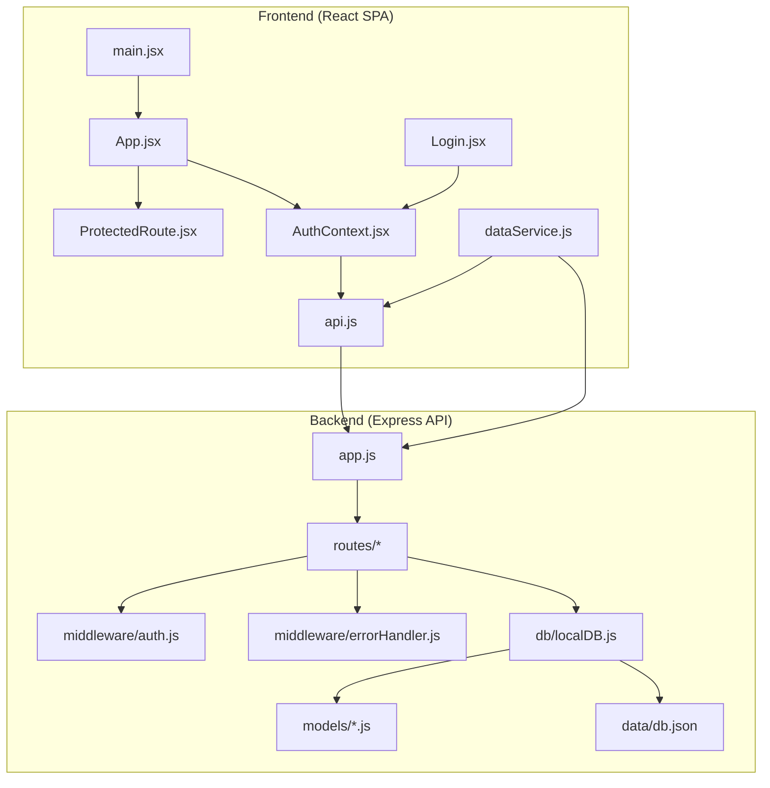
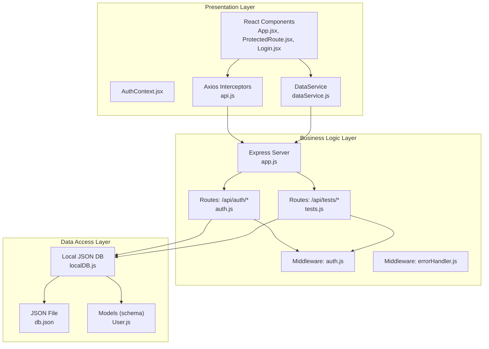
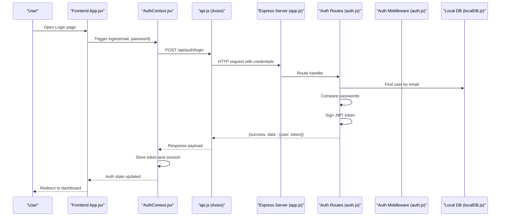
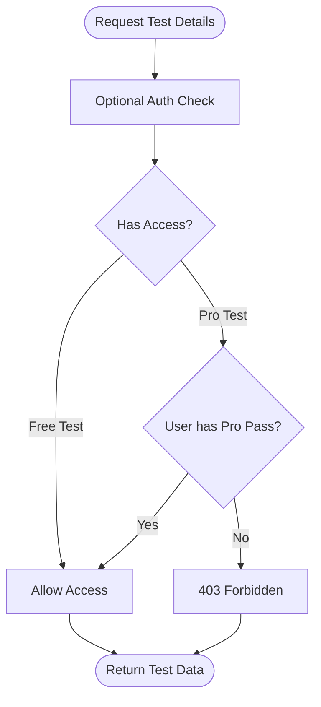
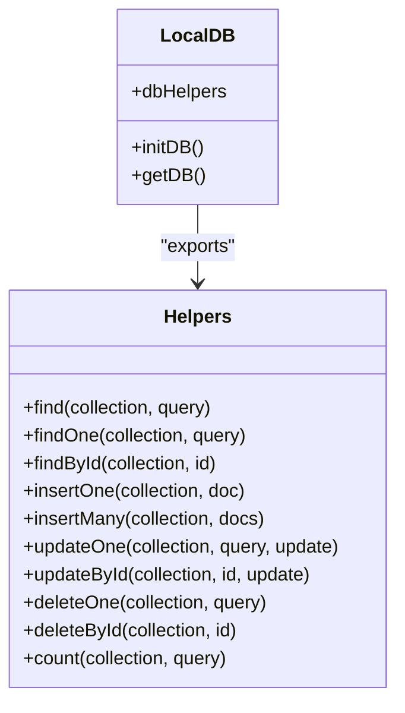
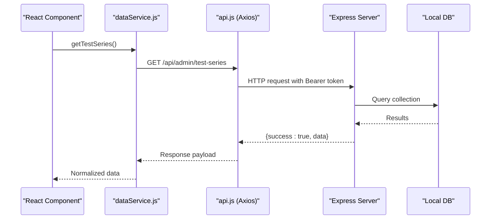
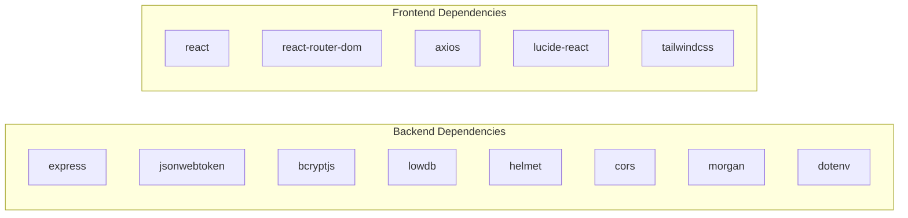

# Architecture Overview

<cite>
**Referenced Files in This Document**
- [Backend package.json](file://Backend/package.json)
- [Frontend package.json](file://Frontend/package.json)
- [Backend app.js](file://Backend/src/app.js)
- [Backend localDB.js](file://Backend/src/db/localDB.js)
- [Backend auth route](file://Backend/src/routes/auth.js)
- [Backend tests route](file://Backend/src/routes/tests.js)
- [Backend auth middleware](file://Backend/src/middleware/auth.js)
- [Backend error handler middleware](file://Backend/src/middleware/errorHandler.js)
- [Backend User model](file://Backend/src/models/User.js)
- [Frontend main.jsx](file://Frontend/src/main.jsx)
- [Frontend App.jsx](file://Frontend/src/App.jsx)
- [Frontend AuthContext.jsx](file://Frontend/src/context/AuthContext.jsx)
- [Frontend api.js](file://Frontend/src/services/api.js)
- [Frontend dataService.js](file://Frontend/src/services/dataService.js)
- [Frontend ProtectedRoute.jsx](file://Frontend/src/components/auth/ProtectedRoute.jsx)
- [Frontend Login.jsx](file://Frontend/src/pages/Login.jsx)
- [Backend db.json](file://Backend/data/db.json)
</cite>

## Table of Contents
1. [Introduction](#introduction)
2. [Project Structure](#project-structure)
3. [Core Components](#core-components)
4. [Architecture Overview](#architecture-overview)
5. [Detailed Component Analysis](#detailed-component-analysis)
6. [Dependency Analysis](#dependency-analysis)
7. [Performance Considerations](#performance-considerations)
8. [Troubleshooting Guide](#troubleshooting-guide)
9. [Conclusion](#conclusion)

## Introduction
This document presents the architectural design of Trstprep V2, focusing on the frontend React Single Page Application (SPA), backend Express.js API, database abstraction layer, and authentication system. It explains the layered architecture separating presentation, business logic, and data access, and documents component interactions, system boundaries, data flows, and integration points. The document also covers technology stack choices, architectural patterns (MVC and Context API), and scalability considerations.

## Project Structure
Trstprep V2 is organized into two primary modules:
- Frontend (React SPA): Handles UI rendering, routing, authentication state, and API communication via Axios interceptors.
- Backend (Express API): Provides REST endpoints, middleware for authentication and error handling, and a local JSON database abstraction.

**Diagram sources**
- [Frontend main.jsx](file://Frontend/src/main.jsx#L1-L17)
- [Frontend App.jsx](file://Frontend/src/App.jsx#L1-L143)
- [Frontend ProtectedRoute.jsx](file://Frontend/src/components/auth/ProtectedRoute.jsx#L1-L29)
- [Frontend AuthContext.jsx](file://Frontend/src/context/AuthContext.jsx#L1-L203)
- [Frontend api.js](file://Frontend/src/services/api.js#L1-L92)
- [Frontend dataService.js](file://Frontend/src/services/dataService.js#L1-L172)
- [Frontend Login.jsx](file://Frontend/src/pages/Login.jsx#L1-L212)
- [Backend app.js](file://Backend/src/app.js#L1-L94)
- [Backend auth route](file://Backend/src/routes/auth.js#L1-L174)
- [Backend tests route](file://Backend/src/routes/tests.js#L1-L200)
- [Backend auth middleware](file://Backend/src/middleware/auth.js#L1-L92)
- [Backend error handler middleware](file://Backend/src/middleware/errorHandler.js#L1-L52)
- [Backend localDB.js](file://Backend/src/db/localDB.js#L1-L219)
- [Backend User model](file://Backend/src/models/User.js#L1-L81)
- [Backend db.json](file://Backend/data/db.json#L1-L728)

**Section sources**
- [Backend package.json](file://Backend/package.json#L1-L32)
- [Frontend package.json](file://Frontend/package.json#L1-L35)
- [Backend app.js](file://Backend/src/app.js#L1-L94)
- [Backend localDB.js](file://Backend/src/db/localDB.js#L1-L219)
- [Backend auth route](file://Backend/src/routes/auth.js#L1-L174)
- [Backend tests route](file://Backend/src/routes/tests.js#L1-L200)
- [Backend auth middleware](file://Backend/src/middleware/auth.js#L1-L92)
- [Backend error handler middleware](file://Backend/src/middleware/errorHandler.js#L1-L52)
- [Backend User model](file://Backend/src/models/User.js#L1-L81)
- [Frontend main.jsx](file://Frontend/src/main.jsx#L1-L17)
- [Frontend App.jsx](file://Frontend/src/App.jsx#L1-L143)
- [Frontend AuthContext.jsx](file://Frontend/src/context/AuthContext.jsx#L1-L203)
- [Frontend api.js](file://Frontend/src/services/api.js#L1-L92)
- [Frontend dataService.js](file://Frontend/src/services/dataService.js#L1-L172)
- [Frontend ProtectedRoute.jsx](file://Frontend/src/components/auth/ProtectedRoute.jsx#L1-L29)
- [Frontend Login.jsx](file://Frontend/src/pages/Login.jsx#L1-L212)
- [Backend db.json](file://Backend/data/db.json#L1-L728)

## Core Components
- Presentation Layer (React SPA)
  - Routing and navigation: [App.jsx](file://Frontend/src/App.jsx#L1-L143)
  - Authentication state and session management: [AuthContext.jsx](file://Frontend/src/context/AuthContext.jsx#L1-L203)
  - Protected routes: [ProtectedRoute.jsx](file://Frontend/src/components/auth/ProtectedRoute.jsx#L1-L29)
  - API client with interceptors: [api.js](file://Frontend/src/services/api.js#L1-L92)
  - Data fetching service: [dataService.js](file://Frontend/src/services/dataService.js#L1-L172)
  - Entry point: [main.jsx](file://Frontend/src/main.jsx#L1-L17)

- Business Logic Layer (Express Routes)
  - Central server bootstrap and middleware: [app.js](file://Backend/src/app.js#L1-L94)
  - Authentication endpoints: [auth route](file://Backend/src/routes/auth.js#L1-L174)
  - Test-related endpoints: [tests route](file://Backend/src/routes/tests.js#L1-L200)
  - Authentication middleware: [auth middleware](file://Backend/src/middleware/auth.js#L1-L92)
  - Error handling middleware: [error handler middleware](file://Backend/src/middleware/errorHandler.js#L1-L52)

- Data Access Layer (Database Abstraction)
  - Local JSON database abstraction: [localDB.js](file://Backend/src/db/localDB.js#L1-L219)
  - Sample dataset: [db.json](file://Backend/data/db.json#L1-L728)
  - User model (schema and hooks): [User model](file://Backend/src/models/User.js#L1-L81)

**Section sources**
- [Frontend App.jsx](file://Frontend/src/App.jsx#L1-L143)
- [Frontend AuthContext.jsx](file://Frontend/src/context/AuthContext.jsx#L1-L203)
- [Frontend ProtectedRoute.jsx](file://Frontend/src/components/auth/ProtectedRoute.jsx#L1-L29)
- [Frontend api.js](file://Frontend/src/services/api.js#L1-L92)
- [Frontend dataService.js](file://Frontend/src/services/dataService.js#L1-L172)
- [Frontend main.jsx](file://Frontend/src/main.jsx#L1-L17)
- [Backend app.js](file://Backend/src/app.js#L1-L94)
- [Backend auth route](file://Backend/src/routes/auth.js#L1-L174)
- [Backend tests route](file://Backend/src/routes/tests.js#L1-L200)
- [Backend auth middleware](file://Backend/src/middleware/auth.js#L1-L92)
- [Backend error handler middleware](file://Backend/src/middleware/errorHandler.js#L1-L52)
- [Backend localDB.js](file://Backend/src/db/localDB.js#L1-L219)
- [Backend User model](file://Backend/src/models/User.js#L1-L81)
- [Backend db.json](file://Backend/data/db.json#L1-L728)

## Architecture Overview
Trstprep V2 follows a layered architecture:
- Presentation Layer: React SPA manages UI, routing, and user interactions. Authentication state is centralized via Context API, and API communication is handled by Axios interceptors.
- Business Logic Layer: Express routes encapsulate domain logic, enforce authorization, and orchestrate data retrieval and mutation through the database abstraction.
- Data Access Layer: A local JSON database abstraction provides CRUD-like operations and maintains collections for users, tests, questions, and related entities. The underlying dataset is persisted in a JSON file.

System boundaries:
- Frontend boundary: React application bootstrapped in main.jsx, rendering App.jsx with routing and protected routes.
- Backend boundary: Express server initializes middleware, registers routes, and exposes REST endpoints under /api.
- Database boundary: Local JSON database abstraction with helper functions mimicking MongoDB-style operations.

Integration points:
- Frontend-to-Backend: Axios interceptors attach Authorization headers; error interceptor handles 401 and redirects to login.
- Authentication: JWT tokens are generated by the backend and stored in frontend localStorage; AuthContext hydrates user session and roles.
- Data flow: Frontend components call API endpoints; backend routes query the local database abstraction and return normalized responses.

**Diagram sources**
- [Frontend App.jsx](file://Frontend/src/App.jsx#L1-L143)
- [Frontend AuthContext.jsx](file://Frontend/src/context/AuthContext.jsx#L1-L203)
- [Frontend api.js](file://Frontend/src/services/api.js#L1-L92)
- [Frontend dataService.js](file://Frontend/src/services/dataService.js#L1-L172)
- [Backend app.js](file://Backend/src/app.js#L1-L94)
- [Backend auth route](file://Backend/src/routes/auth.js#L1-L174)
- [Backend tests route](file://Backend/src/routes/tests.js#L1-L200)
- [Backend auth middleware](file://Backend/src/middleware/auth.js#L1-L92)
- [Backend error handler middleware](file://Backend/src/middleware/errorHandler.js#L1-L52)
- [Backend localDB.js](file://Backend/src/db/localDB.js#L1-L219)
- [Backend User model](file://Backend/src/models/User.js#L1-L81)
- [Backend db.json](file://Backend/data/db.json#L1-L728)

## Detailed Component Analysis

### Authentication System
The authentication system spans the frontend and backend:
- Frontend
  - AuthContext manages user session, login/signup, logout, and profile updates. It stores tokens and user metadata in localStorage and provides role-based flags.
  - Axios interceptors automatically attach Authorization headers and handle 401 responses by clearing tokens and redirecting to login.
  - ProtectedRoute enforces authentication for protected pages and displays a loading state while checking auth.
  - Login page validates form inputs and delegates authentication to AuthContext.

- Backend
  - Authentication routes handle registration, login, and fetching current user details. Tokens are signed with a secret and returned to the client.
  - Authentication middleware verifies JWT tokens, attaches user info to requests, and supports optional auth and admin/pro-pass checks.
  - Error handling middleware standardizes error responses, including JWT-specific errors.

**Diagram sources**
- [Frontend App.jsx](file://Frontend/src/App.jsx#L1-L143)
- [Frontend AuthContext.jsx](file://Frontend/src/context/AuthContext.jsx#L1-L203)
- [Frontend api.js](file://Frontend/src/services/api.js#L1-L92)
- [Backend app.js](file://Backend/src/app.js#L1-L94)
- [Backend auth route](file://Backend/src/routes/auth.js#L1-L174)
- [Backend auth middleware](file://Backend/src/middleware/auth.js#L1-L92)
- [Backend localDB.js](file://Backend/src/db/localDB.js#L1-L219)

**Section sources**
- [Frontend AuthContext.jsx](file://Frontend/src/context/AuthContext.jsx#L1-L203)
- [Frontend api.js](file://Frontend/src/services/api.js#L1-L92)
- [Frontend ProtectedRoute.jsx](file://Frontend/src/components/auth/ProtectedRoute.jsx#L1-L29)
- [Frontend Login.jsx](file://Frontend/src/pages/Login.jsx#L1-L212)
- [Backend auth route](file://Backend/src/routes/auth.js#L1-L174)
- [Backend auth middleware](file://Backend/src/middleware/auth.js#L1-L92)
- [Backend error handler middleware](file://Backend/src/middleware/errorHandler.js#L1-L52)

### Test Access Control Flow
The backend enforces access control based on test type and user Pro Pass status:
- Public access for Free tests.
- Pro Pass required for Pro tests.
- Optional auth allows non-authenticated users to view public test details.

**Diagram sources**
- [Backend tests route](file://Backend/src/routes/tests.js#L50-L84)
- [Backend auth middleware](file://Backend/src/middleware/auth.js#L46-L92)

**Section sources**
- [Backend tests route](file://Backend/src/routes/tests.js#L50-L84)
- [Backend auth middleware](file://Backend/src/middleware/auth.js#L46-L92)

### Data Access Layer
The local database abstraction provides:
- Initialization and default data seeding.
- CRUD helpers (find, findOne, findById, insertOne, updateOne, deleteOne, count).
- Nested property queries and consistent timestamps.

**Diagram sources**
- [Backend localDB.js](file://Backend/src/db/localDB.js#L1-L219)

**Section sources**
- [Backend localDB.js](file://Backend/src/db/localDB.js#L1-L219)
- [Backend db.json](file://Backend/data/db.json#L1-L728)

### API Communication Patterns
Frontend API clients:
- Axios-based client with automatic Authorization header injection and centralized error handling.
- Separate API modules for auth, series, tests, user, and study resources.
- DataService module wraps fetch calls, adds caching, and normalizes responses.

**Diagram sources**
- [Frontend dataService.js](file://Frontend/src/services/dataService.js#L1-L172)
- [Frontend api.js](file://Frontend/src/services/api.js#L1-L92)
- [Backend app.js](file://Backend/src/app.js#L1-L94)
- [Backend localDB.js](file://Backend/src/db/localDB.js#L1-L219)

**Section sources**
- [Frontend api.js](file://Frontend/src/services/api.js#L1-L92)
- [Frontend dataService.js](file://Frontend/src/services/dataService.js#L1-L172)
- [Backend app.js](file://Backend/src/app.js#L1-L94)
- [Backend localDB.js](file://Backend/src/db/localDB.js#L1-L219)

## Dependency Analysis
Technology stack and module dependencies:
- Backend
  - Express for web server and routing.
  - lowdb for local JSON database abstraction.
  - jsonwebtoken for JWT token generation/verification.
  - bcryptjs for password hashing.
  - helmet, cors, morgan for security, CORS, and logging.
  - dotenv for environment variables.

- Frontend
  - React and react-router-dom for UI and routing.
  - axios for HTTP client with interceptors.
  - lucide-react for icons.
  - Tailwind CSS for styling.

**Diagram sources**
- [Backend package.json](file://Backend/package.json#L1-L32)
- [Frontend package.json](file://Frontend/package.json#L1-L35)

**Section sources**
- [Backend package.json](file://Backend/package.json#L1-L32)
- [Frontend package.json](file://Frontend/package.json#L1-L35)

## Performance Considerations
- Frontend caching: dataService.js caches fetched data for a short duration to reduce redundant network calls.
- Request/response interceptors: centralize token injection and error handling to minimize boilerplate.
- Local database: lowdb provides simplicity and fast iteration during development; consider migration to a scalable database for production.
- Middleware pipeline: helmet, cors, and morgan add security and observability without heavy overhead.
- Scalability: Current setup targets small-scale usage. For production, consider adding rate limiting, database indexing, CDN for uploads, and horizontal scaling of the API.

[No sources needed since this section provides general guidance]

## Troubleshooting Guide
Common issues and resolutions:
- Authentication failures
  - Verify JWT_SECRET environment variable and token validity.
  - Check that the Authorization header is present in requests.
  - Confirm user exists in the local database and passwords match.

- 401 Unauthorized
  - Axios interceptor clears tokens and redirects to login on 401 responses.
  - Ensure frontend AuthContext persists and refreshes tokens appropriately.

- Database initialization errors
  - Confirm db.json exists and readable; localDB.js seeds defaults if missing.
  - Validate that initDB is called before routes attempt to query data.

- Route not found
  - errorHandler middleware responds with 404 for unmatched routes.

**Section sources**
- [Backend auth middleware](file://Backend/src/middleware/auth.js#L1-L92)
- [Frontend api.js](file://Frontend/src/services/api.js#L26-L44)
- [Backend error handler middleware](file://Backend/src/middleware/errorHandler.js#L1-L52)
- [Backend localDB.js](file://Backend/src/db/localDB.js#L45-L70)

## Conclusion
Trstprep V2 employs a clean layered architecture with clear separation of concerns:
- Presentation: React SPA with Context API for authentication and Axios interceptors for API communication.
- Business Logic: Express routes implementing MVC-style controllers with middleware for auth and error handling.
- Data Access: Local JSON database abstraction enabling rapid development and easy migration to a production database.

The system integrates authentication context usage, protected routes, and standardized API communication patterns. While the current setup uses a local JSON database for simplicity, the modular design facilitates future enhancements such as migrating to MongoDB, adding caching layers, and scaling the backend.

*Last Updated: March 10, 2026 | Update date is (20:16)*
