# Backend Architecture

<cite>
**Referenced Files in This Document**
- [app.js](file://Backend/src/app.js)
- [auth.js](file://Backend/src/middleware/auth.js)
- [errorHandler.js](file://Backend/src/middleware/errorHandler.js)
- [localDB.js](file://Backend/src/db/localDB.js)
- [auth.js](file://Backend/src/routes/auth.js)
- [users.js](file://Backend/src/routes/users.js)
- [series.js](file://Backend/src/routes/series.js)
- [tests.js](file://Backend/src/routes/tests.js)
- [study.js](file://Backend/src/routes/study.js)
- [admin.js](file://Backend/src/routes/admin.js)
- [User.js](file://Backend/src/models/User.js)
- [TestSeries.js](file://Backend/src/models/TestSeries.js)
- [Test.js](file://Backend/src/models/Test.js)
- [Question.js](file://Backend/src/models/Question.js)
- [db.json](file://Backend/data/db.json)
- [package.json](file://Backend/package.json)
</cite>

## Table of Contents
1. [Introduction](#introduction)
2. [Project Structure](#project-structure)
3. [Core Components](#core-components)
4. [Architecture Overview](#architecture-overview)
5. [Detailed Component Analysis](#detailed-component-analysis)
6. [Dependency Analysis](#dependency-analysis)
7. [Performance Considerations](#performance-considerations)
8. [Troubleshooting Guide](#troubleshooting-guide)
9. [Conclusion](#conclusion)

## Introduction
This document describes the backend architecture of Trstprep V2’s Express.js API server. It explains how the application implements an MVC-like separation across routes, models, and a database abstraction layer. It also covers middleware for authentication, error handling, and request processing, along with route organization by feature, API endpoint design patterns, and security measures. Guidance on scalability, versioning, and performance optimization is included.

## Project Structure
The backend follows a feature-based modular structure under Backend/src with clear separation of concerns:
- app.js: Application bootstrap, middleware stack, health endpoint, and route registration
- routes/: Feature-based route groups (auth, users, series, tests, study, admin)
- models/: Mongoose models for domain entities
- db/: Database abstraction layer using lowdb for local JSON storage
- middleware/: Cross-cutting concerns (auth, error handling, uploads)

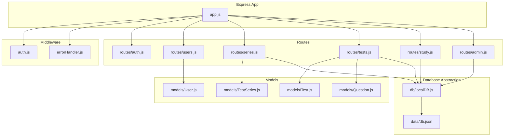

**Diagram sources**
- [app.js](file://Backend/src/app.js#L1-L94)
- [auth.js](file://Backend/src/middleware/auth.js#L1-L92)
- [errorHandler.js](file://Backend/src/middleware/errorHandler.js#L1-L52)
- [auth.js](file://Backend/src/routes/auth.js#L1-L174)
- [users.js](file://Backend/src/routes/users.js#L1-L150)
- [series.js](file://Backend/src/routes/series.js#L1-L162)
- [tests.js](file://Backend/src/routes/tests.js#L1-L265)
- [study.js](file://Backend/src/routes/study.js#L1-L137)
- [admin.js](file://Backend/src/routes/admin.js#L1-L557)
- [User.js](file://Backend/src/models/User.js#L1-L81)
- [TestSeries.js](file://Backend/src/models/TestSeries.js#L1-L71)
- [Test.js](file://Backend/src/models/Test.js#L1-L77)
- [Question.js](file://Backend/src/models/Question.js#L1-L54)
- [localDB.js](file://Backend/src/db/localDB.js#L1-L222)
- [db.json](file://Backend/data/db.json#L1-L728)

**Section sources**
- [app.js](file://Backend/src/app.js#L1-L94)
- [package.json](file://Backend/package.json#L1-L32)

## Core Components
- Express application bootstrap and middleware stack
- Authentication middleware with JWT verification and role checks
- Centralized error handling and 404 routing
- Database abstraction using lowdb with helper functions
- Feature routes organized by domain: auth, users, series, tests, study, admin
- Mongoose models for domain entities with indexes and validations

**Section sources**
- [app.js](file://Backend/src/app.js#L24-L94)
- [auth.js](file://Backend/src/middleware/auth.js#L1-L92)
- [errorHandler.js](file://Backend/src/middleware/errorHandler.js#L1-L52)
- [localDB.js](file://Backend/src/db/localDB.js#L1-L222)
- [User.js](file://Backend/src/models/User.js#L1-L81)
- [TestSeries.js](file://Backend/src/models/TestSeries.js#L1-L71)
- [Test.js](file://Backend/src/models/Test.js#L1-L77)
- [Question.js](file://Backend/src/models/Question.js#L1-L54)

## Architecture Overview
The system uses Express with a layered architecture:
- Entry point initializes middleware, routes, and database
- Routes define endpoints and orchestrate data access
- Models define schemas and validations
- Database abstraction provides CRUD helpers for local JSON persistence
- Middleware handles security, logging, and error propagation

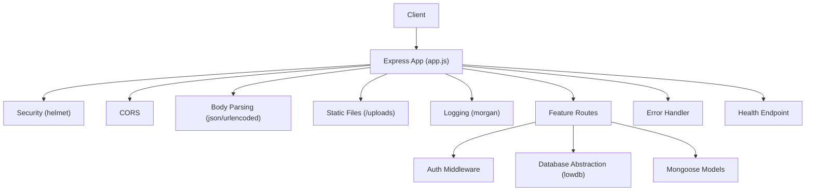

**Diagram sources**
- [app.js](file://Backend/src/app.js#L27-L66)
- [auth.js](file://Backend/src/middleware/auth.js#L1-L92)
- [errorHandler.js](file://Backend/src/middleware/errorHandler.js#L1-L52)
- [localDB.js](file://Backend/src/db/localDB.js#L1-L222)

## Detailed Component Analysis

### MVC Pattern Implementation
- Views: Not applicable in this backend; responses are rendered by route handlers
- Controllers: Implemented implicitly within route files as request handlers
- Models: Mongoose models encapsulate domain logic and schema definitions
- Routes: Define endpoints and delegate to models/database helpers

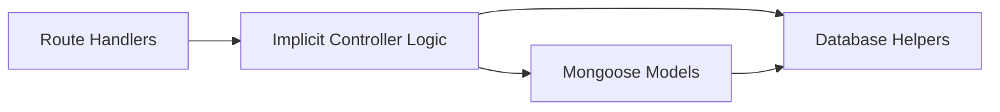

**Diagram sources**
- [auth.js](file://Backend/src/routes/auth.js#L16-L171)
- [users.js](file://Backend/src/routes/users.js#L8-L147)
- [series.js](file://Backend/src/routes/series.js#L8-L159)
- [tests.js](file://Backend/src/routes/tests.js#L8-L262)
- [study.js](file://Backend/src/routes/study.js#L65-L134)
- [admin.js](file://Backend/src/routes/admin.js#L32-L554)
- [User.js](file://Backend/src/models/User.js#L1-L81)
- [TestSeries.js](file://Backend/src/models/TestSeries.js#L1-L71)
- [Test.js](file://Backend/src/models/Test.js#L1-L77)
- [Question.js](file://Backend/src/models/Question.js#L1-L54)
- [localDB.js](file://Backend/src/db/localDB.js#L82-L219)

**Section sources**
- [auth.js](file://Backend/src/routes/auth.js#L1-L174)
- [users.js](file://Backend/src/routes/users.js#L1-L150)
- [series.js](file://Backend/src/routes/series.js#L1-L162)
- [tests.js](file://Backend/src/routes/tests.js#L1-L265)
- [study.js](file://Backend/src/routes/study.js#L1-L137)
- [admin.js](file://Backend/src/routes/admin.js#L1-L557)
- [User.js](file://Backend/src/models/User.js#L1-L81)
- [TestSeries.js](file://Backend/src/models/TestSeries.js#L1-L71)
- [Test.js](file://Backend/src/models/Test.js#L1-L77)
- [Question.js](file://Backend/src/models/Question.js#L1-L54)

### Middleware Architecture
- Security: Helmet, CORS, static file serving for uploads
- Request parsing: JSON and URL-encoded bodies
- Logging: Morgan in development
- Authentication: JWT verification, optional auth, admin/pro-pass guards
- Error handling: 404 not found and centralized error handler

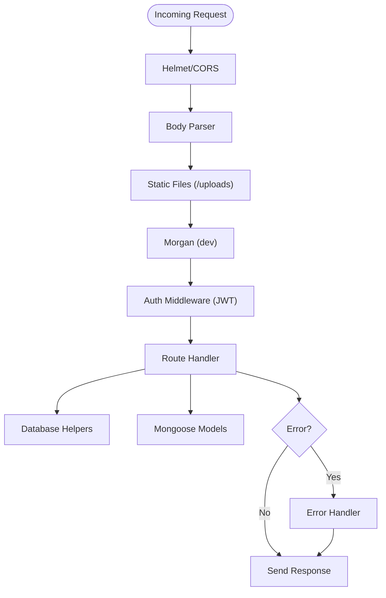

**Diagram sources**
- [app.js](file://Backend/src/app.js#L27-L66)
- [auth.js](file://Backend/src/middleware/auth.js#L1-L92)
- [errorHandler.js](file://Backend/src/middleware/errorHandler.js#L1-L52)
- [localDB.js](file://Backend/src/db/localDB.js#L1-L222)

**Section sources**
- [app.js](file://Backend/src/app.js#L27-L66)
- [auth.js](file://Backend/src/middleware/auth.js#L1-L92)
- [errorHandler.js](file://Backend/src/middleware/errorHandler.js#L1-L52)

### Route Organization by Feature
- Authentication: Registration, login, current user, logout
- Users: Profile, enrollment, enrolled series, analytics
- Series: List, detail by slug, tests in series, category filter
- Tests: Tag-based filters, detail, questions, start/submit/test result
- Study: Subjects, subject detail, chapters
- Admin: CRUD for series/tests/questions/study materials/users/settings/categories/navigation/tag configs

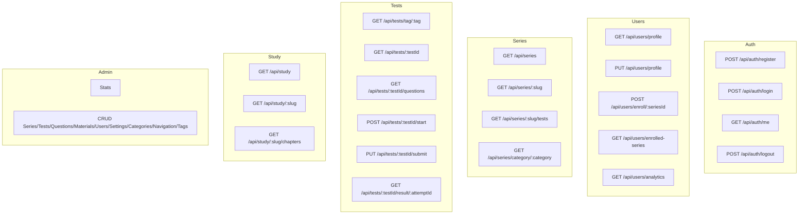

**Diagram sources**
- [auth.js](file://Backend/src/routes/auth.js#L16-L171)
- [users.js](file://Backend/src/routes/users.js#L8-L147)
- [series.js](file://Backend/src/routes/series.js#L8-L159)
- [tests.js](file://Backend/src/routes/tests.js#L8-L262)
- [study.js](file://Backend/src/routes/study.js#L65-L134)
- [admin.js](file://Backend/src/routes/admin.js#L13-L554)

**Section sources**
- [auth.js](file://Backend/src/routes/auth.js#L1-L174)
- [users.js](file://Backend/src/routes/users.js#L1-L150)
- [series.js](file://Backend/src/routes/series.js#L1-L162)
- [tests.js](file://Backend/src/routes/tests.js#L1-L265)
- [study.js](file://Backend/src/routes/study.js#L1-L137)
- [admin.js](file://Backend/src/routes/admin.js#L1-L557)

### Database Abstraction Layer and Data Access Patterns
- Local JSON database via lowdb with a helper API
- CRUD helpers: find, findOne, findById, insertOne, insertMany, updateOne, updateById, deleteOne, deleteById, count
- Default data structure includes users, enrollments, results, test series, tests, questions, categories, study materials, media, app settings, navigation, tags, banners, notifications
- Models are defined with Mongoose but data is persisted to JSON using helpers

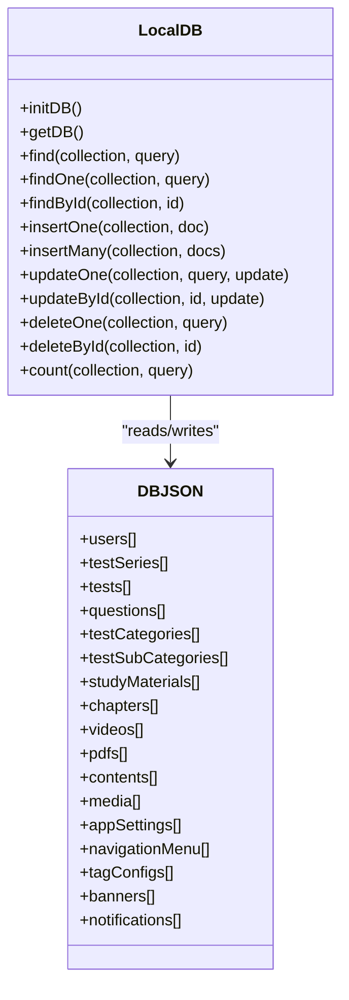

**Diagram sources**
- [localDB.js](file://Backend/src/db/localDB.js#L48-L219)
- [db.json](file://Backend/data/db.json#L1-L728)

**Section sources**
- [localDB.js](file://Backend/src/db/localDB.js#L1-L222)
- [db.json](file://Backend/data/db.json#L1-L728)

### Model Relationships and Data Models
- User: Enrolled series (references TestSeries), attempted tests map, password hashing, Pro pass validity
- TestSeries: Category, tags, ratings, activity metrics
- Test: Belongs to TestSeries, category/subcategory/type, timing, scoring, tags, live scheduling
- Question: Belongs to Test, multilingual text/options, correct option, difficulty, explanation

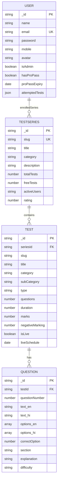

**Diagram sources**
- [User.js](file://Backend/src/models/User.js#L4-L77)
- [TestSeries.js](file://Backend/src/models/TestSeries.js#L3-L63)
- [Test.js](file://Backend/src/models/Test.js#L3-L74)
- [Question.js](file://Backend/src/models/Question.js#L3-L47)

**Section sources**
- [User.js](file://Backend/src/models/User.js#L1-L81)
- [TestSeries.js](file://Backend/src/models/TestSeries.js#L1-L71)
- [Test.js](file://Backend/src/models/Test.js#L1-L77)
- [Question.js](file://Backend/src/models/Question.js#L1-L54)

### Request/Response Flow Examples

#### Authentication Flow
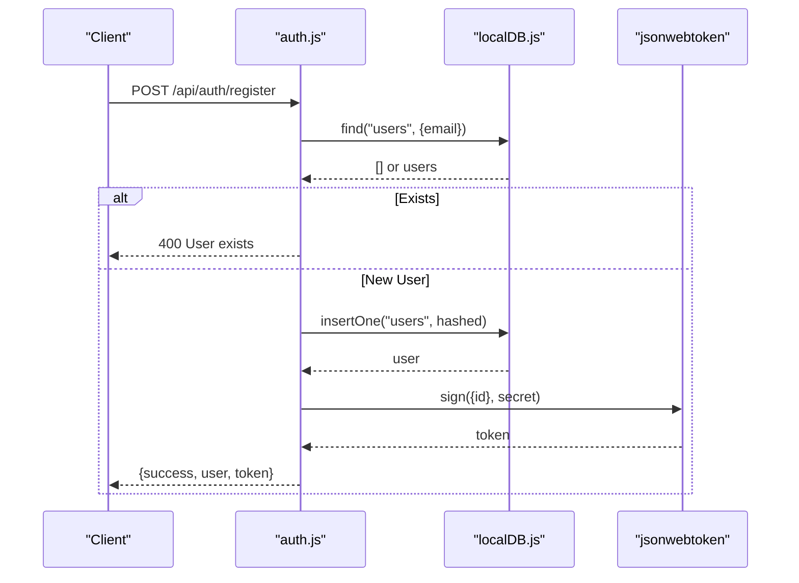

**Diagram sources**
- [auth.js](file://Backend/src/routes/auth.js#L19-L71)
- [localDB.js](file://Backend/src/db/localDB.js#L120-L133)

#### Protected Route Flow (Get Current User)
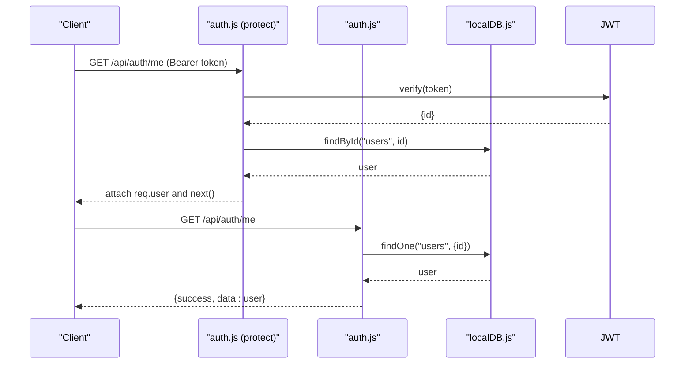

**Diagram sources**
- [auth.js](file://Backend/src/middleware/auth.js#L5-L44)
- [auth.js](file://Backend/src/routes/auth.js#L129-L161)
- [localDB.js](file://Backend/src/db/localDB.js#L114-L117)

#### Admin Management Flow
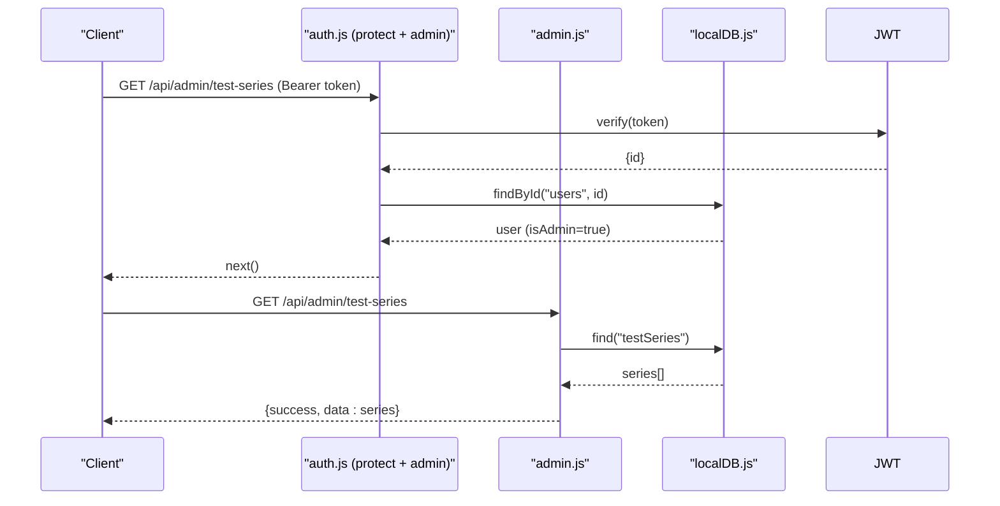

**Diagram sources**
- [auth.js](file://Backend/src/middleware/auth.js#L6-L78)
- [admin.js](file://Backend/src/routes/admin.js#L32-L39)
- [localDB.js](file://Backend/src/db/localDB.js#L85-L103)

### Security Middleware Implementation
- JWT-based authentication with bearer tokens
- Role-based access control (admin)
- Pro Pass gating for premium content
- Optional authentication for public endpoints
- Helmet and CORS hardening
- Static file serving for uploads

**Section sources**
- [auth.js](file://Backend/src/middleware/auth.js#L1-L92)
- [app.js](file://Backend/src/app.js#L27-L44)

### Error Handling Strategies
- 404 not found middleware
- Centralized error handler with status code normalization
- Specific handling for validation, duplicate key, cast errors, and JWT errors
- Environment-aware stack traces in development

**Section sources**
- [errorHandler.js](file://Backend/src/middleware/errorHandler.js#L1-L52)

## Dependency Analysis
- Express application depends on middleware, routes, and database helpers
- Routes depend on models and database helpers
- Models depend on Mongoose
- Database helpers depend on lowdb and JSON file adapter
- Package dependencies include Express, Helmet, CORS, Morgan, JWT, Bcrypt, Mongoose, LowDB, Multer

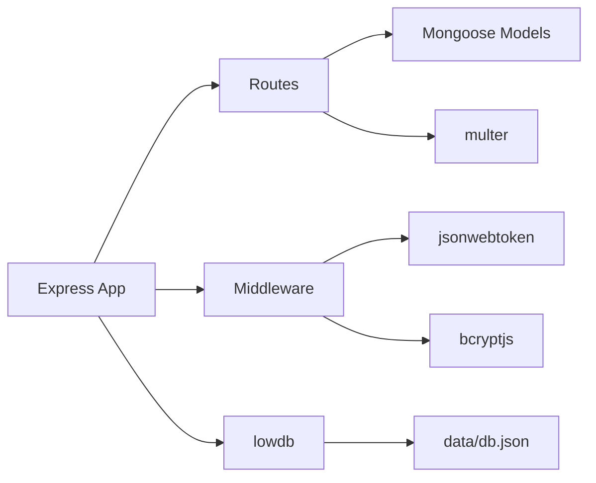

**Diagram sources**
- [app.js](file://Backend/src/app.js#L1-L94)
- [auth.js](file://Backend/src/middleware/auth.js#L1-L92)
- [errorHandler.js](file://Backend/src/middleware/errorHandler.js#L1-L52)
- [localDB.js](file://Backend/src/db/localDB.js#L1-L222)
- [package.json](file://Backend/package.json#L12-L27)

**Section sources**
- [package.json](file://Backend/package.json#L12-L27)

## Performance Considerations
- Local JSON database is suitable for development and small scale; consider migrating to MongoDB for production
- Add indexing on frequently queried fields (e.g., series category, test type, user email)
- Implement pagination for large lists (series, tests, questions)
- Cache responses for static content and reduce payload sizes
- Use environment-specific logging and disable verbose logs in production
- Monitor and limit upload sizes and types

[No sources needed since this section provides general guidance]

## Troubleshooting Guide
- Health check endpoint: GET /api/health
- Common statuses:
  - 401 Unauthorized: Missing or invalid JWT token
  - 403 Forbidden: Insufficient permissions (admin/pro-pass)
  - 404 Not Found: Resource not found
  - 400 Bad Request: Validation or duplicate key errors
  - 500 Internal Server Error: Unexpected errors handled centrally

**Section sources**
- [app.js](file://Backend/src/app.js#L47-L54)
- [errorHandler.js](file://Backend/src/middleware/errorHandler.js#L11-L51)

## Conclusion
Trstprep V2’s backend demonstrates a clean, modular Express architecture with clear separation between routes, models, and a database abstraction layer. Authentication and error handling are centralized, and routes are organized by feature. While the current implementation uses a local JSON database, the codebase is structured to support migration to MongoDB and further enhancements for scalability and performance.

*Last Updated: March 10, 2026 | Update date is (20:16)*
