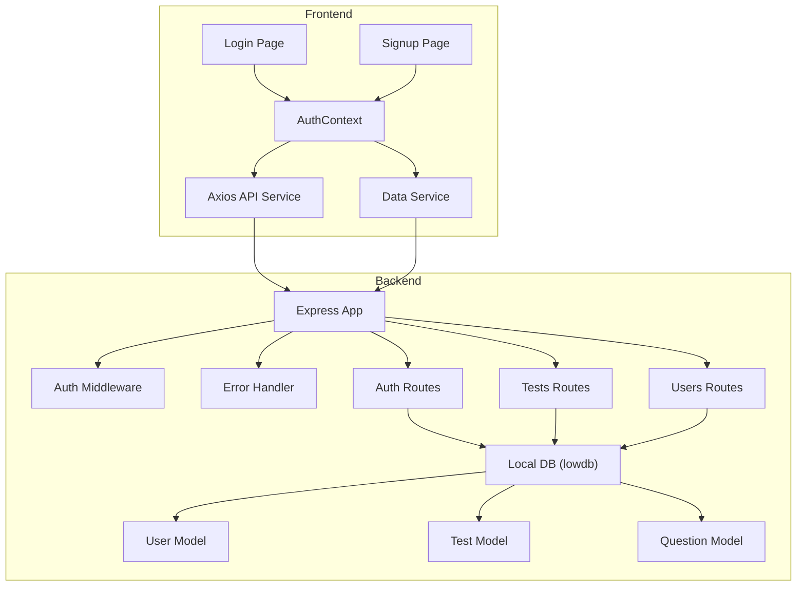
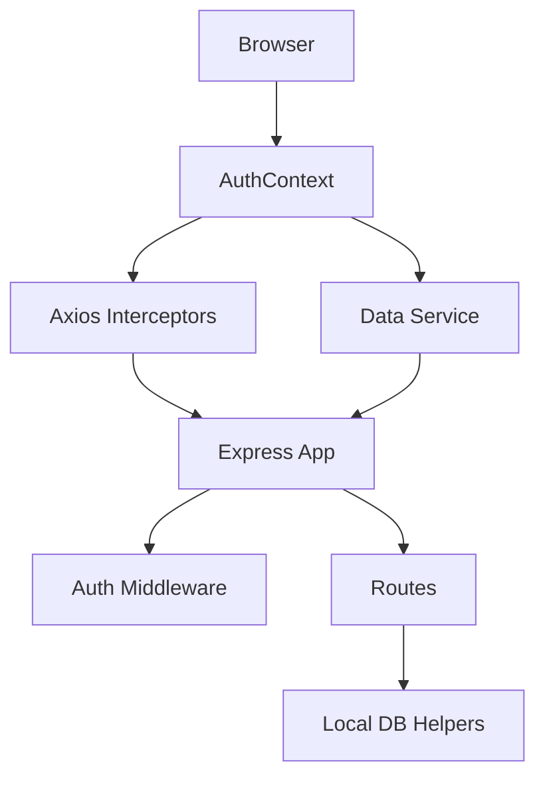
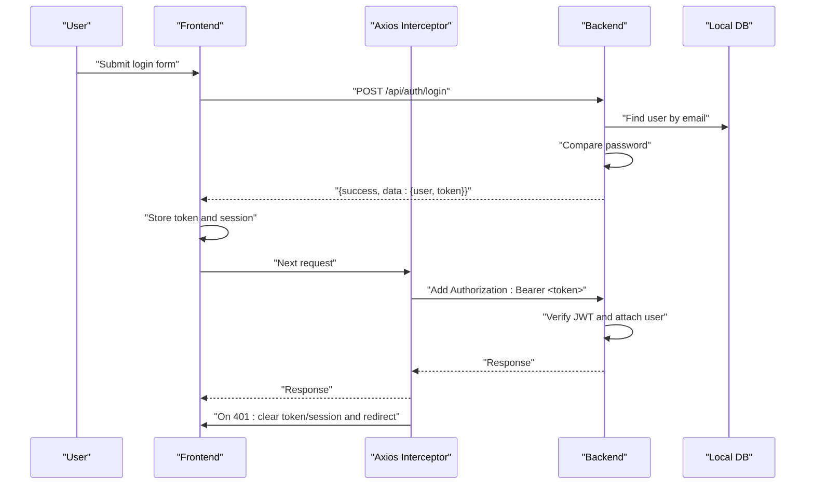
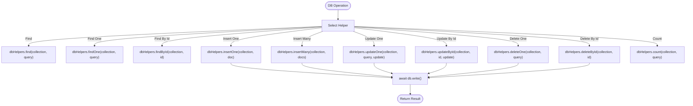
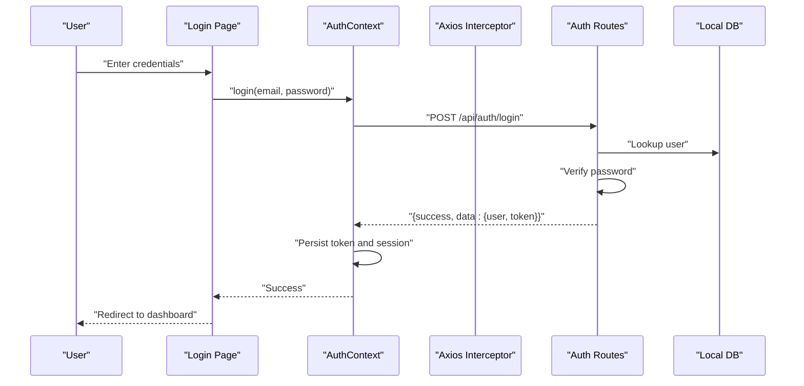
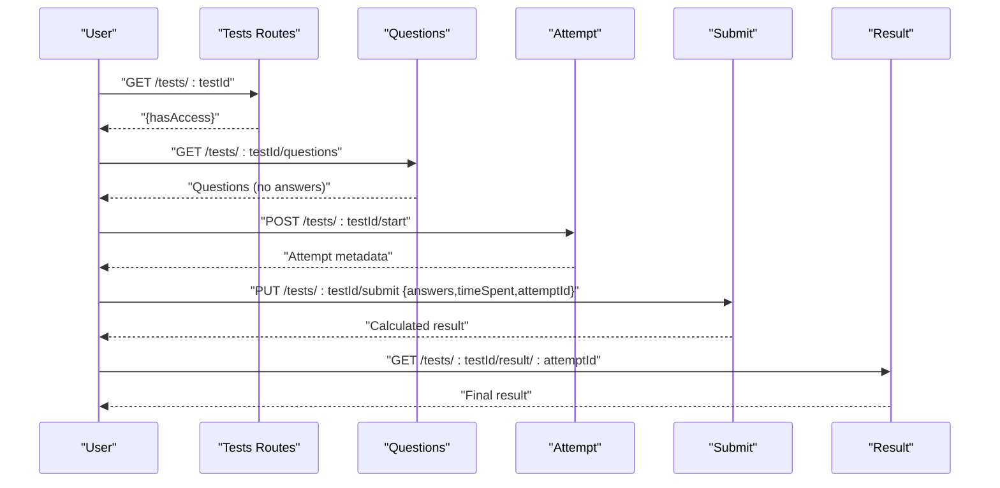
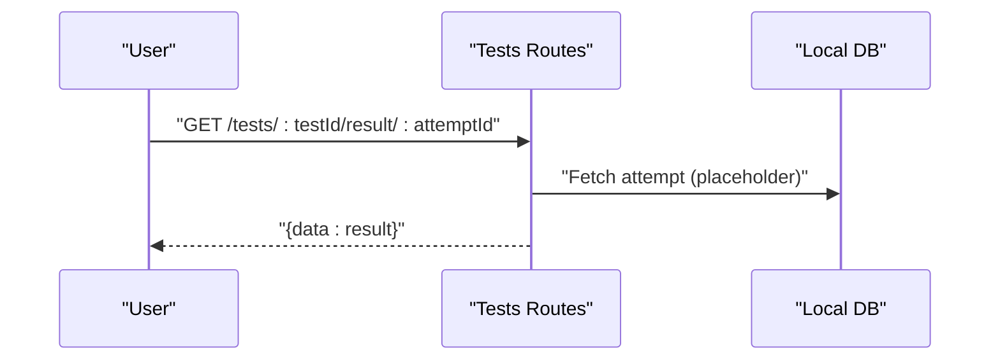
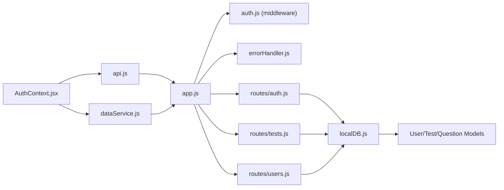

# Data Flow Architecture

<cite>
**Referenced Files in This Document**
- [app.js](file://Backend/src/app.js)
- [localDB.js](file://Backend/src/db/localDB.js)
- [auth.js](file://Backend/src/middleware/auth.js)
- [errorHandler.js](file://Backend/src/middleware/errorHandler.js)
- [auth.js](file://Backend/src/routes/auth.js)
- [tests.js](file://Backend/src/routes/tests.js)
- [users.js](file://Backend/src/routes/users.js)
- [User.js](file://Backend/src/models/User.js)
- [Test.js](file://Backend/src/models/Test.js)
- [Question.js](file://Backend/src/models/Question.js)
- [AuthContext.jsx](file://Frontend/src/context/AuthContext.jsx)
- [api.js](file://Frontend/src/services/api.js)
- [dataService.js](file://Frontend/src/services/dataService.js)
- [Login.jsx](file://Frontend/src/pages/Login.jsx)
- [Signup.jsx](file://Frontend/src/pages/Signup.jsx)
</cite>

## Table of Contents
1. [Introduction](#introduction)
2. [Project Structure](#project-structure)
3. [Core Components](#core-components)
4. [Architecture Overview](#architecture-overview)
5. [Detailed Component Analysis](#detailed-component-analysis)
6. [Dependency Analysis](#dependency-analysis)
7. [Performance Considerations](#performance-considerations)
8. [Troubleshooting Guide](#troubleshooting-guide)
9. [Conclusion](#conclusion)
10. [Appendices](#appendices)

## Introduction
This document describes the complete data flow architecture for Trstprep V2, covering user input through frontend components, API requests, backend processing, database operations, and response handling. It explains authentication using JWT tokens, session management, and token refresh mechanisms. It also details API communication patterns, request/response schemas, error handling, database abstraction, query patterns, data transformation, validation strategies, error propagation, retry mechanisms, caching, synchronization, and offline handling capabilities.

## Project Structure
The system consists of:
- Frontend (React + Vite): Handles user interactions, authentication state, API calls, and caching.
- Backend (Express + Local JSON via lowdb): Provides REST APIs, middleware for auth and error handling, and a local database abstraction layer.

**Diagram sources**
- [app.js](file://Backend/src/app.js#L24-L94)
- [auth.js](file://Backend/src/middleware/auth.js#L1-L92)
- [errorHandler.js](file://Backend/src/middleware/errorHandler.js#L1-L52)
- [auth.js](file://Backend/src/routes/auth.js#L1-L174)
- [tests.js](file://Backend/src/routes/tests.js#L1-L265)
- [users.js](file://Backend/src/routes/users.js#L1-L150)
- [localDB.js](file://Backend/src/db/localDB.js#L1-L222)
- [User.js](file://Backend/src/models/User.js#L1-L81)
- [Test.js](file://Backend/src/models/Test.js#L1-L77)
- [Question.js](file://Backend/src/models/Question.js#L1-L54)
- [AuthContext.jsx](file://Frontend/src/context/AuthContext.jsx#L1-L203)
- [api.js](file://Frontend/src/services/api.js#L1-L92)
- [dataService.js](file://Frontend/src/services/dataService.js#L1-L172)
- [Login.jsx](file://Frontend/src/pages/Login.jsx#L1-L212)
- [Signup.jsx](file://Frontend/src/pages/Signup.jsx#L1-L296)

**Section sources**
- [app.js](file://Backend/src/app.js#L24-L94)
- [AuthContext.jsx](file://Frontend/src/context/AuthContext.jsx#L13-L192)
- [api.js](file://Frontend/src/services/api.js#L4-L44)

## Core Components
- Express server initializes middleware, routes, and local database.
- Authentication middleware validates JWT tokens and enriches requests with user context.
- Error handler standardizes error responses and maps known error types.
- Local database abstraction provides CRUD helpers for JSON storage.
- Frontend AuthContext manages session state and persists user data and tokens.
- Axios service injects auth headers and centralizes error handling.
- Data service caches API responses for reduced latency.

**Section sources**
- [app.js](file://Backend/src/app.js#L24-L94)
- [auth.js](file://Backend/src/middleware/auth.js#L1-L92)
- [errorHandler.js](file://Backend/src/middleware/errorHandler.js#L1-L52)
- [localDB.js](file://Backend/src/db/localDB.js#L48-L222)
- [AuthContext.jsx](file://Frontend/src/context/AuthContext.jsx#L13-L192)
- [api.js](file://Frontend/src/services/api.js#L12-L44)
- [dataService.js](file://Frontend/src/services/dataService.js#L29-L108)

## Architecture Overview
The system follows a layered architecture:
- Presentation Layer: React pages and context manage user sessions and UI state.
- Service Layer: Axios interceptors and data service encapsulate API communication and caching.
- Application Layer: Express routes implement business logic and enforce authorization.
- Persistence Layer: Local JSON database abstraction simulates relational operations.

**Diagram sources**
- [AuthContext.jsx](file://Frontend/src/context/AuthContext.jsx#L13-L192)
- [api.js](file://Frontend/src/services/api.js#L12-L44)
- [dataService.js](file://Frontend/src/services/dataService.js#L15-L27)
- [app.js](file://Backend/src/app.js#L24-L94)
- [auth.js](file://Backend/src/middleware/auth.js#L1-L92)
- [tests.js](file://Backend/src/routes/tests.js#L1-L265)
- [localDB.js](file://Backend/src/db/localDB.js#L82-L222)

## Detailed Component Analysis

### Authentication Flow (JWT, Session, Refresh)
- Frontend:
  - On login, the form posts credentials to the backend.
  - On success, the frontend stores a JWT token and a session object containing user metadata and expiration.
  - Axios interceptor automatically attaches the token to outgoing requests.
  - On 401 responses, the interceptor clears stored tokens and redirects to login.
- Backend:
  - Auth routes validate credentials, hash passwords, and issue JWTs.
  - Auth middleware extracts Bearer tokens, verifies them, loads user data, and attaches user info to the request.
  - Optional auth middleware allows requests without failing if no valid token is present.
  - Error handler maps JWT errors to 401 responses.

**Diagram sources**
- [Login.jsx](file://Frontend/src/pages/Login.jsx#L19-L36)
- [AuthContext.jsx](file://Frontend/src/context/AuthContext.jsx#L42-L98)
- [api.js](file://Frontend/src/services/api.js#L12-L44)
- [auth.js](file://Backend/src/routes/auth.js#L73-L124)
- [auth.js](file://Backend/src/middleware/auth.js#L5-L44)
- [localDB.js](file://Backend/src/db/localDB.js#L114-L117)

**Section sources**
- [Login.jsx](file://Frontend/src/pages/Login.jsx#L19-L36)
- [AuthContext.jsx](file://Frontend/src/context/AuthContext.jsx#L42-L98)
- [api.js](file://Frontend/src/services/api.js#L12-L44)
- [auth.js](file://Backend/src/routes/auth.js#L73-L124)
- [auth.js](file://Backend/src/middleware/auth.js#L5-L44)
- [errorHandler.js](file://Backend/src/middleware/errorHandler.js#L35-L44)

### API Communication Patterns and Schemas
- Base URL and headers are configured centrally; interceptors add Authorization and handle 401 globally.
- Auth endpoints:
  - POST /api/auth/register: { name, email, password, mobile? } → { success, data: { user, token } }
  - POST /api/auth/login: { email, password } → { success, data: { user, token } }
  - GET /api/auth/me: Private → { success, data: user profile }
  - POST /api/auth/logout: Private → { success, message }
- Tests endpoints:
  - GET /api/tests/tag/:tag: Public → { success, count, data: tests[] }
  - GET /api/tests/:testId: optionalAuth → { success, data: test with hasAccess }
  - GET /api/tests/:testId/questions: Private → { success, count, data: questions[] (without answers) }
  - POST /api/tests/:testId/start: Private → { success, data: attempt metadata }
  - PUT /api/tests/:testId/submit: Private → { success, data: result }
  - GET /api/tests/:testId/result/:attemptId: Private → { success, data: result }
- Users endpoints:
  - GET /api/users/profile: Private → { success, data: user }
  - PUT /api/users/profile: Private → { success, data: user }
  - POST /api/users/enroll/:seriesId: Private → { success, message, data: enrolledSeries }
  - GET /api/users/enrolled-series: Private → { success, data: enrolledSeries[] }
  - GET /api/users/analytics: Private → { success, data: analytics }

**Section sources**
- [api.js](file://Frontend/src/services/api.js#L46-L91)
- [auth.js](file://Backend/src/routes/auth.js#L16-L173)
- [tests.js](file://Backend/src/routes/tests.js#L8-L262)
- [users.js](file://Backend/src/routes/users.js#L8-L147)

### Database Abstraction Layer and Query Patterns
- Local JSON database:
  - Initialization ensures all collections exist and writes defaults.
  - Helpers support find, findOne, findById, insertOne, insertMany, updateOne, updateById, deleteOne, deleteById, and count.
  - Operations are synchronous and write to disk after each mutation.
- Models (Mongoose):
  - User: validation, hashing, Pro Pass checks, enrolled series, attempted tests map.
  - Test: composite indexing on seriesId+slug, category, type, and fields for tests.
  - Question: composite indexing on testId+questionNumber, multilingual text/options, difficulty, image.
- Route queries:
  - Tests route uses population of series and filters by tags/categories/types.
  - Users route populates enrolled series and updates enrollment sets.

**Diagram sources**
- [localDB.js](file://Backend/src/db/localDB.js#L82-L222)

**Section sources**
- [localDB.js](file://Backend/src/db/localDB.js#L48-L222)
- [User.js](file://Backend/src/models/User.js#L4-L81)
- [Test.js](file://Backend/src/models/Test.js#L3-L77)
- [Question.js](file://Backend/src/models/Question.js#L3-L54)
- [tests.js](file://Backend/src/routes/tests.js#L11-L47)
- [users.js](file://Backend/src/routes/users.js#L10-L82)

### Data Validation Strategies and Error Propagation
- Frontend:
  - Forms validate presence and format of inputs before invoking actions.
  - Axios interceptor handles 401 by clearing tokens and redirecting.
- Backend:
  - Mongoose models define strict validations and defaults.
  - Error handler maps CastError, duplicate key, validation errors, and JWT errors to appropriate HTTP statuses.
- Retry mechanisms:
  - No explicit retry logic is implemented in the current codebase.

**Section sources**
- [Login.jsx](file://Frontend/src/pages/Login.jsx#L23-L27)
- [Signup.jsx](file://Frontend/src/pages/Signup.jsx#L45-L64)
- [api.js](file://Frontend/src/services/api.js#L26-L44)
- [errorHandler.js](file://Backend/src/middleware/errorHandler.js#L16-L51)

### Caching, Synchronization, and Offline Handling
- Frontend Data Service:
  - In-memory cache keyed by collection with a short TTL (5 seconds).
  - Clear cache after mutations to ensure freshness.
- Frontend AuthContext:
  - Stores a session object with user metadata and expiration in localStorage.
  - Validates session expiry on mount and removes stale sessions.
- Offline handling:
  - No explicit offline persistence or sync strategy is implemented.

**Section sources**
- [dataService.js](file://Frontend/src/services/dataService.js#L29-L108)
- [AuthContext.jsx](file://Frontend/src/context/AuthContext.jsx#L18-L40)

### Typical User Workflows

#### Login Workflow

**Diagram sources**
- [Login.jsx](file://Frontend/src/pages/Login.jsx#L19-L36)
- [AuthContext.jsx](file://Frontend/src/context/AuthContext.jsx#L42-L98)
- [auth.js](file://Backend/src/routes/auth.js#L73-L124)
- [localDB.js](file://Backend/src/db/localDB.js#L84-L117)

#### Taking a Test Workflow

**Diagram sources**
- [tests.js](file://Backend/src/routes/tests.js#L49-L262)

#### Viewing Results Workflow

**Diagram sources**
- [tests.js](file://Backend/src/routes/tests.js#L233-L262)

## Dependency Analysis
- Frontend depends on:
  - AuthContext for session and token management.
  - Axios service for HTTP communication and global error handling.
  - Data service for cached retrieval of admin-managed content.
- Backend depends on:
  - Express app for routing and middleware.
  - Auth middleware for protecting routes.
  - Error handler for consistent error responses.
  - Local DB helpers for persistence.
  - Mongoose models for schema validation and population.

**Diagram sources**
- [AuthContext.jsx](file://Frontend/src/context/AuthContext.jsx#L1-L203)
- [api.js](file://Frontend/src/services/api.js#L1-L92)
- [dataService.js](file://Frontend/src/services/dataService.js#L1-L172)
- [app.js](file://Backend/src/app.js#L14-L66)
- [auth.js](file://Backend/src/middleware/auth.js#L1-L92)
- [errorHandler.js](file://Backend/src/middleware/errorHandler.js#L1-L52)
- [auth.js](file://Backend/src/routes/auth.js#L1-L174)
- [tests.js](file://Backend/src/routes/tests.js#L1-L265)
- [users.js](file://Backend/src/routes/users.js#L1-L150)
- [localDB.js](file://Backend/src/db/localDB.js#L1-L222)
- [User.js](file://Backend/src/models/User.js#L1-L81)
- [Test.js](file://Backend/src/models/Test.js#L1-L77)
- [Question.js](file://Backend/src/models/Question.js#L1-L54)

**Section sources**
- [app.js](file://Backend/src/app.js#L14-L66)
- [auth.js](file://Backend/src/middleware/auth.js#L1-L92)
- [errorHandler.js](file://Backend/src/middleware/errorHandler.js#L1-L52)
- [localDB.js](file://Backend/src/db/localDB.js#L1-L222)
- [User.js](file://Backend/src/models/User.js#L1-L81)
- [Test.js](file://Backend/src/models/Test.js#L1-L77)
- [Question.js](file://Backend/src/models/Question.js#L1-L54)
- [AuthContext.jsx](file://Frontend/src/context/AuthContext.jsx#L1-L203)
- [api.js](file://Frontend/src/services/api.js#L1-L92)
- [dataService.js](file://Frontend/src/services/dataService.js#L1-L172)

## Performance Considerations
- Local JSON database:
  - Synchronous reads/writes can block the event loop; consider migration to a scalable database for production.
  - Indexing is simulated via helper filtering; consider adding native indexes if migrating to MongoDB.
- Frontend caching:
  - Short TTL reduces staleness but increases network usage; tune TTL based on data volatility.
  - Cache invalidation after mutations is essential to prevent inconsistent views.
- Network:
  - Axios timeout is set; consider implementing exponential backoff and retry policies for resilience.
- Authentication:
  - Token verification occurs on each protected request; ensure JWT secret and expiration are configured securely.

[No sources needed since this section provides general guidance]

## Troubleshooting Guide
- 401 Unauthorized:
  - Frontend: Interceptor clears token/session and navigates to login.
  - Backend: JWT verification failures or missing tokens trigger 401.
- 403 Forbidden:
  - Occurs when accessing Pro-only resources without a valid Pro Pass.
- 404 Not Found:
  - Mapped for unknown routes and invalid ObjectIds.
- Duplicate Key or Validation Errors:
  - Mapped to 400 with specific messages.
- Network Errors:
  - Logged and surfaced to the user; verify backend connectivity and CORS configuration.

**Section sources**
- [api.js](file://Frontend/src/services/api.js#L26-L44)
- [errorHandler.js](file://Backend/src/middleware/errorHandler.js#L3-L51)
- [tests.js](file://Backend/src/routes/tests.js#L100-L106)
- [auth.js](file://Backend/src/middleware/auth.js#L14-L43)

## Conclusion
Trstprep V2 implements a clear separation of concerns with a reactive frontend and a lightweight Express backend backed by a local JSON database. Authentication relies on JWT tokens with robust middleware protection and centralized error handling. The frontend provides session persistence and basic caching to improve UX. Areas for improvement include migrating to a scalable database, implementing retry and offline strategies, and expanding token refresh mechanisms.

[No sources needed since this section summarizes without analyzing specific files]

## Appendices

### API Endpoint Reference
- Auth
  - POST /api/auth/register: { name, email, password, mobile? } → { success, data: { user, token } }
  - POST /api/auth/login: { email, password } → { success, data: { user, token } }
  - GET /api/auth/me: Private → { success, data: user profile }
  - POST /api/auth/logout: Private → { success, message }
- Tests
  - GET /api/tests/tag/:tag: Public → { success, count, data: tests[] }
  - GET /api/tests/:testId: optionalAuth → { success, data: test with hasAccess }
  - GET /api/tests/:testId/questions: Private → { success, count, data: questions[] }
  - POST /api/tests/:testId/start: Private → { success, data: attempt metadata }
  - PUT /api/tests/:testId/submit: Private → { success, data: result }
  - GET /api/tests/:testId/result/:attemptId: Private → { success, data: result }
- Users
  - GET /api/users/profile: Private → { success, data: user }
  - PUT /api/users/profile: Private → { success, data: user }
  - POST /api/users/enroll/:seriesId: Private → { success, message, data: enrolledSeries }
  - GET /api/users/enrolled-series: Private → { success, data: enrolledSeries[] }
  - GET /api/users/analytics: Private → { success, data: analytics }

**Section sources**
- [api.js](file://Frontend/src/services/api.js#L46-L91)
- [auth.js](file://Backend/src/routes/auth.js#L16-L173)
- [tests.js](file://Backend/src/routes/tests.js#L8-L262)
- [users.js](file://Backend/src/routes/users.js#L8-L147)

*Last Updated: March 10, 2026 | Update date is (20:16)*
