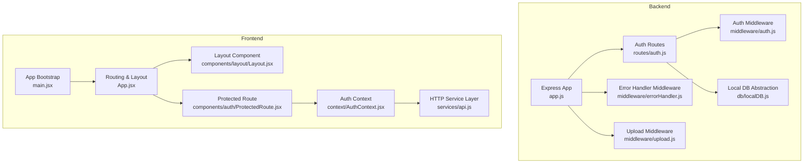
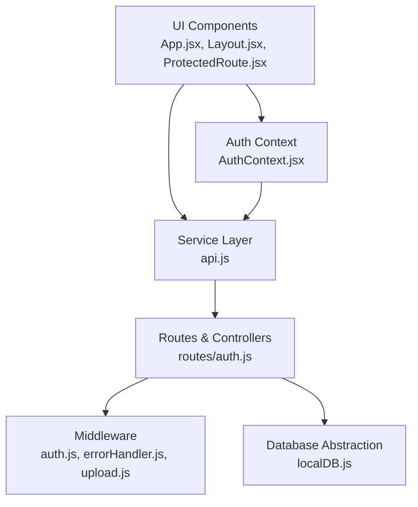
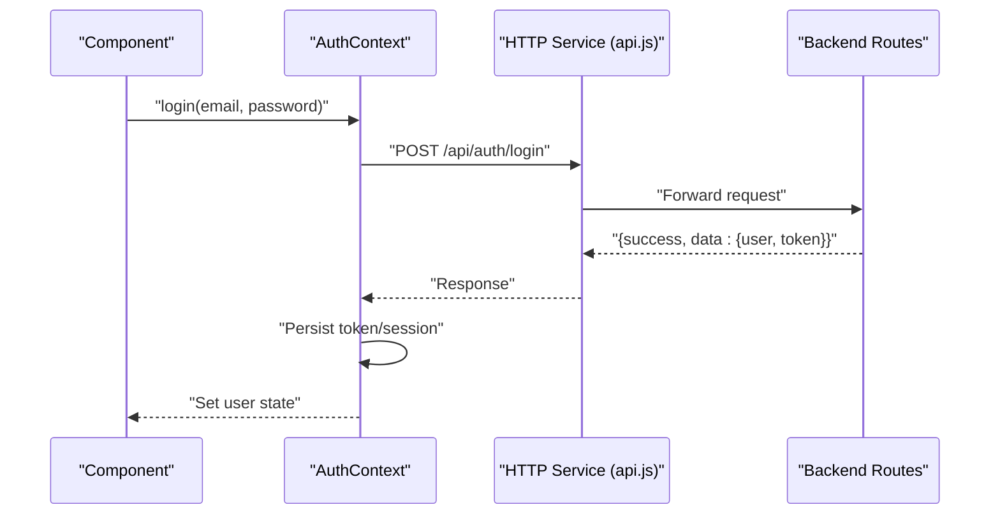
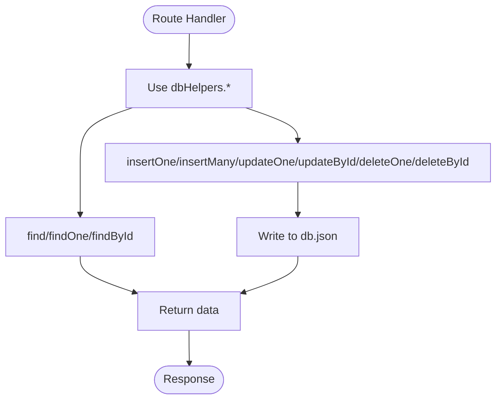
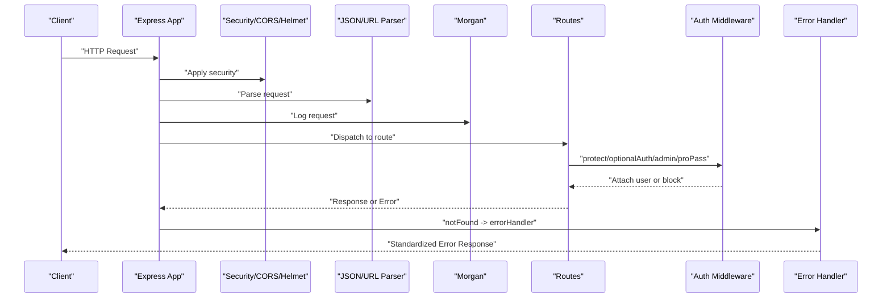
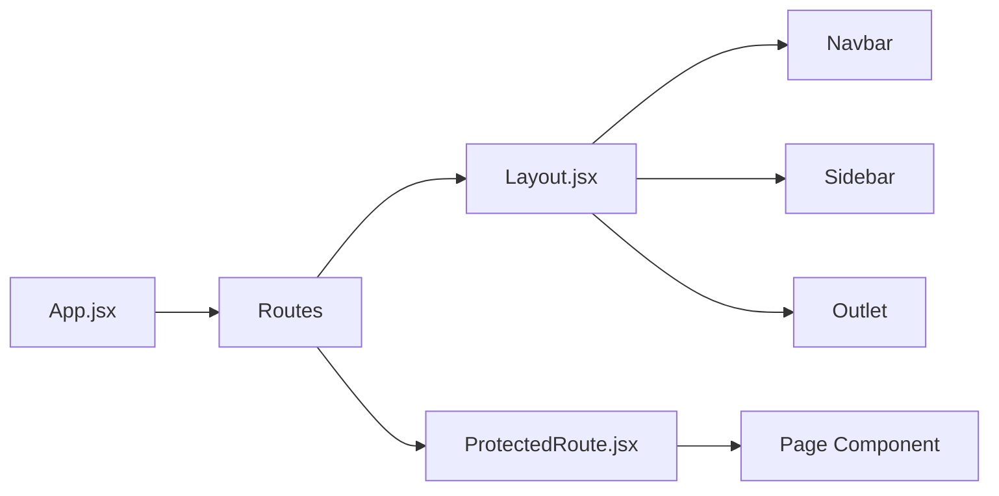
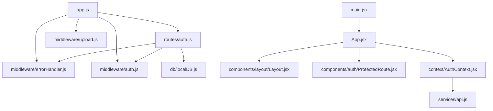

# Design Patterns

<cite>
**Referenced Files in This Document**
- [app.js](file://Backend/src/app.js)
- [localDB.js](file://Backend/src/db/localDB.js)
- [auth.js](file://Backend/src/middleware/auth.js)
- [errorHandler.js](file://Backend/src/middleware/errorHandler.js)
- [upload.js](file://Backend/src/middleware/upload.js)
- [AuthContext.jsx](file://Frontend/src/context/AuthContext.jsx)
- [api.js](file://Frontend/src/services/api.js)
- [App.jsx](file://Frontend/src/App.jsx)
- [main.jsx](file://Frontend/src/main.jsx)
- [Layout.jsx](file://Frontend/src/components/layout/Layout.jsx)
- [ProtectedRoute.jsx](file://Frontend/src/components/auth/ProtectedRoute.jsx)
- [auth.js](file://Backend/src/routes/auth.js)
- [User.js](file://Backend/src/models/User.js)
</cite>

## Table of Contents
1. [Introduction](#introduction)
2. [Project Structure](#project-structure)
3. [Core Components](#core-components)
4. [Architecture Overview](#architecture-overview)
5. [Detailed Component Analysis](#detailed-component-analysis)
6. [Dependency Analysis](#dependency-analysis)
7. [Performance Considerations](#performance-considerations)
8. [Troubleshooting Guide](#troubleshooting-guide)
9. [Conclusion](#conclusion)
10. [Appendices](#appendices)

## Introduction
This document explains the design patterns implemented in Trstprep V2’s backend and frontend. It focuses on:
- Context Pattern for state management in the frontend
- Factory Pattern for database abstraction
- Middleware Pattern for request processing
- Component Composition Pattern for UI structure
- Observer-like behavior in the authentication context
- Chain of Responsibility in middleware
- Service layer patterns and API design patterns

It also outlines benefits, alternatives, and implications for maintainability, extensibility, and testing.

## Project Structure
The application is split into two primary parts:
- Backend: Express server, middleware, routes, and a local JSON database abstraction
- Frontend: React application with context-based state, service layer, and component composition

**Diagram sources**
- [app.js](file://Backend/src/app.js#L24-L94)
- [auth.js](file://Backend/src/middleware/auth.js#L1-L92)
- [errorHandler.js](file://Backend/src/middleware/errorHandler.js#L1-L52)
- [upload.js](file://Backend/src/middleware/upload.js#L1-L91)
- [auth.js](file://Backend/src/routes/auth.js#L1-L174)
- [localDB.js](file://Backend/src/db/localDB.js#L1-L222)
- [main.jsx](file://Frontend/src/main.jsx#L1-L17)
- [App.jsx](file://Frontend/src/App.jsx#L1-L143)
- [Layout.jsx](file://Frontend/src/components/layout/Layout.jsx#L1-L87)
- [ProtectedRoute.jsx](file://Frontend/src/components/auth/ProtectedRoute.jsx#L1-L29)
- [AuthContext.jsx](file://Frontend/src/context/AuthContext.jsx#L1-L203)
- [api.js](file://Frontend/src/services/api.js#L1-L92)

**Section sources**
- [app.js](file://Backend/src/app.js#L1-L94)
- [main.jsx](file://Frontend/src/main.jsx#L1-L17)

## Core Components
- Backend Express app initializes middleware, routes, and database
- Local database abstraction centralizes CRUD operations
- Authentication middleware enforces token verification and roles
- Frontend AuthContext manages user state and exposes actions
- Service layer encapsulates HTTP requests and interceptors
- Component composition defines routing, layouts, and protected routes

**Section sources**
- [app.js](file://Backend/src/app.js#L24-L94)
- [localDB.js](file://Backend/src/db/localDB.js#L48-L80)
- [auth.js](file://Backend/src/middleware/auth.js#L5-L92)
- [AuthContext.jsx](file://Frontend/src/context/AuthContext.jsx#L13-L192)
- [api.js](file://Frontend/src/services/api.js#L4-L44)
- [App.jsx](file://Frontend/src/App.jsx#L42-L140)

## Architecture Overview
The system follows a layered architecture:
- Presentation layer (React components and routing)
- Service layer (Axios-based HTTP client with interceptors)
- Domain layer (Express routes and controllers)
- Infrastructure layer (Middleware and local database abstraction)

**Diagram sources**
- [App.jsx](file://Frontend/src/App.jsx#L1-L143)
- [Layout.jsx](file://Frontend/src/components/layout/Layout.jsx#L1-L87)
- [ProtectedRoute.jsx](file://Frontend/src/components/auth/ProtectedRoute.jsx#L1-L29)
- [AuthContext.jsx](file://Frontend/src/context/AuthContext.jsx#L1-L203)
- [api.js](file://Frontend/src/services/api.js#L1-L92)
- [auth.js](file://Backend/src/routes/auth.js#L1-L174)
- [auth.js](file://Backend/src/middleware/auth.js#L1-L92)
- [errorHandler.js](file://Backend/src/middleware/errorHandler.js#L1-L52)
- [upload.js](file://Backend/src/middleware/upload.js#L1-L91)
- [localDB.js](file://Backend/src/db/localDB.js#L1-L222)

## Detailed Component Analysis

### Context Pattern for State Management
The frontend uses React’s Context API to manage authentication state across components. The provider exposes actions (login, logout, updateProfile) and derived helpers (isAuthenticated, hasProPass). Consumers use a custom hook to access state and actions.

Key characteristics:
- Centralized state in a single provider
- Consumers subscribe to state changes via useContext
- Encapsulation of session persistence and token handling

Benefits:
- Eliminates prop drilling for auth state
- Simplifies cross-component communication
- Enables easy switching to a global state solution later

Alternatives:
- Redux Toolkit or Zustand for scalable state
- React Query for server state and caching

Testing implications:
- Mock the context provider for unit tests
- Isolate effects and localStorage interactions

**Diagram sources**
- [AuthContext.jsx](file://Frontend/src/context/AuthContext.jsx#L43-L98)
- [api.js](file://Frontend/src/services/api.js#L47-L53)
- [auth.js](file://Backend/src/routes/auth.js#L76-L124)

**Section sources**
- [AuthContext.jsx](file://Frontend/src/context/AuthContext.jsx#L1-L203)
- [api.js](file://Frontend/src/services/api.js#L1-L92)
- [auth.js](file://Backend/src/routes/auth.js#L1-L174)

### Factory Pattern for Database Abstraction
The backend implements a local database abstraction that centralizes CRUD operations. The module exports initialization and a helpers object with methods that operate uniformly across collections. This design allows swapping the underlying storage by replacing the module while keeping route handlers unchanged.

Key characteristics:
- Single initialization function
- Unified helpers for find, insert, update, delete, count
- Consistent behavior across collections

Benefits:
- Clean separation between routes and storage
- Easier migration to MongoDB by implementing the same interface
- Simplified testing with mocked helpers

Alternatives:
- ODM like Mongoose models for MongoDB
- Repository pattern with explicit interfaces

Testing implications:
- Inject a mock dbHelpers into route handlers
- Isolate initialization and file I/O

**Diagram sources**
- [localDB.js](file://Backend/src/db/localDB.js#L83-L219)
- [auth.js](file://Backend/src/routes/auth.js#L19-L71)

**Section sources**
- [localDB.js](file://Backend/src/db/localDB.js#L1-L222)
- [auth.js](file://Backend/src/routes/auth.js#L1-L174)

### Middleware Pattern for Request Processing
The backend applies middleware to enforce security, parse requests, serve static assets, log requests, and handle errors. The middleware chain follows a predictable order and uses a chain-of-responsibility approach where each middleware can either continue the chain or short-circuit with a response.

Key characteristics:
- Security middleware (Helmet, CORS)
- Request parsing and logging
- Route protection and role checks
- Centralized error handling

Benefits:
- Separation of cross-cutting concerns
- Reusable logic across routes
- Predictable request lifecycle

Alternatives:
- Koa or Fastify middleware stacks
- Custom pipeline builders

Testing implications:
- Compose middleware stacks for unit tests
- Mock environment variables and JWT

**Diagram sources**
- [app.js](file://Backend/src/app.js#L27-L66)
- [auth.js](file://Backend/src/middleware/auth.js#L5-L92)
- [errorHandler.js](file://Backend/src/middleware/errorHandler.js#L4-L51)

**Section sources**
- [app.js](file://Backend/src/app.js#L24-L94)
- [auth.js](file://Backend/src/middleware/auth.js#L1-L92)
- [errorHandler.js](file://Backend/src/middleware/errorHandler.js#L1-L52)

### Component Composition Pattern for UI Structure
The frontend composes pages and layouts using React Router. The main App component defines routes, wraps protected routes, and nests layouts. Components like Layout and ProtectedRoute encapsulate navigation and authentication logic, enabling clear separation of concerns.

Key characteristics:
- Route-driven composition
- Nested layouts and protected routes
- Minimal prop drilling via context

Benefits:
- Modular UI structure
- Easy to add new pages and layouts
- Clear separation between presentation and behavior

Alternatives:
- React Router v6 features like nested routes and loaders
- Custom composition libraries

Testing implications:
- Test routing and layout composition independently
- Mock context providers for component tests

**Diagram sources**
- [App.jsx](file://Frontend/src/App.jsx#L42-L140)
- [Layout.jsx](file://Frontend/src/components/layout/Layout.jsx#L8-L87)
- [ProtectedRoute.jsx](file://Frontend/src/components/auth/ProtectedRoute.jsx#L4-L29)

**Section sources**
- [App.jsx](file://Frontend/src/App.jsx#L1-L143)
- [Layout.jsx](file://Frontend/src/components/layout/Layout.jsx#L1-L87)
- [ProtectedRoute.jsx](file://Frontend/src/components/auth/ProtectedRoute.jsx#L1-L29)

### Authentication Context Observer Behavior
While not a formal observer pattern, the AuthContext exhibits observer-like behavior:
- State updates trigger re-renders for subscribed components
- Consumers react to user changes via the custom hook
- Session persistence and token lifecycle are centralized

Benefits:
- Reactive UI updates
- Centralized auth logic
- Predictable state transitions

Alternatives:
- Formal event bus or pub/sub
- Global state stores with subscriptions

Testing implications:
- Mock the provider and localStorage for isolated tests

**Section sources**
- [AuthContext.jsx](file://Frontend/src/context/AuthContext.jsx#L1-L203)

### Middleware Chain of Responsibility
The middleware chain demonstrates a chain of responsibility:
- Each middleware decides whether to continue or return an error
- Order matters: security, parsing, logging, routes, error handling
- Optional auth middleware attaches user context without failing

Benefits:
- Flexible request processing
- Easy to add/remove cross-cutting concerns
- Clear failure points

Alternatives:
- Pipeline middleware builders
- Decorator-style middleware

Testing implications:
- Compose middleware stacks for unit tests
- Validate early exits and error responses

**Section sources**
- [auth.js](file://Backend/src/middleware/auth.js#L5-L92)
- [errorHandler.js](file://Backend/src/middleware/errorHandler.js#L4-L51)

### Service Layer Patterns and API Design
The frontend service layer encapsulates HTTP requests and interceptors:
- Axios instance with base URL and timeout
- Request interceptor adds auth tokens
- Response interceptor handles 401 and network errors
- Grouped API modules for domain boundaries

Benefits:
- Centralized HTTP logic
- Consistent error handling
- Easy to mock for tests

Alternatives:
- SWR or React Query for caching and server state
- Custom hooks per domain

Testing implications:
- Mock axios instance
- Isolate interceptors and domain modules

**Section sources**
- [api.js](file://Frontend/src/services/api.js#L1-L92)

### Upload Middleware Implementation
The upload middleware leverages Multer to:
- Ensure upload directories exist
- Route files to appropriate subfolders by MIME type
- Filter allowed file types and enforce size limits
- Provide a helper to build public URLs

Benefits:
- Structured file organization
- Type-safe uploads
- Centralized configuration

Alternatives:
- Cloud storage SDKs with signed URLs
- Stream-based uploaders for large files

Testing implications:
- Mock filesystem and Multer behavior
- Validate file filters and destinations

**Section sources**
- [upload.js](file://Backend/src/middleware/upload.js#L1-L91)

## Dependency Analysis
The backend depends on Express and middleware modules, while the frontend depends on React and service-layer modules. The routes depend on the database abstraction and middleware.

**Diagram sources**
- [app.js](file://Backend/src/app.js#L14-L22)
- [auth.js](file://Backend/src/routes/auth.js#L1-L7)
- [errorHandler.js](file://Backend/src/middleware/errorHandler.js#L1-L52)
- [auth.js](file://Backend/src/middleware/auth.js#L1-L92)
- [upload.js](file://Backend/src/middleware/upload.js#L1-L91)
- [localDB.js](file://Backend/src/db/localDB.js#L1-L222)
- [main.jsx](file://Frontend/src/main.jsx#L1-L17)
- [App.jsx](file://Frontend/src/App.jsx#L1-L143)
- [Layout.jsx](file://Frontend/src/components/layout/Layout.jsx#L1-L87)
- [ProtectedRoute.jsx](file://Frontend/src/components/auth/ProtectedRoute.jsx#L1-L29)
- [AuthContext.jsx](file://Frontend/src/context/AuthContext.jsx#L1-L203)
- [api.js](file://Frontend/src/services/api.js#L1-L92)

**Section sources**
- [app.js](file://Backend/src/app.js#L1-L94)
- [main.jsx](file://Frontend/src/main.jsx#L1-L17)

## Performance Considerations
- Local JSON database: suitable for development and small scale; consider indexing and pagination for larger datasets
- Middleware order: keep lightweight middlewares early to minimize overhead
- Service layer: configure timeouts and retries thoughtfully
- Component composition: lazy-load heavy pages to improve initial render performance

## Troubleshooting Guide
Common issues and resolutions:
- Authentication failures: verify JWT secret, token expiration, and user existence
- Database not initialized: ensure initialization runs before routes are mounted
- Upload errors: confirm directory permissions and file type filters
- Frontend redirects: inspect interceptors and localStorage state

**Section sources**
- [errorHandler.js](file://Backend/src/middleware/errorHandler.js#L11-L51)
- [localDB.js](file://Backend/src/db/localDB.js#L48-L80)
- [upload.js](file://Backend/src/middleware/upload.js#L11-L25)
- [api.js](file://Frontend/src/services/api.js#L27-L44)

## Conclusion
Trstprep V2 applies several design patterns effectively:
- Context Pattern centralizes authentication state
- Factory Pattern abstracts database operations
- Middleware Pattern cleanly separates cross-cutting concerns
- Component Composition Pattern organizes UI structure
- Service Layer Pattern consolidates HTTP logic

These patterns enhance maintainability, extensibility, and testability. The codebase is structured to support future migrations (e.g., to MongoDB) and advanced state management solutions.

## Appendices
- Maintainability: Keep abstractions thin; favor small, focused modules
- Extensibility: Add new middleware or database adapters by adhering to established interfaces
- Testing: Use mocks for context, interceptors, and database helpers; compose middleware stacks for unit tests

*Last Updated: March 10, 2026 | Update date is (20:16)*
