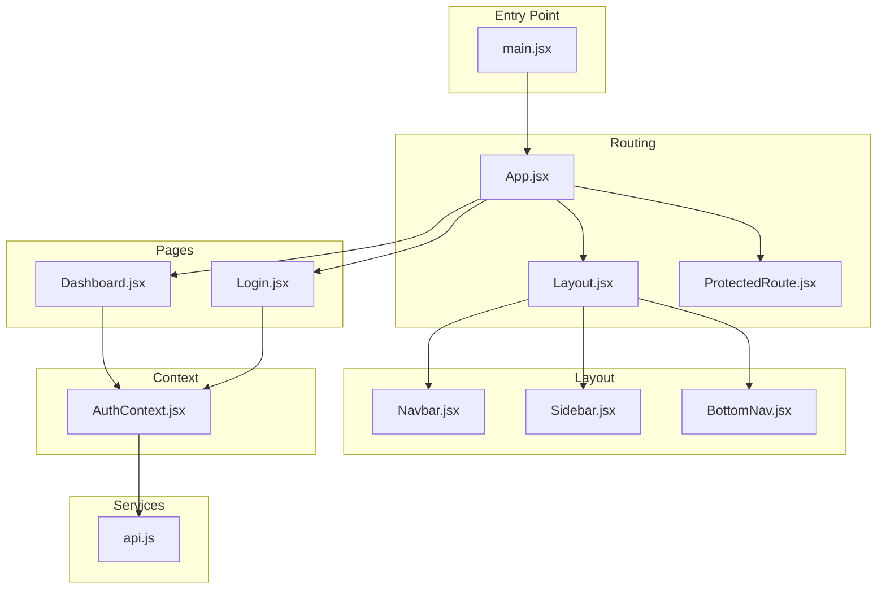
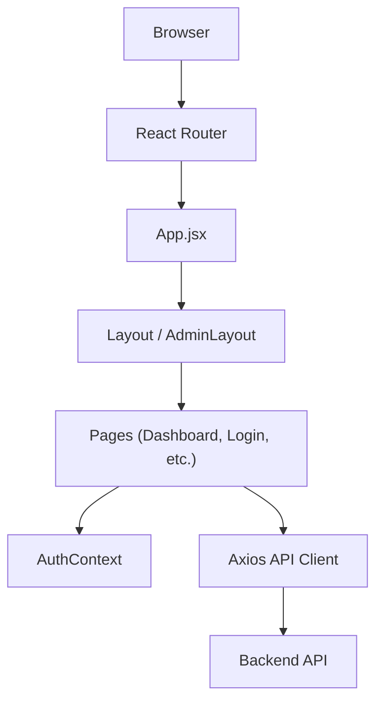
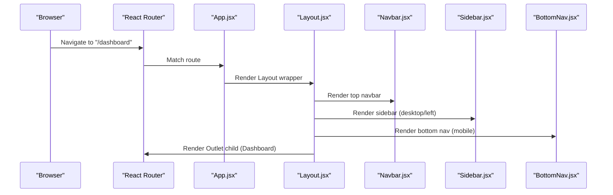
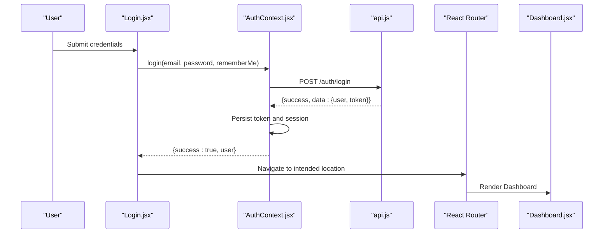
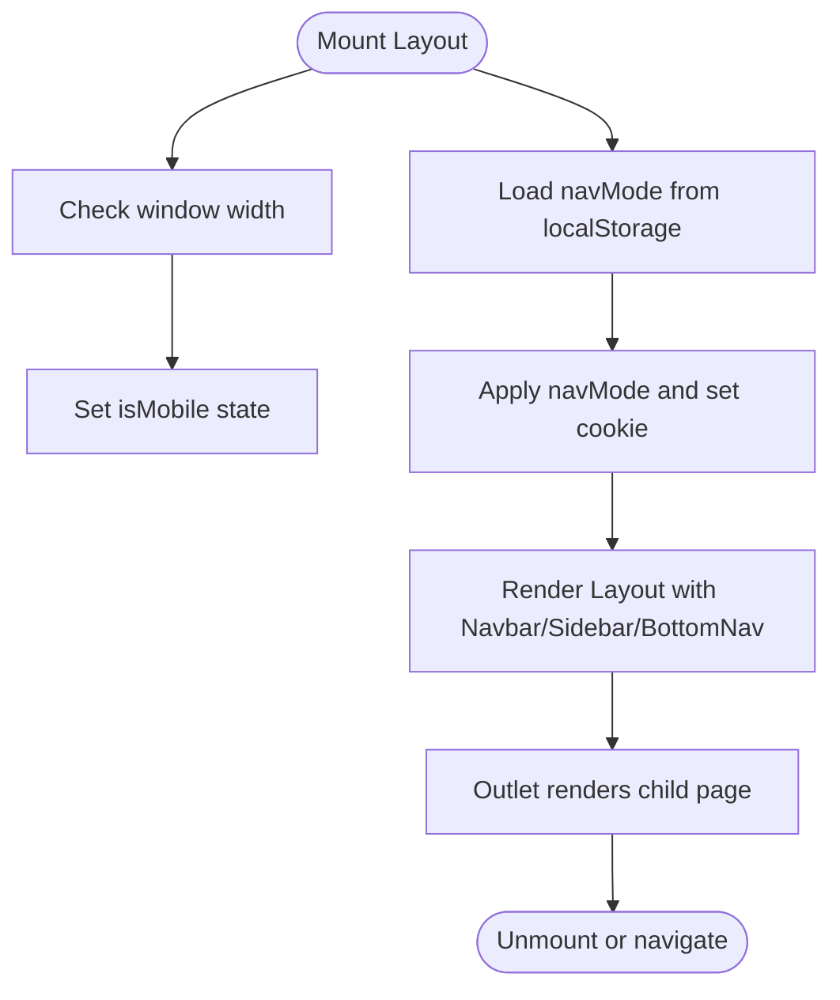
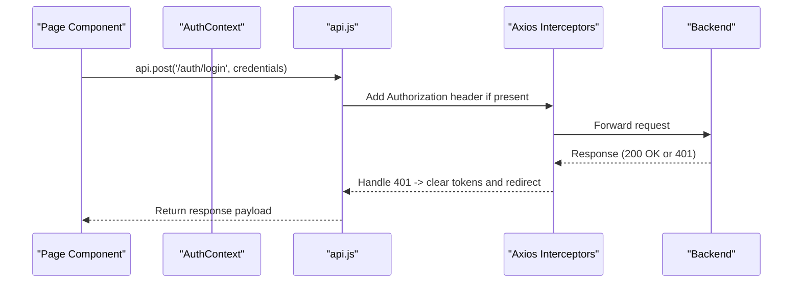
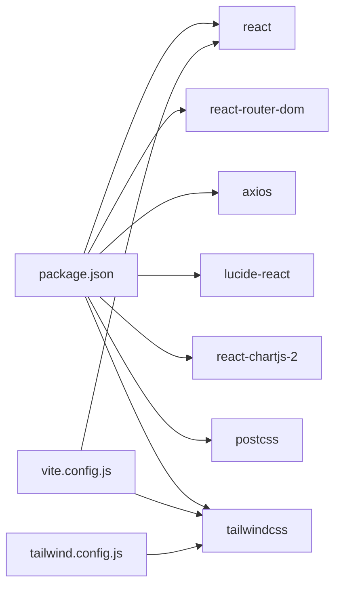

# Frontend Architecture

<cite>
**Referenced Files in This Document**
- [App.jsx](file://Frontend/src/App.jsx)
- [main.jsx](file://Frontend/src/main.jsx)
- [AuthContext.jsx](file://Frontend/src/context/AuthContext.jsx)
- [ProtectedRoute.jsx](file://Frontend/src/components/auth/ProtectedRoute.jsx)
- [Layout.jsx](file://Frontend/src/components/layout/Layout.jsx)
- [Navbar.jsx](file://Frontend/src/components/layout/Navbar.jsx)
- [Sidebar.jsx](file://Frontend/src/components/layout/Sidebar.jsx)
- [BottomNav.jsx](file://Frontend/src/components/layout/BottomNav.jsx)
- [api.js](file://Frontend/src/services/api.js)
- [Dashboard.jsx](file://Frontend/src/pages/Dashboard.jsx)
- [Login.jsx](file://Frontend/src/pages/Login.jsx)
- [vite.config.js](file://Frontend/vite.config.js)
- [tailwind.config.js](file://Frontend/tailwind.config.js)
- [package.json](file://Frontend/package.json)
</cite>

## Table of Contents
1. [Introduction](#introduction)
2. [Project Structure](#project-structure)
3. [Core Components](#core-components)
4. [Architecture Overview](#architecture-overview)
5. [Detailed Component Analysis](#detailed-component-analysis)
6. [Dependency Analysis](#dependency-analysis)
7. [Performance Considerations](#performance-considerations)
8. [Troubleshooting Guide](#troubleshooting-guide)
9. [Conclusion](#conclusion)

## Introduction
This document describes the frontend architecture of Trstprep V2’s React application. It focuses on the component hierarchy starting from the root App, layout components (Layout, Navbar, Sidebar, BottomNav), authentication context (AuthContext), and the service layer for API communication. It also explains routing with React Router, component composition patterns, state management strategies, lifecycle considerations, and how the app integrates with the backend via Axios. Finally, it covers build configuration with Vite, styling with TailwindCSS, responsive design patterns, and performance optimization techniques.

## Project Structure
The frontend is organized around a clear separation of concerns:
- Root entry initializes routing, context providers, and styles.
- Routing defines public and protected routes, nested layouts, and admin routes.
- Layout components encapsulate navigation and responsive behavior.
- Authentication context centralizes user state and session management.
- Services abstract API communication and interceptors.
- Pages implement domain-specific UI and orchestrate data fetching.

**Diagram sources**
- [main.jsx](file://Frontend/src/main.jsx#L1-L17)
- [App.jsx](file://Frontend/src/App.jsx#L1-L143)
- [Layout.jsx](file://Frontend/src/components/layout/Layout.jsx#L1-L87)
- [Navbar.jsx](file://Frontend/src/components/layout/Navbar.jsx#L1-L217)
- [Sidebar.jsx](file://Frontend/src/components/layout/Sidebar.jsx#L1-L186)
- [BottomNav.jsx](file://Frontend/src/components/layout/BottomNav.jsx#L1-L109)
- [AuthContext.jsx](file://Frontend/src/context/AuthContext.jsx#L1-L203)
- [api.js](file://Frontend/src/services/api.js#L1-L92)
- [Dashboard.jsx](file://Frontend/src/pages/Dashboard.jsx#L1-L330)
- [Login.jsx](file://Frontend/src/pages/Login.jsx#L1-L212)

**Section sources**
- [main.jsx](file://Frontend/src/main.jsx#L1-L17)
- [App.jsx](file://Frontend/src/App.jsx#L1-L143)

## Core Components
- App: Declares routes, layout wrappers, protected routes, and admin routes. It renders a loading spinner during initialization.
- Layout: Provides top Navbar, Sidebar, BottomNav, and outlet rendering. Manages responsive behavior and navigation modes.
- Navbar: Desktop navigation, search overlay, notifications, dark mode toggle, and user profile dropdown with role-aware actions.
- Sidebar: Collapsible drawer with categorized links and sticky auth section.
- BottomNav: Mobile-first navigation with role-aware items and live indicators.
- AuthContext: Centralized authentication state, session persistence, login/signup/logout/update, and Pro pass checks.
- ProtectedRoute: Guards routes requiring authentication with a loader and redirect.
- Services: Axios instance with interceptors, grouped API modules for auth, series, tests, user, and study.

**Section sources**
- [App.jsx](file://Frontend/src/App.jsx#L42-L140)
- [Layout.jsx](file://Frontend/src/components/layout/Layout.jsx#L8-L84)
- [Navbar.jsx](file://Frontend/src/components/layout/Navbar.jsx#L6-L214)
- [Sidebar.jsx](file://Frontend/src/components/layout/Sidebar.jsx#L5-L183)
- [BottomNav.jsx](file://Frontend/src/components/layout/BottomNav.jsx#L5-L105)
- [AuthContext.jsx](file://Frontend/src/context/AuthContext.jsx#L13-L191)
- [ProtectedRoute.jsx](file://Frontend/src/components/auth/ProtectedRoute.jsx#L4-L26)
- [api.js](file://Frontend/src/services/api.js#L4-L91)

## Architecture Overview
The application follows a layered architecture:
- Presentation Layer: App, Layout, and page components.
- Routing Layer: React Router with nested routes and layout wrappers.
- State Management: React Context (AuthContext) for global user/session state.
- Service Layer: Axios-based API client with interceptors for auth tokens and error handling.
- Styling: TailwindCSS with custom theme extensions.

**Diagram sources**
- [App.jsx](file://Frontend/src/App.jsx#L62-L139)
- [Layout.jsx](file://Frontend/src/components/layout/Layout.jsx#L43-L82)
- [AuthContext.jsx](file://Frontend/src/context/AuthContext.jsx#L13-L191)
- [api.js](file://Frontend/src/services/api.js#L4-L44)

## Detailed Component Analysis

### Routing and Layout Composition
- App defines:
  - Public routes (Login, Signup).
  - Full-screen test interface routes (no layout).
  - Main layout routes under Layout wrapper.
  - Admin routes under ProtectedRoute and AdminLayout wrapper.
  - Catch-all 404 route.
- Layout composes Navbar, Sidebar, BottomNav, and Outlet, with responsive behavior and navigation mode preferences persisted to localStorage.

**Diagram sources**
- [App.jsx](file://Frontend/src/App.jsx#L85-L117)
- [Layout.jsx](file://Frontend/src/components/layout/Layout.jsx#L43-L82)
- [Navbar.jsx](file://Frontend/src/components/layout/Navbar.jsx#L37-L184)
- [Sidebar.jsx](file://Frontend/src/components/layout/Sidebar.jsx#L21-L181)
- [BottomNav.jsx](file://Frontend/src/components/layout/BottomNav.jsx#L48-L104)

**Section sources**
- [App.jsx](file://Frontend/src/App.jsx#L62-L139)
- [Layout.jsx](file://Frontend/src/components/layout/Layout.jsx#L8-L84)

### Authentication Flow and Context Usage
- AuthContext manages:
  - Session restoration from localStorage on mount.
  - Login via backend API call and storing session with optional “remember me” expiration.
  - Signup with demo logic and session creation.
  - Logout clearing sessions and tokens.
  - Profile updates and Pro pass checks.
- ProtectedRoute enforces authentication with a loading state and redirects unauthenticated users to Login.

**Diagram sources**
- [Login.jsx](file://Frontend/src/pages/Login.jsx#L19-L36)
- [AuthContext.jsx](file://Frontend/src/context/AuthContext.jsx#L43-L98)
- [api.js](file://Frontend/src/services/api.js#L47-L53)
- [ProtectedRoute.jsx](file://Frontend/src/components/auth/ProtectedRoute.jsx#L4-L26)
- [Dashboard.jsx](file://Frontend/src/pages/Dashboard.jsx#L54-L67)

**Section sources**
- [AuthContext.jsx](file://Frontend/src/context/AuthContext.jsx#L13-L191)
- [ProtectedRoute.jsx](file://Frontend/src/components/auth/ProtectedRoute.jsx#L4-L26)
- [Login.jsx](file://Frontend/src/pages/Login.jsx#L6-L36)

### Component Lifecycle and Prop Drilling Solutions
- Layout uses useEffect to detect mobile viewport and persist navigation mode preference to localStorage.
- Navbar and BottomNav compute active states based on current location.
- AuthContext centralizes state to avoid prop drilling across pages and layout components.
- ProtectedRoute handles loading while auth is being validated.

**Diagram sources**
- [Layout.jsx](file://Frontend/src/components/layout/Layout.jsx#L14-L41)

**Section sources**
- [Layout.jsx](file://Frontend/src/components/layout/Layout.jsx#L8-L84)
- [Navbar.jsx](file://Frontend/src/components/layout/Navbar.jsx#L32-L35)
- [BottomNav.jsx](file://Frontend/src/components/layout/BottomNav.jsx#L43-L46)

### Service Layer and Backend Integration
- Axios instance configured with baseURL, timeout, and interceptors.
- Interceptors attach Authorization header and handle 401 by clearing sessions and redirecting to Login.
- API module exposes typed groups: authAPI, seriesAPI, testsAPI, userAPI, studyAPI.

**Diagram sources**
- [api.js](file://Frontend/src/services/api.js#L4-L44)
- [AuthContext.jsx](file://Frontend/src/context/AuthContext.jsx#L48-L98)

**Section sources**
- [api.js](file://Frontend/src/services/api.js#L4-L91)
- [AuthContext.jsx](file://Frontend/src/context/AuthContext.jsx#L43-L98)

### Responsive Design Patterns
- Layout switches between top navbar and left sidebar based on navMode and viewport width.
- BottomNav appears on mobile with role-aware items and live indicators.
- Tailwind utilities and custom theme (brand colors, shadows, radii) ensure consistent styling across breakpoints.

**Section sources**
- [Layout.jsx](file://Frontend/src/components/layout/Layout.jsx#L41-L82)
- [BottomNav.jsx](file://Frontend/src/components/layout/BottomNav.jsx#L10-L39)
- [tailwind.config.js](file://Frontend/tailwind.config.js#L7-L32)

## Dependency Analysis
- Runtime dependencies include React, React Router DOM, Axios, Lucide icons, Chart.js, and PostCSS/Tailwind toolchain.
- Build tooling uses Vite with React plugin, dev server, proxy to backend, and source maps enabled in builds.
- Tailwind scans templates and components for unused CSS.

**Diagram sources**
- [package.json](file://Frontend/package.json#L12-L33)
- [vite.config.js](file://Frontend/vite.config.js#L1-L21)
- [tailwind.config.js](file://Frontend/tailwind.config.js#L1-L33)

**Section sources**
- [package.json](file://Frontend/package.json#L12-L33)
- [vite.config.js](file://Frontend/vite.config.js#L5-L20)
- [tailwind.config.js](file://Frontend/tailwind.config.js#L1-L33)

## Performance Considerations
- Code splitting: Group routes into separate page modules to enable lazy loading. This reduces initial bundle size and improves perceived performance.
- Component memoization: Wrap heavy components with memoization to prevent unnecessary re-renders.
- Image optimization: Lazy-load images and use appropriate sizes/resolution.
- Network optimization: Reuse Axios instance, leverage caching strategies, and minimize redundant requests.
- Bundle analysis: Use Vite’s built-in preview and profiling tools to identify large dependencies.
- Dev workflow: Enable tree-shaking and ensure only used icons/styles are included.

[No sources needed since this section provides general guidance]

## Troubleshooting Guide
- Authentication redirects loop:
  - Verify localStorage token/session validity and expiration logic.
  - Confirm interceptors remove stale tokens on 401 and redirect to Login.
- Protected routes show loader indefinitely:
  - Ensure AuthContext completes session restoration before rendering ProtectedRoute.
- API errors:
  - Check baseURL and proxy configuration in Vite.
  - Inspect interceptor error handling and network tab for failures.
- Styling issues:
  - Ensure Tailwind content globs match component paths.
  - Verify custom theme variables are applied consistently.

**Section sources**
- [AuthContext.jsx](file://Frontend/src/context/AuthContext.jsx#L18-L40)
- [api.js](file://Frontend/src/services/api.js#L26-L44)
- [vite.config.js](file://Frontend/vite.config.js#L7-L15)
- [tailwind.config.js](file://Frontend/tailwind.config.js#L3-L6)

## Conclusion
Trstprep V2’s frontend employs a clean, layered architecture with React Router for routing, a robust AuthContext for global state, and an Axios-based service layer for backend integration. The layout system adapts seamlessly across devices, and the build pipeline with Vite and TailwindCSS supports rapid iteration and consistent styling. Adopting code splitting and performance best practices will further enhance user experience and maintainability.

*Last Updated: March 10, 2026 | Update date is (20:16)*
