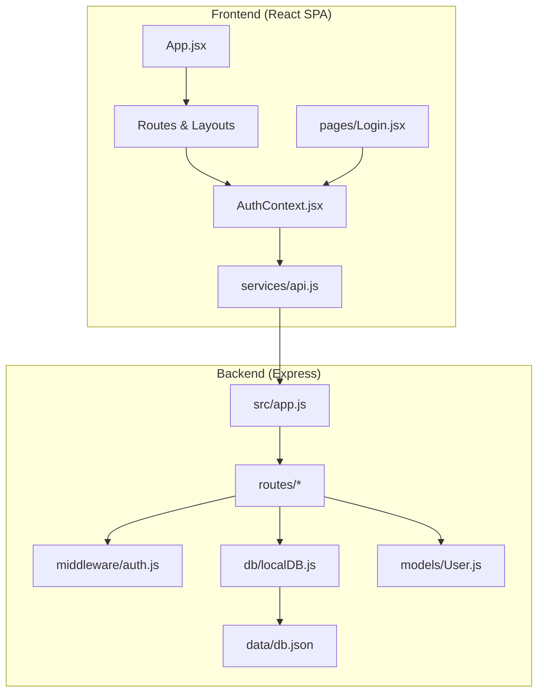
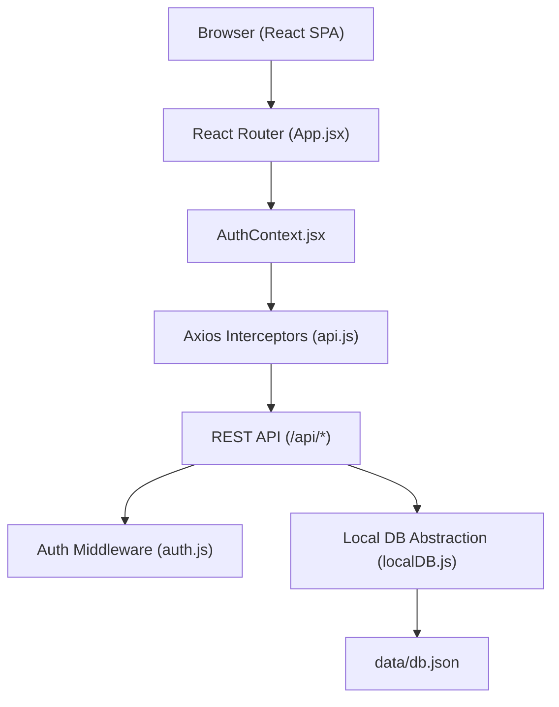
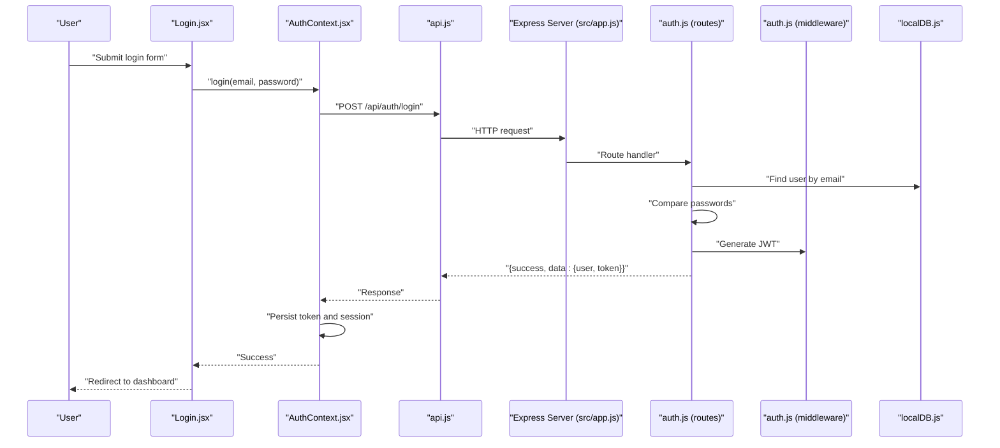
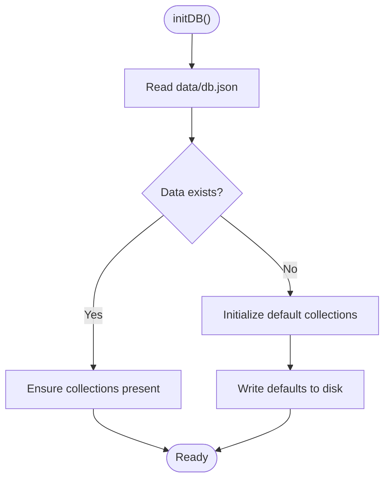
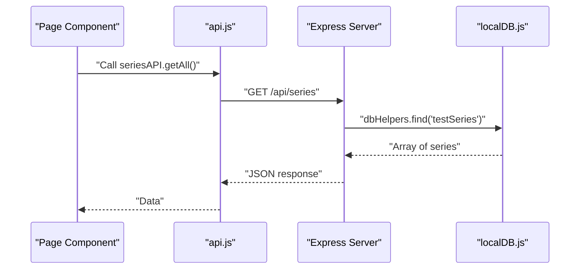
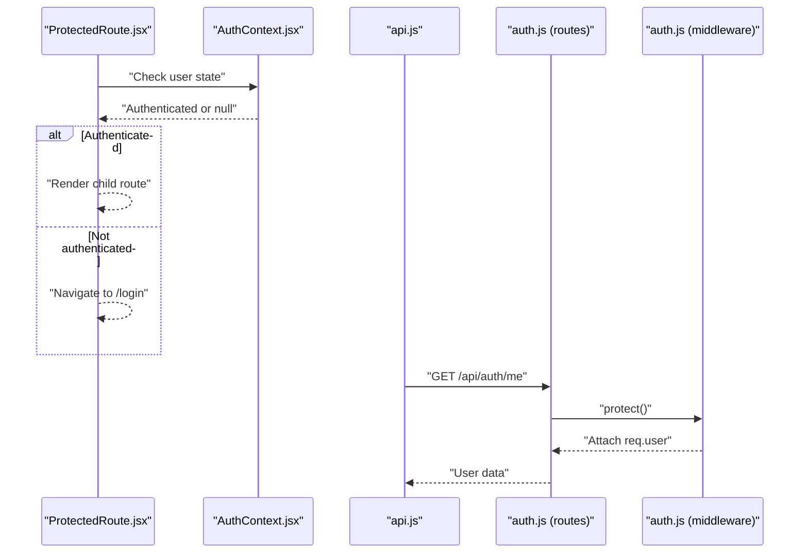
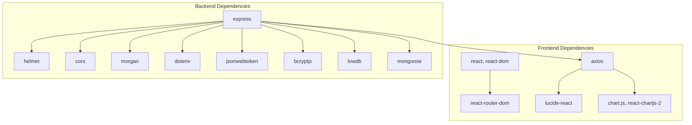

# System Design

<cite>
**Referenced Files in This Document**
- [Backend/package.json](file://Backend/package.json)
- [Backend/src/app.js](file://Backend/src/app.js)
- [Backend/.env.example](file://Backend/.env.example)
- [Backend/src/middleware/auth.js](file://Backend/src/middleware/auth.js)
- [Backend/src/db/localDB.js](file://Backend/src/db/localDB.js)
- [Backend/src/models/User.js](file://Backend/src/models/User.js)
- [Backend/src/routes/auth.js](file://Backend/src/routes/auth.js)
- [Backend/src/routes/users.js](file://Backend/src/routes/users.js)
- [Backend/data/db.json](file://Backend/data/db.json)
- [Frontend/package.json](file://Frontend/package.json)
- [Frontend/src/App.jsx](file://Frontend/src/App.jsx)
- [Frontend/src/context/AuthContext.jsx](file://Frontend/src/context/AuthContext.jsx)
- [Frontend/src/components/auth/ProtectedRoute.jsx](file://Frontend/src/components/auth/ProtectedRoute.jsx)
- [Frontend/src/services/api.js](file://Frontend/src/services/api.js)
- [Frontend/src/pages/Login.jsx](file://Frontend/src/pages/Login.jsx)
</cite>

## Table of Contents
1. [Introduction](#introduction)
2. [Project Structure](#project-structure)
3. [Core Components](#core-components)
4. [Architecture Overview](#architecture-overview)
5. [Detailed Component Analysis](#detailed-component-analysis)
6. [Dependency Analysis](#dependency-analysis)
7. [Performance Considerations](#performance-considerations)
8. [Troubleshooting Guide](#troubleshooting-guide)
9. [Conclusion](#conclusion)
10. [Appendices](#appendices)

## Introduction
This document describes the system design of Trstprep V2, a modern exam preparation platform consisting of a React Single Page Application (SPA) frontend and an Express.js backend with a local JSON database abstraction layer. The system emphasizes modularity, clear separation of concerns, and straightforward client-server communication via RESTful APIs. It also outlines the authentication model, data flow, scalability considerations, and deployment topology.

## Project Structure
Trstprep V2 follows a clear separation between the frontend and backend:
- Frontend: React SPA built with Vite, using React Router for navigation, Axios for HTTP requests, and Tailwind CSS for styling.
- Backend: Express.js server with modular route handlers, middleware for authentication and error handling, and a local JSON database abstraction layer using lowdb.
- Shared context: Authentication state is managed in the frontend using a React context provider and persisted in localStorage.

**Diagram sources**
- [Frontend/src/App.jsx](file://Frontend/src/App.jsx#L1-L143)
- [Frontend/src/context/AuthContext.jsx](file://Frontend/src/context/AuthContext.jsx#L1-L203)
- [Frontend/src/services/api.js](file://Frontend/src/services/api.js#L1-L92)
- [Frontend/src/pages/Login.jsx](file://Frontend/src/pages/Login.jsx#L1-L212)
- [Backend/src/app.js](file://Backend/src/app.js#L1-L94)
- [Backend/src/middleware/auth.js](file://Backend/src/middleware/auth.js#L1-L92)
- [Backend/src/db/localDB.js](file://Backend/src/db/localDB.js#L1-L221)
- [Backend/src/models/User.js](file://Backend/src/models/User.js#L1-L81)
- [Backend/data/db.json](file://Backend/data/db.json#L1-L200)

**Section sources**
- [Backend/package.json](file://Backend/package.json#L1-L32)
- [Frontend/package.json](file://Frontend/package.json#L1-L35)
- [Backend/src/app.js](file://Backend/src/app.js#L1-L94)
- [Frontend/src/App.jsx](file://Frontend/src/App.jsx#L1-L143)

## Core Components
- Frontend SPA
  - Routing: Centralized in App.jsx with protected routes and nested layouts.
  - Authentication: AuthContext manages login, logout, session persistence, and user state.
  - HTTP client: services/api.js encapsulates API endpoints and interceptors for auth tokens and error handling.
  - UI pages: Feature-specific pages for login, dashboard, test series, study materials, and admin panels.
- Backend API
  - Express server: Initializes middleware, routes, and database; exposes health endpoint and API routes.
  - Authentication middleware: Validates JWT tokens, supports optional auth, and enforces admin/pro-pass roles.
  - Database abstraction: lowdb-backed local JSON database with helper functions mimicking MongoDB operations.
  - Models: Mongoose model for User with password hashing and Pro Pass validation helpers.
  - Routes: Modular endpoints for auth, users, series, tests, study materials, and admin functions.
- Data
  - Local JSON database: Pre-populated seed data under data/db.json with collections for users, tests, study materials, and app configuration.

**Section sources**
- [Frontend/src/App.jsx](file://Frontend/src/App.jsx#L1-L143)
- [Frontend/src/context/AuthContext.jsx](file://Frontend/src/context/AuthContext.jsx#L1-L203)
- [Frontend/src/services/api.js](file://Frontend/src/services/api.js#L1-L92)
- [Backend/src/app.js](file://Backend/src/app.js#L1-L94)
- [Backend/src/middleware/auth.js](file://Backend/src/middleware/auth.js#L1-L92)
- [Backend/src/db/localDB.js](file://Backend/src/db/localDB.js#L1-L221)
- [Backend/src/models/User.js](file://Backend/src/models/User.js#L1-L81)
- [Backend/src/routes/auth.js](file://Backend/src/routes/auth.js#L1-L174)
- [Backend/src/routes/users.js](file://Backend/src/routes/users.js#L1-L150)
- [Backend/data/db.json](file://Backend/data/db.json#L1-L200)

## Architecture Overview
Trstprep V2 employs a client-server architecture:
- Frontend (React SPA) communicates with the backend via RESTful HTTP endpoints.
- Authentication uses JWT tokens stored in localStorage; the frontend’s Axios interceptor automatically attaches the Authorization header.
- The backend validates tokens via middleware and serves data from a local JSON database abstraction layer.
- The system is designed to support migration to MongoDB by switching the database initialization and model usage.

**Diagram sources**
- [Frontend/src/App.jsx](file://Frontend/src/App.jsx#L1-L143)
- [Frontend/src/context/AuthContext.jsx](file://Frontend/src/context/AuthContext.jsx#L1-L203)
- [Frontend/src/services/api.js](file://Frontend/src/services/api.js#L1-L92)
- [Backend/src/app.js](file://Backend/src/app.js#L1-L94)
- [Backend/src/middleware/auth.js](file://Backend/src/middleware/auth.js#L1-L92)
- [Backend/src/db/localDB.js](file://Backend/src/db/localDB.js#L1-L221)
- [Backend/data/db.json](file://Backend/data/db.json#L1-L200)

## Detailed Component Analysis

### Authentication System
The authentication system spans the frontend and backend:
- Frontend
  - AuthContext stores user session and token in localStorage, supports login/signup, logout, and profile updates.
  - ProtectedRoute enforces authentication for protected pages.
  - Login page handles form submission and redirects on success.
- Backend
  - JWT-based authentication with secret and expiration configured via environment variables.
  - Routes for registration, login, profile retrieval, and logout.
  - Middleware verifies tokens, attaches user info to requests, and enforces admin/pro-pass permissions.

**Diagram sources**
- [Frontend/src/pages/Login.jsx](file://Frontend/src/pages/Login.jsx#L1-L212)
- [Frontend/src/context/AuthContext.jsx](file://Frontend/src/context/AuthContext.jsx#L1-L203)
- [Frontend/src/services/api.js](file://Frontend/src/services/api.js#L1-L92)
- [Backend/src/app.js](file://Backend/src/app.js#L1-L94)
- [Backend/src/routes/auth.js](file://Backend/src/routes/auth.js#L1-L174)
- [Backend/src/middleware/auth.js](file://Backend/src/middleware/auth.js#L1-L92)
- [Backend/src/db/localDB.js](file://Backend/src/db/localDB.js#L1-L221)

**Section sources**
- [Frontend/src/context/AuthContext.jsx](file://Frontend/src/context/AuthContext.jsx#L1-L203)
- [Frontend/src/components/auth/ProtectedRoute.jsx](file://Frontend/src/components/auth/ProtectedRoute.jsx#L1-L29)
- [Frontend/src/pages/Login.jsx](file://Frontend/src/pages/Login.jsx#L1-L212)
- [Frontend/src/services/api.js](file://Frontend/src/services/api.js#L1-L92)
- [Backend/src/routes/auth.js](file://Backend/src/routes/auth.js#L1-L174)
- [Backend/src/middleware/auth.js](file://Backend/src/middleware/auth.js#L1-L92)
- [Backend/.env.example](file://Backend/.env.example#L1-L17)

### Database Abstraction Layer
The backend uses a local JSON database abstraction layer:
- Initialization: lowdb reads/writes to data/db.json, ensuring default collections exist.
- Helpers: emulate MongoDB-style operations (find, findOne, insertOne, updateOne, deleteOne, count).
- Migration path: The server logs guidance to migrate to MongoDB by updating the connection in app.js.

**Diagram sources**
- [Backend/src/db/localDB.js](file://Backend/src/db/localDB.js#L1-L221)
- [Backend/data/db.json](file://Backend/data/db.json#L1-L200)
- [Backend/src/app.js](file://Backend/src/app.js#L68-L78)

**Section sources**
- [Backend/src/db/localDB.js](file://Backend/src/db/localDB.js#L1-L221)
- [Backend/src/app.js](file://Backend/src/app.js#L68-L78)
- [Backend/data/db.json](file://Backend/data/db.json#L1-L200)

### API Integration Strategies
- Frontend API module centralizes endpoint definitions and request/response interceptors.
- Interceptors attach Authorization headers and handle 401 responses by clearing session and redirecting to login.
- Pages consume API modules to fetch data and manage state transitions.

**Diagram sources**
- [Frontend/src/services/api.js](file://Frontend/src/services/api.js#L1-L92)
- [Backend/src/db/localDB.js](file://Backend/src/db/localDB.js#L82-L102)

**Section sources**
- [Frontend/src/services/api.js](file://Frontend/src/services/api.js#L1-L92)
- [Backend/src/db/localDB.js](file://Backend/src/db/localDB.js#L82-L102)

### Data Flow Between Components
- Authentication flow: Login page triggers AuthContext.login, which calls the backend auth route, receives a JWT, persists it, and sets user session.
- Protected routing: ProtectedRoute checks authentication state and redirects unauthenticated users to login.
- API consumption: Pages import API modules to perform CRUD operations against backend endpoints.

**Diagram sources**
- [Frontend/src/components/auth/ProtectedRoute.jsx](file://Frontend/src/components/auth/ProtectedRoute.jsx#L1-L29)
- [Frontend/src/context/AuthContext.jsx](file://Frontend/src/context/AuthContext.jsx#L1-L203)
- [Frontend/src/services/api.js](file://Frontend/src/services/api.js#L1-L92)
- [Backend/src/routes/auth.js](file://Backend/src/routes/auth.js#L126-L161)
- [Backend/src/middleware/auth.js](file://Backend/src/middleware/auth.js#L1-L92)

**Section sources**
- [Frontend/src/components/auth/ProtectedRoute.jsx](file://Frontend/src/components/auth/ProtectedRoute.jsx#L1-L29)
- [Frontend/src/context/AuthContext.jsx](file://Frontend/src/context/AuthContext.jsx#L1-L203)
- [Frontend/src/services/api.js](file://Frontend/src/services/api.js#L1-L92)
- [Backend/src/routes/auth.js](file://Backend/src/routes/auth.js#L126-L161)
- [Backend/src/middleware/auth.js](file://Backend/src/middleware/auth.js#L1-L92)

## Dependency Analysis
- Frontend dependencies
  - React ecosystem: react, react-router-dom for routing; lucide-react for icons; chart.js and react-chartjs-2 for analytics visuals.
  - HTTP client: axios for API communication; interceptors for auth and error handling.
- Backend dependencies
  - Express stack: helmet for security headers, cors for cross-origin, morgan for logging, dotenv for environment variables.
  - Authentication: jsonwebtoken for JWT, bcryptjs for password hashing.
  - Database: lowdb for local JSON storage; mongoose for modeling and MongoDB compatibility.

**Diagram sources**
- [Frontend/package.json](file://Frontend/package.json#L1-L35)
- [Backend/package.json](file://Backend/package.json#L1-L32)

**Section sources**
- [Frontend/package.json](file://Frontend/package.json#L1-L35)
- [Backend/package.json](file://Backend/package.json#L1-L32)

## Performance Considerations
- Database choice: The current local JSON database is suitable for development and small-scale usage. For higher concurrency and larger datasets, consider migrating to MongoDB with proper indexing and connection pooling.
- Caching: Introduce HTTP caching headers for read-heavy endpoints and client-side caching for frequently accessed resources.
- Asset optimization: Compress images and videos, enable CDN delivery, and lazy-load non-critical assets.
- Network efficiency: Batch API requests where possible, implement pagination for lists, and debounce user inputs for search/filter endpoints.
- Authentication: Keep JWT payload minimal; rotate secrets regularly; avoid storing sensitive data in localStorage; consider refresh tokens for long sessions.

## Troubleshooting Guide
- Authentication failures
  - Missing or invalid token: Ensure the Authorization header is attached by the Axios interceptor and that the token is stored in localStorage.
  - 401 responses: The interceptor clears session and navigates to login; verify backend JWT secret and expiration settings.
- Database connectivity
  - Local JSON database: Confirm data/db.json exists and is readable/writable; verify initDB completes without errors.
  - Migration to MongoDB: Update the connection string and switch model usage accordingly.
- CORS issues
  - Verify FRONTEND_URL matches the origin of the SPA; confirm credentials are enabled for cookie-based sessions if used.
- Environment variables
  - Ensure JWT_SECRET and JWT expiration are set appropriately; confirm NODE_ENV and PORT values.

**Section sources**
- [Frontend/src/services/api.js](file://Frontend/src/services/api.js#L1-L92)
- [Backend/src/app.js](file://Backend/src/app.js#L1-L94)
- [Backend/.env.example](file://Backend/.env.example#L1-L17)
- [Backend/src/db/localDB.js](file://Backend/src/db/localDB.js#L1-L221)

## Conclusion
Trstprep V2 demonstrates a clean, modular architecture separating frontend and backend concerns. The React SPA integrates seamlessly with an Express API through REST endpoints and JWT-based authentication. The local JSON database abstraction layer simplifies development and enables straightforward migration to MongoDB. By following the outlined performance and troubleshooting recommendations, the system can scale effectively to serve a growing user base.

## Appendices
- Deployment topology
  - Frontend: Host the built SPA on a static host or CDN.
  - Backend: Deploy the Express server behind a reverse proxy or containerized runtime; configure environment variables and CORS settings.
  - Database: For production, provision MongoDB and update the connection string; monitor performance and enable backups.
- Scalability roadmap
  - Horizontal scaling: Stateless backend with externalized session storage or JWT; shared cache layer for hot data.
  - Observability: Add structured logging, metrics, and tracing; monitor API latency and error rates.
  - Security: Enforce HTTPS, secure cookies, rate limiting, and input validation; audit authentication and authorization policies.

*Last Updated: March 10, 2026 | Update date is (20:16)*
