# Admin Dashboard Overview

<cite>
**Referenced Files in This Document**
- [AdminLayout.jsx](file://Frontend/src/components/admin/AdminLayout.jsx)
- [AdminDashboard.jsx](file://Frontend/src/pages/admin/AdminDashboard.jsx)
- [App.jsx](file://Frontend/src/App.jsx)
- [ProtectedRoute.jsx](file://Frontend/src/components/auth/ProtectedRoute.jsx)
- [Breadcrumb.jsx](file://Frontend/src/components/common/Breadcrumb.jsx)
- [HorizontalScroll.jsx](file://Frontend/src/components/common/HorizontalScroll.jsx)
- [Layout.jsx](file://Frontend/src/components/layout/Layout.jsx)
- [Sidebar.jsx](file://Frontend/src/components/layout/Sidebar.jsx)
- [TestSeriesManager.jsx](file://Frontend/src/pages/admin/TestSeriesManager.jsx)
- [UsersManager.jsx](file://Frontend/src/pages/admin/UsersManager.jsx)
- [admin.js](file://Backend/src/routes/admin.js)
- [tailwind.config.js](file://Frontend/tailwind.config.js)
- [ADMIN_NAV_ADDED.md](file://Documentation/ADMIN_NAV_ADDED.md)
- [ADMIN_FEATURES_COMPLETE.md](file://Documentation/ADMIN_FEATURES_COMPLETE.md)
</cite>

## Table of Contents
1. [Introduction](#introduction)
2. [Project Structure](#project-structure)
3. [Core Components](#core-components)
4. [Architecture Overview](#architecture-overview)
5. [Detailed Component Analysis](#detailed-component-analysis)
6. [Dependency Analysis](#dependency-analysis)
7. [Performance Considerations](#performance-considerations)
8. [Troubleshooting Guide](#troubleshooting-guide)
9. [Conclusion](#conclusion)
10. [Appendices](#appendices)

## Introduction
This document provides a comprehensive overview of the Trstprep V2 admin dashboard, focusing on the administrative interface design, navigation system, and integration with the main application layout. It explains the admin layout components, sidebar navigation, breadcrumb system, and the overall administrative workflow. It also details dashboard widgets, analytics displays, system status indicators, administrative shortcuts, responsive design considerations, and accessibility features.

## Project Structure
The admin system is structured around a dedicated admin layout that wraps protected admin routes. The main application routes define both public and admin sections, with the admin area protected by an authentication guard. The admin layout composes a responsive sidebar, top bar, and a mobile bottom navigation bar, integrating with page-specific admin components.

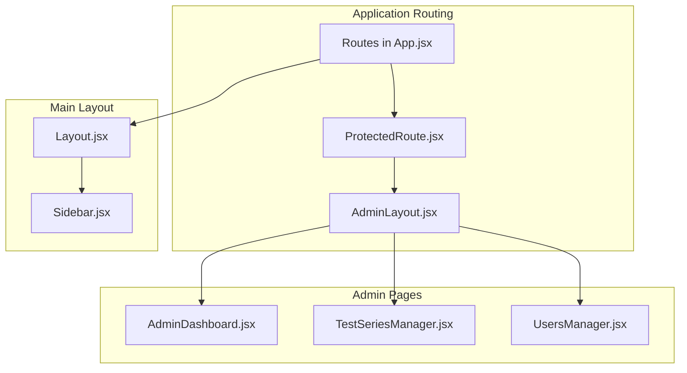

**Diagram sources**
- [App.jsx](file://Frontend/src/App.jsx#L119-L134)
- [ProtectedRoute.jsx](file://Frontend/src/components/auth/ProtectedRoute.jsx#L4-L26)
- [AdminLayout.jsx](file://Frontend/src/components/admin/AdminLayout.jsx#L8-L305)
- [AdminDashboard.jsx](file://Frontend/src/pages/admin/AdminDashboard.jsx#L8-L181)
- [TestSeriesManager.jsx](file://Frontend/src/pages/admin/TestSeriesManager.jsx#L4-L423)
- [UsersManager.jsx](file://Frontend/src/pages/admin/UsersManager.jsx#L4-L187)
- [Layout.jsx](file://Frontend/src/components/layout/Layout.jsx#L8-L86)
- [Sidebar.jsx](file://Frontend/src/components/layout/Sidebar.jsx#L5-L185)

**Section sources**
- [App.jsx](file://Frontend/src/App.jsx#L119-L134)
- [ProtectedRoute.jsx](file://Frontend/src/components/auth/ProtectedRoute.jsx#L4-L26)
- [AdminLayout.jsx](file://Frontend/src/components/admin/AdminLayout.jsx#L8-L305)
- [Layout.jsx](file://Frontend/src/components/layout/Layout.jsx#L8-L86)

## Core Components
- AdminLayout: Provides the admin shell with collapsible sidebar, top bar, mobile drawer, and bottom navigation. Handles navigation state, active item highlighting, and logout.
- AdminDashboard: Renders statistics cards, quick actions, and recent activity feed, fetching metrics from the backend.
- ProtectedRoute: Guards admin routes and redirects unauthenticated users.
- Breadcrumb: Provides navigational breadcrumbs for admin pages.
- HorizontalScroll: Enables horizontal scrolling with navigation arrows for touch and desktop.
- Layout and Sidebar: Define the main application layout and navigation, complementing the admin layout.

**Section sources**
- [AdminLayout.jsx](file://Frontend/src/components/admin/AdminLayout.jsx#L8-L305)
- [AdminDashboard.jsx](file://Frontend/src/pages/admin/AdminDashboard.jsx#L8-L181)
- [ProtectedRoute.jsx](file://Frontend/src/components/auth/ProtectedRoute.jsx#L4-L26)
- [Breadcrumb.jsx](file://Frontend/src/components/common/Breadcrumb.jsx#L4-L38)
- [HorizontalScroll.jsx](file://Frontend/src/components/common/HorizontalScroll.jsx#L10-L88)
- [Layout.jsx](file://Frontend/src/components/layout/Layout.jsx#L8-L86)
- [Sidebar.jsx](file://Frontend/src/components/layout/Sidebar.jsx#L5-L185)

## Architecture Overview
The admin architecture follows a layered pattern:
- Routing layer: App.jsx defines routes and wraps admin routes with ProtectedRoute.
- Layout layer: AdminLayout manages admin-specific UI and navigation.
- Page layer: AdminDashboard and managers implement domain-specific UI and data fetching.
- Backend integration: Express routes under /api/admin provide admin data and CRUD operations.

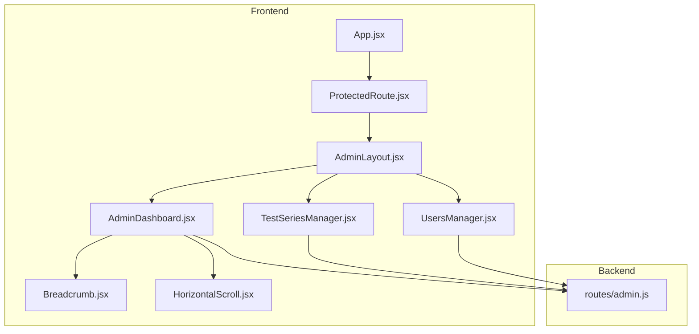

**Diagram sources**
- [App.jsx](file://Frontend/src/App.jsx#L119-L134)
- [ProtectedRoute.jsx](file://Frontend/src/components/auth/ProtectedRoute.jsx#L4-L26)
- [AdminLayout.jsx](file://Frontend/src/components/admin/AdminLayout.jsx#L8-L305)
- [AdminDashboard.jsx](file://Frontend/src/pages/admin/AdminDashboard.jsx#L8-L181)
- [TestSeriesManager.jsx](file://Frontend/src/pages/admin/TestSeriesManager.jsx#L4-L423)
- [UsersManager.jsx](file://Frontend/src/pages/admin/UsersManager.jsx#L4-L187)
- [Breadcrumb.jsx](file://Frontend/src/components/common/Breadcrumb.jsx#L4-L38)
- [HorizontalScroll.jsx](file://Frontend/src/components/common/HorizontalScroll.jsx#L10-L88)
- [admin.js](file://Backend/src/routes/admin.js#L12-L29)

## Detailed Component Analysis

### AdminLayout: Navigation and Shell
AdminLayout orchestrates:
- Collapsible sidebar with expandable sections and nested navigation.
- Active state detection for highlighting current route.
- Mobile drawer with overlay and close behavior.
- Top bar with site view link and user profile area.
- Bottom navigation for mobile with dedicated admin entry.
- Logout handling via token removal and redirect.

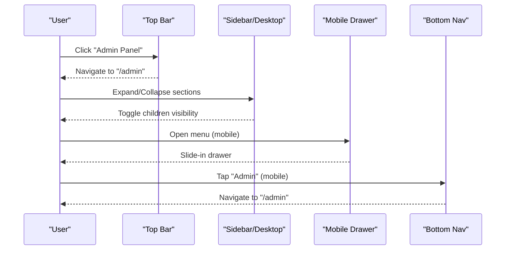

**Diagram sources**
- [AdminLayout.jsx](file://Frontend/src/components/admin/AdminLayout.jsx#L31-L47)
- [AdminLayout.jsx](file://Frontend/src/components/admin/AdminLayout.jsx#L62-L125)
- [AdminLayout.jsx](file://Frontend/src/components/admin/AdminLayout.jsx#L171-L202)
- [AdminLayout.jsx](file://Frontend/src/components/admin/AdminLayout.jsx#L243-L302)

**Section sources**
- [AdminLayout.jsx](file://Frontend/src/components/admin/AdminLayout.jsx#L8-L305)

### AdminDashboard: Widgets and Analytics
AdminDashboard presents:
- Statistics cards for users, test series, tests, questions, study materials, and media.
- Quick actions for common administrative tasks.
- Recent activity panel.
- Fetches stats from the backend endpoint and handles loading states.

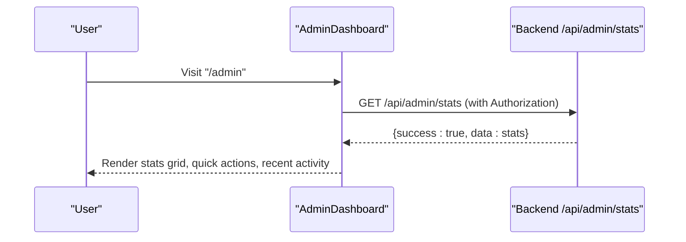

**Diagram sources**
- [AdminDashboard.jsx](file://Frontend/src/pages/admin/AdminDashboard.jsx#L16-L33)
- [admin.js](file://Backend/src/routes/admin.js#L12-L29)

**Section sources**
- [AdminDashboard.jsx](file://Frontend/src/pages/admin/AdminDashboard.jsx#L8-L181)
- [admin.js](file://Backend/src/routes/admin.js#L12-L29)

### ProtectedRoute: Authentication Guard
ProtectedRoute ensures only authenticated users can access admin routes. It renders a loading state while checking authentication and redirects unauthenticated users to the login page.

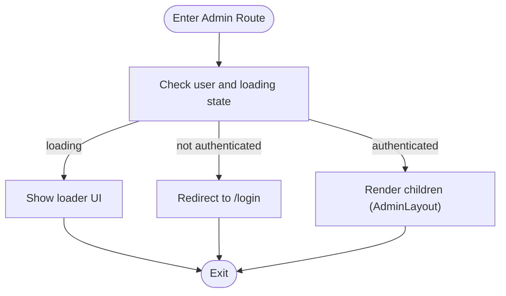

**Diagram sources**
- [ProtectedRoute.jsx](file://Frontend/src/components/auth/ProtectedRoute.jsx#L4-L26)

**Section sources**
- [ProtectedRoute.jsx](file://Frontend/src/components/auth/ProtectedRoute.jsx#L4-L26)

### Breadcrumb: Navigation Path
Breadcrumb displays the current navigation path with home and chevron separators, supporting both clickable links and static labels.

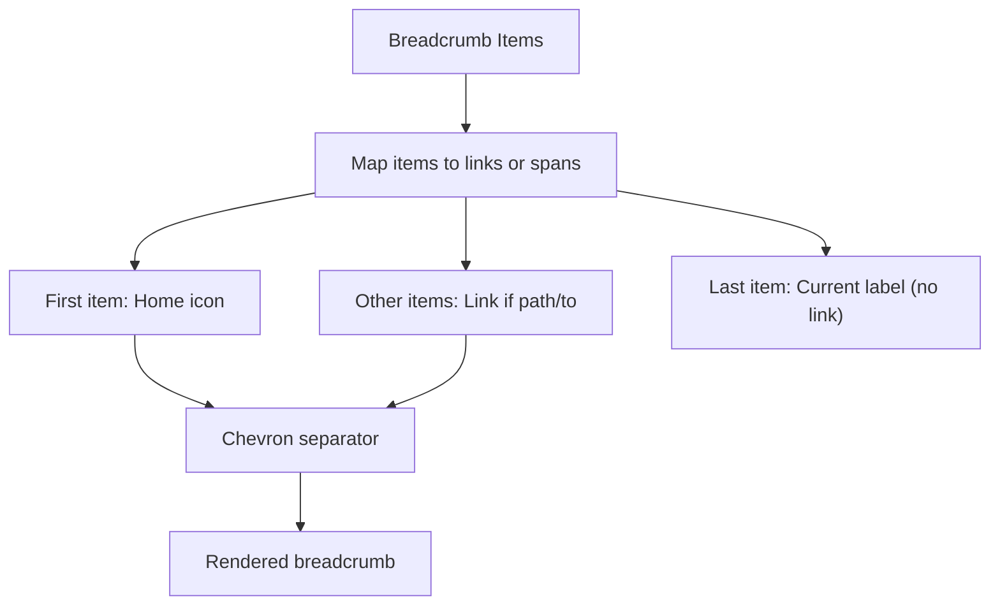

**Diagram sources**
- [Breadcrumb.jsx](file://Frontend/src/components/common/Breadcrumb.jsx#L4-L38)

**Section sources**
- [Breadcrumb.jsx](file://Frontend/src/components/common/Breadcrumb.jsx#L4-L38)

### HorizontalScroll: Responsive Scrolling
HorizontalScroll provides smooth horizontal scrolling with conditional left/right arrows and responsive behavior across devices.

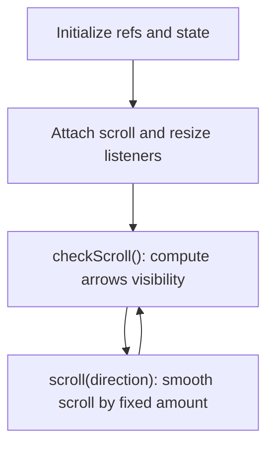

**Diagram sources**
- [HorizontalScroll.jsx](file://Frontend/src/components/common/HorizontalScroll.jsx#L10-L88)

**Section sources**
- [HorizontalScroll.jsx](file://Frontend/src/components/common/HorizontalScroll.jsx#L10-L88)

### TestSeriesManager: Administrative CRUD
TestSeriesManager implements:
- Fetching and displaying test series.
- Creating/updating/deleting series via backend endpoints.
- Form modal with auto-generated slug and validation.
- Table rendering with status badges and action buttons.

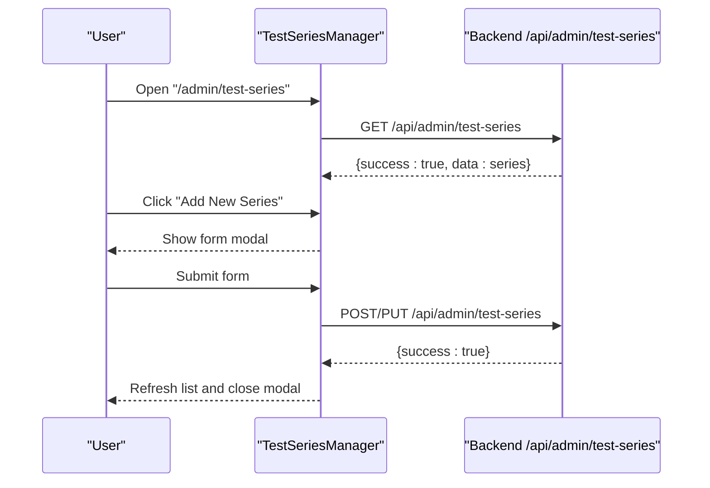

**Diagram sources**
- [TestSeriesManager.jsx](file://Frontend/src/pages/admin/TestSeriesManager.jsx#L23-L79)
- [admin.js](file://Backend/src/routes/admin.js#L32-L72)

**Section sources**
- [TestSeriesManager.jsx](file://Frontend/src/pages/admin/TestSeriesManager.jsx#L4-L423)
- [admin.js](file://Backend/src/routes/admin.js#L32-L72)

### UsersManager: User Administration
UsersManager supports:
- Listing users with filtering by name/email.
- Granting/revoking Pro Pass with expiry date updates.
- Rendering role badges and joined dates.

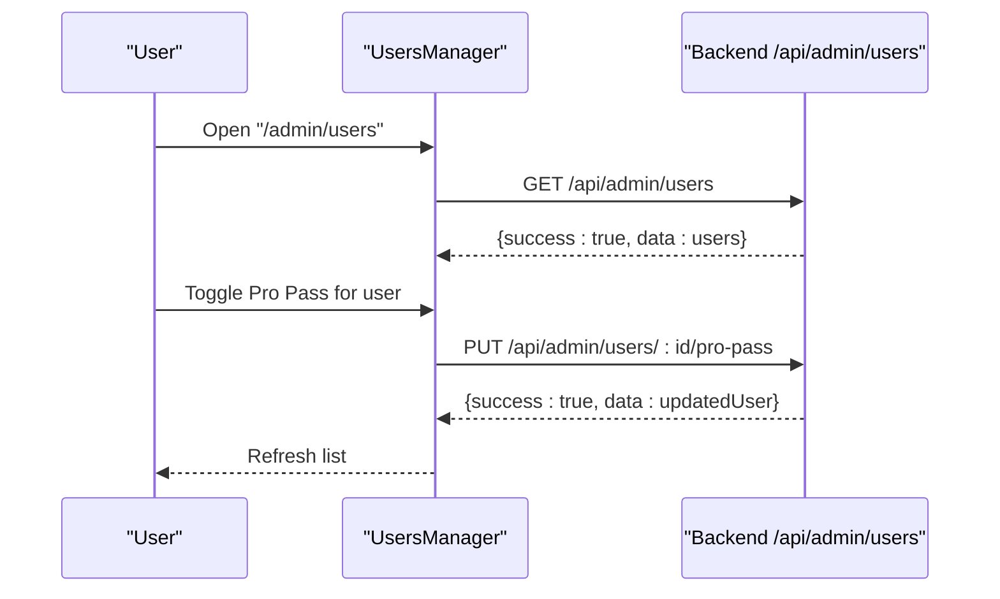

**Diagram sources**
- [UsersManager.jsx](file://Frontend/src/pages/admin/UsersManager.jsx#L9-L58)
- [admin.js](file://Backend/src/routes/admin.js#L213-L240)

**Section sources**
- [UsersManager.jsx](file://Frontend/src/pages/admin/UsersManager.jsx#L4-L187)
- [admin.js](file://Backend/src/routes/admin.js#L213-L240)

### Integration with Main Application Layout
The main application layout provides top navigation, a collapsible sidebar, and bottom navigation for non-admin pages. The admin layout complements this by offering a dedicated admin shell with its own navigation patterns.

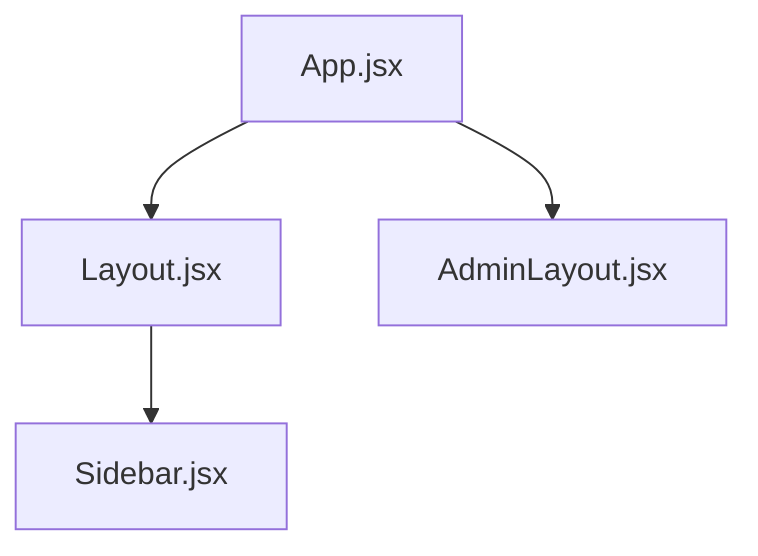

**Diagram sources**
- [App.jsx](file://Frontend/src/App.jsx#L85-L117)
- [Layout.jsx](file://Frontend/src/components/layout/Layout.jsx#L8-L86)
- [Sidebar.jsx](file://Frontend/src/components/layout/Sidebar.jsx#L5-L185)
- [AdminLayout.jsx](file://Frontend/src/components/admin/AdminLayout.jsx#L8-L305)

**Section sources**
- [App.jsx](file://Frontend/src/App.jsx#L85-L117)
- [Layout.jsx](file://Frontend/src/components/layout/Layout.jsx#L8-L86)
- [Sidebar.jsx](file://Frontend/src/components/layout/Sidebar.jsx#L5-L185)
- [AdminLayout.jsx](file://Frontend/src/components/admin/AdminLayout.jsx#L8-L305)

## Dependency Analysis
Key dependencies and relationships:
- App.jsx depends on ProtectedRoute to guard admin routes and AdminLayout to render the admin shell.
- AdminLayout depends on react-router-dom for navigation and Lucide icons for UI.
- AdminDashboard depends on backend stats endpoint and react-router-dom for navigation.
- TestSeriesManager and UsersManager depend on backend admin endpoints for data operations.
- Tailwind CSS provides design tokens and utilities used across components.

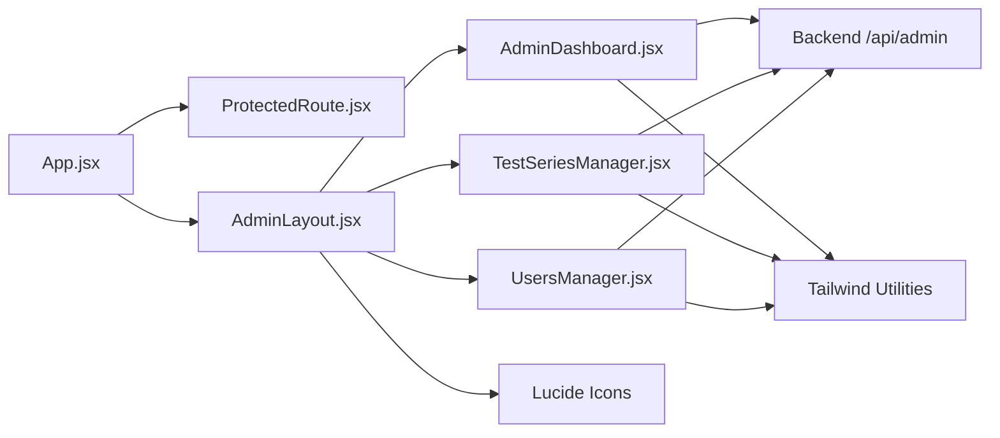

**Diagram sources**
- [App.jsx](file://Frontend/src/App.jsx#L119-L134)
- [ProtectedRoute.jsx](file://Frontend/src/components/auth/ProtectedRoute.jsx#L4-L26)
- [AdminLayout.jsx](file://Frontend/src/components/admin/AdminLayout.jsx#L1-L10)
- [AdminDashboard.jsx](file://Frontend/src/pages/admin/AdminDashboard.jsx#L1-L10)
- [TestSeriesManager.jsx](file://Frontend/src/pages/admin/TestSeriesManager.jsx#L1-L4)
- [UsersManager.jsx](file://Frontend/src/pages/admin/UsersManager.jsx#L1-L4)
- [admin.js](file://Backend/src/routes/admin.js#L12-L29)
- [tailwind.config.js](file://Frontend/tailwind.config.js#L7-L29)

**Section sources**
- [App.jsx](file://Frontend/src/App.jsx#L119-L134)
- [ProtectedRoute.jsx](file://Frontend/src/components/auth/ProtectedRoute.jsx#L4-L26)
- [AdminLayout.jsx](file://Frontend/src/components/admin/AdminLayout.jsx#L1-L10)
- [AdminDashboard.jsx](file://Frontend/src/pages/admin/AdminDashboard.jsx#L1-L10)
- [TestSeriesManager.jsx](file://Frontend/src/pages/admin/TestSeriesManager.jsx#L1-L4)
- [UsersManager.jsx](file://Frontend/src/pages/admin/UsersManager.jsx#L1-L4)
- [admin.js](file://Backend/src/routes/admin.js#L12-L29)
- [tailwind.config.js](file://Frontend/tailwind.config.js#L7-L29)

## Performance Considerations
- Lazy loading: Consider lazy-loading admin pages to reduce initial bundle size.
- Virtualization: For large datasets (e.g., users list), implement virtualized lists to improve rendering performance.
- Debounced search: Apply debounced input for search filters to minimize backend requests.
- Efficient state updates: Batch state updates in forms and avoid unnecessary re-renders.
- Asset optimization: Compress and cache media assets served via the backend upload endpoint.

## Troubleshooting Guide
Common issues and resolutions:
- Authentication failures: ProtectedRoute redirects unauthenticated users to login; ensure token presence and validity.
- Navigation not updating: AdminLayout uses active path detection; verify route paths and nested routes.
- Mobile drawer not closing: Ensure overlay click handlers and resize listeners are attached and cleaned up.
- Stats not loading: AdminDashboard fetches from /api/admin/stats; confirm backend endpoint availability and token inclusion.
- CRUD operations failing: TestSeriesManager and UsersManager require proper authorization headers; verify token handling and endpoint responses.

**Section sources**
- [ProtectedRoute.jsx](file://Frontend/src/components/auth/ProtectedRoute.jsx#L4-L26)
- [AdminLayout.jsx](file://Frontend/src/components/admin/AdminLayout.jsx#L55-L67)
- [AdminDashboard.jsx](file://Frontend/src/pages/admin/AdminDashboard.jsx#L16-L33)
- [TestSeriesManager.jsx](file://Frontend/src/pages/admin/TestSeriesManager.jsx#L27-L42)
- [UsersManager.jsx](file://Frontend/src/pages/admin/UsersManager.jsx#L13-L28)

## Conclusion
The Trstprep V2 admin dashboard provides a robust, responsive, and accessible administrative interface. Its layout integrates seamlessly with the main application, while dedicated admin pages deliver comprehensive management capabilities. The navigation system supports both desktop and mobile contexts, and the backend routes enable efficient data operations. By following the documented patterns and best practices, administrators can efficiently manage content, users, and system settings.

## Appendices
- Accessibility features: Use semantic HTML, ARIA attributes where appropriate, keyboard navigation support, and sufficient color contrast as per Tailwind’s design tokens.
- Responsive design: AdminLayout adapts via CSS classes for desktop sidebar width and mobile drawer; ensure consistent spacing and typography scaling across breakpoints.
- Branding and theming: Tailwind’s brand color extensions and shadow utilities contribute to a cohesive visual identity.

**Section sources**
- [tailwind.config.js](file://Frontend/tailwind.config.js#L7-L29)
- [ADMIN_NAV_ADDED.md](file://Documentation/ADMIN_NAV_ADDED.md#L19-L187)
- [ADMIN_FEATURES_COMPLETE.md](file://Documentation/ADMIN_FEATURES_COMPLETE.md#L1-L287)

*Last Updated: March 10, 2026 | Update date is (20:16)*
