# Admin Panel & Content Administration

<cite>
**Referenced Files in This Document**
- [AdminDashboard.jsx](file://Frontend/src/pages/admin/AdminDashboard.jsx)
- [UsersManager.jsx](file://Frontend/src/pages/admin/UsersManager.jsx)
- [QuestionsManager.jsx](file://Frontend/src/pages/admin/QuestionsManager.jsx)
- [TestSeriesManager.jsx](file://Frontend/src/pages/admin/TestSeriesManager.jsx)
- [StudyMaterialsManager.jsx](file://Frontend/src/pages/admin/StudyMaterialsManager.jsx)
- [CategoriesManager.jsx](file://Frontend/src/pages/admin/CategoriesManager.jsx)
- [MediaLibrary.jsx](file://Frontend/src/pages/admin/MediaLibrary.jsx)
- [TestsManager.jsx](file://Frontend/src/pages/admin/TestsManager.jsx)
- [AdminSettings.jsx](file://Frontend/src/pages/admin/AdminSettings.jsx)
- [api.js](file://Frontend/src/services/api.js)
- [admin.js](file://Backend/src/routes/admin.js)
- [auth.js](file://Backend/src/middleware/auth.js)
- [localDB.js](file://Backend/src/db/localDB.js)
- [User.js](file://Backend/src/models/User.js)
- [Question.js](file://Backend/src/models/Question.js)
- [Test.js](file://Backend/src/models/Test.js)
- [TestSeries.js](file://Backend/src/models/TestSeries.js)
- [db.json](file://Backend/data/db.json)
</cite>

## Table of Contents
1. [Introduction](#introduction)
2. [Project Structure](#project-structure)
3. [Core Components](#core-components)
4. [Architecture Overview](#architecture-overview)
5. [Detailed Component Analysis](#detailed-component-analysis)
6. [Dependency Analysis](#dependency-analysis)
7. [Performance Considerations](#performance-considerations)
8. [Troubleshooting Guide](#troubleshooting-guide)
9. [Conclusion](#conclusion)

## Introduction
This document provides comprehensive documentation for Trstprep V2's administrative panel and content management capabilities. It covers the admin dashboard, user management, content administration workflows for questions, test series, study materials, categories, and media library. It also explains user administration features, soft delete mechanisms, bulk operations, and administrative security measures including role-based access control and workflow automation.

## Project Structure
The admin functionality is split between the frontend React application and the backend Express server with a local JSON database. The frontend admin pages communicate with backend routes secured by JWT-based authentication and admin-only authorization middleware.

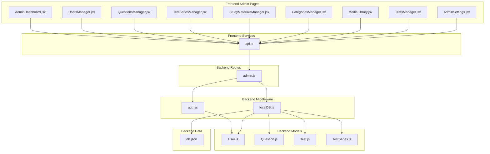

**Diagram sources**
- [AdminDashboard.jsx](file://Frontend/src/pages/admin/AdminDashboard.jsx#L1-L182)
- [UsersManager.jsx](file://Frontend/src/pages/admin/UsersManager.jsx#L1-L188)
- [QuestionsManager.jsx](file://Frontend/src/pages/admin/QuestionsManager.jsx#L1-L421)
- [TestSeriesManager.jsx](file://Frontend/src/pages/admin/TestSeriesManager.jsx#L1-L424)
- [StudyMaterialsManager.jsx](file://Frontend/src/pages/admin/StudyMaterialsManager.jsx#L1-L539)
- [CategoriesManager.jsx](file://Frontend/src/pages/admin/CategoriesManager.jsx#L1-L432)
- [MediaLibrary.jsx](file://Frontend/src/pages/admin/MediaLibrary.jsx#L1-L154)
- [TestsManager.jsx](file://Frontend/src/pages/admin/TestsManager.jsx#L1-L527)
- [AdminSettings.jsx](file://Frontend/src/pages/admin/AdminSettings.jsx#L1-L213)
- [api.js](file://Frontend/src/services/api.js#L1-L92)
- [admin.js](file://Backend/src/routes/admin.js#L1-L557)
- [auth.js](file://Backend/src/middleware/auth.js#L1-L92)
- [localDB.js](file://Backend/src/db/localDB.js#L1-L222)
- [User.js](file://Backend/src/models/User.js#L1-L81)
- [Question.js](file://Backend/src/models/Question.js#L1-L54)
- [Test.js](file://Backend/src/models/Test.js#L1-L77)
- [TestSeries.js](file://Backend/src/models/TestSeries.js#L1-L71)
- [db.json](file://Backend/data/db.json#L1-L728)

**Section sources**
- [AdminDashboard.jsx](file://Frontend/src/pages/admin/AdminDashboard.jsx#L1-L182)
- [admin.js](file://Backend/src/routes/admin.js#L1-L557)
- [auth.js](file://Backend/src/middleware/auth.js#L1-L92)
- [localDB.js](file://Backend/src/db/localDB.js#L1-L222)

## Core Components
This section outlines the primary admin components and their responsibilities:

- Admin Dashboard: Provides statistics cards, quick actions, and recent activity feed. It fetches aggregated stats from the backend admin stats endpoint.
- Users Management: Lists users, allows toggling Pro Pass status, and supports search by name or email.
- Questions Management: CRUD operations for questions, bulk upload via CSV, and tagging support.
- Test Series Management: Manages test series with categories, pricing, difficulty, and activation status.
- Study Materials Management: Hierarchical subject management with soft delete, enable/disable, reordering, and trash restoration.
- Categories Management: Hierarchical test categories with nested structure support and tree rendering.
- Media Library: File upload interface supporting videos, PDFs, and images with progress indication.
- Tests Management: Individual test creation/editing with series association, category/subcategory mapping, and activation controls.
- Admin Settings: Application-wide settings configuration including contact information and social links.

**Section sources**
- [AdminDashboard.jsx](file://Frontend/src/pages/admin/AdminDashboard.jsx#L1-L182)
- [UsersManager.jsx](file://Frontend/src/pages/admin/UsersManager.jsx#L1-L188)
- [QuestionsManager.jsx](file://Frontend/src/pages/admin/QuestionsManager.jsx#L1-L421)
- [TestSeriesManager.jsx](file://Frontend/src/pages/admin/TestSeriesManager.jsx#L1-L424)
- [StudyMaterialsManager.jsx](file://Frontend/src/pages/admin/StudyMaterialsManager.jsx#L1-L539)
- [CategoriesManager.jsx](file://Frontend/src/pages/admin/CategoriesManager.jsx#L1-L432)
- [MediaLibrary.jsx](file://Frontend/src/pages/admin/MediaLibrary.jsx#L1-L154)
- [TestsManager.jsx](file://Frontend/src/pages/admin/TestsManager.jsx#L1-L527)
- [AdminSettings.jsx](file://Frontend/src/pages/admin/AdminSettings.jsx#L1-L213)

## Architecture Overview
The admin architecture follows a client-server pattern with JWT-based authentication and admin-only authorization. All admin routes are protected by middleware that verifies tokens and ensures the requesting user has admin privileges.

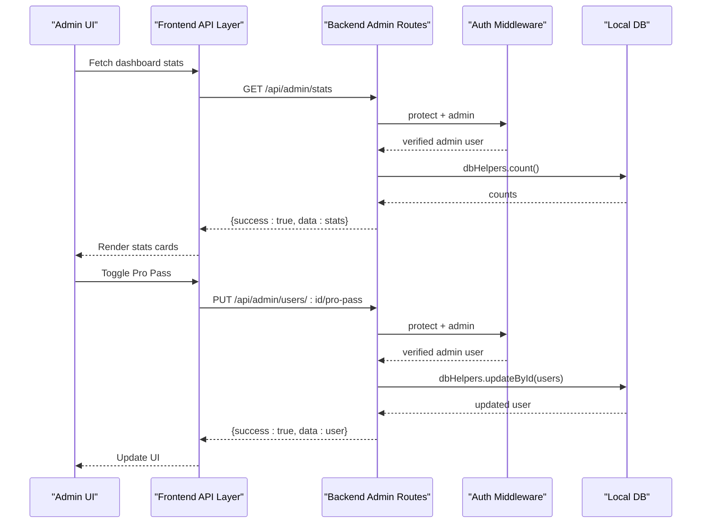

**Diagram sources**
- [AdminDashboard.jsx](file://Frontend/src/pages/admin/AdminDashboard.jsx#L16-L33)
- [UsersManager.jsx](file://Frontend/src/pages/admin/UsersManager.jsx#L30-L58)
- [admin.js](file://Backend/src/routes/admin.js#L13-L29)
- [auth.js](file://Backend/src/middleware/auth.js#L5-L44)
- [localDB.js](file://Backend/src/db/localDB.js#L170-L185)

**Section sources**
- [admin.js](file://Backend/src/routes/admin.js#L8-L10)
- [auth.js](file://Backend/src/middleware/auth.js#L68-L78)
- [localDB.js](file://Backend/src/db/localDB.js#L82-L219)

## Detailed Component Analysis

### Admin Dashboard
The dashboard aggregates key metrics and provides quick access to common admin tasks. It fetches stats from the backend `/api/admin/stats` endpoint and displays them in interactive cards. Quick actions offer shortcuts to frequently used admin pages.

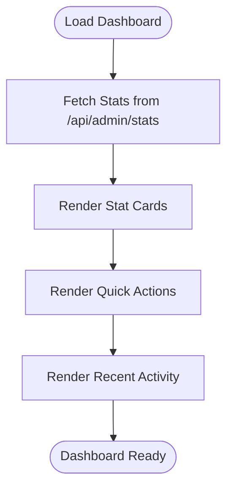

**Diagram sources**
- [AdminDashboard.jsx](file://Frontend/src/pages/admin/AdminDashboard.jsx#L16-L33)
- [admin.js](file://Backend/src/routes/admin.js#L13-L29)

**Section sources**
- [AdminDashboard.jsx](file://Frontend/src/pages/admin/AdminDashboard.jsx#L35-L87)
- [admin.js](file://Backend/src/routes/admin.js#L13-L29)

### Users Management
The users manager lists all registered users, supports searching by name or email, and allows toggling Pro Pass status. The Pro Pass toggle updates user records with expiration dates and reflects status changes in the UI.

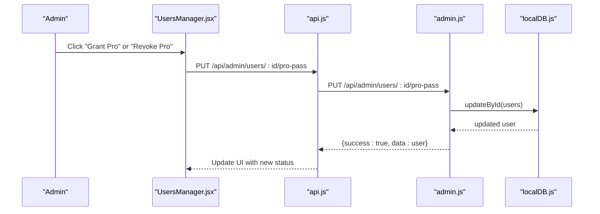

**Diagram sources**
- [UsersManager.jsx](file://Frontend/src/pages/admin/UsersManager.jsx#L30-L58)
- [admin.js](file://Backend/src/routes/admin.js#L225-L240)
- [localDB.js](file://Backend/src/db/localDB.js#L170-L185)

**Section sources**
- [UsersManager.jsx](file://Frontend/src/pages/admin/UsersManager.jsx#L30-L58)
- [admin.js](file://Backend/src/routes/admin.js#L213-L240)

### Questions Management
The questions manager supports creating, editing, deleting, and bulk uploading questions. It validates form data, handles CSV uploads, and maintains relationships with test series.

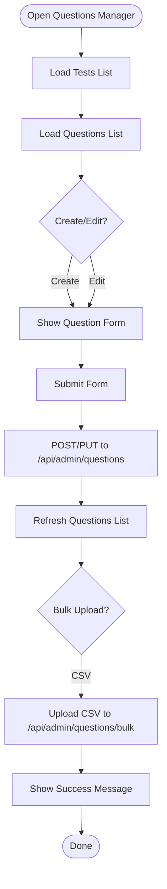

**Diagram sources**
- [QuestionsManager.jsx](file://Frontend/src/pages/admin/QuestionsManager.jsx#L27-L57)
- [QuestionsManager.jsx](file://Frontend/src/pages/admin/QuestionsManager.jsx#L59-L95)
- [QuestionsManager.jsx](file://Frontend/src/pages/admin/QuestionsManager.jsx#L127-L159)
- [admin.js](file://Backend/src/routes/admin.js#L118-L168)

**Section sources**
- [QuestionsManager.jsx](file://Frontend/src/pages/admin/QuestionsManager.jsx#L1-L421)
- [admin.js](file://Backend/src/routes/admin.js#L118-L168)

### Test Series Management
The test series manager handles creation, editing, and deletion of test series. It manages categories, pricing, difficulty, and activation status, and auto-generates slugs from titles.

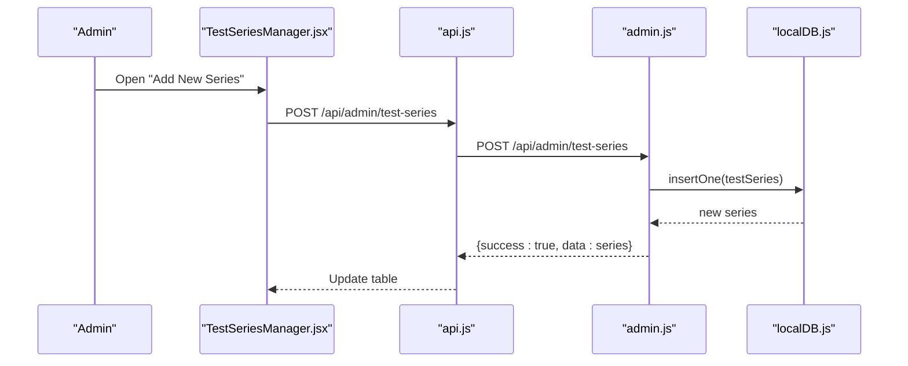

**Diagram sources**
- [TestSeriesManager.jsx](file://Frontend/src/pages/admin/TestSeriesManager.jsx#L44-L79)
- [admin.js](file://Backend/src/routes/admin.js#L41-L48)
- [localDB.js](file://Backend/src/db/localDB.js#L119-L133)

**Section sources**
- [TestSeriesManager.jsx](file://Frontend/src/pages/admin/TestSeriesManager.jsx#L1-L424)
- [admin.js](file://Backend/src/routes/admin.js#L31-L72)

### Study Materials Management
The study materials manager supports CRUD operations with soft delete, enable/disable toggles, reordering, and trash restoration. It maintains display order and resource counts.

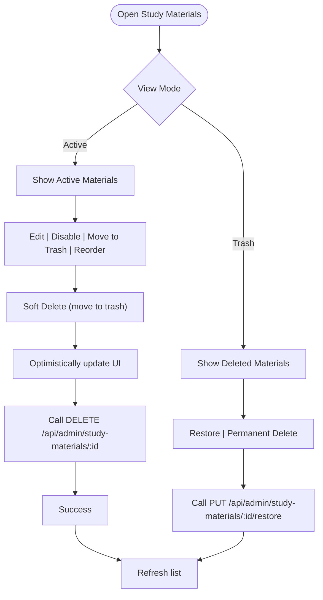

**Diagram sources**
- [StudyMaterialsManager.jsx](file://Frontend/src/pages/admin/StudyMaterialsManager.jsx#L111-L147)
- [StudyMaterialsManager.jsx](file://Frontend/src/pages/admin/StudyMaterialsManager.jsx#L149-L172)
- [StudyMaterialsManager.jsx](file://Frontend/src/pages/admin/StudyMaterialsManager.jsx#L174-L205)
- [admin.js](file://Backend/src/routes/admin.js#L201-L211)

**Section sources**
- [StudyMaterialsManager.jsx](file://Frontend/src/pages/admin/StudyMaterialsManager.jsx#L1-L539)
- [admin.js](file://Backend/src/routes/admin.js#L170-L211)

### Categories Management
The categories manager implements a hierarchical category system with nested tree rendering. It supports adding root categories and child categories, expanding/collapsing nodes, and managing category metadata.

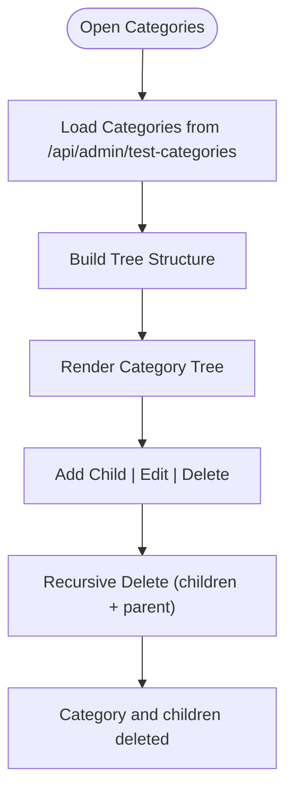

**Diagram sources**
- [CategoriesManager.jsx](file://Frontend/src/pages/admin/CategoriesManager.jsx#L24-L39)
- [CategoriesManager.jsx](file://Frontend/src/pages/admin/CategoriesManager.jsx#L90-L109)
- [admin.js](file://Backend/src/routes/admin.js#L341-L364)

**Section sources**
- [CategoriesManager.jsx](file://Frontend/src/pages/admin/CategoriesManager.jsx#L1-L432)
- [admin.js](file://Backend/src/routes/admin.js#L301-L364)

### Media Library
The media library provides a drag-and-drop upload interface for videos, PDFs, and images. It tracks upload progress and saves file metadata to the media collection.

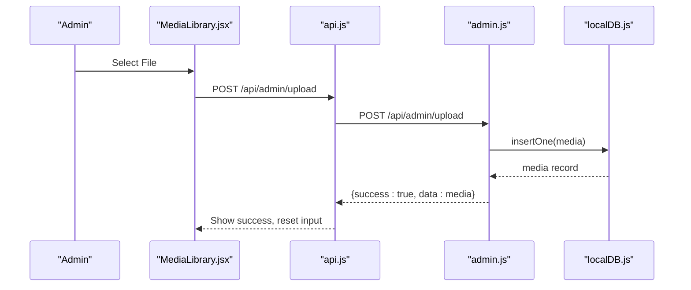

**Diagram sources**
- [MediaLibrary.jsx](file://Frontend/src/pages/admin/MediaLibrary.jsx#L9-L49)
- [admin.js](file://Backend/src/routes/admin.js#L243-L272)
- [localDB.js](file://Backend/src/db/localDB.js#L119-L133)

**Section sources**
- [MediaLibrary.jsx](file://Frontend/src/pages/admin/MediaLibrary.jsx#L1-L154)
- [admin.js](file://Backend/src/routes/admin.js#L242-L272)

### Tests Management
The tests manager handles individual test creation and editing, including series association, category/subcategory mapping, and activation controls.

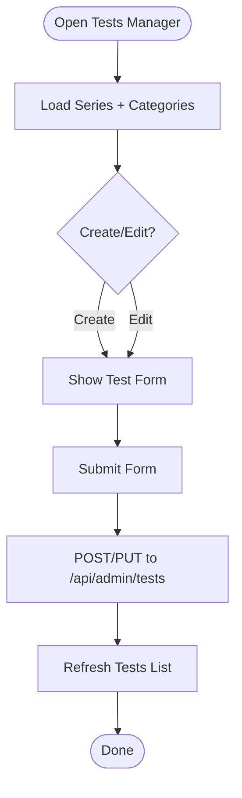

**Diagram sources**
- [TestsManager.jsx](file://Frontend/src/pages/admin/TestsManager.jsx#L33-L78)
- [TestsManager.jsx](file://Frontend/src/pages/admin/TestsManager.jsx#L86-L122)
- [admin.js](file://Backend/src/routes/admin.js#L75-L115)

**Section sources**
- [TestsManager.jsx](file://Frontend/src/pages/admin/TestsManager.jsx#L1-L527)
- [admin.js](file://Backend/src/routes/admin.js#L74-L115)

### Admin Settings
The admin settings page allows configuration of site-wide settings including contact information and social media links.

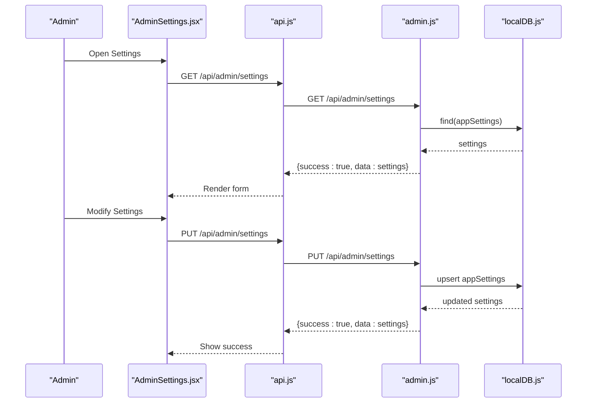

**Diagram sources**
- [AdminSettings.jsx](file://Frontend/src/pages/admin/AdminSettings.jsx#L24-L66)
- [admin.js](file://Backend/src/routes/admin.js#L275-L299)
- [localDB.js](file://Backend/src/db/localDB.js#L170-L185)

**Section sources**
- [AdminSettings.jsx](file://Frontend/src/pages/admin/AdminSettings.jsx#L1-L213)
- [admin.js](file://Backend/src/routes/admin.js#L274-L299)

## Dependency Analysis
The admin system exhibits clear separation of concerns with strong backend middleware enforcement and frontend service abstraction.

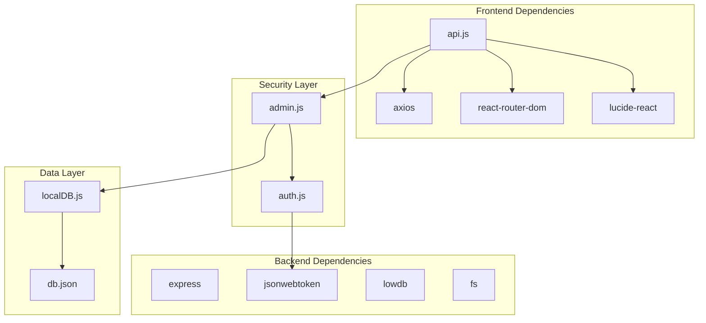

**Diagram sources**
- [api.js](file://Frontend/src/services/api.js#L1-L92)
- [admin.js](file://Backend/src/routes/admin.js#L1-L10)
- [auth.js](file://Backend/src/middleware/auth.js#L1-L92)
- [localDB.js](file://Backend/src/db/localDB.js#L1-L222)
- [db.json](file://Backend/data/db.json#L1-L728)

**Section sources**
- [api.js](file://Frontend/src/services/api.js#L1-L92)
- [admin.js](file://Backend/src/routes/admin.js#L1-L10)
- [auth.js](file://Backend/src/middleware/auth.js#L1-L92)

## Performance Considerations
- Database Operations: All admin operations use a single JSON file database with in-memory reads/writes. For production, consider migrating to a proper database to improve performance and concurrency.
- Token Validation: JWT verification occurs on every admin route request. Ensure JWT_SECRET is properly configured and consider implementing token refresh strategies.
- Bulk Operations: Bulk question uploads process arrays of questions. For large datasets, consider pagination or streaming approaches.
- UI Responsiveness: Many components fetch data on mount. Implement loading states and error boundaries for better user experience.
- File Uploads: Media uploads currently use memory-based FormData handling. For large files, implement chunked uploads and progress tracking improvements.

## Troubleshooting Guide
Common issues and resolutions:

- Authentication Failures: Ensure JWT token is present in localStorage and properly formatted. Check backend JWT_SECRET configuration.
- Authorization Errors: Verify user role is 'admin'. Non-admin users will receive 403 Forbidden responses.
- Database Initialization: If database errors occur, ensure db.json exists and has proper structure. The system initializes default collections automatically.
- CORS Issues: Since frontend uses localhost:5001 backend, ensure no CORS conflicts exist in development environment.
- Network Errors: The API layer handles network errors and redirects to login on 401 responses.

**Section sources**
- [auth.js](file://Backend/src/middleware/auth.js#L5-L44)
- [localDB.js](file://Backend/src/db/localDB.js#L48-L73)
- [api.js](file://Frontend/src/services/api.js#L26-L44)

## Conclusion
Trstprep V2's admin panel provides comprehensive content management capabilities with a clean separation between frontend UI components and backend API routes. The system implements robust security through JWT authentication and admin-only authorization, supports essential CRUD operations across all content types, and includes advanced features like soft deletes, bulk operations, and hierarchical categorization. The modular architecture allows for easy extension and maintenance, though migration to a production-grade database would significantly improve scalability and reliability.

*Last Updated: March 10, 2026 | Update date is (20:16)*
