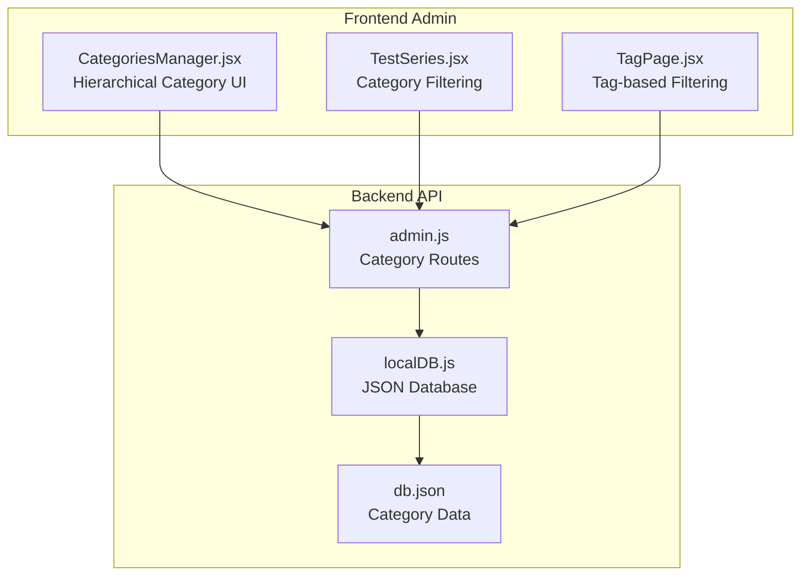
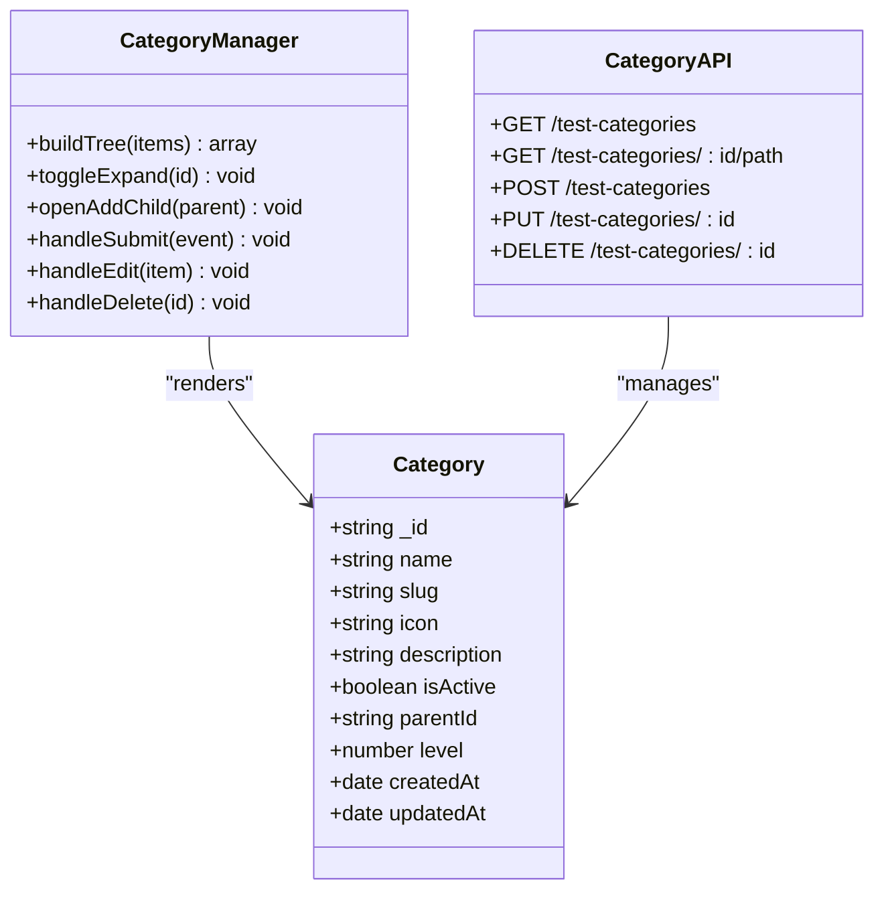
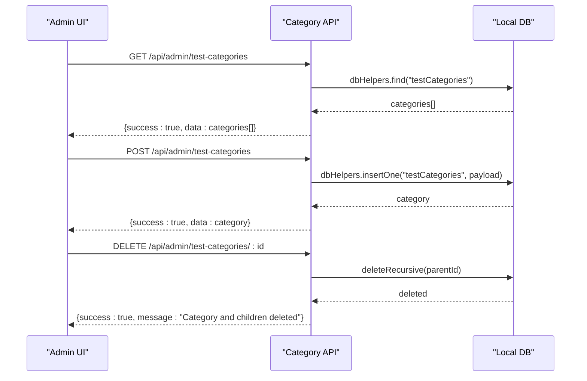
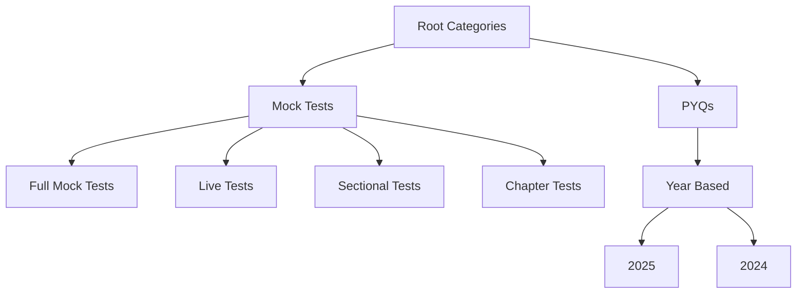
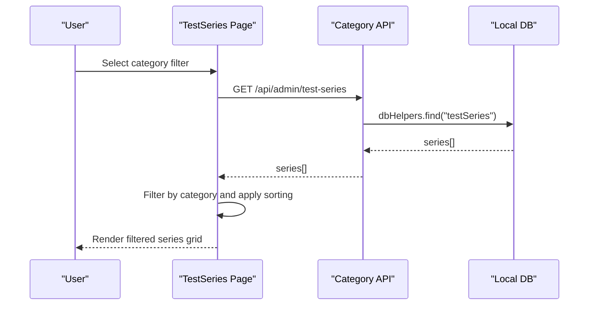
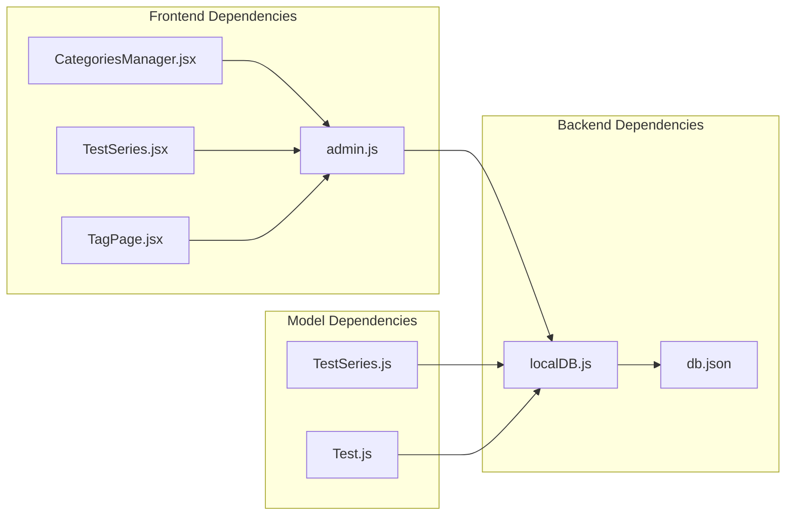

# Categories & Content Organization

<cite>
**Referenced Files in This Document**
- [CategoriesManager.jsx](file://Frontend/src/pages/admin/CategoriesManager.jsx)
- [admin.js](file://Backend/src/routes/admin.js)
- [localDB.js](file://Backend/src/db/localDB.js)
- [db.json](file://Backend/data/db.json)
- [TestSeries.jsx](file://Frontend/src/pages/TestSeries.jsx)
- [TagPage.jsx](file://Frontend/src/pages/TagPage.jsx)
- [TestSeries.js](file://Backend/src/models/TestSeries.js)
- [Test.js](file://Backend/src/models/Test.js)
- [V2 - Copy (5).html](file://V2 - Copy (5).html)
</cite>

## Table of Contents
1. [Introduction](#introduction)
2. [Project Structure](#project-structure)
3. [Core Components](#core-components)
4. [Architecture Overview](#architecture-overview)
5. [Detailed Component Analysis](#detailed-component-analysis)
6. [Dependency Analysis](#dependency-analysis)
7. [Performance Considerations](#performance-considerations)
8. [Troubleshooting Guide](#troubleshooting-guide)
9. [Conclusion](#conclusion)

## Introduction
This document provides comprehensive documentation for the categories and content organization system within the Trstprep V2 admin panel. It covers hierarchical category creation and management for test series and study materials, category assignment workflows, filtering mechanisms, and content categorization strategies. It also details the category taxonomy structure, relationships, and integration with content display systems including navigation and search functionality.

## Project Structure
The categories and content organization system spans both frontend and backend components:
- Frontend admin interface for managing hierarchical categories
- Backend API routes for category CRUD operations and hierarchical support
- Local JSON database storing category data and supporting relationships
- Content display pages that consume categories for filtering and navigation

**Diagram sources**
- [CategoriesManager.jsx](file://Frontend/src/pages/admin/CategoriesManager.jsx#L1-L432)
- [admin.js](file://Backend/src/routes/admin.js#L301-L382)
- [localDB.js](file://Backend/src/db/localDB.js#L1-L222)
- [db.json](file://Backend/data/db.json#L780-L873)

**Section sources**
- [CategoriesManager.jsx](file://Frontend/src/pages/admin/CategoriesManager.jsx#L1-L432)
- [admin.js](file://Backend/src/routes/admin.js#L301-L382)
- [localDB.js](file://Backend/src/db/localDB.js#L1-L222)
- [db.json](file://Backend/data/db.json#L780-L873)

## Core Components
- Hierarchical Category Manager: Provides UI for creating, editing, deleting, and organizing nested categories with expand/collapse functionality.
- Category API: Exposes endpoints for retrieving, creating, updating, and deleting categories, including recursive deletion.
- Category Data Model: Defines category structure with parent-child relationships, levels, and activation status.
- Content Display Integration: Test series and tag pages filter and present content based on category taxonomy.

Key implementation highlights:
- Category tree building from flat lists with parent-child mapping
- Recursive deletion ensuring child categories are removed
- Breadcrumb generation for category paths
- Category-based filtering in content pages

**Section sources**
- [CategoriesManager.jsx](file://Frontend/src/pages/admin/CategoriesManager.jsx#L220-L242)
- [admin.js](file://Backend/src/routes/admin.js#L341-L364)
- [db.json](file://Backend/data/db.json#L780-L873)

## Architecture Overview
The category system follows a hierarchical taxonomy pattern with parent-child relationships stored in a flat structure. The frontend constructs trees from this flat data, while the backend supports recursive operations and path resolution.

**Diagram sources**
- [CategoriesManager.jsx](file://Frontend/src/pages/admin/CategoriesManager.jsx#L12-L18)
- [CategoriesManager.jsx](file://Frontend/src/pages/admin/CategoriesManager.jsx#L220-L242)
- [admin.js](file://Backend/src/routes/admin.js#L301-L382)

**Section sources**
- [CategoriesManager.jsx](file://Frontend/src/pages/admin/CategoriesManager.jsx#L1-L432)
- [admin.js](file://Backend/src/routes/admin.js#L301-L382)

## Detailed Component Analysis

### Hierarchical Category Management (Admin UI)
The admin interface provides a comprehensive system for managing nested categories:
- Tree visualization with expand/collapse controls
- Drag-and-drop friendly structure via parent selection
- Real-time breadcrumb generation for parent paths
- Recursive child addition and deletion

**Diagram sources**
- [CategoriesManager.jsx](file://Frontend/src/pages/admin/CategoriesManager.jsx#L24-L39)
- [admin.js](file://Backend/src/routes/admin.js#L312-L364)
- [localDB.js](file://Backend/src/db/localDB.js#L119-L133)

**Section sources**
- [CategoriesManager.jsx](file://Frontend/src/pages/admin/CategoriesManager.jsx#L1-L432)
- [admin.js](file://Backend/src/routes/admin.js#L301-L382)

### Category Taxonomy Structure
The system defines a multi-level taxonomy for categorizing content:
- Root categories: e.g., "Mock Tests", "PYQs"
- Subcategories: e.g., "Full Mock Tests", "Live Tests", "Year Based"
- Nested levels: Year-based breakdown (e.g., "2025")

**Diagram sources**
- [db.json](file://Backend/data/db.json#L780-L873)

**Section sources**
- [db.json](file://Backend/data/db.json#L780-L873)

### Category Assignment Workflows
Content categorization follows these workflows:
- Test Series categorization by exam board (SSC, Railway, Banking, etc.)
- Test categorization by type (Mock Tests, PYPs, Live Tests, Practice)
- Subcategory assignment for granular filtering
- Tag-based categorization for dynamic content discovery

**Section sources**
- [TestSeries.js](file://Backend/src/models/TestSeries.js#L16-L20)
- [Test.js](file://Backend/src/models/Test.js#L19-L27)

### Category-Based Filtering and Navigation
Content pages integrate category taxonomy for discovery:
- Test Series filtering by category (SSC, Railway, Banking)
- Tag-based pages for specialized content (Live Tests, PYQs, Practice)
- Dynamic subcategory tabs for detailed filtering
- Search functionality combined with category filters

**Diagram sources**
- [TestSeries.jsx](file://Frontend/src/pages/TestSeries.jsx#L77-L104)
- [admin.js](file://Backend/src/routes/admin.js#L32-L48)

**Section sources**
- [TestSeries.jsx](file://Frontend/src/pages/TestSeries.jsx#L1-L427)
- [TagPage.jsx](file://Frontend/src/pages/TagPage.jsx#L1-L314)

### Content Categorization Strategies
Recommended strategies for maintaining effective categorization:
- Use clear, descriptive category names with consistent naming conventions
- Maintain logical hierarchy with appropriate nesting levels
- Leverage subcategories for granular filtering (e.g., Year Based)
- Utilize tags for cross-category content discovery
- Keep category descriptions concise but informative
- Regularly review and prune inactive categories

**Section sources**
- [CategoriesManager.jsx](file://Frontend/src/pages/admin/CategoriesManager.jsx#L12-L18)
- [db.json](file://Backend/data/db.json#L780-L873)

## Dependency Analysis
The category system exhibits clear separation of concerns with minimal coupling between components.

**Diagram sources**
- [CategoriesManager.jsx](file://Frontend/src/pages/admin/CategoriesManager.jsx#L1-L432)
- [admin.js](file://Backend/src/routes/admin.js#L1-L557)
- [localDB.js](file://Backend/src/db/localDB.js#L1-L222)
- [TestSeries.js](file://Backend/src/models/TestSeries.js#L1-L71)
- [Test.js](file://Backend/src/models/Test.js#L1-L77)

**Section sources**
- [admin.js](file://Backend/src/routes/admin.js#L1-L557)
- [localDB.js](file://Backend/src/db/localDB.js#L1-L222)

## Performance Considerations
- Tree construction complexity: O(n) for building category trees from flat lists
- Recursive deletion: O(n) traversal for complete subtree removal
- Database operations: Local JSON storage suitable for development; consider migration to MongoDB for production scale
- Frontend rendering: Efficient memoization prevents unnecessary re-renders during filtering
- API response sizes: Flat category lists minimize payload overhead

## Troubleshooting Guide
Common issues and resolutions:
- Category tree not rendering: Verify parent-child relationships in database; check buildTree function logic
- Recursive deletion failures: Ensure proper child detection and sequential deletion ordering
- Breadcrumb generation errors: Validate parent category existence in path resolution
- Filter inconsistencies: Confirm category field mappings match content model definitions

**Section sources**
- [CategoriesManager.jsx](file://Frontend/src/pages/admin/CategoriesManager.jsx#L220-L259)
- [admin.js](file://Backend/src/routes/admin.js#L341-L382)

## Conclusion
The Trstprep V2 categories and content organization system provides a robust foundation for hierarchical content management. The combination of intuitive admin interfaces, flexible category taxonomy, and integrated filtering mechanisms enables effective content discovery and organization. The system's modular design supports future enhancements such as advanced analytics, popularity tracking, and enhanced content distribution analysis.

*Last Updated: March 10, 2026 | Update date is (20:16)*
