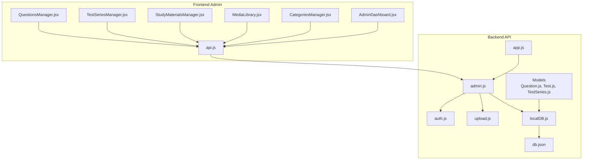
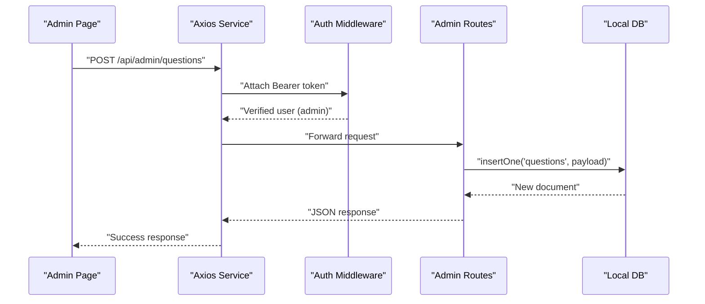
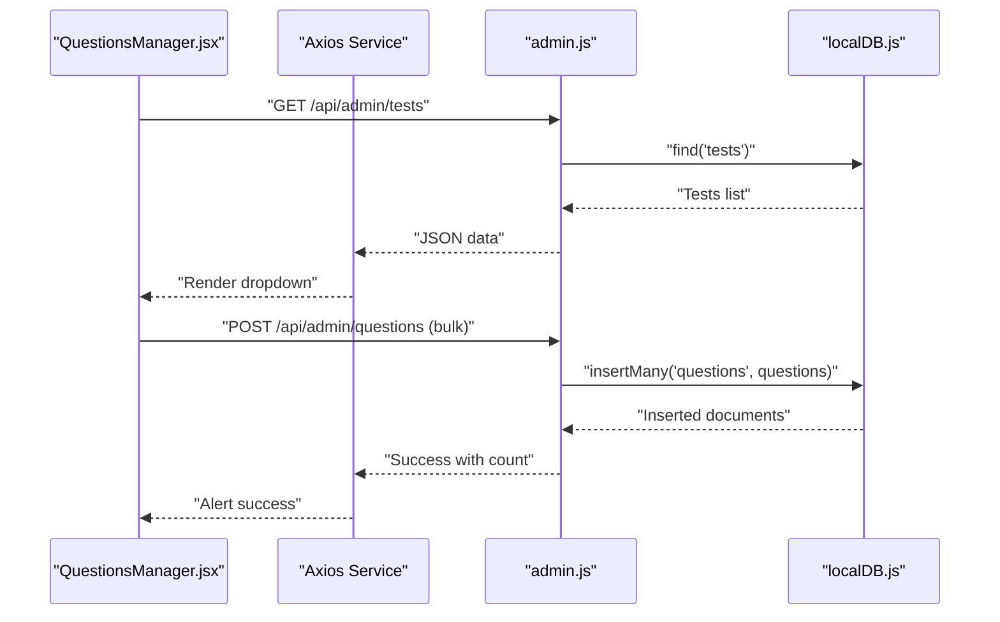
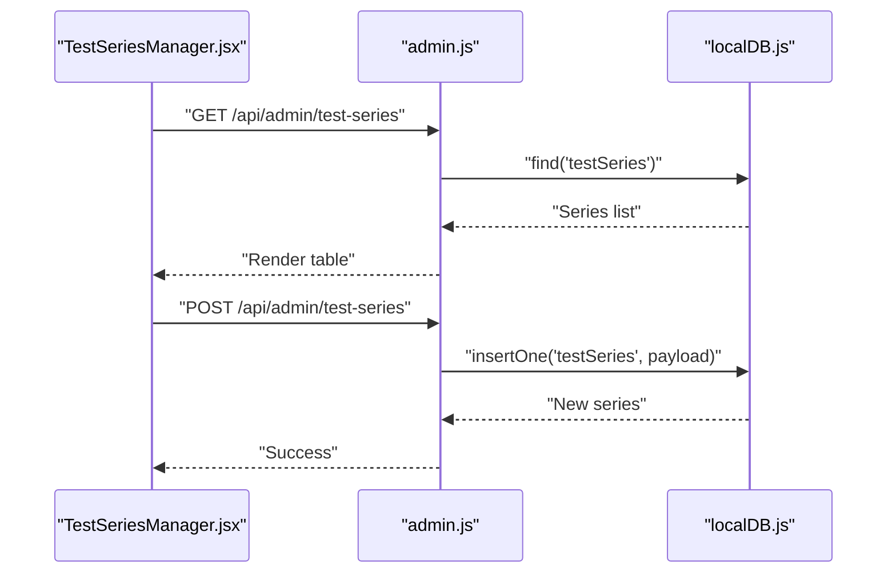
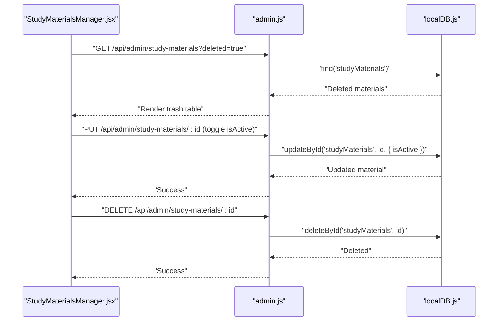
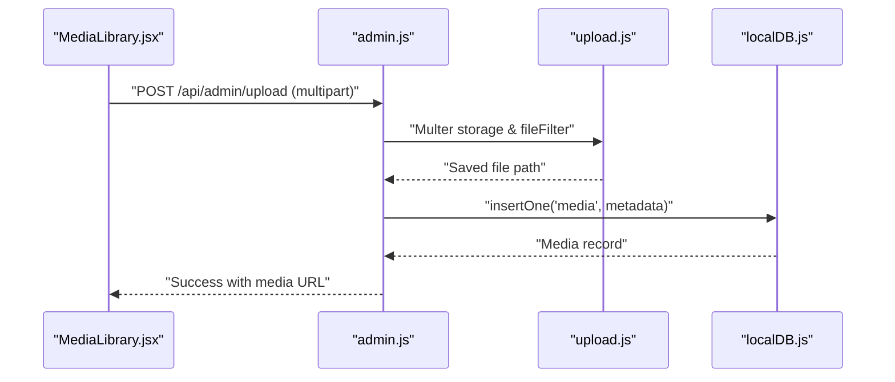
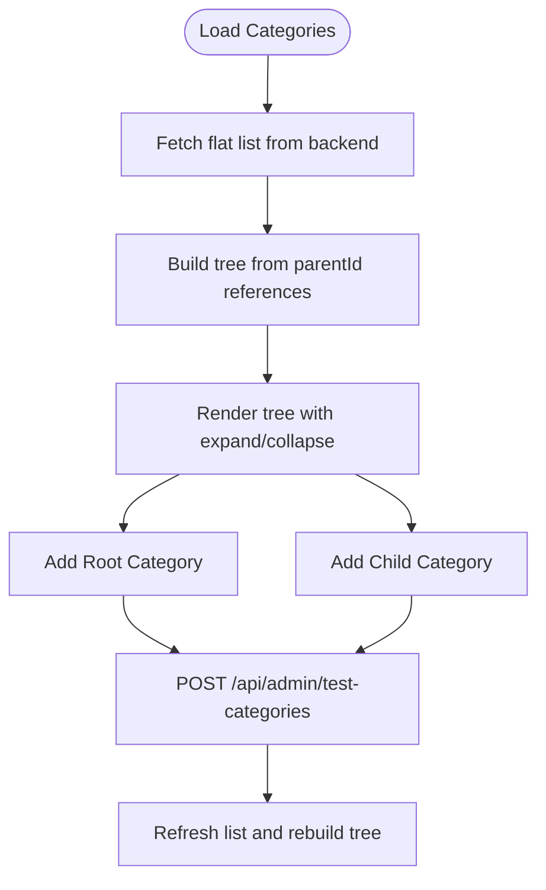
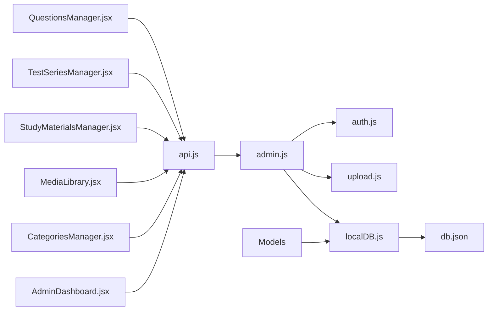

# Content Management Workflows

<cite>
**Referenced Files in This Document**
- [admin.js](file://Backend/src/routes/admin.js)
- [localDB.js](file://Backend/src/db/localDB.js)
- [Question.js](file://Backend/src/models/Question.js)
- [Test.js](file://Backend/src/models/Test.js)
- [TestSeries.js](file://Backend/src/models/TestSeries.js)
- [auth.js](file://Backend/src/middleware/auth.js)
- [upload.js](file://Backend/src/middleware/upload.js)
- [app.js](file://Backend/src/app.js)
- [db.json](file://Backend/data/db.json)
- [QuestionsManager.jsx](file://Frontend/src/pages/admin/QuestionsManager.jsx)
- [TestSeriesManager.jsx](file://Frontend/src/pages/admin/TestSeriesManager.jsx)
- [StudyMaterialsManager.jsx](file://Frontend/src/pages/admin/StudyMaterialsManager.jsx)
- [MediaLibrary.jsx](file://Frontend/src/pages/admin/MediaLibrary.jsx)
- [CategoriesManager.jsx](file://Frontend/src/pages/admin/CategoriesManager.jsx)
- [AdminDashboard.jsx](file://Frontend/src/pages/admin/AdminDashboard.jsx)
- [api.js](file://Frontend/src/services/api.js)
</cite>

## Table of Contents
1. [Introduction](#introduction)
2. [Project Structure](#project-structure)
3. [Core Components](#core-components)
4. [Architecture Overview](#architecture-overview)
5. [Detailed Component Analysis](#detailed-component-analysis)
6. [Dependency Analysis](#dependency-analysis)
7. [Performance Considerations](#performance-considerations)
8. [Troubleshooting Guide](#troubleshooting-guide)
9. [Conclusion](#conclusion)

## Introduction
This document provides comprehensive documentation for Trstprep V2's content management workflows in the admin panel. It covers the complete lifecycle for managing questions, test series, and study materials, including creation, editing, approval, publishing, validation, multi-language support, category assignment, soft deletion, bulk operations, scheduling, version control, analytics, and moderation. It also explains the integration between admin components and backend APIs, along with quality assurance measures.

## Project Structure
The content management system consists of:
- Backend: Express.js server with a local JSON database (lowdb) and admin routes for CRUD operations on content entities.
- Frontend: React admin pages that integrate with backend APIs for content management tasks.
- Middleware: Authentication, authorization, and file upload handling.
- Data Model: Entities for questions, tests, and test series with validation and indexing.

**Diagram sources**
- [admin.js](file://Backend/src/routes/admin.js#L1-L557)
- [localDB.js](file://Backend/src/db/localDB.js#L1-L222)
- [Question.js](file://Backend/src/models/Question.js#L1-L54)
- [Test.js](file://Backend/src/models/Test.js#L1-L77)
- [TestSeries.js](file://Backend/src/models/TestSeries.js#L1-L71)
- [auth.js](file://Backend/src/middleware/auth.js#L1-L92)
- [upload.js](file://Backend/src/middleware/upload.js#L1-L91)
- [app.js](file://Backend/src/app.js#L1-L94)
- [db.json](file://Backend/data/db.json#L1-L1029)
- [QuestionsManager.jsx](file://Frontend/src/pages/admin/QuestionsManager.jsx#L1-L421)
- [TestSeriesManager.jsx](file://Frontend/src/pages/admin/TestSeriesManager.jsx#L1-L424)
- [StudyMaterialsManager.jsx](file://Frontend/src/pages/admin/StudyMaterialsManager.jsx#L1-L539)
- [MediaLibrary.jsx](file://Frontend/src/pages/admin/MediaLibrary.jsx#L1-L154)
- [CategoriesManager.jsx](file://Frontend/src/pages/admin/CategoriesManager.jsx#L1-L432)
- [AdminDashboard.jsx](file://Frontend/src/pages/admin/AdminDashboard.jsx#L1-L182)
- [api.js](file://Frontend/src/services/api.js#L1-L92)

**Section sources**
- [admin.js](file://Backend/src/routes/admin.js#L1-L557)
- [localDB.js](file://Backend/src/db/localDB.js#L1-L222)
- [Question.js](file://Backend/src/models/Question.js#L1-L54)
- [Test.js](file://Backend/src/models/Test.js#L1-L77)
- [TestSeries.js](file://Backend/src/models/TestSeries.js#L1-L71)
- [auth.js](file://Backend/src/middleware/auth.js#L1-L92)
- [upload.js](file://Backend/src/middleware/upload.js#L1-L91)
- [app.js](file://Backend/src/app.js#L1-L94)
- [db.json](file://Backend/data/db.json#L1-L1029)
- [QuestionsManager.jsx](file://Frontend/src/pages/admin/QuestionsManager.jsx#L1-L421)
- [TestSeriesManager.jsx](file://Frontend/src/pages/admin/TestSeriesManager.jsx#L1-L424)
- [StudyMaterialsManager.jsx](file://Frontend/src/pages/admin/StudyMaterialsManager.jsx#L1-L539)
- [MediaLibrary.jsx](file://Frontend/src/pages/admin/MediaLibrary.jsx#L1-L154)
- [CategoriesManager.jsx](file://Frontend/src/pages/admin/CategoriesManager.jsx#L1-L432)
- [AdminDashboard.jsx](file://Frontend/src/pages/admin/AdminDashboard.jsx#L1-L182)
- [api.js](file://Frontend/src/services/api.js#L1-L92)

## Core Components
- Admin Routes: Provide endpoints for managing test series, tests, questions, study materials, users, categories, navigation, and settings.
- Local Database: Provides CRUD helpers and maintains data in a JSON file.
- Content Models: Define schemas for questions, tests, and test series with validation and indexing.
- Admin Pages: React components for creating, editing, deleting, and organizing content.
- Middleware: Authentication and authorization enforcement, file upload handling.
- API Layer: Axios-based service for frontend-backend communication with interceptors.

Key capabilities:
- Multi-language support: Questions support English/Hindi fields.
- Category assignment: Hierarchical test categories managed via admin.
- Soft delete: Study materials support soft deletion and restoration.
- Bulk operations: Bulk question upload endpoint.
- File management: Media upload with type filtering and storage.
- Validation: Frontend form validation and backend schema constraints.

**Section sources**
- [admin.js](file://Backend/src/routes/admin.js#L1-L557)
- [localDB.js](file://Backend/src/db/localDB.js#L82-L222)
- [Question.js](file://Backend/src/models/Question.js#L14-L44)
- [Test.js](file://Backend/src/models/Test.js#L14-L68)
- [TestSeries.js](file://Backend/src/models/TestSeries.js#L11-L63)
- [QuestionsManager.jsx](file://Frontend/src/pages/admin/QuestionsManager.jsx#L59-L95)
- [StudyMaterialsManager.jsx](file://Frontend/src/pages/admin/StudyMaterialsManager.jsx#L111-L172)
- [CategoriesManager.jsx](file://Frontend/src/pages/admin/CategoriesManager.jsx#L220-L242)
- [MediaLibrary.jsx](file://Frontend/src/pages/admin/MediaLibrary.jsx#L9-L49)
- [api.js](file://Frontend/src/services/api.js#L12-L44)

## Architecture Overview
The admin content management architecture follows a layered pattern:
- Presentation Layer: Admin React pages handle user interactions and display data.
- Service Layer: Axios client manages HTTP requests and interceptors.
- API Layer: Express routes enforce authentication and authorization, delegate to database helpers.
- Persistence Layer: Local JSON database with lowdb adapter.

**Diagram sources**
- [QuestionsManager.jsx](file://Frontend/src/pages/admin/QuestionsManager.jsx#L59-L95)
- [api.js](file://Frontend/src/services/api.js#L12-L44)
- [auth.js](file://Backend/src/middleware/auth.js#L5-L44)
- [admin.js](file://Backend/src/routes/admin.js#L127-L134)
- [localDB.js](file://Backend/src/db/localDB.js#L119-L133)

**Section sources**
- [app.js](file://Backend/src/app.js#L56-L66)
- [auth.js](file://Backend/src/middleware/auth.js#L69-L78)
- [admin.js](file://Backend/src/routes/admin.js#L1-L11)
- [localDB.js](file://Backend/src/db/localDB.js#L82-L222)

## Detailed Component Analysis

### Questions Management Workflow
End-to-end process:
- Fetch tests and questions from backend.
- Create/edit questions with validation (marks, negative marks, correct answer).
- Bulk upload via CSV endpoint.
- Delete individual questions.

Validation and constraints:
- Question model enforces required fields and option counts.
- Frontend validates numeric inputs and correct answer selection.

Bulk operations:
- CSV upload endpoint supports batch insertion.

Approval and publishing:
- No explicit approval workflow exists; operations are immediate after successful validation.

**Diagram sources**
- [QuestionsManager.jsx](file://Frontend/src/pages/admin/QuestionsManager.jsx#L27-L57)
- [QuestionsManager.jsx](file://Frontend/src/pages/admin/QuestionsManager.jsx#L127-L159)
- [admin.js](file://Backend/src/routes/admin.js#L136-L144)
- [Question.js](file://Backend/src/models/Question.js#L3-L50)
- [localDB.js](file://Backend/src/db/localDB.js#L135-L149)

**Section sources**
- [QuestionsManager.jsx](file://Frontend/src/pages/admin/QuestionsManager.jsx#L1-L421)
- [admin.js](file://Backend/src/routes/admin.js#L117-L168)
- [Question.js](file://Backend/src/models/Question.js#L1-L54)
- [localDB.js](file://Backend/src/db/localDB.js#L135-L149)

### Test Series Management Workflow
End-to-end process:
- Fetch and display test series.
- Create/update series with slug generation and category selection.
- Toggle activation status.
- Delete series.

Validation and constraints:
- Slug auto-generation from title.
- Category restricted to predefined values.
- Tags split into arrays.

Approval and publishing:
- Activation controlled via checkbox; no separate approval step.

**Diagram sources**
- [TestSeriesManager.jsx](file://Frontend/src/pages/admin/TestSeriesManager.jsx#L27-L42)
- [TestSeriesManager.jsx](file://Frontend/src/pages/admin/TestSeriesManager.jsx#L44-L79)
- [admin.js](file://Backend/src/routes/admin.js#L41-L72)
- [TestSeries.js](file://Backend/src/models/TestSeries.js#L3-L63)
- [localDB.js](file://Backend/src/db/localDB.js#L119-L133)

**Section sources**
- [TestSeriesManager.jsx](file://Frontend/src/pages/admin/TestSeriesManager.jsx#L1-L424)
- [admin.js](file://Backend/src/routes/admin.js#L31-L72)
- [TestSeries.js](file://Backend/src/models/TestSeries.js#L1-L71)

### Study Materials Management Workflow
End-to-end process:
- Fetch materials with optional trash filter.
- Create/update materials with counters and ordering.
- Toggle activation status.
- Soft delete with restoration.
- Reordering via sequential updates.

Soft delete and restoration:
- Soft delete moves items to trash; restoration endpoint restores them.

Reordering:
- Sequential PUT requests update order indices.

**Diagram sources**
- [StudyMaterialsManager.jsx](file://Frontend/src/pages/admin/StudyMaterialsManager.jsx#L29-L48)
- [StudyMaterialsManager.jsx](file://Frontend/src/pages/admin/StudyMaterialsManager.jsx#L89-L109)
- [StudyMaterialsManager.jsx](file://Frontend/src/pages/admin/StudyMaterialsManager.jsx#L111-L172)
- [StudyMaterialsManager.jsx](file://Frontend/src/pages/admin/StudyMaterialsManager.jsx#L174-L205)
- [admin.js](file://Backend/src/routes/admin.js#L170-L211)
- [localDB.js](file://Backend/src/db/localDB.js#L170-L185)

**Section sources**
- [StudyMaterialsManager.jsx](file://Frontend/src/pages/admin/StudyMaterialsManager.jsx#L1-L539)
- [admin.js](file://Backend/src/routes/admin.js#L170-L211)
- [localDB.js](file://Backend/src/db/localDB.js#L170-L185)

### Media Library Workflow
End-to-end process:
- Select file and upload via multipart/form-data.
- Backend validates file type and size, stores in appropriate directory.
- Records metadata in media collection.

Supported types and limits:
- Images, PDFs, and videos with size limit.

**Diagram sources**
- [MediaLibrary.jsx](file://Frontend/src/pages/admin/MediaLibrary.jsx#L9-L49)
- [admin.js](file://Backend/src/routes/admin.js#L242-L272)
- [upload.js](file://Backend/src/middleware/upload.js#L31-L83)
- [localDB.js](file://Backend/src/db/localDB.js#L119-L133)

**Section sources**
- [MediaLibrary.jsx](file://Frontend/src/pages/admin/MediaLibrary.jsx#L1-L154)
- [admin.js](file://Backend/src/routes/admin.js#L242-L272)
- [upload.js](file://Backend/src/middleware/upload.js#L1-L91)
- [localDB.js](file://Backend/src/db/localDB.js#L1-L222)

### Categories Management Workflow
End-to-end process:
- Fetch flat category list and render hierarchical tree.
- Create root or child categories with parent selection.
- Expand/collapse nodes and add children.

**Diagram sources**
- [CategoriesManager.jsx](file://Frontend/src/pages/admin/CategoriesManager.jsx#L24-L39)
- [CategoriesManager.jsx](file://Frontend/src/pages/admin/CategoriesManager.jsx#L220-L242)
- [CategoriesManager.jsx](file://Frontend/src/pages/admin/CategoriesManager.jsx#L41-L75)
- [admin.js](file://Backend/src/routes/admin.js#L301-L364)

**Section sources**
- [CategoriesManager.jsx](file://Frontend/src/pages/admin/CategoriesManager.jsx#L1-L432)
- [admin.js](file://Backend/src/routes/admin.js#L301-L364)

### Content Validation and Quality Assurance
Validation mechanisms:
- Frontend forms validate required fields, numeric ranges, and selections.
- Backend models define required fields, enums, and constraints.
- File upload middleware filters supported types and enforces size limits.

Quality assurance measures:
- Unique compound indexes prevent duplicate slugs and question numbers.
- Controlled category and test types via enums.
- Tag normalization (comma-separated) for consistency.

**Section sources**
- [Question.js](file://Backend/src/models/Question.js#L3-L50)
- [Test.js](file://Backend/src/models/Test.js#L14-L73)
- [TestSeries.js](file://Backend/src/models/TestSeries.js#L16-L67)
- [QuestionsManager.jsx](file://Frontend/src/pages/admin/QuestionsManager.jsx#L59-L95)
- [TestSeriesManager.jsx](file://Frontend/src/pages/admin/TestSeriesManager.jsx#L44-L79)
- [upload.js](file://Backend/src/middleware/upload.js#L56-L83)

### Multi-Language Support Implementation
- Questions support bilingual fields: text and options in English/Hindi.
- Backend schema defines language-specific fields with defaults.
- Frontend exposes language-aware editing controls.

**Section sources**
- [Question.js](file://Backend/src/models/Question.js#L14-L21)
- [QuestionsManager.jsx](file://Frontend/src/pages/admin/QuestionsManager.jsx#L1-L421)

### Content Scheduling
- Tests support live scheduling via date field.
- Activation toggles visibility and availability.

**Section sources**
- [Test.js](file://Backend/src/models/Test.js#L59-L65)
- [TestSeriesManager.jsx](file://Frontend/src/pages/admin/TestSeriesManager.jsx#L89-L109)

### Version Control
- Local database maintains createdAt/updatedAt timestamps for auditability.
- No explicit version history or rollback mechanism is implemented.

**Section sources**
- [localDB.js](file://Backend/src/db/localDB.js#L124-L129)
- [localDB.js](file://Backend/src/db/localDB.js#L176-L180)

### Content Analytics
- Admin dashboard displays platform statistics.
- Analytics endpoints exist in user API for user-level metrics.

**Section sources**
- [AdminDashboard.jsx](file://Frontend/src/pages/admin/AdminDashboard.jsx#L16-L33)
- [api.js](file://Frontend/src/services/api.js#L74-L81)

### Approval and Moderation Workflows
- No dedicated approval workflow is implemented in the admin routes.
- Activation toggles control publish state for series and materials.
- Users can be managed with pro pass controls.

**Section sources**
- [admin.js](file://Backend/src/routes/admin.js#L213-L240)
- [TestSeriesManager.jsx](file://Frontend/src/pages/admin/TestSeriesManager.jsx#L89-L109)
- [StudyMaterialsManager.jsx](file://Frontend/src/pages/admin/StudyMaterialsManager.jsx#L89-L109)

## Dependency Analysis
The admin system exhibits clear separation of concerns:
- Admin pages depend on the API service for HTTP communication.
- API service depends on route handlers for business logic.
- Route handlers depend on middleware for auth and uploads, and on database helpers for persistence.
- Database helpers encapsulate lowdb operations and maintain data integrity.

**Diagram sources**
- [QuestionsManager.jsx](file://Frontend/src/pages/admin/QuestionsManager.jsx#L1-L421)
- [TestSeriesManager.jsx](file://Frontend/src/pages/admin/TestSeriesManager.jsx#L1-L424)
- [StudyMaterialsManager.jsx](file://Frontend/src/pages/admin/StudyMaterialsManager.jsx#L1-L539)
- [MediaLibrary.jsx](file://Frontend/src/pages/admin/MediaLibrary.jsx#L1-L154)
- [CategoriesManager.jsx](file://Frontend/src/pages/admin/CategoriesManager.jsx#L1-L432)
- [AdminDashboard.jsx](file://Frontend/src/pages/admin/AdminDashboard.jsx#L1-L182)
- [api.js](file://Frontend/src/services/api.js#L1-L92)
- [admin.js](file://Backend/src/routes/admin.js#L1-L557)
- [auth.js](file://Backend/src/middleware/auth.js#L1-L92)
- [upload.js](file://Backend/src/middleware/upload.js#L1-L91)
- [localDB.js](file://Backend/src/db/localDB.js#L1-L222)
- [db.json](file://Backend/data/db.json#L1-L1029)

**Section sources**
- [api.js](file://Frontend/src/services/api.js#L1-L92)
- [admin.js](file://Backend/src/routes/admin.js#L1-L557)
- [auth.js](file://Backend/src/middleware/auth.js#L1-L92)
- [upload.js](file://Backend/src/middleware/upload.js#L1-L91)
- [localDB.js](file://Backend/src/db/localDB.js#L1-L222)

## Performance Considerations
- Local JSON database is suitable for development and small-scale usage but may require migration to a scalable database for production workloads.
- Bulk operations (questions) leverage insertMany to minimize round trips.
- File uploads are limited by size; consider chunked uploads for very large files.
- Frontend components use optimistic UI updates for soft deletes and reordering; ensure proper error handling and fallbacks.

## Troubleshooting Guide
Common issues and resolutions:
- Authentication failures: Ensure Bearer token is present in Authorization header; verify JWT secret and user role.
- File upload errors: Confirm file type and size limits; check upload directories permissions.
- Duplicate entries: Unique compound indexes prevent duplicates; verify slug and question number uniqueness.
- Network errors: Axios interceptors handle 401 and network failures; check frontend error logging.

**Section sources**
- [auth.js](file://Backend/src/middleware/auth.js#L5-L44)
- [upload.js](file://Backend/src/middleware/upload.js#L56-L83)
- [api.js](file://Frontend/src/services/api.js#L26-L44)
- [Question.js](file://Backend/src/models/Question.js#L49-L50)
- [Test.js](file://Backend/src/models/Test.js#L70-L71)

## Conclusion
Trstprep V2's admin content management system provides a robust foundation for managing questions, test series, and study materials. It emphasizes simplicity through a local JSON database, strong validation, and intuitive admin interfaces. While it currently lacks formal approval workflows and advanced scheduling features, it offers essential capabilities such as multi-language support, hierarchical categories, soft deletion, bulk operations, and media management. Future enhancements could include explicit approval processes, richer scheduling options, and migration to a scalable database for production environments.

*Last Updated: March 10, 2026 | Update date is (20:16)*
