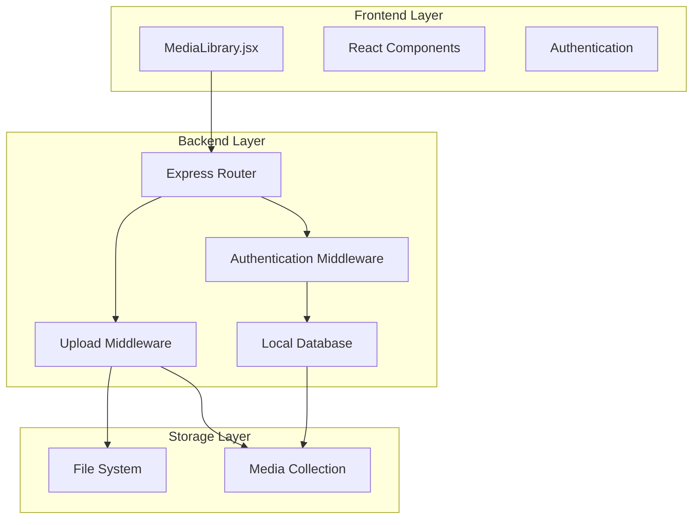
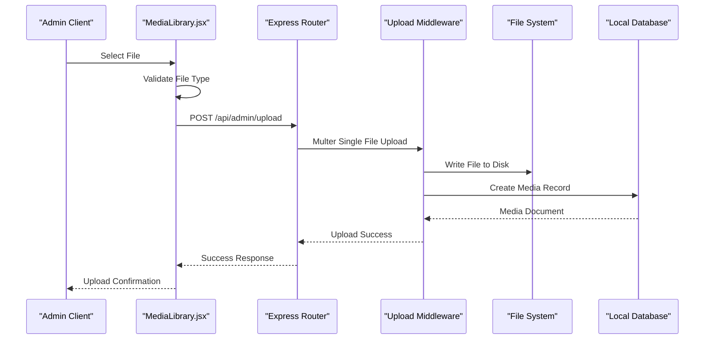
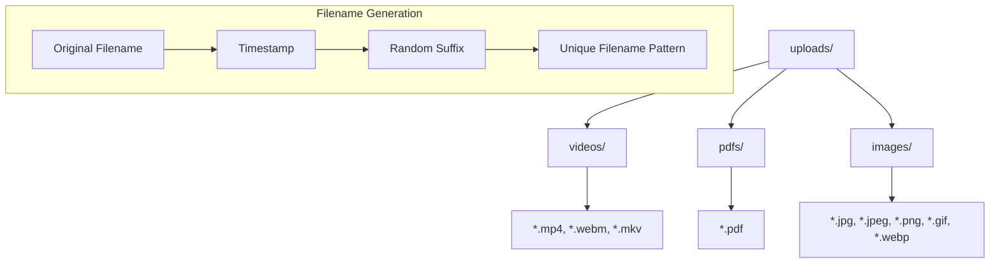
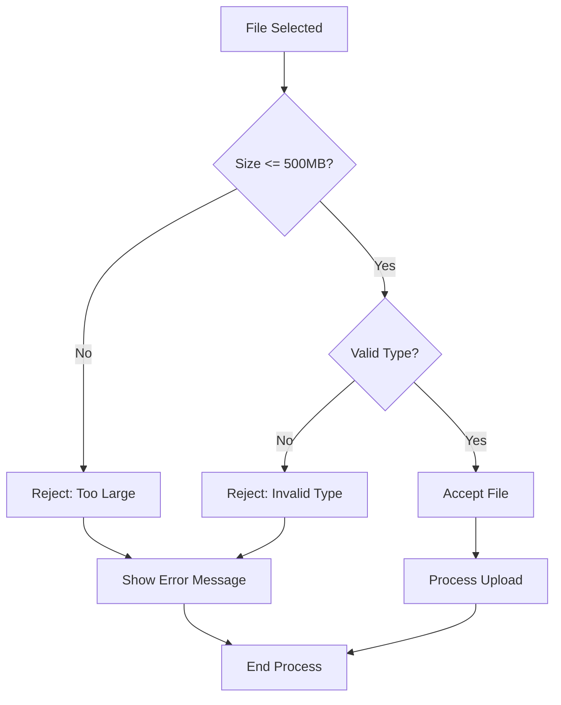
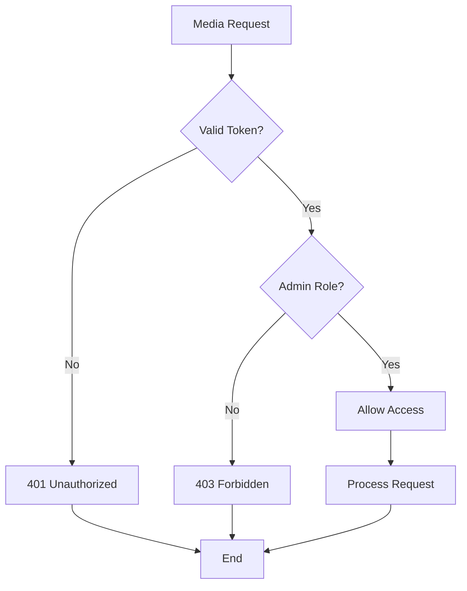

# Media Library Management

<cite>
**Referenced Files in This Document**
- [MediaLibrary.jsx](file://Frontend/src/pages/admin/MediaLibrary.jsx)
- [upload.js](file://Backend/src/middleware/upload.js)
- [admin.js](file://Backend/src/routes/admin.js)
- [localDB.js](file://Backend/src/db/localDB.js)
- [db.json](file://Backend/data/db.json)
- [auth.js](file://Backend/src/middleware/auth.js)
- [errorHandler.js](file://Backend/src/middleware/errorHandler.js)
- [package.json](file://Backend/package.json)
</cite>

## Table of Contents
1. [Introduction](#introduction)
2. [System Architecture](#system-architecture)
3. [Media Upload Process](#media-upload-process)
4. [File Organization and Storage](#file-organization-and-storage)
5. [Metadata Management](#metadata-management)
6. [Supported Formats and Limits](#supported-formats-and-limits)
7. [Content Delivery Optimization](#content-delivery-optimization)
8. [Security and Access Control](#security-and-access-control)
9. [Integration with Content Creation Workflows](#integration-with-content-creation-workflows)
10. [Performance Considerations](#performance-considerations)
11. [Troubleshooting Guide](#troubleshooting-guide)
12. [Conclusion](#conclusion)

## Introduction

The Trstprep V2 media library management system provides a comprehensive solution for uploading, organizing, and managing multimedia content within the admin panel. This system handles video lectures, PDF study materials, and image assets, integrating seamlessly with the broader content creation ecosystem.

The media library serves as a central repository for all educational content, enabling administrators to efficiently manage learning resources while maintaining optimal performance and security standards.

## System Architecture

The media library follows a client-server architecture with clear separation of concerns:

**Diagram sources**
- [MediaLibrary.jsx](file://Frontend/src/pages/admin/MediaLibrary.jsx#L1-L154)
- [admin.js](file://Backend/src/routes/admin.js#L1-L557)
- [upload.js](file://Backend/src/middleware/upload.js#L1-L91)

## Media Upload Process

The upload process involves multiple stages from initial file selection to final storage and metadata persistence:

**Diagram sources**
- [MediaLibrary.jsx](file://Frontend/src/pages/admin/MediaLibrary.jsx#L9-L49)
- [admin.js](file://Backend/src/routes/admin.js#L243-L272)
- [upload.js](file://Backend/src/middleware/upload.js#L77-L83)

### Upload Workflow Details

The upload process follows these steps:

1. **File Selection**: Users select files through the drag-and-drop interface
2. **Validation**: Frontend validates file types and sizes before submission
3. **Authentication**: Bearer token authentication ensures only authorized admins can upload
4. **Processing**: Backend validates file types and applies size limits
5. **Storage**: Files are written to appropriate directories based on MIME type
6. **Metadata**: Database records are created with comprehensive metadata
7. **Response**: Success confirmation is returned to the admin interface

**Section sources**
- [MediaLibrary.jsx](file://Frontend/src/pages/admin/MediaLibrary.jsx#L9-L49)
- [admin.js](file://Backend/src/routes/admin.js#L243-L272)
- [upload.js](file://Backend/src/middleware/upload.js#L56-L83)

## File Organization and Storage

The system implements a hierarchical file organization strategy with automatic directory creation and management:

**Diagram sources**
- [upload.js](file://Backend/src/middleware/upload.js#L11-L25)
- [upload.js](file://Backend/src/middleware/upload.js#L31-L53)

### Directory Structure

The system automatically creates and manages the following directory structure:

- **Root Directory**: `uploads/`
  - **Video Directory**: `uploads/videos/` - Stores MP4, WebM, MKV files
  - **PDF Directory**: `uploads/pdfs/` - Stores PDF documents
  - **Image Directory**: `uploads/images/` - Stores JPG, PNG, GIF, WebP files

### Filename Generation Strategy

To prevent conflicts and ensure uniqueness, the system generates filenames using the pattern:
`{original-name}-{timestamp}-{random-suffix}.{extension}`

This approach guarantees:
- Original file context preservation
- Automatic conflict prevention
- Timestamp-based ordering
- Random suffix for additional uniqueness

**Section sources**
- [upload.js](file://Backend/src/middleware/upload.js#L11-L25)
- [upload.js](file://Backend/src/middleware/upload.js#L46-L52)

## Metadata Management

The media library maintains comprehensive metadata for each uploaded file, enabling efficient organization and retrieval:

### Media Record Structure

Each uploaded file creates a media record with the following attributes:

| Field | Type | Description |
|-------|------|-------------|
| `_id` | String | Unique identifier |
| `filename` | String | Generated unique filename |
| `originalName` | String | Original file name |
| `mimeType` | String | MIME type (image/jpeg, video/mp4, etc.) |
| `size` | Number | File size in bytes |
| `url` | String | Relative URL path |
| `fileType` | String | Category (videos, pdfs, images) |
| `uploadedBy` | String | Admin user ID |
| `createdAt` | Date | Record creation timestamp |
| `updatedAt` | Date | Last update timestamp |

### Database Integration

The media collection integrates with the local database system, providing:

- **JSON-based storage** for development and testing
- **MongoDB compatibility** for production migration
- **Automatic indexing** on frequently queried fields
- **Consistent schema** across all media types

**Section sources**
- [admin.js](file://Backend/src/routes/admin.js#L255-L263)
- [localDB.js](file://Backend/src/db/localDB.js#L35-L44)

## Supported Formats and Limits

The system supports a comprehensive range of media formats optimized for educational content delivery:

### Supported File Types

**Video Formats**
- MP4 (H.264/H.265)
- WebM (VP8/VP9)
- MKV (Matroska)

**Image Formats**
- JPEG/JPG
- PNG
- GIF
- WebP

**Document Formats**
- PDF

### Size Limitations

The system enforces strict size limits to maintain performance and storage efficiency:

- **Maximum File Size**: 500 MB per file
- **Reasoning**: Balances quality with storage constraints
- **Validation**: Enforced at both frontend and backend levels

### Format Validation

The system implements comprehensive validation:

**Diagram sources**
- [MediaLibrary.jsx](file://Frontend/src/pages/admin/MediaLibrary.jsx#L82-L87)
- [upload.js](file://Backend/src/middleware/upload.js#L56-L74)

**Section sources**
- [MediaLibrary.jsx](file://Frontend/src/pages/admin/MediaLibrary.jsx#L66-L87)
- [upload.js](file://Backend/src/middleware/upload.js#L56-L83)

## Content Delivery Optimization

The media library implements several optimization strategies for efficient content delivery:

### URL Generation Strategy

The system generates URLs using a consistent pattern:
`{BASE_URL}/uploads/{fileType}/{filename}`

Where:
- **BASE_URL**: Environment-configurable base URL
- **fileType**: Directory classification (videos, pdfs, images)
- **filename**: Unique generated filename

### Performance Features

- **Direct File System Access**: Files stored directly on disk for optimal I/O
- **Minimal Processing**: No server-side transcoding or compression
- **Static Asset Serving**: Leverages browser caching capabilities
- **Efficient Storage**: Hierarchical organization reduces directory congestion

### Scalability Considerations

The current implementation uses local file system storage, with built-in support for cloud storage migration through environment configuration.

**Section sources**
- [upload.js](file://Backend/src/middleware/upload.js#L86-L89)

## Security and Access Control

The media library implements comprehensive security measures to protect content and ensure proper access control:

### Authentication Requirements

All media operations require:
- **Bearer Token Authentication**: JWT-based authentication
- **Admin Role Verification**: Only admin users can access media upload functionality
- **Token Validation**: Server-side verification of authentication tokens

### Authorization Controls

**Diagram sources**
- [auth.js](file://Backend/src/middleware/auth.js#L5-L44)
- [auth.js](file://Backend/src/middleware/auth.js#L69-L78)

### Security Measures

- **Input Validation**: Comprehensive file type and size validation
- **Directory Isolation**: Separate directories for different file types
- **Unique Filenames**: Prevents malicious filename attacks
- **Rate Limiting**: Built-in size limits prevent abuse
- **Error Handling**: Graceful error handling prevents information leakage

**Section sources**
- [auth.js](file://Backend/src/middleware/auth.js#L1-L92)
- [errorHandler.js](file://Backend/src/middleware/errorHandler.js#L1-L52)

## Integration with Content Creation Workflows

The media library seamlessly integrates with the broader content creation ecosystem:

### Content Management Integration

Media assets are designed to integrate with:
- **Test Series Management**: Videos and PDFs for test preparation
- **Study Material Management**: Documents and resources for learning
- **Question Management**: Multimedia support for question content
- **Course Creation**: Video lectures and supplementary materials

### Workflow Benefits

- **Centralized Asset Management**: Single source for all media content
- **Consistent Quality Standards**: Enforced through validation rules
- **Easy Integration**: Standardized metadata enables seamless content linking
- **Scalable Architecture**: Supports growing content libraries

### Future Integration Points

The system is designed to support:
- **CDN Integration**: Cloud storage and delivery optimization
- **Content Processing**: Automated transcoding and optimization
- **Analytics Integration**: Usage tracking and performance metrics
- **Version Control**: Content revision and history tracking

## Performance Considerations

The media library is optimized for performance across multiple dimensions:

### Storage Performance

- **Direct File System**: Minimal overhead compared to database storage
- **Hierarchical Organization**: Reduces filesystem congestion
- **Efficient Indexing**: Database records provide quick lookup capabilities
- **Memory Management**: Streaming file uploads prevent memory exhaustion

### Network Performance

- **Chunked Uploads**: Large files uploaded in manageable chunks
- **Progress Tracking**: Real-time upload progress monitoring
- **Connection Pooling**: Optimized database connections
- **Caching Strategies**: Browser and server-side caching

### Scalability Planning

The system supports horizontal scaling through:
- **Load Balancing**: Multiple instances can share storage
- **Database Migration**: Seamless transition to MongoDB
- **Cloud Storage**: Ready for AWS S3, Google Cloud Storage integration
- **CDN Integration**: Content delivery network support

## Troubleshooting Guide

Common issues and their solutions:

### Upload Issues

**Problem**: Upload fails with "File type not allowed"
**Solution**: Verify file extension matches supported formats

**Problem**: Upload fails with "Too large" error
**Solution**: Reduce file size below 500MB limit

**Problem**: Authentication errors during upload
**Solution**: Ensure valid admin credentials and token refresh

### Storage Issues

**Problem**: Files not appearing in media library
**Solution**: Check file permissions and directory existence

**Problem**: Corrupted or incomplete uploads
**Solution**: Verify network stability and retry upload

### Performance Issues

**Problem**: Slow upload speeds
**Solution**: Optimize network connection and reduce file size

**Problem**: Memory issues with large files
**Solution**: Use chunked upload or reduce concurrent uploads

**Section sources**
- [errorHandler.js](file://Backend/src/middleware/errorHandler.js#L11-L51)

## Conclusion

The Trstprep V2 media library management system provides a robust, scalable solution for educational content management. Its architecture balances simplicity with functionality, supporting current requirements while maintaining flexibility for future enhancements.

Key strengths include comprehensive file validation, secure access controls, efficient storage organization, and seamless integration with content creation workflows. The system's modular design facilitates easy maintenance and future feature additions.

The implementation demonstrates best practices in media management, providing a solid foundation for the Trstprep platform's educational content ecosystem.

*Last Updated: March 10, 2026 | Update date is (20:16)*
