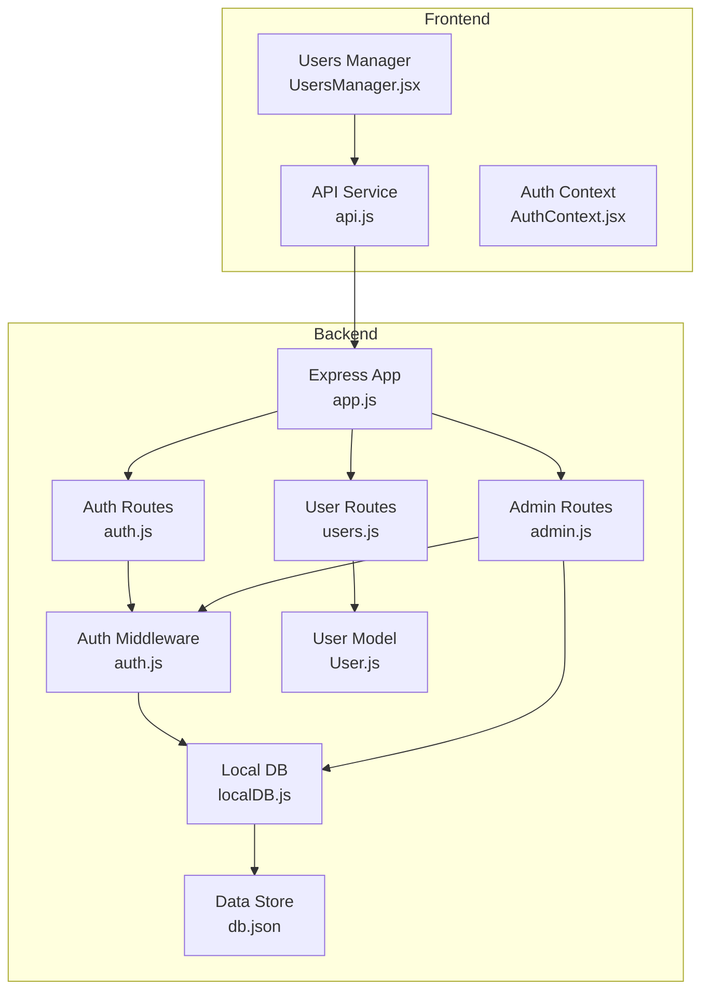
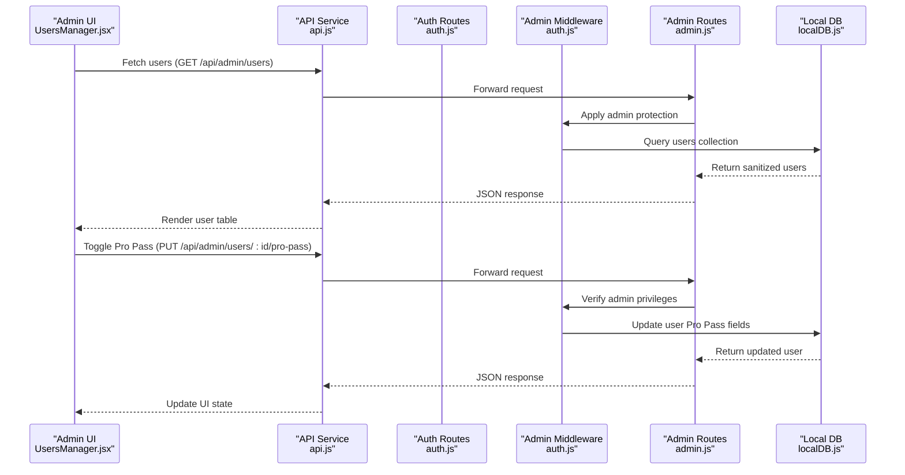
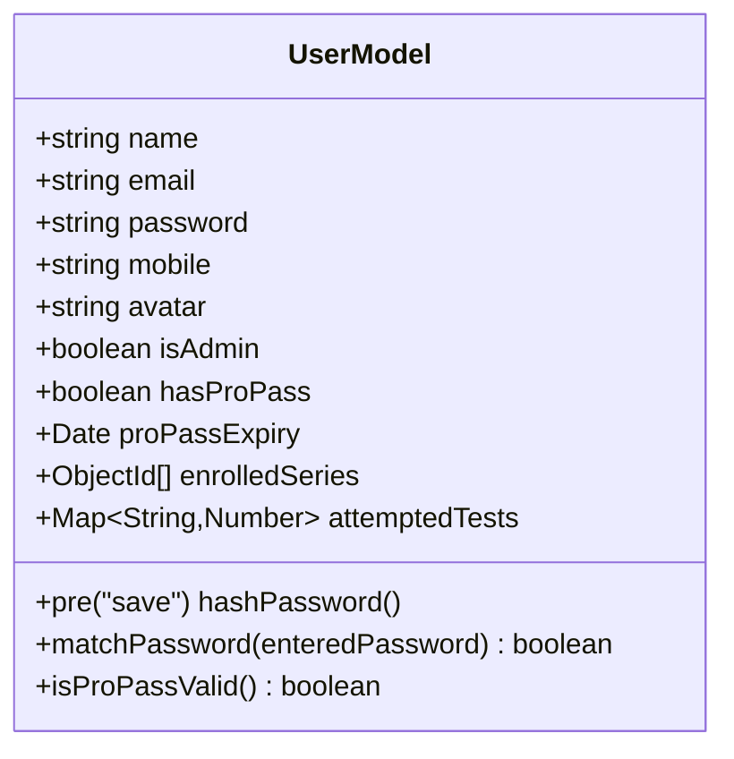
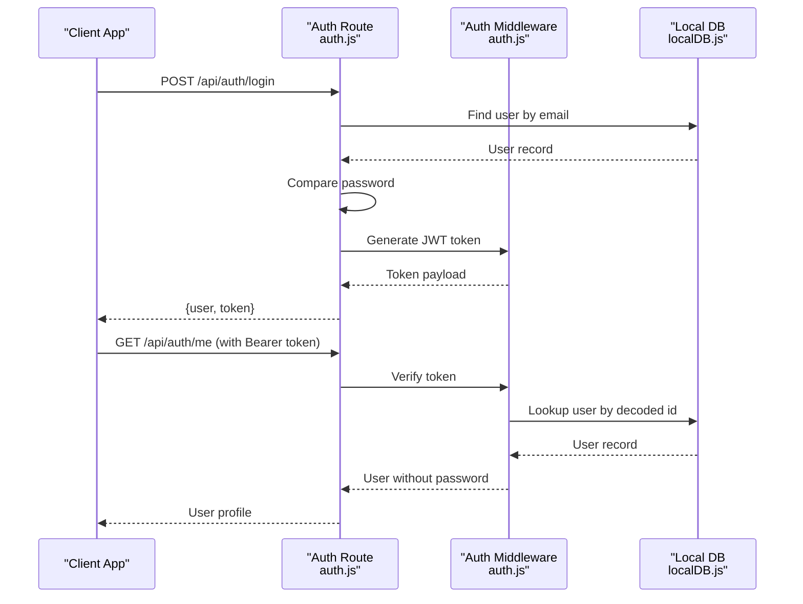
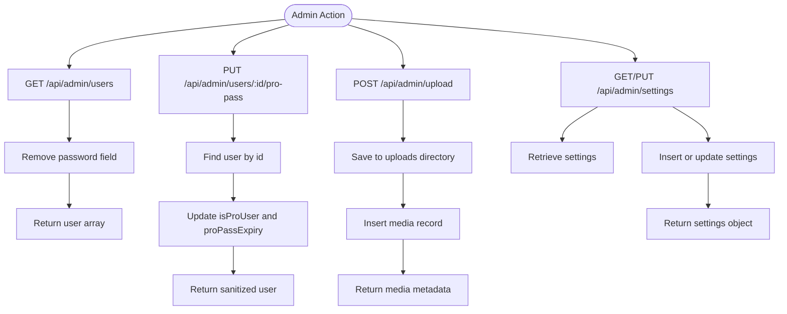
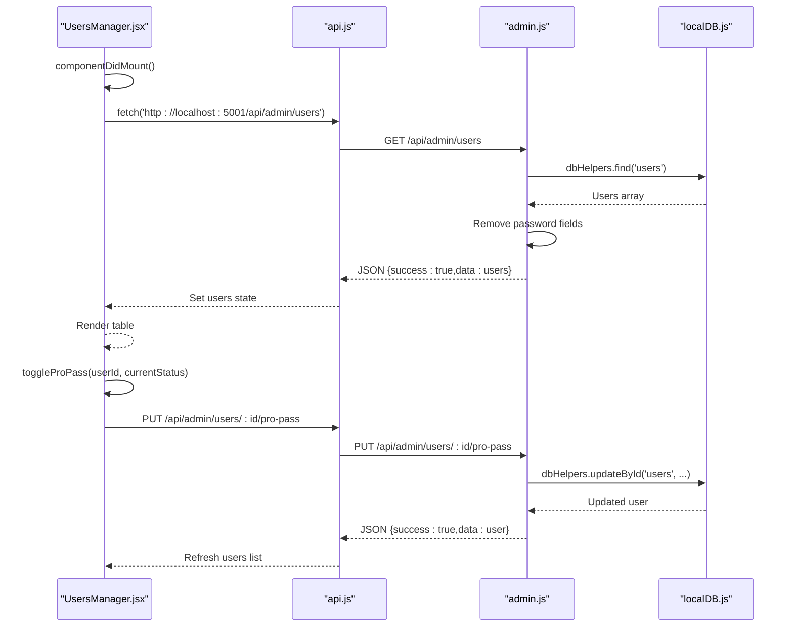
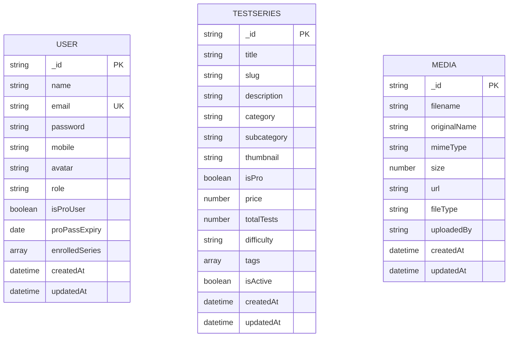
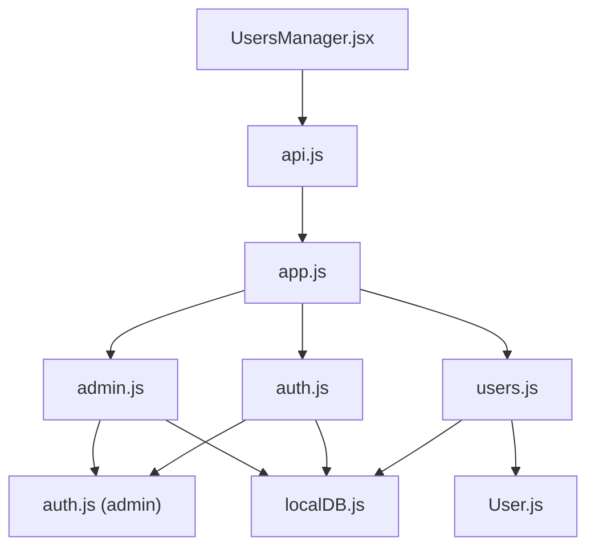

# User Management System

<cite>
**Referenced Files in This Document**
- [User.js](file://Backend/src/models/User.js)
- [users.js](file://Backend/src/routes/users.js)
- [admin.js](file://Backend/src/routes/admin.js)
- [auth.js](file://Backend/src/routes/auth.js)
- [auth.js](file://Backend/src/middleware/auth.js)
- [localDB.js](file://Backend/src/db/localDB.js)
- [db.json](file://Backend/data/db.json)
- [UsersManager.jsx](file://Frontend/src/pages/admin/UsersManager.jsx)
- [api.js](file://Frontend/src/services/api.js)
- [AuthContext.jsx](file://Frontend/src/context/AuthContext.jsx)
- [app.js](file://Backend/src/app.js)
</cite>

## Table of Contents
1. [Introduction](#introduction)
2. [Project Structure](#project-structure)
3. [Core Components](#core-components)
4. [Architecture Overview](#architecture-overview)
5. [Detailed Component Analysis](#detailed-component-analysis)
6. [Dependency Analysis](#dependency-analysis)
7. [Performance Considerations](#performance-considerations)
8. [Troubleshooting Guide](#troubleshooting-guide)
9. [Conclusion](#conclusion)

## Introduction
This document provides comprehensive documentation for the Trstprep V2 user management system within the admin panel. It covers user administration workflows including user listing, profile management, role assignment, permission control, and account status management. It also explains user search and filtering capabilities, bulk user operations, user activity monitoring, and audit trails. The integration between frontend admin components and backend user management APIs is detailed, along with user registration validation, email verification processes, and user preference management. Security measures for user data protection and administrative access controls are documented.

## Project Structure
The user management system spans both backend and frontend components:
- Backend: Express.js server with local JSON database, authentication middleware, and user/admin routes
- Frontend: React admin interface for user management with search and action controls
- Shared: API service layer and authentication context for secure communication

**Diagram sources**
- [app.js](file://Backend/src/app.js#L1-L94)
- [auth.js](file://Backend/src/routes/auth.js#L1-L174)
- [users.js](file://Backend/src/routes/users.js#L1-L150)
- [admin.js](file://Backend/src/routes/admin.js#L1-L557)
- [auth.js](file://Backend/src/middleware/auth.js#L1-L92)
- [localDB.js](file://Backend/src/db/localDB.js#L1-L222)
- [User.js](file://Backend/src/models/User.js#L1-L81)
- [db.json](file://Backend/data/db.json#L1-L1029)
- [UsersManager.jsx](file://Frontend/src/pages/admin/UsersManager.jsx#L1-L188)
- [api.js](file://Frontend/src/services/api.js#L1-L92)
- [AuthContext.jsx](file://Frontend/src/context/AuthContext.jsx#L1-L203)

**Section sources**
- [app.js](file://Backend/src/app.js#L1-L94)
- [UsersManager.jsx](file://Frontend/src/pages/admin/UsersManager.jsx#L1-L188)

## Core Components
- User model defines schema, validation, password hashing, and Pro Pass validity checks
- Authentication routes handle registration, login, and user retrieval
- Admin routes provide user listing and Pro Pass management for administrators
- Frontend Users Manager displays users, supports search, and toggles Pro Pass status
- API service centralizes HTTP requests with interceptors for auth and error handling
- Authentication context manages session lifecycle and user state

**Section sources**
- [User.js](file://Backend/src/models/User.js#L1-L81)
- [auth.js](file://Backend/src/routes/auth.js#L1-L174)
- [admin.js](file://Backend/src/routes/admin.js#L213-L240)
- [UsersManager.jsx](file://Frontend/src/pages/admin/UsersManager.jsx#L1-L188)
- [api.js](file://Frontend/src/services/api.js#L1-L92)
- [AuthContext.jsx](file://Frontend/src/context/AuthContext.jsx#L1-L203)

## Architecture Overview
The system follows a layered architecture:
- Presentation Layer: React admin components
- Service Layer: API service with interceptors
- Application Layer: Express routes for auth, user, and admin operations
- Domain Layer: User model and business logic
- Data Access Layer: Local JSON database abstraction

**Diagram sources**
- [UsersManager.jsx](file://Frontend/src/pages/admin/UsersManager.jsx#L13-L58)
- [api.js](file://Frontend/src/services/api.js#L73-L81)
- [admin.js](file://Backend/src/routes/admin.js#L213-L240)
- [auth.js](file://Backend/src/middleware/auth.js#L68-L92)
- [localDB.js](file://Backend/src/db/localDB.js#L151-L185)

## Detailed Component Analysis

### User Model and Validation
The User model enforces:
- Name: required, trimmed, max 50 characters
- Email: required, unique, lowercase, validated format
- Password: required, minimum 8 characters, hashed via bcrypt
- Mobile: optional
- Avatar: optional
- Role and Pro Pass fields for admin and premium access
- Timestamps for creation/update

**Diagram sources**
- [User.js](file://Backend/src/models/User.js#L4-L77)

**Section sources**
- [User.js](file://Backend/src/models/User.js#L1-L81)

### Authentication and Authorization
Authentication routes support:
- Registration: validates uniqueness, hashes password, generates JWT
- Login: verifies credentials, returns user and token
- Current user: protected endpoint to retrieve authenticated user

Authorization middleware:
- protect: verifies JWT, attaches user without password, sets isAdmin flag
- admin: restricts access to admin users only
- optionalAuth: attaches user if token present, otherwise continues
- proPass: restricts access to Pro Pass holders

**Diagram sources**
- [auth.js](file://Backend/src/routes/auth.js#L76-L161)
- [auth.js](file://Backend/src/middleware/auth.js#L5-L44)
- [localDB.js](file://Backend/src/db/localDB.js#L106-L111)

**Section sources**
- [auth.js](file://Backend/src/routes/auth.js#L1-L174)
- [auth.js](file://Backend/src/middleware/auth.js#L1-L92)
- [localDB.js](file://Backend/src/db/localDB.js#L1-L222)

### Admin User Management
Admin routes provide:
- User listing: retrieves sanitized user data (passwords excluded)
- Pro Pass management: updates isProUser and proPassExpiry fields
- File upload: handles media uploads and records metadata
- Settings management: CRUD operations for application settings
- Category and navigation management: hierarchical structures

**Diagram sources**
- [admin.js](file://Backend/src/routes/admin.js#L213-L240)
- [admin.js](file://Backend/src/routes/admin.js#L242-L272)
- [admin.js](file://Backend/src/routes/admin.js#L274-L299)

**Section sources**
- [admin.js](file://Backend/src/routes/admin.js#L213-L240)
- [admin.js](file://Backend/src/routes/admin.js#L242-L272)
- [admin.js](file://Backend/src/routes/admin.js#L274-L299)

### Frontend Admin Interface
The Users Manager component:
- Fetches users from admin API with bearer token
- Implements client-side search by name or email
- Provides action buttons to grant/revoke Pro Pass
- Displays user roles, Pro Pass status, and join date
- Uses optimistic UI updates after successful operations

**Diagram sources**
- [UsersManager.jsx](file://Frontend/src/pages/admin/UsersManager.jsx#L9-L58)
- [api.js](file://Frontend/src/services/api.js#L73-L81)
- [admin.js](file://Backend/src/routes/admin.js#L213-L240)
- [localDB.js](file://Backend/src/db/localDB.js#L151-L185)

**Section sources**
- [UsersManager.jsx](file://Frontend/src/pages/admin/UsersManager.jsx#L1-L188)
- [api.js](file://Frontend/src/services/api.js#L73-L81)

### Data Persistence and Schema
The local database stores:
- users: user accounts with roles and Pro Pass status
- testSeries, tests, questions: assessment data
- studyMaterials, chapters, videos, pdfs: learning resources
- media: uploaded files with metadata
- appSettings, navigationMenu, tagConfigs, banners, notifications: configuration data

**Diagram sources**
- [db.json](file://Backend/data/db.json#L2-L36)
- [db.json](file://Backend/data/db.json#L37-L99)
- [db.json](file://Backend/data/db.json#L628-L640)

**Section sources**
- [localDB.js](file://Backend/src/db/localDB.js#L9-L44)
- [db.json](file://Backend/data/db.json#L1-L1029)

## Dependency Analysis
Key dependencies and relationships:
- Express app initializes database and mounts route handlers
- Admin routes depend on auth middleware for protection
- User routes depend on model for data operations
- Frontend components depend on API service for HTTP communication
- Authentication context depends on API service for auth operations

**Diagram sources**
- [app.js](file://Backend/src/app.js#L14-L22)
- [admin.js](file://Backend/src/routes/admin.js#L1-L10)
- [auth.js](file://Backend/src/middleware/auth.js#L68-L78)
- [User.js](file://Backend/src/models/User.js#L1-L3)
- [localDB.js](file://Backend/src/db/localDB.js#L1-L8)
- [UsersManager.jsx](file://Frontend/src/pages/admin/UsersManager.jsx#L1-L4)
- [api.js](file://Frontend/src/services/api.js#L1-L10)

**Section sources**
- [app.js](file://Backend/src/app.js#L1-L94)
- [admin.js](file://Backend/src/routes/admin.js#L1-L10)
- [auth.js](file://Backend/src/middleware/auth.js#L68-L78)

## Performance Considerations
- Local JSON database is suitable for development and small-scale usage but may require migration to MongoDB for production scalability
- Client-side search filters users in memory; consider server-side filtering for large datasets
- JWT token verification occurs on each protected request; ensure efficient token storage and validation
- File upload limits and destination directories are configured; monitor disk usage for media storage

## Troubleshooting Guide
Common issues and resolutions:
- Authentication failures: Verify JWT secret environment variable and token presence in requests
- Admin access denied: Confirm user role is set to admin and token contains correct claims
- User not found errors: Check database initialization and user existence
- CORS issues: Ensure frontend URL matches backend CORS configuration
- File upload errors: Verify upload directories exist and file types are permitted

**Section sources**
- [auth.js](file://Backend/src/middleware/auth.js#L14-L43)
- [app.js](file://Backend/src/app.js#L28-L32)
- [upload.js](file://Backend/src/middleware/upload.js#L10-L25)

## Conclusion
The Trstprep V2 user management system provides a robust foundation for admin-controlled user administration with clear separation of concerns between frontend and backend components. The system supports essential workflows including user listing, role management, and Pro Pass control, while maintaining security through JWT-based authentication and middleware protection. For production deployment, consider migrating to MongoDB, implementing server-side search and filtering, and adding comprehensive audit logging for compliance and monitoring.

*Last Updated: March 10, 2026 | Update date is (20:16)*
