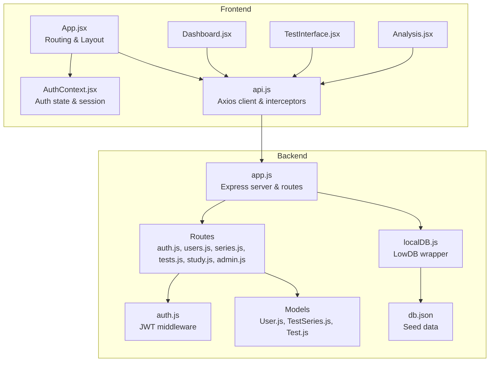
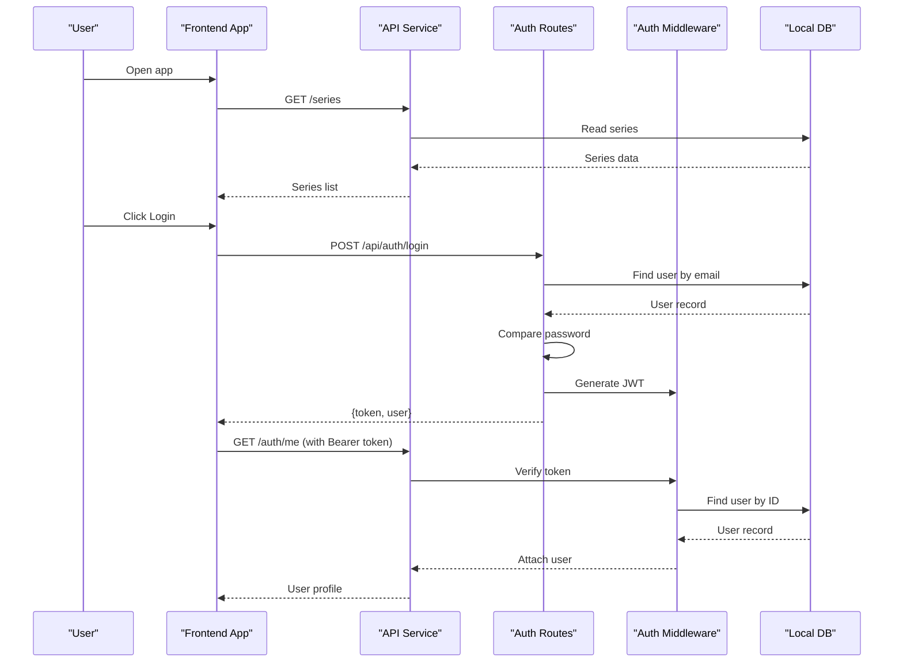
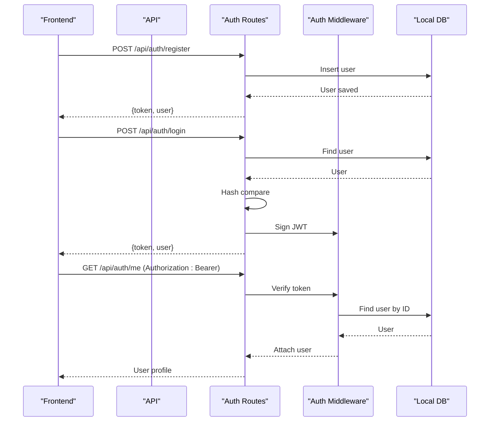
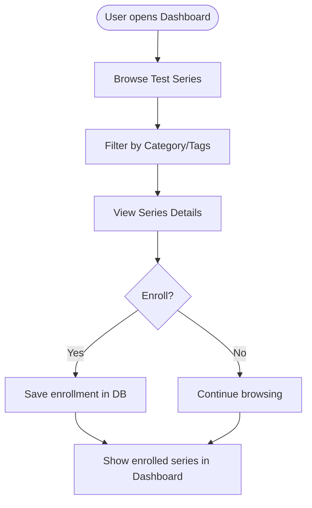
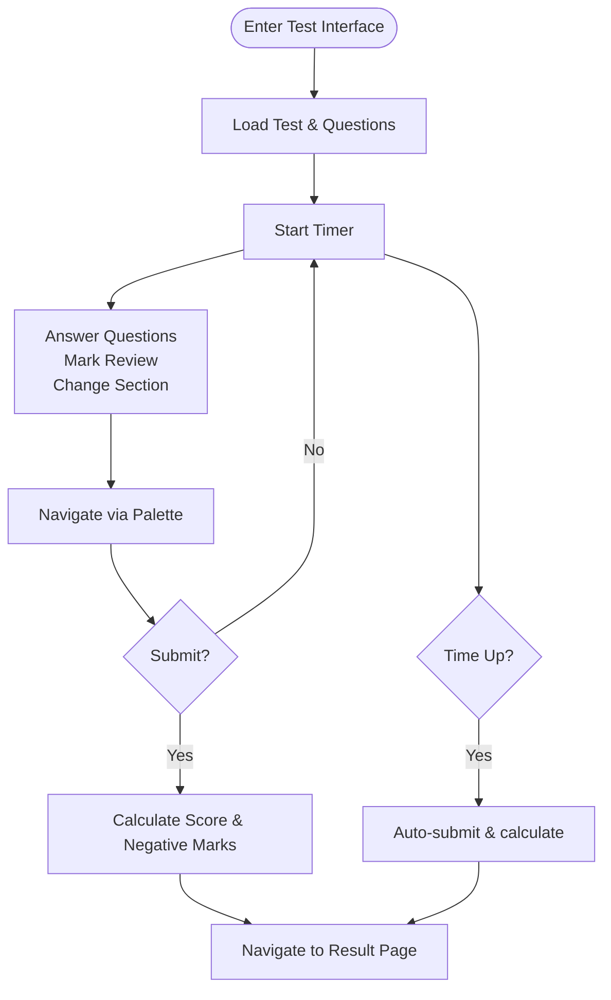
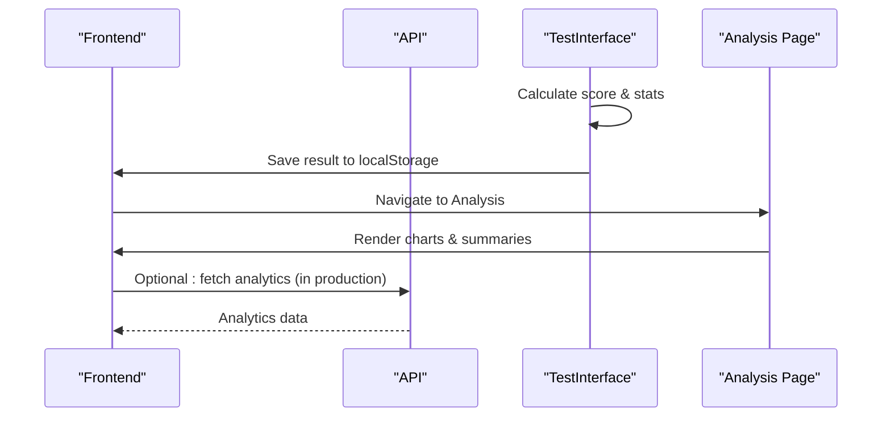
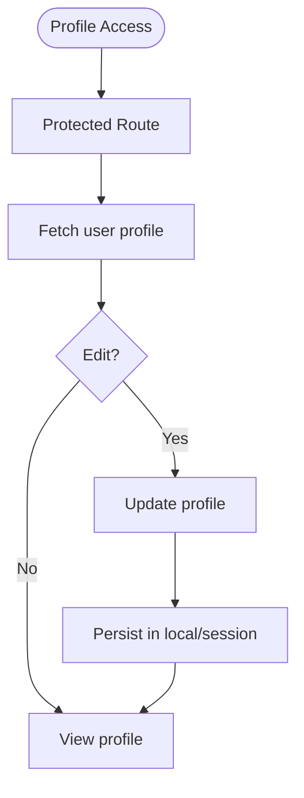
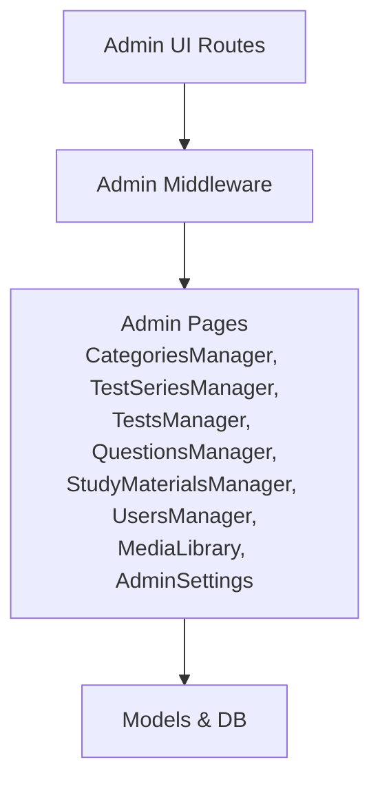
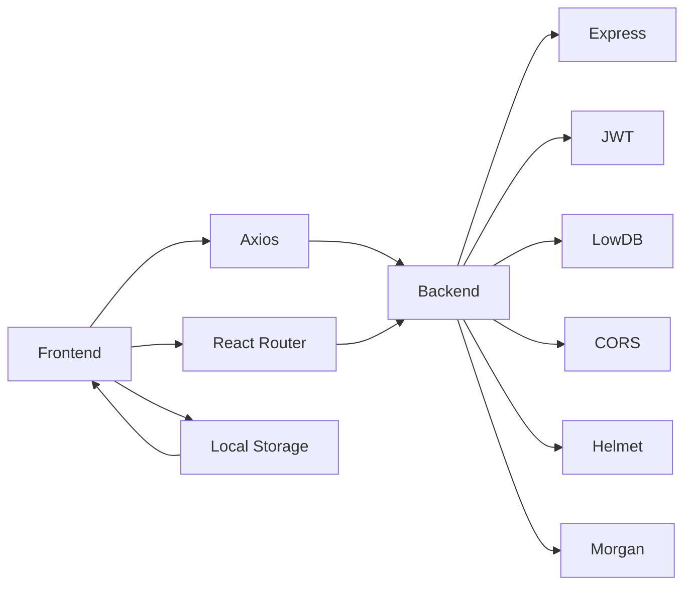

# Core Features

<cite>
**Referenced Files in This Document**
- [Backend package.json](file://Backend/package.json)
- [Frontend package.json](file://Frontend/package.json)
- [Backend app.js](file://Backend/src/app.js)
- [Backend auth routes](file://Backend/src/routes/auth.js)
- [Backend auth middleware](file://Backend/src/middleware/auth.js)
- [Backend User model](file://Backend/src/models/User.js)
- [Backend TestSeries model](file://Backend/src/models/TestSeries.js)
- [Backend Test model](file://Backend/src/models/Test.js)
- [Backend localDB](file://Backend/src/db/localDB.js)
- [Backend health endpoint](file://Backend/src/app.js)
- [Backend db.json](file://Backend/data/db.json)
- [Frontend App.jsx](file://Frontend/src/App.jsx)
- [Frontend AuthContext](file://Frontend/src/context/AuthContext.jsx)
- [Frontend api service](file://Frontend/src/services/api.js)
- [Frontend Dashboard](file://Frontend/src/pages/Dashboard.jsx)
- [Frontend TestInterface](file://Frontend/src/pages/TestInterface.jsx)
- [Frontend Analysis](file://Frontend/src/pages/Analysis.jsx)
</cite>

## Table of Contents
1. [Introduction](#introduction)
2. [Project Structure](#project-structure)
3. [Core Components](#core-components)
4. [Architecture Overview](#architecture-overview)
5. [Detailed Component Analysis](#detailed-component-analysis)
6. [Dependency Analysis](#dependency-analysis)
7. [Performance Considerations](#performance-considerations)
8. [Troubleshooting Guide](#troubleshooting-guide)
9. [Conclusion](#conclusion)

## Introduction
This document describes Trstprep V2’s core features and functionality. It covers user authentication and management, test series browsing and enrollment, an interactive test interface with timer and navigation, comprehensive result analysis with performance metrics, user profile management, and admin panel capabilities. It also explains the user journey from registration through test completion and result review, details multi-language support (English/Hindi), category-based organization (SSC, Railway, Banking, Defence, State), progress tracking mechanisms, feature relationships, user roles (Free/Pro/Admin), and integration patterns between frontend and backend.

## Project Structure
Trstprep V2 is a full-stack application with:
- Backend: Node.js/Express server with a local JSON database (lowdb) and modular routes for authentication, users, test series, tests, study materials, and admin.
- Frontend: React application with React Router for navigation, protected routes, and integrated services for API communication.

**Diagram sources**
- [Frontend App.jsx](file://Frontend/src/App.jsx#L42-L143)
- [Frontend AuthContext](file://Frontend/src/context/AuthContext.jsx#L13-L192)
- [Frontend api service](file://Frontend/src/services/api.js#L1-L92)
- [Backend app.js](file://Backend/src/app.js#L1-L94)
- [Backend localDB](file://Backend/src/db/localDB.js)
- [Backend auth routes](file://Backend/src/routes/auth.js#L1-L174)
- [Backend auth middleware](file://Backend/src/middleware/auth.js#L1-L92)
- [Backend User model](file://Backend/src/models/User.js#L1-L81)
- [Backend TestSeries model](file://Backend/src/models/TestSeries.js#L1-L71)
- [Backend Test model](file://Backend/src/models/Test.js#L1-L77)
- [Backend db.json](file://Backend/data/db.json#L1-L728)

**Section sources**
- [Backend package.json](file://Backend/package.json#L1-L32)
- [Frontend package.json](file://Frontend/package.json#L1-L35)
- [Backend app.js](file://Backend/src/app.js#L1-L94)
- [Frontend App.jsx](file://Frontend/src/App.jsx#L42-L143)

## Core Components
- Authentication and User Management
  - Registration and login via JWT tokens, protected routes, and session persistence in local storage.
  - Role-based access control: user, pro (proPass holder), admin.
- Test Series and Enrollment
  - Browse categories (SSC, Railway, Banking, Defence, State), filter by tags, and enroll in series.
- Interactive Test Interface
  - Timer, pause/resume, question palette, marking for review, navigation, multi-language support (English/Hindi), and section-based organization.
- Results and Analysis
  - Instant scoring, performance metrics, subject-wise analysis, and progress insights.
- User Profile and Progress
  - Dashboard with enrolled series, recent activity, suggested series, and analytics.
- Admin Panel
  - Manage categories, test series, tests, questions, study materials, users, media, and settings.

**Section sources**
- [Backend auth routes](file://Backend/src/routes/auth.js#L16-L174)
- [Backend auth middleware](file://Backend/src/middleware/auth.js#L1-L92)
- [Backend User model](file://Backend/src/models/User.js#L1-L81)
- [Backend TestSeries model](file://Backend/src/models/TestSeries.js#L1-L71)
- [Backend Test model](file://Backend/src/models/Test.js#L1-L77)
- [Frontend Dashboard](file://Frontend/src/pages/Dashboard.jsx#L1-L330)
- [Frontend TestInterface](file://Frontend/src/pages/TestInterface.jsx#L1-L677)
- [Frontend Analysis](file://Frontend/src/pages/Analysis.jsx#L1-L282)
- [Frontend AuthContext](file://Frontend/src/context/AuthContext.jsx#L13-L192)
- [Frontend api service](file://Frontend/src/services/api.js#L1-L92)

## Architecture Overview
The system follows a clean separation of concerns:
- Frontend handles UI, routing, protected routes, and user sessions.
- Backend exposes RESTful endpoints, validates JWT tokens, and serves seeded data via lowdb.
- Models define schemas for users, test series, and tests; middleware enforces permissions.

**Diagram sources**
- [Frontend App.jsx](file://Frontend/src/App.jsx#L64-L117)
- [Frontend api service](file://Frontend/src/services/api.js#L1-L92)
- [Backend auth routes](file://Backend/src/routes/auth.js#L73-L171)
- [Backend auth middleware](file://Backend/src/middleware/auth.js#L5-L44)
- [Backend localDB](file://Backend/src/db/localDB.js)
- [Backend db.json](file://Backend/data/db.json#L1-L728)

## Detailed Component Analysis

### Authentication and User Management
- Registration: Validates uniqueness, hashes password, creates user with default Free role, and returns JWT.
- Login: Finds user by email, compares password, generates JWT, and returns user info.
- Protected Routes: Uses JWT middleware to attach user to request; optional auth allows non-authenticated access.
- Session Handling: Frontend stores token and user session in local storage with expiration logic.
- Roles and Permissions:
  - User roles: user, admin.
  - Pro Pass: flag indicating pro access; middleware restricts resources to pro holders.
  - Admin-only endpoints: enforced via middleware.

**Diagram sources**
- [Backend auth routes](file://Backend/src/routes/auth.js#L16-L171)
- [Backend auth middleware](file://Backend/src/middleware/auth.js#L5-L44)
- [Backend localDB](file://Backend/src/db/localDB.js)
- [Frontend AuthContext](file://Frontend/src/context/AuthContext.jsx#L43-L98)

**Section sources**
- [Backend auth routes](file://Backend/src/routes/auth.js#L16-L171)
- [Backend auth middleware](file://Backend/src/middleware/auth.js#L69-L92)
- [Frontend AuthContext](file://Frontend/src/context/AuthContext.jsx#L13-L192)

### Test Series Browsing and Enrollment
- Categories and Subcategories: SSC, Railway, Banking, Defence, State with hierarchical organization.
- Tags and Filters: Filter by tags (e.g., live-tests, pyps, practice) and category/exam combinations.
- Enrollment: Users can enroll in series; enrolled series appear in dashboard and history.
- Progress Tracking: Dashboard shows progress per series with attempted/total counts and percentage.

**Diagram sources**
- [Backend db.json](file://Backend/data/db.json#L37-L203)
- [Frontend Dashboard](file://Frontend/src/pages/Dashboard.jsx#L24-L321)

**Section sources**
- [Backend db.json](file://Backend/data/db.json#L37-L203)
- [Frontend Dashboard](file://Frontend/src/pages/Dashboard.jsx#L117-L161)

### Interactive Test Interface with Timer and Navigation
- Timer: Counts down from test duration; auto-submits when time expires; supports pause/resume.
- Multi-language: Question text and options support English/Hindi; language toggle persists.
- Navigation: Question palette with status indicators (answered, not answered, review, visited); section tabs; save & next; previous; clear response; mark for review.
- Scoring: Instant calculation (+2/-0.5 per question) and result summary; navigates to result page after submission.

**Diagram sources**
- [Frontend TestInterface](file://Frontend/src/pages/TestInterface.jsx#L35-L229)

**Section sources**
- [Frontend TestInterface](file://Frontend/src/pages/TestInterface.jsx#L1-L677)

### Comprehensive Result Analysis and Performance Metrics
- Immediate Feedback: After submission, users see score, correct/wrong/skipped counts, accuracy, and time taken.
- Analytics Dashboard: Overview, subject-wise performance, and progress insights; links to study materials for weak areas.
- Historical Data: Recent tests list and ability to review answers.

**Diagram sources**
- [Frontend TestInterface](file://Frontend/src/pages/TestInterface.jsx#L185-L229)
- [Frontend Analysis](file://Frontend/src/pages/Analysis.jsx#L144-L275)

**Section sources**
- [Frontend Analysis](file://Frontend/src/pages/Analysis.jsx#L1-L282)
- [Frontend TestInterface](file://Frontend/src/pages/TestInterface.jsx#L185-L229)

### User Profile Management
- Profile Access: Protected route to view and update profile details.
- Session Persistence: Frontend maintains session with role and pro status; updates reflected immediately.
- Enrollment History: Dashboard aggregates enrolled series and recent activity.

**Diagram sources**
- [Frontend App.jsx](file://Frontend/src/App.jsx#L112-L116)
- [Frontend AuthContext](file://Frontend/src/context/AuthContext.jsx#L149-L167)

**Section sources**
- [Frontend App.jsx](file://Frontend/src/App.jsx#L112-L116)
- [Frontend AuthContext](file://Frontend/src/context/AuthContext.jsx#L149-L167)

### Admin Panel Capabilities
- Access Control: Admin-only routes protected by middleware.
- Management Areas: Categories, Test Series, Tests, Questions, Study Materials, Users, Media Library, Settings.
- Integration: Admin routes integrate with the same models and database layer used by regular users.

**Diagram sources**
- [Frontend App.jsx](file://Frontend/src/App.jsx#L119-L134)
- [Backend auth middleware](file://Backend/src/middleware/auth.js#L68-L78)

**Section sources**
- [Frontend App.jsx](file://Frontend/src/App.jsx#L119-L134)
- [Backend auth middleware](file://Backend/src/middleware/auth.js#L68-L78)

## Dependency Analysis
- Frontend depends on:
  - React Router for navigation.
  - Axios for API requests with interceptors for auth and error handling.
  - Local storage for session and token persistence.
- Backend depends on:
  - Express for routing and middleware.
  - JWT for authentication.
  - LowDB for local JSON database.
  - CORS, Helmet, Morgan for security and logging.

**Diagram sources**
- [Frontend package.json](file://Frontend/package.json#L12-L20)
- [Backend package.json](file://Backend/package.json#L12-L24)
- [Frontend api service](file://Frontend/src/services/api.js#L1-L92)
- [Backend app.js](file://Backend/src/app.js#L1-L94)

**Section sources**
- [Frontend package.json](file://Frontend/package.json#L12-L20)
- [Backend package.json](file://Backend/package.json#L12-L24)
- [Frontend api service](file://Frontend/src/services/api.js#L1-L92)
- [Backend app.js](file://Backend/src/app.js#L1-L94)

## Performance Considerations
- Local JSON Database: Suitable for development and small-scale usage; consider migrating to MongoDB for production scalability.
- Frontend Rendering: Dashboard and Analysis pages use mock data; ensure real API integration is optimized for large datasets.
- Token Handling: JWT verification occurs on each protected request; keep token size minimal and refresh strategies in mind.
- Image/Resource Loading: Future enhancements can lazy-load images and videos to reduce initial payload.

[No sources needed since this section provides general guidance]

## Troubleshooting Guide
- Authentication Issues
  - Ensure Authorization header includes Bearer token for protected routes.
  - Verify JWT secret and expiration settings.
- Session Problems
  - Check local storage keys: token and trstprep_session; confirm expiration logic.
- API Connectivity
  - Confirm backend is running and frontend VITE_API_URL points to correct host/port.
- Database Seeding
  - Seed data is loaded via lowdb; verify db.json structure and indices.

**Section sources**
- [Backend auth middleware](file://Backend/src/middleware/auth.js#L5-L44)
- [Frontend AuthContext](file://Frontend/src/context/AuthContext.jsx#L18-L40)
- [Frontend api service](file://Frontend/src/services/api.js#L12-L44)
- [Backend app.js](file://Backend/src/app.js#L46-L66)
- [Backend db.json](file://Backend/data/db.json#L1-L728)

## Conclusion
Trstprep V2 delivers a cohesive learning platform with robust authentication, organized test series, immersive test-taking experience, and insightful analytics. The frontend and backend are cleanly separated, with clear integration points and protection layers. The system supports Free and Pro users, with admin capabilities for content management. For production, consider migrating to MongoDB, optimizing frontend data fetching, and implementing token refresh strategies.

*Last Updated: March 10, 2026 | Update date is (20:16)*
