# Result Analysis & Performance Tracking

<cite>
**Referenced Files in This Document**
- [TestResult.jsx](file://Frontend/src/pages/TestResult.jsx)
- [Analysis.jsx](file://Frontend/src/pages/Analysis.jsx)
- [AttemptedTests.jsx](file://Frontend/src/pages/AttemptedTests.jsx)
- [tests.js](file://Backend/src/routes/tests.js)
- [Test.js](file://Backend/src/models/Test.js)
- [Question.js](file://Backend/src/models/Question.js)
- [User.js](file://Backend/src/models/User.js)
- [api.js](file://Frontend/src/services/api.js)
- [dataService.js](file://Frontend/src/services/dataService.js)
- [mockData.js](file://Frontend/src/data/mockData.js)
- [localDB.js](file://Backend/src/db/localDB.js)
</cite>

## Table of Contents
1. [Introduction](#introduction)
2. [Project Structure](#project-structure)
3. [Core Components](#core-components)
4. [Architecture Overview](#architecture-overview)
5. [Detailed Component Analysis](#detailed-component-analysis)
6. [Dependency Analysis](#dependency-analysis)
7. [Performance Considerations](#performance-considerations)
8. [Troubleshooting Guide](#troubleshooting-guide)
9. [Conclusion](#conclusion)

## Introduction
This document explains Trstprep V2’s result analysis and performance tracking system. It covers the multi-tab result interface (performance overview, detailed analysis, solution review), subject-wise performance breakdown, difficulty-level analysis, time management metrics, accuracy patterns, comparative performance indicators, automated result calculation, score interpretation, percentile ranking, and personalized recommendations. It also documents the attempted tests history, test completion statistics, improvement tracking over time, weak area identification, frontend visualization components, backend analytics algorithms, and integration points.

## Project Structure
The system spans frontend React pages and backend APIs:
- Frontend pages implement result presentation, analytics dashboards, and attempted tests lists.
- Backend routes calculate scores, manage test attempts, and expose analytics endpoints.
- Models define data schemas for tests, questions, and users.
- Services integrate with backend APIs and manage caching.

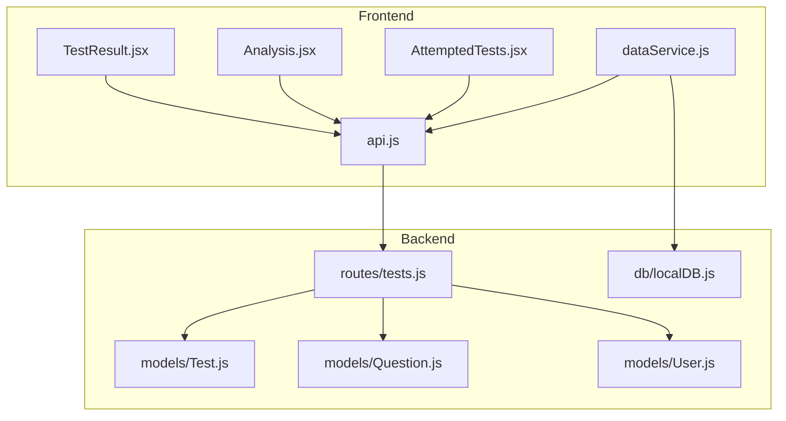

**Diagram sources**
- [TestResult.jsx](file://Frontend/src/pages/TestResult.jsx#L1-L542)
- [Analysis.jsx](file://Frontend/src/pages/Analysis.jsx#L1-L282)
- [AttemptedTests.jsx](file://Frontend/src/pages/AttemptedTests.jsx#L1-L278)
- [api.js](file://Frontend/src/services/api.js#L1-L92)
- [dataService.js](file://Frontend/src/services/dataService.js#L1-L172)
- [tests.js](file://Backend/src/routes/tests.js#L1-L265)
- [Test.js](file://Backend/src/models/Test.js#L1-L77)
- [Question.js](file://Backend/src/models/Question.js#L1-L54)
- [User.js](file://Backend/src/models/User.js#L1-L81)
- [localDB.js](file://Backend/src/db/localDB.js#L1-L222)

**Section sources**
- [TestResult.jsx](file://Frontend/src/pages/TestResult.jsx#L1-L542)
- [Analysis.jsx](file://Frontend/src/pages/Analysis.jsx#L1-L282)
- [AttemptedTests.jsx](file://Frontend/src/pages/AttemptedTests.jsx#L1-L278)
- [tests.js](file://Backend/src/routes/tests.js#L1-L265)

## Core Components
- Multi-tab result page: Presents quick stats, rank/percentile, and three tabs—overview, analysis, and solutions.
- Analytics dashboard: Summarizes performance, subject-wise metrics, and progress.
- Attempted tests list: Tracks history, completion stats, and reattempt actions.
- Backend scoring engine: Computes scores, accuracy, and placeholders for rank.
- Data services: Integrate with backend APIs and cache data for responsiveness.

Key capabilities:
- Automated result calculation: Correct/wrong/unattempted counts, scaled score, accuracy.
- Comparative performance: Rank vs. total participants, percentile computation.
- Personalized recommendations: Weak/strong subjects, targeted study links.
- Historical tracking: Attempted tests list with filtering and sorting.

**Section sources**
- [TestResult.jsx](file://Frontend/src/pages/TestResult.jsx#L61-L542)
- [Analysis.jsx](file://Frontend/src/pages/Analysis.jsx#L11-L282)
- [AttemptedTests.jsx](file://Frontend/src/pages/AttemptedTests.jsx#L10-L278)
- [tests.js](file://Backend/src/routes/tests.js#L168-L231)

## Architecture Overview
The result analysis pipeline connects frontend pages to backend routes and models. Users complete a test, submit answers, receive a result, and then explore performance insights via dedicated pages.

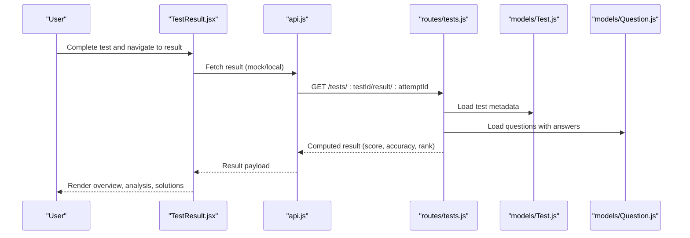

**Diagram sources**
- [TestResult.jsx](file://Frontend/src/pages/TestResult.jsx#L69-L89)
- [api.js](file://Frontend/src/services/api.js#L63-L71)
- [tests.js](file://Backend/src/routes/tests.js#L233-L262)
- [Test.js](file://Backend/src/models/Test.js#L1-L77)
- [Question.js](file://Backend/src/models/Question.js#L1-L54)

## Detailed Component Analysis

### Multi-Tab Result Interface
The result page organizes insights across three tabs:
- Overview: Performance summary, accuracy bar, attempt rate, and subject-wise breakdown.
- Analysis: Difficulty-level correctness, time usage metrics, and marked-for-review indicators.
- Solutions: Filterable question cards with expandable explanations and option highlighting.

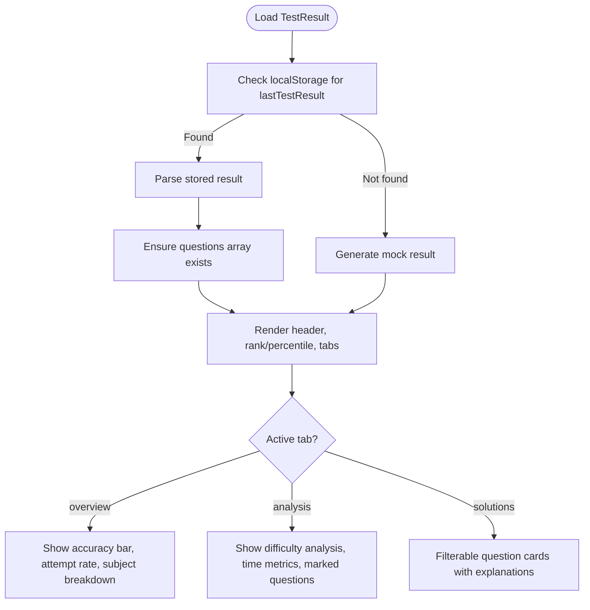

**Diagram sources**
- [TestResult.jsx](file://Frontend/src/pages/TestResult.jsx#L61-L502)

**Section sources**
- [TestResult.jsx](file://Frontend/src/pages/TestResult.jsx#L61-L542)

### Automated Result Calculation and Scoring
Backend computes:
- Counts: correct, wrong, unattempted.
- Score: scaled by marks per question minus negative marking for wrong answers.
- Accuracy: correct divided by correct plus wrong.
- Rank: placeholder returned until leaderboard logic is implemented.

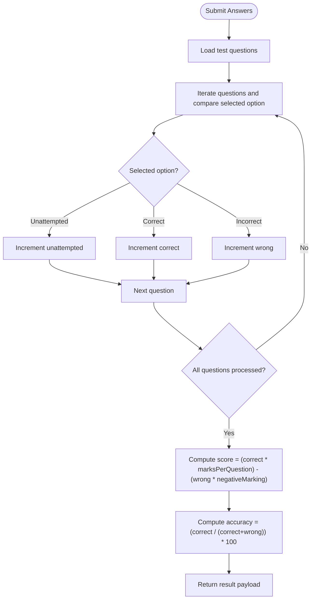

**Diagram sources**
- [tests.js](file://Backend/src/routes/tests.js#L168-L231)

**Section sources**
- [tests.js](file://Backend/src/routes/tests.js#L168-L231)

### Performance Metrics and Visualizations
- Score interpretation: Color-coded score based on percentage of maximum possible.
- Accuracy patterns: Color-coded bars and percentages.
- Time management: Total time, average per question, time saved, and time used percentage.
- Comparative indicators: Rank and percentile rendered prominently.

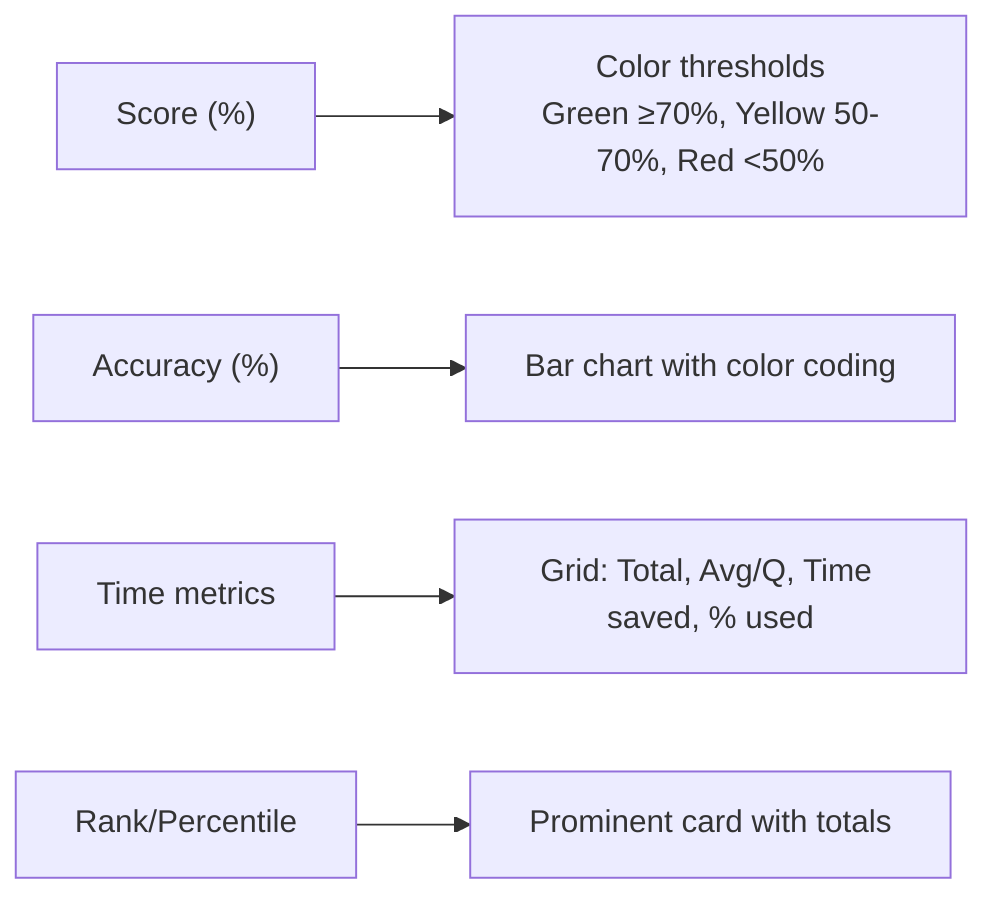

**Diagram sources**
- [TestResult.jsx](file://Frontend/src/pages/TestResult.jsx#L108-L119)
- [TestResult.jsx](file://Frontend/src/pages/TestResult.jsx#L260-L291)
- [TestResult.jsx](file://Frontend/src/pages/TestResult.jsx#L345-L368)
- [TestResult.jsx](file://Frontend/src/pages/TestResult.jsx#L216-L229)

**Section sources**
- [TestResult.jsx](file://Frontend/src/pages/TestResult.jsx#L108-L119)
- [TestResult.jsx](file://Frontend/src/pages/TestResult.jsx#L260-L291)
- [TestResult.jsx](file://Frontend/src/pages/TestResult.jsx#L345-L368)
- [TestResult.jsx](file://Frontend/src/pages/TestResult.jsx#L216-L229)

### Subject-Wise and Difficulty-Level Analysis
- Subject-wise breakdown: Aggregates correct answers per section and displays percentages.
- Difficulty analysis: Counts correct answers per difficulty level (Easy, Medium, Hard).

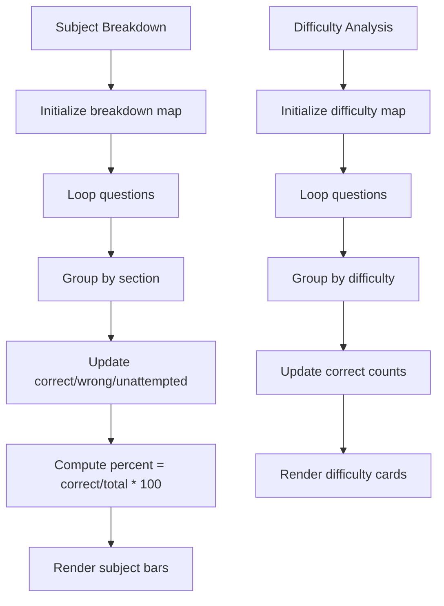

**Diagram sources**
- [TestResult.jsx](file://Frontend/src/pages/TestResult.jsx#L121-L150)

**Section sources**
- [TestResult.jsx](file://Frontend/src/pages/TestResult.jsx#L121-L150)

### Solution Review and Question Cards
- Filtering: All, correct, wrong, unattempted, and marked.
- Expandable cards: Show question text, options with correct/incorrect highlighting, and explanations.
- Marked questions: Visual indicator and summary list.

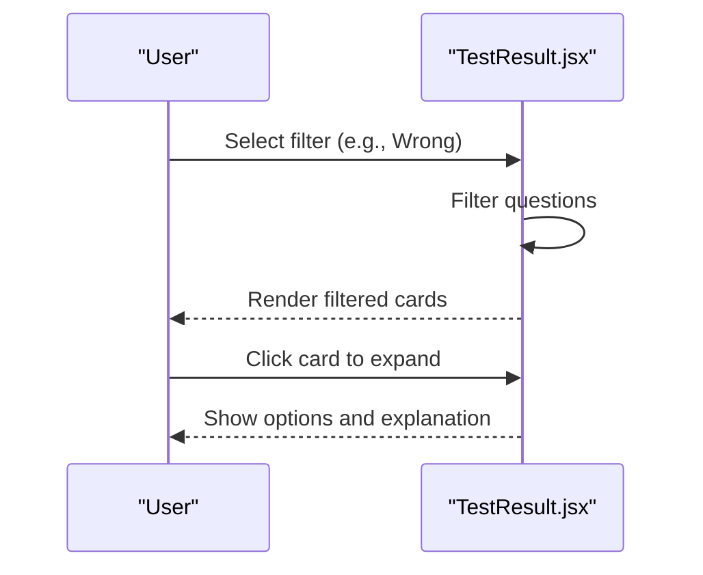

**Diagram sources**
- [TestResult.jsx](file://Frontend/src/pages/TestResult.jsx#L152-L164)
- [TestResult.jsx](file://Frontend/src/pages/TestResult.jsx#L390-L500)

**Section sources**
- [TestResult.jsx](file://Frontend/src/pages/TestResult.jsx#L152-L164)
- [TestResult.jsx](file://Frontend/src/pages/TestResult.jsx#L390-L500)

### Analytics Dashboard
The analytics page presents:
- Quick stats: Tests attempted, average accuracy, rank, percentile.
- Tabs: Overview (answer distribution, recent tests), Subject-wise, Progress (strengths, weaknesses, recommendations).

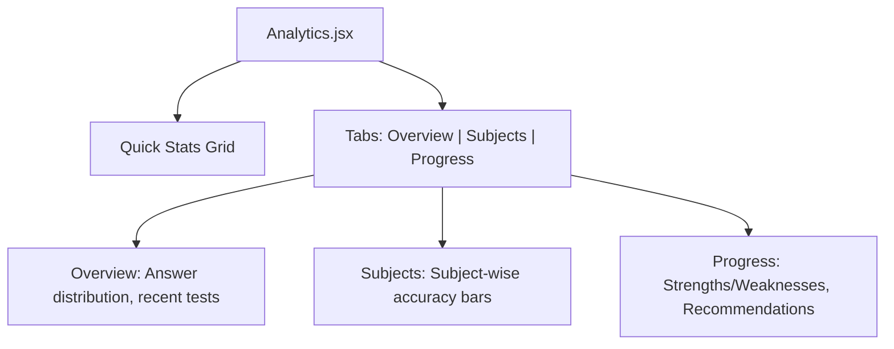

**Diagram sources**
- [Analysis.jsx](file://Frontend/src/pages/Analysis.jsx#L43-L275)

**Section sources**
- [Analysis.jsx](file://Frontend/src/pages/Analysis.jsx#L11-L282)

### Attempted Tests History
The attempted tests page:
- Lists past test attempts with scores, accuracy, rank, and timing.
- Provides search and filter by series.
- Offers actions: view result and reattempt.

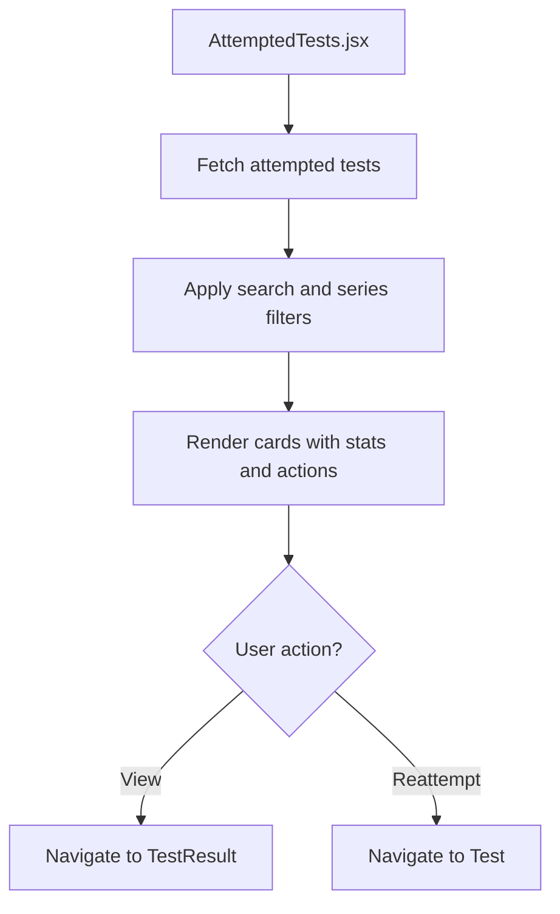

**Diagram sources**
- [AttemptedTests.jsx](file://Frontend/src/pages/AttemptedTests.jsx#L87-L98)
- [AttemptedTests.jsx](file://Frontend/src/pages/AttemptedTests.jsx#L194-L271)

**Section sources**
- [AttemptedTests.jsx](file://Frontend/src/pages/AttemptedTests.jsx#L10-L278)

### Backend Models and Data Flow
- Test model defines test metadata, negative marking, and marks.
- Question model stores question text, options, correct answer, section, and difficulty.
- User model tracks enrolled series and attempted tests.

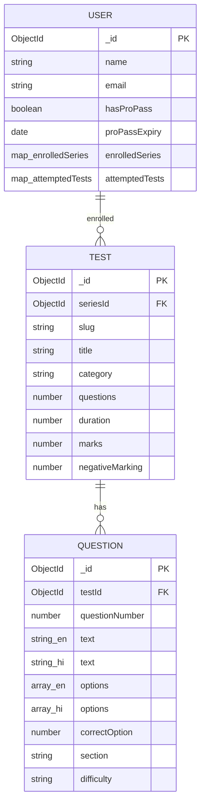

**Diagram sources**
- [Test.js](file://Backend/src/models/Test.js#L1-L77)
- [Question.js](file://Backend/src/models/Question.js#L1-L54)
- [User.js](file://Backend/src/models/User.js#L1-L81)

**Section sources**
- [Test.js](file://Backend/src/models/Test.js#L1-L77)
- [Question.js](file://Backend/src/models/Question.js#L1-L54)
- [User.js](file://Backend/src/models/User.js#L1-L81)

### Data Services and API Integration
- Frontend API client centralizes requests and handles auth tokens.
- Data service wraps API calls, caches responses, and exposes helpers for navigation and filtering.
- Mock data supports development and demonstration.

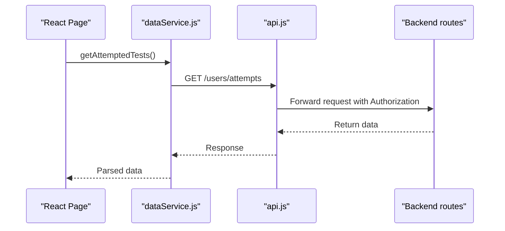

**Diagram sources**
- [dataService.js](file://Frontend/src/services/dataService.js#L15-L27)
- [api.js](file://Frontend/src/services/api.js#L73-L81)

**Section sources**
- [api.js](file://Frontend/src/services/api.js#L1-L92)
- [dataService.js](file://Frontend/src/services/dataService.js#L1-L172)
- [mockData.js](file://Frontend/src/data/mockData.js#L1-L273)

## Dependency Analysis
- Frontend pages depend on services for data fetching and on backend routes for computations.
- Backend routes depend on models for schema enforcement and data retrieval.
- Local database helper provides JSON-backed persistence during development.

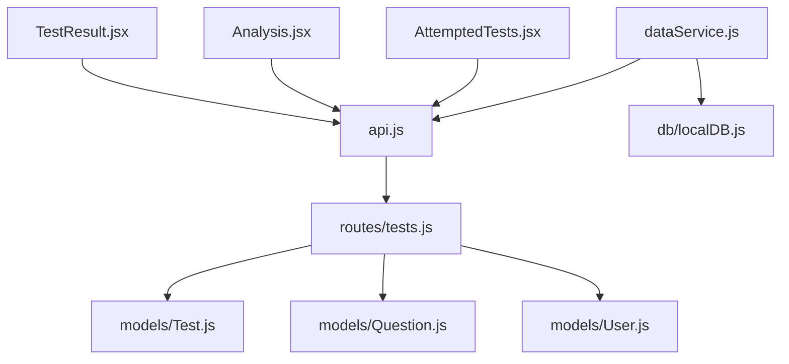

**Diagram sources**
- [TestResult.jsx](file://Frontend/src/pages/TestResult.jsx#L1-L542)
- [Analysis.jsx](file://Frontend/src/pages/Analysis.jsx#L1-L282)
- [AttemptedTests.jsx](file://Frontend/src/pages/AttemptedTests.jsx#L1-L278)
- [api.js](file://Frontend/src/services/api.js#L1-L92)
- [dataService.js](file://Frontend/src/services/dataService.js#L1-L172)
- [tests.js](file://Backend/src/routes/tests.js#L1-L265)
- [Test.js](file://Backend/src/models/Test.js#L1-L77)
- [Question.js](file://Backend/src/models/Question.js#L1-L54)
- [User.js](file://Backend/src/models/User.js#L1-L81)
- [localDB.js](file://Backend/src/db/localDB.js#L1-L222)

**Section sources**
- [tests.js](file://Backend/src/routes/tests.js#L1-L265)
- [localDB.js](file://Backend/src/db/localDB.js#L1-L222)

## Performance Considerations
- Client-side filtering and rendering are optimized with memoization and controlled re-renders.
- Data caching reduces repeated network calls for static content.
- Backend scoring is O(n) over the number of questions.
- Consider pagination for large attempted tests lists and lazy loading for solution expansions.

## Troubleshooting Guide
Common issues and resolutions:
- Missing or invalid auth token: Requests are intercepted and redirect to login.
- Network errors: Logged and surfaced to the console; verify API URL and server availability.
- Result not found: Ensure attemptId and testId are correct and that backend routes are implemented.
- Local storage fallback: Demo results are generated when no stored result exists.

Actions:
- Verify token presence in localStorage.
- Confirm API base URL matches backend deployment.
- Check backend route endpoints and database connectivity.

**Section sources**
- [api.js](file://Frontend/src/services/api.js#L12-L44)
- [TestResult.jsx](file://Frontend/src/pages/TestResult.jsx#L69-L89)

## Conclusion
Trstprep V2’s result analysis and performance tracking system combines robust frontend visualization with backend scoring and analytics. The multi-tab result interface delivers actionable insights, while the analytics dashboard and attempted tests history support continuous improvement. As implemented, the system computes scores, accuracy, and comparative metrics, with placeholders for rank and leaderboard features. Extending backend routes to persist attempts and compute global rankings will complete the performance tracking pipeline.

*Last Updated: March 10, 2026 | Update date is (20:16)*
