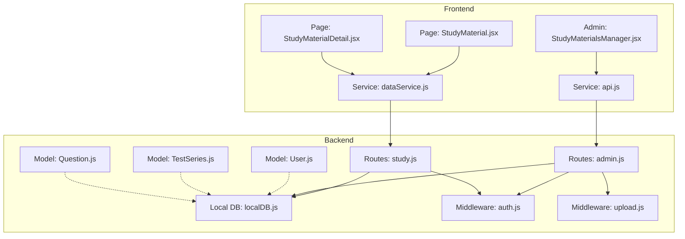
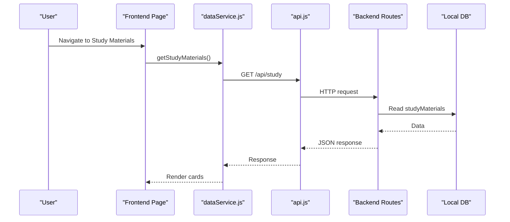
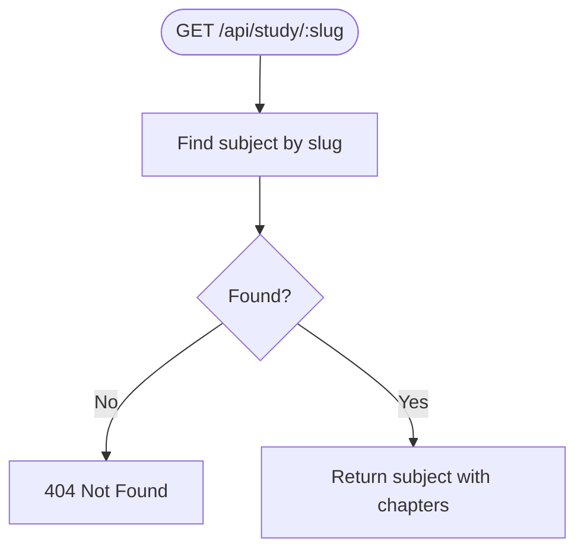
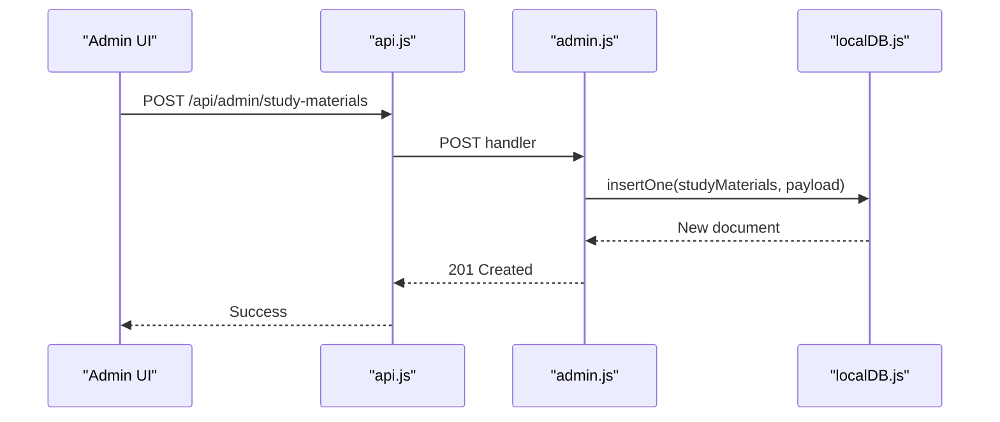
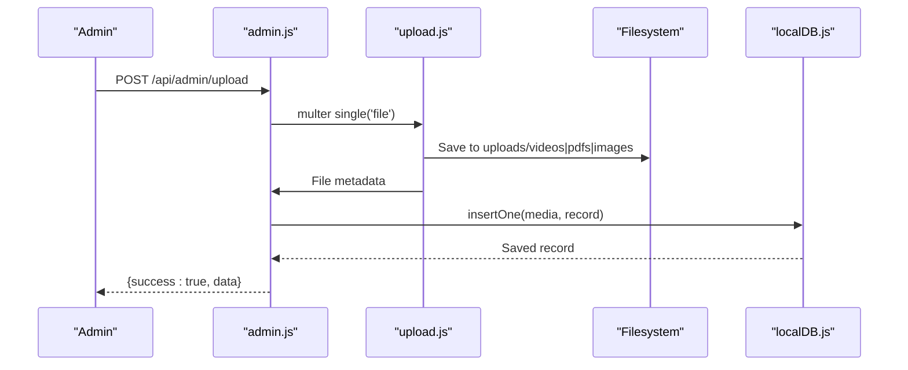
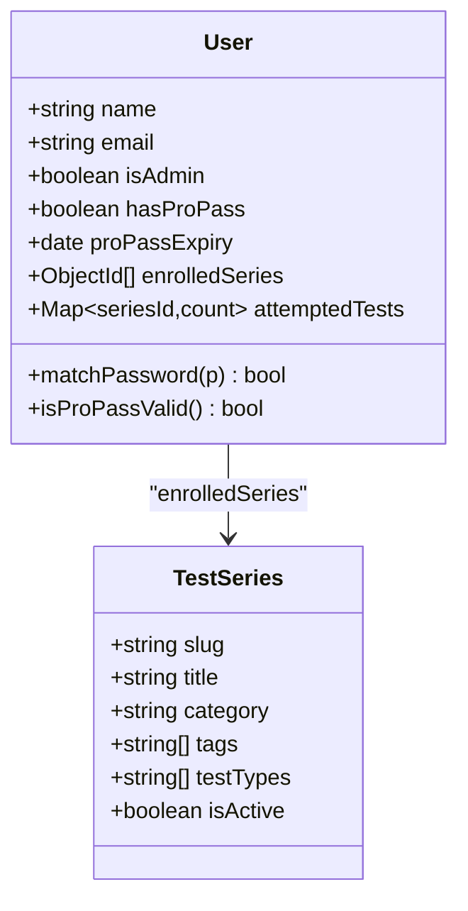
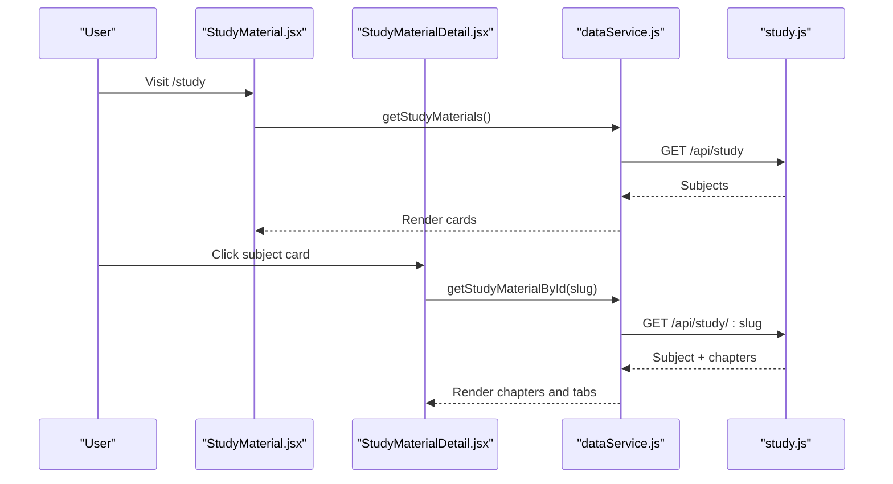
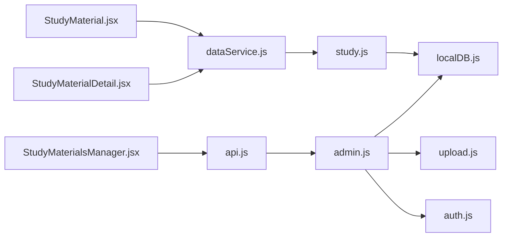

# Study Materials & Content Management

<cite>
**Referenced Files in This Document**
- [study.js](file://Backend/src/routes/study.js)
- [TestSeries.js](file://Backend/src/models/TestSeries.js)
- [Question.js](file://Backend/src/models/Question.js)
- [User.js](file://Backend/src/models/User.js)
- [db.json](file://Backend/data/db.json)
- [StudyMaterial.jsx](file://Frontend/src/pages/StudyMaterial.jsx)
- [StudyMaterialDetail.jsx](file://Frontend/src/pages/StudyMaterialDetail.jsx)
- [StudyMaterialsManager.jsx](file://Frontend/src/pages/admin/StudyMaterialsManager.jsx)
- [api.js](file://Frontend/src/services/api.js)
- [dataService.js](file://Frontend/src/services/dataService.js)
- [admin.js](file://Backend/src/routes/admin.js)
- [auth.js](file://Backend/src/middleware/auth.js)
- [upload.js](file://Backend/src/middleware/upload.js)
- [localDB.js](file://Backend/src/db/localDB.js)
- [ADMIN_FEATURES_COMPLETE.md](file://Documentation/ADMIN_FEATURES_COMPLETE.md)
- [DATABASE.md](file://Documentation/DATABASE.md)
</cite>

## Table of Contents
1. [Introduction](#introduction)
2. [Project Structure](#project-structure)
3. [Core Components](#core-components)
4. [Architecture Overview](#architecture-overview)
5. [Detailed Component Analysis](#detailed-component-analysis)
6. [Dependency Analysis](#dependency-analysis)
7. [Performance Considerations](#performance-considerations)
8. [Troubleshooting Guide](#troubleshooting-guide)
9. [Conclusion](#conclusion)
10. [Appendices](#appendices)

## Introduction
This document explains Trstprep V2’s Study Materials and Content Management system. It covers how study materials are organized, how content is delivered and accessed, how administrators manage content, and how users discover and consume learning resources. It also outlines supported content types, media library integration, and recommendation mechanisms tied to test series enrollment.

## Project Structure
The system comprises:
- Backend routes and models for study materials, tests, and users
- Local JSON database with seed data
- Frontend pages for study material browsing and administration
- Admin tools for managing study materials and media
- Authentication and upload middleware

**Diagram sources**
- [study.js](file://Backend/src/routes/study.js#L1-L137)
- [admin.js](file://Backend/src/routes/admin.js#L1-L557)
- [User.js](file://Backend/src/models/User.js#L1-L81)
- [TestSeries.js](file://Backend/src/models/TestSeries.js#L1-L71)
- [Question.js](file://Backend/src/models/Question.js#L1-L54)
- [localDB.js](file://Backend/src/db/localDB.js#L1-L222)
- [auth.js](file://Backend/src/middleware/auth.js#L1-L92)
- [upload.js](file://Backend/src/middleware/upload.js#L1-L91)
- [StudyMaterial.jsx](file://Frontend/src/pages/StudyMaterial.jsx#L1-L171)
- [StudyMaterialDetail.jsx](file://Frontend/src/pages/StudyMaterialDetail.jsx#L1-L339)
- [StudyMaterialsManager.jsx](file://Frontend/src/pages/admin/StudyMaterialsManager.jsx#L1-L539)
- [api.js](file://Frontend/src/services/api.js#L1-L92)
- [dataService.js](file://Frontend/src/services/dataService.js#L1-L172)

**Section sources**
- [study.js](file://Backend/src/routes/study.js#L1-L137)
- [admin.js](file://Backend/src/routes/admin.js#L1-L557)
- [localDB.js](file://Backend/src/db/localDB.js#L1-L222)
- [StudyMaterial.jsx](file://Frontend/src/pages/StudyMaterial.jsx#L1-L171)
- [StudyMaterialDetail.jsx](file://Frontend/src/pages/StudyMaterialDetail.jsx#L1-L339)
- [StudyMaterialsManager.jsx](file://Frontend/src/pages/admin/StudyMaterialsManager.jsx#L1-L539)
- [api.js](file://Frontend/src/services/api.js#L1-L92)
- [dataService.js](file://Frontend/src/services/dataService.js#L1-L172)

## Core Components
- Study Materials API: Provides endpoints to list subjects, fetch subject details, and retrieve chapters.
- Study Materials Admin: Allows creation, editing, soft deletion, restoration, enabling/disabling, and reordering of study materials.
- Media Library: Supports uploading videos, PDFs, and images with file type detection and URL generation.
- User and Enrollment Models: Track user roles, Pro Pass status, and enrolled test series for access control and recommendations.
- Frontend Pages: Present study materials, chapters, and viewer modals for videos, PDFs, and HTML content.

Key backend endpoints:
- GET /api/study (public)
- GET /api/study/:slug (public)
- GET /api/study/:slug/chapters (public)
- Admin: GET/POST/PUT/DELETE /api/admin/study-materials (protected, admin-only)

**Section sources**
- [study.js](file://Backend/src/routes/study.js#L65-L134)
- [admin.js](file://Backend/src/routes/admin.js#L170-L211)
- [upload.js](file://Backend/src/middleware/upload.js#L243-L272)
- [User.js](file://Backend/src/models/User.js#L44-L52)
- [StudyMaterial.jsx](file://Frontend/src/pages/StudyMaterial.jsx#L12-L19)
- [StudyMaterialDetail.jsx](file://Frontend/src/pages/StudyMaterialDetail.jsx#L13-L36)
- [StudyMaterialsManager.jsx](file://Frontend/src/pages/admin/StudyMaterialsManager.jsx#L29-L87)

## Architecture Overview
The system follows a layered architecture:
- Presentation Layer: React pages and admin UI
- Service Layer: API client and data service wrappers
- Application Layer: Express routes and controllers
- Persistence Layer: Local JSON database (lowdb) with seeded data

**Diagram sources**
- [StudyMaterial.jsx](file://Frontend/src/pages/StudyMaterial.jsx#L12-L19)
- [dataService.js](file://Frontend/src/services/dataService.js#L66-L71)
- [api.js](file://Frontend/src/services/api.js#L84-L89)
- [study.js](file://Backend/src/routes/study.js#L65-L81)
- [localDB.js](file://Backend/src/db/localDB.js#L84-L103)

## Detailed Component Analysis

### Study Materials API
- Purpose: Serve structured study material data to clients.
- Endpoints:
  - GET /api/study: Returns a flattened list of subjects (without chapters).
  - GET /api/study/:slug: Returns full subject details including chapters.
  - GET /api/study/:slug/chapters: Returns chapter list for a subject.
- Access: Public endpoints; authentication middleware applied in admin routes but not study routes.

**Diagram sources**
- [study.js](file://Backend/src/routes/study.js#L83-L107)

**Section sources**
- [study.js](file://Backend/src/routes/study.js#L65-L134)

### Study Materials Admin Management
- Purpose: Admin-only CRUD and lifecycle management for study materials.
- Features:
  - Create, edit, enable/disable, soft delete, restore, and permanent delete
  - Reorder materials via up/down actions
  - Trash view to manage deleted items
- Data model fields include slug, title, description, counts (topics, videos, pdfs, tests), color/bg classes, active flag, and order.

**Diagram sources**
- [StudyMaterialsManager.jsx](file://Frontend/src/pages/admin/StudyMaterialsManager.jsx#L50-L87)
- [api.js](file://Frontend/src/services/api.js#L84-L89)
- [admin.js](file://Backend/src/routes/admin.js#L180-L187)
- [localDB.js](file://Backend/src/db/localDB.js#L120-L133)

**Section sources**
- [StudyMaterialsManager.jsx](file://Frontend/src/pages/admin/StudyMaterialsManager.jsx#L1-L539)
- [admin.js](file://Backend/src/routes/admin.js#L170-L211)
- [localDB.js](file://Backend/src/db/localDB.js#L82-L222)
- [ADMIN_FEATURES_COMPLETE.md](file://Documentation/ADMIN_FEATURES_COMPLETE.md#L1-L287)

### Media Library Integration
- Purpose: Centralized storage and retrieval of videos, PDFs, and images.
- Upload flow:
  - Endpoint: POST /api/admin/upload
  - Middleware: multer with file filtering and size limits
  - Storage: per-type directories under uploads/
  - Metadata: filename, originalName, mimetype, size, generated URL, fileType, uploadedBy
- Supported types: images, PDFs, MP4/WebM/MKV videos.

**Diagram sources**
- [admin.js](file://Backend/src/routes/admin.js#L243-L272)
- [upload.js](file://Backend/src/middleware/upload.js#L31-L83)
- [localDB.js](file://Backend/src/db/localDB.js#L120-L133)

**Section sources**
- [admin.js](file://Backend/src/routes/admin.js#L242-L272)
- [upload.js](file://Backend/src/middleware/upload.js#L1-L91)
- [db.json](file://Backend/data/db.json#L545-L556)

### User Roles, Access Control, and Recommendations
- Roles and permissions:
  - Admin-only routes protected by JWT and role checks
  - Pro Pass middleware restricts access to premium resources
- Enrollment and recommendations:
  - Users track enrolled test series
  - Recommendations can leverage enrolled series and tags to surface relevant content

**Diagram sources**
- [User.js](file://Backend/src/models/User.js#L4-L81)
- [TestSeries.js](file://Backend/src/models/TestSeries.js#L3-L71)

**Section sources**
- [auth.js](file://Backend/src/middleware/auth.js#L5-L92)
- [User.js](file://Backend/src/models/User.js#L44-L77)
- [TestSeries.js](file://Backend/src/models/TestSeries.js#L51-L63)
- [db.json](file://Backend/data/db.json#L44-L47)

### Frontend Discovery and Consumption
- Study Materials List:
  - Fetches subjects via dataService and renders cards with icons, stats, and quick links.
- Study Material Detail:
  - Tabs for All/Videos/Notes/Tests
  - Expandable chapters with stats and action buttons
  - Viewer modals for video, PDF, and HTML content
- Bookmarking and Progress Tracking:
  - Chapter progress indicators present in UI scaffolding
  - Bookmarking not implemented in current code; can be added via user preferences stored in the User model

**Diagram sources**
- [StudyMaterial.jsx](file://Frontend/src/pages/StudyMaterial.jsx#L12-L19)
- [StudyMaterialDetail.jsx](file://Frontend/src/pages/StudyMaterialDetail.jsx#L13-L36)
- [dataService.js](file://Frontend/src/services/dataService.js#L66-L97)
- [study.js](file://Backend/src/routes/study.js#L65-L107)

**Section sources**
- [StudyMaterial.jsx](file://Frontend/src/pages/StudyMaterial.jsx#L1-L171)
- [StudyMaterialDetail.jsx](file://Frontend/src/pages/StudyMaterialDetail.jsx#L1-L339)
- [dataService.js](file://Frontend/src/services/dataService.js#L1-L172)

## Dependency Analysis
- Backend dependencies:
  - Express routes depend on localDB helpers for persistence
  - Admin routes require JWT protection and admin role checks
  - Upload route depends on multer configuration and filesystem
- Frontend dependencies:
  - Pages depend on dataService for API access
  - Admin page depends on api module for authenticated requests

**Diagram sources**
- [StudyMaterial.jsx](file://Frontend/src/pages/StudyMaterial.jsx#L1-L171)
- [StudyMaterialDetail.jsx](file://Frontend/src/pages/StudyMaterialDetail.jsx#L1-L339)
- [StudyMaterialsManager.jsx](file://Frontend/src/pages/admin/StudyMaterialsManager.jsx#L1-L539)
- [dataService.js](file://Frontend/src/services/dataService.js#L1-L172)
- [api.js](file://Frontend/src/services/api.js#L1-L92)
- [study.js](file://Backend/src/routes/study.js#L1-L137)
- [admin.js](file://Backend/src/routes/admin.js#L1-L557)
- [localDB.js](file://Backend/src/db/localDB.js#L1-L222)
- [upload.js](file://Backend/src/middleware/upload.js#L1-L91)
- [auth.js](file://Backend/src/middleware/auth.js#L1-L92)

**Section sources**
- [study.js](file://Backend/src/routes/study.js#L1-L137)
- [admin.js](file://Backend/src/routes/admin.js#L1-L557)
- [localDB.js](file://Backend/src/db/localDB.js#L1-L222)
- [api.js](file://Frontend/src/services/api.js#L1-L92)
- [dataService.js](file://Frontend/src/services/dataService.js#L1-L172)

## Performance Considerations
- Data fetching:
  - Frontend caches data for short intervals to reduce repeated API calls
- Database:
  - Local JSON database is suitable for development; consider migrating to MongoDB for production scalability
- Media:
  - File size limit enforced at upload; ensure CDN integration for optimal delivery

[No sources needed since this section provides general guidance]

## Troubleshooting Guide
- Authentication failures:
  - Requests automatically redirect to login on 401 responses
- Missing tokens:
  - Ensure Bearer token is present in Authorization header for admin endpoints
- Upload errors:
  - Verify file type and size constraints; check upload directories exist
- Soft delete behavior:
  - Deleted items are hidden from public lists; use trash view to restore or permanently delete

**Section sources**
- [api.js](file://Frontend/src/services/api.js#L12-L44)
- [auth.js](file://Backend/src/middleware/auth.js#L5-L44)
- [upload.js](file://Backend/src/middleware/upload.js#L56-L83)
- [ADMIN_FEATURES_COMPLETE.md](file://Documentation/ADMIN_FEATURES_COMPLETE.md#L73-L102)

## Conclusion
Trstprep V2’s Study Materials and Content Management system provides a clear separation between public content consumption and admin-driven lifecycle management. The current implementation uses a local JSON database and straightforward APIs, enabling rapid iteration during development. Administrators can manage study materials, organize content, and integrate media assets. Future enhancements could include chapter-level progress tracking, bookmarking, offline viewing, and recommendation algorithms leveraging enrolled test series and tags.

[No sources needed since this section summarizes without analyzing specific files]

## Appendices

### Supported Content Types and Formats
- Study materials: subjects with chapters, videos, PDFs, and tests
- Media: videos (MP4/WebM/MKV), PDFs, images (JPEG/JPG/PNG/GIF/WebP)
- File size limit: 500 MB per upload

**Section sources**
- [upload.js](file://Backend/src/middleware/upload.js#L56-L83)
- [db.json](file://Backend/data/db.json#L545-L556)

### Content Delivery and Access Controls
- Public endpoints for study materials
- Admin-only endpoints protected by JWT and admin role
- Pro Pass middleware for premium content access

**Section sources**
- [study.js](file://Backend/src/routes/study.js#L65-L81)
- [admin.js](file://Backend/src/routes/admin.js#L8-L10)
- [auth.js](file://Backend/src/middleware/auth.js#L69-L90)

### Content Management Workflow (Admin)
- Create: Fill form with slug, title, counts, order, colors, active flag
- Edit: Update any field; slug auto-generated from title
- Reorder: Use up/down arrows to adjust display order
- Enable/Disable: Toggle visibility without deletion
- Delete: Soft delete to trash; restore or permanent delete available in trash view

**Section sources**
- [StudyMaterialsManager.jsx](file://Frontend/src/pages/admin/StudyMaterialsManager.jsx#L50-L230)
- [admin.js](file://Backend/src/routes/admin.js#L170-L211)
- [ADMIN_FEATURES_COMPLETE.md](file://Documentation/ADMIN_FEATURES_COMPLETE.md#L30-L102)

### Database Schema Highlights
- Users: roles, Pro Pass, enrolled series, attempts
- TestSeries: tags, test types, category, activity
- Study materials: slug, title, counts, colors, order, active
- Media: filename, mimetype, size, URL, type, uploader

**Section sources**
- [User.js](file://Backend/src/models/User.js#L4-L81)
- [TestSeries.js](file://Backend/src/models/TestSeries.js#L3-L71)
- [db.json](file://Backend/data/db.json#L398-L466)
- [db.json](file://Backend/data/db.json#L545-L556)

*Last Updated: March 10, 2026 | Update date is (20:16)*
