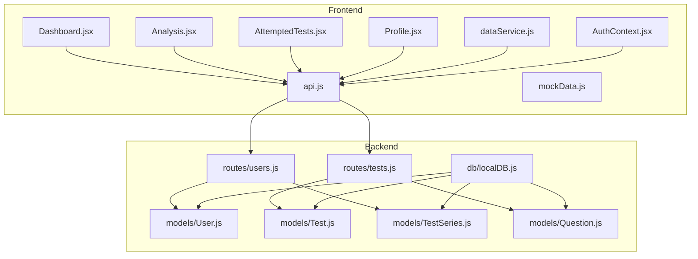
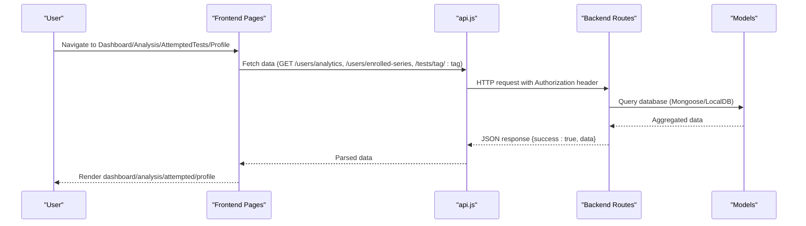
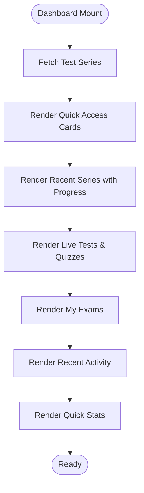
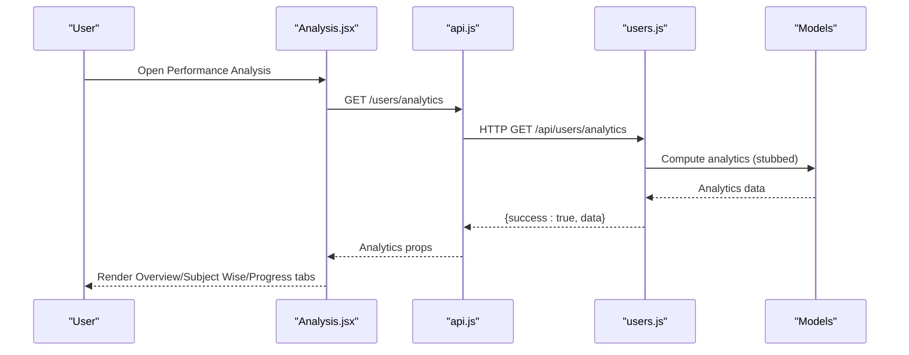
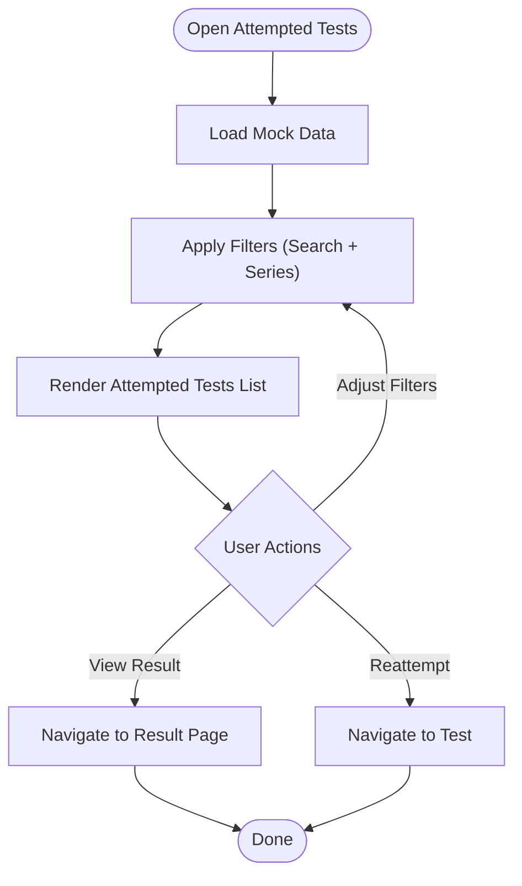
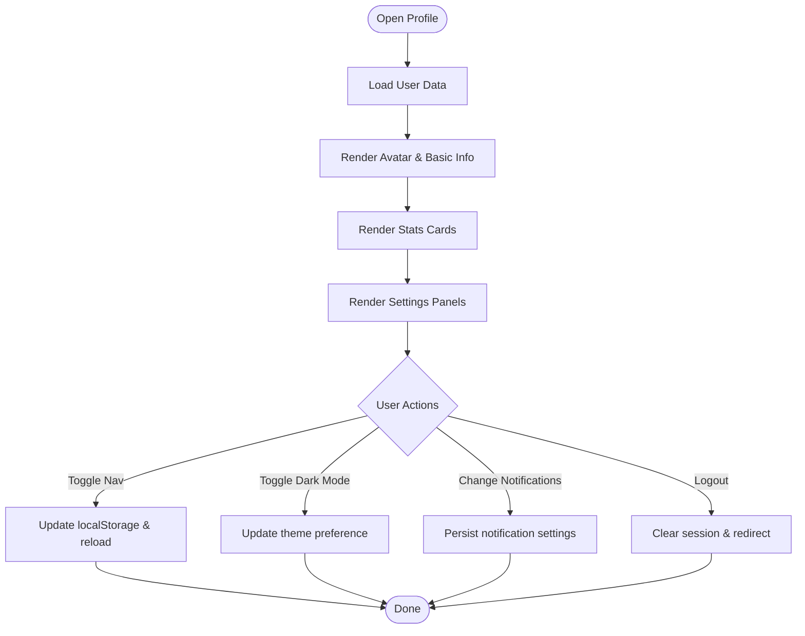
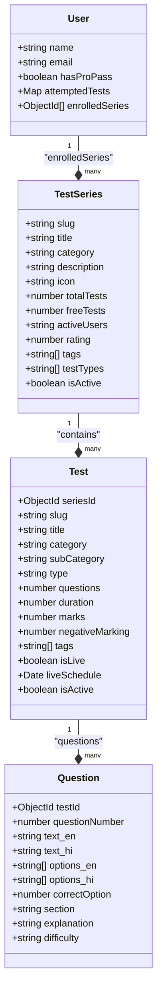
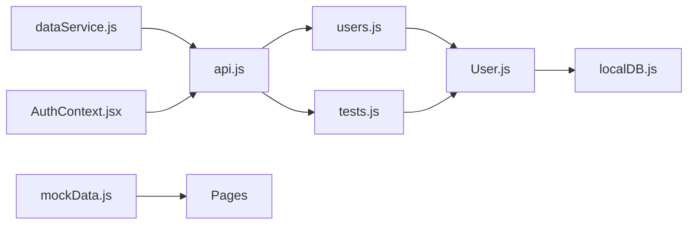

# Progress Tracking & Analytics

<cite>
**Referenced Files in This Document**
- [Dashboard.jsx](file://Frontend/src/pages/Dashboard.jsx)
- [Analysis.jsx](file://Frontend/src/pages/Analysis.jsx)
- [AttemptedTests.jsx](file://Frontend/src/pages/AttemptedTests.jsx)
- [Profile.jsx](file://Frontend/src/pages/Profile.jsx)
- [dataService.js](file://Frontend/src/services/dataService.js)
- [api.js](file://Frontend/src/services/api.js)
- [AuthContext.jsx](file://Frontend/src/context/AuthContext.jsx)
- [mockData.js](file://Frontend/src/data/mockData.js)
- [users.js](file://Backend/src/routes/users.js)
- [tests.js](file://Backend/src/routes/tests.js)
- [User.js](file://Backend/src/models/User.js)
- [Test.js](file://Backend/src/models/Test.js)
- [TestSeries.js](file://Backend/src/models/TestSeries.js)
- [Question.js](file://Backend/src/models/Question.js)
- [localDB.js](file://Backend/src/db/localDB.js)
</cite>

## Table of Contents
1. [Introduction](#introduction)
2. [Project Structure](#project-structure)
3. [Core Components](#core-components)
4. [Architecture Overview](#architecture-overview)
5. [Detailed Component Analysis](#detailed-component-analysis)
6. [Dependency Analysis](#dependency-analysis)
7. [Performance Considerations](#performance-considerations)
8. [Troubleshooting Guide](#troubleshooting-guide)
9. [Conclusion](#conclusion)

## Introduction
This document describes the progress tracking and analytics system for the Trstprep platform. It covers the user dashboard, test history and completion status, performance analysis, attempted tests filtering, profile statistics, analytics visualizations, backend data aggregation, and frontend components for analytics display and recommendations. The system combines frontend React components with a backend built on Express and MongoDB/Mongoose, using a local JSON database adapter for development.

## Project Structure
The system is organized into:
- Frontend (React): Pages for dashboard, analysis, attempted tests, and profile; services for API/data; context for authentication; and mock data for development.
- Backend (Express/Mongoose): Routes for users, tests, and series; models for domain entities; and a local JSON database adapter for development.

**Diagram sources**
- [Dashboard.jsx](file://Frontend/src/pages/Dashboard.jsx#L1-L330)
- [Analysis.jsx](file://Frontend/src/pages/Analysis.jsx#L1-L282)
- [AttemptedTests.jsx](file://Frontend/src/pages/AttemptedTests.jsx#L1-L278)
- [Profile.jsx](file://Frontend/src/pages/Profile.jsx#L1-L252)
- [api.js](file://Frontend/src/services/api.js#L1-L92)
- [dataService.js](file://Frontend/src/services/dataService.js#L1-L172)
- [mockData.js](file://Frontend/src/data/mockData.js#L1-L273)
- [AuthContext.jsx](file://Frontend/src/context/AuthContext.jsx#L1-L203)
- [users.js](file://Backend/src/routes/users.js#L1-L150)
- [tests.js](file://Backend/src/routes/tests.js#L1-L265)
- [User.js](file://Backend/src/models/User.js#L1-L81)
- [Test.js](file://Backend/src/models/Test.js#L1-L77)
- [TestSeries.js](file://Backend/src/models/TestSeries.js#L1-L71)
- [Question.js](file://Backend/src/models/Question.js#L1-L54)
- [localDB.js](file://Backend/src/db/localDB.js#L1-L222)

**Section sources**
- [Dashboard.jsx](file://Frontend/src/pages/Dashboard.jsx#L1-L330)
- [Analysis.jsx](file://Frontend/src/pages/Analysis.jsx#L1-L282)
- [AttemptedTests.jsx](file://Frontend/src/pages/AttemptedTests.jsx#L1-L278)
- [Profile.jsx](file://Frontend/src/pages/Profile.jsx#L1-L252)
- [api.js](file://Frontend/src/services/api.js#L1-L92)
- [dataService.js](file://Frontend/src/services/dataService.js#L1-L172)
- [mockData.js](file://Frontend/src/data/mockData.js#L1-L273)
- [AuthContext.jsx](file://Frontend/src/context/AuthContext.jsx#L1-L203)
- [users.js](file://Backend/src/routes/users.js#L1-L150)
- [tests.js](file://Backend/src/routes/tests.js#L1-L265)
- [User.js](file://Backend/src/models/User.js#L1-L81)
- [Test.js](file://Backend/src/models/Test.js#L1-L77)
- [TestSeries.js](file://Backend/src/models/TestSeries.js#L1-L71)
- [Question.js](file://Backend/src/models/Question.js#L1-L54)
- [localDB.js](file://Backend/src/db/localDB.js#L1-L222)

## Core Components
- User Dashboard: Displays quick access, recent test series progress, live tests/quizzes, enrolled exams, recent activity, and quick stats.
- Performance Analysis: Provides overview, subject-wise breakdown, and progress insights with tabs for navigation.
- Attempted Tests: Lists historical attempts with search and filter capabilities by series.
- Profile Page: Shows user statistics, subscription status, navigation preferences, and settings.
- Data Services: Centralized API client and caching for frontend data fetching.
- Authentication Context: Manages user session, login/logout, and profile updates.
- Backend Routes: Provide analytics, test attempts, and user enrollment APIs.
- Domain Models: Define schema for users, tests, series, and questions.

**Section sources**
- [Dashboard.jsx](file://Frontend/src/pages/Dashboard.jsx#L11-L330)
- [Analysis.jsx](file://Frontend/src/pages/Analysis.jsx#L11-L282)
- [AttemptedTests.jsx](file://Frontend/src/pages/AttemptedTests.jsx#L10-L278)
- [Profile.jsx](file://Frontend/src/pages/Profile.jsx#L11-L252)
- [dataService.js](file://Frontend/src/services/dataService.js#L15-L172)
- [AuthContext.jsx](file://Frontend/src/context/AuthContext.jsx#L13-L203)
- [users.js](file://Backend/src/routes/users.js#L117-L147)
- [tests.js](file://Backend/src/routes/tests.js#L125-L262)
- [User.js](file://Backend/src/models/User.js#L4-L81)
- [Test.js](file://Backend/src/models/Test.js#L3-L77)
- [TestSeries.js](file://Backend/src/models/TestSeries.js#L3-L71)
- [Question.js](file://Backend/src/models/Question.js#L3-L54)

## Architecture Overview
The frontend communicates with backend APIs via axios interceptors that attach tokens. The backend exposes routes for analytics, test attempts, and user data. Data aggregation for analytics is currently stubbed in backend routes and will be extended to compute metrics from attempts.

**Diagram sources**
- [api.js](file://Frontend/src/services/api.js#L12-L44)
- [users.js](file://Backend/src/routes/users.js#L117-L147)
- [tests.js](file://Backend/src/routes/tests.js#L8-L48)
- [User.js](file://Backend/src/models/User.js#L1-L81)
- [Test.js](file://Backend/src/models/Test.js#L1-L77)
- [TestSeries.js](file://Backend/src/models/TestSeries.js#L1-L71)
- [Question.js](file://Backend/src/models/Question.js#L1-L54)
- [localDB.js](file://Backend/src/db/localDB.js#L75-L80)

## Detailed Component Analysis

### User Dashboard
The dashboard presents:
- Quick access cards to frequently used sections.
- Recent test series with progress bars and completion percentages.
- Live tests and quizzes with registration actions.
- My Exams section linking to enrolled categories.
- Recent activity feed with timestamps and scores.
- Quick stats summary for tests taken, average accuracy, best rank, and time spent.

**Diagram sources**
- [Dashboard.jsx](file://Frontend/src/pages/Dashboard.jsx#L54-L330)

**Section sources**
- [Dashboard.jsx](file://Frontend/src/pages/Dashboard.jsx#L11-L330)

### Performance Analysis Interface
The analysis page provides:
- Overview tab: Answer distribution (correct/wrong/skipped), recent tests list.
- Subject-wise tab: Per-subject accuracy bars and attempted counts.
- Progress tab: Personalized improvement suggestions, strengths, and weak areas.

**Diagram sources**
- [Analysis.jsx](file://Frontend/src/pages/Analysis.jsx#L11-L282)
- [api.js](file://Frontend/src/services/api.js#L73-L81)
- [users.js](file://Backend/src/routes/users.js#L117-L147)

**Section sources**
- [Analysis.jsx](file://Frontend/src/pages/Analysis.jsx#L11-L282)
- [users.js](file://Backend/src/routes/users.js#L117-L147)

### Attempted Tests Section
The attempted tests page supports:
- Search by test title.
- Filtering by test series.
- Display of attempt details: score, accuracy, rank, time spent, and question breakdown.
- Action buttons to review results and reattempt tests.

**Diagram sources**
- [AttemptedTests.jsx](file://Frontend/src/pages/AttemptedTests.jsx#L10-L278)

**Section sources**
- [AttemptedTests.jsx](file://Frontend/src/pages/AttemptedTests.jsx#L10-L278)

### Profile Page
The profile page displays:
- User avatar, name, email, and PRO membership badge.
- Statistics cards for tests attempted, average accuracy, and rank.
- Navigation layout toggle (top/left sidebar).
- Dark mode toggle.
- Notification settings panel.
- Logout action.

**Diagram sources**
- [Profile.jsx](file://Frontend/src/pages/Profile.jsx#L11-L252)

**Section sources**
- [Profile.jsx](file://Frontend/src/pages/Profile.jsx#L11-L252)

### Backend Data Aggregation and APIs
Backend routes expose:
- Analytics endpoint returning computed metrics (placeholder implementation).
- Test attempt lifecycle: start attempt, submit answers, fetch result.
- User enrollment and profile management.

**Diagram sources**
- [User.js](file://Backend/src/models/User.js#L4-L81)
- [Test.js](file://Backend/src/models/Test.js#L3-L77)
- [TestSeries.js](file://Backend/src/models/TestSeries.js#L3-L71)
- [Question.js](file://Backend/src/models/Question.js#L3-L54)

**Section sources**
- [users.js](file://Backend/src/routes/users.js#L117-L147)
- [tests.js](file://Backend/src/routes/tests.js#L125-L262)
- [User.js](file://Backend/src/models/User.js#L4-L81)
- [Test.js](file://Backend/src/models/Test.js#L3-L77)
- [TestSeries.js](file://Backend/src/models/TestSeries.js#L3-L71)
- [Question.js](file://Backend/src/models/Question.js#L3-L54)

## Dependency Analysis
- Frontend depends on:
  - api.js for centralized HTTP requests with interceptors.
  - dataService.js for cached data retrieval and helper functions.
  - AuthContext.jsx for session and authentication state.
  - mockData.js for development-time data.
- Backend depends on:
  - Mongoose models for schema enforcement.
  - localDB.js for development database operations.

**Diagram sources**
- [api.js](file://Frontend/src/services/api.js#L1-L92)
- [dataService.js](file://Frontend/src/services/dataService.js#L1-L172)
- [AuthContext.jsx](file://Frontend/src/context/AuthContext.jsx#L1-L203)
- [mockData.js](file://Frontend/src/data/mockData.js#L1-L273)
- [users.js](file://Backend/src/routes/users.js#L1-L150)
- [tests.js](file://Backend/src/routes/tests.js#L1-L265)
- [User.js](file://Backend/src/models/User.js#L1-L81)
- [Test.js](file://Backend/src/models/Test.js#L1-L77)
- [TestSeries.js](file://Backend/src/models/TestSeries.js#L1-L71)
- [Question.js](file://Backend/src/models/Question.js#L1-L54)
- [localDB.js](file://Backend/src/db/localDB.js#L1-L222)

**Section sources**
- [api.js](file://Frontend/src/services/api.js#L1-L92)
- [dataService.js](file://Frontend/src/services/dataService.js#L1-L172)
- [AuthContext.jsx](file://Frontend/src/context/AuthContext.jsx#L1-L203)
- [mockData.js](file://Frontend/src/data/mockData.js#L1-L273)
- [users.js](file://Backend/src/routes/users.js#L1-L150)
- [tests.js](file://Backend/src/routes/tests.js#L1-L265)
- [localDB.js](file://Backend/src/db/localDB.js#L1-L222)

## Performance Considerations
- Frontend caching: dataService.js caches fetched collections for a short duration to reduce redundant network calls.
- Efficient filtering: AttemptedTests.jsx uses useMemo to avoid unnecessary recomputation during search and filter operations.
- Minimal re-renders: Dashboard.jsx and Analysis.jsx split content into smaller components to optimize rendering.
- Backend scalability: Current analytics aggregation is stubbed; future implementations should leverage indexed queries and aggregation pipelines for performance.

[No sources needed since this section provides general guidance]

## Troubleshooting Guide
Common issues and resolutions:
- Authentication failures: api.js interceptor removes invalid tokens and redirects to login on 401 responses.
- Session persistence: AuthContext.jsx validates stored sessions and clears expired ones.
- Network errors: api.js logs network errors and prevents propagation of malformed responses.
- Data not loading: dataService.js wraps fetch calls and returns fallback arrays on errors.

**Section sources**
- [api.js](file://Frontend/src/services/api.js#L26-L44)
- [AuthContext.jsx](file://Frontend/src/context/AuthContext.jsx#L18-L40)
- [dataService.js](file://Frontend/src/services/dataService.js#L15-L27)

## Conclusion
The progress tracking and analytics system integrates frontend pages with backend APIs to deliver a comprehensive view of user performance. The dashboard, analysis, attempted tests, and profile pages provide actionable insights, while the backend routes and models define the data foundation. Future enhancements should focus on implementing robust analytics aggregation, expanding filtering capabilities, and integrating real-time performance comparisons and recommendations.

*Last Updated: March 10, 2026 | Update date is (20:16)*
