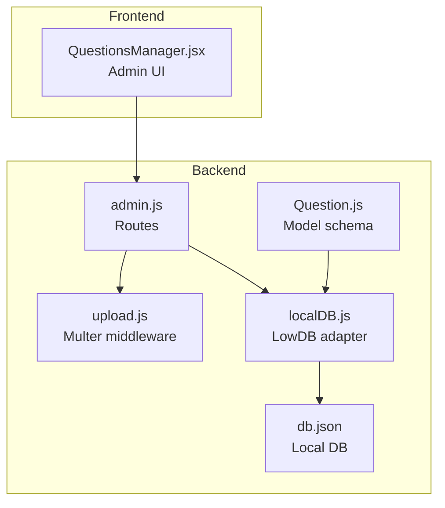
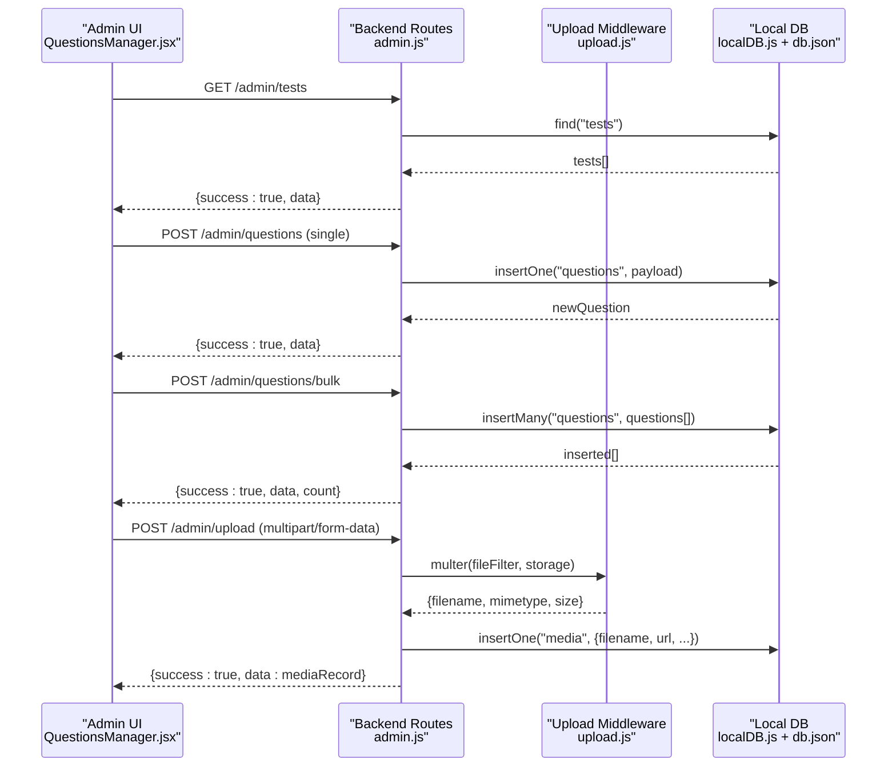
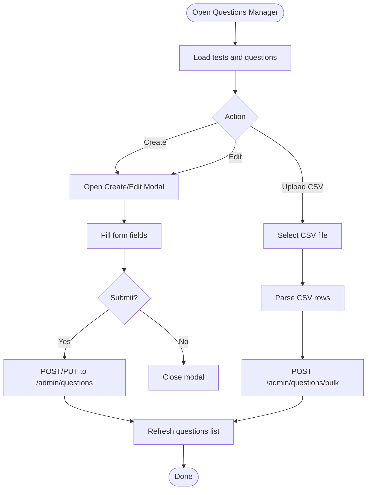
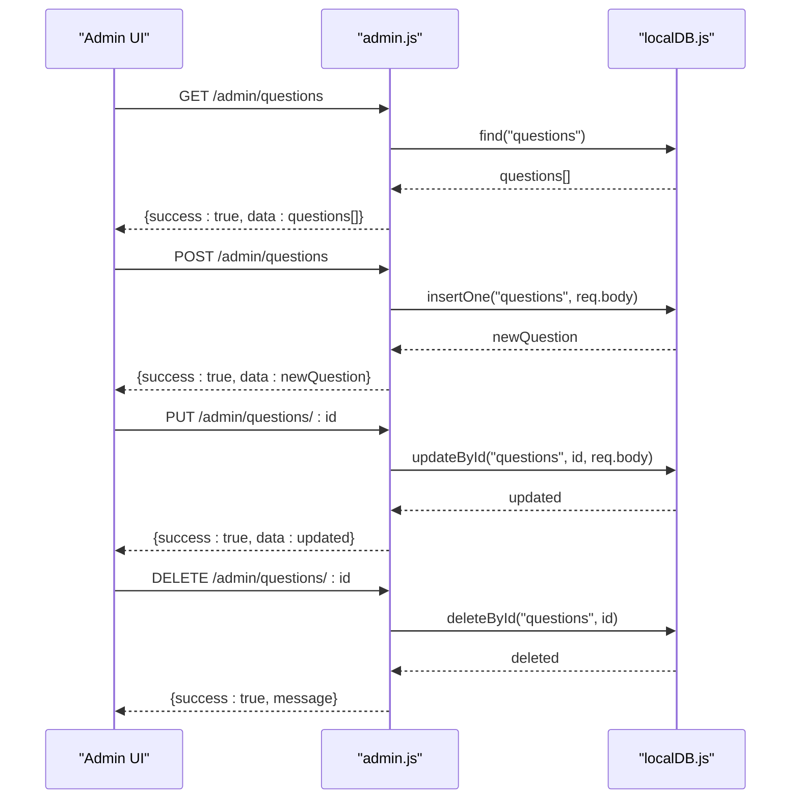
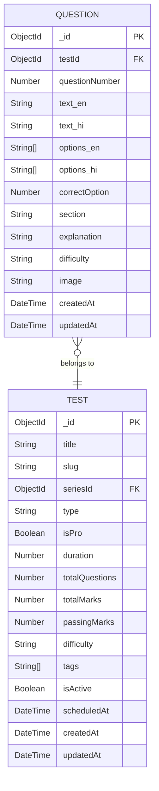
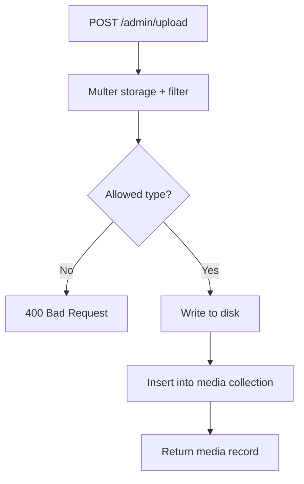
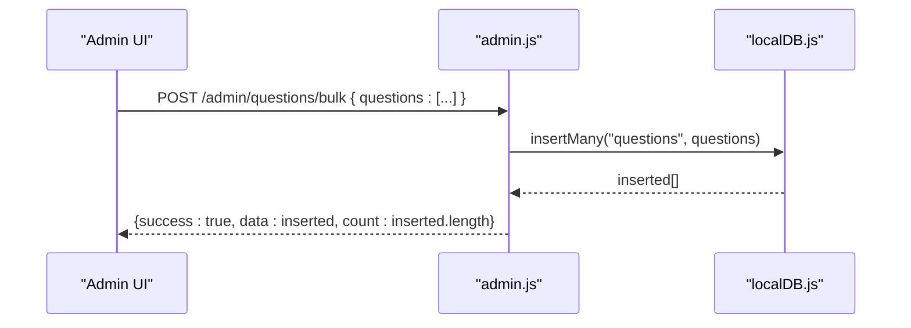
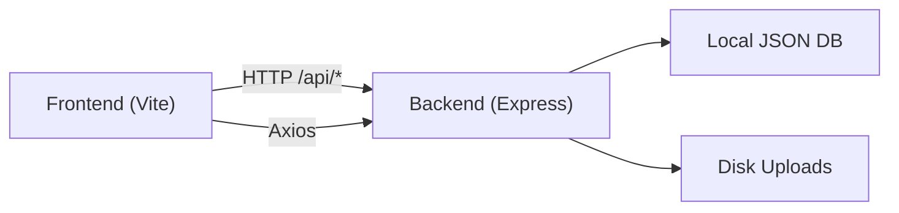

# Question Management

<cite>
**Referenced Files in This Document**
- [QuestionsManager.jsx](file://Frontend/src/pages/admin/QuestionsManager.jsx)
- [Question.js](file://Backend/src/models/Question.js)
- [admin.js](file://Backend/src/routes/admin.js)
- [localDB.js](file://Backend/src/db/localDB.js)
- [upload.js](file://Backend/src/middleware/upload.js)
- [db.json](file://Backend/data/db.json)
- [QUESTIONS_MANAGER_GUIDE.md](file://Documentation/QUESTIONS_MANAGER_GUIDE.md)
- [AUDIT_REPORT.md](file://Documentation/AUDIT_REPORT.md)
- [vite.config.js](file://Frontend/vite.config.js)
- [.env.example](file://Backend/.env.example)
</cite>

## Table of Contents
1. [Introduction](#introduction)
2. [Project Structure](#project-structure)
3. [Core Components](#core-components)
4. [Architecture Overview](#architecture-overview)
5. [Detailed Component Analysis](#detailed-component-analysis)
6. [Dependency Analysis](#dependency-analysis)
7. [Performance Considerations](#performance-considerations)
8. [Troubleshooting Guide](#troubleshooting-guide)
9. [Conclusion](#conclusion)

## Introduction
This document describes the Question Management system for administrators. It covers the admin interface for creating and editing individual questions, bulk uploading via CSV, organizing questions into tests, and managing question metadata such as marks, negative marking, and tags. It also documents the backend APIs for CRUD operations, the local database schema for questions, and the media upload pipeline for images and videos.

## Project Structure
The system comprises:
- Frontend admin page for question creation/editing/listing and CSV bulk upload
- Backend Express routes protected by authentication and admin middleware
- Local JSON database (via lowdb) storing questions and related entities
- File upload middleware supporting images, PDFs, and videos

**Diagram sources**
- [QuestionsManager.jsx](file://Frontend/src/pages/admin/QuestionsManager.jsx#L1-L421)
- [admin.js](file://Backend/src/routes/admin.js#L1-L557)
- [upload.js](file://Backend/src/middleware/upload.js#L1-L91)
- [localDB.js](file://Backend/src/db/localDB.js#L1-L222)
- [Question.js](file://Backend/src/models/Question.js#L1-L54)
- [db.json](file://Backend/data/db.json#L1-L1029)

**Section sources**
- [QuestionsManager.jsx](file://Frontend/src/pages/admin/QuestionsManager.jsx#L1-L421)
- [admin.js](file://Backend/src/routes/admin.js#L1-L557)
- [localDB.js](file://Backend/src/db/localDB.js#L1-L222)
- [upload.js](file://Backend/src/middleware/upload.js#L1-L91)
- [Question.js](file://Backend/src/models/Question.js#L1-L54)
- [db.json](file://Backend/data/db.json#L1-L1029)

## Core Components
- Admin UI (QuestionsManager.jsx)
  - Fetches tests and questions
  - Provides create/edit modal with fields for question text, options, correct answer, explanation, marks, negative marks, and tags
  - Supports CSV bulk upload with a predefined column layout
  - Lists questions in a table with actions to edit/delete
- Backend Routes (admin.js)
  - GET/POST/PUT/DELETE for questions
  - POST bulk endpoint for batch insertion
  - File upload route with type detection and media record creation
- Model Schema (Question.js)
  - Defines question structure including multilingual text and options, correct option index, section, explanation, difficulty, and optional image
  - Enforces unique compound index on testId and questionNumber
- Local Database (localDB.js + db.json)
  - LowDB adapter simulating MongoDB operations on a JSON file
  - Pre-seeded collections including questions, tests, and media

**Section sources**
- [QuestionsManager.jsx](file://Frontend/src/pages/admin/QuestionsManager.jsx#L1-L421)
- [admin.js](file://Backend/src/routes/admin.js#L117-L168)
- [Question.js](file://Backend/src/models/Question.js#L1-L54)
- [localDB.js](file://Backend/src/db/localDB.js#L82-L219)
- [db.json](file://Backend/data/db.json#L388-L443)

## Architecture Overview
The admin UI communicates with backend routes secured by authentication and admin middleware. Requests are proxied from the frontend dev server to the backend. The backend persists data locally using a JSON file and supports file uploads to disk with metadata stored in the media collection.

**Diagram sources**
- [QuestionsManager.jsx](file://Frontend/src/pages/admin/QuestionsManager.jsx#L22-L57)
- [admin.js](file://Backend/src/routes/admin.js#L74-L168)
- [upload.js](file://Backend/src/middleware/upload.js#L30-L83)
- [localDB.js](file://Backend/src/db/localDB.js#L119-L149)
- [db.json](file://Backend/data/db.json#L628-L640)

## Detailed Component Analysis

### Admin Question Creation and Editing UI
- Fetches tests and questions on mount
- Modal form supports:
  - Test selection
  - Question text
  - Four options with radio button to select the correct answer
  - Explanation
  - Marks and negative marks
  - Tags (comma-separated)
- Submit saves either a new question or updates an existing one
- Bulk upload accepts CSV with a strict column order and provides progress and feedback

**Diagram sources**
- [QuestionsManager.jsx](file://Frontend/src/pages/admin/QuestionsManager.jsx#L22-L159)

**Section sources**
- [QuestionsManager.jsx](file://Frontend/src/pages/admin/QuestionsManager.jsx#L1-L421)
- [QUESTIONS_MANAGER_GUIDE.md](file://Documentation/QUESTIONS_MANAGER_GUIDE.md#L38-L98)

### Backend Question CRUD and Bulk Import
- GET /admin/questions: returns all questions
- POST /admin/questions: creates a single question
- PUT /admin/questions/:id: updates a question
- DELETE /admin/questions/:id: removes a question
- POST /admin/questions/bulk: inserts many questions at once
- All endpoints are protected by authentication and admin middleware

**Diagram sources**
- [admin.js](file://Backend/src/routes/admin.js#L117-L168)
- [localDB.js](file://Backend/src/db/localDB.js#L119-L185)

**Section sources**
- [admin.js](file://Backend/src/routes/admin.js#L117-L168)
- [localDB.js](file://Backend/src/db/localDB.js#L82-L219)

### Question Model Schema and Multi-language Support
- Question schema defines:
  - testId referencing a test
  - questionNumber with unique constraint per test
  - Multilingual fields for text and options (en and hi)
  - correctOption as a 0-indexed number
  - section, explanation, difficulty, and optional image
  - Compound unique index on testId and questionNumber

**Diagram sources**
- [Question.js](file://Backend/src/models/Question.js#L3-L47)
- [db.json](file://Backend/data/db.json#L100-L386)

**Section sources**
- [Question.js](file://Backend/src/models/Question.js#L1-L54)
- [db.json](file://Backend/data/db.json#L388-L443)

### Media Upload Pipeline
- Upload route accepts multipart/form-data
- File types allowed: images, PDF, and video
- Unique filenames generated and saved under uploads/{images,pdfs,videos}
- A media record is inserted with filename, original name, MIME type, size, URL, and fileType
- getFileUrl constructs public URLs based on BASE_URL

**Diagram sources**
- [admin.js](file://Backend/src/routes/admin.js#L242-L272)
- [upload.js](file://Backend/src/middleware/upload.js#L30-L83)
- [db.json](file://Backend/data/db.json#L628-L640)

**Section sources**
- [admin.js](file://Backend/src/routes/admin.js#L242-L272)
- [upload.js](file://Backend/src/middleware/upload.js#L1-L91)
- [db.json](file://Backend/data/db.json#L628-L640)

### CSV Bulk Upload Workflow
- The admin UI provides a CSV template and column order
- The backend expects an array of question objects in the request body for bulk insertion
- On success, returns the inserted count

**Diagram sources**
- [QuestionsManager.jsx](file://Frontend/src/pages/admin/QuestionsManager.jsx#L127-L159)
- [admin.js](file://Backend/src/routes/admin.js#L135-L144)
- [localDB.js](file://Backend/src/db/localDB.js#L135-L149)

**Section sources**
- [QUESTIONS_MANAGER_GUIDE.md](file://Documentation/QUESTIONS_MANAGER_GUIDE.md#L67-L98)
- [admin.js](file://Backend/src/routes/admin.js#L135-L144)

## Dependency Analysis
- Frontend depends on:
  - Axios for API requests
  - React and React Router for routing
  - Proxy configuration to reach backend
- Backend depends on:
  - Express for routes
  - Multer for file uploads
  - LowDB for local persistence
  - Environment variables for configuration

**Diagram sources**
- [vite.config.js](file://Frontend/vite.config.js#L9-L14)
- [admin.js](file://Backend/src/routes/admin.js#L1-L10)
- [localDB.js](file://Backend/src/db/localDB.js#L1-L222)
- [upload.js](file://Backend/src/middleware/upload.js#L1-L25)

**Section sources**
- [vite.config.js](file://Frontend/vite.config.js#L1-L21)
- [admin.js](file://Backend/src/routes/admin.js#L1-L10)
- [localDB.js](file://Backend/src/db/localDB.js#L1-L222)
- [upload.js](file://Backend/src/middleware/upload.js#L1-L25)

## Performance Considerations
- Local JSON database is suitable for development and small-scale usage; consider migrating to MongoDB for production scalability.
- CSV bulk upload sends all rows in a single request; for very large files, consider chunking or streaming approaches.
- File uploads are stored on disk; ensure adequate disk space and consider CDN integration for media delivery.
- The UI currently lists all questions; pagination or virtualization would improve rendering performance for large datasets.

## Troubleshooting Guide
- Authentication failures
  - Ensure a valid admin token is present in local storage and included in Authorization headers.
  - Verify frontend proxy configuration and backend CORS settings.
- Upload errors
  - Confirm file type is allowed (image, PDF, video).
  - Check file size limit and upload directory permissions.
- Database initialization
  - Ensure the local DB file exists and is readable/writable.
  - Reinitialize if the schema appears inconsistent.
- CSV upload issues
  - Validate column order and quoted fields.
  - Confirm test IDs exist in the tests collection.

**Section sources**
- [admin.js](file://Backend/src/routes/admin.js#L1-L10)
- [upload.js](file://Backend/src/middleware/upload.js#L55-L83)
- [localDB.js](file://Backend/src/db/localDB.js#L48-L73)
- [QUESTIONS_MANAGER_GUIDE.md](file://Documentation/QUESTIONS_MANAGER_GUIDE.md#L67-L98)

## Conclusion
The Question Management system provides a complete admin workflow for creating, editing, listing, and bulk importing questions, along with a media upload pipeline. The frontend integrates seamlessly with backend routes, while the backend uses a local database and file system for persistence and media handling. For production, consider migrating to MongoDB and implementing additional validations, duplicate detection, and advanced filtering capabilities.

*Last Updated: March 10, 2026 | Update date is (20:16)*
