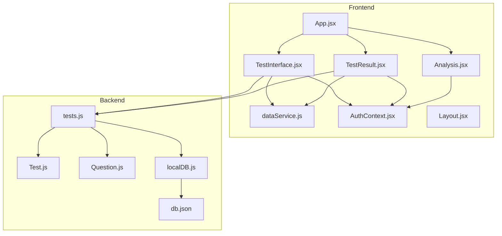
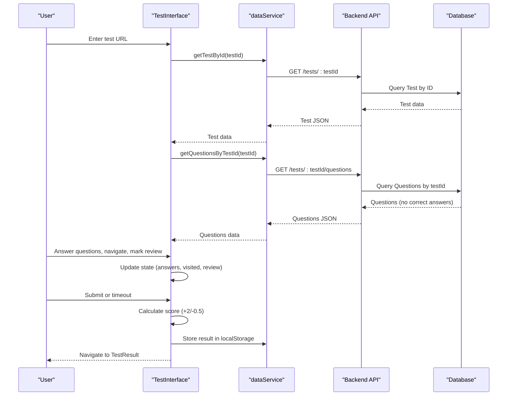
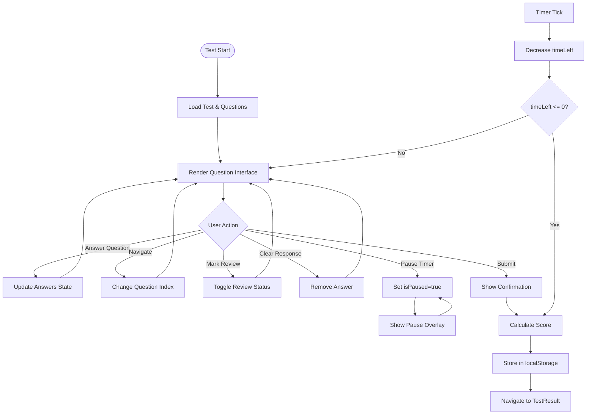
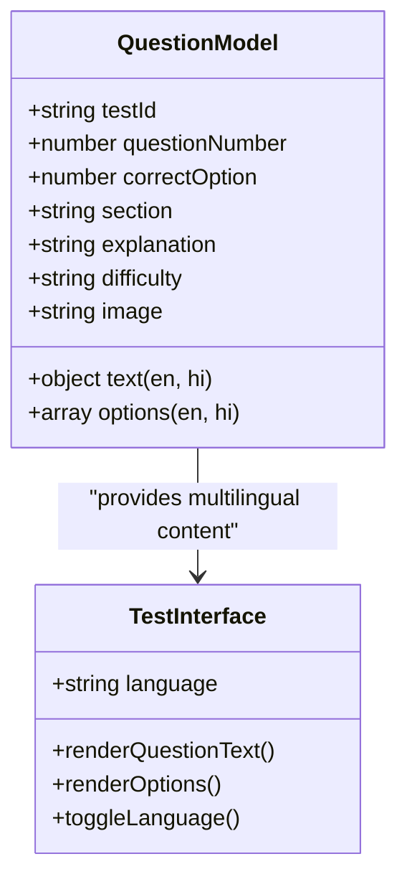
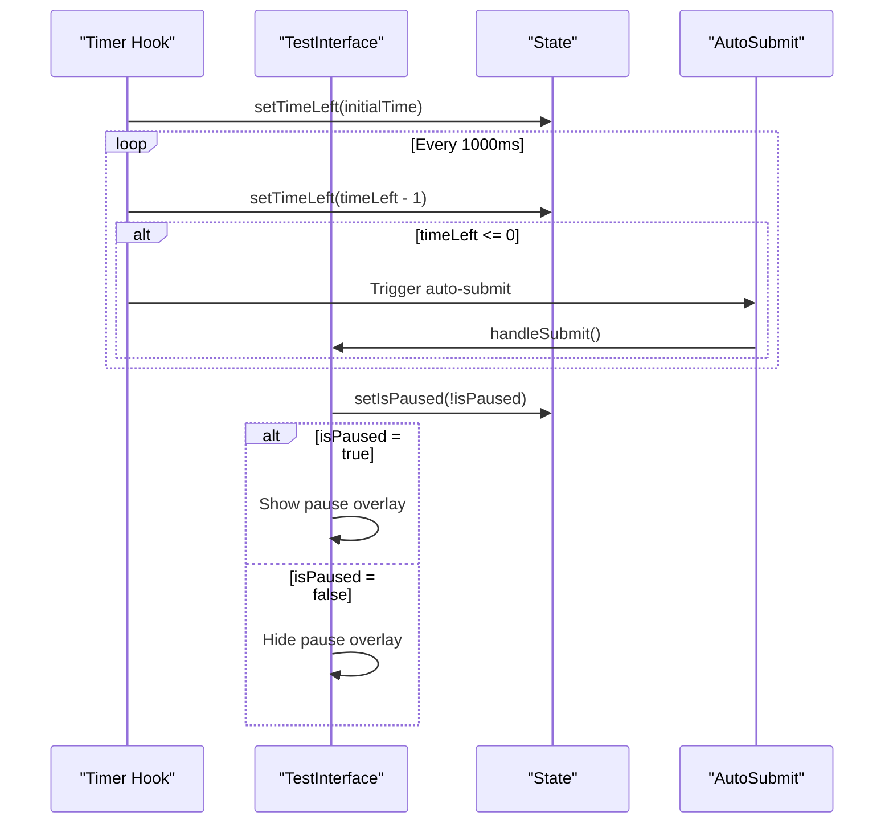
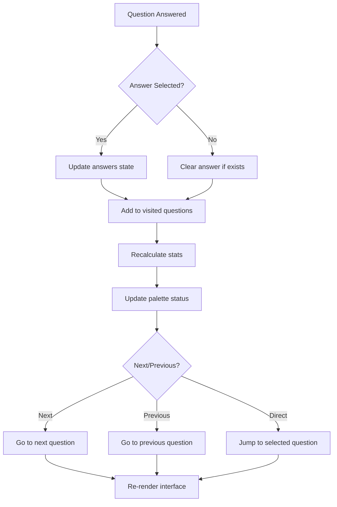
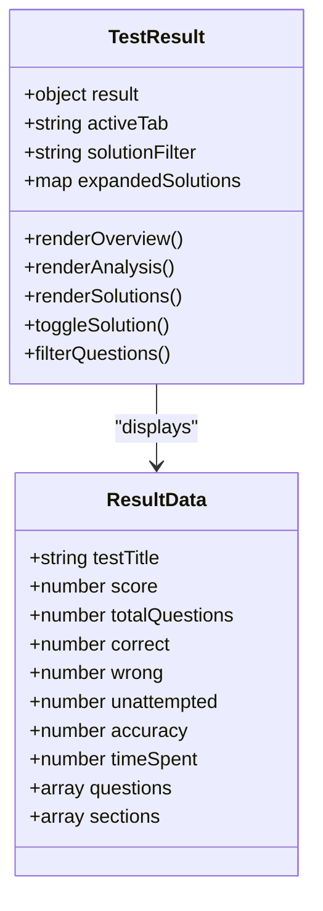
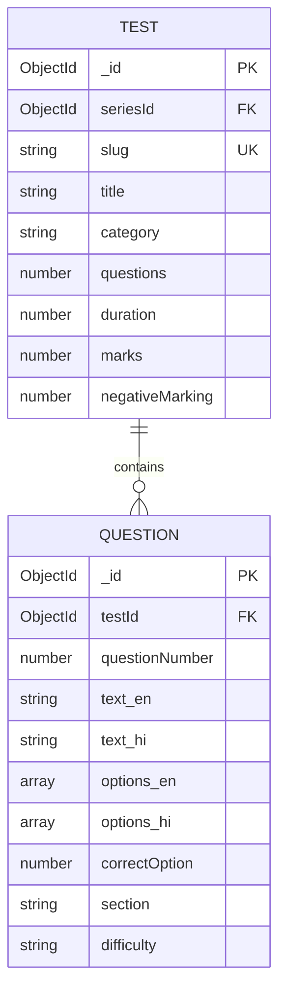
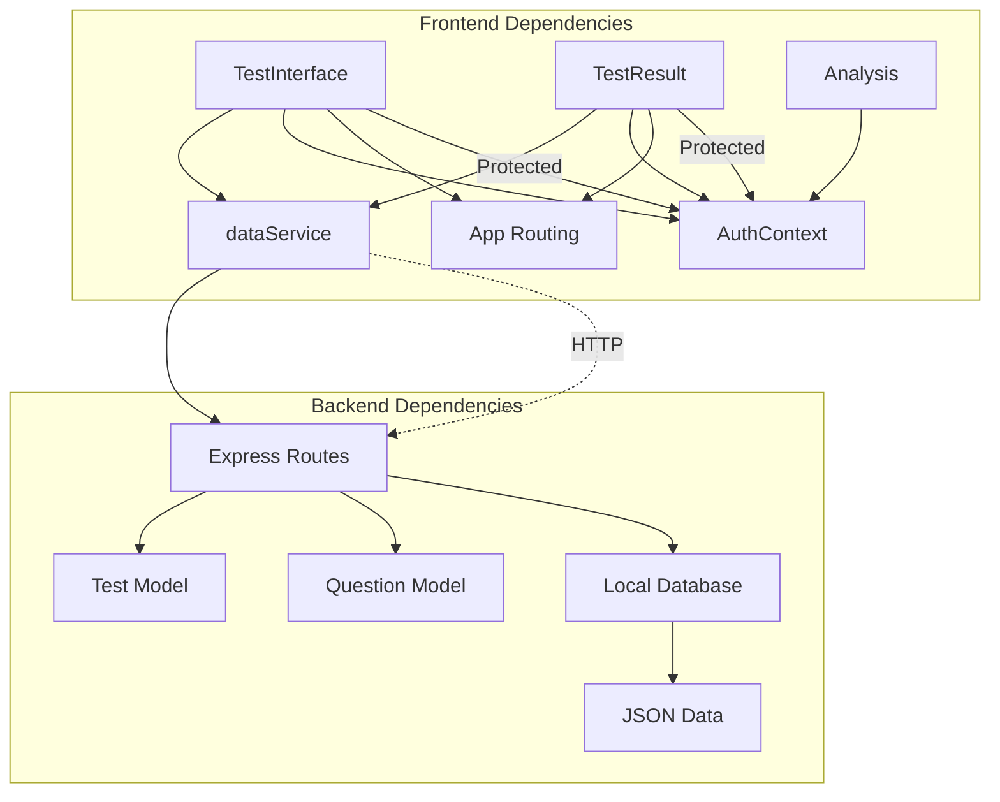

# Test Interface System

<cite>
**Referenced Files in This Document**
- [TestInterface.jsx](file://Frontend/src/pages/TestInterface.jsx)
- [TestResult.jsx](file://Frontend/src/pages/TestResult.jsx)
- [Analysis.jsx](file://Frontend/src/pages/Analysis.jsx)
- [App.jsx](file://Frontend/src/App.jsx)
- [dataService.js](file://Frontend/src/services/dataService.js)
- [AuthContext.jsx](file://Frontend/src/context/AuthContext.jsx)
- [Layout.jsx](file://Frontend/src/components/layout/Layout.jsx)
- [tests.js](file://Backend/src/routes/tests.js)
- [Test.js](file://Backend/src/models/Test.js)
- [Question.js](file://Backend/src/models/Question.js)
- [localDB.js](file://Backend/src/db/localDB.js)
- [db.json](file://Backend/data/db.json)
</cite>

## Table of Contents
1. [Introduction](#introduction)
2. [Project Structure](#project-structure)
3. [Core Components](#core-components)
4. [Architecture Overview](#architecture-overview)
5. [Detailed Component Analysis](#detailed-component-analysis)
6. [Dependency Analysis](#dependency-analysis)
7. [Performance Considerations](#performance-considerations)
8. [Troubleshooting Guide](#troubleshooting-guide)
9. [Conclusion](#conclusion)

## Introduction
This document provides comprehensive documentation for the interactive test interface system. It covers the full-screen test-taking experience, including question presentation, navigation controls, marking system, and answer submission. It also details multi-language support (English/Hindi), dynamic content loading, RTL considerations, timer integration with countdown display, auto-submission on timeout, pause/resume functionality, question handling (randomization, validation, progress tracking), and the test result interface with multi-tab display (Overview, Analysis, Solutions). Additionally, it outlines the frontend components, backend APIs, and database models supporting the system.

## Project Structure
The system comprises:
- Frontend React application with dedicated pages for test interface, results, and analysis
- Backend Express server with RESTful APIs for test operations
- Database models for tests and questions
- Authentication context and protected routing

**Diagram sources**
- [App.jsx](file://Frontend/src/App.jsx#L62-L83)
- [TestInterface.jsx](file://Frontend/src/pages/TestInterface.jsx#L1-L677)
- [TestResult.jsx](file://Frontend/src/pages/TestResult.jsx#L1-L542)
- [Analysis.jsx](file://Frontend/src/pages/Analysis.jsx#L1-L282)
- [dataService.js](file://Frontend/src/services/dataService.js#L1-L172)
- [AuthContext.jsx](file://Frontend/src/context/AuthContext.jsx#L1-L203)
- [Layout.jsx](file://Frontend/src/components/layout/Layout.jsx#L1-L87)
- [tests.js](file://Backend/src/routes/tests.js#L1-L265)
- [Test.js](file://Backend/src/models/Test.js#L1-L77)
- [Question.js](file://Backend/src/models/Question.js#L1-L54)
- [localDB.js](file://Backend/src/db/localDB.js#L1-L222)
- [db.json](file://Backend/data/db.json#L1-L200)

**Section sources**
- [App.jsx](file://Frontend/src/App.jsx#L62-L83)
- [TestInterface.jsx](file://Frontend/src/pages/TestInterface.jsx#L1-L677)
- [TestResult.jsx](file://Frontend/src/pages/TestResult.jsx#L1-L542)
- [Analysis.jsx](file://Frontend/src/pages/Analysis.jsx#L1-L282)
- [dataService.js](file://Frontend/src/services/dataService.js#L1-L172)
- [AuthContext.jsx](file://Frontend/src/context/AuthContext.jsx#L1-L203)
- [Layout.jsx](file://Frontend/src/components/layout/Layout.jsx#L1-L87)
- [tests.js](file://Backend/src/routes/tests.js#L1-L265)
- [Test.js](file://Backend/src/models/Test.js#L1-L77)
- [Question.js](file://Backend/src/models/Question.js#L1-L54)
- [localDB.js](file://Backend/src/db/localDB.js#L1-L222)
- [db.json](file://Backend/data/db.json#L1-L200)

## Core Components
- TestInterface: Full-screen test-taking experience with question rendering, navigation, marking, and submission
- TestResult: Multi-tab result display (Overview, Analysis, Solutions) with performance metrics and solution review
- Analysis: Performance analytics dashboard with tabs for overview, subjects, and progress
- dataService: Centralized API service for fetching test and question data
- AuthContext: Authentication provider and utilities for protected routes
- Backend routes and models: REST endpoints and database schemas for tests and questions

Key capabilities:
- Dynamic bilingual content (English/Hindi) with language toggle
- Real-time timer with pause/resume and auto-submit on timeout
- Question palette with status indicators and section filtering
- Mark for Review functionality and clear response
- Comprehensive result analytics and solution review

**Section sources**
- [TestInterface.jsx](file://Frontend/src/pages/TestInterface.jsx#L1-L677)
- [TestResult.jsx](file://Frontend/src/pages/TestResult.jsx#L1-L542)
- [Analysis.jsx](file://Frontend/src/pages/Analysis.jsx#L1-L282)
- [dataService.js](file://Frontend/src/services/dataService.js#L1-L172)
- [AuthContext.jsx](file://Frontend/src/context/AuthContext.jsx#L1-L203)

## Architecture Overview
The system follows a client-server architecture:
- Frontend React application handles UI, state management, and user interactions
- Backend REST API manages test data, question retrieval, and result processing
- Database stores test series, tests, and questions with multilingual support
- Authentication ensures secure access to premium content

**Diagram sources**
- [TestInterface.jsx](file://Frontend/src/pages/TestInterface.jsx#L35-L72)
- [dataService.js](file://Frontend/src/services/dataService.js#L84-L92)
- [tests.js](file://Backend/src/routes/tests.js#L86-L123)
- [localDB.js](file://Backend/src/db/localDB.js#L82-L103)

## Detailed Component Analysis

### TestInterface Component
The TestInterface component provides the full-screen test-taking experience with the following features:

- State Management
  - Test metadata and questions loaded via API
  - Current question index and section tracking
  - User answers, visited questions, and review markers
  - Timer state with pause/resume capability
  - Language toggle between English and Hindi

- Question Presentation
  - Dynamic content rendering based on selected language
  - Section-based navigation with tabbed interface
  - Question palette with color-coded status indicators
  - Responsive design for desktop and mobile

- Navigation and Interaction
  - Previous/Next buttons with validation
  - Direct question jumping via palette
  - Mark for Review toggle with visual feedback
  - Clear response functionality

- Timer Integration
  - Countdown display with warning threshold
  - Auto-submit on timeout
  - Pause/resume overlay with visual indication
  - Desktop and mobile timer displays

- Submission and Results
  - Confirmation dialog before submission
  - Score calculation (+2 for correct, -0.5 for incorrect)
  - Result data stored in localStorage for demo
  - Navigation to TestResult page

**Diagram sources**
- [TestInterface.jsx](file://Frontend/src/pages/TestInterface.jsx#L74-L88)
- [TestInterface.jsx](file://Frontend/src/pages/TestInterface.jsx#L142-L229)

**Section sources**
- [TestInterface.jsx](file://Frontend/src/pages/TestInterface.jsx#L1-L677)

### Multi-Language Support Implementation
The system implements dynamic bilingual content with the following mechanisms:

- Data Model
  - Questions store text and options in both English and Hindi
  - Language-specific fields enable seamless switching
  - Default fallback ensures content availability

- UI Implementation
  - Language toggle button in header with globe icon
  - Dynamic content rendering based on selected language
  - Consistent styling across both languages

- Content Generation
  - Mock questions include both English and Hindi variants
  - Even distribution across predefined sections
  - Random correct answer selection

**Diagram sources**
- [Question.js](file://Backend/src/models/Question.js#L14-L21)
- [TestInterface.jsx](file://Frontend/src/pages/TestInterface.jsx#L400-L401)

**Section sources**
- [Question.js](file://Backend/src/models/Question.js#L1-L54)
- [TestInterface.jsx](file://Frontend/src/pages/TestInterface.jsx#L313-L322)
- [TestInterface.jsx](file://Frontend/src/pages/TestInterface.jsx#L646-L674)

### Timer Integration and Auto-Submission
The timer system provides real-time countdown with comprehensive functionality:

- Timer Mechanics
  - Configurable duration from test metadata
  - Real-time countdown with 1-second intervals
  - Warning threshold (5 minutes remaining)
  - Pause/resume functionality with overlay

- Auto-Submission
  - Immediate submission when time reaches zero
  - Score calculation triggered automatically
  - Prevents manual submission after timeout

- UI Integration
  - Dual display (desktop and mobile)
  - Color-coded warnings for low time
  - Persistent timer during navigation

**Diagram sources**
- [TestInterface.jsx](file://Frontend/src/pages/TestInterface.jsx#L74-L88)
- [TestInterface.jsx](file://Frontend/src/pages/TestInterface.jsx#L277-L330)

**Section sources**
- [TestInterface.jsx](file://Frontend/src/pages/TestInterface.jsx#L74-L96)
- [TestInterface.jsx](file://Frontend/src/pages/TestInterface.jsx#L277-L330)
- [TestInterface.jsx](file://Frontend/src/pages/TestInterface.jsx#L623-L640)

### Question Handling System
The question handling system manages content delivery, validation, and progress tracking:

- Content Loading
  - API-driven question retrieval
  - Fallback to mock questions when API returns none
  - Section assignment and filtering
  - Correct answer hiding for security

- Validation and Scoring
  - Immediate answer validation
  - Score calculation with +2/-0.5 scheme
  - Progress tracking through visited questions
  - Review marking system

- Navigation and Progress
  - Section-based navigation
  - Question palette with status indicators
  - Progress statistics (answered, not answered, review)
  - Direct question access

**Diagram sources**
- [TestInterface.jsx](file://Frontend/src/pages/TestInterface.jsx#L142-L177)
- [TestInterface.jsx](file://Frontend/src/pages/TestInterface.jsx#L98-L110)

**Section sources**
- [TestInterface.jsx](file://Frontend/src/pages/TestInterface.jsx#L142-L177)
- [TestInterface.jsx](file://Frontend/src/pages/TestInterface.jsx#L98-L110)

### Test Result Interface
The TestResult component provides a comprehensive post-test analysis:

- Multi-Tab Display
  - Overview: Quick performance summary with visual indicators
  - Analysis: Detailed breakdown by subjects and difficulty
  - Solutions: Question-by-question review with explanations

- Performance Metrics
  - Score display with color-coded accuracy
  - Correct/wrong/skipped counts
  - Time analysis and attempt rate
  - Percentile ranking and rank display

- Solution Review
  - Expandable question cards
  - Color-coded correctness indicators
  - Detailed explanations and option analysis
  - Filtering by question status (correct, wrong, skipped, marked)

**Diagram sources**
- [TestResult.jsx](file://Frontend/src/pages/TestResult.jsx#L61-L89)
- [TestResult.jsx](file://Frontend/src/pages/TestResult.jsx#L121-L170)

**Section sources**
- [TestResult.jsx](file://Frontend/src/pages/TestResult.jsx#L171-L542)

### Backend APIs and Database Models
The backend provides RESTful APIs and robust data models:

- Test Management
  - Test retrieval with access control
  - Question listing for test-taking
  - Test start and submission endpoints
  - Result retrieval endpoints

- Data Models
  - Test schema with duration, marks, and categorization
  - Question schema with multilingual support and sectioning
  - Compound indexing for efficient queries

- Database Implementation
  - Local JSON database with MongoDB-like interface
  - Default data initialization
  - CRUD operations for all collections

**Diagram sources**
- [Test.js](file://Backend/src/models/Test.js#L3-L68)
- [Question.js](file://Backend/src/models/Question.js#L3-L47)

**Section sources**
- [tests.js](file://Backend/src/routes/tests.js#L1-L265)
- [Test.js](file://Backend/src/models/Test.js#L1-L77)
- [Question.js](file://Backend/src/models/Question.js#L1-L54)
- [localDB.js](file://Backend/src/db/localDB.js#L1-L222)
- [db.json](file://Backend/data/db.json#L100-L200)

## Dependency Analysis
The system exhibits clean separation of concerns with well-defined dependencies:

**Diagram sources**
- [App.jsx](file://Frontend/src/App.jsx#L62-L83)
- [dataService.js](file://Frontend/src/services/dataService.js#L1-L27)
- [tests.js](file://Backend/src/routes/tests.js#L1-L6)
- [localDB.js](file://Backend/src/db/localDB.js#L1-L8)

**Section sources**
- [App.jsx](file://Frontend/src/App.jsx#L62-L83)
- [dataService.js](file://Frontend/src/services/dataService.js#L1-L172)
- [tests.js](file://Backend/src/routes/tests.js#L1-L265)

## Performance Considerations
- State Management
  - Efficient React state updates prevent unnecessary re-renders
  - Local storage caching reduces API calls for results
  - Memoization strategies for derived data calculations

- API Optimization
  - Selective field projection to avoid sending correct answers
  - Caching mechanism with 5-second TTL
  - Batch operations for test series and question retrieval

- Database Design
  - Compound indexes for test series and question lookups
  - Efficient querying patterns for test metadata
  - Local JSON database suitable for development scale

## Troubleshooting Guide
Common issues and resolutions:

- Authentication Problems
  - Verify token presence in localStorage
  - Check session expiration and renewal
  - Ensure proper role-based access for premium content

- API Connectivity Issues
  - Confirm backend server is running on localhost:5001
  - Verify CORS configuration for cross-origin requests
  - Check network connectivity and firewall settings

- Data Loading Failures
  - Validate testId and seriesId parameters
  - Check database initialization and default data population
  - Monitor API response success indicators

- Timer Synchronization
  - Ensure single interval timer per test instance
  - Handle browser tab visibility changes
  - Manage timer persistence across navigation

**Section sources**
- [AuthContext.jsx](file://Frontend/src/context/AuthContext.jsx#L43-L98)
- [dataService.js](file://Frontend/src/services/dataService.js#L15-L27)
- [localDB.js](file://Backend/src/db/localDB.js#L48-L73)

## Conclusion
The interactive test interface system provides a comprehensive, scalable solution for online assessment delivery. Its modular architecture supports multilingual content, real-time collaboration features, and detailed analytics. The clean separation between frontend and backend enables easy maintenance and future enhancements. The system's responsive design ensures optimal user experience across devices, while the robust data models and API design support reliable operation at scale.

*Last Updated: March 10, 2026 | Update date is (20:16)*
