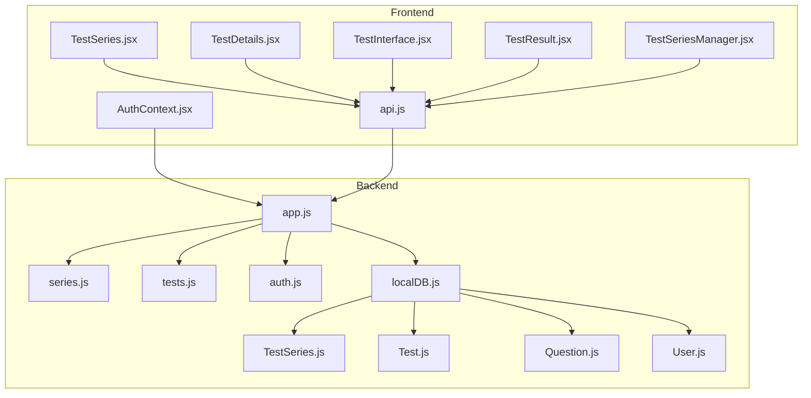
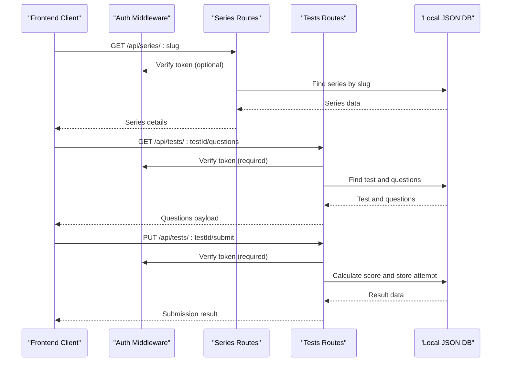
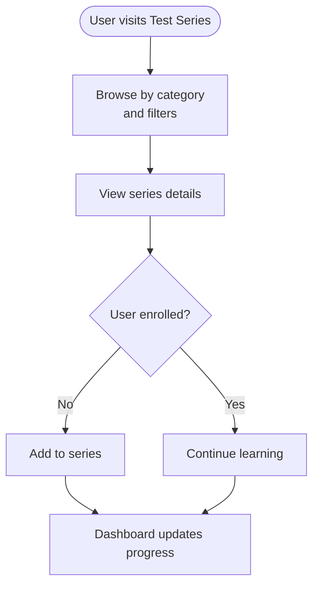
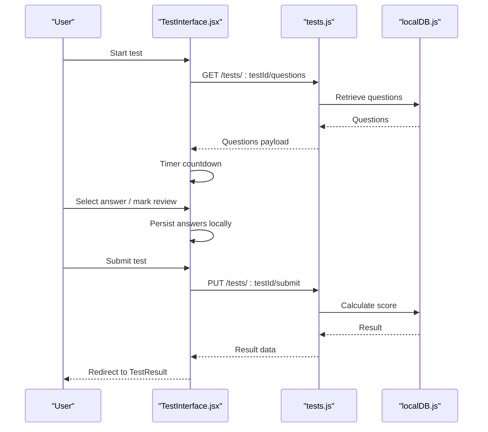
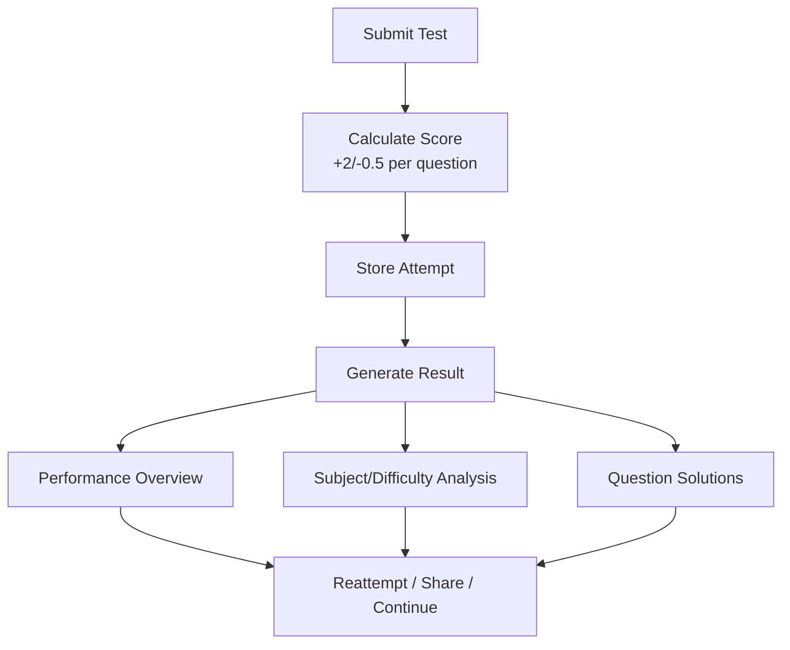
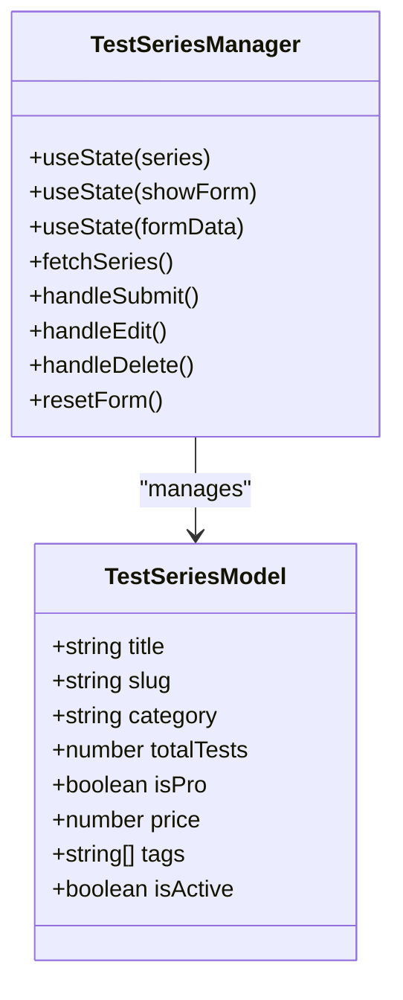
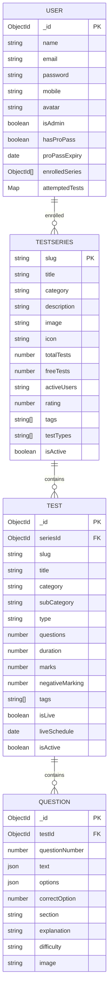
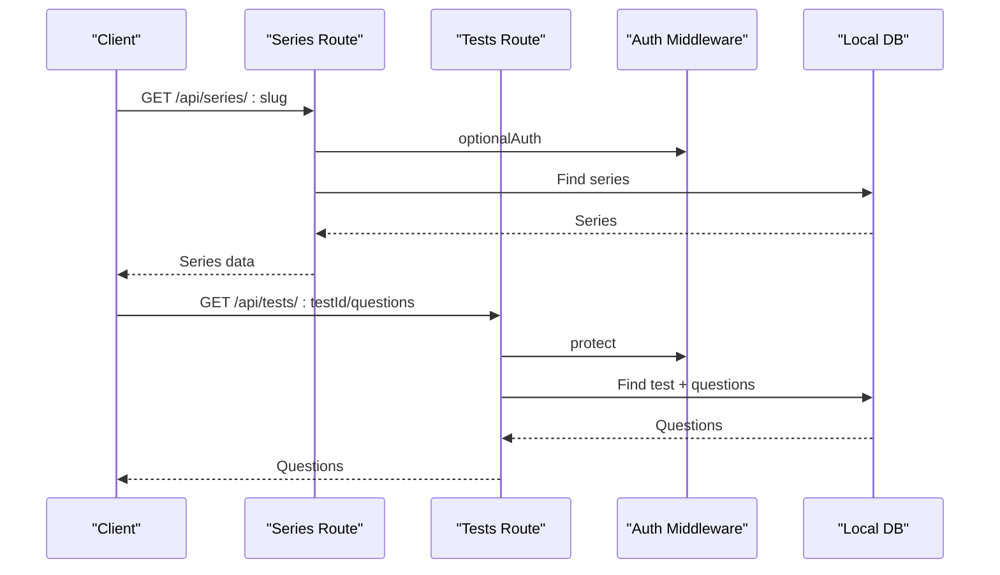
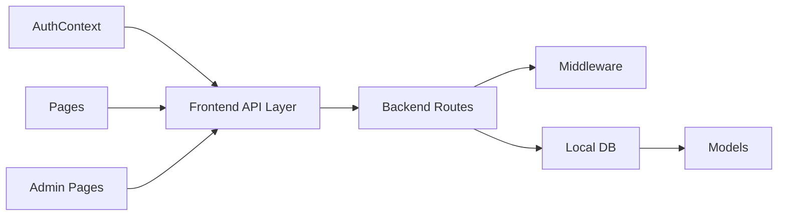

# Test Preparation System

<cite>
**Referenced Files in This Document**
- [TestSeries.js](file://Backend/src/models/TestSeries.js)
- [Test.js](file://Backend/src/models/Test.js)
- [Question.js](file://Backend/src/models/Question.js)
- [User.js](file://Backend/src/models/User.js)
- [db.json](file://Backend/data/db.json)
- [TestInterface.jsx](file://Frontend/src/pages/TestInterface.jsx)
- [TestSeries.jsx](file://Frontend/src/pages/TestSeries.jsx)
- [TestDetails.jsx](file://Frontend/src/pages/TestDetails.jsx)
- [TestResult.jsx](file://Frontend/src/pages/TestResult.jsx)
- [tests.js](file://Backend/src/routes/tests.js)
- [series.js](file://Backend/src/routes/series.js)
- [TestSeriesManager.jsx](file://Frontend/src/pages/admin/TestSeriesManager.jsx)
- [api.js](file://Frontend/src/services/api.js)
- [localDB.js](file://Backend/src/db/localDB.js)
- [auth.js](file://Backend/src/middleware/auth.js)
- [AuthContext.jsx](file://Frontend/src/context/AuthContext.jsx)
- [app.js](file://Backend/src/app.js)
</cite>

## Table of Contents
1. [Introduction](#introduction)
2. [Project Structure](#project-structure)
3. [Core Components](#core-components)
4. [Architecture Overview](#architecture-overview)
5. [Detailed Component Analysis](#detailed-component-analysis)
6. [Dependency Analysis](#dependency-analysis)
7. [Performance Considerations](#performance-considerations)
8. [Troubleshooting Guide](#troubleshooting-guide)
9. [Conclusion](#conclusion)

## Introduction
This document provides comprehensive documentation for Trstprep V2's test preparation system. It covers the entire test workflow from browsing test series and enrollment to test completion and result analysis. The system organizes test series by categories (SSC, Railway, Banking, Defence, State), supports enrollment, test scheduling, and progress tracking. The interactive test interface offers a full-screen experience, multi-language support (English/Hindi), integrated timer, question navigation, marking system, and auto-save functionality. Administrators can manage test series, create and edit questions, classify difficulty, and configure test durations. The frontend components integrate with backend APIs, while the backend uses a local JSON database with MongoDB-like models.

## Project Structure
The project follows a clear separation of concerns:
- Backend: Express.js server with local JSON database, models, routes, middleware, and authentication
- Frontend: React application with pages for test series, test interface, results, and admin management
- Shared: API service layer and authentication context

**Diagram sources**
- [app.js](file://Backend/src/app.js#L1-L94)
- [series.js](file://Backend/src/routes/series.js#L1-L162)
- [tests.js](file://Backend/src/routes/tests.js#L1-L265)
- [auth.js](file://Backend/src/middleware/auth.js#L1-L92)
- [localDB.js](file://Backend/src/db/localDB.js#L1-L222)
- [TestSeries.js](file://Backend/src/models/TestSeries.js#L1-L71)
- [Test.js](file://Backend/src/models/Test.js#L1-L77)
- [Question.js](file://Backend/src/models/Question.js#L1-L54)
- [User.js](file://Backend/src/models/User.js#L1-L81)
- [TestSeries.jsx](file://Frontend/src/pages/TestSeries.jsx#L1-L427)
- [TestDetails.jsx](file://Frontend/src/pages/TestDetails.jsx#L1-L330)
- [TestInterface.jsx](file://Frontend/src/pages/TestInterface.jsx#L1-L677)
- [TestResult.jsx](file://Frontend/src/pages/TestResult.jsx#L1-L542)
- [TestSeriesManager.jsx](file://Frontend/src/pages/admin/TestSeriesManager.jsx#L1-L424)
- [api.js](file://Frontend/src/services/api.js#L1-L92)
- [AuthContext.jsx](file://Frontend/src/context/AuthContext.jsx#L1-L203)

**Section sources**
- [app.js](file://Backend/src/app.js#L1-L94)
- [localDB.js](file://Backend/src/db/localDB.js#L1-L222)

## Core Components
This section outlines the primary components and their responsibilities:

- Test Series Model: Defines test series structure, categories, ratings, and metadata
- Test Model: Represents individual tests with types, durations, marks, and scheduling
- Question Model: Stores questions with multilingual support, options, correct answers, and difficulty
- User Model: Manages user profiles, enrollment, progress tracking, and Pro Pass validation
- Backend Routes: Provide APIs for series discovery, test access, question retrieval, and result submission
- Frontend Pages: Implement user-facing workflows for browsing, enrolling, taking tests, and reviewing results
- Admin Management: Enables administrators to create and manage test series and related content

**Section sources**
- [TestSeries.js](file://Backend/src/models/TestSeries.js#L1-L71)
- [Test.js](file://Backend/src/models/Test.js#L1-L77)
- [Question.js](file://Backend/src/models/Question.js#L1-L54)
- [User.js](file://Backend/src/models/User.js#L1-L81)
- [series.js](file://Backend/src/routes/series.js#L1-L162)
- [tests.js](file://Backend/src/routes/tests.js#L1-L265)

## Architecture Overview
The system employs a client-server architecture with a local JSON database abstraction layer. Authentication middleware secures protected routes, while the frontend consumes RESTful APIs to deliver an interactive test-taking experience.

**Diagram sources**
- [series.js](file://Backend/src/routes/series.js#L55-L93)
- [tests.js](file://Backend/src/routes/tests.js#L86-L123)
- [tests.js](file://Backend/src/routes/tests.js#L168-L231)
- [auth.js](file://Backend/src/middleware/auth.js#L4-L66)
- [localDB.js](file://Backend/src/db/localDB.js#L82-L133)

## Detailed Component Analysis

### Test Series Organization and Enrollment
- Categories: SSC, Railway, Banking, Defence, State, Other
- Metadata: Title, description, image/icon, total/free tests, ratings, tags, test types
- Enrollment: Users can enroll in series; progress tracked per series
- Discovery: Filtering by category, sorting by popularity/rating/tests, and search

**Section sources**
- [TestSeries.js](file://Backend/src/models/TestSeries.js#L16-L20)
- [TestSeries.jsx](file://Frontend/src/pages/TestSeries.jsx#L21-L104)
- [TestDetails.jsx](file://Frontend/src/pages/TestDetails.jsx#L79-L81)

### Interactive Test Interface
- Full-screen experience with responsive design
- Multi-language support: English/Hindi via language toggle
- Timer integration with pause/resume and low-time warnings
- Question navigation: palette, section tabs, previous/next
- Marking system: mark for review, clear response
- Auto-save: answers persisted during test session
- Scoring: +2/-0.5 scoring scheme applied automatically

**Diagram sources**
- [TestInterface.jsx](file://Frontend/src/pages/TestInterface.jsx#L11-L72)
- [TestInterface.jsx](file://Frontend/src/pages/TestInterface.jsx#L185-L229)
- [tests.js](file://Backend/src/routes/tests.js#L86-L123)
- [tests.js](file://Backend/src/routes/tests.js#L168-L231)
- [localDB.js](file://Backend/src/db/localDB.js#L82-L133)

**Section sources**
- [TestInterface.jsx](file://Frontend/src/pages/TestInterface.jsx#L1-L677)
- [tests.js](file://Backend/src/routes/tests.js#L86-L123)

### Test Completion and Result Analysis
- Result generation: Score, accuracy, time taken, rank, percentile
- Subject-wise and difficulty-wise breakdown
- Solution review with expandable explanations
- Action buttons: reattempt, share, continue learning

**Section sources**
- [TestResult.jsx](file://Frontend/src/pages/TestResult.jsx#L1-L542)
- [tests.js](file://Backend/src/routes/tests.js#L168-L231)

### Admin Test Series Management
- Create/update/delete test series
- Configure categories, difficulty, pricing, tags, and activity status
- Slug generation and validation
- Bulk operations and form validation

**Diagram sources**
- [TestSeriesManager.jsx](file://Frontend/src/pages/admin/TestSeriesManager.jsx#L1-L424)
- [TestSeries.js](file://Backend/src/models/TestSeries.js#L1-L71)

**Section sources**
- [TestSeriesManager.jsx](file://Frontend/src/pages/admin/TestSeriesManager.jsx#L1-L424)
- [TestSeries.js](file://Backend/src/models/TestSeries.js#L1-L71)

### Backend Data Models
The backend defines robust models for test data structures:

**Diagram sources**
- [TestSeries.js](file://Backend/src/models/TestSeries.js#L1-L71)
- [Test.js](file://Backend/src/models/Test.js#L1-L77)
- [Question.js](file://Backend/src/models/Question.js#L1-L54)
- [User.js](file://Backend/src/models/User.js#L1-L81)

**Section sources**
- [TestSeries.js](file://Backend/src/models/TestSeries.js#L1-L71)
- [Test.js](file://Backend/src/models/Test.js#L1-L77)
- [Question.js](file://Backend/src/models/Question.js#L1-L54)
- [User.js](file://Backend/src/models/User.js#L1-L81)

### API Endpoints and Workflows
Key backend endpoints:
- Series: GET `/api/series`, GET `/api/series/:slug`, GET `/api/series/:slug/tests`, GET `/api/series/category/:category`
- Tests: GET `/api/tests/tag/:tag`, GET `/api/tests/:testId`, GET `/api/tests/:testId/questions`, POST `/api/tests/:testId/start`, PUT `/api/tests/:testId/submit`, GET `/api/tests/:testId/result/:attemptId`

**Diagram sources**
- [series.js](file://Backend/src/routes/series.js#L55-L93)
- [tests.js](file://Backend/src/routes/tests.js#L86-L123)
- [auth.js](file://Backend/src/middleware/auth.js#L46-L66)
- [localDB.js](file://Backend/src/db/localDB.js#L82-L133)

**Section sources**
- [series.js](file://Backend/src/routes/series.js#L1-L162)
- [tests.js](file://Backend/src/routes/tests.js#L1-L265)

## Dependency Analysis
The system exhibits clear separation of concerns with minimal coupling between frontend and backend:

**Diagram sources**
- [api.js](file://Frontend/src/services/api.js#L1-L92)
- [AuthContext.jsx](file://Frontend/src/context/AuthContext.jsx#L1-L203)
- [app.js](file://Backend/src/app.js#L56-L67)
- [localDB.js](file://Backend/src/db/localDB.js#L1-L222)

**Section sources**
- [api.js](file://Frontend/src/services/api.js#L1-L92)
- [AuthContext.jsx](file://Frontend/src/context/AuthContext.jsx#L1-L203)
- [app.js](file://Backend/src/app.js#L1-L94)

## Performance Considerations
- Local JSON database: Suitable for development and small-scale usage; consider migrating to MongoDB for production scalability
- Client-side caching: Local storage used for last test result and session persistence
- API pagination: Not implemented; consider adding pagination for large datasets
- Image/video assets: Not utilized in current models; plan for CDN integration when media is introduced
- Timer accuracy: Frontend timer relies on client clock; consider server-side heartbeat for robustness

## Troubleshooting Guide
Common issues and resolutions:
- Authentication failures: Verify JWT token presence and validity; check middleware error responses
- Access denied for Pro tests: Ensure user has Pro Pass; validate middleware enforcement
- No questions returned: Confirm test exists and questions are populated; check database seeding
- CORS errors: Verify frontend URL matches backend CORS configuration
- Session expiration: Implement automatic token refresh and session renewal

**Section sources**
- [auth.js](file://Backend/src/middleware/auth.js#L4-L66)
- [tests.js](file://Backend/src/routes/tests.js#L100-L106)
- [app.js](file://Backend/src/app.js#L29-L32)
- [AuthContext.jsx](file://Frontend/src/context/AuthContext.jsx#L43-L98)

## Conclusion
Trstprep V2 delivers a comprehensive test preparation ecosystem with organized series, seamless enrollment, robust test-taking interface, and detailed analytics. The modular architecture enables easy administration and future enhancements, including migration to MongoDB and media asset integration. The system provides a solid foundation for scalable exam preparation services across multiple competitive exam categories.

*Last Updated: March 10, 2026 | Update date is (20:16)*
