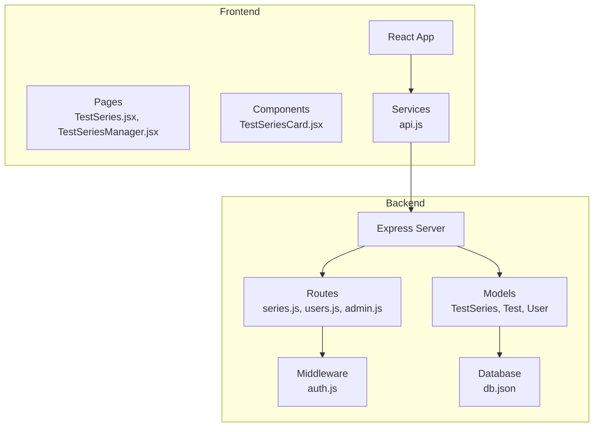
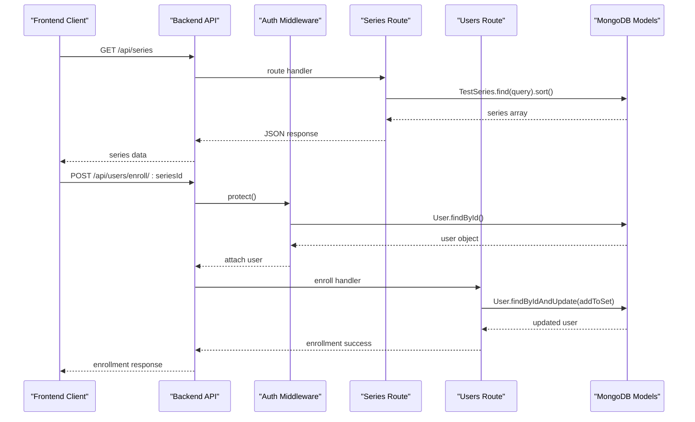
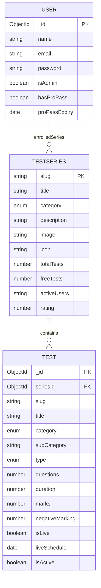
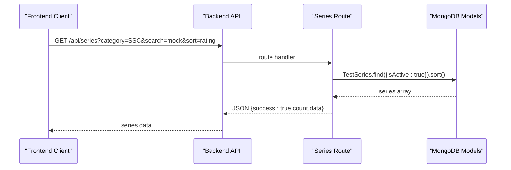
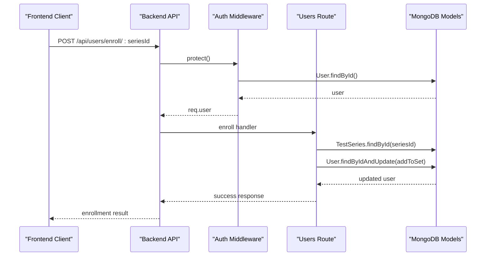
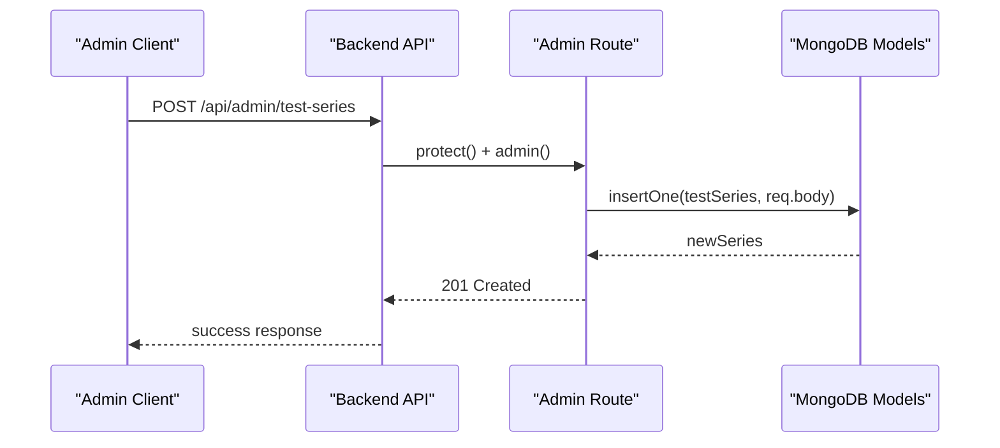
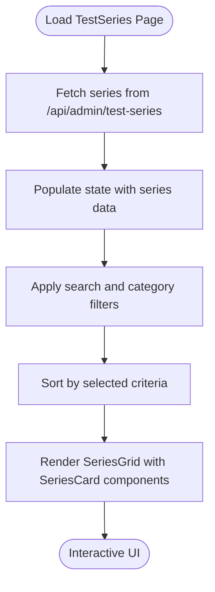
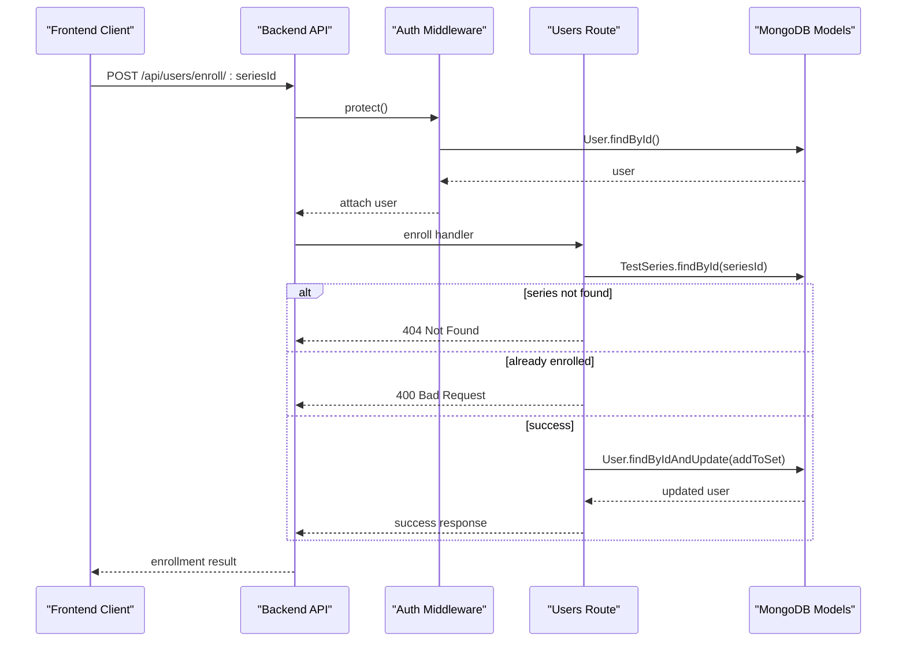
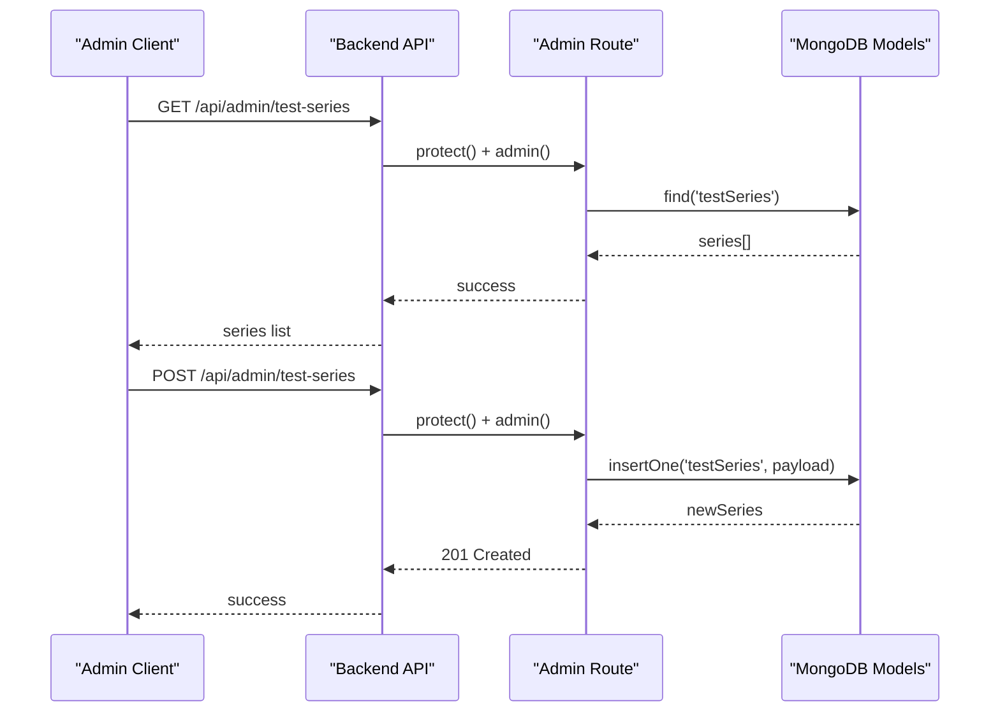
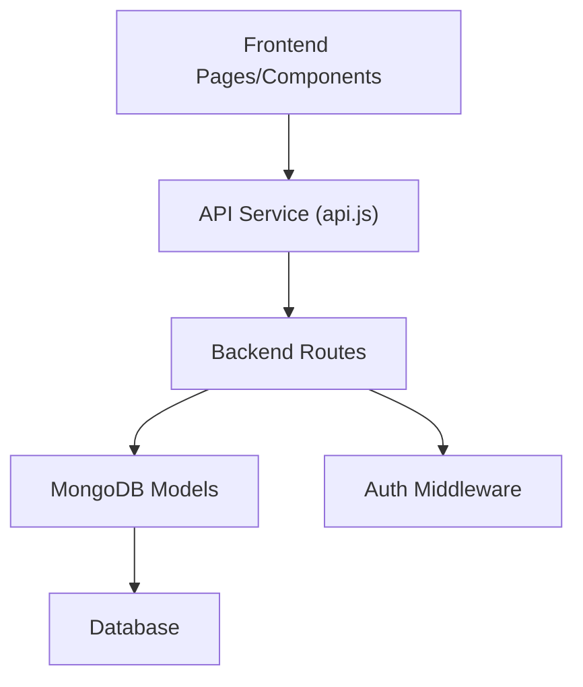

# Test Series Management

<cite>
**Referenced Files in This Document**
- [TestSeries.js](file://Backend/src/models/TestSeries.js)
- [Test.js](file://Backend/src/models/Test.js)
- [User.js](file://Backend/src/models/User.js)
- [series.js](file://Backend/src/routes/series.js)
- [users.js](file://Backend/src/routes/users.js)
- [auth.js](file://Backend/src/middleware/auth.js)
- [admin.js](file://Backend/src/routes/admin.js)
- [db.json](file://Backend/data/db.json)
- [TestSeries.jsx](file://Frontend/src/pages/TestSeries.jsx)
- [TestSeriesCard.jsx](file://Frontend/src/components/test/TestSeriesCard.jsx)
- [TestSeriesManager.jsx](file://Frontend/src/pages/admin/TestSeriesManager.jsx)
- [api.js](file://Frontend/src/services/api.js)
</cite>

## Table of Contents
1. [Introduction](#introduction)
2. [Project Structure](#project-structure)
3. [Core Components](#core-components)
4. [Architecture Overview](#architecture-overview)
5. [Detailed Component Analysis](#detailed-component-analysis)
6. [Dependency Analysis](#dependency-analysis)
7. [Performance Considerations](#performance-considerations)
8. [Troubleshooting Guide](#troubleshooting-guide)
9. [Conclusion](#conclusion)

## Introduction
This document provides comprehensive documentation for the test series management system. It covers the complete test series browsing interface, category-based filtering, search functionality, pagination, the test series card component with enrollment status indicators and progress tracking, the enrollment process including user role validation and access activation, and the admin test series management interface for creating, editing, and organizing test series. It also documents the backend API endpoints for test series CRUD operations, the database schema design with relationships to tests and questions, and the frontend components for series display and management.

## Project Structure
The system consists of two primary parts:
- Backend: Express server with MongoDB models, routes, and middleware for authentication and authorization.
- Frontend: React application with pages and components for displaying and managing test series.

**Diagram sources**
- [series.js](file://Backend/src/routes/series.js#L1-L162)
- [users.js](file://Backend/src/routes/users.js#L1-L150)
- [admin.js](file://Backend/src/routes/admin.js#L1-L557)
- [TestSeries.js](file://Backend/src/models/TestSeries.js#L1-L71)
- [Test.js](file://Backend/src/models/Test.js#L1-L77)
- [User.js](file://Backend/src/models/User.js#L1-L81)
- [TestSeries.jsx](file://Frontend/src/pages/TestSeries.jsx#L1-L427)
- [TestSeriesCard.jsx](file://Frontend/src/components/test/TestSeriesCard.jsx#L1-L109)
- [TestSeriesManager.jsx](file://Frontend/src/pages/admin/TestSeriesManager.jsx#L1-L424)
- [api.js](file://Frontend/src/services/api.js#L1-L92)

**Section sources**
- [series.js](file://Backend/src/routes/series.js#L1-L162)
- [users.js](file://Backend/src/routes/users.js#L1-L150)
- [admin.js](file://Backend/src/routes/admin.js#L1-L557)
- [TestSeries.js](file://Backend/src/models/TestSeries.js#L1-L71)
- [Test.js](file://Backend/src/models/Test.js#L1-L77)
- [User.js](file://Backend/src/models/User.js#L1-L81)
- [TestSeries.jsx](file://Frontend/src/pages/TestSeries.jsx#L1-L427)
- [TestSeriesCard.jsx](file://Frontend/src/components/test/TestSeriesCard.jsx#L1-L109)
- [TestSeriesManager.jsx](file://Frontend/src/pages/admin/TestSeriesManager.jsx#L1-L424)
- [api.js](file://Frontend/src/services/api.js#L1-L92)

## Core Components
- Backend Models:
  - TestSeries: Defines the schema for test series with category, tags, ratings, and activity metrics.
  - Test: Defines the schema for individual tests linked to a series with category and type.
  - User: Manages user profiles, enrolled series, and progress tracking.
- Backend Routes:
  - Series routes: Public endpoints for browsing series, filtering by category, searching by title, and retrieving series details with enrollment status.
  - Users routes: Enrollment endpoint and user profile retrieval.
  - Admin routes: CRUD operations for test series management.
- Frontend Pages and Components:
  - TestSeries page: Browsing interface with search, category filtering, sorting, and horizontal scrolling for enrolled/recent series.
  - TestSeriesCard component: Displays series metadata, enrollment badges, and progress indicators.
  - TestSeriesManager page: Admin interface for creating, editing, and organizing test series.

**Section sources**
- [TestSeries.js](file://Backend/src/models/TestSeries.js#L1-L71)
- [Test.js](file://Backend/src/models/Test.js#L1-L77)
- [User.js](file://Backend/src/models/User.js#L1-L81)
- [series.js](file://Backend/src/routes/series.js#L1-L162)
- [users.js](file://Backend/src/routes/users.js#L1-L150)
- [admin.js](file://Backend/src/routes/admin.js#L31-L72)
- [TestSeries.jsx](file://Frontend/src/pages/TestSeries.jsx#L1-L427)
- [TestSeriesCard.jsx](file://Frontend/src/components/test/TestSeriesCard.jsx#L1-L109)
- [TestSeriesManager.jsx](file://Frontend/src/pages/admin/TestSeriesManager.jsx#L1-L424)

## Architecture Overview
The system follows a client-server architecture:
- Frontend (React) communicates with the backend via RESTful API endpoints.
- Backend uses Express with MongoDB models and middleware for authentication and authorization.
- Admin endpoints require admin privileges, while public endpoints are accessible to all users.

**Diagram sources**
- [series.js](file://Backend/src/routes/series.js#L8-L53)
- [users.js](file://Backend/src/routes/users.js#L53-L95)
- [auth.js](file://Backend/src/middleware/auth.js#L5-L44)
- [TestSeries.js](file://Backend/src/models/TestSeries.js#L1-L71)
- [User.js](file://Backend/src/models/User.js#L1-L81)

## Detailed Component Analysis

### Backend Models and Schema Design
- TestSeries model defines fields for slug, title, category, description, image/icon, counts (totalTests, freeTests), user engagement metrics (activeUsers, rating), tags, test types, and publication status. Indexes are created for category and isActive for efficient querying.
- Test model defines fields for series linkage, slug, title, category, subCategory, type (Free/Pro), questions count, duration, marks, negative marking, tags, live scheduling flags, and publication status. Compound unique index ensures uniqueness of seriesId + slug.
- User model includes profile fields, admin flag, Pro pass status and expiry, enrolled series array referencing TestSeries, and attempted tests map for progress tracking.

**Diagram sources**
- [TestSeries.js](file://Backend/src/models/TestSeries.js#L3-L67)
- [Test.js](file://Backend/src/models/Test.js#L3-L74)
- [User.js](file://Backend/src/models/User.js#L4-L52)

**Section sources**
- [TestSeries.js](file://Backend/src/models/TestSeries.js#L1-L71)
- [Test.js](file://Backend/src/models/Test.js#L1-L77)
- [User.js](file://Backend/src/models/User.js#L1-L81)

### Backend API Endpoints

#### Series Endpoints
- GET /api/series: Public endpoint to retrieve all active test series with optional category and search filters and sorting options (popular, rating, tests, newest).
- GET /api/series/:slug: Public endpoint to retrieve a single series by slug with optional enrollment status for authenticated users.
- GET /api/series/:slug/tests: Public endpoint to retrieve tests within a series with category, subCategory, and type filters.
- GET /api/series/category/:category: Public endpoint to retrieve series by category with popularity sorting.

**Diagram sources**
- [series.js](file://Backend/src/routes/series.js#L8-L53)

**Section sources**
- [series.js](file://Backend/src/routes/series.js#L8-L162)

#### Users Endpoints
- POST /api/users/enroll/:seriesId: Private endpoint to enroll a user in a test series after validating series existence and preventing duplicate enrollment.
- GET /api/users/enrolled-series: Private endpoint to retrieve a user's enrolled series with population.
- GET /api/users/profile: Private endpoint to retrieve user profile with enrolled series populated.

**Diagram sources**
- [users.js](file://Backend/src/routes/users.js#L53-L95)
- [auth.js](file://Backend/src/middleware/auth.js#L5-L44)

**Section sources**
- [users.js](file://Backend/src/routes/users.js#L53-L115)
- [auth.js](file://Backend/src/middleware/auth.js#L5-L92)

#### Admin Endpoints
- GET /api/admin/test-series: Admin-only endpoint to retrieve all test series.
- POST /api/admin/test-series: Admin-only endpoint to create a new test series.
- PUT /api/admin/test-series/:id: Admin-only endpoint to update a test series.
- DELETE /api/admin/test-series/:id: Admin-only endpoint to delete a test series.

**Diagram sources**
- [admin.js](file://Backend/src/routes/admin.js#L31-L72)
- [auth.js](file://Backend/src/middleware/auth.js#L68-L92)

**Section sources**
- [admin.js](file://Backend/src/routes/admin.js#L31-L72)
- [auth.js](file://Backend/src/middleware/auth.js#L68-L92)

### Frontend Components and Pages

#### TestSeries Page
- Provides a comprehensive browsing interface with:
  - Search by title and category.
  - Category filter buttons for SSC, Railway, Banking, and UPSC.
  - Sorting options (Most Popular, Highest Rated, Most Tests).
  - Horizontal scrolling sections for recent and enrolled series.
  - Series cards with metadata, enrollment badges, and progress indicators.
  - Auto-refresh and manual refresh capabilities.

**Diagram sources**
- [TestSeries.jsx](file://Frontend/src/pages/TestSeries.jsx#L23-L104)

**Section sources**
- [TestSeries.jsx](file://Frontend/src/pages/TestSeries.jsx#L1-L427)

#### TestSeriesCard Component
- Displays series metadata including category, total tests, free tests, rating, and user count.
- Shows enrollment badge for enrolled series and optional progress bar when requested.
- Provides navigation to the series detail page.

**Section sources**
- [TestSeriesCard.jsx](file://Frontend/src/components/test/TestSeriesCard.jsx#L1-L109)

#### TestSeriesManager Page (Admin)
- Admin interface for managing test series:
  - List view with editable columns (Title, Category, Tests, Price, Status).
  - Form modal for adding/editing series with auto-generated slug and validation.
  - Action buttons for edit and delete operations.
  - Real-time updates after CRUD operations.

**Section sources**
- [TestSeriesManager.jsx](file://Frontend/src/pages/admin/TestSeriesManager.jsx#L1-L424)

### Enrollment Process
The enrollment process validates user identity, checks series existence, prevents duplicate enrollment, and updates user records with the enrolled series.

**Diagram sources**
- [users.js](file://Backend/src/routes/users.js#L53-L95)
- [auth.js](file://Backend/src/middleware/auth.js#L5-L44)

**Section sources**
- [users.js](file://Backend/src/routes/users.js#L53-L95)
- [auth.js](file://Backend/src/middleware/auth.js#L5-L92)

### Admin Test Series Management
Admins can create, edit, and organize test series through the TestSeriesManager page. The page integrates with backend admin endpoints to perform CRUD operations and maintains real-time synchronization of the series list.

**Diagram sources**
- [admin.js](file://Backend/src/routes/admin.js#L31-L72)
- [auth.js](file://Backend/src/middleware/auth.js#L68-L92)

**Section sources**
- [admin.js](file://Backend/src/routes/admin.js#L31-L72)
- [auth.js](file://Backend/src/middleware/auth.js#L68-L92)

## Dependency Analysis
The system exhibits clear separation of concerns:
- Frontend depends on the API service for all backend communication.
- Backend routes depend on models for data access and middleware for authentication.
- Models define relationships and constraints enforced at the database level.

**Diagram sources**
- [api.js](file://Frontend/src/services/api.js#L1-L92)
- [series.js](file://Backend/src/routes/series.js#L1-L162)
- [users.js](file://Backend/src/routes/users.js#L1-L150)
- [admin.js](file://Backend/src/routes/admin.js#L1-L557)
- [auth.js](file://Backend/src/middleware/auth.js#L1-L92)
- [TestSeries.js](file://Backend/src/models/TestSeries.js#L1-L71)
- [Test.js](file://Backend/src/models/Test.js#L1-L77)
- [User.js](file://Backend/src/models/User.js#L1-L81)

**Section sources**
- [api.js](file://Frontend/src/services/api.js#L1-L92)
- [series.js](file://Backend/src/routes/series.js#L1-L162)
- [users.js](file://Backend/src/routes/users.js#L1-L150)
- [admin.js](file://Backend/src/routes/admin.js#L1-L557)
- [auth.js](file://Backend/src/middleware/auth.js#L1-L92)
- [TestSeries.js](file://Backend/src/models/TestSeries.js#L1-L71)
- [Test.js](file://Backend/src/models/Test.js#L1-L77)
- [User.js](file://Backend/src/models/User.js#L1-L81)

## Performance Considerations
- Indexing: Category and isActive fields in TestSeries and compound indices in Test improve query performance for filtering and sorting.
- Pagination: The current frontend implementation does not implement server-side pagination; consider implementing limit/skip or cursor-based pagination for large datasets.
- Caching: Implement caching strategies for frequently accessed series lists and static metadata to reduce database load.
- Network Efficiency: Consolidate requests where possible and leverage browser caching for static assets.

## Troubleshooting Guide
- Authentication failures: Ensure the Authorization header contains a valid Bearer token; verify token verification and user population in middleware.
- Enrollment errors: Check series existence, prevent duplicate enrollment, and confirm user authentication before enrollment.
- Admin access denied: Verify admin role and proper middleware protection for admin routes.
- Data inconsistencies: Validate frontend forms and backend validations; ensure slug uniqueness and required field presence.

**Section sources**
- [auth.js](file://Backend/src/middleware/auth.js#L5-L92)
- [users.js](file://Backend/src/routes/users.js#L53-L95)
- [admin.js](file://Backend/src/routes/admin.js#L8-L10)

## Conclusion
The test series management system provides a robust foundation for browsing, enrolling, and administering test series. The frontend offers an intuitive user experience with search, filtering, and progress visualization, while the backend ensures secure and scalable data management with proper authentication and authorization. Future enhancements should focus on pagination, caching, and improved admin workflows to further optimize performance and usability.

*Last Updated: March 10, 2026 | Update date is (20:16)*
