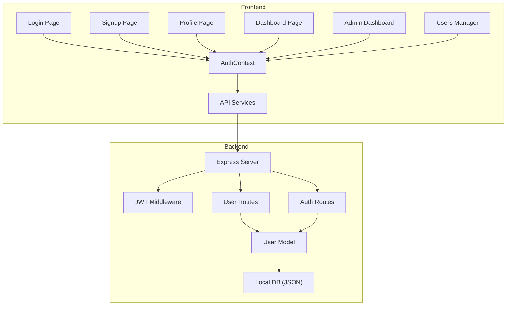
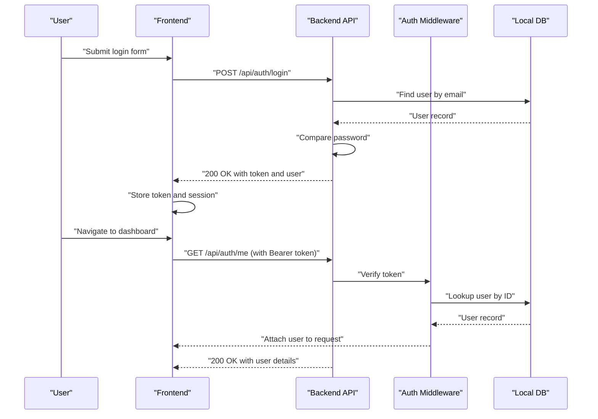
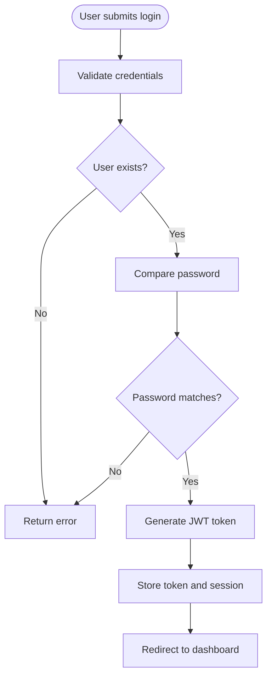
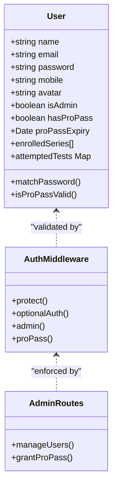
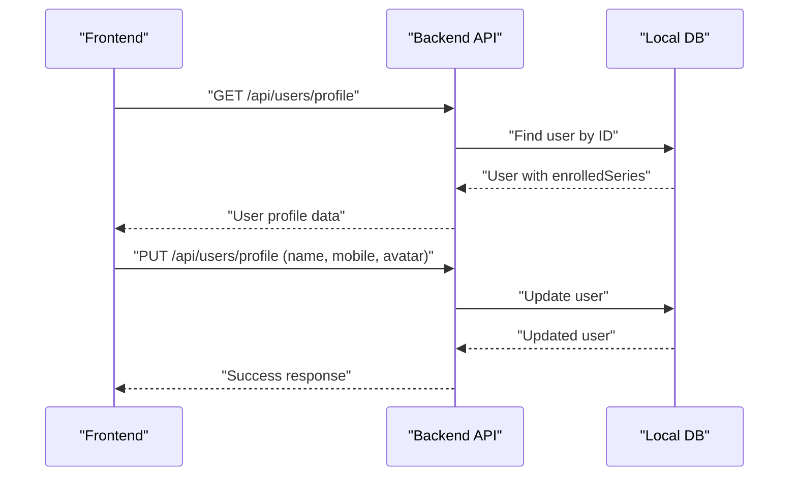
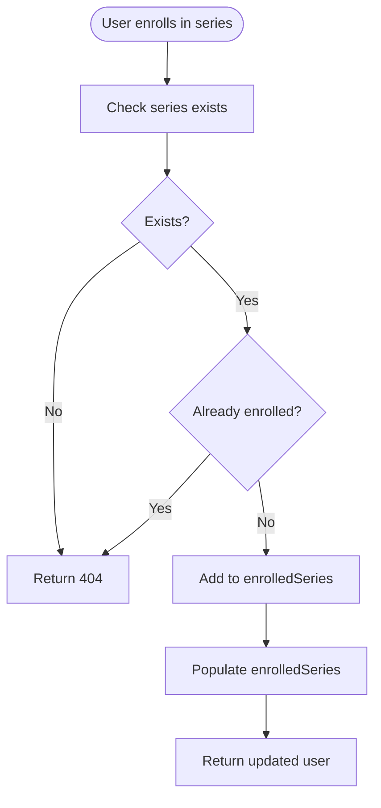
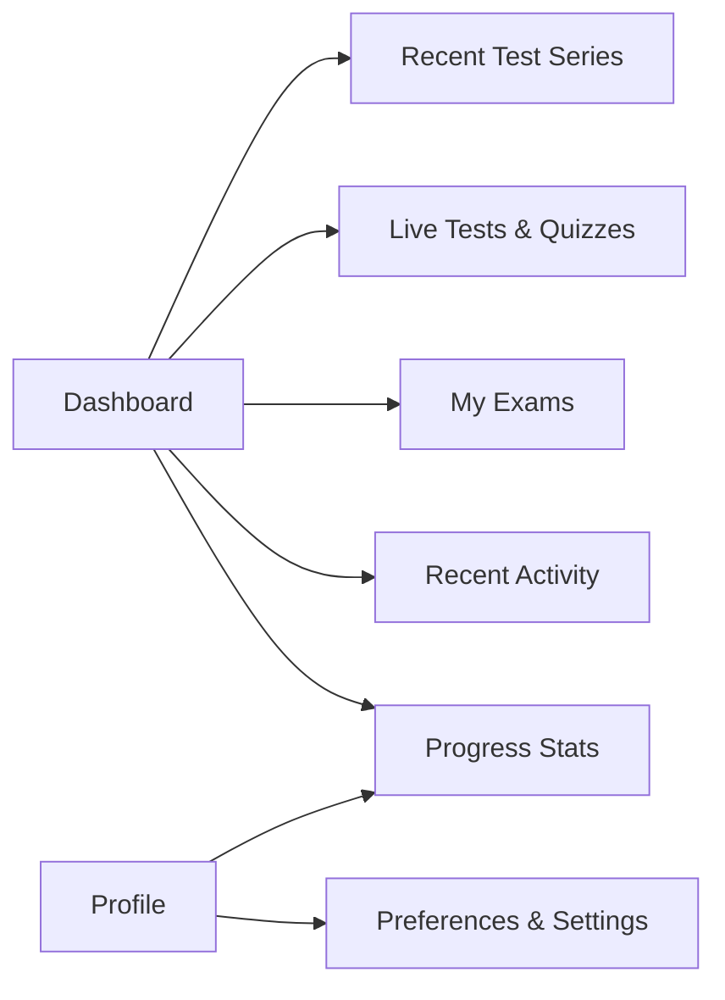
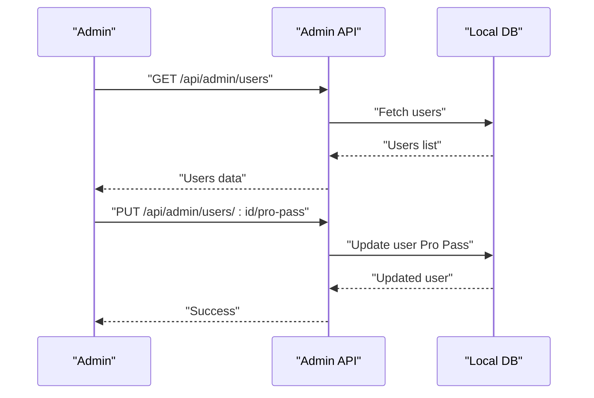
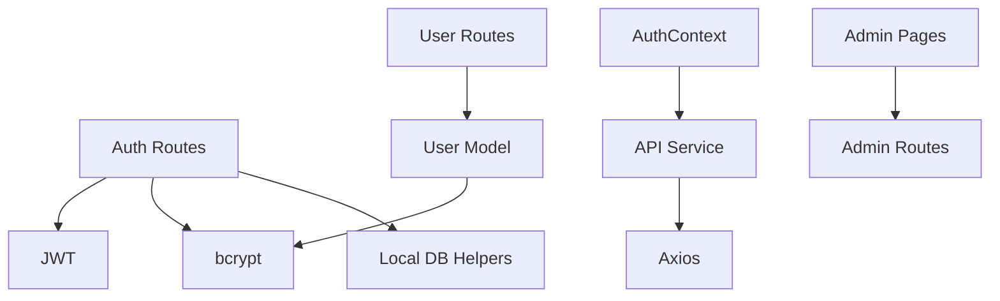

# User Management

<cite>
**Referenced Files in This Document**
- [User.js](file://Backend/src/models/User.js)
- [auth.js](file://Backend/src/routes/auth.js)
- [users.js](file://Backend/src/routes/users.js)
- [auth.js](file://Backend/src/middleware/auth.js)
- [localDB.js](file://Backend/src/db/localDB.js)
- [AuthContext.jsx](file://Frontend/src/context/AuthContext.jsx)
- [Login.jsx](file://Frontend/src/pages/Login.jsx)
- [Signup.jsx](file://Frontend/src/pages/Signup.jsx)
- [Profile.jsx](file://Frontend/src/pages/Profile.jsx)
- [Dashboard.jsx](file://Frontend/src/pages/Dashboard.jsx)
- [api.js](file://Frontend/src/services/api.js)
- [UsersManager.jsx](file://Frontend/src/pages/admin/UsersManager.jsx)
- [AdminDashboard.jsx](file://Frontend/src/pages/admin/AdminDashboard.jsx)
- [admin.js](file://Backend/src/routes/admin.js)
- [db.json](file://Backend/data/db.json)
</cite>

## Table of Contents
1. [Introduction](#introduction)
2. [Project Structure](#project-structure)
3. [Core Components](#core-components)
4. [Architecture Overview](#architecture-overview)
5. [Detailed Component Analysis](#detailed-component-analysis)
6. [Dependency Analysis](#dependency-analysis)
7. [Performance Considerations](#performance-considerations)
8. [Troubleshooting Guide](#troubleshooting-guide)
9. [Conclusion](#conclusion)

## Introduction
This document provides comprehensive documentation for Trstprep V2's user management system. It covers the entire user lifecycle including registration, login/logout, profile management, role-based access control (Free/Pro/Admin), session management with JWT tokens, and user preferences. It also explains the authentication flow, password security measures, email verification process, user data protection, dashboard functionality, user role hierarchies, permissions, API endpoints, frontend components, and security considerations.

## Project Structure
The user management system spans both backend and frontend:
- Backend: Express server with JWT-based authentication, user model, middleware, and routes for auth and user operations.
- Frontend: React application with an authentication context, login/signup forms, profile management, dashboard, and admin tools.

**Diagram sources**
- [auth.js](file://Backend/src/routes/auth.js#L1-L174)
- [users.js](file://Backend/src/routes/users.js#L1-L150)
- [User.js](file://Backend/src/models/User.js#L1-L81)
- [localDB.js](file://Backend/src/db/localDB.js#L1-L221)
- [AuthContext.jsx](file://Frontend/src/context/AuthContext.jsx#L1-L203)
- [api.js](file://Frontend/src/services/api.js#L1-L92)

**Section sources**
- [auth.js](file://Backend/src/routes/auth.js#L1-L174)
- [users.js](file://Backend/src/routes/users.js#L1-L150)
- [User.js](file://Backend/src/models/User.js#L1-L81)
- [localDB.js](file://Backend/src/db/localDB.js#L1-L221)
- [AuthContext.jsx](file://Frontend/src/context/AuthContext.jsx#L1-L203)
- [api.js](file://Frontend/src/services/api.js#L1-L92)

## Core Components
- Authentication middleware validates JWT tokens and attaches user context to requests.
- Auth routes handle registration, login, logout, and fetching current user details.
- User routes manage profile updates, enrollment in test series, and analytics.
- User model defines schema, password hashing, and Pro Pass validation.
- Frontend AuthContext manages session state, persists tokens, and exposes user actions.
- API service centralizes HTTP calls and handles token injection and error handling.
- Admin routes and pages enable administrators to manage users and grant Pro Pass.

Key capabilities:
- Registration with password hashing and initial role assignment.
- Login with JWT token generation and session persistence.
- Profile management with name, mobile, avatar updates.
- Enrollment in test series with duplicate prevention.
- Analytics endpoint for performance insights.
- Admin tools to grant/revoke Pro Pass and manage users.

**Section sources**
- [auth.js](file://Backend/src/routes/auth.js#L16-L171)
- [users.js](file://Backend/src/routes/users.js#L8-L147)
- [User.js](file://Backend/src/models/User.js#L4-L77)
- [AuthContext.jsx](file://Frontend/src/context/AuthContext.jsx#L43-L147)
- [api.js](file://Frontend/src/services/api.js#L47-L81)
- [admin.js](file://Backend/src/routes/admin.js#L213-L240)

## Architecture Overview
The system uses JWT for stateless authentication. On successful login, the backend generates a signed token containing the user ID. The frontend stores the token and user session, sending the token in Authorization headers for protected routes.

**Diagram sources**
- [auth.js](file://Backend/src/routes/auth.js#L73-L124)
- [auth.js](file://Backend/src/middleware/auth.js#L5-L44)
- [localDB.js](file://Backend/src/db/localDB.js#L105-L116)
- [AuthContext.jsx](file://Frontend/src/context/AuthContext.jsx#L43-L98)
- [api.js](file://Frontend/src/services/api.js#L12-L24)

## Detailed Component Analysis

### Authentication Flow and JWT Session Management
- Registration hashes passwords and creates a user with role and initial Pro Pass state.
- Login verifies credentials, generates a JWT token, and returns user data.
- Auth middleware extracts Bearer token, verifies it, and attaches user to request.
- Frontend stores token and session; API interceptor injects Authorization header automatically.
- Logout removes stored tokens and session from client storage.

**Diagram sources**
- [auth.js](file://Backend/src/routes/auth.js#L73-L124)
- [auth.js](file://Backend/src/middleware/auth.js#L5-L44)
- [AuthContext.jsx](file://Frontend/src/context/AuthContext.jsx#L43-L98)

**Section sources**
- [auth.js](file://Backend/src/routes/auth.js#L16-L171)
- [auth.js](file://Backend/src/middleware/auth.js#L1-L92)
- [AuthContext.jsx](file://Frontend/src/context/AuthContext.jsx#L13-L98)
- [api.js](file://Frontend/src/services/api.js#L12-L24)

### Password Security and Data Protection
- Passwords are hashed using bcrypt before storage.
- User schema excludes password field by default from queries.
- JWT secret is loaded from environment variables; token expiration configured via environment variable.
- Frontend stores tokens in secure client-side storage and clears on logout.
- Admin-only routes enforce role-based access.

Security measures:
- Password hashing with salt.
- Token-based session management.
- Role-based middleware enforcement.
- Client-side token removal on logout.

**Section sources**
- [User.js](file://Backend/src/models/User.js#L57-L70)
- [auth.js](file://Backend/src/routes/auth.js#L9-L14)
- [auth.js](file://Backend/src/middleware/auth.js#L68-L90)
- [AuthContext.jsx](file://Frontend/src/context/AuthContext.jsx#L141-L147)

### User Roles, Permissions, and Access Control
Role hierarchy:
- Free user: Standard access, limited features.
- Pro user: Enhanced access with Pro Pass benefits.
- Admin: Full administrative privileges.

Permission enforcement:
- Admin middleware restricts routes to admin users.
- Pro Pass middleware restricts resources to Pro users.
- Optional auth middleware attaches user context when present.

**Diagram sources**
- [User.js](file://Backend/src/models/User.js#L4-L77)
- [auth.js](file://Backend/src/middleware/auth.js#L68-L90)
- [admin.js](file://Backend/src/routes/admin.js#L213-L240)

**Section sources**
- [User.js](file://Backend/src/models/User.js#L33-L47)
- [auth.js](file://Backend/src/middleware/auth.js#L68-L90)
- [admin.js](file://Backend/src/routes/admin.js#L213-L240)

### Profile Management and Preferences
- Profile retrieval and updates support name, mobile, and avatar.
- Frontend profile page displays stats, allows editing, toggles navigation modes, and supports logout.
- Preferences include dark mode, navigation layout, and notification settings persisted in local storage.

**Diagram sources**
- [users.js](file://Backend/src/routes/users.js#L8-L51)
- [localDB.js](file://Backend/src/db/localDB.js#L105-L116)
- [Profile.jsx](file://Frontend/src/pages/Profile.jsx#L11-L60)

**Section sources**
- [users.js](file://Backend/src/routes/users.js#L8-L51)
- [Profile.jsx](file://Frontend/src/pages/Profile.jsx#L11-L252)

### Enrollment in Test Series and Analytics
- Users can enroll in test series; duplicates are prevented.
- Enrolled series are populated and returned with profile.
- Analytics endpoint returns performance metrics (placeholder implementation).

**Diagram sources**
- [users.js](file://Backend/src/routes/users.js#L53-L95)
- [localDB.js](file://Backend/src/db/localDB.js#L118-L132)

**Section sources**
- [users.js](file://Backend/src/routes/users.js#L53-L115)

### Dashboard Functionality and User Progress
- Dashboard displays recent test series, live tests/quizzes, enrolled exams, recent activity, and progress stats.
- Integrates with data service to fetch test series and render suggested series.
- Profile page aggregates user statistics and preferences.

**Diagram sources**
- [Dashboard.jsx](file://Frontend/src/pages/Dashboard.jsx#L54-L327)
- [Profile.jsx](file://Frontend/src/pages/Profile.jsx#L11-L252)

**Section sources**
- [Dashboard.jsx](file://Frontend/src/pages/Dashboard.jsx#L1-L330)
- [Profile.jsx](file://Frontend/src/pages/Profile.jsx#L1-L252)

### Admin Tools for User Management
- Admin dashboard shows platform statistics and quick actions.
- Users manager lists users, filters by name/email, and toggles Pro Pass status.
- Admin routes expose user listing and Pro Pass updates.

**Diagram sources**
- [admin.js](file://Backend/src/routes/admin.js#L213-L240)
- [UsersManager.jsx](file://Frontend/src/pages/admin/UsersManager.jsx#L13-L58)
- [AdminDashboard.jsx](file://Frontend/src/pages/admin/AdminDashboard.jsx#L16-L33)

**Section sources**
- [admin.js](file://Backend/src/routes/admin.js#L213-L240)
- [UsersManager.jsx](file://Frontend/src/pages/admin/UsersManager.jsx#L1-L188)
- [AdminDashboard.jsx](file://Frontend/src/pages/admin/AdminDashboard.jsx#L1-L182)

## Dependency Analysis
- Backend depends on JWT for token verification and bcrypt for password hashing.
- Auth routes depend on local DB helpers for user lookup and creation.
- User routes depend on Mongoose model for population and updates.
- Frontend AuthContext depends on API service for HTTP calls.
- Admin pages depend on admin routes for stats and user management.

**Diagram sources**
- [auth.js](file://Backend/src/routes/auth.js#L1-L174)
- [User.js](file://Backend/src/models/User.js#L1-L81)
- [localDB.js](file://Backend/src/db/localDB.js#L1-L221)
- [api.js](file://Frontend/src/services/api.js#L1-L92)
- [AuthContext.jsx](file://Frontend/src/context/AuthContext.jsx#L1-L203)
- [admin.js](file://Backend/src/routes/admin.js#L1-L557)

**Section sources**
- [auth.js](file://Backend/src/routes/auth.js#L1-L174)
- [User.js](file://Backend/src/models/User.js#L1-L81)
- [localDB.js](file://Backend/src/db/localDB.js#L1-L221)
- [api.js](file://Frontend/src/services/api.js#L1-L92)
- [AuthContext.jsx](file://Frontend/src/context/AuthContext.jsx#L1-L203)
- [admin.js](file://Backend/src/routes/admin.js#L1-L557)

## Performance Considerations
- Token verification is lightweight; avoid unnecessary re-authentication by caching user context in memory during the request lifecycle.
- Use pagination for admin user listings and analytics to reduce payload sizes.
- Minimize database reads by batching operations and leveraging populated fields judiciously.
- Consider rate limiting login attempts to prevent brute force attacks.

## Troubleshooting Guide
Common issues and resolutions:
- Invalid token or unauthorized access: Ensure Authorization header includes a valid Bearer token and verify JWT_SECRET environment variable.
- User not found after login: Confirm user exists in the local DB and that the token ID matches an existing user.
- Password mismatch: Verify bcrypt comparison and ensure password hashing occurs on the backend.
- Admin access denied: Confirm user role is admin and that admin middleware is applied to routes.
- Frontend logout not clearing session: Ensure client-side removal of trstprep_session and trstprep_token on logout.

**Section sources**
- [auth.js](file://Backend/src/middleware/auth.js#L14-L43)
- [AuthContext.jsx](file://Frontend/src/context/AuthContext.jsx#L141-L147)
- [User.js](file://Backend/src/models/User.js#L57-L70)
- [admin.js](file://Backend/src/routes/admin.js#L68-L78)

## Conclusion
Trstprep V2’s user management system provides a robust foundation for user lifecycle management, secure authentication, and role-based access control. The combination of JWT-based sessions, bcrypt-secured passwords, and clear separation of concerns across backend and frontend enables scalable growth. Administrators can efficiently manage users and Pro Pass entitlements, while end users benefit from a streamlined dashboard and profile management experience.

*Last Updated: March 10, 2026 | Update date is (20:16)*
