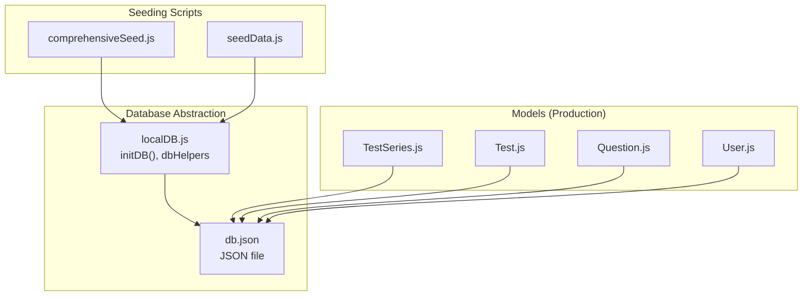
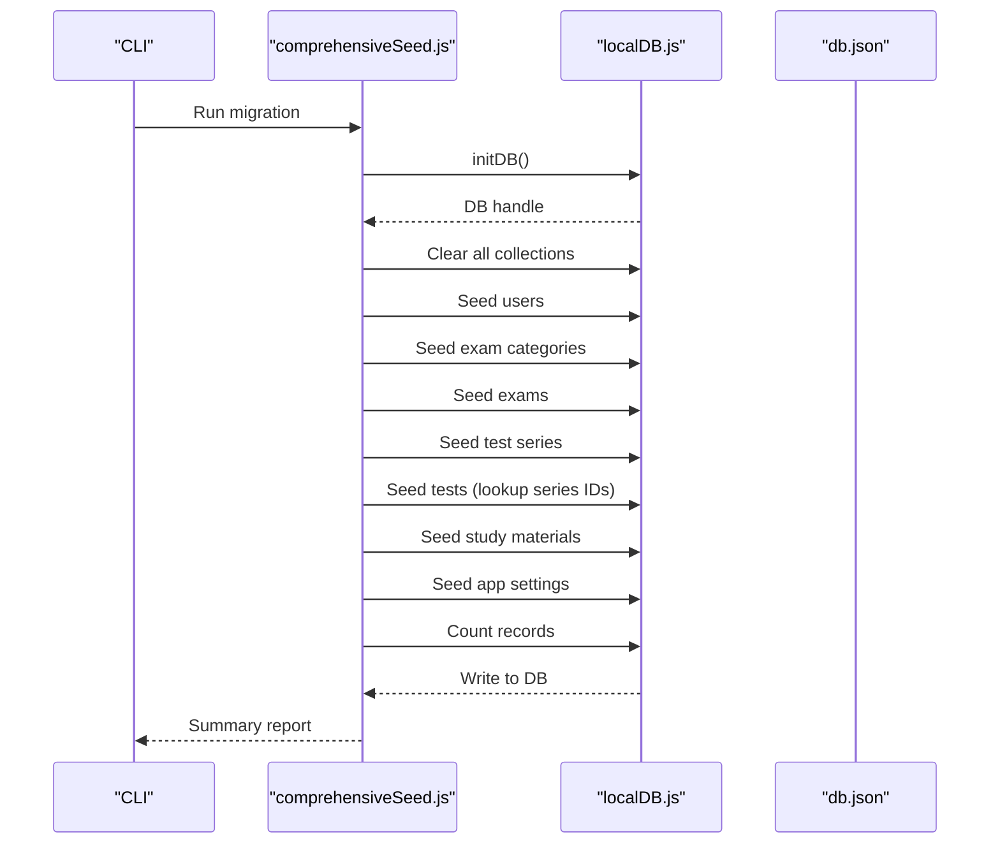
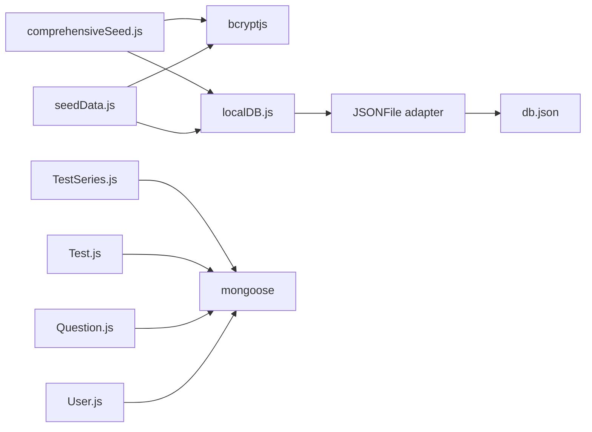

# Data Seeding and Migration

<cite>
**Referenced Files in This Document**
- [comprehensiveSeed.js](file://Backend/src/seed/comprehensiveSeed.js)
- [seedData.js](file://Backend/src/seed/seedData.js)
- [localDB.js](file://Backend/src/db/localDB.js)
- [db.json](file://Backend/data/db.json)
- [TestSeries.js](file://Backend/src/models/TestSeries.js)
- [Test.js](file://Backend/src/models/Test.js)
- [Question.js](file://Backend/src/models/Question.js)
- [User.js](file://Backend/src/models/User.js)
- [DATABASE.md](file://Documentation/DATABASE.md)
- [MIGRATION_COMPLETE.md](file://Documentation/MIGRATION_COMPLETE.md)
- [package.json](file://Backend/package.json)
</cite>

## Table of Contents
1. [Introduction](#introduction)
2. [Project Structure](#project-structure)
3. [Core Components](#core-components)
4. [Architecture Overview](#architecture-overview)
5. [Detailed Component Analysis](#detailed-component-analysis)
6. [Dependency Analysis](#dependency-analysis)
7. [Performance Considerations](#performance-considerations)
8. [Troubleshooting Guide](#troubleshooting-guide)
9. [Conclusion](#conclusion)
10. [Appendices](#appendices)

## Introduction
This document explains the data seeding and migration system used in Trstprep V2 for development and testing. It covers the seed data structure, the comprehensive migration script that moves content from hardcoded arrays into the local JSON database, the data transformation and validation rules applied during seeding, cleanup procedures for test data, and guidance for extending the seeding system to support additional content types. It also outlines migration strategies to MongoDB and maintenance practices to keep data consistent across environments.

## Project Structure
The seeding system is organized around two seed scripts and a local JSON database abstraction:
- Seed scripts: generate and populate the database with realistic test data
- Local database abstraction: provides MongoDB-like helpers for lowdb-backed JSON storage
- Data model definitions: enforce validation and relationships for production use

**Diagram sources**
- [comprehensiveSeed.js](file://Backend/src/seed/comprehensiveSeed.js#L1-L449)
- [seedData.js](file://Backend/src/seed/seedData.js#L1-L482)
- [localDB.js](file://Backend/src/db/localDB.js#L1-L222)
- [db.json](file://Backend/data/db.json#L1-L1029)
- [TestSeries.js](file://Backend/src/models/TestSeries.js#L1-L71)
- [Test.js](file://Backend/src/models/Test.js#L1-L77)
- [Question.js](file://Backend/src/models/Question.js#L1-L54)
- [User.js](file://Backend/src/models/User.js#L1-L81)

**Section sources**
- [comprehensiveSeed.js](file://Backend/src/seed/comprehensiveSeed.js#L1-L449)
- [seedData.js](file://Backend/src/seed/seedData.js#L1-L482)
- [localDB.js](file://Backend/src/db/localDB.js#L1-L222)
- [db.json](file://Backend/data/db.json#L1-L1029)
- [TestSeries.js](file://Backend/src/models/TestSeries.js#L1-L71)
- [Test.js](file://Backend/src/models/Test.js#L1-L77)
- [Question.js](file://Backend/src/models/Question.js#L1-L54)
- [User.js](file://Backend/src/models/User.js#L1-L81)

## Core Components
- comprehensiveSeed.js: Full migration script that clears the database and seeds users, exam categories, exams, test series, tests, study materials, and app settings from mock data arrays. It demonstrates hierarchical relationships and validates data shapes before insertion.
- seedData.js: Local development seed script that creates users, test series, tests, questions, exam categories, exam info, navigation menu, and tag configurations. It also shows how to build realistic datasets programmatically.
- localDB.js: Lowdb-based database abstraction that exposes find, findOne, findById, insertOne, insertMany, updateOne, updateById, deleteOne, deleteById, and count helpers. It initializes the JSON file with default collections and ensures all collections exist.
- Data models: Define validation rules and relationships for production (MongoDB) usage, including required fields, enums, defaults, and indexes.

Key capabilities:
- Hierarchical seeding: series → tests → questions
- Validation: passwords hashed, required fields enforced, enums checked
- Cleanup: clearing collections before seeding
- Reporting: summary counts after seeding

**Section sources**
- [comprehensiveSeed.js](file://Backend/src/seed/comprehensiveSeed.js#L4-L446)
- [seedData.js](file://Backend/src/seed/seedData.js#L4-L479)
- [localDB.js](file://Backend/src/db/localDB.js#L48-L219)
- [TestSeries.js](file://Backend/src/models/TestSeries.js#L3-L67)
- [Test.js](file://Backend/src/models/Test.js#L3-L73)
- [Question.js](file://Backend/src/models/Question.js#L3-L50)
- [User.js](file://Backend/src/models/User.js#L4-L77)

## Architecture Overview
The seeding pipeline transforms static arrays into structured database records while enforcing validation and relationships. The comprehensive seed migrates from mock data, while the local seed builds smaller datasets for development.

**Diagram sources**
- [comprehensiveSeed.js](file://Backend/src/seed/comprehensiveSeed.js#L4-L446)
- [localDB.js](file://Backend/src/db/localDB.js#L48-L133)
- [db.json](file://Backend/data/db.json#L1-L1029)

## Detailed Component Analysis

### comprehensiveSeed.js
Purpose:
- Perform a full migration from mock data arrays into the local database
- Establish hierarchical relationships between series, tests, and supporting data
- Demonstrate validation and cleanup procedures

Key behaviors:
- Clears all collections before seeding
- Seeds users with hashed passwords
- Seeds exam categories and exams
- Seeds test series with realistic attributes (tags, test types, ratings)
- Seeds tests with category/subcategory/type and links to series via IDs
- Seeds study materials and app settings
- Prints summary counts per collection

Validation and transformation:
- Password hashing for user accounts
- Relationship resolution: finds series IDs by slug to link tests
- Normalized attributes for tags, test types, and metadata

Cleanup:
- Iterates over all collection keys and resets arrays
- Writes changes to disk immediately after clearing

**Section sources**
- [comprehensiveSeed.js](file://Backend/src/seed/comprehensiveSeed.js#L4-L446)

### seedData.js
Purpose:
- Provide a smaller dataset for local development
- Build realistic relationships among series, tests, and questions
- Seed auxiliary structures like exam categories, exam info, navigation menu, and tag configs

Key behaviors:
- Clears selected collections (users, testSeries, tests, questions, enrollments, examCategories, examInfo, navigationMenu, tagConfigs)
- Seeds three test series with varying difficulty and pro/free flags
- Generates multiple tests per series with realistic durations, marks, and tags
- Inserts sample questions linked to the first test
- Seeds exam categories, exam info, navigation menu, and tag configurations

Validation and transformation:
- Uses helper functions to resolve series IDs by slug
- Ensures consistent types for numeric and boolean fields
- Applies defaults for optional fields

**Section sources**
- [seedData.js](file://Backend/src/seed/seedData.js#L4-L479)

### localDB.js
Purpose:
- Provide a lightweight, MongoDB-like interface over a JSON file
- Support CRUD operations and counting for development and migration

Key helpers:
- initDB(): reads JSON file, initializes with defaults if missing, ensures all collections exist
- dbHelpers.find/findOne/findById: query helpers with nested property support
- dbHelpers.insertOne/insertMany: add documents with auto-generated IDs and timestamps
- dbHelpers.updateOne/updateById/deleteOne/deleteById: modify and remove documents
- dbHelpers.count: count documents matching a query

Design notes:
- Each inserted document receives an auto-generated _id, createdAt, and updatedAt
- Ensures backward compatibility with MongoDB-style operations

**Section sources**
- [localDB.js](file://Backend/src/db/localDB.js#L48-L219)

### Data Models (Production)
These models define validation rules and relationships for MongoDB usage. They are useful references for ensuring seed data conforms to production constraints.

- TestSeries: enforces required fields (title, slug, category), enum constraints, defaults, and indexes
- Test: enforces required fields (seriesId, slug, title, category, questions, duration, marks), enum constraints, defaults, and indexes
- Question: enforces required fields (testId, questionNumber, text, options, correctOption), enum constraints, defaults, and compound unique index
- User: enforces required fields (name, email, password), validation regex for email, password hashing middleware, and helper methods

**Section sources**
- [TestSeries.js](file://Backend/src/models/TestSeries.js#L3-L67)
- [Test.js](file://Backend/src/models/Test.js#L3-L73)
- [Question.js](file://Backend/src/models/Question.js#L3-L50)
- [User.js](file://Backend/src/models/User.js#L4-L77)

### Data Transformation and Validation During Seeding
- Password hashing: bcrypt is used to hash user passwords before insertion
- Relationship resolution: tests are linked to series by finding series IDs via slug lookups
- Type normalization: numeric fields validated against minimums, enums checked, booleans set to defaults
- Timestamps: createdAt and updatedAt are populated for each inserted record
- Defaults: optional fields receive sensible defaults (e.g., isActive, type, difficulty)

**Section sources**
- [comprehensiveSeed.js](file://Backend/src/seed/comprehensiveSeed.js#L20-L219)
- [seedData.js](file://Backend/src/seed/seedData.js#L24-L177)
- [localDB.js](file://Backend/src/db/localDB.js#L120-L149)

### Cleanup Procedures for Test Data
- Full cleanup: comprehensiveSeed.js clears all collections by resetting arrays and writing to disk
- Partial cleanup: seedData.js clears specific collections used in local development
- Safe deletion: dbHelpers.deleteOne/deleteById support targeted removal when needed

**Section sources**
- [comprehensiveSeed.js](file://Backend/src/seed/comprehensiveSeed.js#L10-L16)
- [seedData.js](file://Backend/src/seed/seedData.js#L10-L21)
- [localDB.js](file://Backend/src/db/localDB.js#L187-L213)

### Examples of Custom Seed Data Creation
- Test series: define attributes like slug, title, category, tags, testTypes, rating, and isActive
- Tests: specify seriesId, slug, title, category, subCategory, type, duration, totalQuestions, totalMarks, passingMarks, difficulty, tags, and isActive
- Questions: attach to a test via testId, define question text, options, correctAnswer, marks, negativeMarks, subject, and difficulty
- Supporting data: exam categories, exams, study materials, navigation menu, and tag configurations

These examples demonstrate how to construct hierarchical datasets with realistic attributes and relationships.

**Section sources**
- [comprehensiveSeed.js](file://Backend/src/seed/comprehensiveSeed.js#L82-L394)
- [seedData.js](file://Backend/src/seed/seedData.js#L58-L324)

### Bulk Data Import Processes
- Use insertMany for inserting multiple documents efficiently
- For hierarchical imports, seed parent entities first, then child entities that depend on parent IDs
- Validate relationships by resolving foreign keys (e.g., seriesId) before insertion

**Section sources**
- [localDB.js](file://Backend/src/db/localDB.js#L135-L149)
- [seedData.js](file://Backend/src/seed/seedData.js#L108-L177)

### Migration Strategies Between Data Formats
- From mock arrays to local JSON: comprehensiveSeed.js loads arrays and writes to db.json
- From local JSON to MongoDB: follow the migration steps documented in DATABASE.md
- Maintain data consistency by validating required fields, enums, and relationships during migration

**Section sources**
- [comprehensiveSeed.js](file://Backend/src/seed/comprehensiveSeed.js#L4-L446)
- [DATABASE.md](file://Documentation/DATABASE.md#L27-L70)

### Seed Data Organization, Categories, and Content Management Workflows
- Categories: exam categories and test categories provide taxonomy for grouping
- Content hierarchy: series → tests → questions
- Navigation and tagging: navigationMenu and tagConfigs support discoverability and filtering
- Study materials: separate collection for learning resources with counts and metadata

**Section sources**
- [seedData.js](file://Backend/src/seed/seedData.js#L229-L467)
- [comprehensiveSeed.js](file://Backend/src/seed/comprehensiveSeed.js#L55-L426)

### Extending the Seeding System for Additional Content Types
Guidance:
- Add new collections to defaultData in localDB.js and ensure dbHelpers supports CRUD operations
- Define seed data arrays with realistic attributes and relationships
- Resolve foreign keys by querying existing documents (e.g., find series by slug)
- Enforce validation by mirroring production model constraints (enums, required fields, defaults)
- Keep cleanup procedures consistent across scripts

**Section sources**
- [localDB.js](file://Backend/src/db/localDB.js#L9-L44)
- [localDB.js](file://Backend/src/db/localDB.js#L82-L219)
- [seedData.js](file://Backend/src/seed/seedData.js#L108-L177)

## Dependency Analysis
The seeding system depends on:
- bcrypt for password hashing
- lowdb for local JSON persistence
- internal dbHelpers for database operations
- Production models for validation references

**Diagram sources**
- [comprehensiveSeed.js](file://Backend/src/seed/comprehensiveSeed.js#L1-L2)
- [seedData.js](file://Backend/src/seed/seedData.js#L1-L2)
- [localDB.js](file://Backend/src/db/localDB.js#L1-L4)
- [TestSeries.js](file://Backend/src/models/TestSeries.js#L1)
- [Test.js](file://Backend/src/models/Test.js#L1)
- [Question.js](file://Backend/src/models/Question.js#L1)
- [User.js](file://Backend/src/models/User.js#L1)

**Section sources**
- [package.json](file://Backend/package.json#L12-L24)
- [comprehensiveSeed.js](file://Backend/src/seed/comprehensiveSeed.js#L1-L2)
- [seedData.js](file://Backend/src/seed/seedData.js#L1-L2)
- [localDB.js](file://Backend/src/db/localDB.js#L1-L4)

## Performance Considerations
- Batch inserts: prefer insertMany for large datasets to reduce write overhead
- Minimize repeated lookups: cache resolved IDs (e.g., series IDs) to avoid repeated queries
- Avoid unnecessary writes: group updates and write once per collection after seeding
- Use indexes: production models define indexes on frequently queried fields (category, type, isActive)

[No sources needed since this section provides general guidance]

## Troubleshooting Guide
Common issues and resolutions:
- Database not initialized: ensure initDB() is called before using dbHelpers
- Missing collections: defaultData ensures all collections exist; verify db.json structure
- Duplicate slugs: ensure unique slugs for series and tests; production models enforce uniqueness
- Invalid enums: confirm category, type, difficulty values match model enums
- Password mismatches: verify bcrypt hashing and compare methods

Verification steps:
- Check db.json contents after seeding
- Confirm counts printed by seed scripts
- Validate relationships by querying series and tests by slug

**Section sources**
- [localDB.js](file://Backend/src/db/localDB.js#L48-L80)
- [TestSeries.js](file://Backend/src/models/TestSeries.js#L16-L20)
- [Test.js](file://Backend/src/models/Test.js#L19-L32)
- [Question.js](file://Backend/src/models/Question.js#L36-L40)
- [User.js](file://Backend/src/models/User.js#L11-L18)

## Conclusion
The Trstprep V2 seeding and migration system provides a robust foundation for generating realistic test data, establishing hierarchical relationships, and validating data integrity. The comprehensive seed script demonstrates end-to-end migration from mock data to the database, while the local seed script supports iterative development. With clear cleanup procedures, validation rules, and extension points, teams can maintain consistent data across environments and scale the system to additional content types.

[No sources needed since this section summarizes without analyzing specific files]

## Appendices

### Appendix A: Running the Seed Scripts
- Local development seed: run the seed script defined in package.json
- Full migration: execute the comprehensive seed script to migrate from mock data to the database

**Section sources**
- [package.json](file://Backend/package.json#L7-L11)
- [DATABASE.md](file://Documentation/DATABASE.md#L73-L77)

### Appendix B: Database Structure Reference
- Collections include users, testSeries, tests, questions, studyMaterials, examCategories, exams, appSettings, navigationMenu, and tagConfigs
- Each document includes _id, createdAt, and updatedAt fields

**Section sources**
- [localDB.js](file://Backend/src/db/localDB.js#L10-L44)
- [db.json](file://Backend/data/db.json#L1-L1029)

*Last Updated: March 10, 2026 | Update date is (20:16)*
