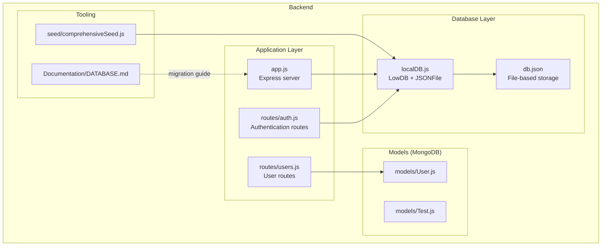
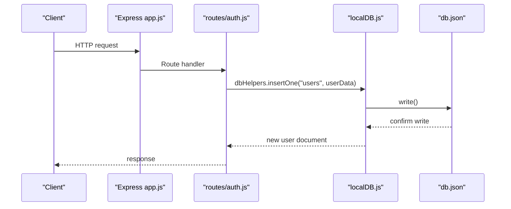
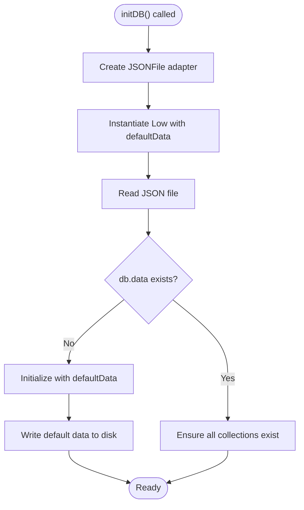
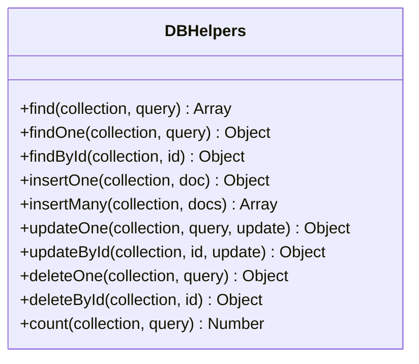
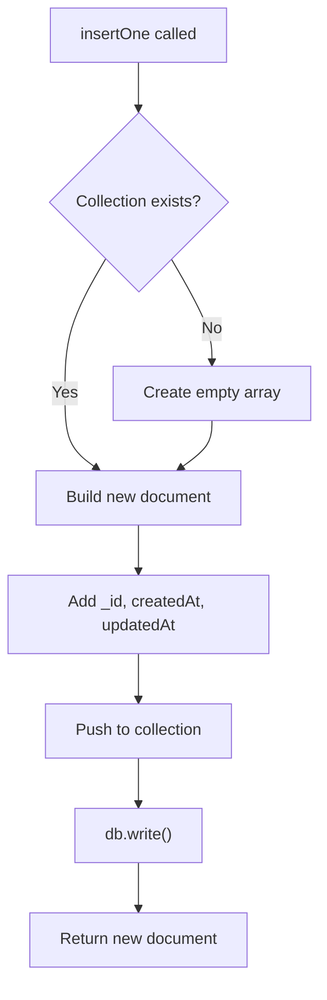
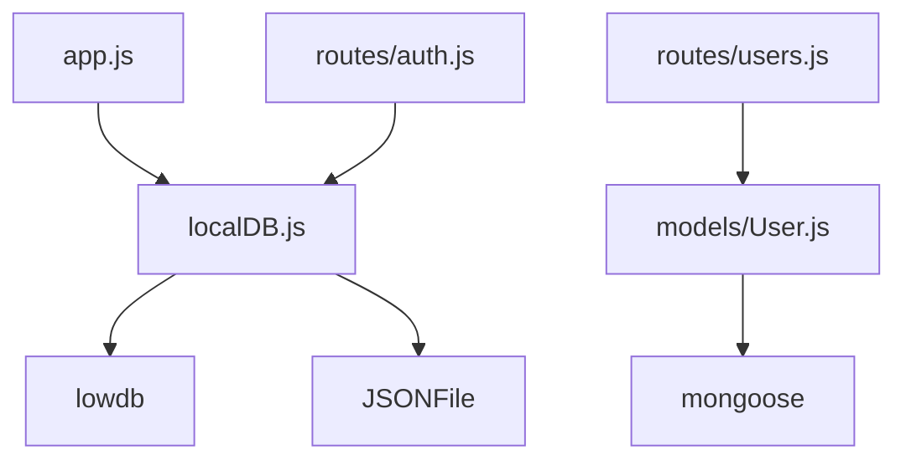

# Database Abstraction Layer

<cite>
**Referenced Files in This Document**
- [localDB.js](file://Backend/src/db/localDB.js)
- [app.js](file://Backend/src/app.js)
- [auth.js](file://Backend/src/routes/auth.js)
- [users.js](file://Backend/src/routes/users.js)
- [db.json](file://Backend/data/db.json)
- [DATABASE.md](file://Documentation/DATABASE.md)
- [comprehensiveSeed.js](file://Backend/src/seed/comprehensiveSeed.js)
- [package.json](file://Backend/package.json)
</cite>

## Table of Contents
1. [Introduction](#introduction)
2. [Project Structure](#project-structure)
3. [Core Components](#core-components)
4. [Architecture Overview](#architecture-overview)
5. [Detailed Component Analysis](#detailed-component-analysis)
6. [Dependency Analysis](#dependency-analysis)
7. [Performance Considerations](#performance-considerations)
8. [Troubleshooting Guide](#troubleshooting-guide)
9. [Conclusion](#conclusion)
10. [Appendices](#appendices)

## Introduction
This document describes the database abstraction layer in Trstprep V2, focusing on the LowDB-based local JSON storage implementation. It explains how the system provides a MongoDB-like interface for CRUD operations, automatic ID generation, and file-based persistence. It also outlines the current adapter pattern foundation that enables future migration to MongoDB and provides guidance for extending the abstraction to support additional backends.

## Project Structure
The database abstraction is implemented in a single module that encapsulates LowDB initialization, file storage, and a set of helper functions that mirror MongoDB-style operations. Routes consume these helpers to perform data operations while models define schemas for MongoDB-backed resources.

**Diagram sources**
- [localDB.js](file://Backend/src/db/localDB.js#L1-L222)
- [app.js](file://Backend/src/app.js#L1-L94)
- [auth.js](file://Backend/src/routes/auth.js#L1-L174)
- [users.js](file://Backend/src/routes/users.js#L1-L150)
- [db.json](file://Backend/data/db.json#L1-L728)
- [comprehensiveSeed.js](file://Backend/src/seed/comprehensiveSeed.js#L1-L449)
- [DATABASE.md](file://Documentation/DATABASE.md#L1-L103)

**Section sources**
- [localDB.js](file://Backend/src/db/localDB.js#L1-L222)
- [app.js](file://Backend/src/app.js#L1-L94)
- [DATABASE.md](file://Documentation/DATABASE.md#L1-L103)

## Core Components
- LowDB initialization and JSON file adapter: Creates and manages a JSON file database with default collections and ensures persistence on write operations.
- Database helpers: Provide MongoDB-like methods for find, findOne, findById, insertOne, insertMany, updateOne, updateById, deleteOne, deleteById, and count.
- Automatic ID generation: Generates unique identifiers combining timestamp and random string with createdAt/updatedAt timestamps.
- Route integration: Authentication and user routes use the helpers for local JSON storage, while user models leverage Mongoose for MongoDB-backed collections.

Key implementation references:
- Initialization and default data: [localDB.js](file://Backend/src/db/localDB.js#L48-L73)
- Helpers collection: [localDB.js](file://Backend/src/db/localDB.js#L82-L221)
- ID generation and timestamps: [localDB.js](file://Backend/src/db/localDB.js#L124-L129)
- Route usage: [auth.js](file://Backend/src/routes/auth.js#L24-L46), [users.js](file://Backend/src/routes/users.js#L13-L14)

**Section sources**
- [localDB.js](file://Backend/src/db/localDB.js#L48-L221)
- [auth.js](file://Backend/src/routes/auth.js#L19-L71)
- [users.js](file://Backend/src/routes/users.js#L11-L26)

## Architecture Overview
The system follows an adapter pattern conceptually: the application code interacts with a unified interface (dbHelpers) that internally uses LowDB for local storage. This design makes it straightforward to replace the underlying adapter with a MongoDB driver while keeping the application logic unchanged.

**Diagram sources**
- [app.js](file://Backend/src/app.js#L68-L91)
- [auth.js](file://Backend/src/routes/auth.js#L19-L71)
- [localDB.js](file://Backend/src/db/localDB.js#L119-L133)
- [db.json](file://Backend/data/db.json#L1-L728)

## Detailed Component Analysis

### LowDB Adapter and JSON Storage
The LowDB adapter provides:
- JSON file persistence via JSONFile adapter
- Default data initialization if the database is empty
- Collection existence enforcement
- Synchronous read/write operations with automatic persistence

**Diagram sources**
- [localDB.js](file://Backend/src/db/localDB.js#L48-L73)

**Section sources**
- [localDB.js](file://Backend/src/db/localDB.js#L48-L73)
- [db.json](file://Backend/data/db.json#L1-L728)

### Database Helpers: MongoDB-like Interface
The helpers implement a familiar MongoDB-style API:
- Query operations: find, findOne, findById
- Mutation operations: insertOne, insertMany, updateOne, updateById, deleteOne, deleteById
- Utility: count
- Nested property queries: dot notation support for nested fields

**Diagram sources**
- [localDB.js](file://Backend/src/db/localDB.js#L82-L221)

**Section sources**
- [localDB.js](file://Backend/src/db/localDB.js#L82-L221)

### Automatic ID Generation and Timestamps
Each inserted document receives:
- Unique identifier (_id) generated from timestamp + random string
- createdAt and updatedAt timestamps set on creation/update

**Diagram sources**
- [localDB.js](file://Backend/src/db/localDB.js#L120-L133)

**Section sources**
- [localDB.js](file://Backend/src/db/localDB.js#L120-L133)

### CRUD Examples Using Helpers
- Create: Registration uses insertOne to add a new user
- Read: Login uses find to locate a user by email; profile uses findOne to retrieve current user
- Update: Profile updates use findByIdAndUpdate (Mongoose) for MongoDB-backed users
- Delete: Not demonstrated in the provided routes

References:
- [auth.js](file://Backend/src/routes/auth.js#L19-L71)
- [users.js](file://Backend/src/routes/users.js#L11-L51)

**Section sources**
- [auth.js](file://Backend/src/routes/auth.js#L19-L171)
- [users.js](file://Backend/src/routes/users.js#L11-L149)

### Nested Property Queries
The find helper supports dot notation for nested property matching, enabling queries like `{ "settings.feature.enabled": true }`.

Implementation highlights:
- Split dot-separated keys
- Traverse nested object properties safely
- Compare leaf values with query criteria

**Section sources**
- [localDB.js](file://Backend/src/db/localDB.js#L89-L102)

### Data Transformation Methods
- Automatic ID generation and timestamps during insert
- Update timestamps on update operations
- Count helper for quick aggregation

**Section sources**
- [localDB.js](file://Backend/src/db/localDB.js#L124-L129)
- [localDB.js](file://Backend/src/db/localDB.js#L162-L163)
- [localDB.js](file://Backend/src/db/localDB.js#L215-L218)

### Database Connection Handling and Error Management
- Connection: initDB is invoked during server startup
- Persistence: All mutations trigger db.write()
- Error handling: Centralized logging and propagation; server exits on database initialization failure

**Section sources**
- [app.js](file://Backend/src/app.js#L68-L91)
- [localDB.js](file://Backend/src/db/localDB.js#L48-L73)

### Data Persistence Strategies
- File-based persistence: All writes are immediately persisted to db.json
- Atomicity: Each write operation is a separate persistence event
- Backups: Manual copy of db.json for backup

**Section sources**
- [localDB.js](file://Backend/src/db/localDB.js#L131-L132)
- [DATABASE.md](file://Documentation/DATABASE.md#L79-L89)

## Dependency Analysis
The database abstraction relies on:
- LowDB for local JSON storage
- JSONFile adapter for file I/O
- Express app for initialization and routing
- Optional MongoDB via Mongoose for models

**Diagram sources**
- [localDB.js](file://Backend/src/db/localDB.js#L1-L2)
- [app.js](file://Backend/src/app.js#L1-L94)
- [auth.js](file://Backend/src/routes/auth.js#L1-L6)
- [users.js](file://Backend/src/routes/users.js#L1-L4)
- [package.json](file://Backend/package.json#L20-L23)

**Section sources**
- [package.json](file://Backend/package.json#L12-L24)

## Performance Considerations
- Local JSON storage is suitable for development and small datasets but lacks indexing and concurrent write optimizations.
- For production, consider migrating to MongoDB for better scalability and query performance.
- Batch operations: insertMany reduces multiple write calls.

## Troubleshooting Guide
Common issues and resolutions:
- Database not initialized: Ensure initDB is called before use; the getter throws an error if uninitialized.
- File permission errors: Verify write permissions for the db.json location.
- Migration readiness: Follow the documented migration steps to switch to MongoDB.

**Section sources**
- [localDB.js](file://Backend/src/db/localDB.js#L75-L80)
- [DATABASE.md](file://Documentation/DATABASE.md#L27-L70)

## Conclusion
The database abstraction layer provides a clean, adapter-friendly interface for local JSON storage using LowDB. It offers MongoDB-like operations, automatic ID generation, and robust persistence. The design facilitates straightforward migration to MongoDB and can serve as a foundation for supporting additional backends through a unified interface.

## Appendices

### Migration Procedures Between Storage Systems
- Prepare MongoDB: Install and start MongoDB or use Atlas.
- Update configuration: Set connection string in environment variables.
- Modify server initialization: Switch from initDB to MongoDB connection in app.js.
- Seed data: Use the provided seed script to populate the new backend.

**Section sources**
- [DATABASE.md](file://Documentation/DATABASE.md#L27-L70)
- [comprehensiveSeed.js](file://Backend/src/seed/comprehensiveSeed.js#L4-L16)

### Extending the Abstraction for Additional Backends
- Define a unified interface similar to dbHelpers.
- Implement adapters for each backend (LowDB, MongoDB, etc.).
- Keep application routes and services agnostic of the underlying adapter.
- Test CRUD operations and data transformations consistently across adapters.

[No sources needed since this section provides general guidance]

*Last Updated: March 10, 2026 | Update date is (20:16)*
