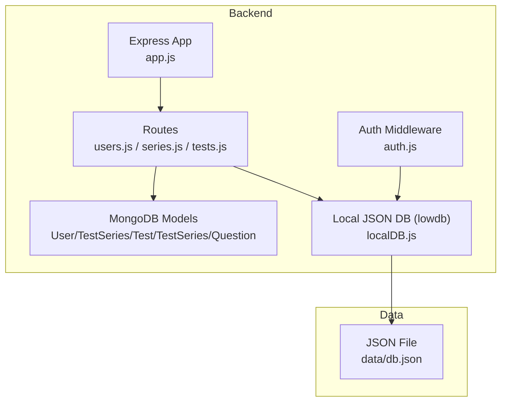
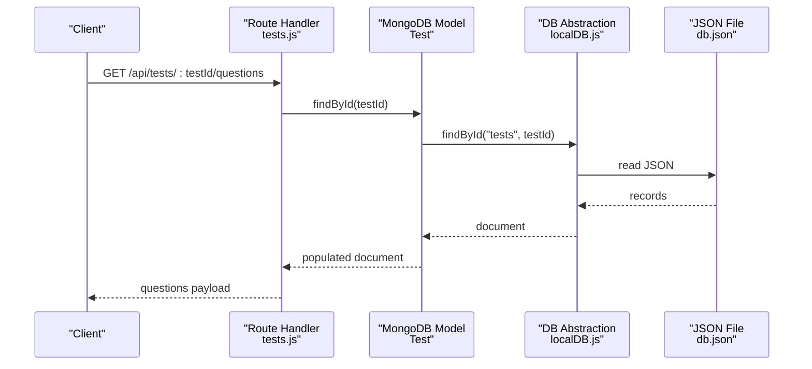
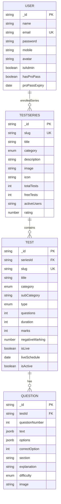
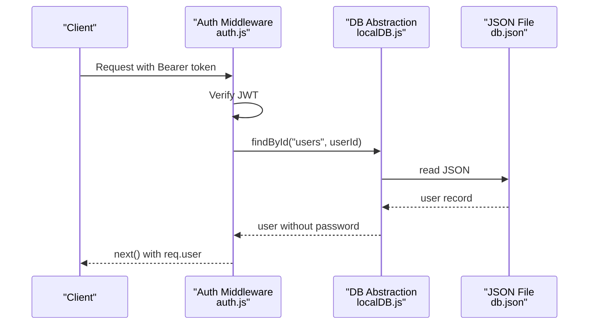
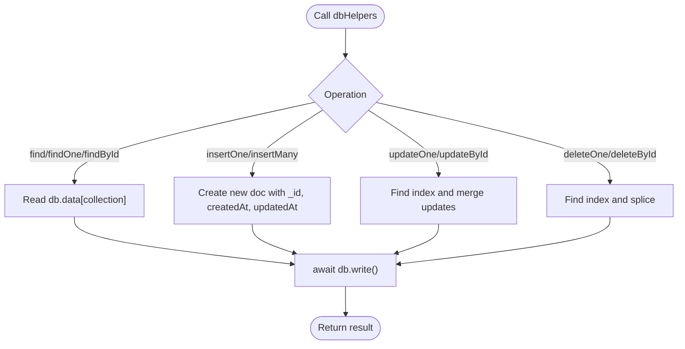
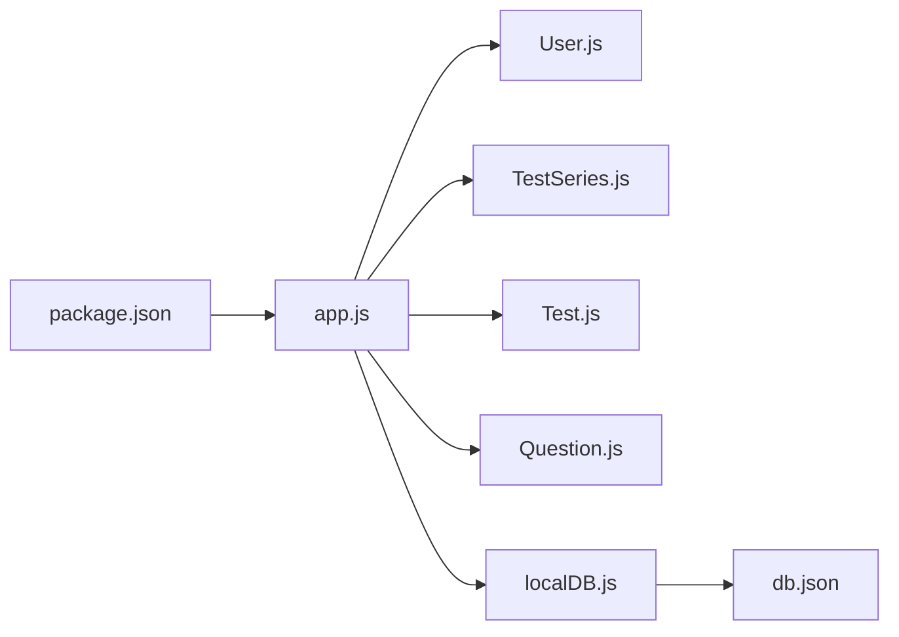

# Database Design

<cite>
**Referenced Files in This Document**
- [User.js](file://Backend/src/models/User.js)
- [TestSeries.js](file://Backend/src/models/TestSeries.js)
- [Test.js](file://Backend/src/models/Test.js)
- [Question.js](file://Backend/src/models/Question.js)
- [localDB.js](file://Backend/src/db/localDB.js)
- [db.json](file://Backend/data/db.json)
- [app.js](file://Backend/src/app.js)
- [users.js](file://Backend/src/routes/users.js)
- [series.js](file://Backend/src/routes/series.js)
- [tests.js](file://Backend/src/routes/tests.js)
- [auth.js](file://Backend/src/middleware/auth.js)
- [seedData.js](file://Backend/src/seed/seedData.js)
- [comprehensiveSeed.js](file://Backend/src/seed/comprehensiveSeed.js)
- [package.json](file://Backend/package.json)
</cite>

## Table of Contents
1. [Introduction](#introduction)
2. [Project Structure](#project-structure)
3. [Core Components](#core-components)
4. [Architecture Overview](#architecture-overview)
5. [Detailed Component Analysis](#detailed-component-analysis)
6. [Dependency Analysis](#dependency-analysis)
7. [Performance Considerations](#performance-considerations)
8. [Troubleshooting Guide](#troubleshooting-guide)
9. [Conclusion](#conclusion)
10. [Appendices](#appendices)

## Introduction
This document describes the database design for Trstprep V2, focusing on the dual-storage approach and the data model for Users, TestSeries, Tests, and Questions. It explains field definitions, validation rules, indexes, and constraints. It also covers the local JSON database implementation via lowdb, the database abstraction layer, query patterns, and operational considerations such as security, backups, migrations, and scalability.

## Project Structure
The backend uses a hybrid approach:
- MongoDB models define the domain entities and validation rules.
- A local JSON database (lowdb) serves as the primary persistence layer during development and small-scale deployments.
- Routes and middleware operate against the local database abstraction while maintaining the same interface as MongoDB.

**Diagram sources**
- [app.js](file://Backend/src/app.js#L68-L91)
- [localDB.js](file://Backend/src/db/localDB.js#L45-L77)
- [users.js](file://Backend/src/routes/users.js#L1-L150)
- [series.js](file://Backend/src/routes/series.js#L1-L162)
- [tests.js](file://Backend/src/routes/tests.js#L1-L265)
- [auth.js](file://Backend/src/middleware/auth.js#L1-L92)
- [db.json](file://Backend/data/db.json#L1-L728)

**Section sources**
- [app.js](file://Backend/src/app.js#L1-L94)
- [localDB.js](file://Backend/src/db/localDB.js#L1-L219)
- [package.json](file://Backend/package.json#L1-L32)

## Core Components
This section defines the entities and their fields, types, constraints, and relationships.

- User
  - Purpose: Represents learners and administrators.
  - Key fields:
    - name: string, required, trimmed, max length 50
    - email: string, required, unique, lowercase, trimmed, validated email regex
    - password: string, required, min length 8, hidden by default
    - mobile: string, optional
    - avatar: string, default empty
    - isAdmin: boolean, default false
    - hasProPass: boolean, default false
    - proPassExpiry: date, optional lifetime pass if absent
    - enrolledSeries: array of object ids referencing TestSeries
    - attemptedTests: map of seriesId -> count
  - Validation: Mongoose schema with required, regex, min/max, and default values.
  - Hooks: Pre-save hashing via bcrypt.
  - Methods: Password comparison and Pro Pass validity check.

- TestSeries
  - Purpose: Groups related tests by category and metadata.
  - Key fields:
    - slug: string, required, unique, lowercase, trimmed
    - title: string, required, trimmed
    - category: enum of SSC, Railway, Banking, Defence, State, Other
    - description: string, default empty
    - image/icon: strings for display
    - totalTests/freeTests: integers
    - activeUsers: string representation
    - rating: number, default 4.5, constrained 0–5
    - tags/testTypes: arrays of strings
    - isActive: boolean, default true
  - Indexes: category, isActive for filtering and sorting.
  - Validation: enums, defaults, numeric bounds.

- Test
  - Purpose: Individual assessments within a series.
  - Key fields:
    - seriesId: ObjectId referencing TestSeries, required
    - slug: string, required, trimmed
    - title: string, required, trimmed
    - category: enum of Mock Tests, PYPs, Live Tests, Practice
    - subCategory: string, default empty
    - type: enum Free/Pro, default Pro
    - questions/duration/marks: integers, all required and min 1
    - negativeMarking: number, default 0.25
    - tags: array of strings
    - isLive: boolean, default false
    - liveSchedule: date, optional
    - isActive: boolean, default true
  - Indexes: compound unique (seriesId, slug), category, type.
  - Validation: enums, numeric bounds, required fields.

- Question
  - Purpose: Items within a test with multilingual support and difficulty.
  - Key fields:
    - testId: ObjectId referencing Test, required
    - questionNumber: integer, required, min 1
    - text: object with en (required) and hi (optional)
    - options: object with en (array, required) and hi (optional)
    - correctOption: integer, required, min 0, max 3
    - section: string, default General
    - explanation: string, default empty
    - difficulty: enum easy/medium/hard, default medium
    - image: string, default empty
  - Indexes: compound unique (testId, questionNumber).
  - Validation: enums, numeric bounds, required arrays.

Primary/Foreign Keys and Relationships
- User.enrolledSeries -> TestSeries._id
- Test.seriesId -> TestSeries._id
- Question.testId -> Test._id

Indexing Strategy
- TestSeries: indexes on category and isActive to accelerate filtering and sorting.
- Test: compound unique on (seriesId, slug), plus indexes on category and type.
- Question: compound unique on (testId, questionNumber).

Data Integrity Constraints
- Unique constraints enforced via schema-level unique and compound unique indexes.
- Enum constraints enforce categorical values.
- Numeric min/max constraints ensure valid ranges.
- Embedded arrays and maps provide flexible but controlled structures.

**Section sources**
- [User.js](file://Backend/src/models/User.js#L1-L81)
- [TestSeries.js](file://Backend/src/models/TestSeries.js#L1-L71)
- [Test.js](file://Backend/src/models/Test.js#L1-L77)
- [Question.js](file://Backend/src/models/Question.js#L1-L54)

## Architecture Overview
The system uses a database abstraction layer to decouple route handlers and middleware from the underlying storage. Routes and middleware call into the abstraction, which performs CRUD operations on the local JSON file.

**Diagram sources**
- [tests.js](file://Backend/src/routes/tests.js#L86-L123)
- [Test.js](file://Backend/src/models/Test.js#L1-L77)
- [localDB.js](file://Backend/src/db/localDB.js#L110-L114)
- [db.json](file://Backend/data/db.json#L204-L372)

## Detailed Component Analysis

### Entity Relationship Diagram

**Diagram sources**
- [User.js](file://Backend/src/models/User.js#L4-L55)
- [TestSeries.js](file://Backend/src/models/TestSeries.js#L3-L63)
- [Test.js](file://Backend/src/models/Test.js#L3-L68)
- [Question.js](file://Backend/src/models/Question.js#L3-L47)
- [db.json](file://Backend/data/db.json#L2-L728)

### Data Access Patterns
- Find by Id: Routes use findById to retrieve entities by internal id.
- Find with filters: Routes filter by slug, category, type, tags, and activity status.
- Populate relationships: Routes populate foreign-key fields (e.g., enrolledSeries, seriesId) for richer responses.
- Write operations: Routes perform updates and enrollments using updateOne/updateById patterns.

Example patterns observed:
- Retrieve series by slug and optionally attach enrollment status.
- List tests within a series filtered by category/subcategory/type.
- Fetch questions for a test with access checks and selective field projection.

**Section sources**
- [series.js](file://Backend/src/routes/series.js#L55-L93)
- [series.js](file://Backend/src/routes/series.js#L95-L136)
- [tests.js](file://Backend/src/routes/tests.js#L86-L123)
- [users.js](file://Backend/src/routes/users.js#L53-L95)

### Authentication and Authorization Flow

**Diagram sources**
- [auth.js](file://Backend/src/middleware/auth.js#L5-L44)
- [localDB.js](file://Backend/src/db/localDB.js#L110-L114)
- [db.json](file://Backend/data/db.json#L2-L36)

### Database Abstraction Layer
The abstraction layer wraps lowdb to provide a familiar MongoDB-like interface:
- Initialization: Reads and ensures default collections exist.
- Queries: find, findOne, findById, count.
- Mutations: insertOne, insertMany, updateOne, updateById, deleteOne, deleteById.
- Concurrency: write after each mutation to persist changes.

**Diagram sources**
- [localDB.js](file://Backend/src/db/localDB.js#L79-L216)

**Section sources**
- [localDB.js](file://Backend/src/db/localDB.js#L1-L219)

### Data Lifecycle Management
- Seeding: Scripts initialize the database with realistic data for development and testing.
- Migration: A comprehensive seed script migrates from hardcoded mock data into the JSON database.
- Cleanup: Seed scripts clear existing data before writing new sets.

Operational notes:
- The app logs a hint to migrate to MongoDB by updating the connection in app.js.
- The local JSON file persists all collections defined in the default data structure.

**Section sources**
- [seedData.js](file://Backend/src/seed/seedData.js#L1-L233)
- [comprehensiveSeed.js](file://Backend/src/seed/comprehensiveSeed.js#L1-L449)
- [app.js](file://Backend/src/app.js#L68-L91)

## Dependency Analysis
- Express app initializes the local database and registers routes.
- Routes depend on models for validation and on the database abstraction for persistence.
- Authentication middleware depends on the database abstraction to resolve users by token.
- The package includes both mongoose (for models) and lowdb (for local storage).

**Diagram sources**
- [package.json](file://Backend/package.json#L12-L24)
- [app.js](file://Backend/src/app.js#L1-L94)
- [localDB.js](file://Backend/src/db/localDB.js#L1-L219)
- [db.json](file://Backend/data/db.json#L1-L728)

**Section sources**
- [package.json](file://Backend/package.json#L1-L32)
- [app.js](file://Backend/src/app.js#L1-L94)

## Performance Considerations
- Indexing: The models define indexes on frequently queried fields (category, type, isActive) to improve filter and sort performance.
- Query patterns: Routes commonly filter by slug, category, and type; ensure these indexes are leveraged.
- Data size: The local JSON file grows with content. For larger datasets, consider migrating to MongoDB to benefit from native indexing, aggregation, and scaling features.
- Write frequency: Each mutation writes to disk; batch operations where possible to reduce I/O overhead.
- Population: Populate only when necessary to avoid unnecessary reads.

[No sources needed since this section provides general guidance]

## Troubleshooting Guide
Common issues and resolutions:
- Database not initialized: Ensure initDB is called before routes attempt to access data.
- Missing collections: The abstraction ensures default collections exist; verify db.json path and permissions.
- Token errors: Confirm JWT secret and token format; verify user exists in the users collection.
- Duplicate slugs: Unique constraints prevent duplicates; adjust slug values if creation fails.
- Access control: Routes enforce Free/Pro access and Pro Pass checks; verify user flags and expiry.

**Section sources**
- [app.js](file://Backend/src/app.js#L68-L91)
- [auth.js](file://Backend/src/middleware/auth.js#L1-L92)
- [localDB.js](file://Backend/src/db/localDB.js#L45-L77)

## Conclusion
Trstprep V2 employs a pragmatic dual approach: MongoDB models define the domain and constraints, while a lowdb abstraction provides a simple, local JSON-backed persistence layer suitable for development and small-scale usage. The design supports essential relationships, validations, and indexes. For production, consider migrating to MongoDB for robustness, scalability, and advanced querying capabilities.

[No sources needed since this section summarizes without analyzing specific files]

## Appendices

### Field Reference Tables

- User
  - Fields: name, email, password, mobile, avatar, isAdmin, hasProPass, proPassExpiry, enrolledSeries, attemptedTests
  - Types: string, boolean, date, array, map
  - Constraints: required, unique (email), regex (email), min/max lengths, default values
  - Indexes: none (no compound indexes defined)

- TestSeries
  - Fields: slug, title, category, description, image, icon, totalTests, freeTests, activeUsers, rating, tags, testTypes, isActive
  - Types: string, number, boolean, array
  - Constraints: required, enum, default, min/max
  - Indexes: category, isActive

- Test
  - Fields: seriesId, slug, title, category, subCategory, type, questions, duration, marks, negativeMarking, tags, isLive, liveSchedule, isActive
  - Types: ObjectId, string, number, boolean, date, array
  - Constraints: required, enum, min, default
  - Indexes: compound unique (seriesId, slug), category, type

- Question
  - Fields: testId, questionNumber, text, options, correctOption, section, explanation, difficulty, image
  - Types: ObjectId, number, jsonb, array
  - Constraints: required, enum, min/max
  - Indexes: compound unique (testId, questionNumber)

**Section sources**
- [User.js](file://Backend/src/models/User.js#L4-L55)
- [TestSeries.js](file://Backend/src/models/TestSeries.js#L3-L63)
- [Test.js](file://Backend/src/models/Test.js#L3-L68)
- [Question.js](file://Backend/src/models/Question.js#L3-L47)

### Data Access Examples (Paths)
- Retrieve series by slug: [series.js](file://Backend/src/routes/series.js#L55-L93)
- List tests in a series: [series.js](file://Backend/src/routes/series.js#L95-L136)
- Get test questions: [tests.js](file://Backend/src/routes/tests.js#L86-L123)
- Enroll user in series: [users.js](file://Backend/src/routes/users.js#L53-L95)
- Authenticate user: [auth.js](file://Backend/src/middleware/auth.js#L5-L44)

**Section sources**
- [series.js](file://Backend/src/routes/series.js#L55-L136)
- [tests.js](file://Backend/src/routes/tests.js#L86-L123)
- [users.js](file://Backend/src/routes/users.js#L53-L95)
- [auth.js](file://Backend/src/middleware/auth.js#L5-L44)

### Section Attempts
- `attemptId`: Reference to TestAttempt
- `sectionName`: String
- `totalQuestions`: Number
- Metrics: attempted, correct, wrong, unattempted, marks, timeSpent, accuracy

### Stages
- `name`: String (e.g., Tier-1, CBT-1)
- `slug`: String
- `description`: String
- `order`: String

### Other Models (Implemented)
- `Enrollment`: Tracks user enrollments in test series.
- `Result`: Stores completed test results.
- `SectionAttempt`: Stores section-level granular result telemetry.
- `CurrentAffair`: Daily current affairs updates.
- `ExamCategory`, `ExamSubCategory`, `ExamYearlyData`, `ExamUpdate`: Hierarchical exam taxonomy system.
- `Leaderboard`: Aggregated ranking collections.
- `LiveTest`: Live assessment schedule definitions.
- `Notification`: Individual user notifications.
- `Passage`: Shared paragraphs for question groups.
- `Stage`: Exam tier categorization.
- `StudyMaterial`, `Chapter`, `Subject`, `Topic`, `Video`: Educational content taxonomy and files.
- `Coupon`, `SubscriptionPlan`: Economics and payment tiering.
- `TestCategory`: Internal test classification tree.

*Last Updated: March 10, 2026 | Update date is (20:16)*
