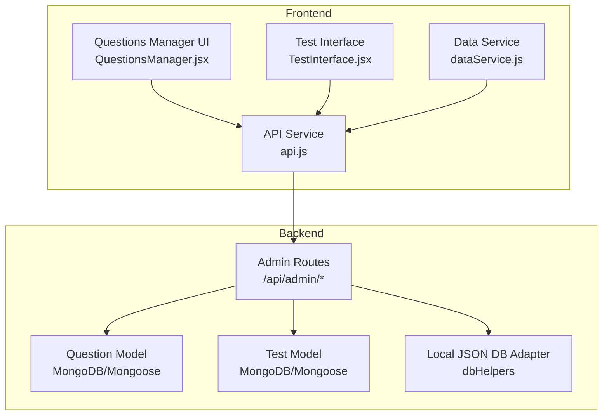
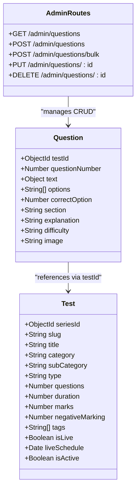
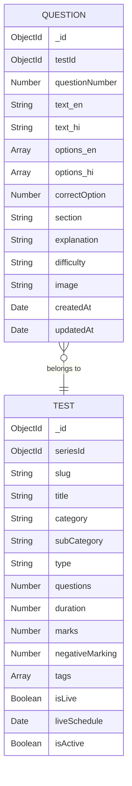
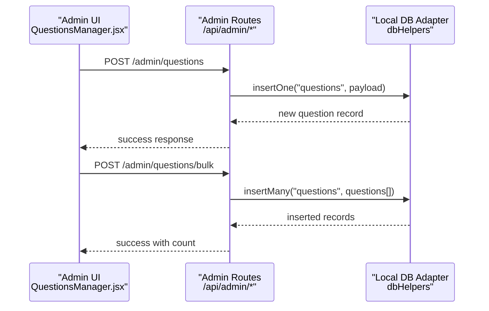
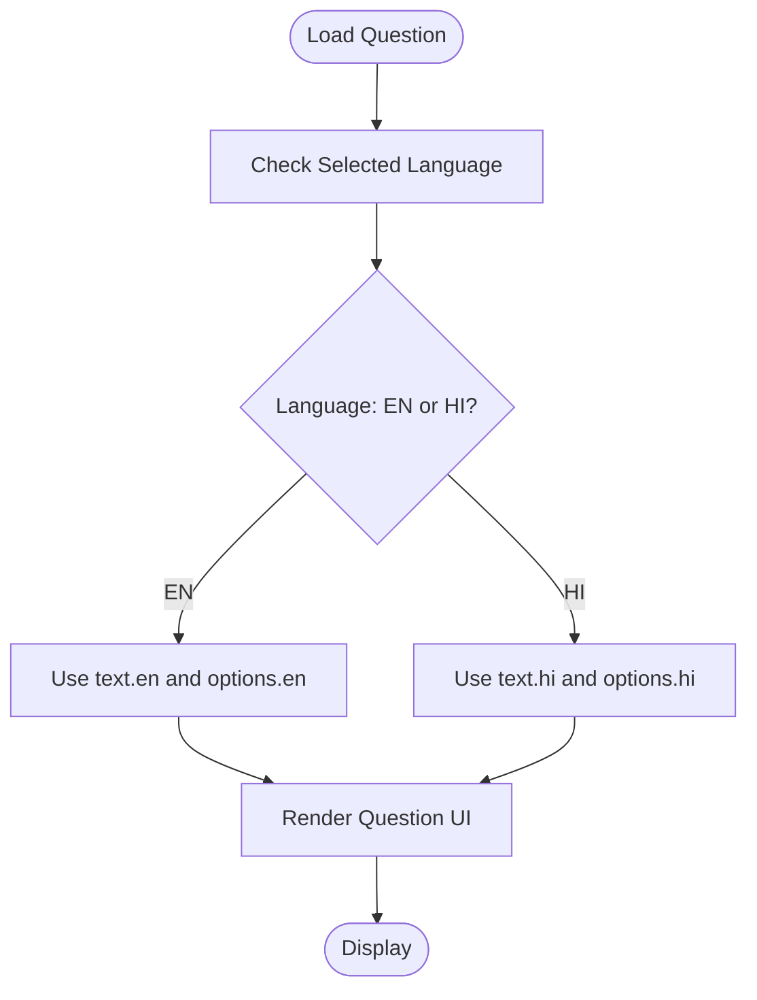
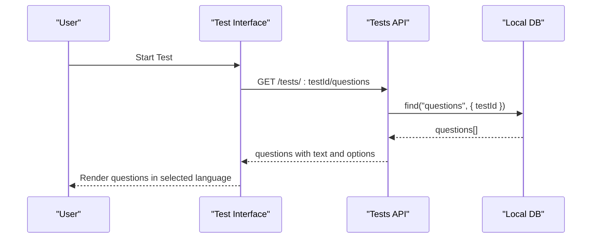
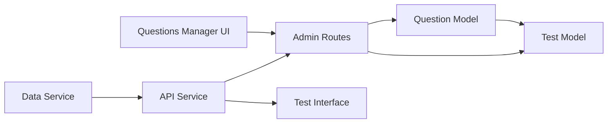

# Question Model

<cite>
**Referenced Files in This Document**
- [Question.js](file://Backend/src/models/Question.js)
- [admin.js](file://Backend/src/routes/admin.js)
- [localDB.js](file://Backend/src/db/localDB.js)
- [db.json](file://Backend/data/db.json)
- [QuestionsManager.jsx](file://Frontend/src/pages/admin/QuestionsManager.jsx)
- [api.js](file://Frontend/src/services/api.js)
- [dataService.js](file://Frontend/src/services/dataService.js)
- [Test.js](file://Backend/src/models/Test.js)
- [TestInterface.jsx](file://Frontend/src/pages/TestInterface.jsx)
</cite>

## Table of Contents
1. [Introduction](#introduction)
2. [Project Structure](#project-structure)
3. [Core Components](#core-components)
4. [Architecture Overview](#architecture-overview)
5. [Detailed Component Analysis](#detailed-component-analysis)
6. [Dependency Analysis](#dependency-analysis)
7. [Performance Considerations](#performance-considerations)
8. [Troubleshooting Guide](#troubleshooting-guide)
9. [Conclusion](#conclusion)

## Introduction
This document provides comprehensive data model documentation for the Question model in Trstprep V2. It covers field definitions, validation rules, multi-language support, difficulty classification, subject organization, question format variations, media embedding, and integration with test question banks and result analysis systems. The goal is to help developers and administrators understand how questions are structured, validated, stored, and consumed across the platform.

## Project Structure
The Question model is implemented as a Mongoose schema in the backend and integrated with an admin-managed API. The frontend provides administrative tools for creating, editing, and uploading questions, and consumes the API for test-taking and result analysis.

**Diagram sources**
- [Question.js](file://Backend/src/models/Question.js#L1-L54)
- [admin.js](file://Backend/src/routes/admin.js#L117-L168)
- [localDB.js](file://Backend/src/db/localDB.js#L82-L222)
- [QuestionsManager.jsx](file://Frontend/src/pages/admin/QuestionsManager.jsx#L1-L421)
- [api.js](file://Frontend/src/services/api.js#L1-L92)
- [dataService.js](file://Frontend/src/services/dataService.js#L1-L172)
- [Test.js](file://Backend/src/models/Test.js#L1-L77)
- [TestInterface.jsx](file://Frontend/src/pages/TestInterface.jsx#L646-L676)

**Section sources**
- [Question.js](file://Backend/src/models/Question.js#L1-L54)
- [admin.js](file://Backend/src/routes/admin.js#L117-L168)
- [localDB.js](file://Backend/src/db/localDB.js#L82-L222)
- [QuestionsManager.jsx](file://Frontend/src/pages/admin/QuestionsManager.jsx#L1-L421)
- [api.js](file://Frontend/src/services/api.js#L1-L92)
- [dataService.js](file://Frontend/src/services/dataService.js#L1-L172)
- [Test.js](file://Backend/src/models/Test.js#L1-L77)
- [TestInterface.jsx](file://Frontend/src/pages/TestInterface.jsx#L646-L676)

## Core Components
This section defines the Question data model fields, their types, validation rules, and relationships to tests and other entities.

- Field: testId
  - Type: ObjectId referencing Test
  - Required: Yes
  - Purpose: Links a question to a specific test
  - Validation: Foreign key constraint via Mongoose reference

- Field: questionNumber
  - Type: Number
  - Required: Yes
  - Min: 1
  - Purpose: Defines question ordering within a test
  - Validation: Unique composite index with testId

- Field: text
  - Type: Object with language variants
  - Structure: { en: String, hi: String }
  - Required: en is required; hi defaults to empty string
  - Purpose: Stores question text in English and Hindi

- Field: options
  - Type: Array of Strings with language variants
  - Structure: { en: [String], hi: [String] }
  - Required: en options are required; hi options optional
  - Purpose: Stores multiple-choice options per language

- Field: correctOption
  - Type: Number (0-indexed)
  - Required: Yes
  - Range: 0 to 3
  - Purpose: Identifies the correct option index

- Field: section
  - Type: String
  - Default: "General"
  - Purpose: Groups questions by subject/topic area

- Field: explanation
  - Type: String
  - Default: Empty string
  - Purpose: Provides solution/explanation text

- Field: difficulty
  - Type: String
  - Enum: ["easy", "medium", "hard"]
  - Default: "medium"
  - Purpose: Classifies question difficulty for analytics

- Field: image
  - Type: String
  - Default: Empty string
  - Purpose: URL/path to associated image/video content

- Indexes and Constraints
  - Composite unique index on { testId: 1, questionNumber: 1 }
  - Timestamps enabled (createdAt, updatedAt)

**Section sources**
- [Question.js](file://Backend/src/models/Question.js#L3-L50)

## Architecture Overview
The Question model integrates with the Test model and admin API to support question creation, bulk upload, and consumption during test attempts and result analysis.

**Diagram sources**
- [Question.js](file://Backend/src/models/Question.js#L3-L50)
- [Test.js](file://Backend/src/models/Test.js#L3-L77)
- [admin.js](file://Backend/src/routes/admin.js#L117-L168)

## Detailed Component Analysis

### Question Data Model Fields and Validation
- Multi-language support
  - English and Hindi variants for question text and options
  - Hindi variant defaults ensure compatibility when not provided
- Difficulty classification
  - Predefined levels: easy, medium, hard
  - Used for analytics and question selection strategies
- Ordering and uniqueness
  - questionNumber ensures ordered presentation within a test
  - Composite unique index prevents duplicates per test
- Media embedding
  - image field stores URLs/paths for images/videos
  - Supports rich media content in questions

**Diagram sources**
- [Question.js](file://Backend/src/models/Question.js#L3-L50)
- [Test.js](file://Backend/src/models/Test.js#L3-L77)

**Section sources**
- [Question.js](file://Backend/src/models/Question.js#L3-L50)

### Question Creation and Administration Workflow
The admin UI enables manual creation and bulk upload of questions, with validation and persistence handled by the backend.

**Diagram sources**
- [QuestionsManager.jsx](file://Frontend/src/pages/admin/QuestionsManager.jsx#L59-L95)
- [admin.js](file://Backend/src/routes/admin.js#L127-L144)
- [localDB.js](file://Backend/src/db/localDB.js#L119-L149)

**Section sources**
- [QuestionsManager.jsx](file://Frontend/src/pages/admin/QuestionsManager.jsx#L59-L95)
- [admin.js](file://Backend/src/routes/admin.js#L127-L144)
- [localDB.js](file://Backend/src/db/localDB.js#L119-L149)

### Multi-Language Content Management
The Question model supports bilingual content with English as required and Hindi as optional. The frontend test interface demonstrates language switching and content rendering.

**Diagram sources**
- [Question.js](file://Backend/src/models/Question.js#L14-L21)
- [TestInterface.jsx](file://Frontend/src/pages/TestInterface.jsx#L646-L676)

**Section sources**
- [Question.js](file://Backend/src/models/Question.js#L14-L21)
- [TestInterface.jsx](file://Frontend/src/pages/TestInterface.jsx#L646-L676)

### Question Format Variations and Media Support
- Single correct answer
  - Implemented via correctOption (0-indexed number)
  - Options array length 4 with one correct index
- Multiple correct answers
  - Not supported in current schema; would require schema change to array of indices
- Numerical questions
  - Supported via text and options fields; correct answer stored as index
- Media embedding
  - image field stores URL/path for images/videos
  - Integrated with media upload endpoint for file management

**Section sources**
- [Question.js](file://Backend/src/models/Question.js#L22-L27)
- [Question.js](file://Backend/src/models/Question.js#L41-L44)
- [admin.js](file://Backend/src/routes/admin.js#L242-L272)

### Integration with Test Question Banks and Result Analysis
- Test-question relationship
  - Questions belong to a specific test via testId
  - Tests define totalQuestions, duration, and marking scheme
- Result analysis
  - Difficulty distribution used for analytics dashboards
  - Questions grouped by section for subject-wise breakdown
- Consumption in test interface
  - Questions fetched per test for display and attempt
  - Language variants rendered based on user preference

**Diagram sources**
- [Test.js](file://Backend/src/models/Test.js#L3-L77)
- [admin.js](file://Backend/src/routes/admin.js#L117-L125)
- [dataService.js](file://Frontend/src/services/dataService.js#L89-L92)

**Section sources**
- [Test.js](file://Backend/src/models/Test.js#L3-L77)
- [admin.js](file://Backend/src/routes/admin.js#L117-L125)
- [dataService.js](file://Frontend/src/services/dataService.js#L89-L92)

## Dependency Analysis
The Question model depends on the Test model for scoping and on the admin routes for CRUD operations. The frontend depends on the API for data retrieval and on the data service for caching and helper functions.

**Diagram sources**
- [Question.js](file://Backend/src/models/Question.js#L3-L7)
- [Test.js](file://Backend/src/models/Test.js#L3-L7)
- [admin.js](file://Backend/src/routes/admin.js#L117-L168)
- [QuestionsManager.jsx](file://Frontend/src/pages/admin/QuestionsManager.jsx#L1-L421)
- [api.js](file://Frontend/src/services/api.js#L1-L92)
- [dataService.js](file://Frontend/src/services/dataService.js#L1-L172)

**Section sources**
- [Question.js](file://Backend/src/models/Question.js#L3-L7)
- [Test.js](file://Backend/src/models/Test.js#L3-L7)
- [admin.js](file://Backend/src/routes/admin.js#L117-L168)
- [QuestionsManager.jsx](file://Frontend/src/pages/admin/QuestionsManager.jsx#L1-L421)
- [api.js](file://Frontend/src/services/api.js#L1-L92)
- [dataService.js](file://Frontend/src/services/dataService.js#L1-L172)

## Performance Considerations
- Index usage
  - Composite index on { testId, questionNumber } optimizes lookup within tests
- Data locality
  - Questions stored per-test reduces cross-document joins
- Caching
  - Frontend data service caches responses for 5 seconds to reduce API calls
- Bulk operations
  - Bulk upload endpoint minimizes round trips for large datasets

## Troubleshooting Guide
Common issues and resolutions:
- Duplicate question numbering
  - Symptom: Insert fails with duplicate key error
  - Cause: Same questionNumber within the same test
  - Resolution: Increment questionNumber or change testId
- Invalid correctOption index
  - Symptom: Validation error on save
  - Cause: Value outside 0-3 range
  - Resolution: Ensure correctOption is 0, 1, 2, or 3
- Missing English content
  - Symptom: Validation error for text.en
  - Cause: Hindi-only content provided
  - Resolution: Provide English text and optional Hindi translation
- Media upload failures
  - Symptom: Upload endpoint returns error
  - Cause: Unsupported file type or missing file
  - Resolution: Verify MIME type and file presence

**Section sources**
- [Question.js](file://Backend/src/models/Question.js#L22-L27)
- [Question.js](file://Backend/src/models/Question.js#L14-L17)
- [admin.js](file://Backend/src/routes/admin.js#L242-L272)

## Conclusion
The Question model in Trstprep V2 provides a robust foundation for managing multilingual, difficulty-classified questions within test contexts. Its integration with the admin API and frontend tools enables efficient creation, bulk upload, and consumption of questions. The model supports current question formats and media embedding while maintaining clear relationships with tests and supporting analytics workflows.

*Last Updated: March 10, 2026 | Update date is (20:16)*
