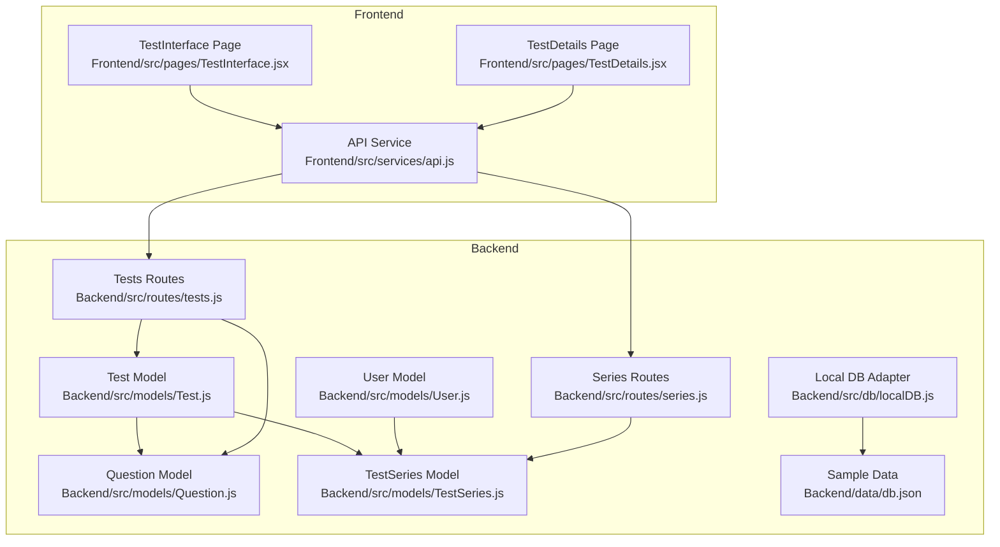
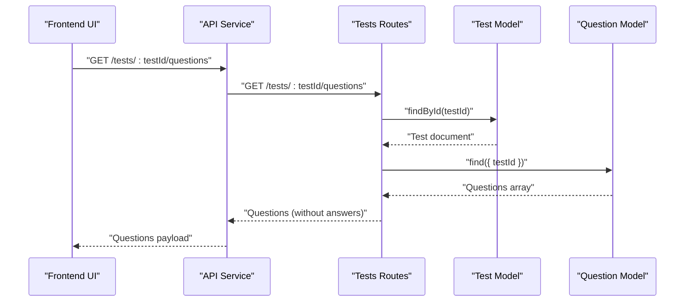
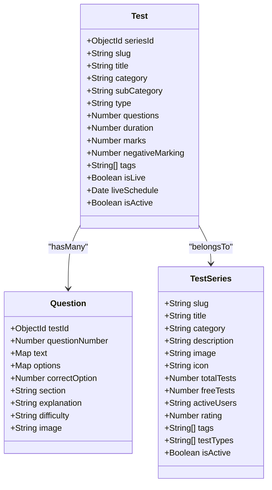
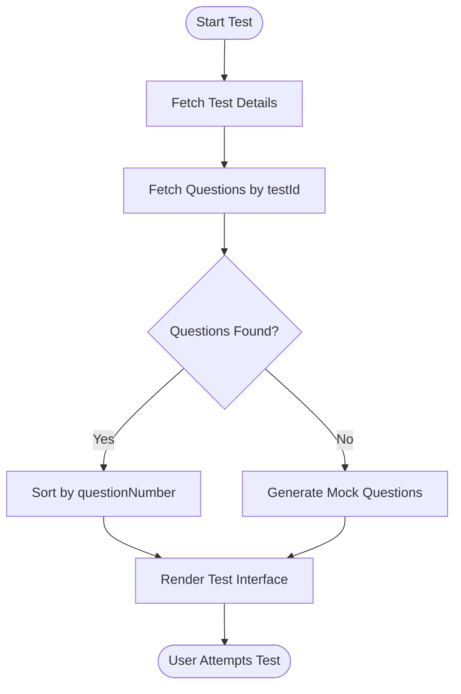
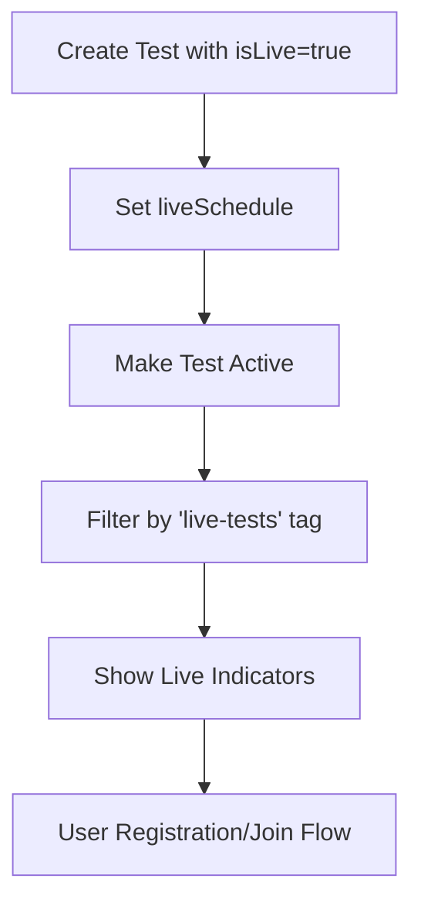
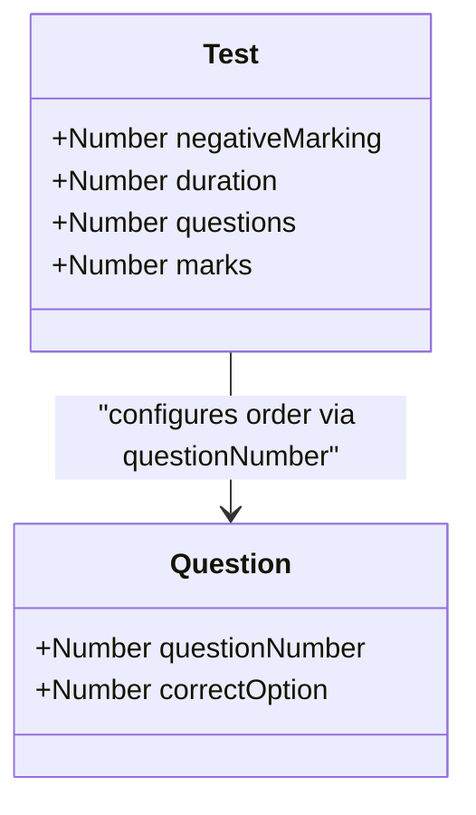
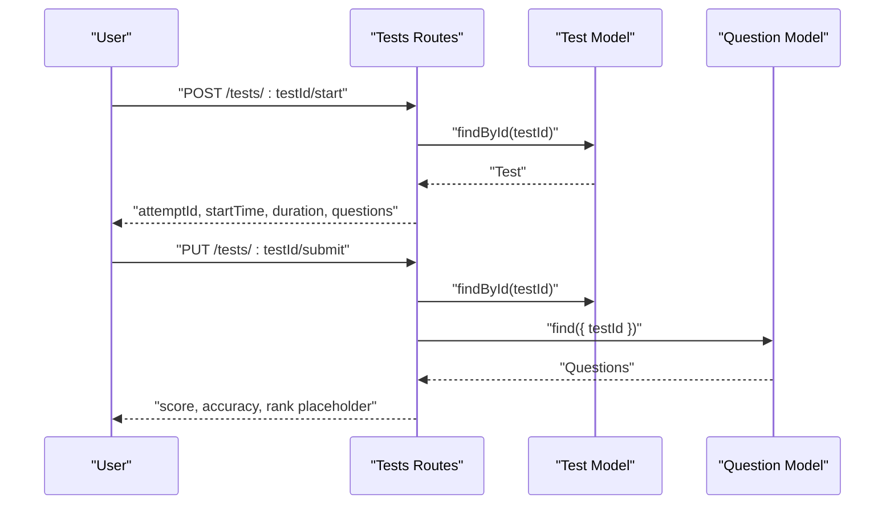
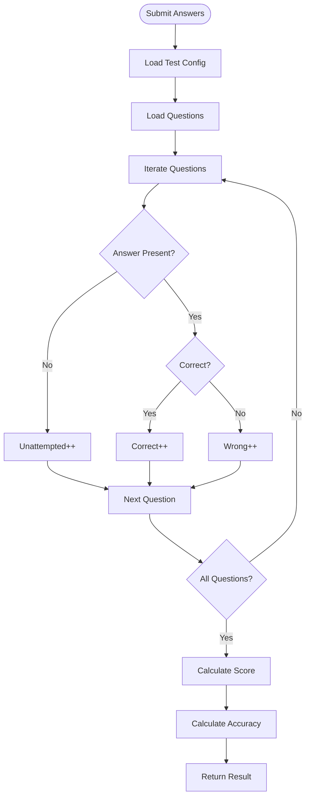
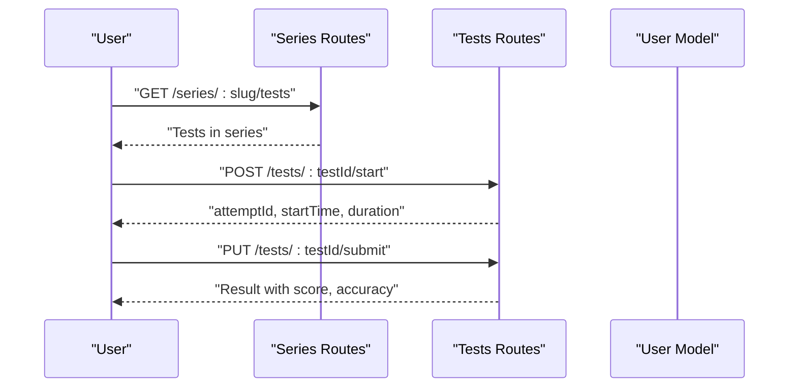
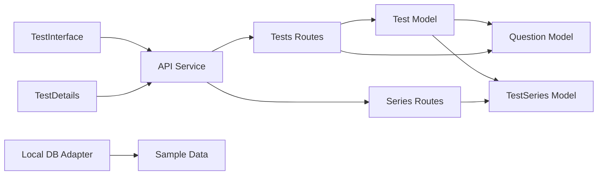

# Test Model

<cite>
**Referenced Files in This Document**
- [Test.js](file://Backend/src/models/Test.js)
- [Question.js](file://Backend/src/models/Question.js)
- [TestSeries.js](file://Backend/src/models/TestSeries.js)
- [User.js](file://Backend/src/models/User.js)
- [tests.js](file://Backend/src/routes/tests.js)
- [series.js](file://Backend/src/routes/series.js)
- [api.js](file://Frontend/src/services/api.js)
- [TestInterface.jsx](file://Frontend/src/pages/TestInterface.jsx)
- [TestDetails.jsx](file://Frontend/src/pages/TestDetails.jsx)
- [localDB.js](file://Backend/src/db/localDB.js)
- [db.json](file://Backend/data/db.json)
</cite>

## Table of Contents
1. [Introduction](#introduction)
2. [Project Structure](#project-structure)
3. [Core Components](#core-components)
4. [Architecture Overview](#architecture-overview)
5. [Detailed Component Analysis](#detailed-component-analysis)
6. [Dependency Analysis](#dependency-analysis)
7. [Performance Considerations](#performance-considerations)
8. [Troubleshooting Guide](#troubleshooting-guide)
9. [Conclusion](#conclusion)
10. [Appendices](#appendices)

## Introduction
This document provides comprehensive data model documentation for the Test model in Trstprep V2. It defines all fields, their data types, validation rules, and relationships with related models (Question, TestSeries, User). It also explains the scheduling system for test availability, test configuration options (negative marking, time limits, question distribution), field-level validation constraints, test lifecycle management, and result calculation logic. Practical examples for test creation, scheduling, and question assignment are included, along with integration points for test series and user attempt tracking.

## Project Structure
The Test model is part of the backend data layer and integrates with frontend components and routes to support test creation, scheduling, and user attempts.

**Diagram sources**
- [Test.js](file://Backend/src/models/Test.js#L1-L77)
- [Question.js](file://Backend/src/models/Question.js#L1-L54)
- [TestSeries.js](file://Backend/src/models/TestSeries.js#L1-L71)
- [User.js](file://Backend/src/models/User.js#L1-L81)
- [tests.js](file://Backend/src/routes/tests.js#L1-L265)
- [series.js](file://Backend/src/routes/series.js#L51-L110)
- [localDB.js](file://Backend/src/db/localDB.js#L1-L222)
- [db.json](file://Backend/data/db.json#L204-L372)
- [TestInterface.jsx](file://Frontend/src/pages/TestInterface.jsx#L1-L677)
- [TestDetails.jsx](file://Frontend/src/pages/TestDetails.jsx#L1-L330)
- [api.js](file://Frontend/src/services/api.js#L1-L92)

**Section sources**
- [Test.js](file://Backend/src/models/Test.js#L1-L77)
- [Question.js](file://Backend/src/models/Question.js#L1-L54)
- [TestSeries.js](file://Backend/src/models/TestSeries.js#L1-L71)
- [User.js](file://Backend/src/models/User.js#L1-L81)
- [tests.js](file://Backend/src/routes/tests.js#L1-L265)
- [series.js](file://Backend/src/routes/series.js#L51-L110)
- [localDB.js](file://Backend/src/db/localDB.js#L1-L222)
- [db.json](file://Backend/data/db.json#L204-L372)
- [TestInterface.jsx](file://Frontend/src/pages/TestInterface.jsx#L1-L677)
- [TestDetails.jsx](file://Frontend/src/pages/TestDetails.jsx#L1-L330)
- [api.js](file://Frontend/src/services/api.js#L1-L92)

## Core Components
This section defines the Test model fields, their types, and validation rules, and explains how they relate to Question and TestSeries.

- Field definitions and constraints
  - seriesId: ObjectId referencing TestSeries; required; ensures each test belongs to a series
  - slug: String; required; trimmed; unique per series (compound index)
  - title: String; required; trimmed
  - category: String; required; enum includes Mock Tests, PYPs, Live Tests, Practice
  - subCategory: String; default empty
  - type: String; enum Free, Pro; default Pro
  - questions: Number; required; min 1
  - duration: Number (minutes); required; min 1
  - marks: Number; required; min 1
  - negativeMarking: Number; default 0.25
  - tags: Array of String
  - isLive: Boolean; default false
  - liveSchedule: Date
  - isActive: Boolean; default true
  - timestamps: enabled

- Relationships
  - One Test belongs to One TestSeries (foreign key seriesId)
  - One Test has Many Questions (via Question.testId)
  - Access control depends on User.hasProPass and Test.type

- Indexes
  - Compound unique index on { seriesId, slug }
  - Index on category
  - Index on type

**Section sources**
- [Test.js](file://Backend/src/models/Test.js#L3-L76)
- [Question.js](file://Backend/src/models/Question.js#L3-L47)
- [TestSeries.js](file://Backend/src/models/TestSeries.js#L3-L63)

## Architecture Overview
The Test model participates in a layered architecture:
- Data layer: Mongoose models define schema and indexes
- Route layer: Express routes expose endpoints for test operations
- Service layer: Frontend API service consumes routes
- Presentation layer: React pages render UI and orchestrate user actions

**Diagram sources**
- [tests.js](file://Backend/src/routes/tests.js#L86-L123)
- [Test.js](file://Backend/src/models/Test.js#L1-L77)
- [Question.js](file://Backend/src/models/Question.js#L1-L54)
- [api.js](file://Frontend/src/services/api.js#L63-L71)

## Detailed Component Analysis

### Test Model Schema and Validation
- Required fields enforced at schema level
- Enumerations constrain category and type
- Numeric fields enforce minimum values
- Unique compound index prevents duplicate slugs per series
- Timestamps automatically managed

**Diagram sources**
- [Test.js](file://Backend/src/models/Test.js#L3-L76)
- [Question.js](file://Backend/src/models/Question.js#L3-L47)
- [TestSeries.js](file://Backend/src/models/TestSeries.js#L3-L63)

**Section sources**
- [Test.js](file://Backend/src/models/Test.js#L3-L76)
- [Question.js](file://Backend/src/models/Question.js#L3-L47)
- [TestSeries.js](file://Backend/src/models/TestSeries.js#L3-L63)

### Question Assignment and Distribution
- Questions are assigned to a Test via Question.testId
- Questions are sorted by questionNumber during test-taking
- Frontend generates mock questions if none are present in the database

**Diagram sources**
- [tests.js](file://Backend/src/routes/tests.js#L86-L123)
- [TestInterface.jsx](file://Frontend/src/pages/TestInterface.jsx#L35-L72)

**Section sources**
- [tests.js](file://Backend/src/routes/tests.js#L86-L123)
- [TestInterface.jsx](file://Frontend/src/pages/TestInterface.jsx#L35-L72)

### Scheduling System for Test Availability
- isLive flag indicates live tests
- liveSchedule stores scheduled date/time
- Routes filter tests by tag including live-tests
- Frontend displays live indicators and registration flows

**Diagram sources**
- [Test.js](file://Backend/src/models/Test.js#L55-L61)
- [tests.js](file://Backend/src/routes/tests.js#L8-L48)
- [TestDetails.jsx](file://Frontend/src/pages/TestDetails.jsx#L256-L327)

**Section sources**
- [Test.js](file://Backend/src/models/Test.js#L55-L61)
- [tests.js](file://Backend/src/routes/tests.js#L8-L48)
- [TestDetails.jsx](file://Frontend/src/pages/TestDetails.jsx#L256-L327)

### Test Configuration Options
- Negative marking: configurable per test; defaults applied
- Time limits: duration in minutes; validated
- Question distribution: managed by assigning Questions with questionNumber ordering

**Diagram sources**
- [Test.js](file://Backend/src/models/Test.js#L48-L51)
- [Test.js](file://Backend/src/models/Test.js#L38-L47)
- [Question.js](file://Backend/src/models/Question.js#L9-L27)

**Section sources**
- [Test.js](file://Backend/src/models/Test.js#L48-L51)
- [Test.js](file://Backend/src/models/Test.js#L38-L47)
- [Question.js](file://Backend/src/models/Question.js#L9-L27)

### Field-Level Validation Constraints
- Required fields: seriesId, slug, title, category, questions, duration, marks
- Enums: category includes specific values; type includes Free/Pro
- Min values: questions, duration, marks ≥ 1
- Defaults: type Pro, negativeMarking 0.25, isLive false, isActive true
- Unique constraint: compound index on seriesId + slug

**Section sources**
- [Test.js](file://Backend/src/models/Test.js#L3-L76)

### Test Lifecycle Management
- Creation: Define seriesId, slug, title, category, type, questions, duration, marks, negativeMarking, tags, isLive, liveSchedule, isActive
- Activation: Set isActive true; filter by isActive in routes
- Access control: Free tests accessible; Pro requires User.hasProPass
- Attempt initiation: Start endpoint creates attempt metadata
- Submission: Submit endpoint calculates score and returns result

**Diagram sources**
- [tests.js](file://Backend/src/routes/tests.js#L125-L231)
- [Test.js](file://Backend/src/models/Test.js#L1-L77)
- [Question.js](file://Backend/src/models/Question.js#L1-L54)

**Section sources**
- [tests.js](file://Backend/src/routes/tests.js#L125-L231)
- [Test.js](file://Backend/src/models/Test.js#L1-L77)
- [Question.js](file://Backend/src/models/Question.js#L1-L54)

### Result Calculation Logic
- Per-question marks: marksPerQuestion = total marks / total questions
- Score calculation: correct × marksPerQuestion − (wrong × negativeMarking)
- Accuracy: correct / (correct + wrong) × 100
- Unattempted: count of unanswered questions
- Rank: placeholder returned in route (to be persisted)

**Diagram sources**
- [tests.js](file://Backend/src/routes/tests.js#L168-L231)

**Section sources**
- [tests.js](file://Backend/src/routes/tests.js#L168-L231)

### Examples

#### Example: Test Creation
- Fields to set: seriesId, slug, title, category, subCategory, type, questions, duration, marks, negativeMarking, tags, isLive, liveSchedule, isActive
- Validation: All required fields must be provided; enums and min values enforced
- Relationship: Ensure TestSeries exists; slug uniqueness enforced per series

**Section sources**
- [Test.js](file://Backend/src/models/Test.js#L3-L76)
- [TestSeries.js](file://Backend/src/models/TestSeries.js#L3-L63)

#### Example: Scheduling a Live Test
- Set isLive = true and liveSchedule to the desired date/time
- Filter by tag "live-tests" to surface live tests
- Frontend displays live indicators and registration controls

**Section sources**
- [Test.js](file://Backend/src/models/Test.js#L55-L61)
- [tests.js](file://Backend/src/routes/tests.js#L8-L48)
- [TestDetails.jsx](file://Frontend/src/pages/TestDetails.jsx#L256-L327)

#### Example: Question Assignment
- Assign questions to a test by setting Question.testId
- Sort questions by Question.questionNumber for ordered presentation
- If no questions exist, frontend generates mock questions for demonstration

**Section sources**
- [Question.js](file://Backend/src/models/Question.js#L3-L47)
- [tests.js](file://Backend/src/routes/tests.js#L86-L123)
- [TestInterface.jsx](file://Frontend/src/pages/TestInterface.jsx#L35-L72)

### Integration with Test Series and User Attempt Tracking
- TestSeries: Each Test belongs to a TestSeries via seriesId; series routes expose enrollment and filtering
- User attempts: Frontend manages attempt state; backend routes accept attemptId and calculate results
- Enrollment: Users can enroll in TestSeries; access checks consider User.hasProPass

**Diagram sources**
- [series.js](file://Backend/src/routes/series.js#L95-L110)
- [tests.js](file://Backend/src/routes/tests.js#L125-L231)
- [User.js](file://Backend/src/models/User.js#L44-L52)

**Section sources**
- [series.js](file://Backend/src/routes/series.js#L95-L110)
- [tests.js](file://Backend/src/routes/tests.js#L125-L231)
- [User.js](file://Backend/src/models/User.js#L44-L52)

## Dependency Analysis
- Test depends on Question (one-to-many) and TestSeries (many-to-one)
- Routes depend on models for CRUD operations
- Frontend depends on API service for data exchange
- Local DB adapter supports development and testing scenarios

**Diagram sources**
- [Test.js](file://Backend/src/models/Test.js#L1-L77)
- [Question.js](file://Backend/src/models/Question.js#L1-L54)
- [TestSeries.js](file://Backend/src/models/TestSeries.js#L1-L71)
- [tests.js](file://Backend/src/routes/tests.js#L1-L265)
- [series.js](file://Backend/src/routes/series.js#L51-L110)
- [api.js](file://Frontend/src/services/api.js#L1-L92)
- [TestInterface.jsx](file://Frontend/src/pages/TestInterface.jsx#L1-L677)
- [TestDetails.jsx](file://Frontend/src/pages/TestDetails.jsx#L1-L330)
- [localDB.js](file://Backend/src/db/localDB.js#L1-L222)
- [db.json](file://Backend/data/db.json#L204-L372)

**Section sources**
- [Test.js](file://Backend/src/models/Test.js#L1-L77)
- [Question.js](file://Backend/src/models/Question.js#L1-L54)
- [TestSeries.js](file://Backend/src/models/TestSeries.js#L1-L71)
- [tests.js](file://Backend/src/routes/tests.js#L1-L265)
- [series.js](file://Backend/src/routes/series.js#L51-L110)
- [api.js](file://Frontend/src/services/api.js#L1-L92)
- [TestInterface.jsx](file://Frontend/src/pages/TestInterface.jsx#L1-L677)
- [TestDetails.jsx](file://Frontend/src/pages/TestDetails.jsx#L1-L330)
- [localDB.js](file://Backend/src/db/localDB.js#L1-L222)
- [db.json](file://Backend/data/db.json#L204-L372)

## Performance Considerations
- Use indexes on frequently queried fields (category, type, seriesId) to improve query performance
- Limit fields returned in public endpoints (e.g., exclude correct answers and explanations)
- Batch operations for question assignment and retrieval
- Consider pagination for large test series and test lists

## Troubleshooting Guide
- Duplicate slug error: Ensure unique slug per seriesId using compound index
- Access denied for Pro tests: Verify User.hasProPass is true
- No questions found: Confirm Question.testId references exist and questionNumber sorting is applied
- Live test not appearing: Check isLive flag and liveSchedule; ensure tag filtering includes live-tests

**Section sources**
- [Test.js](file://Backend/src/models/Test.js#L70-L73)
- [tests.js](file://Backend/src/routes/tests.js#L100-L106)
- [tests.js](file://Backend/src/routes/tests.js#L175-L181)
- [tests.js](file://Backend/src/routes/tests.js#L16-L31)

## Conclusion
The Test model in Trstprep V2 is designed with clear relationships to Question and TestSeries, robust validation constraints, and integrated scheduling and access control mechanisms. The frontend and backend collaborate to support test creation, assignment, scheduling, and result calculation, while maintaining extensibility for future enhancements.

## Appendices

### Appendix A: Sample Data References
- Test entries demonstrate category, subCategory, type, duration, questions, marks, tags, and isActive fields
- Question entries show testId, questionNumber, and content structure

**Section sources**
- [db.json](file://Backend/data/db.json#L204-L372)
- [db.json](file://Backend/data/db.json#L374-L395)

*Last Updated: March 10, 2026 | Update date is (20:16)*
