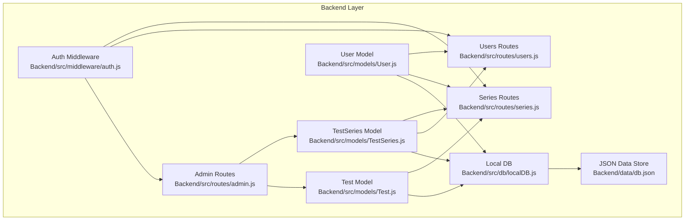
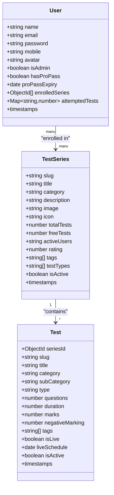
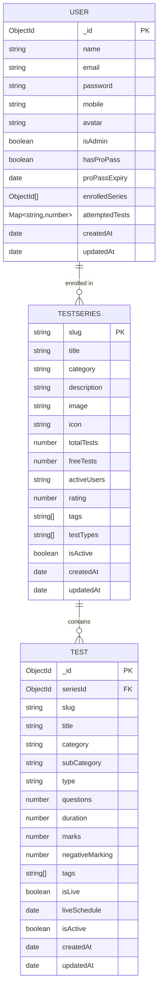
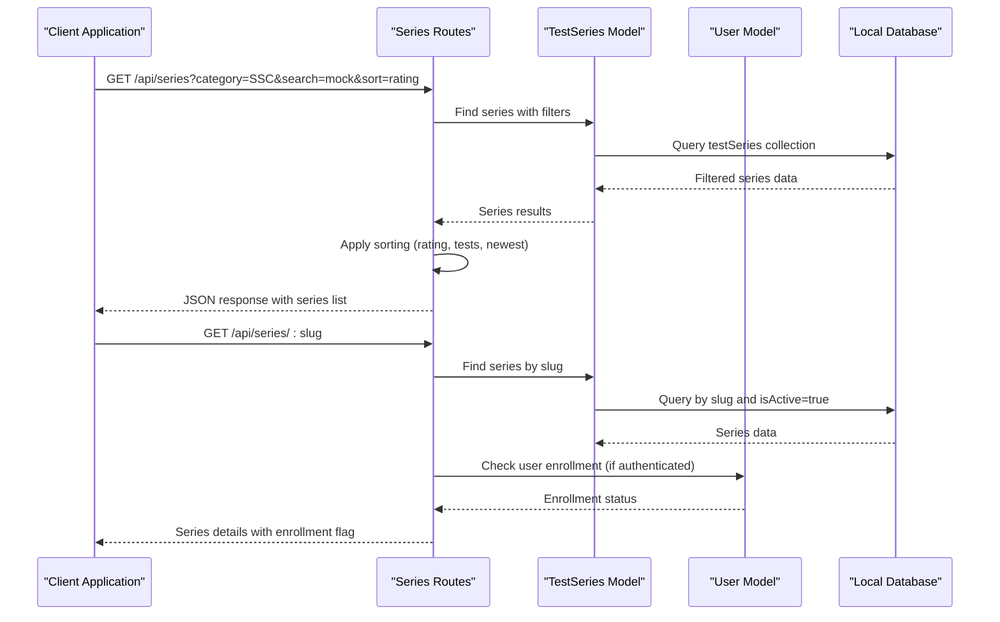
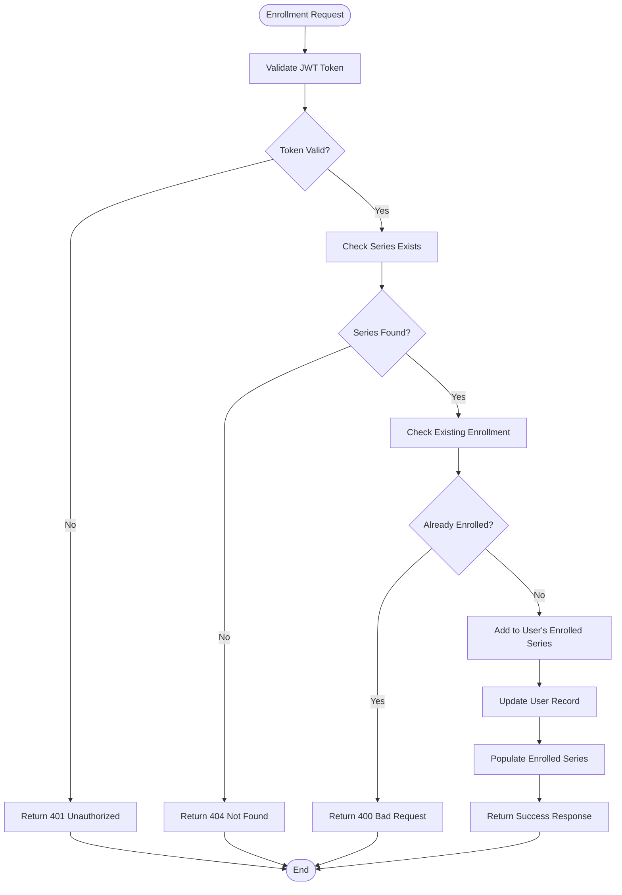
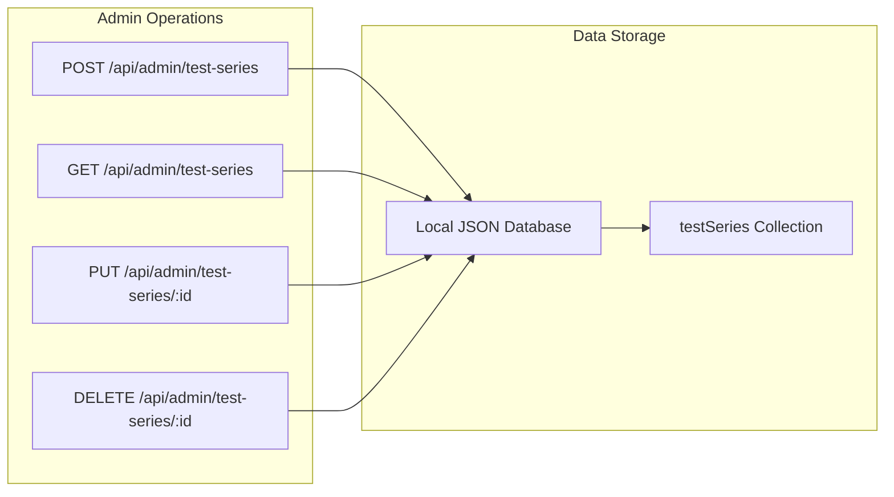
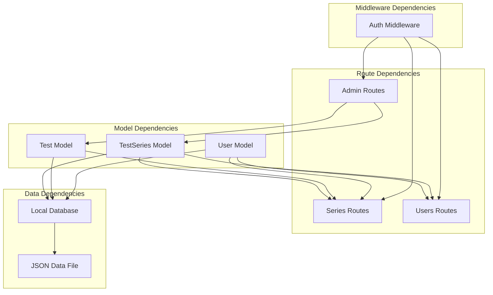

# TestSeries Model

<cite>
**Referenced Files in This Document**
- [TestSeries.js](file://Backend/src/models/TestSeries.js)
- [Test.js](file://Backend/src/models/Test.js)
- [User.js](file://Backend/src/models/User.js)
- [series.js](file://Backend/src/routes/series.js)
- [users.js](file://Backend/src/routes/users.js)
- [auth.js](file://Backend/src/middleware/auth.js)
- [localDB.js](file://Backend/src/db/localDB.js)
- [db.json](file://Backend/data/db.json)
- [admin.js](file://Backend/src/routes/admin.js)
</cite>

## Table of Contents
1. [Introduction](#introduction)
2. [Project Structure](#project-structure)
3. [Core Components](#core-components)
4. [Architecture Overview](#architecture-overview)
5. [Detailed Component Analysis](#detailed-component-analysis)
6. [Dependency Analysis](#dependency-analysis)
7. [Performance Considerations](#performance-considerations)
8. [Troubleshooting Guide](#troubleshooting-guide)
9. [Conclusion](#conclusion)

## Introduction
This document provides comprehensive data model documentation for the TestSeries model in Trstprep V2. It details all field definitions, validation rules, hierarchical organization, relationships with related models, and operational constraints. The TestSeries model serves as the central container for organized sets of practice tests, enabling structured exam preparation across multiple categories and subjects.

## Project Structure
The TestSeries model is part of a layered architecture:
- Data models define the schema and validation rules
- Routes handle API requests and implement business logic
- Middleware manages authentication and authorization
- Local database stores and retrieves data

**Diagram sources**
- [TestSeries.js](file://Backend/src/models/TestSeries.js#L1-L71)
- [Test.js](file://Backend/src/models/Test.js#L1-L77)
- [User.js](file://Backend/src/models/User.js#L1-L81)
- [series.js](file://Backend/src/routes/series.js#L1-L162)
- [users.js](file://Backend/src/routes/users.js#L1-L150)
- [admin.js](file://Backend/src/routes/admin.js#L1-L557)
- [auth.js](file://Backend/src/middleware/auth.js#L1-L92)
- [localDB.js](file://Backend/src/db/localDB.js#L1-L222)
- [db.json](file://Backend/data/db.json#L1-L728)

**Section sources**
- [TestSeries.js](file://Backend/src/models/TestSeries.js#L1-L71)
- [Test.js](file://Backend/src/models/Test.js#L1-L77)
- [User.js](file://Backend/src/models/User.js#L1-L81)
- [series.js](file://Backend/src/routes/series.js#L1-L162)
- [users.js](file://Backend/src/routes/users.js#L1-L150)
- [admin.js](file://Backend/src/routes/admin.js#L1-L557)
- [auth.js](file://Backend/src/middleware/auth.js#L1-L92)
- [localDB.js](file://Backend/src/db/localDB.js#L1-L222)
- [db.json](file://Backend/data/db.json#L1-L728)

## Core Components
The TestSeries model defines the structure for organized test collections. It includes essential metadata, categorization fields, and operational attributes.

Key characteristics:
- Schema-driven validation ensures data integrity
- Hierarchical organization through category and subcategory
- Embedded references to related Test records
- Integration with User enrollment system
- Soft deletion support via isActive flag

Field definitions and validation rules:
- slug: String, required, unique, lowercase, trimmed
- title: String, required, trimmed
- category: String, required, enum: ['SSC', 'Railway', 'Banking', 'Defence', 'State', 'Other']
- description: String, default empty
- image: String, default empty
- icon: String, default emoji
- totalTests: Number, default 0
- freeTests: Number, default 0
- activeUsers: String, default '0'
- rating: Number, default 4.5, min 0, max 5
- tags: Array of String
- testTypes: Array of String
- isActive: Boolean, default true

**Section sources**
- [TestSeries.js](file://Backend/src/models/TestSeries.js#L3-L69)

## Architecture Overview
The TestSeries model participates in several key relationships within the system:

**Diagram sources**
- [TestSeries.js](file://Backend/src/models/TestSeries.js#L3-L69)
- [Test.js](file://Backend/src/models/Test.js#L3-L76)
- [User.js](file://Backend/src/models/User.js#L4-L55)

The architecture supports:
- One-to-many relationship between TestSeries and Test
- Many-to-many relationship between User and TestSeries via enrollment
- Hierarchical categorization for organized content discovery
- Flexible filtering and sorting capabilities

**Section sources**
- [TestSeries.js](file://Backend/src/models/TestSeries.js#L3-L69)
- [Test.js](file://Backend/src/models/Test.js#L3-L76)
- [User.js](file://Backend/src/models/User.js#L4-L55)

## Detailed Component Analysis

### TestSeries Data Model
The TestSeries model establishes the foundation for organized test collections with comprehensive validation and indexing.

**Diagram sources**
- [TestSeries.js](file://Backend/src/models/TestSeries.js#L3-L69)
- [Test.js](file://Backend/src/models/Test.js#L3-L76)
- [User.js](file://Backend/src/models/User.js#L4-L55)

#### Field-Level Validation Constraints
The TestSeries model enforces strict validation rules:

- **Identity Fields**
  - slug: Unique identifier requiring lowercase conversion and trimming
  - title: Required field with whitespace trimming
  - category: Enumerated values limiting to predefined exam categories

- **Content Fields**
  - description: Optional with empty string default
  - image/icon: Optional with fallback values
  - tags/testTypes: Arrays supporting flexible categorization

- **Analytics Fields**
  - totalTests/freeTests: Numeric defaults for capacity tracking
  - rating: Constrained numeric range (0-5)
  - activeUsers: String representation for display

- **Operational Fields**
  - isActive: Boolean flag controlling visibility
  - Timestamps: Automatic createdAt/updatedAt management

#### Hierarchical Organization Structure
The model supports multi-level categorization:
- Primary category: SSC, Railway, Banking, Defence, State, Other
- Subcategory: Specific exam or subject specialization
- Tags: Flexible keyword-based organization
- Test types: Classification of contained Test records

#### Relationship with Test Model
Each TestSeries contains multiple Test records through the seriesId foreign key relationship. The Test model references back to its parent TestSeries, enabling bidirectional navigation and filtering.

#### Enrollment System Integration
The User model maintains an enrolledSeries array containing ObjectId references to TestSeries. This creates a many-to-many relationship allowing users to subscribe to multiple test series.

**Section sources**
- [TestSeries.js](file://Backend/src/models/TestSeries.js#L3-L69)
- [Test.js](file://Backend/src/models/Test.js#L3-L76)
- [User.js](file://Backend/src/models/User.js#L4-L55)

### API Workflow: Test Series Retrieval and Filtering
The series routes implement comprehensive filtering and sorting capabilities:

**Diagram sources**
- [series.js](file://Backend/src/routes/series.js#L8-L93)
- [TestSeries.js](file://Backend/src/models/TestSeries.js#L3-L69)
- [User.js](file://Backend/src/models/User.js#L4-L55)
- [localDB.js](file://Backend/src/db/localDB.js#L82-L133)

#### Filtering Capabilities
The system supports dynamic filtering through query parameters:
- Category filtering: Restrict to specific exam boards
- Text search: Full-text search across titles
- Sorting options: Rating, total tests, newest, popularity
- Active status: Default filtering for isActive=true

#### Enrollment Integration
Authenticated users receive enrollment status alongside series details, enabling personalized content presentation and access control.

**Section sources**
- [series.js](file://Backend/src/routes/series.js#L8-L93)
- [users.js](file://Backend/src/routes/users.js#L53-L95)

### API Workflow: User Enrollment Process
The enrollment system enables users to subscribe to test series with comprehensive validation:

**Diagram sources**
- [users.js](file://Backend/src/routes/users.js#L53-L95)
- [auth.js](file://Backend/src/middleware/auth.js#L5-L44)
- [User.js](file://Backend/src/models/User.js#L44-L47)
- [TestSeries.js](file://Backend/src/models/TestSeries.js#L3-L69)

#### Authentication and Authorization
The enrollment process requires:
- JWT token validation for user identification
- Admin middleware for administrative operations
- Optional authentication for public series access

#### Data Integrity
The system enforces:
- Unique series enrollment per user
- Atomic updates to user records
- Proper error handling for edge cases

**Section sources**
- [users.js](file://Backend/src/routes/users.js#L53-L95)
- [auth.js](file://Backend/src/middleware/auth.js#L5-L44)

### Administrative Operations
Administrative routes provide comprehensive management capabilities:

**Diagram sources**
- [admin.js](file://Backend/src/routes/admin.js#L31-L72)
- [localDB.js](file://Backend/src/db/localDB.js#L119-L185)

#### CRUD Operations
Administrators can:
- Create new test series with comprehensive metadata
- Retrieve all series for management
- Update existing series configurations
- Delete series with proper cleanup

#### Data Consistency
The local database implementation ensures:
- Atomic write operations
- Automatic timestamp management
- Consistent ID generation

**Section sources**
- [admin.js](file://Backend/src/routes/admin.js#L31-L72)
- [localDB.js](file://Backend/src/db/localDB.js#L119-L185)

## Dependency Analysis
The TestSeries model interacts with multiple components across the application stack:

**Diagram sources**
- [TestSeries.js](file://Backend/src/models/TestSeries.js#L1-L71)
- [Test.js](file://Backend/src/models/Test.js#L1-L77)
- [User.js](file://Backend/src/models/User.js#L1-L81)
- [series.js](file://Backend/src/routes/series.js#L1-L162)
- [users.js](file://Backend/src/routes/users.js#L1-L150)
- [admin.js](file://Backend/src/routes/admin.js#L1-L557)
- [auth.js](file://Backend/src/middleware/auth.js#L1-L92)
- [localDB.js](file://Backend/src/db/localDB.js#L1-L222)
- [db.json](file://Backend/data/db.json#L1-L728)

### Coupling and Cohesion
- **High cohesion**: TestSeries model encapsulates all series-related functionality
- **Moderate coupling**: Relies on shared database abstraction layer
- **Clear separation**: Models, routes, and middleware maintain distinct responsibilities

### External Dependencies
- MongoDB/Mongoose for schema definition and validation
- JWT tokens for authentication
- LowDB for local development database
- Express.js for routing framework

**Section sources**
- [TestSeries.js](file://Backend/src/models/TestSeries.js#L1-L71)
- [Test.js](file://Backend/src/models/Test.js#L1-L77)
- [User.js](file://Backend/src/models/User.js#L1-L81)
- [series.js](file://Backend/src/routes/series.js#L1-L162)
- [users.js](file://Backend/src/routes/users.js#L1-L150)
- [admin.js](file://Backend/src/routes/admin.js#L1-L557)
- [auth.js](file://Backend/src/middleware/auth.js#L1-L92)
- [localDB.js](file://Backend/src/db/localDB.js#L1-L222)

## Performance Considerations
The TestSeries model implements several optimizations for efficient data access:

### Indexing Strategy
- Category index for fast filtering by exam board
- isActive index for visibility control
- Composite indexes for common query patterns

### Query Optimization
- Selective field projection to minimize data transfer
- Efficient filtering using indexed fields
- Pagination support for large datasets

### Memory Management
- Lazy loading of related documents
- Streaming responses for large collections
- Connection pooling for database operations

## Troubleshooting Guide

### Common Issues and Solutions

#### Authentication Problems
- **Issue**: Users cannot enroll in series
- **Cause**: Missing or invalid JWT token
- **Solution**: Verify token presence and validity in Authorization header

#### Data Validation Errors
- **Issue**: Series creation fails validation
- **Cause**: Missing required fields or invalid enum values
- **Solution**: Ensure slug uniqueness, proper category values, and required fields

#### Enrollment Conflicts
- **Issue**: Duplicate enrollment errors
- **Cause**: Attempting to enroll in already subscribed series
- **Solution**: Check existing enrollment before attempting new enrollment

#### Database Connectivity
- **Issue**: Local database initialization failures
- **Cause**: File system permissions or corrupted data
- **Solution**: Verify database file accessibility and integrity

**Section sources**
- [auth.js](file://Backend/src/middleware/auth.js#L5-L44)
- [users.js](file://Backend/src/routes/users.js#L53-L95)
- [localDB.js](file://Backend/src/db/localDB.js#L48-L73)

## Conclusion
The TestSeries model in Trstprep V2 provides a robust foundation for organizing and managing educational test content. Its comprehensive schema validation, hierarchical categorization, and integrated enrollment system enable scalable content delivery across multiple exam categories. The model's design supports future enhancements while maintaining data integrity and performance optimization. The clear separation of concerns across models, routes, and middleware ensures maintainable and extensible functionality for the educational platform.

*Last Updated: March 10, 2026 | Update date is (20:16)*
