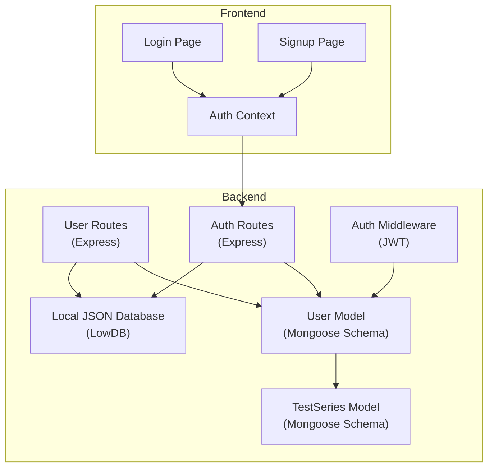
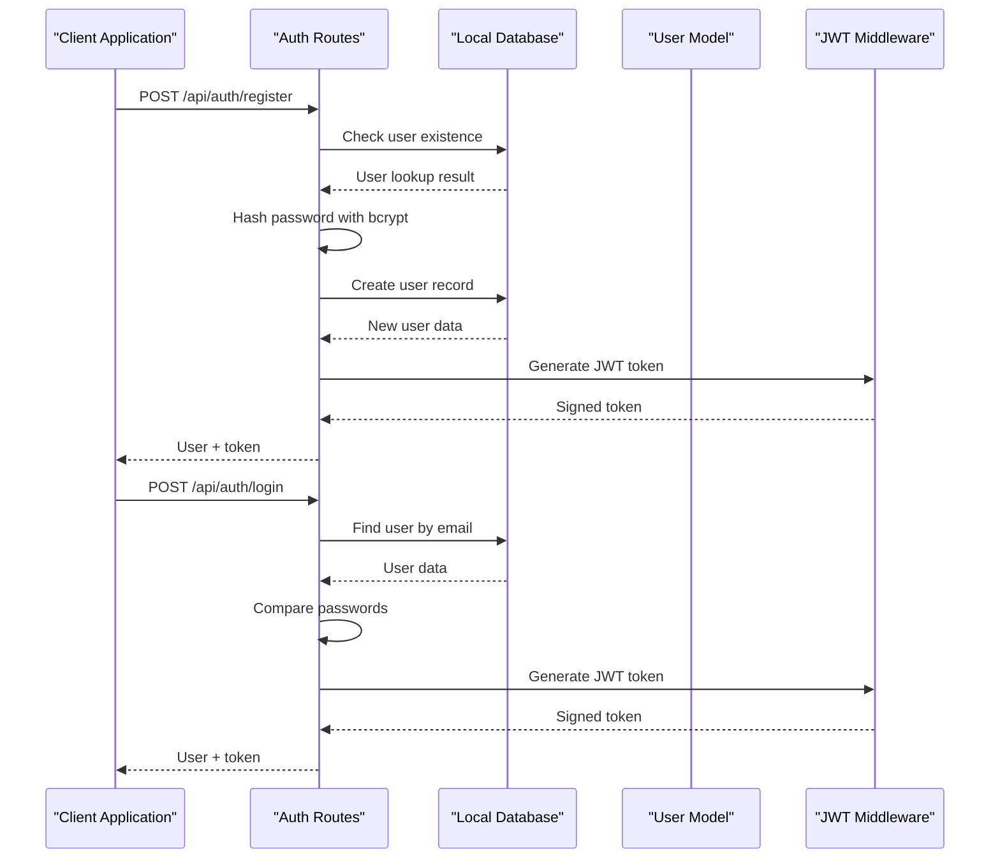
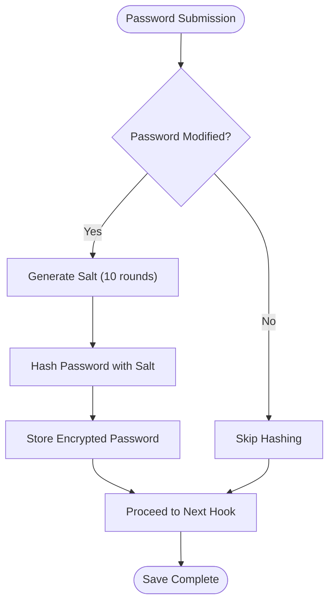
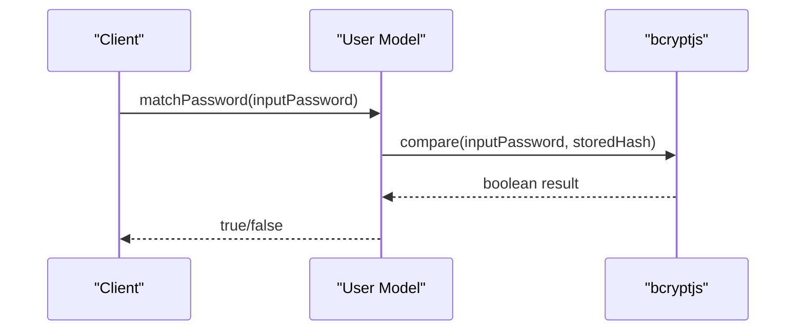
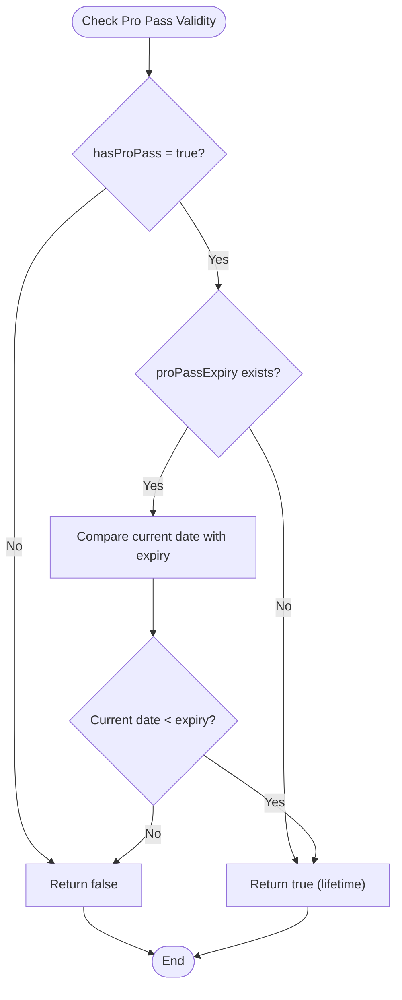
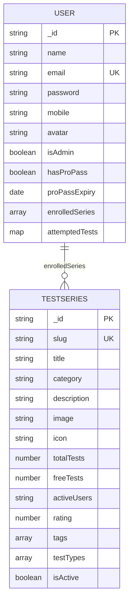
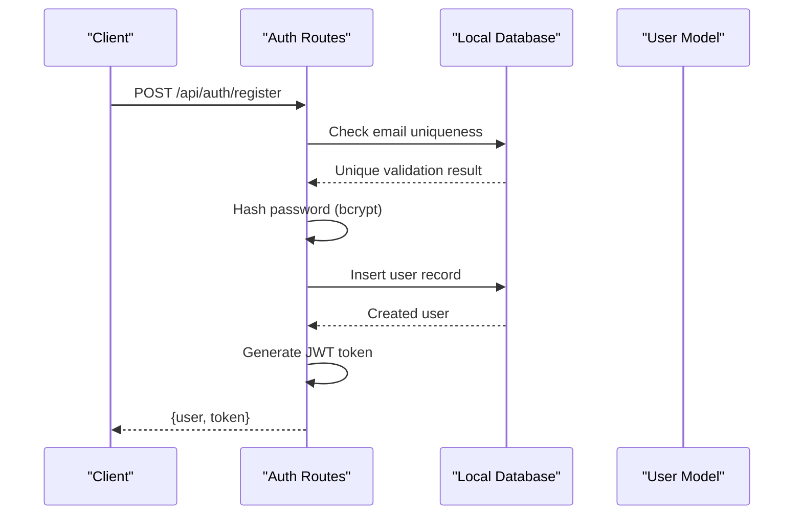
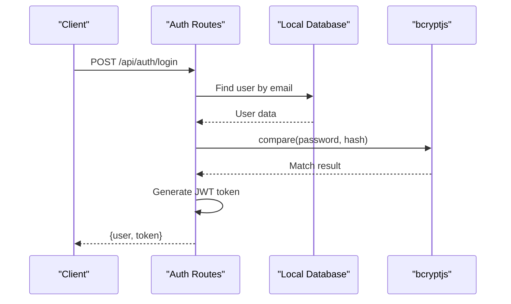
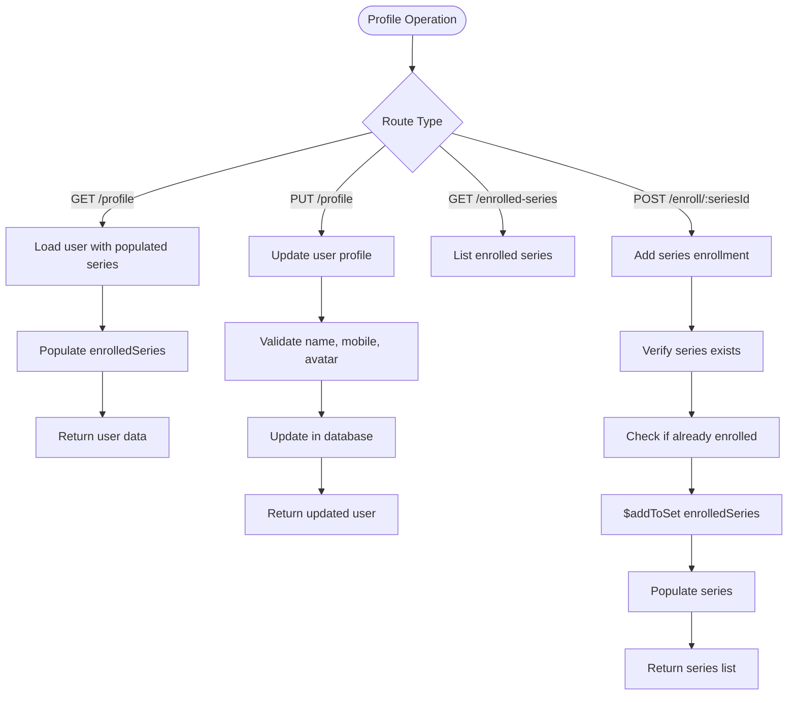
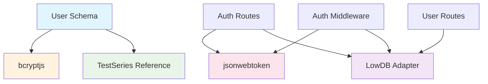

# User Model

<cite>
**Referenced Files in This Document**
- [User.js](file://Backend/src/models/User.js)
- [TestSeries.js](file://Backend/src/models/TestSeries.js)
- [users.js](file://Backend/src/routes/users.js)
- [auth.js](file://Backend/src/routes/auth.js)
- [localDB.js](file://Backend/src/db/localDB.js)
- [auth.js](file://Backend/src/middleware/auth.js)
- [Login.jsx](file://Frontend/src/pages/Login.jsx)
- [Signup.jsx](file://Frontend/src/pages/Signup.jsx)
- [AuthContext.jsx](file://Frontend/src/context/AuthContext.jsx)
</cite>

## Table of Contents
1. [Introduction](#introduction)
2. [Project Structure](#project-structure)
3. [Core Components](#core-components)
4. [Architecture Overview](#architecture-overview)
5. [Detailed Component Analysis](#detailed-component-analysis)
6. [Dependency Analysis](#dependency-analysis)
7. [Performance Considerations](#performance-considerations)
8. [Troubleshooting Guide](#troubleshooting-guide)
9. [Conclusion](#conclusion)

## Introduction
This document provides comprehensive data model documentation for the User model in Trstprep V2. It covers all field definitions, validation rules, constraints, relationships, and security mechanisms. The User model integrates with TestSeries through ObjectId references, manages subscription status via hasProPass and proPassExpiry fields, and implements robust password handling using bcryptjs. The documentation includes field-level validation messages, uniqueness constraints, default values, and practical examples for user creation, password verification, and subscription status checking.

## Project Structure
The User model is implemented in the backend using a hybrid approach combining Mongoose schemas for development and a local JSON database for runtime data persistence. The frontend provides authentication UI components and context management for user sessions.

**Diagram sources**
- [User.js](file://Backend/src/models/User.js#L1-L81)
- [TestSeries.js](file://Backend/src/models/TestSeries.js#L1-L71)
- [users.js](file://Backend/src/routes/users.js#L1-L150)
- [auth.js](file://Backend/src/routes/auth.js#L1-L174)
- [localDB.js](file://Backend/src/db/localDB.js#L1-L221)

**Section sources**
- [User.js](file://Backend/src/models/User.js#L1-L81)
- [TestSeries.js](file://Backend/src/models/TestSeries.js#L1-L71)
- [users.js](file://Backend/src/routes/users.js#L1-L150)
- [auth.js](file://Backend/src/routes/auth.js#L1-L174)
- [localDB.js](file://Backend/src/db/localDB.js#L1-L221)

## Core Components
The User model consists of two primary implementations:

### Backend Implementation (Mongoose Schema)
The backend uses a Mongoose schema with comprehensive validation rules and security measures:
- Field-level validation with custom error messages
- Password hashing using bcryptjs
- Relationship definitions with TestSeries
- Timestamp management

### Frontend Implementation (React Context)
The frontend manages user sessions through a React context provider with:
- Authentication state management
- Session persistence in localStorage
- User profile updates
- Pro Pass status tracking

**Section sources**
- [User.js](file://Backend/src/models/User.js#L4-L55)
- [AuthContext.jsx](file://Frontend/src/context/AuthContext.jsx#L13-L203)

## Architecture Overview
The User model architecture follows a layered approach with clear separation between data modeling, business logic, and presentation layers.

**Diagram sources**
- [auth.js](file://Backend/src/routes/auth.js#L16-L71)
- [localDB.js](file://Backend/src/db/localDB.js#L82-L132)
- [User.js](file://Backend/src/models/User.js#L58-L70)

## Detailed Component Analysis

### User Model Fields and Validation

#### Core Identity Fields
| Field | Type | Validation Rules | Constraints | Default Value |
|-------|------|------------------|-------------|---------------|
| name | String | required, maxlength: 50, trim | Required field with character limit | None |
| email | String | required, unique, lowercase, trim, match regex | Unique constraint, email format validation | None |
| password | String | required, minlength: 8, select: false | Hidden from default queries, minimum length | None |

#### Contact Information
| Field | Type | Validation Rules | Constraints | Default Value |
|-------|------|------------------|-------------|---------------|
| mobile | String | trim | Optional field | Empty string |

#### Profile Management
| Field | Type | Validation Rules | Constraints | Default Value |
|-------|------|------------------|-------------|---------------|
| avatar | String | - | Optional URL field | Empty string |

#### Role and Permissions
| Field | Type | Validation Rules | Constraints | Default Value |
|-------|------|------------------|-------------|---------------|
| isAdmin | Boolean | - | System administrator flag | false |

#### Subscription Management
| Field | Type | Validation Rules | Constraints | Default Value |
|-------|------|------------------|-------------|---------------|
| hasProPass | Boolean | - | Pro subscription status | false |
| proPassExpiry | Date | - | Subscription expiration date | null |

#### Relationships and Collections
| Field | Type | Validation Rules | Constraints | Default Value |
|-------|------|------------------|-------------|---------------|
| enrolledSeries | Array of ObjectId | - | References TestSeries collection | Empty array |
| attemptedTests | Map | - | Map structure: seriesId -> count | Empty object |

**Section sources**
- [User.js](file://Backend/src/models/User.js#L4-L55)

### Password Security Implementation

#### Password Hashing Mechanism
The User model implements secure password handling through bcryptjs:

**Diagram sources**
- [User.js](file://Backend/src/models/User.js#L58-L65)

#### Authentication Method
The matchPassword method provides secure password verification:

**Diagram sources**
- [User.js](file://Backend/src/models/User.js#L68-L70)

**Section sources**
- [User.js](file://Backend/src/models/User.js#L58-L70)

### Subscription Validation Logic

#### Pro Pass Status Checking
The isProPassValid method implements comprehensive subscription validation:

**Diagram sources**
- [User.js](file://Backend/src/models/User.js#L73-L77)

**Section sources**
- [User.js](file://Backend/src/models/User.js#L73-L77)

### Relationship Management

#### TestSeries Enrollment
The User model maintains enrollment relationships through ObjectId references:

**Diagram sources**
- [User.js](file://Backend/src/models/User.js#L44-L47)
- [TestSeries.js](file://Backend/src/models/TestSeries.js#L3-L63)

**Section sources**
- [User.js](file://Backend/src/models/User.js#L44-L47)
- [TestSeries.js](file://Backend/src/models/TestSeries.js#L3-L63)

### API Endpoints and Usage Examples

#### User Creation Workflow
The registration process demonstrates complete field validation and security implementation:

**Diagram sources**
- [auth.js](file://Backend/src/routes/auth.js#L19-L71)
- [localDB.js](file://Backend/src/db/localDB.js#L118-L132)

#### User Authentication Flow
The login process validates credentials and manages session tokens:

**Diagram sources**
- [auth.js](file://Backend/src/routes/auth.js#L76-L124)
- [localDB.js](file://Backend/src/db/localDB.js#L104-L110)

#### Profile Management Operations
The user routes demonstrate CRUD operations with validation:

**Diagram sources**
- [users.js](file://Backend/src/routes/users.js#L8-L115)

**Section sources**
- [auth.js](file://Backend/src/routes/auth.js#L16-L124)
- [users.js](file://Backend/src/routes/users.js#L8-L115)

### Security Considerations

#### Password Handling Security
- Passwords are hashed using bcrypt with 10 rounds of salt generation
- Passwords are excluded from default query results using `select: false`
- Password comparison uses bcrypt's timing-safe comparison
- No plaintext passwords are ever stored or transmitted

#### Authentication Security
- JWT tokens are generated with configurable expiration
- Token verification validates signature and expiration
- User objects are sanitized to remove sensitive fields before transport
- Rate limiting and validation implemented in frontend components

#### Data Integrity
- Email uniqueness enforced at database level
- Password minimum length requirement prevents weak credentials
- Input trimming removes whitespace from sensitive fields
- ObjectId references ensure referential integrity with TestSeries

**Section sources**
- [User.js](file://Backend/src/models/User.js#L58-L70)
- [auth.js](file://Backend/src/routes/auth.js#L9-L14)
- [auth.js](file://Backend/src/middleware/auth.js#L34-L36)

## Dependency Analysis

**Diagram sources**
- [User.js](file://Backend/src/models/User.js#L1-L2)
- [auth.js](file://Backend/src/routes/auth.js#L1-L5)
- [auth.js](file://Backend/src/middleware/auth.js#L1-L2)

### Field-Level Validation Messages
The User model defines comprehensive validation messages for each field:

- **Name**: "Name is required" (required), "Name cannot exceed 50 characters" (maxlength)
- **Email**: "Email is required" (required), "Please enter a valid email" (match regex)
- **Password**: "Password is required" (required), "Password must be at least 8 characters" (minlength)

### Uniqueness Constraints
- Email field has unique constraint preventing duplicate accounts
- Slug field in TestSeries has unique constraint for URL-friendly identifiers

### Default Values
- avatar: Empty string
- isAdmin: false
- hasProPass: false
- proPassExpiry: null
- attemptedTests: Empty object
- timestamps: Automatic createdAt/updatedAt fields

**Section sources**
- [User.js](file://Backend/src/models/User.js#L4-L55)
- [TestSeries.js](file://Backend/src/models/TestSeries.js#L4-L10)

## Performance Considerations
- Password hashing uses 10 rounds of bcrypt, providing good security balance
- Email queries benefit from database indexing for fast lookups
- Population of enrolledSeries occurs only when needed
- Selective field retrieval prevents unnecessary data transfer
- Local database operations are optimized for small-scale usage

## Troubleshooting Guide

### Common Authentication Issues
- **Invalid credentials**: Check email format and password length requirements
- **Duplicate email**: Verify email uniqueness before registration
- **Token expiration**: Implement proper token refresh mechanisms
- **Password mismatch**: Ensure bcrypt comparison is used for verification

### Database Connection Issues
- **Local database initialization**: Ensure db.json file exists and is writable
- **Collection access**: Verify all required collections are present
- **Data serialization**: Check JSON file integrity and encoding

### Frontend Authentication Problems
- **Session persistence**: Verify localStorage availability and quota limits
- **Token storage**: Check browser security policies affecting cookie/localStorage
- **Route protection**: Ensure auth middleware is properly configured

**Section sources**
- [localDB.js](file://Backend/src/db/localDB.js#L47-L72)
- [auth.js](file://Backend/src/middleware/auth.js#L5-L44)

## Conclusion
The User model in Trstprep V2 provides a robust foundation for user management with comprehensive security measures, validation rules, and relationship handling. The implementation balances security requirements with usability, providing clear validation feedback and secure password handling. The modular architecture allows for easy extension while maintaining data integrity and user experience consistency across both backend and frontend implementations.

*Last Updated: March 10, 2026 | Update date is (20:16)*
