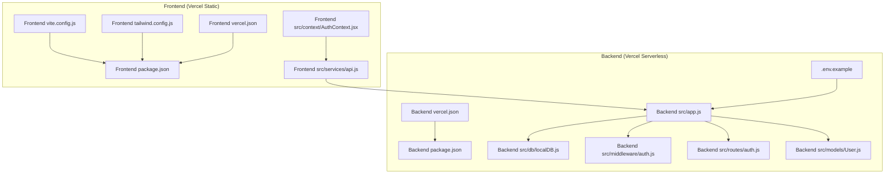
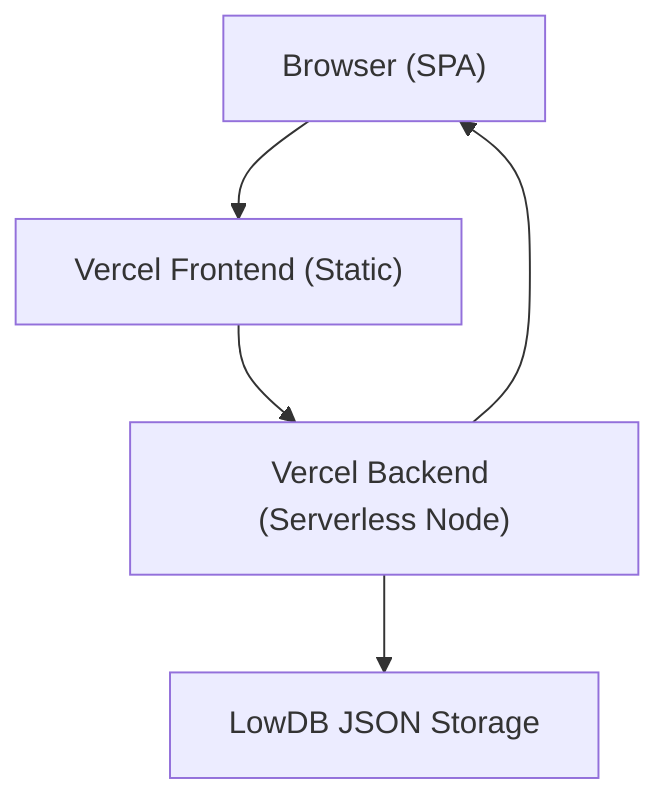
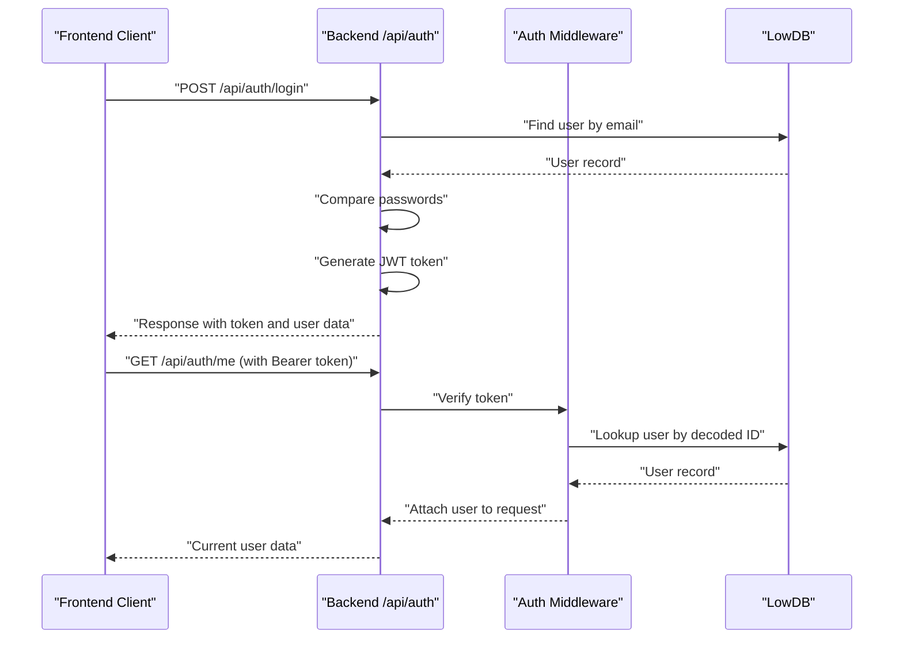
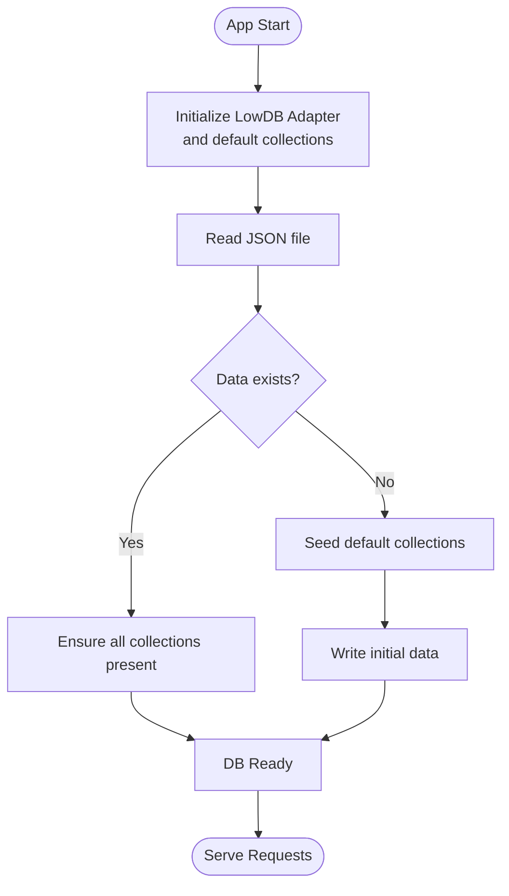
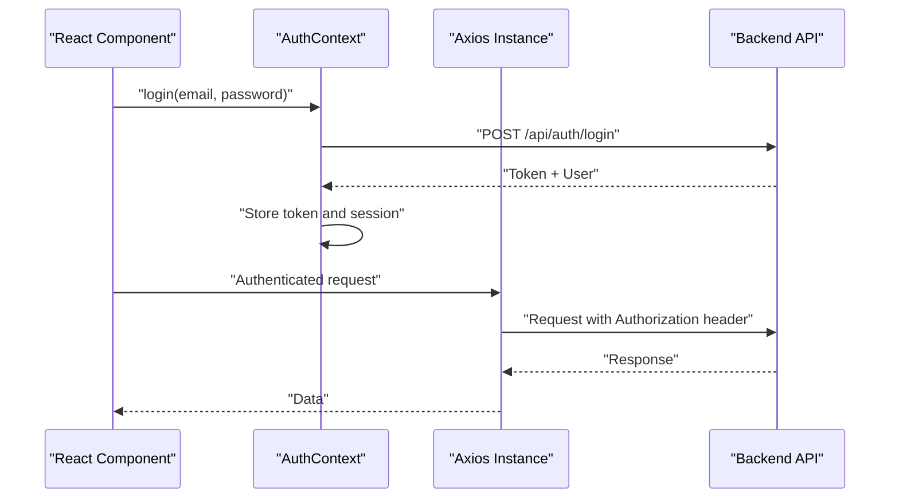
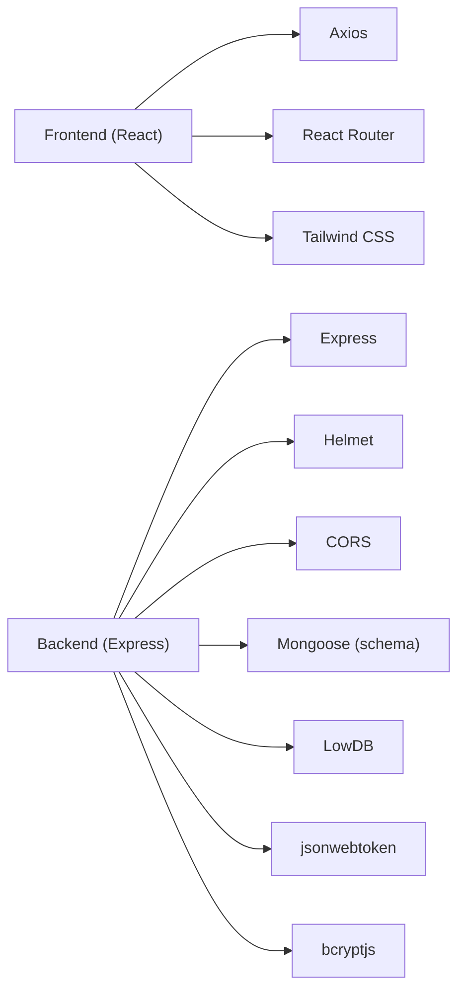

# Deployment & DevOps

<cite>
**Referenced Files in This Document**
- [Backend package.json](file://Backend/package.json)
- [Backend vercel.json](file://Backend/vercel.json)
- [Backend .env.example](file://Backend/.env.example)
- [Backend src/app.js](file://Backend/src/app.js)
- [Backend src/db/localDB.js](file://Backend/src/db/localDB.js)
- [Backend src/middleware/auth.js](file://Backend/src/middleware/auth.js)
- [Backend src/routes/auth.js](file://Backend/src/routes/auth.js)
- [Backend src/models/User.js](file://Backend/src/models/User.js)
- [Frontend package.json](file://Frontend/package.json)
- [Frontend vercel.json](file://Frontend/vercel.json)
- [Frontend vite.config.js](file://Frontend/vite.config.js)
- [Frontend tailwind.config.js](file://Frontend/tailwind.config.js)
- [Frontend src/services/api.js](file://Frontend/src/services/api.js)
- [Frontend src/context/AuthContext.jsx](file://Frontend/src/context/AuthContext.jsx)
</cite>

## Table of Contents
1. [Introduction](#introduction)
2. [Project Structure](#project-structure)
3. [Core Components](#core-components)
4. [Architecture Overview](#architecture-overview)
5. [Detailed Component Analysis](#detailed-component-analysis)
6. [Dependency Analysis](#dependency-analysis)
7. [Performance Considerations](#performance-considerations)
8. [Security & Compliance](#security--compliance)
9. [Production Setup Procedures](#production-setup-procedures)
10. [CI/CD Pipeline Configuration](#cicd-pipeline-configuration)
11. [Monitoring & Observability](#monitoring--observability)
12. [Backup & Disaster Recovery](#backup--disaster-recovery)
13. [Maintenance Schedule](#maintenance-schedule)
14. [Troubleshooting Guide](#troubleshooting-guide)
15. [Rollback Procedures](#rollback-procedures)
16. [Conclusion](#conclusion)

## Introduction
This document provides comprehensive deployment and DevOps guidance for Trstprep V2, covering both frontend and backend deployments via Vercel, environment variable management, production setup, CI/CD configuration, serverless deployment characteristics, scaling considerations, monitoring strategies, security best practices, SSL/TLS and access control, backup and DR plans, performance optimization, caching and CDN integration, troubleshooting, and rollback procedures.

## Project Structure
Trstprep V2 follows a clear separation of concerns:
- Frontend: React application built with Vite, configured for development proxy and production builds.
- Backend: Node.js/Express API using lowdb for local JSON storage, with Vercel serverless deployment configuration.
- Shared configuration: Environment variables for backend, Vercel platform configuration for both apps, and client-side API base URL resolution.

**Diagram sources**
- [Frontend package.json](file://Frontend/package.json#L1-L35)
- [Frontend vercel.json](file://Frontend/vercel.json#L1-L6)
- [Frontend vite.config.js](file://Frontend/vite.config.js#L1-L21)
- [Frontend tailwind.config.js](file://Frontend/tailwind.config.js#L1-L33)
- [Frontend src/services/api.js](file://Frontend/src/services/api.js#L1-L92)
- [Frontend src/context/AuthContext.jsx](file://Frontend/src/context/AuthContext.jsx#L1-L203)
- [Backend package.json](file://Backend/package.json#L1-L32)
- [Backend vercel.json](file://Backend/vercel.json#L1-L16)
- [Backend src/app.js](file://Backend/src/app.js#L1-L94)
- [Backend src/db/localDB.js](file://Backend/src/db/localDB.js#L1-L221)
- [Backend src/middleware/auth.js](file://Backend/src/middleware/auth.js#L1-L92)
- [Backend src/routes/auth.js](file://Backend/src/routes/auth.js#L1-L174)
- [Backend src/models/User.js](file://Backend/src/models/User.js#L1-L81)
- [Backend .env.example](file://Backend/.env.example#L1-L17)

**Section sources**
- [Frontend package.json](file://Frontend/package.json#L1-L35)
- [Backend package.json](file://Backend/package.json#L1-L32)
- [Frontend vercel.json](file://Frontend/vercel.json#L1-L6)
- [Backend vercel.json](file://Backend/vercel.json#L1-L16)
- [Frontend vite.config.js](file://Frontend/vite.config.js#L1-L21)
- [Frontend tailwind.config.js](file://Frontend/tailwind.config.js#L1-L33)
- [Frontend src/services/api.js](file://Frontend/src/services/api.js#L1-L92)
- [Frontend src/context/AuthContext.jsx](file://Frontend/src/context/AuthContext.jsx#L1-L203)
- [Backend src/app.js](file://Backend/src/app.js#L1-L94)
- [Backend src/db/localDB.js](file://Backend/src/db/localDB.js#L1-L221)
- [Backend src/middleware/auth.js](file://Backend/src/middleware/auth.js#L1-L92)
- [Backend src/routes/auth.js](file://Backend/src/routes/auth.js#L1-L174)
- [Backend src/models/User.js](file://Backend/src/models/User.js#L1-L81)
- [Backend .env.example](file://Backend/.env.example#L1-L17)

## Core Components
- Frontend (React/Vite): Serves static assets and proxies API requests during development. Production builds are deployed to Vercel.
- Backend (Express/lowdb): Provides REST endpoints for authentication, user management, test series, tests, and study materials. Uses lowdb for local JSON storage and supports migration to MongoDB.
- Vercel Platform: Configured via vercel.json for serverless Node.js backend and static frontend rewrites.

Key deployment artifacts:
- Backend: vercel.json defines serverless build and route handling; package.json scripts and engines define runtime behavior.
- Frontend: vercel.json rewrites all routes to index.html for SPA routing; vite.config.js configures dev proxy and build output.

**Section sources**
- [Backend vercel.json](file://Backend/vercel.json#L1-L16)
- [Backend package.json](file://Backend/package.json#L1-L32)
- [Backend src/app.js](file://Backend/src/app.js#L1-L94)
- [Backend src/db/localDB.js](file://Backend/src/db/localDB.js#L1-L221)
- [Frontend vercel.json](file://Frontend/vercel.json#L1-L6)
- [Frontend vite.config.js](file://Frontend/vite.config.js#L1-L21)

## Architecture Overview
Trstprep V2 employs a decoupled architecture:
- Frontend (Vercel Static) handles UI and user interactions.
- Backend (Vercel Serverless) exposes REST APIs and manages data via lowdb.
- Authentication uses JWT tokens stored in browser storage; protected routes enforce authorization middleware.
- CORS is configured to allow frontend origin; Helmet secures HTTP headers.

**Diagram sources**
- [Frontend vercel.json](file://Frontend/vercel.json#L1-L6)
- [Backend vercel.json](file://Backend/vercel.json#L1-L16)
- [Backend src/app.js](file://Backend/src/app.js#L1-L94)
- [Backend src/db/localDB.js](file://Backend/src/db/localDB.js#L1-L221)

## Detailed Component Analysis

### Backend API Flow (Authentication)
This sequence illustrates the login flow and token issuance.

**Diagram sources**
- [Backend src/routes/auth.js](file://Backend/src/routes/auth.js#L1-L174)
- [Backend src/middleware/auth.js](file://Backend/src/middleware/auth.js#L1-L92)
- [Backend src/db/localDB.js](file://Backend/src/db/localDB.js#L1-L221)

**Section sources**
- [Backend src/routes/auth.js](file://Backend/src/routes/auth.js#L1-L174)
- [Backend src/middleware/auth.js](file://Backend/src/middleware/auth.js#L1-L92)
- [Backend src/db/localDB.js](file://Backend/src/db/localDB.js#L1-L221)

### Database Abstraction Layer (LowDB)
LowDB is initialized at startup and provides helper functions to mimic MongoDB operations. It reads/writes to a JSON file located under the backend data directory.

**Diagram sources**
- [Backend src/db/localDB.js](file://Backend/src/db/localDB.js#L1-L221)
- [Backend src/app.js](file://Backend/src/app.js#L68-L89)

**Section sources**
- [Backend src/db/localDB.js](file://Backend/src/db/localDB.js#L1-L221)
- [Backend src/app.js](file://Backend/src/app.js#L68-L89)

### Frontend API Client and Auth Context
The frontend uses Axios with interceptors to attach JWT tokens and handle unauthorized responses. The AuthContext manages session state and local storage persistence.

**Diagram sources**
- [Frontend src/context/AuthContext.jsx](file://Frontend/src/context/AuthContext.jsx#L1-L203)
- [Frontend src/services/api.js](file://Frontend/src/services/api.js#L1-L92)
- [Backend src/routes/auth.js](file://Backend/src/routes/auth.js#L1-L174)

**Section sources**
- [Frontend src/context/AuthContext.jsx](file://Frontend/src/context/AuthContext.jsx#L1-L203)
- [Frontend src/services/api.js](file://Frontend/src/services/api.js#L1-L92)
- [Backend src/routes/auth.js](file://Backend/src/routes/auth.js#L1-L174)

## Dependency Analysis
- Frontend depends on React, React Router, Axios, and Tailwind CSS. Vite provides dev server and build tooling.
- Backend depends on Express, Helmet, CORS, Morgan, bcrypt, jsonwebtoken, lowdb, and mongoose (schema present but not used in runtime).
- Both applications rely on Vercel for deployment and routing.

**Diagram sources**
- [Frontend package.json](file://Frontend/package.json#L1-L35)
- [Backend package.json](file://Backend/package.json#L1-L32)
- [Backend src/models/User.js](file://Backend/src/models/User.js#L1-L81)

**Section sources**
- [Frontend package.json](file://Frontend/package.json#L1-L35)
- [Backend package.json](file://Backend/package.json#L1-L32)
- [Backend src/models/User.js](file://Backend/src/models/User.js#L1-L81)

## Performance Considerations
- Build optimization: Enable minification and chunk splitting via Vite for production builds.
- Asset delivery: Serve static assets through Vercel’s global CDN for reduced latency.
- Database I/O: LowDB writes occur on mutation; batch operations where possible to reduce write frequency.
- Caching: Implement cache-control headers for static assets; consider CDN caching policies.
- Monitoring: Track response times, error rates, and cold starts for serverless functions.

[No sources needed since this section provides general guidance]

## Security & Compliance
- Transport security: Use HTTPS enforced by Vercel; configure custom domains with TLS certificates.
- Access control: JWT-based bearer tokens; ensure secure, same-site cookies are used if adopting server sessions.
- Secrets management: Store JWT secret and environment variables in Vercel’s project settings; avoid committing secrets to the repository.
- Headers: Helmet is enabled; ensure CSP and HSTS policies align with your domain and CDN configuration.
- CORS: Restrict origins to production frontend URL; enable credentials only when necessary.
- Input validation: Use express-validator for request sanitization and validation.

**Section sources**
- [Backend src/app.js](file://Backend/src/app.js#L27-L32)
- [Backend src/middleware/auth.js](file://Backend/src/middleware/auth.js#L1-L92)
- [Backend .env.example](file://Backend/.env.example#L1-L17)

## Production Setup Procedures
- Environment variables:
  - Set NODE_ENV to production.
  - Configure MONGODB_URI for MongoDB migration (optional).
  - Set JWT_SECRET to a strong, random value.
  - Set FRONTEND_URL to your production frontend origin.
- Deploy backend:
  - Push to Vercel; ensure vercel.json build and route rules are applied.
  - Configure environment variables in Vercel dashboard.
- Deploy frontend:
  - Push to Vercel; ensure SPA rewrites are active.
  - Configure environment variables (e.g., VITE_API_URL) in Vercel dashboard.
- Domain and SSL:
  - Connect custom domain in Vercel.
  - Enable automatic certificate provisioning or upload your certificate.
- Health checks:
  - Monitor /api/health endpoint for backend status.

**Section sources**
- [Backend .env.example](file://Backend/.env.example#L1-L17)
- [Backend vercel.json](file://Backend/vercel.json#L1-L16)
- [Frontend vercel.json](file://Frontend/vercel.json#L1-L6)
- [Backend src/app.js](file://Backend/src/app.js#L47-L54)

## CI/CD Pipeline Configuration
Recommended pipeline stages:
- Build:
  - Frontend: Run build script and produce dist artifacts.
  - Backend: Install dependencies and validate Node engine.
- Test:
  - Run linting and unit tests (if applicable).
- Deploy:
  - Deploy frontend to Vercel preview/production.
  - Deploy backend to Vercel preview/production.
- Rollback:
  - Use Vercel’s version history and branch protection to roll back to previous deployments.

[No sources needed since this section provides general guidance]

## Monitoring & Observability
- Logs:
  - Enable Vercel logs for backend and frontend.
  - Use Morgan in development; disable in production or integrate with structured logging.
- Metrics:
  - Track function duration, error rate, and cold starts for serverless backend.
- Alerts:
  - Set up alerts for high error rates, slow response times, and downtime.
- Distributed tracing:
  - Integrate with a tracing provider if needed for distributed visibility.

**Section sources**
- [Backend src/app.js](file://Backend/src/app.js#L42-L44)

## Backup & Disaster Recovery
- Data:
  - LowDB JSON file is the primary data store; back up the data/db.json file regularly.
  - For migration readiness, export/import MongoDB collections periodically.
- Recovery:
  - Restore JSON file from backups to the same path.
  - Validate application health via /api/health after restore.
- DR Plan:
  - Maintain offsite backups.
  - Automate periodic exports and store in secure cloud storage.

**Section sources**
- [Backend src/db/localDB.js](file://Backend/src/db/localDB.js#L47-L72)
- [Backend src/app.js](file://Backend/src/app.js#L68-L89)

## Maintenance Schedule
- Weekly:
  - Review logs and error reports.
  - Validate database integrity and backup copies.
- Monthly:
  - Rotate JWT secret and refresh tokens.
  - Update dependencies and rebuild/deploy.
- Quarterly:
  - Evaluate CDN caching and asset optimization.
  - Assess serverless cold start performance and optimize where needed.

[No sources needed since this section provides general guidance]

## Troubleshooting Guide
Common issues and resolutions:
- CORS errors:
  - Ensure FRONTEND_URL matches the origin exactly.
- 401 Unauthorized:
  - Verify JWT token presence and validity; check token expiration.
- Database connectivity:
  - Confirm LowDB file path and permissions; verify data initialization.
- SPA routing:
  - Ensure frontend rewrites are active in vercel.json.
- Cold starts:
  - Optimize bundle size; consider edge caching and CDN.

**Section sources**
- [Backend src/app.js](file://Backend/src/app.js#L27-L32)
- [Backend src/middleware/auth.js](file://Backend/src/middleware/auth.js#L1-L92)
- [Frontend vercel.json](file://Frontend/vercel.json#L1-L6)

## Rollback Procedures
- Backend:
  - Use Vercel dashboard to revert to a previous deployment.
  - If necessary, redeploy a known-good commit.
- Frontend:
  - Revert to the previous successful build in Vercel.
- Data:
  - Restore LowDB JSON from the latest backup if corruption occurs.
- Post-rollback verification:
  - Smoke test login, protected routes, and core functionality.
  - Confirm /api/health endpoint responds.

**Section sources**
- [Backend vercel.json](file://Backend/vercel.json#L1-L16)
- [Frontend vercel.json](file://Frontend/vercel.json#L1-L6)
- [Backend src/db/localDB.js](file://Backend/src/db/localDB.js#L47-L72)

## Conclusion
Trstprep V2 is designed for straightforward serverless deployment using Vercel. The backend leverages Express with Helmet and lowdb, while the frontend is a React application built with Vite and served statically. By following the deployment and DevOps practices outlined—secure environment management, CDN-backed asset delivery, robust monitoring, and resilient backup/DR procedures—you can operate a reliable, scalable, and secure production environment.

*Last Updated: March 10, 2026 | Update date is (20:16)*
