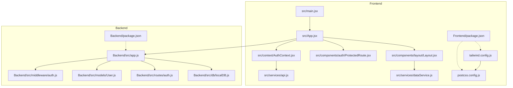
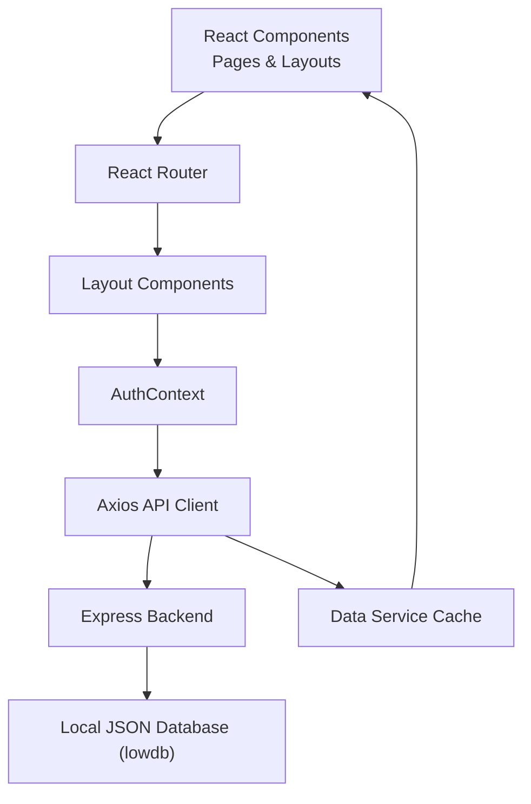
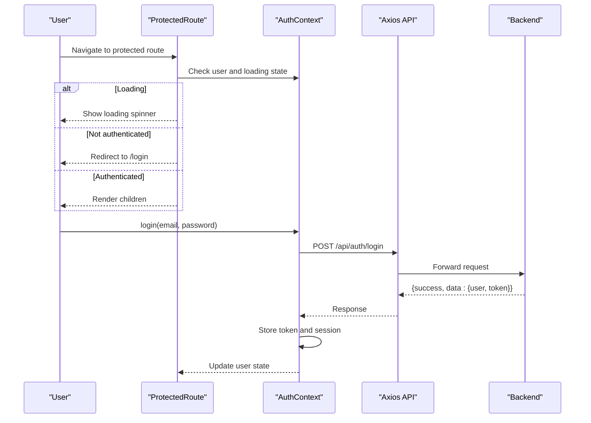
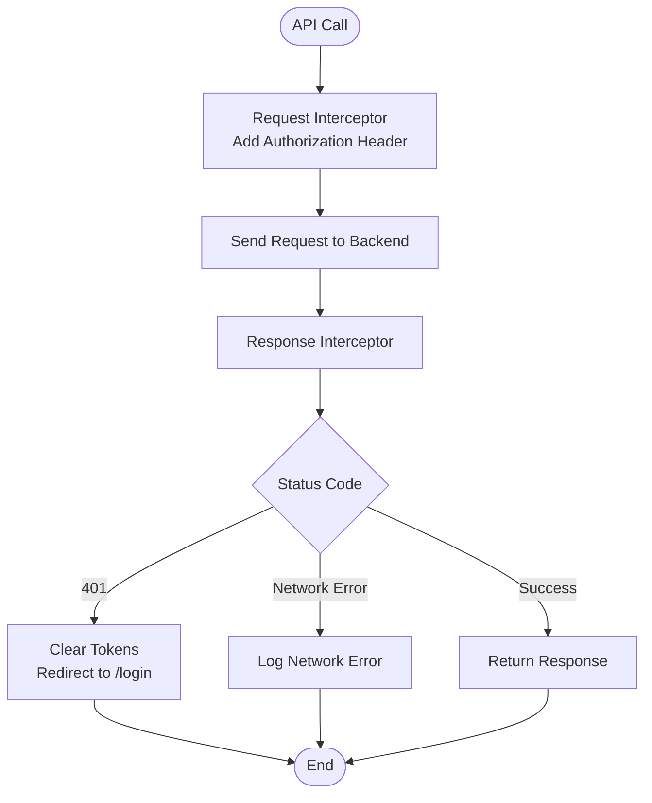
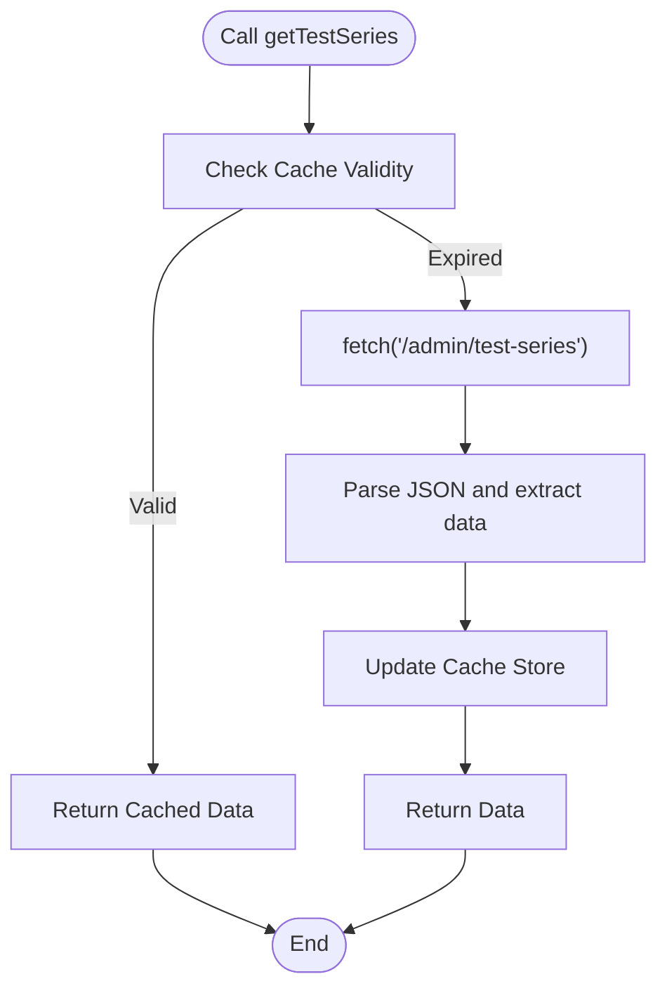
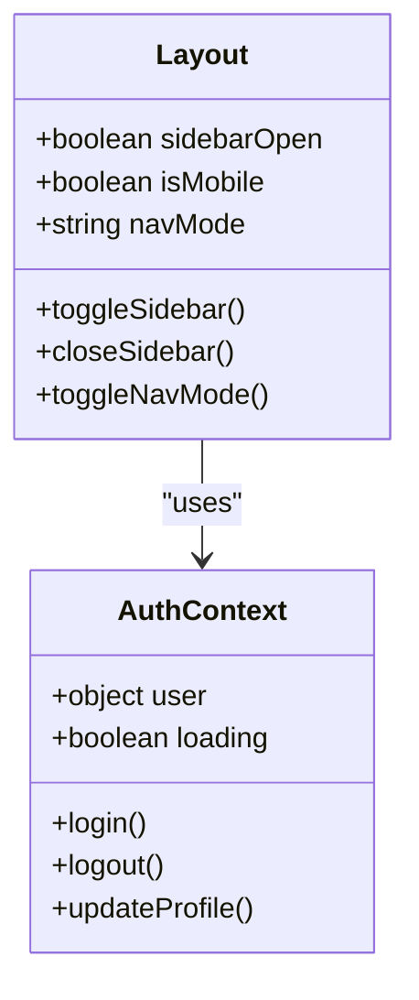
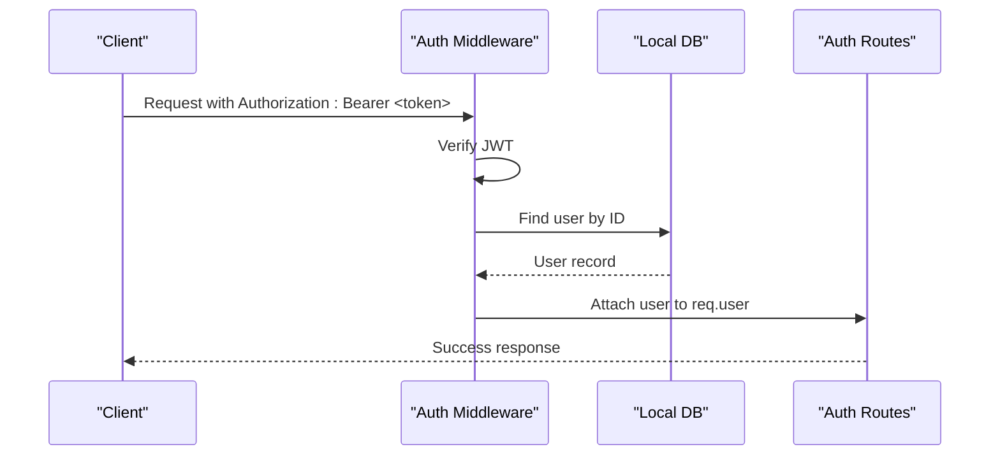
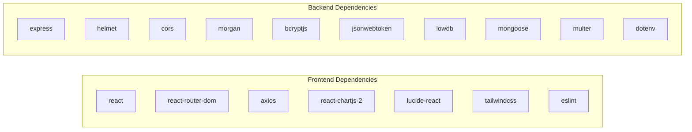

# Development Guidelines

<cite>
**Referenced Files in This Document**
- [package.json](file://Frontend/package.json)
- [tailwind.config.js](file://Frontend/tailwind.config.js)
- [postcss.config.js](file://Frontend/postcss.config.js)
- [main.jsx](file://Frontend/src/main.jsx)
- [App.jsx](file://Frontend/src/App.jsx)
- [Layout.jsx](file://Frontend/src/components/layout/Layout.jsx)
- [ProtectedRoute.jsx](file://Frontend/src/components/auth/ProtectedRoute.jsx)
- [AuthContext.jsx](file://Frontend/src/context/AuthContext.jsx)
- [api.js](file://Frontend/src/services/api.js)
- [dataService.js](file://Frontend/src/services/dataService.js)
- [Dashboard.jsx](file://Frontend/src/pages/Dashboard.jsx)
- [backend package.json](file://Backend/package.json)
- [Backend app.js](file://Backend/src/app.js)
- [auth middleware](file://Backend/src/middleware/auth.js)
- [User model](file://Backend/src/models/User.js)
- [auth routes](file://Backend/src/routes/auth.js)
- [localDB](file://Backend/src/db/localDB.js)
</cite>

## Table of Contents
1. [Introduction](#introduction)
2. [Project Structure](#project-structure)
3. [Core Components](#core-components)
4. [Architecture Overview](#architecture-overview)
5. [Detailed Component Analysis](#detailed-component-analysis)
6. [Dependency Analysis](#dependency-analysis)
7. [Performance Considerations](#performance-considerations)
8. [Troubleshooting Guide](#troubleshooting-guide)
9. [Contribution Guidelines](#contribution-guidelines)
10. [Testing Requirements](#testing-requirements)
11. [Documentation Standards](#documentation-standards)
12. [Development Workflow](#development-workflow)
13. [Styling and Accessibility Standards](#styling-and-accessibility-standards)
14. [Conclusion](#conclusion)

## Introduction
This document provides comprehensive development guidelines for Trstprep V2 contributors. It covers JavaScript/React coding standards, component architecture patterns, state management best practices, performance optimization, styling with TailwindCSS, responsive design, accessibility requirements, contribution workflows, testing, and documentation standards. The guidelines are derived from the existing codebase and aim to maintain consistency, readability, and scalability across the frontend and backend.

## Project Structure
Trstprep V2 follows a dual-repository structure with a React frontend and an Express backend. The frontend uses Vite, React 18, React Router DOM, Axios, and TailwindCSS. The backend uses Express, lowdb for local storage, JWT for authentication, and environment-based configuration.

**Diagram sources**
- [main.jsx](file://Frontend/src/main.jsx#L1-L17)
- [App.jsx](file://Frontend/src/App.jsx#L1-L143)
- [Layout.jsx](file://Frontend/src/components/layout/Layout.jsx#L1-L87)
- [ProtectedRoute.jsx](file://Frontend/src/components/auth/ProtectedRoute.jsx#L1-L29)
- [AuthContext.jsx](file://Frontend/src/context/AuthContext.jsx#L1-L203)
- [api.js](file://Frontend/src/services/api.js#L1-L92)
- [dataService.js](file://Frontend/src/services/dataService.js#L1-L172)
- [tailwind.config.js](file://Frontend/tailwind.config.js#L1-L33)
- [postcss.config.js](file://Frontend/postcss.config.js#L1-L7)
- [package.json](file://Frontend/package.json#L1-L35)
- [Backend app.js](file://Backend/src/app.js#L1-L94)
- [auth middleware](file://Backend/src/middleware/auth.js#L1-L92)
- [User model](file://Backend/src/models/User.js#L1-L81)
- [auth routes](file://Backend/src/routes/auth.js#L1-L174)
- [localDB](file://Backend/src/db/localDB.js#L1-L221)
- [backend package.json](file://Backend/package.json#L1-L32)

**Section sources**
- [package.json](file://Frontend/package.json#L1-L35)
- [backend package.json](file://Backend/package.json#L1-L32)

## Core Components
- Application bootstrap initializes routing, authentication provider, and global styles.
- Routing defines public, protected, and admin routes with layouts.
- Authentication context manages user state, sessions, and API interactions.
- Services encapsulate API requests and caching logic.
- Layout components implement responsive navigation and content areas.

Key implementation references:
- Bootstrap and providers: [main.jsx](file://Frontend/src/main.jsx#L1-L17)
- Routing and protected routes: [App.jsx](file://Frontend/src/App.jsx#L1-L143)
- Authentication context: [AuthContext.jsx](file://Frontend/src/context/AuthContext.jsx#L1-L203)
- API client and interceptors: [api.js](file://Frontend/src/services/api.js#L1-L92)
- Data service with caching: [dataService.js](file://Frontend/src/services/dataService.js#L1-L172)
- Layout and responsive behavior: [Layout.jsx](file://Frontend/src/components/layout/Layout.jsx#L1-L87)

**Section sources**
- [main.jsx](file://Frontend/src/main.jsx#L1-L17)
- [App.jsx](file://Frontend/src/App.jsx#L1-L143)
- [AuthContext.jsx](file://Frontend/src/context/AuthContext.jsx#L1-L203)
- [api.js](file://Frontend/src/services/api.js#L1-L92)
- [dataService.js](file://Frontend/src/services/dataService.js#L1-L172)
- [Layout.jsx](file://Frontend/src/components/layout/Layout.jsx#L1-L87)

## Architecture Overview
The frontend uses a layered architecture:
- Presentation Layer: React components and pages
- State Management: Context API for authentication and user session
- Services Layer: API client and data service with caching
- Routing: React Router with protected routes and layouts

The backend provides REST endpoints secured by JWT middleware, with a local JSON database abstraction.

**Diagram sources**
- [App.jsx](file://Frontend/src/App.jsx#L1-L143)
- [Layout.jsx](file://Frontend/src/components/layout/Layout.jsx#L1-L87)
- [AuthContext.jsx](file://Frontend/src/context/AuthContext.jsx#L1-L203)
- [api.js](file://Frontend/src/services/api.js#L1-L92)
- [dataService.js](file://Frontend/src/services/dataService.js#L1-L172)
- [Backend app.js](file://Backend/src/app.js#L1-L94)
- [localDB](file://Backend/src/db/localDB.js#L1-L221)

## Detailed Component Analysis

### Authentication Context and Protected Routes
Authentication is centralized via a context provider that handles login, signup, logout, and profile updates. Protected routes enforce authentication checks before rendering child components.

**Diagram sources**
- [ProtectedRoute.jsx](file://Frontend/src/components/auth/ProtectedRoute.jsx#L1-L29)
- [AuthContext.jsx](file://Frontend/src/context/AuthContext.jsx#L1-L203)
- [api.js](file://Frontend/src/services/api.js#L1-L92)
- [auth routes](file://Backend/src/routes/auth.js#L1-L174)

**Section sources**
- [ProtectedRoute.jsx](file://Frontend/src/components/auth/ProtectedRoute.jsx#L1-L29)
- [AuthContext.jsx](file://Frontend/src/context/AuthContext.jsx#L1-L203)
- [api.js](file://Frontend/src/services/api.js#L1-L92)
- [auth routes](file://Backend/src/routes/auth.js#L1-L174)

### API Client and Interceptors
The Axios instance centralizes base URL configuration, request/response interceptors, and named API modules for different domains (auth, series, tests, user, study).

**Diagram sources**
- [api.js](file://Frontend/src/services/api.js#L1-L92)

**Section sources**
- [api.js](file://Frontend/src/services/api.js#L1-L92)

### Data Service and Caching
The data service wraps API endpoints and implements a lightweight cache to reduce redundant network calls. It also exposes helper functions to filter and retrieve resources by identifiers.

**Diagram sources**
- [dataService.js](file://Frontend/src/services/dataService.js#L1-L172)

**Section sources**
- [dataService.js](file://Frontend/src/services/dataService.js#L1-L172)

### Layout and Responsive Navigation
The layout component manages sidebar visibility, mobile responsiveness, and navigation mode preferences. It integrates with authentication context and persists user preferences.

**Diagram sources**
- [Layout.jsx](file://Frontend/src/components/layout/Layout.jsx#L1-L87)
- [AuthContext.jsx](file://Frontend/src/context/AuthContext.jsx#L1-L203)

**Section sources**
- [Layout.jsx](file://Frontend/src/components/layout/Layout.jsx#L1-L87)
- [AuthContext.jsx](file://Frontend/src/context/AuthContext.jsx#L1-L203)

### Backend Authentication Middleware and Routes
The backend enforces authentication via JWT tokens, supports optional auth, admin-only access, and Pro Pass validation. Routes handle registration, login, profile retrieval, and logout.

**Diagram sources**
- [auth middleware](file://Backend/src/middleware/auth.js#L1-L92)
- [auth routes](file://Backend/src/routes/auth.js#L1-L174)
- [localDB](file://Backend/src/db/localDB.js#L1-L221)

**Section sources**
- [auth middleware](file://Backend/src/middleware/auth.js#L1-L92)
- [auth routes](file://Backend/src/routes/auth.js#L1-L174)
- [localDB](file://Backend/src/db/localDB.js#L1-L221)

## Dependency Analysis
Frontend dependencies include React, React Router DOM, Axios, Chart.js, Lucide icons, TailwindCSS, and ESLint. Backend dependencies include Express, helmet, cors, morgan, bcryptjs, jsonwebtoken, lowdb, mongoose, multer, and dotenv.

**Diagram sources**
- [package.json](file://Frontend/package.json#L1-L35)
- [backend package.json](file://Backend/package.json#L1-L32)

**Section sources**
- [package.json](file://Frontend/package.json#L1-L35)
- [backend package.json](file://Backend/package.json#L1-L32)

## Performance Considerations
- Prefer the data service cache to minimize repeated network requests. Invalidate cache after mutations.
- Use lazy loading for heavy components and images.
- Optimize Tailwind utilities to avoid unused CSS in production builds.
- Keep component state minimal; lift state to context only when necessary.
- Debounce or throttle frequent UI interactions.
- Use React.memo and useMemo/useCallback judiciously for expensive computations.

## Troubleshooting Guide
Common issues and resolutions:
- Authentication failures: Verify token presence and expiration; ensure interceptors attach Authorization headers.
- CORS errors: Confirm backend CORS configuration matches frontend origin.
- 401 Unauthorized: Clear stored tokens and redirect to login.
- Network errors: Check API base URL and connectivity; inspect response interceptors.
- Layout responsiveness: Validate Tailwind breakpoints and mobile detection logic.

**Section sources**
- [api.js](file://Frontend/src/services/api.js#L1-L92)
- [Backend app.js](file://Backend/src/app.js#L1-L94)
- [Layout.jsx](file://Frontend/src/components/layout/Layout.jsx#L1-L87)

## Contribution Guidelines
- Branching strategy: Use feature branches prefixed with feature/, fix/, or chore/. Examples: feature/new-test-ui, fix/auth-bug, chore/update-docs.
- Commit messages: Use imperative mood; keep subject under 50 characters; reference issue numbers.
- Code reviews: Request reviews for all non-trivial changes; address feedback promptly.
- Testing: Add unit and integration tests for new features; ensure lint passes and builds succeed.
- Documentation: Update relevant READMEs and inline comments; document breaking changes.

## Testing Requirements
- Unit tests: Cover utility functions, hooks, and pure components.
- Integration tests: Validate API interactions and authentication flows.
- E2E tests: Ensure critical user journeys (login, navigation, data loading) work end-to-end.
- Linting: Run ESLint and fix all reported issues before submitting PRs.

## Documentation Standards
- Inline comments: Explain complex logic and decisions.
- Component documentation: Describe props, behavior, and usage.
- API documentation: Document endpoints, request/response schemas, and error codes.
- Architecture diagrams: Update when introducing major changes.

## Development Workflow
- Setup: Install dependencies for both frontend and backend; configure environment variables.
- Development: Start frontend dev server and backend dev server concurrently.
- Branching: Create feature branches; rebase onto main before merging.
- Pull requests: Open PRs with clear descriptions; link related issues.
- Review: Conduct code reviews focusing on correctness, performance, and maintainability.
- Merge: Squash or rebase commits; ensure CI passes.

## Styling and Accessibility Standards
- TailwindCSS: Use utility-first classes; define custom colors and shadows in tailwind.config.js.
- Responsive design: Implement mobile-first layouts; test on various screen sizes.
- Accessibility: Ensure semantic HTML, ARIA attributes where needed, keyboard navigation, and sufficient color contrast.
- Naming conventions: Use kebab-case for class names; avoid arbitrary values; prefer semantic names.

**Section sources**
- [tailwind.config.js](file://Frontend/tailwind.config.js#L1-L33)
- [postcss.config.js](file://Frontend/postcss.config.js#L1-L7)
- [Layout.jsx](file://Frontend/src/components/layout/Layout.jsx#L1-L87)

## Conclusion
These guidelines establish a consistent foundation for developing Trstprep V2. By adhering to the outlined patterns for component architecture, state management, performance, styling, and workflows, contributors can deliver robust, maintainable features that scale with the application.

*Last Updated: March 10, 2026 | Update date is (20:16)*
