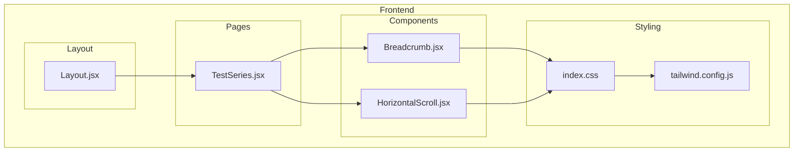
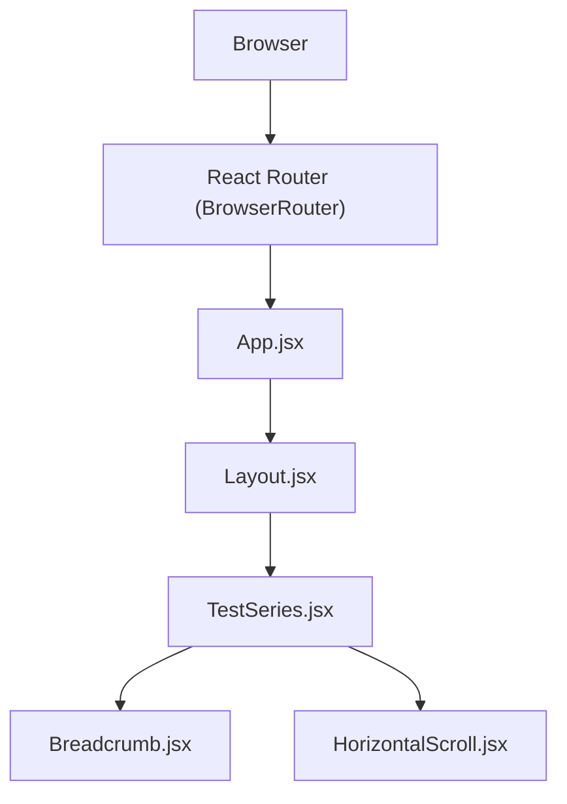
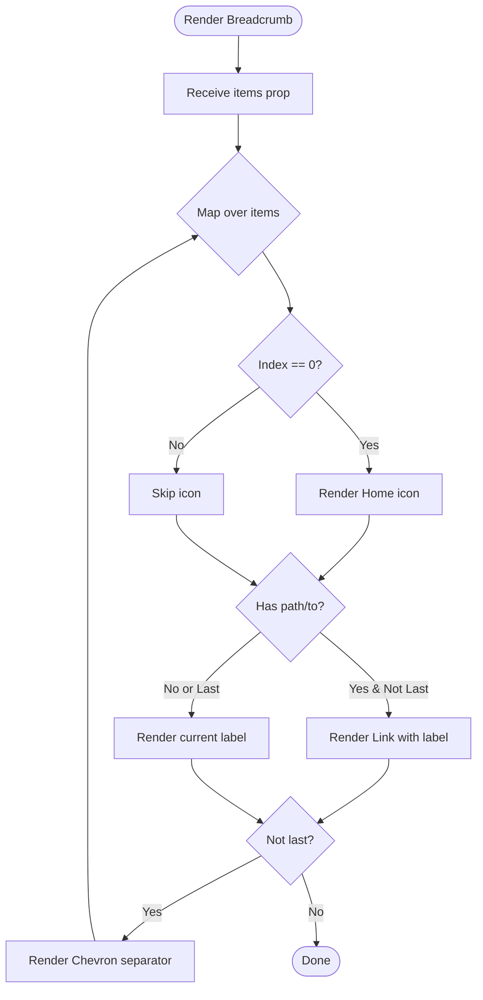
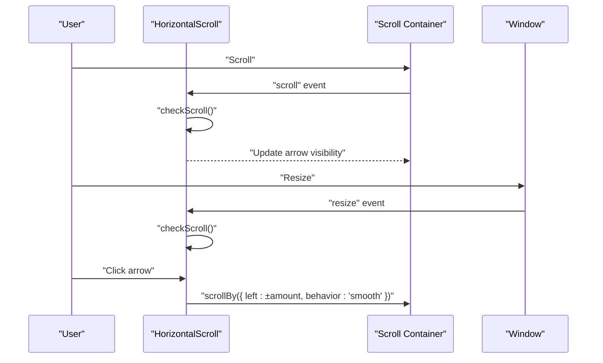
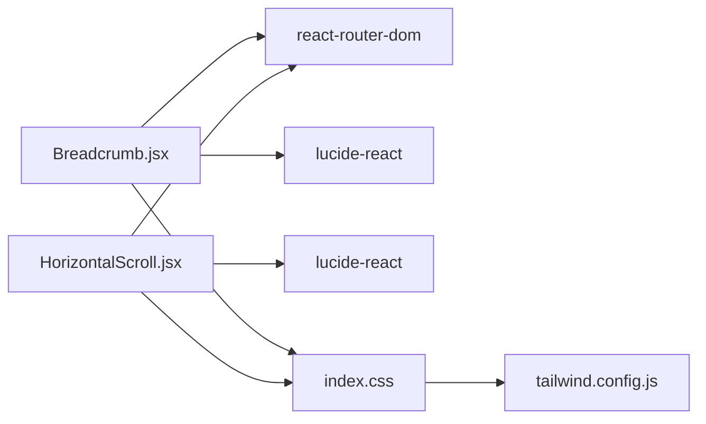

# Common UI Components

<cite>
**Referenced Files in This Document**
- [Breadcrumb.jsx](file://Frontend/src/components/common/Breadcrumb.jsx)
- [HorizontalScroll.jsx](file://Frontend/src/components/common/HorizontalScroll.jsx)
- [index.css](file://Frontend/src/styles/index.css)
- [tailwind.config.js](file://Frontend/tailwind.config.js)
- [TestSeries.jsx](file://Frontend/src/pages/TestSeries.jsx)
- [Layout.jsx](file://Frontend/src/components/layout/Layout.jsx)
- [App.jsx](file://Frontend/src/App.jsx)
- [main.jsx](file://Frontend/src/main.jsx)
- [HORIZONTAL_SCROLL_GUIDE.md](file://Documentation/HORIZONTAL_SCROLL_GUIDE.md)
</cite>

## Table of Contents
1. [Introduction](#introduction)
2. [Project Structure](#project-structure)
3. [Core Components](#core-components)
4. [Architecture Overview](#architecture-overview)
5. [Detailed Component Analysis](#detailed-component-analysis)
6. [Dependency Analysis](#dependency-analysis)
7. [Performance Considerations](#performance-considerations)
8. [Troubleshooting Guide](#troubleshooting-guide)
9. [Conclusion](#conclusion)

## Introduction
This document provides comprehensive documentation for Trstprep V2’s common reusable UI components, focusing on:
- Breadcrumb: navigation hierarchy display with dynamic generation, route-based navigation, and styling patterns.
- HorizontalScroll: a touch-friendly horizontal scrolling interface with smart arrows, gesture handling, and responsive design.

The guide explains component props, state management, styling approaches, accessibility features, integration patterns, usage examples, customization options, and performance optimization techniques for smooth scrolling experiences.

## Project Structure
The common UI components live under the frontend application and are integrated into pages and layouts:
- Breadcrumb and HorizontalScroll are located in the common components folder.
- Styles are centralized in Tailwind CSS and index.css, with brand-specific utilities and scrollbar hiding.
- The components are used within pages such as TestSeries and integrated via the main Layout.

**Diagram sources**
- [Breadcrumb.jsx](file://Frontend/src/components/common/Breadcrumb.jsx#L1-L39)
- [HorizontalScroll.jsx](file://Frontend/src/components/common/HorizontalScroll.jsx#L1-L89)
- [TestSeries.jsx](file://Frontend/src/pages/TestSeries.jsx#L1-L427)
- [Layout.jsx](file://Frontend/src/components/layout/Layout.jsx#L1-L87)
- [index.css](file://Frontend/src/styles/index.css#L1-L800)
- [tailwind.config.js](file://Frontend/tailwind.config.js#L1-L33)

**Section sources**
- [Breadcrumb.jsx](file://Frontend/src/components/common/Breadcrumb.jsx#L1-L39)
- [HorizontalScroll.jsx](file://Frontend/src/components/common/HorizontalScroll.jsx#L1-L89)
- [TestSeries.jsx](file://Frontend/src/pages/TestSeries.jsx#L1-L427)
- [Layout.jsx](file://Frontend/src/components/layout/Layout.jsx#L1-L87)
- [index.css](file://Frontend/src/styles/index.css#L1-L800)
- [tailwind.config.js](file://Frontend/tailwind.config.js#L1-L33)

## Core Components
This section documents the two primary reusable components and how they are used across the application.

### Breadcrumb
- Purpose: Display hierarchical navigation with home icon, separators, and clickable links leading to parent pages.
- Props:
  - items: array of breadcrumb entries with label and path/to fields.
- Behavior:
  - First item renders a home icon.
  - Non-last items render as navigable links.
  - Last item renders as plain text.
  - Separators are rendered between items except after the last item.
- Styling:
  - Uses brand color utilities and responsive typography.
  - Scrollbar is hidden for horizontal overflow.
- Accessibility:
  - Semantic nav element and link roles are implied by usage; consider adding explicit aria-labels if needed.

Usage example in TestSeries:
- The page passes a minimal items array containing Home and current page labels.

Integration pattern:
- Imported into pages and placed inside a white bordered header area for consistent UX.

**Section sources**
- [Breadcrumb.jsx](file://Frontend/src/components/common/Breadcrumb.jsx#L1-L39)
- [TestSeries.jsx](file://Frontend/src/pages/TestSeries.jsx#L117-L129)
- [index.css](file://Frontend/src/styles/index.css#L527-L560)

### HorizontalScroll
- Purpose: Provide a smooth, touch-friendly horizontal scrolling container with intelligent arrows and no visible scrollbars.
- Props:
  - children: nodes to render horizontally.
  - className: optional additional class for the scroll container.
- State and behavior:
  - Tracks scrollLeft, scrollWidth, and clientWidth to conditionally show left/right arrows.
  - Updates arrow visibility on scroll and window resize.
  - Provides programmatic scrollBy with smooth behavior.
- Gesture handling:
  - Smart arrows appear only when content can be scrolled.
  - Desktop drag-to-scroll and mouse wheel support are documented in the horizontal scroll guide.
- Styling:
  - Hides native scrollbars via CSS utilities and inline styles.
  - Includes responsive breakpoint for arrow visibility (hidden on mobile).
- Accessibility:
  - Buttons include aria-label attributes for screen readers.
  - Container can receive focus for keyboard navigation.

Usage example in TestSeries:
- Used around recent/enrolled series cards to enable horizontal swiping and clicking arrows to navigate.

Integration pattern:
- Wrapped around card lists to provide consistent horizontal navigation across pages.

**Section sources**
- [HorizontalScroll.jsx](file://Frontend/src/components/common/HorizontalScroll.jsx#L1-L89)
- [TestSeries.jsx](file://Frontend/src/pages/TestSeries.jsx#L155-L220)
- [HORIZONTAL_SCROLL_GUIDE.md](file://Documentation/HORIZONTAL_SCROLL_GUIDE.md#L1-L69)
- [index.css](file://Frontend/src/styles/index.css#L152-L169)

## Architecture Overview
The components integrate with the routing and layout system to provide consistent navigation and interaction patterns.

**Diagram sources**
- [main.jsx](file://Frontend/src/main.jsx#L1-L17)
- [App.jsx](file://Frontend/src/App.jsx#L1-L143)
- [Layout.jsx](file://Frontend/src/components/layout/Layout.jsx#L1-L87)
- [TestSeries.jsx](file://Frontend/src/pages/TestSeries.jsx#L1-L427)
- [Breadcrumb.jsx](file://Frontend/src/components/common/Breadcrumb.jsx#L1-L39)
- [HorizontalScroll.jsx](file://Frontend/src/components/common/HorizontalScroll.jsx#L1-L89)

## Detailed Component Analysis

### Breadcrumb Component
- Implementation highlights:
  - Receives items prop and maps over them to build the trail.
  - Determines whether to render a link or static text based on index and presence of path.
  - Applies home icon for the first item and chevron separators otherwise.
- Styling and theming:
  - Uses brand color utilities for links and current location emphasis.
  - Responsive typography and spacing for readability across devices.
- Accessibility considerations:
  - Add aria-label to the nav element if needed for screen readers.
  - Ensure link targets are meaningful and avoid empty paths.

**Diagram sources**
- [Breadcrumb.jsx](file://Frontend/src/components/common/Breadcrumb.jsx#L4-L36)

**Section sources**
- [Breadcrumb.jsx](file://Frontend/src/components/common/Breadcrumb.jsx#L1-L39)
- [index.css](file://Frontend/src/styles/index.css#L527-L560)

### HorizontalScroll Component
- Implementation highlights:
  - Uses refs and state to track scroll visibility and update arrows dynamically.
  - Adds event listeners for scroll and resize to keep arrows in sync with content.
  - Provides smooth scrollBy with fixed pixel increments per click.
  - Hides scrollbars via CSS utilities and inline styles.
- Interaction model:
  - Smart arrows appear only when content can be scrolled in that direction.
  - Desktop drag-to-scroll and mouse wheel horizontal scrolling are supported (see guide).
  - Mobile touch gestures enable swipe and fling behavior.

**Diagram sources**
- [HorizontalScroll.jsx](file://Frontend/src/components/common/HorizontalScroll.jsx#L15-L45)

**Section sources**
- [HorizontalScroll.jsx](file://Frontend/src/components/common/HorizontalScroll.jsx#L1-L89)
- [HORIZONTAL_SCROLL_GUIDE.md](file://Documentation/HORIZONTAL_SCROLL_GUIDE.md#L1-L69)
- [index.css](file://Frontend/src/styles/index.css#L152-L169)

### Usage Examples and Integration Patterns
- Breadcrumb:
  - Example usage in TestSeries page demonstrates passing a minimal items array with Home and current page labels.
  - Integrated within a white bordered header for consistent presentation.

- HorizontalScroll:
  - Example usage wraps recent/enrolled series cards to enable horizontal navigation.
  - Supports both desktop and mobile interactions seamlessly.

**Section sources**
- [TestSeries.jsx](file://Frontend/src/pages/TestSeries.jsx#L117-L129)
- [TestSeries.jsx](file://Frontend/src/pages/TestSeries.jsx#L155-L220)
- [TestSeries.jsx](file://Frontend/src/pages/TestSeries.jsx#L222-L264)

## Dependency Analysis
- Component dependencies:
  - Breadcrumb depends on react-router-dom for navigation and Lucide icons for visual elements.
  - HorizontalScroll depends on Lucide icons for arrow buttons and Tailwind utilities for styling.
- Styling dependencies:
  - Both components rely on shared CSS utilities for scrollbar hiding and brand colors.
  - Tailwind configuration extends brand colors and shadows for consistent theming.

**Diagram sources**
- [Breadcrumb.jsx](file://Frontend/src/components/common/Breadcrumb.jsx#L1-L3)
- [HorizontalScroll.jsx](file://Frontend/src/components/common/HorizontalScroll.jsx#L1-L2)
- [index.css](file://Frontend/src/styles/index.css#L1-L800)
- [tailwind.config.js](file://Frontend/tailwind.config.js#L1-L33)

**Section sources**
- [Breadcrumb.jsx](file://Frontend/src/components/common/Breadcrumb.jsx#L1-L39)
- [HorizontalScroll.jsx](file://Frontend/src/components/common/HorizontalScroll.jsx#L1-L89)
- [index.css](file://Frontend/src/styles/index.css#L1-L800)
- [tailwind.config.js](file://Frontend/tailwind.config.js#L1-L33)

## Performance Considerations
- HorizontalScroll:
  - Uses smooth scrollBy with fixed increments to maintain consistent pacing.
  - Event listeners are attached and cleaned up on mount/unmount to prevent memory leaks.
  - Scrollbar hiding avoids layout shifts and maintains a clean UI.
- Breadcrumb:
  - Minimal DOM rendering with simple mapping and conditional rendering.
  - Avoids heavy computations; suitable for frequent re-renders.
- General tips:
  - Prefer CSS transforms and hardware acceleration for smoother animations.
  - Debounce resize handlers if extending with additional logic.
  - Keep child nodes lightweight to minimize scroll container reflows.

[No sources needed since this section provides general guidance]

## Troubleshooting Guide
- HorizontalScroll arrows not appearing:
  - Ensure content exceeds container width so scrollWidth > clientWidth.
  - Verify event listeners are attached and cleanup runs properly on unmount.
- Scrollbars still visible:
  - Confirm CSS utilities for hiding scrollbars are applied and inline styles are set.
- Accessibility:
  - Add aria-labels to interactive elements if not present.
  - Ensure keyboard focus is managed for custom scroll containers.

**Section sources**
- [HorizontalScroll.jsx](file://Frontend/src/components/common/HorizontalScroll.jsx#L24-L35)
- [index.css](file://Frontend/src/styles/index.css#L152-L169)

## Conclusion
The Breadcrumb and HorizontalScroll components provide robust, accessible, and performant UI primitives for Trstprep V2. They integrate cleanly with the routing and layout system, offer responsive behavior, and can be easily customized through props and Tailwind utilities. Following the documented patterns ensures consistent navigation and interaction across the application.

*Last Updated: March 10, 2026 | Update date is (20:16)*
